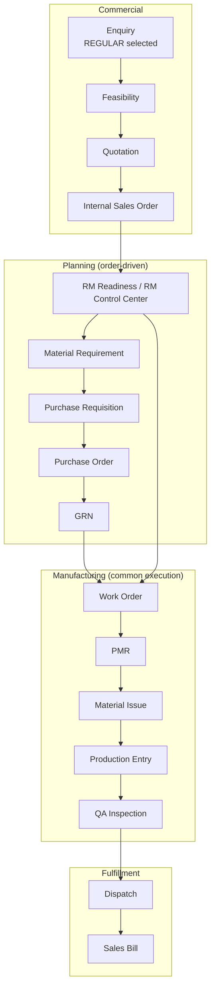
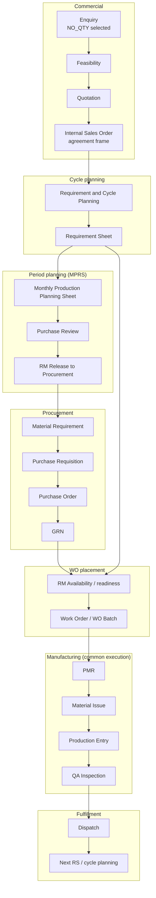
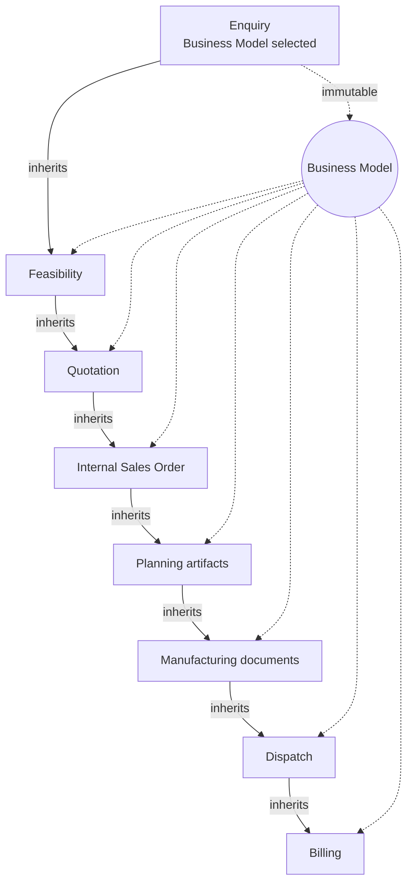
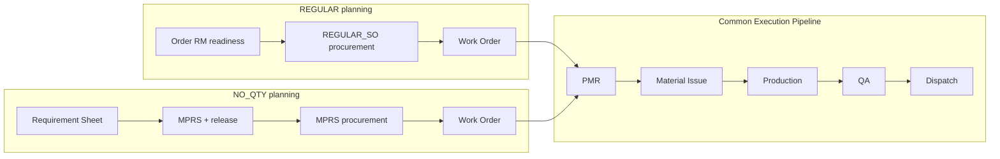

# Business Models & Document Inheritance

| Field | Value |
|-------|-------|
| **Document ID** | FT-PD-020 |
| **Volume** | 2 — Business Architecture |
| **Chapter** | 1 — Business Models & Document Inheritance |
| **Title** | Business Models & Document Inheritance |
| **Version** | 1.0.0 |
| **Status** | Draft — Architecture Review |
| **Effective date** | 2026-05-29 |
| **Author** | FT ERP Product Team |
| **Owner** | FT ERP Product Architecture |
| **Audience** | Product, workflow architects, implementation leads, domain authors |
| **Classification** | Product — Business Architecture |

**Parent documents:**

- [Volume 0 — Product Vision & Strategy](../00_Product_Vision_and_Strategy/Volume_0_Product_Vision_and_Strategy.md)
- [Chapter 2 — FT ERP Constitution](../01_Product_Foundation/Chapter_02_FT_ERP_Constitution.md)
- [Chapter 3 — Glossary & Standard Terminology](../01_Product_Foundation/Chapter_03_FT_ERP_Glossary_and_Standard_Terminology.md)
- [Chapter 4 — Product Design Principles](../01_Product_Foundation/Chapter_04_FT_ERP_Product_Design_Principles.md)

---

## 1. Document Control

| Version | Date | Author | Summary |
|---------|------|--------|---------|
| 1.0.0 | 2026-05-29 | FT ERP Product Team | Initial business architecture — two models, inheritance, convergence |

**Supersedes:** None (first Volume 2 chapter).

**Change authority:** Product Architecture. Changes to Business Model semantics require Constitution amendment (FT-PD-012 MAJOR) and Glossary update if terminology affected.

**Downstream consumers:** Volume 2 (subsequent chapters), Volume 3 (domain specs), Volume 4 (Workflow Engine), Volume 6 (UX routing).

---

## 2. Purpose

This chapter defines the **two official FT ERP Business Models** and explains how the model selected at **Enquiry** is **inherited** by every downstream controlled document through commercial, planning, manufacturing, dispatch, and billing life.

It is the **foundation of all workflow architecture** in FT ERP. Volume 4 (Workflow Engine) and Volume 3 (Domain Specifications) must implement this chapter—not reinterpret it.

---

## 3. Scope

### 3.1 In scope

- Business Model philosophy and immutability rules
- REGULAR Order and NO_QTY Agreement lifecycle architecture
- Document inheritance chain from Enquiry through Billing
- Customer Purchase Order (reference-only) rules
- Convergence into common **Execution Pipeline** after Work Order
- Business Rules and architecture review checklist

### 3.2 Out of scope

- Workflow state tables and transition matrices (Volume 4)
- Field-level document specifications (Volume 3)
- UI routes, screens, APIs, database schema
- Configuration parameters and Optional Module behavior
- Financial accounting policy detail

### 3.3 Terminology

All terms use definitions from [Chapter 3 — Glossary](../01_Product_Foundation/Chapter_03_FT_ERP_Glossary_and_Standard_Terminology.md). This chapter does not redefine official terms.

---

## 4. Relationship with the Constitution

| Constitution Article | This chapter implements |
|---------------------|-------------------------|
| **Art. 4 — Business Model Selection at Enquiry** | Sections 5–6; selection once at Enquiry |
| **Art. 5 — Business Model Inheritance** | Section 9; inheritance chain and immutability |
| **Art. 6 — Two Planning Pipelines** | Sections 6–8; separate planning paths |
| **Art. 7 — Planning and Execution Are Separate** | Planning stages in lifecycles; convergence only after WO |
| **Art. 8 — One Manufacturing Execution Pipeline** | Section 11; PMR → Dispatch common path |
| **Art. 15 — ERP-Controlled Documents** | Section 10; Customer PO excluded |

If implementation conflicts with this chapter, trace back to Constitution. Constitution prevails until formally amended.

---

## 5. Business Model Philosophy

### 5.1 Why two Business Models

Discrete manufacturers serve two fundamentally different commercial commitments:

1. **Fixed-quantity orders** — Customer orders a defined FG quantity by a defined commercial path. Planning and RM preparation align to that order quantity.
2. **Supply agreements without fixed order quantity** — Customer commits to a relationship and schedule pattern; quantities emerge over **Planning Cycles** and **monthly periods**. Planning is rolling and demand-driven.

A single planning and procurement model cannot serve both without cross-contamination (wrong RM demand pool, wrong WO preparation entry, wrong dispatch assumptions). FT ERP therefore defines two **first-class Business Models** selected at commercial inception.

### 5.2 Selected only once

Business Model is chosen at **Enquiry** because that is the first controlled document where commercial intent is captured. All later documents are **derivations** of that intent—not new commercial decisions.

Selecting the model once:

- Preserves audit trail from first customer contact to billing
- Enables Workflow Engine to branch pipelines deterministically
- Prevents operators from “switching” mid-life to escape material or planning discipline

### 5.3 Change prohibited after Enquiry

**Business Model is immutable** after Enquiry selection. Corrections require commercial reversal (cancel / new Enquiry)—not silent field edits on Internal Sales Order or planning documents.

**Rationale:** Downstream frozen artifacts (snapshots, Material Requirements, PMRs, Work Orders) embed model-specific semantics. Model change would orphan planning and material accountability.

---

## 6. REGULAR Order Business Model

### 6.1 Business purpose

**REGULAR Order** serves **fixed-quantity** customer manufacturing commitments. The Internal Sales Order lines define FG items and order quantities that drive RM readiness, Work Order preparation, and fulfillment toward dispatch and billing.

### 6.2 Planning philosophy

Planning is **order-quantity-driven**:

- RM need derives from order FG quantity × approved BOM (with buffers where configured)
- Procurement demand enters the **REGULAR_SO** demand pool
- Work Order preparation is tied to the specific Internal Sales Order
- Shortages are resolved in **order context** (RM readiness, RM Control Center cases, order-linked Material Requirements)

Planning does **not** use Requirement Sheet cycles or Monthly Production Planning Sheet (MPRS) as primary demand source.

### 6.3 Lifecycle domains

| Domain | REGULAR Order role |
|--------|-------------------|
| **Customer order (commercial)** | Captured in Quotation → **Internal Sales Order** with fixed FG lines and quantities |
| **Internal Sales Order** | ERP commercial anchor; inherits REGULAR; may hold Customer PO **reference** |
| **RM planning** | Order RM readiness; BOM explosion against order qty; RM Control Center for case management |
| **Purchase** | Material Requirement → Purchase Requisition → Purchase Order → GRN from **REGULAR_SO** pool |
| **Manufacturing** | Work Order (Store-owned creation) → PMR → Material Issue → Production Entry |
| **QA** | Inspection on Production Batch before release |
| **Dispatch** | FG shipment against order line / schedule commitment |
| **Billing** | Sales Bill linked to commercial completion |

### 6.4 REGULAR Order lifecycle diagram



---

## 7. NO_QTY Agreement Business Model

### 7.1 Business purpose

**NO_QTY Agreement** serves **long-term supply relationships** where FG quantity is **not fixed at order creation**. Customer schedules and internal planning cycles determine what to make, when to procure RM, and when to place Work Orders.

### 7.2 Planning philosophy — demand-driven, not quantity-driven

Planning is **demand-driven**:

- **Requirement Sheet (RS)** captures cycle-level FG schedule intent
- **Monthly Production Planning Sheet (MPRS)** consolidates period FG plan, Green Level logic, and RM Snapshot
- Purchase **reviews and approves** monthly plan before freeze
- Store **releases** frozen RM requirement to procurement (**MPRS** demand pool)
- **RM availability** and incoming supply inform WO placement—not a single fixed SO quantity

Quantities **emerge** from locked RS cycles and approved monthly production plans; they are not committed upfront on Internal Sales Order lines as the primary planning driver.

### 7.3 Lifecycle domains

| Domain | NO_QTY Agreement role |
|--------|----------------------|
| **Agreement (commercial)** | Enquiry → Feasibility → Quotation → Internal Sales Order as **agreement frame** (not fixed qty driver) |
| **Requirement Sheet** | Cycle planning document; schedule lines; execution wave source |
| **Monthly planning** | MPRS Workspace; Initial / Additional plans; purchase review; planning freeze |
| **Procurement** | RM released from monthly plan → Material Requirement in **MPRS** pool → PR → PO → GRN |
| **RM availability** | Material Availability views; incoming vs shortage; placement readiness |
| **WO placement** | Work Orders created from released RS balance when material/policy allow (WO Batch placement) |
| **Manufacturing** | Common execution: PMR → Material Issue → Production → QA |
| **Dispatch** | Against cycle / schedule fulfillment |
| **Billing** | Per commercial rules on agreement (Volume 3) |

### 7.4 NO_QTY Agreement lifecycle diagram



---

## 8. Business Model Comparison

| Dimension | REGULAR Order | NO_QTY Agreement |
|-----------|---------------|------------------|
| **Trigger** | Customer order with defined FG quantities | Supply agreement; quantities from cycles / periods |
| **Planning** | Order-driven RM readiness; order-linked explosion | RS cycles + MPRS; Green Level; rolling monthly freeze |
| **Procurement** | **REGULAR_SO** demand pool; order/MR-driven | **MPRS** demand pool; monthly plan release |
| **WO creation** | Prepare WO from order RM readiness path | WO placement from RS balance after release conditions |
| **Dispatch** | Against fixed order line fulfillment | Against cycle schedule / agreement fulfillment |
| **Billing** | Order-based Sales Bill pattern | Agreement / dispatch-driven billing pattern |
| **Typical industries** | Job orders, make-to-order components, export PO with fixed qty | Molding supply agreements, rolling schedules, call-off style supply |
| **Advantages** | Simple trace order → WO → dispatch; clear qty commitment | Handles rolling demand; period RM procurement; cycle history |

**Shared after Work Order:** PMR → Material Issue → Production Entry → QA Inspection → Dispatch (Execution Pipeline).

---

## 9. Document Inheritance

### 9.1 Inheritance principle

Every **ERP-controlled document** created after Enquiry **inherits** the Business Model of its Enquiry root. Inheritance is **automatic**—operators do not re-select the model on Quotation, Internal Sales Order, planning artifacts, Work Orders, or dispatch documents.

the Workflow Engine validates inheritance on create and transition. Documents with mismatched Business Model ancestry are rejected.

### 9.2 Inheritance chain



### 9.3 Planning artifacts by model

| Inherited artifact | REGULAR Order | NO_QTY Agreement |
|--------------------|---------------|------------------|
| Planning entry | Order RM readiness / WO prepare context | Requirement Sheet, MPRS |
| Procurement MR source | Order / WO planning, REGULAR_SO pool | Monthly plan release, MPRS pool |
| Work Order source | Internal Sales Order preparation | RS placement wave |
| Frozen RM artifacts | Order-scoped MR, PMR | Monthly Planning RM Snapshot, PMR |

### 9.4 Manufacturing and fulfillment inheritance

Work Order, PMR, Material Issue, Production Entry, QA Inspection, Dispatch Note, and Sales Bill **inherit** Business Model for:

- Trace labels and reporting filters
- Routing guards (wrong-flow prevention)
- Analytics segmentation (REGULAR vs NO_QTY factory metrics)

Execution **behavior** is common; **context and planning ancestry** differ.

---

## 10. Customer Purchase Order

### 10.1 What it is

**Customer Purchase Order (Reference only)** — external commercial identifier or document supplied by the customer, stored as **reference metadata** on Internal Sales Order (and optionally on downstream commercial views).

### 10.2 What it is not

Customer PO is **never**:

| Prohibited role | Why |
|-----------------|-----|
| ERP workflow document | No Workflow State, ownership, or Pending Actions |
| Manufacturing driver | Does not create Work Orders, PMR, or production |
| Planning trigger | Does not replace RS or order RM planning |
| Dispatch authority | Dispatch follows ERP QA-released stock and Internal Sales Order |
| Business Model selector | Model is fixed at Enquiry only |

### 10.3 Allowed uses

- Matching customer paperwork to Internal Sales Order
- Display on dispatch documentation and billing export
- Search and filter for commercial operators
- Audit reference in disputes

Operators may **record or update** Customer PO reference without advancing manufacturing workflow.

---

## 11. Convergence into Manufacturing

### 11.1 Divergence ends at Work Order

REGULAR and NO_QTY differ in **commercial framing** and **planning pipelines**. Once a **Work Order** exists, both models enter the **same Execution Pipeline** defined in Constitution Article 8 and Glossary (*Execution Pipeline*).

### 11.2 Common execution sequence

```
Work Order
  → PMR (Production Material Request) — frozen RM for WO
  → Material Issue — Store to production location
  → Production Entry — shop-floor output
  → QA Inspection — accept / reject / rework / scrap
  → Dispatch — FG to customer
```

### 11.3 Convergence diagram



### 11.4 Post-dispatch divergence (NO_QTY only)

After dispatch, **NO_QTY Agreement** returns to **cycle planning** (next Requirement Sheet / continued MPRS). **REGULAR Order** tends toward **commercial completion** on the order. This is lifecycle continuation—not a second execution pipeline.

### 11.5 Design implications

- Production RM readiness, PMR gates, and QA rules are implemented **once** in Core Product.
- Procurement and planning Workspaces remain **segregated** by demand pool.
- Wrong-flow UX blocks REGULAR operators on NO_QTY planning routes and vice versa, while allowing shared production and dispatch Workspaces.

---

## 12. Business Rules

| ID | Rule |
|----|------|
| **BM-01** | Business Model is selected **only** at Enquiry. |
| **BM-02** | Business Model is **immutable** after Enquiry; no downstream override. |
| **BM-03** | **No mixed pipelines** — a document chain has exactly one Business Model. |
| **BM-04** | Feasibility, Quotation, Internal Sales Order, planning, manufacturing, dispatch, and billing **inherit** Enquiry Business Model automatically. |
| **BM-05** | Workflow Engine **validates** inheritance on document create and on cross-document links. |
| **BM-06** | Customer PO is **reference only**; it never advances Workflow State. |
| **BM-07** | REGULAR planning must not create MPRS-primary demand except via explicit cross-model error paths (none permitted). |
| **BM-08** | NO_QTY planning must not use REGULAR-only WO preparation as primary entry. |
| **BM-09** | Procurement demand pools **segregate** REGULAR_SO vs MPRS vs STOCK_REPLENISHMENT. |
| **BM-10** | After Work Order creation, **Execution Pipeline** is identical for both models. |
| **BM-11** | PMR and production gates use **frozen** planning artifacts; no model-specific bypass. |
| **BM-12** | Reports and Control Tower **segment** by inherited Business Model where operational context matters. |
| **BM-13** | Pending Actions **respect** model-specific planning ownership; execution actions use common ownership matrix. |
| **BM-14** | Optional Modules and Configuration **must not** blur Business Model boundaries in Core. |
| **BM-15** | New document types must declare **compatible Business Model(s)** before Approval in Volume 3. |

---

## 13. Review Checklist

- [ ] Only two Business Models defined; no third path without constitutional amendment
- [ ] Selection at Enquiry only; immutability stated
- [ ] Inheritance chain matches Constitution Article 5 list
- [ ] Customer PO rules explicit and match Article 15
- [ ] REGULAR and NO_QTY planning paths distinct (Article 6)
- [ ] Convergence at Work Order into Execution Pipeline (Article 8)
- [ ] Glossary terms used without redefinition
- [ ] Lifecycle diagrams present for both models
- [ ] Inheritance diagram present
- [ ] No UI, API, schema, or client references
- [ ] Business Rules table complete for Volume 4 handoff
- [ ] Volume 3 domain chapters can reference BM-xx rules

---

## 14. Change Log

| Version | Date | Author | Summary |
|---------|------|--------|---------|
| 1.0.0 | 2026-05-29 | FT ERP Product Team | Initial Volume 2 Ch.1 — models, inheritance, convergence |

---

## 15. Approval Block

| Role | Name | Signature | Date |
|------|------|-----------|------|
| Product Owner | | | |
| Product Architecture | | | |
| Workflow Architect | | | |
| Implementation Lead | | | |

**Status after approval:** Volume 4 and Volume 3 planning/commercial domains must align before workflow implementation diverges from this chapter.

---

## Document navigation

| | Link |
|--|------|
| **Previous** | [FT ERP Product Design Principles](../01_Product_Foundation/Chapter_04_FT_ERP_Product_Design_Principles.md) (FT-PD-014) |
| **Next** | [REGULAR Order Planning Pipeline](./Chapter_02_REGULAR_Order_Planning_Pipeline.md) (FT-PD-021) |
| **Volume** | [Business Architecture](./README.md) |
| **Product** | [Product Documentation Index](../README.md) |

