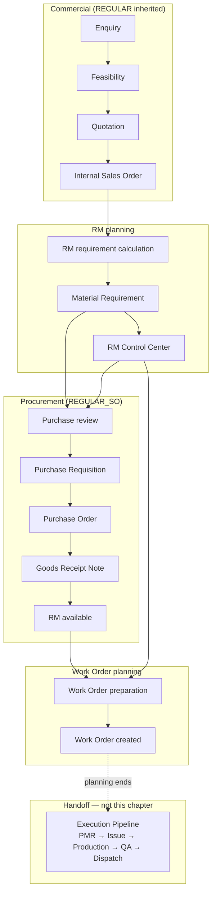

# REGULAR Order Planning Pipeline

| Field | Value |
|-------|-------|
| **Document ID** | FT-PD-021 |
| **Volume** | 2 — Business Architecture |
| **Chapter** | 2 — REGULAR Order Planning Pipeline |
| **Title** | REGULAR Order Planning Pipeline |
| **Version** | 1.0.0 |
| **Status** | Draft — Architecture Review |
| **Effective date** | 2026-05-29 |
| **Author** | FT ERP Product Team |
| **Owner** | FT ERP Product Architecture |
| **Audience** | Product, workflow architects, implementation leads, Store/Purchase process owners |
| **Classification** | Product — Business Architecture |

**Parent documents:**

- [Chapter 1 — Business Models & Document Inheritance](./Chapter_01_Business_Models_and_Document_Inheritance.md)
- [Chapter 2 — FT ERP Constitution](../01_Product_Foundation/Chapter_02_FT_ERP_Constitution.md)
- [Chapter 3 — Glossary](../01_Product_Foundation/Chapter_03_FT_ERP_Glossary_and_Standard_Terminology.md)

---

## 1. Document Control

| Version | Date | Author | Summary |
|---------|------|--------|---------|
| 1.0.0 | 2026-05-29 | FT ERP Product Team | Initial REGULAR planning pipeline — commercial through Work Order creation |

**Supersedes:** None.

**Change authority:** Product Architecture. Pipeline stage or ownership changes require Constitution compliance review and Volume 4 alignment.

**Out of scope for this chapter:** PMR, Material Issue, Production, QA, Dispatch (Volume 2, Chapter 4 — Manufacturing Execution Pipeline).

---

## 2. Purpose

This chapter documents the **complete REGULAR Order planning pipeline**—from commercial inception through **Work Order creation**.

It explains **planning only**: how fixed customer quantity becomes RM demand, how procurement fills shortages, how readiness is validated, and how Store creates Work Orders. Manufacturing **execution** begins after Work Order and is documented separately.

---

## 3. Scope

### 3.1 In scope

- REGULAR planning philosophy and stages (commercial + planning)
- RM Control Center role in order context
- REGULAR_SO procurement integration
- Work Order readiness and creation (planning terminus)
- Pending Actions and Control Tower visibility for planning phase
- Planning Business Rules

### 3.2 Out of scope

- NO_QTY Agreement planning (Volume 2, Chapter 3)
- Post–Work Order Execution Pipeline (Volume 2, Chapter 4)
- Workflow state tables (Volume 4)
- Document field specs (Volume 3)
- UI, API, database

### 3.3 Terminology

Uses [Glossary](../01_Product_Foundation/Chapter_03_FT_ERP_Glossary_and_Standard_Terminology.md) terms only. **Internal Sales Order** — not “Sales Order.”

---

## 4. Relationship with Constitution & Business Models

| Source | Application in this chapter |
|--------|----------------------------|
| **Art. 4–5** — Business Model at Enquiry, inheritance | Entire pipeline assumes **REGULAR Order** inherited from Enquiry |
| **Art. 6** — Two planning pipelines | REGULAR order-driven path only; no MPRS-primary planning |
| **Art. 7** — Planning ≠ execution | Pipeline ends at Work Order; no PMR/issue/production |
| **Art. 8** — Common execution after WO | WO creation is handoff point to Chapter 4 |
| **Art. 9** — Material accountability | MR → PR → PO → GRN chain before WO |
| **Art. 10** — Document ownership | Store WO creation; Purchase PR/PO; Store GRN |
| **Ch. 1 §6** — REGULAR lifecycle | This chapter expands planning portion |

---

## 5. REGULAR Planning Philosophy

### 5.1 Fixed customer quantity

REGULAR planning anchors on **committed FG quantities** on Internal Sales Order lines. RM requirement is derived from order quantity × approved BOM (including configured production buffer where applicable)—not from rolling monthly schedules.

### 5.2 RM readiness before production

The factory cannot produce reliably without known RM position. REGULAR planning prioritizes **RM readiness**—free stock, reservations, incoming PO/GRN, and documented shortages—before Work Order creation.

### 5.3 Demand-driven procurement

Procurement is triggered by **documented shortage** against order need (Material Requirement), not by blanket buying. Demand aggregates in the **REGULAR_SO** procurement pool for Purchase execution.

### 5.4 No production without RM availability

Work Orders are created only when planning validates RM position per Business Rules (full or proportional readiness—see Section 9). **Execution** (PMR/issue/production) remains gated separately in the Execution Pipeline.

### 5.5 Planning never starts execution

Approving Quotation, raising MR, receiving GRN, or creating Work Order does **not** issue material to production or post production output. Those are execution documents (Chapter 4).

---

## 6. Complete REGULAR Planning Pipeline

The pipeline spans **commercial** documents (inherit REGULAR) and **planning** stages (order-driven RM and WO preparation).

| Stage | Owner (default) | Planning output |
|-------|-----------------|-----------------|
| **Enquiry** | Admin / commercial | Business Model = REGULAR Order |
| **Feasibility** | Admin / commercial | Feasibility decision; inherited REGULAR |
| **Quotation** | Admin / commercial | Commercial offer with FG qty |
| **Internal Sales Order** | Admin / commercial | Committed order qty; optional Customer PO reference |
| **RM requirement calculation** | Store / planning | Order RM need (BOM explosion, buffer, gap vs stock) |
| **Material Requirement (MR)** | Store | Documented RM shortage for procurement |
| **RM Control Center** | Store | Case management, coverage, escalation |
| **Purchase review** | Purchase | PR queue assessment; PO preparation readiness |
| **Purchase Requisition (PR)** | Store | Handoff to Purchase (REGULAR_SO pool) |
| **Purchase Order (PO)** | Purchase | Supplier order |
| **Goods Receipt (GRN)** | Store | RM into stock |
| **RM available** | System Read Model | Updated availability after receipt |
| **Work Order preparation** | Store | Readiness validation, suggested WO qty |
| **Work Order creation** | Store | **Planning terminus** — execution starts next |

*Note:* **Purchase review** in REGULAR means Purchase’s assessment of **procurement execution** (PR → PO), not Monthly Production Plan approval (NO_QTY only).

### 6.1 Stage narratives

**Commercial chain (Enquiry → Internal Sales Order)**  
Establishes REGULAR inheritance and fixed FG lines. Customer Purchase Order may be recorded as **reference only** on Internal Sales Order— it does not start planning.

**RM requirement calculation**  
Explodes approved BOM for order FG quantities; compares required RM to free/available stock and incoming supply; identifies gaps. May use order production Planning Snapshot (buffered FG-to-produce intent) as planning input.

**Material Requirement**  
Store raises MR for consolidated RM shortage linked to Internal Sales Order / work order planning context. MR enters **REGULAR_SO** demand pool when approved for procurement.

**RM Control Center**  
Operational workspace for REGULAR RM **cases**—shortage, allocation, incoming PO, readiness for WO prepare—without mixing NO_QTY or MPRS demand.

**Purchase review → PR → PO → GRN**  
Store creates Purchase Requisition from MR; Purchase converts PR to PO; Store posts GRN. Availability Read Model updates for planning decisions.

**Work Order preparation → Work Order creation**  
Store validates RM readiness, determines preparable quantity (full or proportional), creates Work Order. **Planning ends here.**

---

## 7. RM Control Center

### 7.1 Purpose

**RM Control Center** is the Store-owned **operational diagnosis and handoff workspace** for REGULAR order RM cases—linking Internal Sales Order, work order planning context, shortage, procurement stage, and WO prepare readiness in one case-oriented view.

It is **not** the Control Tower (factory monitor) and **not** the Procurement Workspace (PR/PO execution desk).

### 7.2 Responsibilities

| Responsibility | Description |
|----------------|-------------|
| Shortage visibility | Per FG line / WO context: required vs free vs incoming RM |
| Procurement continuity | Stage awareness: awaiting MR, PR, PO, GRN |
| Allocation guidance | Direct Store to issue-eligible stock or raise MR |
| WO prepare handoff | Indicate when RM supports full or partial WO creation |
| Wrong-flow Guard | Block NO_QTY / MPRS-primary narratives on REGULAR cases |

### 7.3 Statuses (planning-oriented)

Statuses are presentation of engine-normalized procurement and readiness keys, including:

| Status family | Meaning (planning) |
|---------------|-------------------|
| **Shortage / awaiting MR** | RM gap documented; MR not yet raised or approved |
| **Awaiting PR** | MR approved; Purchase Requisition pending |
| **Awaiting PO** | PR created; Purchase PO preparation pending |
| **Awaiting GRN** | PO placed; inbound material not yet received |
| **Incoming covers shortage** | PO/GRN pipeline will cover gap; WO may wait or partial |
| **Ready for WO prepare** | RM validation supports WO creation (full or partial) |
| **Blocked** | BOM missing, duplicate MR resolved, or policy block |

Exact state keys are specified in Volume 4.

### 7.4 Coverage calculation

**Coverage** expresses how much of order RM need is satisfied by:

- Free available stock (unreserved)
- Stock allocated to this order context
- Incoming quantity (open PO/GRN pipeline)

Coverage informs **suggested Work Order quantity**—not production permission (execution gates apply after WO).

### 7.5 Exception handling

| Exception | Handling |
|-----------|----------|
| BOM missing / child BOM missing | Block MR and WO; Pending Action to maintain BOM |
| Duplicate MR for same case | Cancel duplicate; retain active MR |
| MR closed with unresolved shortage | Reopen or raise new MR; case stays visible |
| Partial GRN | Coverage recalculates; partial WO may be suggested |
| Customer PO mismatch | Commercial reference only—does not alter RM math |

---

## 8. Procurement Integration

### 8.1 REGULAR_SO procurement pool

All REGULAR order-linked Material Requirements consolidate under demand pool **REGULAR_SO** (sources: Internal Sales Order / work order planning MRs—not MONTHLY_PLAN).

Procurement Workspace segregates REGULAR_SO from **MPRS** and **STOCK_REPLENISHMENT**. Mixed-source Purchase Requisitions are prohibited.

### 8.2 Purchase ownership

| Activity | Owner |
|----------|-------|
| Raise / approve MR for order shortage | Store |
| Create Purchase Requisition from MR | Store (REGULAR standard) |
| Prepare Purchase Order, supplier commercial | Purchase |
| Post GRN | Store |

**Purchase review** stage: Purchase monitors REGULAR_SO queue for PRs awaiting PO—Dashboard Pending Actions and Procurement Workspace.

### 8.3 GRN completion

Store posts **Goods Receipt Note** against PO lines. Stock Ledger increases usable RM. Reservations and Material Availability recompute.

### 8.4 RM availability update

After GRN, **Material Availability** and RM Control Center coverage refresh automatically—no manual “refresh planning” step. WO preparation reads current availability on next evaluation.

---

## 9. Work Order Readiness

### 9.1 RM validation

Before Work Order creation, planning validates:

- Approved BOM exists for FG items
- RM coverage meets policy for intended WO quantity (stock + allocated + approved incoming where policy allows)
- No blocking open MR/procurement conflict for the case
- Internal Sales Order remains open and REGULAR-inherited

### 9.2 Partial RM handling

When RM covers **less than 100%** of order FG preparable quantity but policy allows partial start:

- **Suggested WO quantity** = proportionally reduced preparable FG qty
- Store may create WO for partial qty
- Remaining order balance stays in planning until RM arrives
- Execution Pipeline will gate production on **issued** PMR qty later—not this planning step alone

### 9.3 Suggested WO quantity

Derived from minimum of:

- Remaining order FG quantity (not yet on open WO)
- RM-readiness-constrained FG capacity from coverage calculation
- Policy buffers and duplicate-WO guards

Suggestion is advisory; Store confirms on creation.

### 9.4 Store ownership

**Work Order creation** is Store responsibility in Product Standard (Constitution Art. 10; configurable in future per Art. 20).

### 9.5 Planning ends after Work Order creation

Work Order is the **handoff artifact** to Manufacturing Execution Pipeline:

- Next: PMR → Material Issue → Production Entry → QA → Dispatch (Chapter 4)
- REGULAR planning artifacts (MR, snapshot, case) remain trace references; execution uses PMR freeze

---

## 10. Pending Actions

Pending Actions are **Workflow Engine outputs only** (Constitution Art. 12). Representative REGULAR **planning-phase** actions by role:

### 10.1 Store

| Pending Action (examples) | Trigger context |
|---------------------------|-----------------|
| Complete RM readiness / open RM Control Center | Shortage detected on order |
| Raise or review Material Requirement | Coverage gap with no active MR |
| Create Purchase Requisition | MR approved; awaiting PR |
| Post GRN | PO line pending receipt |
| Prepare Work Order | RM readiness supports WO qty |
| Create Work Order | Preparation complete |

### 10.2 Purchase

| Pending Action (examples) | Trigger context |
|---------------------------|-----------------|
| Prepare RM PO | PR in REGULAR_SO pool awaiting PO |
| Waiting for Store (read-only monitor) | GRN pending Store post |
| Review procurement queue | Exception aging in REGULAR_SO |

*REGULAR does not generate Monthly Production Plan “Review plan” actions (NO_QTY only).*

### 10.3 Admin

| Pending Action (examples) | Trigger context |
|---------------------------|-----------------|
| Complete Feasibility / Quotation | Commercial pipeline |
| Commercial hold resolution | Credit or contract blocker |
| BOM master maintenance | Planning blocked for missing BOM |

---

## 11. Control Tower Visibility

Control Tower (**Factory Work**) surfaces REGULAR planning exceptions without replacing Dashboard tasks.

| Visibility theme | What managers see |
|------------------|-------------------|
| **Planning bottlenecks** | Orders with MR/PR/PO/GRN aging beyond threshold |
| **RM shortages** | Open REGULAR cases with net shortage after incoming |
| **Procurement delays** | PR_PENDING_PO, GRN_PENDING aggregates by order |
| **WO waiting list** | Orders ready or partially ready for WO not yet created |
| **Owner** | Store vs Purchase per stage |
| **Recommended action** | Engine-normalized next step with deep link |

Control Tower does not execute Store/Purchase actions; it escalates visibility.

---

## 12. Business Rules

| ID | Rule |
|----|------|
| **RPL-01** | Pipeline applies only when inherited Business Model = **REGULAR Order**. |
| **RPL-02** | Planning is driven by **Internal Sales Order FG quantity**, not MPRS or Requirement Sheet. |
| **RPL-03** | **No Work Order** without RM validation passing policy for intended qty. |
| **RPL-04** | **Partial RM** may justify **proportional** suggested WO quantity—not full order qty. |
| **RPL-05** | **Planning never starts execution**—no PMR/issue/production at MR/GRN/WO create. |
| **RPL-06** | Procurement **must not mix** REGULAR_SO with MPRS in one Purchase Requisition. |
| **RPL-07** | MR for REGULAR must use REGULAR_SO-compatible source types only. |
| **RPL-08** | **RM availability** recalculates from Stock Ledger after GRN—planning reads current availability. |
| **RPL-09** | **Customer PO** never triggers MR, WO, or procurement. |
| **RPL-10** | **Purchase review** on REGULAR means PR/PO execution review—not monthly plan approval. |
| **RPL-11** | WO creation **terminates** REGULAR planning responsibility for that preparable qty; execution rules take over. |
| **RPL-12** | Duplicate active MR for same procurement case is **consolidated**—not parallel PR paths. |
| **RPL-13** | Pending Actions for planning **must** cite document reference and owner role. |
| **RPL-14** | NO_QTY planning entry points **must not** appear as primary path for REGULAR orders. |

---

## 13. Lifecycle Diagram

---

## 14. Review Checklist

- [ ] Planning-only scope; execution deferred to Chapter 4
- [ ] REGULAR inheritance from Chapter 1 preserved
- [ ] Glossary terms used; Internal Sales Order not shortened
- [ ] Customer PO reference-only reiterated
- [ ] REGULAR_SO vs MPRS segregation explicit
- [ ] Purchase review distinguished from NO_QTY monthly plan review
- [ ] RM Control Center purpose distinct from Control Tower and Procurement Workspace
- [ ] Store WO ownership and partial WO rule documented
- [ ] Pending Actions engine-sourced; role examples given
- [ ] Business Rules RPL-01–RPL-14 complete
- [ ] Lifecycle mermaid diagram included
- [ ] No UI, API, schema, or implementation detail

---

## 15. Change Log

| Version | Date | Author | Summary |
|---------|------|--------|---------|
| 1.0.0 | 2026-05-29 | FT ERP Product Team | Initial REGULAR Order planning pipeline |

---

## 16. Approval Block

| Role | Name | Signature | Date |
|------|------|-----------|------|
| Product Owner | | | |
| Product Architecture | | | |
| Store Process Owner | | | |
| Purchase Process Owner | | | |

---

## Document navigation

| | Link |
|--|------|
| **Previous** | [Business Models & Document Inheritance](./Chapter_01_Business_Models_and_Document_Inheritance.md) (FT-PD-020) |
| **Next** | [NO_QTY Agreement Planning Pipeline](./Chapter_03_NO_QTY_Agreement_Planning_Pipeline.md) (FT-PD-022) |
| **Volume** | [Business Architecture](./README.md) |
| **Product** | [Product Documentation Index](../README.md) |

