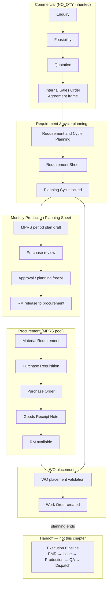

# NO_QTY Agreement Planning Pipeline

| Field | Value |
|-------|-------|
| **Document ID** | FT-PD-022 |
| **Volume** | 2 — Business Architecture |
| **Chapter** | 3 — NO_QTY Agreement Planning Pipeline |
| **Title** | NO_QTY Agreement Planning Pipeline |
| **Version** | 1.0.0 |
| **Status** | Draft — Architecture Review |
| **Effective date** | 2026-05-29 |
| **Author** | FT ERP Product Team |
| **Owner** | FT ERP Product Architecture |
| **Audience** | Product, workflow architects, implementation leads, Store/Purchase process owners |
| **Classification** | Product — Business Architecture |

**Parent documents:**

- [Chapter 1 — Business Models & Document Inheritance](./Chapter_01_Business_Models_and_Document_Inheritance.md)
- [Chapter 2 — REGULAR Order Planning Pipeline](./Chapter_02_REGULAR_Order_Planning_Pipeline.md)
- [Chapter 2 — FT ERP Constitution](../01_Product_Foundation/Chapter_02_FT_ERP_Constitution.md)
- [Chapter 3 — Glossary](../01_Product_Foundation/Chapter_03_FT_ERP_Glossary_and_Standard_Terminology.md)

---

## 1. Document Control

| Version | Date | Author | Summary |
|---------|------|--------|---------|
| 1.0.0 | 2026-05-29 | FT ERP Product Team | Initial NO_QTY planning pipeline — agreement through Work Order creation |

**Supersedes:** None.

**Change authority:** Product Architecture. Changes affecting MPRS semantics or RS placement require Constitution compliance review and Volume 4 alignment.

**Out of scope for this chapter:** PMR, Material Issue, Production, QA, Dispatch, next-cycle replanning detail after dispatch (Volume 2, Chapter 4; cycle continuation in Volume 3).

---

## 2. Purpose

This chapter documents the **complete NO_QTY Agreement planning pipeline**—from commercial agreement through **Work Order creation**.

It explains **planning only**: how rolling customer demand becomes Requirement Sheet cycles, how **Monthly Production Planning Sheet (MPRS)** drives period procurement, how RM availability enables **WO placement**, and where planning **ends** at Work Order creation.

Manufacturing **execution** begins after Work Order and is documented in Volume 2, Chapter 4.

---

## 3. Scope

### 3.1 In scope

- NO_QTY planning philosophy and contrast with REGULAR
- Full planning pipeline stages (commercial + planning)
- Requirement Sheet and Planning Cycle behavior
- MPRS approval, freeze, and RM release
- MPRS procurement integration
- WO placement and creation
- Pending Actions and Control Tower for NO_QTY planning
- Planning Business Rules

### 3.2 Out of scope

- REGULAR Order planning ([Chapter 2](./Chapter_02_REGULAR_Order_Planning_Pipeline.md))
- Post–Work Order Execution Pipeline (Chapter 4)
- RM Control Center as primary REGULAR workspace (mentioned only for wrong-flow contrast)
- Workflow state matrices (Volume 4)
- Field-level specs (Volume 3)
- UI, API, database

### 3.3 Terminology

Uses [Glossary](../01_Product_Foundation/Chapter_03_FT_ERP_Glossary_and_Standard_Terminology.md) terms. **NO_QTY Agreement** — not “No Qty SO” in specifications.

---

## 4. Relationship with Constitution & Business Models

| Source | Application in this chapter |
|--------|----------------------------|
| **Art. 4 — Business Model Selection at Enquiry** | Pipeline requires **NO_QTY Agreement** selected once at Enquiry |
| **Art. 5 — Business Model Inheritance** | All stages inherit NO_QTY from commercial chain |
| **Art. 6 — Two Planning Pipelines** | NO_QTY path only; no REGULAR_SO-primary planning |
| **Art. 7 — Planning vs Execution** | RS/MPRS/GRN/release do not start production; WO creation does not issue RM |
| **Art. 8 — One Manufacturing Pipeline** | WO creation hands off to common execution (Chapter 4) |
| **Ch. 1 §7** | NO_QTY lifecycle architecture |
| **Ch. 2** | Contrast reference for REGULAR differences |

---

## 5. NO_QTY Planning Philosophy

### 5.1 Quantity not fixed at agreement stage

**Internal Sales Order** under NO_QTY Agreement establishes the **commercial frame**—customer, terms, FG scope—not a fixed manufacturing quantity for the full agreement life. Quantities materialize in **Requirement Sheet** schedules and **MPRS** period plans.

*Contrast REGULAR:* Internal Sales Order lines commit fixed FG qty up front ([Chapter 2](./Chapter_02_REGULAR_Order_Planning_Pipeline.md) §5.1).

### 5.2 Demand-driven planning

Planning follows **actual and projected demand** (customer schedule, locked RS cycles, Green Level, carry forward)—not a single order-quantity explosion at SO creation.

### 5.3 Manufacturing follows Requirement Sheets

**Requirement Sheet (RS)** is the operational demand capture for a **Planning Cycle**. Work Orders are placed against **RS balance** when RM and policy allow—not directly from monthly plan lines.

### 5.4 Monthly planning drives procurement

**Monthly Production Planning Sheet (MPRS)** consolidates period FG intent and freezes RM requirement after **Purchase review** and **approval**. **RM release** publishes procurement demand to the **MPRS** pool—decoupling long-cycle RS from period-based buying.

*Contrast REGULAR:* Procurement driven by order-linked Material Requirement in **REGULAR_SO** pool without monthly plan document.

### 5.5 Procurement enables future Work Orders

Procurement from MPRS builds **RM availability** that enables future **WO placement** from RS—it does not by itself create Work Orders or start production.

---

## 6. Complete NO_QTY Planning Pipeline

| Stage | Owner (default) | Planning output |
|-------|-----------------|-----------------|
| **Enquiry** | Admin / commercial | Business Model = NO_QTY Agreement |
| **Feasibility** | Admin / commercial | Feasibility decision |
| **Quotation** | Admin / commercial | Commercial offer (agreement terms) |
| **Internal Sales Order (Agreement)** | Admin / commercial | Agreement frame; inherited NO_QTY |
| **Requirement Sheet** | Store | Cycle demand lines (FG schedule) |
| **Planning Cycle** | Store | Locked RS execution window |
| **Monthly Production Planning Sheet (MPRS)** | Store draft; Purchase review | Period FG plan; RM estimate |
| **Purchase review** | Purchase | Plan scrutiny before approval |
| **Approval** | Purchase | **Planning freeze** — RM Snapshot |
| **RM release** | Store | Procurement demand published (MPRS pool) |
| **Purchase Requisition** | Purchase | PR from MPRS Material Requirement |
| **Purchase Order** | Purchase | Supplier order |
| **Goods Receipt** | Store | RM into stock |
| **RM available** | System Read Model | Availability refresh |
| **WO placement** | Store | Validate RS balance vs RM |
| **Work Order creation** | Store | **Planning terminus** |

### 6.1 Stage narratives

**Commercial (Enquiry → Internal Sales Order)**  
Selects and inherits NO_QTY Agreement. Internal Sales Order is **agreement frame**—not primary qty driver for MPRS.

**Requirement Sheet & Planning Cycle**  
Store captures schedule/requirement lines per cycle. Locked RS becomes execution authority for WO placement quantity.

**MPRS → Purchase review → Approval**  
Store completes period FG plan. Purchase reviews (`AWAITING_PURCHASE_REVIEW` equivalent). Approval freezes plan and creates **Monthly Planning RM Snapshot**.

**RM release**  
Store releases frozen RM requirement to procurement—explicit handoff; **does not** create Work Orders.

**Procurement (MPRS pool)**  
Material Requirement in **MPRS** pool → Purchase creates PR → PO → Store GRN → availability refresh.

**WO placement → Work Order creation**  
When RS balance and RM readiness align, Store places one or more Work Orders (possibly **WO Batch**). Planning ends.

### 6.2 Contrast with REGULAR (summary)

| Dimension | REGULAR ([Ch. 2](./Chapter_02_REGULAR_Order_Planning_Pipeline.md)) | NO_QTY (this chapter) |
|-----------|---------------------------------------------------------------------|------------------------|
| Qty driver | Internal Sales Order FG qty | Requirement Sheet + MPRS |
| Primary Planning Workspace | RM Control Center / order RM readiness | Requirement & Cycle Planning + MPRS |
| Purchase review | PR/PO execution queue | **Monthly plan** approval |
| RM release | N/A (MR from order shortage) | Store release after plan approval |
| Procurement pool | REGULAR_SO | MPRS |
| PR creation (standard) | Store | Purchase (MPRS) |
| WO entry | Order WO prepare | RS **WO placement** |
| Cycles | Order completion | Repeating Planning Cycles |

---

## 7. Requirement Sheet

### 7.1 Demand capture

**Requirement Sheet** records **Requirement Lines**: FG item, schedule quantity (or planning quantity), and cycle identity. Lines express **what the factory should plan to make** for the cycle—not commercial invoice lines.

Demand may originate from customer schedule imports, manual entry, or carry forward from prior cycle shortfalls.

### 7.2 Planning cycles

A **Planning Cycle** is the bounded period associated with an RS version: plan → procure (via MPRS) → place WO → execute → dispatch → next cycle. Cycles preserve history; new RS versions supersede planning intent for forward work while retaining audit of locked sheets.

### 7.3 Carry forward

**Carry forward** rolls unmet or partially met cycle intent into the next planning view without double-counting fulfilled quantity. It maintains NO_QTY continuity across months—distinct from creating a new commercial order.

### 7.4 Green Level

**Green Level** is FG buffer planning metadata on items (manual or historically derived). It informs **suggested production** in MPRS composition—it is **not** RM minimum stock and not shop-floor safety stock.

### 7.5 Additional planning

**Additional Plan** (`planKind = ADDITIONAL` on Monthly Production Plan) captures incremental period demand after **Initial Plan** approval. Additional RM release follows same freeze/review discipline for delta requirement—ARR may cover ad-hoc needs outside main monthly freeze per Glossary.

---

## 8. Monthly Production Planning Sheet (MPRS)

### 8.1 Monthly demand consolidation

MPRS Workspace consolidates **period FG planned quantities** (from RS lines, suggestions, Green Level shortage composition) into a **Monthly Production Plan** document per period. Multiple plan documents per period may exist (Initial, Additional) with sequence numbering.

### 8.2 Procurement planning

Before approval, Store sees **live RM estimate** from planned FG; after Purchase **approval**, system creates **Monthly Planning RM Snapshot** (frozen RM lines). Procurement planning is snapshot-based post-approval—not live re-explosion at release.

### 8.3 Approval process

| Step | Actor | Outcome |
|------|-------|---------|
| Store completes draft | Store | Submit for Purchase review |
| Purchase review | Purchase | Approve or reject with reason |
| Approval | Purchase | Plan status **APPROVED**; RM Snapshot frozen |
| Pending release | Store | RM requirement visible; not yet in procurement queue |

*Contrast REGULAR:* No monthly plan document; MR raised directly from order shortage.

### 8.4 Planning freeze

**Planning freeze** occurs at Purchase **approval**. FG plan lines and RM Snapshot are immutable for execution reference until Additional Plan or formal revision policy (Volume 3). Execution and procurement must cite frozen revision.

### 8.5 Additional plans

**Additional Plan** documents capture mid-period FG/RM deltas. Purchase reviews and approves; release adds incremental MR demand to MPRS pool without rewriting Initial Plan history.

---

## 9. Procurement Integration

### 9.1 MPRS procurement pool

Released monthly plan demand creates **Material Requirement** documents with source **MONTHLY_PLAN**, visible in Procurement Workspace under demand pool **MPRS**—never **REGULAR_SO**.

### 9.2 Purchase ownership

| Activity | Owner |
|----------|-------|
| Monthly plan Purchase review & approval | Purchase |
| RM release to procurement | Store |
| Create Purchase Requisition (MPRS MR) | Purchase |
| Purchase Order | Purchase |
| GRN | Store |

*Contrast REGULAR:* Store creates PR; Purchase review means PR queue not plan approval ([Chapter 2](./Chapter_02_REGULAR_Order_Planning_Pipeline.md) §6).

### 9.3 RM release

**RM release** is Store’s explicit action after plan approval publishing frozen RM requirement to procurement. It is a **handoff**, not GRN and not WO creation.

**Rule:** RM release **never** creates Work Orders.

### 9.4 Purchase Requisition → PO → GRN

Standard procurement pipeline: MR → PR → PO → GRN. Traceability chain includes plan label, MR doc no, revision (Volume 3).

### 9.5 RM availability refresh

After GRN, **Material Availability** and placement readiness recompute. WO placement evaluates **current** stock plus incoming—not stale pre-GRN snapshots.

---

## 10. WO Placement

### 10.1 RM validation

Before Work Order creation, Store validates:

- Requirement Sheet cycle is **locked** and has remaining placement balance
- RM coverage supports intended placement qty (policy-defined use of free, incoming, and released plan context)
- No NO_QTY execution boundary block (e.g. sheet not released for execution)
- BOM approved for FG lines

### 10.2 Partial RM

If RM supports only part of RS line balance:

- **Suggested WO quantity** reduced proportionally or per line policy
- Multiple placement waves allowed as GRNs arrive
- Unplaced balance remains on RS for later cycles

*Contrast REGULAR:* Partiality tied to order line; here tied to **RS line balance**.

### 10.3 Suggested WO quantity

Minimum of:

- RS line remaining placement balance
- RM-readiness-constrained FG capacity
- Period/cycle policy limits (Volume 3)

### 10.4 Multiple WO placement

**Multiple Work Orders** may be created from **one Requirement Sheet** across placement waves or FG lines (**WO Batch** grouping). Each WO consumes RS balance; cumulative placed qty cannot exceed RS line balance minus prior placements.

### 10.5 Store ownership

**WO placement** and **Work Order creation** are Store-owned (Product Standard).

### 10.6 Planning ends after Work Order creation

Work Order is handoff to **Execution Pipeline** (PMR → Material Issue → Production → QA → Dispatch). Post-dispatch, factory returns to **next Planning Cycle** planning—not continuation of this chapter.

---

## 11. Pending Actions

Engine-generated only (Constitution Art. 12). Representative **NO_QTY planning-phase** actions:

### 11.1 Store

| Pending Action (examples) | Context |
|---------------------------|---------|
| Complete / lock Requirement Sheet | Cycle not ready for execution |
| Complete Monthly Production Plan draft | Period FG not submitted |
| Release RM requirement to procurement | Plan approved; `releasedAt` pending |
| Post GRN | Inbound RM for MPRS PO |
| WO placement / Create Work Order | RS balance + RM readiness |
| Continue NO_QTY planning | Post-dispatch next cycle (planning hub) |

### 11.2 Purchase

| Pending Action (examples) | Context |
|---------------------------|---------|
| Review Monthly Production Plan | `AWAITING_PURCHASE_REVIEW` |
| Approve plan | Freeze snapshot |
| Create Purchase Requisition | MPRS MR awaiting PR |
| Prepare RM PO | PR in MPRS pool |

### 11.3 Admin

| Pending Action (examples) | Context |
|---------------------------|---------|
| Commercial pipeline tasks | Enquiry → Quotation |
| Agreement amendments | Commercial only—no Business Model change |

*REGULAR-specific actions (order RM Control Center primary, Store PR from REGULAR_SO) must not appear as primary NO_QTY paths.*

---

## 12. Control Tower Visibility

| Theme | NO_QTY visibility |
|-------|-------------------|
| **Planning backlog** | Draft RS, draft MPRS, plans awaiting Purchase review |
| **Procurement bottlenecks** | Approved plan not released; MPRS MR/PR/PO/GRN aging |
| **RM shortages** | Cycle/period RM gap vs incoming |
| **Cycle progress** | RS locked → placed WO qty → remaining balance |
| **WO waiting for RM** | RS ready but placement blocked on availability |
| **Owner & recommended action** | Store vs Purchase per stage |

Control Tower monitors; Dashboard carries owned Pending Actions.

---

## 13. Business Rules

| ID | Rule |
|----|------|
| **NPL-01** | Pipeline applies only when inherited Business Model = **NO_QTY Agreement**. |
| **NPL-02** | **Requirement Sheet** drives manufacturing demand capture for WO placement. |
| **NPL-03** | **MPRS** drives period **procurement** after approval, release, and MR creation. |
| **NPL-04** | **Planning never starts execution**—no PMR/issue/production from plan approve/release/GRN. |
| **NPL-05** | **RM release never creates Work Orders.** |
| **NPL-06** | **Multiple Work Orders** may originate from one Requirement Sheet within balance limits. |
| **NPL-07** | Work Orders **consume Requirement Sheet placement balance** on creation. |
| **NPL-08** | **REGULAR_SO** and **MPRS** procurement pools **never mix** in one PR or MR source set. |
| **NPL-09** | NO_QTY demand **must not** use REGULAR order WO prepare as primary entry. |
| **NPL-10** | **Purchase review** on NO_QTY means **monthly plan approval**—not interchangeable with REGULAR PR queue review. |
| **NPL-11** | **Purchase** creates PR for MPRS MR (standard); Store creates PR for REGULAR_SO (standard). |
| **NPL-12** | **Planning freeze** at Purchase approval; execution cites frozen RM Snapshot. |
| **NPL-13** | **Customer PO** (reference) never starts RS, MPRS, release, or WO. |
| **NPL-14** | **ARR** and stock replenishment are supplementary—cannot replace base MPRS release for plan-driven demand. |
| **NPL-15** | WO creation **terminates** placement planning for placed qty; execution rules apply thereafter. |

---

## 14. Lifecycle Diagram

---

## 15. Review Checklist

- [ ] Planning-only; execution deferred to Chapter 4
- [ ] NO_QTY inheritance from Chapter 1
- [ ] Clear contrast with Chapter 2 (REGULAR) at §5–6 and tables
- [ ] Glossary terms; NO_QTY Agreement naming
- [ ] Purchase review = monthly plan (not REGULAR PR review)
- [ ] RM release distinguished from WO creation and GRN
- [ ] MPRS pool vs REGULAR_SO segregation
- [ ] RS balance consumption by WO documented
- [ ] Pending Actions and Control Tower sections complete
- [ ] Business Rules NPL-01–NPL-15
- [ ] Mermaid lifecycle diagram
- [ ] No UI, API, schema, implementation

---

## 16. Change Log

| Version | Date | Author | Summary |
|---------|------|--------|---------|
| 1.0.0 | 2026-05-29 | FT ERP Product Team | Initial NO_QTY Agreement planning pipeline |

---

## 17. Approval Block

| Role | Name | Signature | Date |
|------|------|-----------|------|
| Product Owner | | | |
| Product Architecture | | | |
| Store Process Owner | | | |
| Purchase Process Owner | | | |

---

## Document navigation

| | Link |
|--|------|
| **Previous** | [REGULAR Order Planning Pipeline](./Chapter_02_REGULAR_Order_Planning_Pipeline.md) (FT-PD-021) |
| **Next** | [Manufacturing Execution Pipeline](./Chapter_04_Manufacturing_Execution_Pipeline.md) (FT-PD-023) |
| **Volume** | [Business Architecture](./README.md) |
| **Product** | [Product Documentation Index](../README.md) |

