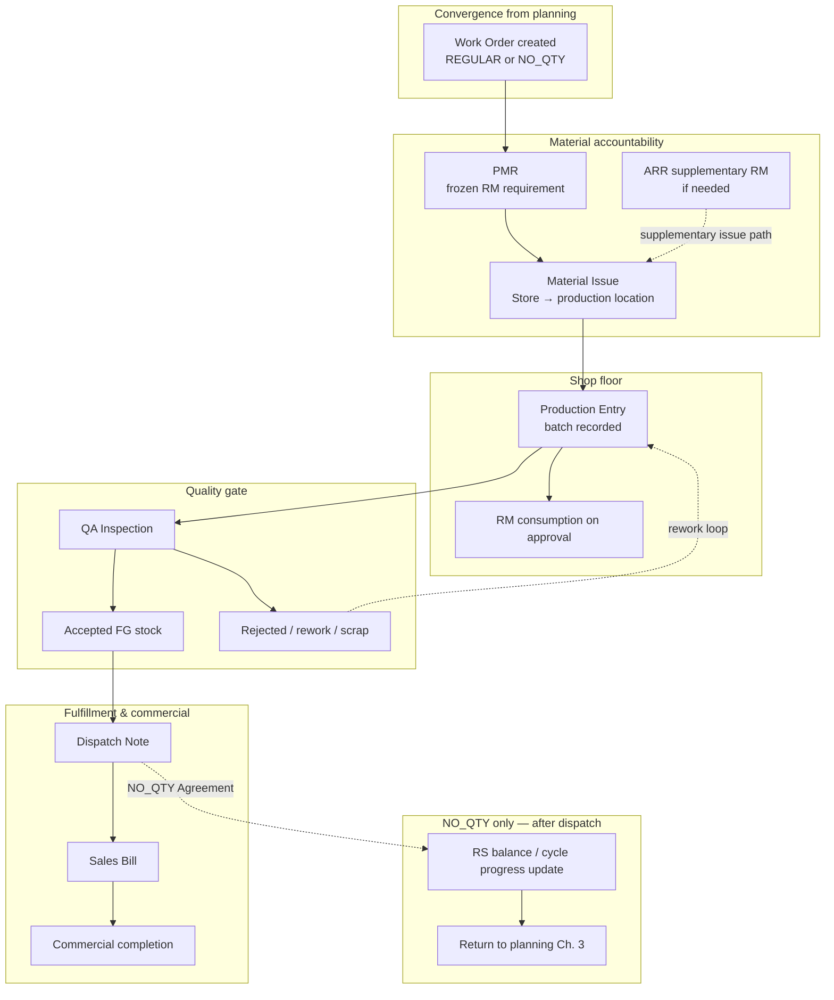

# Manufacturing Execution Pipeline

| Field | Value |
|-------|-------|
| **Document ID** | FT-PD-023 |
| **Volume** | 2 — Business Architecture |
| **Chapter** | 4 — Manufacturing Execution Pipeline |
| **Title** | Manufacturing Execution Pipeline |
| **Version** | 1.0.0 |
| **Status** | Draft — Architecture Review |
| **Effective date** | 2026-05-29 |
| **Author** | FT ERP Product Team |
| **Owner** | FT ERP Product Architecture |
| **Audience** | Product, workflow architects, implementation leads, Store/Production/QA/Admin process owners |
| **Classification** | Product — Business Architecture |

**Parent documents:**

- [Chapter 1 — Business Models & Document Inheritance](./Chapter_01_Business_Models_and_Document_Inheritance.md)
- [Chapter 2 — REGULAR Order Planning Pipeline](./Chapter_02_REGULAR_Order_Planning_Pipeline.md)
- [Chapter 3 — NO_QTY Agreement Planning Pipeline](./Chapter_03_NO_QTY_Agreement_Planning_Pipeline.md)
- [Chapter 2 — FT ERP Constitution](../01_Product_Foundation/Chapter_02_FT_ERP_Constitution.md)
- [Chapter 3 — Glossary](../01_Product_Foundation/Chapter_03_FT_ERP_Glossary_and_Standard_Terminology.md)

---

## 1. Document Control

| Version | Date | Author | Summary |
|---------|------|--------|---------|
| 1.0.0 | 2026-05-29 | FT ERP Product Team | Initial Manufacturing Execution Pipeline — common post–Work Order path |

**Supersedes:** None.

**Change authority:** Product Architecture. Execution stage, gate, or ownership changes require Constitution compliance review (Articles 7–9) and Volume 4 alignment.

**Out of scope for this chapter:** Enquiry through Work Order creation (Chapters 2–3); post-dispatch NO_QTY MPRS detail (Chapter 3); document field specs (Volume 3).

---

## 2. Purpose

This chapter documents the **common Manufacturing Execution Pipeline** used by **both** Business Models after **Work Order creation**.

Planning is complete when a Work Order exists. This chapter covers **execution only**: how material is requested, issued, consumed, inspected, dispatched, and billed—under identical rules regardless of whether demand originated from a REGULAR Order or a NO_QTY Agreement.

---

## 3. Scope

### 3.1 In scope

- Execution philosophy and convergence from Chapters 1–3
- Full execution pipeline stages (Work Order through Sales Billing)
- PMR, Material Issue, Production Entry, QA Inspection, Dispatch, Sales Bill
- Material accountability and frozen-artifact discipline
- Pending Actions and Control Tower for execution phase
- Execution Business Rules
- NO_QTY cycle continuation after dispatch (architecture boundary)

### 3.2 Out of scope

- REGULAR and NO_QTY **planning** pipelines (Chapters 2–3)
- Commercial inception (Enquiry → Internal Sales Order)
- Procurement planning and RM release (Chapters 2–3)
- Workflow state matrices (Volume 4)
- Field-level document specs (Volume 3)
- UI, API, database, implementation

### 3.3 Terminology

Uses [Glossary](../01_Product_Foundation/Chapter_03_FT_ERP_Glossary_and_Standard_Terminology.md) terms. **Production Material Request (PMR)**, **Material Issue**, **Production Entry**, **QA Inspection** — not informal synonyms in specifications.

---

## 4. Relationship with Previous Chapters

| Source | Application in this chapter |
|--------|----------------------------|
| **Ch. 1 §11 — Convergence** | REGULAR and NO_QTY diverge in planning; **both converge at Work Order** |
| **Ch. 2 — REGULAR planning** | Planning ends at Work Order; execution begins here with order-linked WO context |
| **Ch. 3 — NO_QTY planning** | Planning ends at WO placement; execution begins here with RS-linked WO context |
| **Constitution Art. 7** | Planning ≠ execution; WO does not auto-start PMR/issue/production |
| **Constitution Art. 8** | One common execution pipeline after Work Order |
| **Constitution Art. 9** | Material accountability chain through PMR → issue → consumption |

### 4.1 Both Business Models converge here

REGULAR Work Orders carry **Internal Sales Order** ancestry and fixed-order fulfillment intent. NO_QTY Work Orders carry **Requirement Sheet** / cycle ancestry and rolling-agreement intent. After creation, **execution behavior is identical**.

### 4.2 Execution is identical regardless of Business Model

PMR freeze rules, issue gates, production readiness, QA disposition, dispatch eligibility, and billing linkage do **not** branch by Business Model. Display context (trace labels, source references) may differ; **gates and ownership do not**.

---

## 5. Manufacturing Execution Philosophy

### 5.1 Work Order authorizes execution

**Work Order** is the controlled manufacturing order that **permits** the execution chain to begin. It defines FG lines and quantities to produce. It does **not** by itself issue RM, start shop-floor production, or dispatch FG.

### 5.2 PMR authorizes material issue

**Production Material Request (PMR)** is the **frozen RM requirement** for a Work Order. Store issues material **only** against submitted PMR lines. PMR bridges planning intent (BOM basis at freeze) to physical issue.

### 5.3 Material Issue authorizes production

**Material Issue** moves RM from store to production location and reserves/consumes issue capacity. **Production Entry** is gated on **issued** material aligned to frozen PMR—not on live BOM recalculation alone.

### 5.4 QA authorizes dispatch

Only **Accepted Quantity** from **QA Inspection** becomes dispatch-eligible FG. Rejected, rework, and scrap paths are disposition-controlled before stock is released for shipment.

### 5.5 Every stage validates the previous stage

Each transition is engine-gated:

| From | To | Gate (conceptual) |
|------|-----|-------------------|
| Work Order | PMR | WO active; BOM/planning basis available |
| PMR | Material Issue | PMR submitted; stock and location valid |
| Material Issue | Production | Issued RM supports intended FG qty |
| Production | QA | Production Entry approved; batch recorded |
| QA | Dispatch | Accepted qty released |
| Dispatch | Sales Bill | Shipment recorded; commercial rules met |

### 5.6 Execution never bypasses workflow

Operators cannot skip PMR, issue without PMR, produce without issue, dispatch without QA acceptance, or bill without dispatch through ad hoc screens. **Quick Actions** and Control Tower deep-links route into valid workflow entry points only (Constitution Art. 12).

---

## 6. Complete Execution Pipeline

| Stage | Owner (default) | Execution output |
|-------|-----------------|------------------|
| **Work Order** | Store (created in planning) | Authorized FG manufacturing intent |
| **PMR** | Store | Frozen RM requirement for WO |
| **Material Issue** | Store | RM at production location |
| **Production** | Production | Production Entry / batch |
| **QA Inspection** | QA | Accepted / rejected disposition |
| **Accepted FG** | System stock state | QA-released salable FG |
| **Dispatch** | Store | Dispatch Note; FG leaves factory |
| **Sales Billing** | Admin | Sales Bill; commercial invoice |

### 6.1 Stage flow

```
Work Order
    ↓
PMR (frozen RM requirement)
    ↓
Material Issue (RM to production)
    ↓
Production Entry (FG manufactured)
    ↓
QA Inspection (accept / reject / rework / scrap)
    ↓
Accepted FG (dispatch-eligible stock)
    ↓
Dispatch (shipment to customer)
    ↓
Sales Billing (commercial completion)
```

### 6.2 Work Order in execution context

Work Order enters execution **already created** (Chapter 2 or 3). During execution it tracks:

- Remaining FG quantity to produce
- PMR and issue status
- Production and QA progress
- Dispatch allocation against WO/line balance

Work Order **closure** follows product rules when production, QA, and dispatch obligations for the placed quantity are satisfied (Volume 3).

---

## 7. PMR

### 7.1 Auto generation

Upon Work Order readiness, the system **generates PMR** (or PMR lines) from the **frozen planning basis** attached to the Work Order—typically approved BOM explosion for the WO FG quantity. Generation is a controlled workflow action, not silent background mutation.

### 7.2 Frozen document

PMR **freezes** RM line quantities and BOM revision context at submission. Production readiness and issue validation reference **PMR lines**, not a live re-explosion that could diverge from issued material.

**Rule:** PMR **cannot be edited** after creation/submission; corrections follow formal reversal, supplementary PMR, or material return paths per Volume 3.

### 7.3 Additional RM through ARR

When shop-floor or Store identifies RM need **beyond** frozen PMR (shortage, variance, supplementary batch), **ARR (Additional RM Requisition)** initiates ad-hoc procurement or issue supplementation. ARR is **supplementary**—it does not replace PMR accountability for base WO requirement.

ARR may trigger replenishment procurement (STOCK_REPLENISHMENT pool) or expedited supply per product policy; issued ARR-sourced material still flows through Material Issue with traceability.

### 7.4 Traceability

PMR maintains the **requirement → request** link in the material accountability chain (Constitution Art. 9):

```
Planning basis (WO / BOM revision)
    → PMR line
    → Material Issue line
    → Production consumption / Material Return
```

Audit and variance reports cite PMR document identity and revision.

---

## 8. Material Issue

### 8.1 Store responsibility

**Material Issue** is **Store-owned**. Store selects issue location, validates PMR coverage, and posts stock movement from store to **production location**.

### 8.2 Partial issue

Store may issue **less than full PMR** when stock, location, or operational policy requires wave-based supply. Partial issue **proportionally constrains** production capacity until further issue.

### 8.3 Validation

Before issue confirmation:

- PMR submitted and line open for issue
- Sufficient **free** stock at source location (after reservations)
- Target production location valid
- No execution guard block (e.g. WO cancelled)

### 8.4 Stock movement

Each issue creates **Stock Transaction** entries: RM decrement at store (or source), increment at production location, reference to PMR and Material Issue document. Reserved stock converts to issued/consumed path per ledger rules (Volume 5).

### 8.5 Issue history

Issue history is immutable audit: who issued, when, quantity, location pair, PMR line reference. Returns reference original issue where applicable.

---

## 9. Production

### 9.1 Production Entry

**Production Entry** records FG quantity produced for a Work Order line, typically as a **Production Batch** with lot/batch identity for QA. Entries may be draft until Production role approval.

### 9.2 Partial production

A Work Order line may have **multiple Production Entries** over time until WO line balance is exhausted. Each entry is a batch candidate for QA.

### 9.3 Batch recording

**Production Batch** is the traceability unit for QA and dispatch allocation. Batch identity links backward to WO, PMR/issue context, and forward to QA and Dispatch Note lines.

### 9.4 Consumption

Upon Production Entry **approval**, the system posts **RM consumption** against issued material per BOM/PMR basis—not independent ad hoc consumption. Consumption variance surfaces for audit; silent overwrite is prohibited.

### 9.5 Completion

**Production completion** for a WO line occurs when cumulative approved production reaches WO line quantity (or policy allows early close with reason). Unproduced balance may remain on WO until issue/RM allows further entries.

**Rule:** Production **cannot exceed** material issued and PMR-aligned capacity.

---

## 10. QA

### 10.1 Inspection

**QA Inspection** evaluates Production Batch against quality criteria before FG is released for dispatch. QA is **QA-role-owned**; Production cannot self-approve dispatch eligibility.

### 10.2 Accepted quantity

**Accepted Quantity** passes inspection and posts to **dispatch-eligible FG stock** (or FG location per product rules). Only accepted qty counts toward dispatch allocation.

### 10.3 Rejected quantity

**Rejected Quantity** fails inspection without immediate dispatch rights. Rejected stock remains controlled pending disposition.

### 10.4 Rework

**Rework** disposition routes batch or quantity back for correction/reprocessing. Rework retains traceability to originating Production Batch; re-inspection follows rework completion.

### 10.5 Scrap

**Scrap** disposition writes off non-salable FG (or material) with audit trail. Scrap reduces effective good output and may trigger variance review—not silent quantity adjustment.

### 10.6 FG posting

QA approval **posts FG** into salable/dispatch-eligible inventory state. Until QA release, produced quantity is **not** dispatch-eligible regardless of Production Entry approval.

---

## 11. Dispatch

### 11.1 Dispatch eligibility

Dispatch requires:

- **Accepted Quantity** available for allocation
- Active **Internal Sales Order** (or agreement schedule) link per Business Model
- WO / commercial line balance permitting shipment
- Dispatch Note workflow valid

**Rule:** **No dispatch before QA acceptance.**

### 11.2 Partial dispatch

Dispatch may ship **part** of accepted FG or order balance in multiple **Dispatch Notes**. Each note reduces dispatch-eligible stock and updates commercial fulfillment progress.

### 11.3 SO balance

For **REGULAR Order**, dispatch cannot exceed **Internal Sales Order line** remaining dispatch balance (fixed qty commitment).

For **NO_QTY Agreement**, dispatch validates against **schedule/agreement context** linked to the cycle—RS and commercial frame provide balance semantics (Volume 3); execution gate structure is the same.

### 11.4 Dispatch validation

Store confirms batch trace references, quantities, shipment metadata, and commercial link before Dispatch Note confirmation. Customer PO remains **reference only**—Dispatch Note is the ERP-controlled shipment document.

**Rule:** Dispatch **cannot exceed** accepted FG or SO/schedule balance.

---

## 12. Sales Billing

### 12.1 Billing after dispatch

**Sales Bill** is created **after dispatch** (or per configured commercial policy tying invoice lines to dispatched quantities). Billing reflects fulfilled shipment—not planned or produced-but-not-dispatched quantity.

**Rule:** Billing **cannot precede** dispatch for standard FG shipment billing.

### 12.2 Admin ownership

**Sales Bill** creation and commercial adjustment are **Admin-owned** (commercial/finance role). Store executes physical dispatch; Admin executes invoice and commercial completion.

### 12.3 Export

**Billing Export** produces structured output for external accounting (e.g. Tally). Export is integration output—downstream of Sales Bill—not a manufacturing stage.

### 12.4 Commercial completion

**Commercial completion** marks contractual/documentary milestones for an order or agreement cycle (dispatch + billing thresholds per configuration). Distinct from Work Order manufacturing closure and from NO_QTY next-cycle planning.

---

## 13. Pending Actions

Engine-generated only (Constitution Art. 12). Representative **execution-phase** actions:

### 13.1 Store

| Pending Action (examples) | Context |
|---------------------------|---------|
| Submit / complete PMR | WO awaiting material request |
| Material Issue | PMR submitted; stock available |
| Material Return processing | Return from production |
| Dispatch preparation | QA-accepted FG awaiting shipment |
| Post-dispatch stock confirmation | Dispatch Note workflow |

### 13.2 Production

| Pending Action (examples) | Context |
|---------------------------|---------|
| Record Production Entry | Material issued; WO open |
| Approve production batch | Draft entry pending |
| Report production blocker | RM/issue gap on floor |

### 13.3 QA

| Pending Action (examples) | Context |
|---------------------------|---------|
| Inspect Production Batch | Entry approved; QA pending |
| Disposition rejected qty | Rework/scrap decision |
| Re-inspection after rework | Rework complete |

### 13.4 Admin

| Pending Action (examples) | Context |
|---------------------------|---------|
| Create Sales Bill | Dispatch completed |
| Billing export / correction | Commercial follow-up |
| Commercial completion review | Order/agreement milestone |

*Planning-phase Pending Actions (MR, MPRS, WO creation) belong to Chapters 2–3—not duplicated here except where execution unblocks them indirectly.*

---

## 14. Control Tower

Control Tower provides **factory-wide execution monitoring** (read/monitor primary; escalation deep-links to Workspace):

| Theme | Execution visibility |
|-------|----------------------|
| **WO status** | Open WOs by stage: awaiting PMR, issued, in production, QA pending, dispatch pending |
| **Production delays** | WOs with issue but no timely Production Entry |
| **QA backlog** | Batches awaiting inspection or disposition |
| **Dispatch backlog** | Accepted FG not yet shipped; aging by customer/agreement |
| **Material bottlenecks** | PMR submitted but issue blocked; partial issue constraining production |
| **Owner & recommended action** | Store, Production, QA, Admin per stage |

Control Tower does not replace role Dashboards for **My Work**; it aggregates risk across the execution pipeline.

---

## 15. Business Rules

| ID | Rule |
|----|------|
| **EXE-01** | Execution begins only after **Work Order** exists; planning artifacts alone do not start execution. |
| **EXE-02** | **No production before Material Issue** against submitted PMR. |
| **EXE-03** | **No dispatch before QA acceptance** of Production Batch. |
| **EXE-04** | **PMR cannot be edited** after creation/submission; use controlled correction paths. |
| **EXE-05** | **ARR handles additional RM** need supplementary to frozen PMR—ARR does not void PMR accountability. |
| **EXE-06** | **Production cannot exceed issued material** aligned to PMR readiness. |
| **EXE-07** | Production readiness uses **frozen PMR basis** when PMR exists—not independent live BOM bypass. |
| **EXE-08** | **Dispatch cannot exceed accepted FG** or commercial line/schedule balance. |
| **EXE-09** | **Billing cannot precede dispatch** for standard shipment-based invoicing. |
| **EXE-10** | **Material Issue** is Store-owned; stock moves only through controlled issue/return documents. |
| **EXE-11** | **QA Inspection** is required for dispatch-eligible FG unless explicit product exemption in Volume 3 (none by default). |
| **EXE-12** | Execution pipeline is **identical** for REGULAR and NO_QTY; no model-specific production or QA bypass. |
| **EXE-13** | **Customer PO** does not authorize issue, production, dispatch, or billing. |
| **EXE-14** | Partial issue, partial production, and partial dispatch are permitted; each stage respects cumulative balances. |
| **EXE-15** | Material **consumption** posts on approved Production Entry—not on dispatch. |
| **EXE-16** | Rework and scrap require **disposition audit**; rejected qty cannot silently become accepted. |

---

## 16. NO_QTY Cycle Continuation

After **dispatch** under NO_QTY Agreement, execution for the current wave is complete; **planning resumes**:

### 16.1 RS balance updates

Dispatched quantity **reduces** Requirement Sheet line fulfillment balance (and cycle progress). Remaining RS placement balance reflects what is still to be manufactured in future waves.

### 16.2 Remaining demand returns to planning

Unplaced RS balance, carry forward shortfalls, and next-period demand return to **Requirement & Cycle Planning** and **MPRS**—not to a alternate execution path.

### 16.3 New planning cycles continue until agreement completion

The agreement iterates: **plan → procure → place WO → execute (this chapter) → dispatch → replan** until Internal Sales Order / agreement commercial completion criteria are met.

```
NO_QTY macro loop (simplified)

  Planning (Ch. 3) → WO → Execution (Ch. 4) → Dispatch
        ↑___________________________________|
              next cycle / carry forward
```

REGULAR Order typically **does not** loop cycles; order fulfillment completes when SO qty is dispatched and billed (Chapter 2).

---

## 17. Lifecycle Diagram



---

## 18. Review Checklist

- [ ] Execution-only; planning deferred to Chapters 2–3
- [ ] Both Business Models converge at Work Order; identical execution gates
- [ ] Constitution Arts. 7–9 reflected
- [ ] Glossary terms: PMR, Material Issue, Production Entry, QA Inspection, Dispatch Note, Sales Bill
- [ ] PMR freeze and no-edit rule documented
- [ ] ARR as supplementary RM path
- [ ] Partial issue / production / dispatch covered
- [ ] QA disposition paths: accepted, rejected, rework, scrap
- [ ] Dispatch vs SO/schedule balance; billing after dispatch
- [ ] Pending Actions by Store, Production, QA, Admin
- [ ] Control Tower execution themes
- [ ] Business Rules EXE-01–EXE-16
- [ ] NO_QTY cycle continuation after dispatch
- [ ] Mermaid lifecycle diagram
- [ ] No UI, API, schema, implementation

---

## 19. Change Log

| Version | Date | Author | Summary |
|---------|------|--------|---------|
| 1.0.0 | 2026-05-29 | FT ERP Product Team | Initial Manufacturing Execution Pipeline |

---

## 20. Approval Block

| Role | Name | Signature | Date |
|------|------|-----------|------|
| Product Owner | | | |
| Product Architecture | | | |
| Store Process Owner | | | |
| Production Process Owner | | | |
| QA Process Owner | | | |
| Admin / Commercial Owner | | | |

---

## Document navigation

| | Link |
|--|------|
| **Previous** | [NO_QTY Agreement Planning Pipeline](./Chapter_03_NO_QTY_Agreement_Planning_Pipeline.md) (FT-PD-022) |
| **Next** | [Document Ownership & Responsibility Matrix](./Chapter_05_Document_Ownership_and_Responsibility_Matrix.md) (FT-PD-024) |
| **Volume** | [Business Architecture](./README.md) |
| **Product** | [Product Documentation Index](../README.md) |

