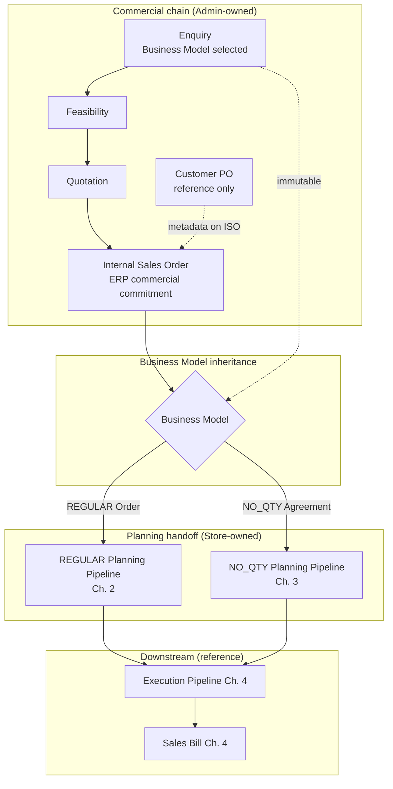

# Commercial Document Chain

| Field | Value |
|-------|-------|
| **Document ID** | FT-PD-025 |
| **Volume** | 2 — Business Architecture |
| **Chapter** | 6 — Commercial Document Chain |
| **Title** | Commercial Document Chain |
| **Version** | 1.0.0 |
| **Status** | Draft — Architecture Review |
| **Effective date** | 2026-05-29 |
| **Author** | FT ERP Product Team |
| **Owner** | FT ERP Product Architecture |
| **Audience** | Product, workflow architects, implementation leads, Admin / commercial process owners |
| **Classification** | Product — Business Architecture |

**Parent documents:**

- [Chapter 1 — Business Models & Document Inheritance](./Chapter_01_Business_Models_and_Document_Inheritance.md)
- [Chapter 2 — REGULAR Order Planning Pipeline](./Chapter_02_REGULAR_Order_Planning_Pipeline.md)
- [Chapter 3 — NO_QTY Agreement Planning Pipeline](./Chapter_03_NO_QTY_Agreement_Planning_Pipeline.md)
- [Chapter 5 — Document Ownership & Responsibility Matrix](./Chapter_05_Document_Ownership_and_Responsibility_Matrix.md)
- [Chapter 2 — FT ERP Constitution](../01_Product_Foundation/Chapter_02_FT_ERP_Constitution.md) (Articles 4–5, 15)
- [Chapter 3 — Glossary](../01_Product_Foundation/Chapter_03_FT_ERP_Glossary_and_Standard_Terminology.md)

---

## 1. Document Control

| Version | Date | Author | Summary |
|---------|------|--------|---------|
| 1.0.0 | 2026-05-29 | FT ERP Product Team | Initial commercial document chain — Enquiry through Internal Sales Order and planning handoff |

**Supersedes:** None.

**Change authority:** Product Architecture. Changes to commercial chain semantics require Constitution compliance review (Arts. 4–5, 15) and Glossary alignment.

**Out of scope for this chapter:** Planning pipelines (Chapters 2–3), execution (Chapter 4), field-level specs (Volume 3).

---

## 2. Purpose

This chapter documents the **complete commercial document lifecycle** that begins every FT ERP workflow.

It explains how commercial documents progress from **Enquiry** to **Internal Sales Order**, how **Business Model** selection at Enquiry determines the downstream planning pipeline, and where commercial responsibility **ends** and planning **begins**.

---

## 3. Scope

### 3.1 In scope

- Commercial philosophy and boundaries
- Document-by-document lifecycle: Enquiry, Feasibility, Quotation, Customer PO reference, Internal Sales Order
- Business Model inheritance and transition to planning
- Admin Pending Actions and Control Tower commercial visibility
- Commercial Business Rules

### 3.2 Out of scope

- REGULAR and NO_QTY planning detail (Chapters 2–3)
- Manufacturing execution (Chapter 4)
- Sales Bill and post-dispatch billing detail ([Chapter 4](./Chapter_04_Manufacturing_Execution_Pipeline.md) §12; Volume 3)
- Workflow state tables (Volume 4)
- UI, API, database

### 3.3 Terminology

Uses [Glossary](../01_Product_Foundation/Chapter_03_FT_ERP_Glossary_and_Standard_Terminology.md) terms only. **Internal Sales Order** — not “Sales Order.” **Customer Purchase Order (Reference only)** — not an ERP workflow document.

---

## 4. Commercial Philosophy

### 4.1 Commercial documents initiate business

The commercial chain captures **customer intent**, **commercial viability**, and **ERP commitment** before any factory planning or manufacturing. Every manufacturing case traces to an Enquiry root and inherited Business Model ([Chapter 1](./Chapter_01_Business_Models_and_Document_Inheritance.md) §9).

### 4.2 Commercial documents do not execute manufacturing

Enquiry, Feasibility, Quotation, and Customer PO reference **never** create Work Orders, PMR, Material Issue, Production Entry, or Dispatch. Commercial completion is separate from manufacturing execution (Constitution Art. 7).

### 4.3 Business Model selection occurs at Enquiry

**Business Model** — **REGULAR Order** or **NO_QTY Agreement** — is selected **once** at **Enquiry** (Constitution Art. 4). All downstream controlled documents inherit automatically.

### 4.4 Customer PO is an external reference only

**Customer Purchase Order (Reference only)** is metadata for matching and traceability. It has no Workflow State, no primary owner, and no Pending Actions ([Chapter 1](./Chapter_01_Business_Models_and_Document_Inheritance.md) §10; [Chapter 5](./Chapter_05_Document_Ownership_and_Responsibility_Matrix.md) §5).

### 4.5 Internal Sales Order is the ERP-controlled commercial document

**Internal Sales Order** is the **commercial commitment anchor** inside FT ERP. It triggers planning eligibility, inherits Business Model, and parents downstream planning artifacts. It is the last document in the **commercial chain** before planning begins.

---

## 5. Commercial Lifecycle

| Stage | Document | Primary owner | Advances to |
|-------|----------|---------------|-------------|
| 1 | **Enquiry** | Admin | Feasibility |
| 2 | **Feasibility** | Admin | Quotation |
| 3 | **Quotation** | Admin | Internal Sales Order |
| — | **Customer PO (reference)** | None | Does not advance workflow |
| 4 | **Internal Sales Order** | Admin | Planning pipeline |
| 5 | **Business Model inheritance** | System (engine) | REGULAR or NO_QTY planning |
| 6 | **Planning pipeline** | Store (primary) | See Ch. 2 or Ch. 3 |

### 5.1 End-to-end flow

```
Enquiry
    ↓
Feasibility
    ↓
Quotation
    ↓
Customer Purchase Order (Reference) — optional capture on Internal Sales Order
    ↓
Internal Sales Order
    ↓
Business Model Inheritance
    ↓
Planning Pipeline
    ├── REGULAR Order → [Chapter 2](./Chapter_02_REGULAR_Order_Planning_Pipeline.md)
    └── NO_QTY Agreement → [Chapter 3](./Chapter_03_NO_QTY_Agreement_Planning_Pipeline.md)
```

### 5.2 Lifecycle diagram



---

## 6. Enquiry

### 6.1 Business opportunity

**Enquiry** is the **first ERP-controlled document** in every customer case. It records initial customer interest, contact context, and requested FG scope at a high level.

### 6.2 Initial customer requirements

Enquiry captures preliminary requirements: customer identity, items of interest, indicative quantities or agreement type, delivery expectations, and commercial notes. Detail refines on Feasibility and Quotation.

### 6.3 Business Model selection

At Enquiry creation, Admin selects **Business Model**:

| Selection | Meaning |
|-----------|---------|
| **REGULAR Order** | Fixed-quantity manufacturing commitment expected |
| **NO_QTY Agreement** | Rolling supply / schedule agreement without fixed order qty |

Selection is **immutable** after Enquiry save ([Chapter 1](./Chapter_01_Business_Models_and_Document_Inheritance.md) §5.2–5.3).

### 6.4 No manufacturing activity

Enquiry does not create planning artifacts, Material Requirements, Work Orders, or stock movements. It is purely commercial inception.

---

## 7. Feasibility

### 7.1 Technical evaluation

**Feasibility** assesses whether requested products can be manufactured with available capability, tooling, and approved BOM coverage. It inherits Business Model from Enquiry.

### 7.2 Manufacturing capability

Feasibility confirms capacity, lead-time realism, and special process constraints. A negative feasibility outcome blocks Quotation progression without manufacturing side effects.

### 7.3 BOM readiness

Feasibility references **approved BOM** availability for proposed FG items. Missing or draft BOM is flagged for commercial decision—not auto-created manufacturing demand.

### 7.4 Commercial decision support

Feasibility output informs **go / no-go / conditional go** for Quotation. It supports Admin judgment; it does not commit the factory.

---

## 8. Quotation

### 8.1 Commercial offer

**Quotation** is the formal commercial offer to the customer. It inherits Business Model and links to Enquiry and Feasibility ancestry.

### 8.2 Pricing

Quotation carries commercial terms: unit price, currency, tax treatment references, and line-level pricing where applicable. Pricing is commercial—not manufacturing cost explosion.

### 8.3 Validity

Quotation includes **validity period** and offer conditions. Expired quotations require renewal or new commercial document—not silent extension into Internal Sales Order.

### 8.4 Customer approval

Customer acceptance of Quotation is recorded as commercial milestone (won / lost / pending). **Internal Sales Order** is created from **won** Quotation—Customer PO reference may be captured at ISO stage, not as workflow driver.

### 8.5 Model-specific quotation content

| Business Model | Quotation emphasis |
|----------------|-------------------|
| **REGULAR Order** | FG lines with **defined quantities** and delivery commitment |
| **NO_QTY Agreement** | Commercial terms, FG scope, schedule framework—**without** fixed manufacturing qty at agreement stage |

---

## 9. Customer Purchase Order

### 9.1 External commercial reference

**Customer Purchase Order (Reference only)** is the customer’s external order number, date, or attachment—stored as **reference metadata**, typically on **Internal Sales Order**.

### 9.2 Never controls workflow

Customer PO:

- Has **no** Workflow State
- Has **no** primary owner ([Chapter 5](./Chapter_05_Document_Ownership_and_Responsibility_Matrix.md) §5)
- Generates **no** Pending Actions
- Does **not** advance Enquiry → Feasibility → Quotation → ISO chain

(Constitution Art. 15; [Chapter 1](./Chapter_01_Business_Models_and_Document_Inheritance.md) §10.)

### 9.3 Never replaces Internal Sales Order

Customer paperwork does not substitute for **Internal Sales Order**. All ERP planning, execution, dispatch, and billing trace to ISO and inherited Business Model.

### 9.4 May contain customer schedule information

Customer PO text or attachments may include delivery schedules or call-off quantities. Operators may transcribe schedule hints into **Requirement Sheet** (NO_QTY) or commercial notes—but Customer PO itself does not create RS or planning documents.

### 9.5 Used only for traceability

Allowed uses: search/filter, dispatch paperwork alignment, billing export matching, dispute audit ([Chapter 1](./Chapter_01_Business_Models_and_Document_Inheritance.md) §10.3). Updates to reference field do not start manufacturing.

---

## 10. Internal Sales Order

### 10.1 ERP commercial commitment

**Internal Sales Order** records the factory’s **commercial commitment** to the customer—converted from won Quotation. It is the authoritative ERP commercial document for the case.

### 10.2 Workflow trigger

Internal Sales Order **activates planning eligibility**. Until ISO exists, Store does not begin REGULAR order RM readiness or NO_QTY Requirement Sheet work for that commercial case.

**Rule:** **Planning begins only after Internal Sales Order** (commercial chain complete).

### 10.3 Business Model inheritance

ISO **inherits** Business Model from Enquiry via Feasibility and Quotation. Operators do not re-select model on ISO.

### 10.4 Parent document for planning

| Business Model | ISO role for planning |
|----------------|----------------------|
| **REGULAR Order** | Parent for **order-quantity** planning; FG lines with committed qty drive RM readiness ([Chapter 2](./Chapter_02_REGULAR_Order_Planning_Pipeline.md)) |
| **NO_QTY Agreement** | **Agreement frame**—customer, terms, FG scope; qty emerges on Requirement Sheet and MPRS ([Chapter 3](./Chapter_03_NO_QTY_Agreement_Planning_Pipeline.md)) |

ISO may hold **Customer PO reference** for matching; reference update does not change Business Model or replan automatically.

---

## 11. Business Model Transition

Upon Internal Sales Order commitment, the Workflow Engine routes the case to the **inherited planning pipeline**:

### 11.1 REGULAR → REGULAR Planning Pipeline

```
Internal Sales Order (REGULAR)
    → Order RM readiness / RM Control Center
    → Material Requirement (REGULAR_SO)
    → Work Order preparation
```

Full detail: [Chapter 2 — REGULAR Order Planning Pipeline](./Chapter_02_REGULAR_Order_Planning_Pipeline.md).

### 11.2 NO_QTY → Requirement Sheet / MPRS Planning Pipeline

```
Internal Sales Order (NO_QTY Agreement)
    → Requirement Sheet & Planning Cycle
    → Monthly Production Planning Sheet (MPRS)
    → RM release → MPRS procurement
    → WO placement
```

Full detail: [Chapter 3 — NO_QTY Agreement Planning Pipeline](./Chapter_03_NO_QTY_Agreement_Planning_Pipeline.md).

### 11.3 Convergence reminder

Both pipelines converge at **Work Order creation** into the common **Execution Pipeline** ([Chapter 4](./Chapter_04_Manufacturing_Execution_Pipeline.md)). Commercial chain does not branch again after ISO.

---

## 12. Pending Actions

Engine-generated only (Constitution Art. 12). **Commercial-phase** Pending Actions route to **Admin** ([Chapter 5](./Chapter_05_Document_Ownership_and_Responsibility_Matrix.md) §10):

| Pending Action (examples) | Context |
|---------------------------|---------|
| Complete Enquiry | New opportunity; Business Model not finalized |
| Record Feasibility outcome | Enquiry advanced; feasibility pending |
| Prepare Quotation | Feasibility positive; offer not issued |
| Follow up customer on Quotation | Awaiting customer response |
| Convert Quotation to Internal Sales Order | Quotation won |
| Record Customer PO reference | Optional post-ISO matching |
| Commercial amendment review | ISO change request (commercial only—no Business Model change) |

Store, Purchase, Production, and QA Pending Actions belong to planning and execution phases (Chapters 2–5)—not commercial Dashboard unless role also holds commercial duties.

---

## 13. Control Tower Visibility

Control Tower provides **factory-wide commercial monitoring** (read/monitor; Constitution Art. 14):

| Theme | Visibility |
|-------|------------|
| **Open enquiries** | Active opportunities by age and Business Model |
| **Pending quotations** | Offers in draft or awaiting customer |
| **Awaiting customer response** | Quotation sent; no ISO conversion |
| **SO conversion** | Won quotations not yet converted to Internal Sales Order |
| **Commercial bottlenecks** | Stalled feasibility, expired quotations, ISO without planning start |
| **Owner** | Admin / commercial primary owner column |
| **Recommended action** | Deep-link to commercial Workspace |

Control Tower does **not** treat Customer PO reference as a workflow row. Planning and execution backlogs appear separately (Chapters 2–4).

---

## 14. Business Rules

| ID | Rule |
|----|------|
| **COM-01** | **Business Model** is selected **only once** at **Enquiry**; immutable thereafter. |
| **COM-02** | **Customer PO** cannot change **Business Model** or inherit model selection. |
| **COM-03** | **Internal Sales Order** always **inherits** Business Model from Enquiry chain. |
| **COM-04** | **Planning begins only after Internal Sales Order** commercial commitment. |
| **COM-05** | **Customer PO never advances workflow**—no state, no Pending Actions, no planning trigger. |
| **COM-06** | Every commercial document maintains **traceability** to Enquiry root (document chain ancestry). |
| **COM-07** | Commercial documents **do not** create Work Orders, PMR, issue, production, or dispatch. |
| **COM-08** | **Feasibility** does not create manufacturing demand or Material Requirements. |
| **COM-09** | **Quotation** must inherit Business Model; mixed-model quotation from one Enquiry is prohibited. |
| **COM-10** | **Internal Sales Order** is the **only** ERP commercial commitment document that triggers planning. |
| **COM-11** | Customer PO **never replaces** Internal Sales Order for dispatch or billing authority. |
| **COM-12** | Commercial reversal (cancel / new Enquiry) is required to change Business Model—not ISO edit. |
| **COM-13** | Admin is **primary owner** of all commercial chain documents (standard product). |
| **COM-14** | Post-ISO **Sales Bill** is commercial/financial completion—not part of commercial *chain* inception ([Chapter 4](./Chapter_04_Manufacturing_Execution_Pipeline.md) §12). |

---

## 15. Lifecycle Diagram

Commercial chain with inheritance and planning fork (detailed view):

```mermaid
flowchart LR
  subgraph Root["Enquiry root"]
    E[Enquiry]
    BM[(Business Model<br/>REGULAR | NO_QTY)]
    E --- BM
  end

  subgraph Chain["Inherited commercial chain"]
    F[Feasibility]
    Q[Quotation]
    I[Internal Sales Order]
    E --> F --> Q --> I
  end

  subgraph Ref["Non-workflow reference"]
    CP[Customer PO ref]
    CP -.-> I
  end

  subgraph Fork["Planning fork — Ch. 2 / Ch. 3"]
    R[REGULAR<br/>Order RM readiness]
    N[NO_QTY<br/>Requirement Sheet → MPRS]
    I --> R
    I --> N
  end

  BM -.-> F
  BM -.-> Q
  BM -.-> I
  BM -.-> R
  BM -.-> N
```

---

## 16. Review Checklist

- [ ] Commercial-only scope; planning/execution cross-referenced not redefined
- [ ] Constitution Arts. 4–5, 15 reflected
- [ ] Glossary terms; Internal Sales Order; Customer PO reference only
- [ ] Business Model at Enquiry; immutability stated
- [ ] Customer PO prohibitions explicit (§9)
- [ ] ISO as planning trigger and parent document
- [ ] REGULAR vs NO_QTY transition to Ch. 2 / Ch. 3
- [ ] Admin Pending Actions and Control Tower commercial themes
- [ ] Business Rules COM-01–COM-14
- [ ] Mermaid lifecycle diagrams (§5, §15)
- [ ] No UI, API, database, implementation

---

## 17. Change Log

| Version | Date | Author | Summary |
|---------|------|--------|---------|
| 1.0.0 | 2026-05-29 | FT ERP Product Team | Initial Commercial Document Chain |

---

## 18. Approval Block

| Role | Name | Signature | Date |
|------|------|-----------|------|
| Product Owner | | | |
| Product Architecture | | | |
| Admin / Commercial Process Owner | | | |

---

## Document navigation

| | Link |
|--|------|
| **Previous** | [Document Ownership & Responsibility Matrix](./Chapter_05_Document_Ownership_and_Responsibility_Matrix.md) (FT-PD-024) |
| **Next** | [Commercial Domain Specification](../03_Domain_Specifications/Chapter_01_Commercial_Domain_Specification.md) (FT-PD-030) |
| **Volume** | [Business Architecture](./README.md) |
| **Product** | [Product Documentation Index](../README.md) |
---

## Document navigation

| | Link |
|--|------|
| **Previous** | [Document Ownership & Responsibility Matrix](./Chapter_05_Document_Ownership_and_Responsibility_Matrix.md) (FT-PD-024) |
| **Next** | [Commercial Domain Specification](../03_Domain_Specifications/Chapter_01_Commercial_Domain_Specification.md) (FT-PD-030) |
| **Volume** | [Business Architecture](./README.md) |
| **Product** | [Product Documentation Index](../README.md) |

