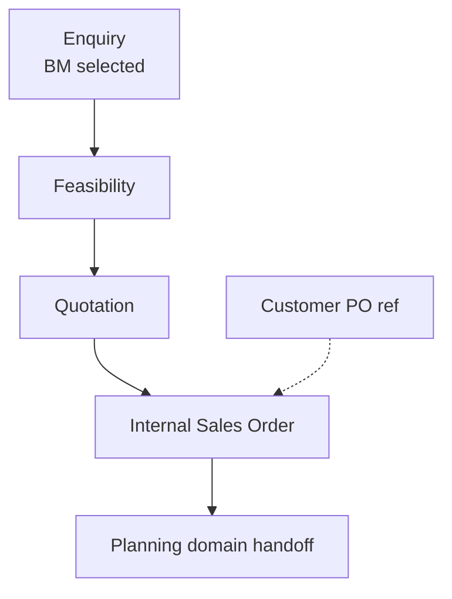
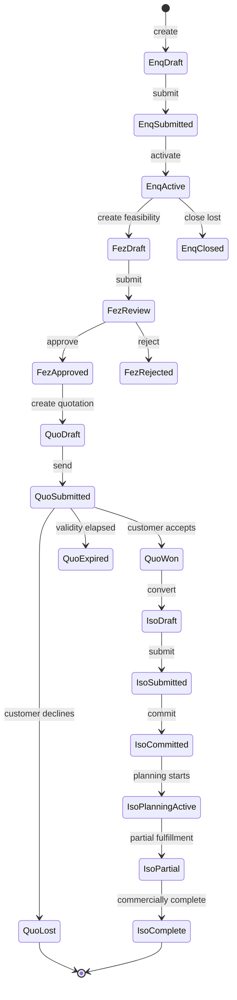
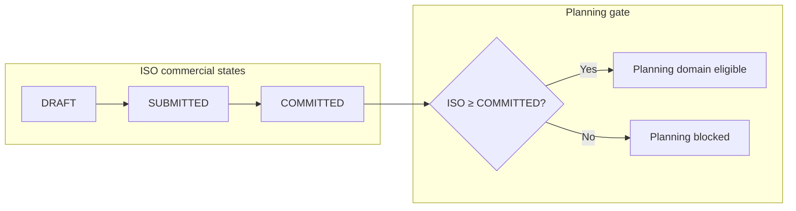

# Commercial Domain Specification

| Field | Value |
|-------|-------|
| **Document ID** | FT-PD-030 |
| **Volume** | 3 — Domain Specifications |
| **Chapter** | 1 — Commercial Domain Specification |
| **Title** | Commercial Domain Specification |
| **Version** | 1.0.0 |
| **Status** | Draft — Architecture Review |
| **Effective date** | 2026-05-29 |
| **Author** | FT ERP Product Team |
| **Owner** | FT ERP Product Architecture |
| **Audience** | Product, domain authors, workflow engineers, QA, Admin / commercial process owners |
| **Classification** | Product — Domain Specification |

**Parent documents:**

- [Volume 2, Chapter 6 — Commercial Document Chain](../02_Business_Architecture/Chapter_06_Commercial_Document_Chain.md)
- [Volume 2, Chapter 5 — Document Ownership & Responsibility Matrix](../02_Business_Architecture/Chapter_05_Document_Ownership_and_Responsibility_Matrix.md)
- [Volume 2, Chapter 1 — Business Models & Document Inheritance](../02_Business_Architecture/Chapter_01_Business_Models_and_Document_Inheritance.md)
- [Chapter 2 — FT ERP Constitution](../01_Product_Foundation/Chapter_02_FT_ERP_Constitution.md)
- [Chapter 3 — Glossary](../01_Product_Foundation/Chapter_03_FT_ERP_Glossary_and_Standard_Terminology.md)
- [Chapter 4 — Product Design Principles](../01_Product_Foundation/Chapter_04_FT_ERP_Product_Design_Principles.md)

---

## 1. Document Control

| Version | Date | Author | Summary |
|---------|------|--------|---------|
| 1.0.0 | 2026-05-29 | FT ERP Product Team | Initial Commercial domain — documents, states, validations, surfaces |

**Supersedes:** None.

**Change authority:** Product Architecture. State or validation changes require Volume 2 alignment review and Volume 4 workflow impact assessment.

**Out of scope for this chapter:** Planning, procurement, manufacturing, QA, dispatch domains (Volume 3 subsequent chapters); Sales Bill detail (Volume 3, Dispatch & Billing); APIs, database, UI implementation.

---

## 2. Purpose

This chapter provides the **complete functional specification** for the **Commercial domain** in FT ERP.

Unlike [Volume 2, Chapter 6](../02_Business_Architecture/Chapter_06_Commercial_Document_Chain.md), which explains commercial **architecture**, this chapter specifies **how each commercial document behaves**: workflow states, validations, allowed actions, completion criteria, Pending Actions, and role surfaces.

---

## 3. Scope

### 3.1 In scope

- Commercial domain boundaries and responsibilities
- Functional specification for: Enquiry, Feasibility, Quotation, Customer PO (reference), Internal Sales Order
- Workflow states and transitions per document
- Business Rules, validation matrix, audit requirements
- Admin Dashboard, Workspace, and Control Tower commercial behavior

### 3.2 Out of scope

- REGULAR / NO_QTY planning behavior ([Volume 3, Chapter 2](./README.md) — planned)
- Manufacturing execution documents
- Workflow Engine implementation (Volume 4)
- Master data maintenance (Customer master — Volume 3 / Volume 5)
- Sales Bill, Dispatch Note (Volume 3, Dispatch & Billing chapter)
- API contracts, schema, screen layouts

### 3.3 Terminology

[Glossary](../01_Product_Foundation/Chapter_03_FT_ERP_Glossary_and_Standard_Terminology.md) terms only. Architecture concepts cross-reference Volume 2—not redefined here.

---

## 4. Domain Responsibilities

### 4.1 What the Commercial domain owns

| Responsibility | Description |
|----------------|-------------|
| **Opportunity capture** | Enquiry as root of every customer case |
| **Business Model selection** | Once at Enquiry; inherited downstream |
| **Commercial viability** | Feasibility assessment before offer |
| **Customer offer** | Quotation pricing and terms |
| **ERP commercial commitment** | Internal Sales Order triggers planning eligibility |
| **External reference capture** | Customer PO reference on ISO for traceability |
| **Commercial audit trail** | Document chain ancestry to Enquiry |

### 4.2 What the Commercial domain does not own

| Excluded | Owned by |
|----------|----------|
| RM planning, MPRS, Requirement Sheet | Planning domain (Vol. 3 Ch. 2) |
| MR, PR, PO, GRN | Procurement domain (Vol. 3 Ch. 3) |
| Work Order, PMR, production | Manufacturing domain (Vol. 3 Ch. 4) |
| QA, dispatch execution | QA / Dispatch domains |
| Sales Bill posting | Dispatch & Billing domain |

### 4.3 Domain boundary rule

**Planning begins only after Internal Sales Order** reaches **Committed** state ([Volume 2, Ch. 6](../02_Business_Architecture/Chapter_06_Commercial_Document_Chain.md) COM-04). Commercial domain **hands off** to Planning; it does not execute planning actions.

### 4.4 Primary role

**Admin** (commercial) is primary owner of all commercial workflow documents ([Volume 2, Ch. 5](../02_Business_Architecture/Chapter_05_Document_Ownership_and_Responsibility_Matrix.md) §5).

---

## 5. Commercial Documents

### 5.1 Enquiry

| Attribute | Specification |
|-----------|---------------|
| **Purpose** | First ERP-controlled document; capture opportunity; **select Business Model** |
| **Creator** | Admin |
| **Owner** | Admin |
| **Inputs** | Customer master reference; indicative FG items; contact context; enquiry date |
| **Outputs** | Feasibility document (on progression); inherited Business Model on all descendants |
| **Lifecycle** | Draft → Submitted → Active → Closed \| Cancelled |
| **Allowed actions** | Save draft; submit; create Feasibility; cancel; close (lost/abandoned) |
| **Validation rules** | Customer required; Business Model required before submit; at least one FG line or scope note; Business Model immutable after submit |
| **Completion criteria** | **Closed** when case abandoned or superseded; **Active** until ISO committed or explicitly closed lost |

**Business Model at create/submit:**

| Value | Downstream effect |
|-------|-------------------|
| `REGULAR_ORDER` | Quotation expects fixed FG qty lines; ISO drives order planning |
| `NO_QTY_AGREEMENT` | Quotation expects agreement terms; ISO is agreement frame |

---

### 5.2 Feasibility

| Attribute | Specification |
|-----------|---------------|
| **Purpose** | Technical/commercial viability assessment before Quotation |
| **Creator** | Admin |
| **Owner** | Admin |
| **Inputs** | Parent Enquiry; proposed FG items; BOM approval status per item |
| **Outputs** | Feasibility outcome (Approved / Rejected / Conditional); gate for Quotation |
| **Lifecycle** | Draft → In Review → Approved \| Rejected \| Cancelled |
| **Allowed actions** | Save draft; submit for review; approve; reject with reason; cancel |
| **Validation rules** | Parent Enquiry in Active or Submitted state; inherits Business Model; each FG line must reference item master; BOM status recorded (Approved / Missing / Draft) |
| **Completion criteria** | **Approved** enables Quotation creation; **Rejected** blocks Quotation unless new Feasibility created |

**Outcome semantics:**

| Outcome | Quotation allowed |
|---------|-------------------|
| Approved | Yes |
| Conditional | Yes with documented conditions on Quotation |
| Rejected | No |

---

### 5.3 Quotation

| Attribute | Specification |
|-----------|---------------|
| **Purpose** | Formal commercial offer to customer |
| **Creator** | Admin |
| **Owner** | Admin |
| **Inputs** | Approved (or conditional) Feasibility; pricing; validity dates; terms |
| **Outputs** | Won → Internal Sales Order conversion; Lost / Expired terminal states |
| **Lifecycle** | Draft → Submitted → Won \| Lost \| Expired \| Cancelled |
| **Allowed actions** | Save draft; submit (send); record customer response; mark won; mark lost; cancel; convert to ISO (won only) |
| **Validation rules** | Parent Feasibility Approved/Conditional; validity end date required; REGULAR: FG lines with qty > 0; NO_QTY: FG scope without mandatory line qty; pricing completeness per commercial policy |
| **Completion criteria** | **Won** and converted → ISO created; **Lost** / **Expired** / **Cancelled** → terminal; no ISO without **Won** (standard product) |

**Submitted** = offer issued to customer (commercial send milestone). Customer response recorded before Won/Lost.

---

### 5.4 Customer Purchase Order (Reference)

| Attribute | Specification |
|-----------|---------------|
| **Purpose** | External customer order identifier for matching and traceability |
| **Creator** | Admin (capture on ISO) |
| **Owner** | **None** — not a workflow document |
| **Inputs** | Customer PO number, date, optional attachment reference |
| **Outputs** | None — metadata only |
| **Lifecycle** | **N/A** — field lifecycle only (empty → populated → updated) |
| **Allowed actions** | Add; update; attach reference file — **no submit/approve/convert** |
| **Validation rules** | May duplicate across customers only if business policy warns; format optional; must not be sole identifier without ISO |
| **Completion criteria** | N/A |

**Prohibited:** Workflow State, Pending Actions, planning trigger, Business Model change ([Volume 2, Ch. 6](../02_Business_Architecture/Chapter_06_Commercial_Document_Chain.md) §9).

---

### 5.5 Internal Sales Order

| Attribute | Specification |
|-----------|---------------|
| **Purpose** | ERP commercial commitment; **planning eligibility trigger** |
| **Creator** | Admin (from won Quotation — standard) |
| **Owner** | Admin |
| **Inputs** | Won Quotation; commercial lines; delivery terms; optional Customer PO reference |
| **Outputs** | Planning handoff (REGULAR or NO_QTY); commercial fulfillment tracking |
| **Lifecycle** | Draft → Submitted → Committed → Planning Active → Partially Fulfilled → Commercially Complete \| Cancelled |
| **Allowed actions** | Save draft; submit; commit; request commercial revision; cancel (pre-planning); record Customer PO reference |
| **Validation rules** | Source Quotation in **Won** state (standard); inherits Business Model; customer matches Quotation; REGULAR: committed FG qty per line; NO_QTY: agreement lines without fixed manufacturing qty; cannot change Business Model |
| **Completion criteria** | **Committed** → planning may start; **Commercially Complete** when dispatch/billing thresholds met per product rules (Volume 3 Dispatch & Billing) |

**Post-commit revision:** Commercial line changes after **Planning Active** require **controlled commercial revision** workflow—not silent edit (see §7 CDS-08).

---

## 6. Workflow States

### 6.1 Enquiry states

```
DRAFT
  ↓ submit (Business Model + customer valid)
SUBMITTED
  ↓ activate
ACTIVE
  ↓ close lost / cancel
CLOSED | CANCELLED
```

| State | Meaning | Primary owner | Next actions |
|-------|---------|---------------|--------------|
| `DRAFT` | Incomplete capture | Admin | Edit, submit, cancel |
| `SUBMITTED` | Captured; awaiting feasibility start | Admin | Create Feasibility, activate |
| `ACTIVE` | Open opportunity in commercial pipeline | Admin | Feasibility, Quotation path, close |
| `CLOSED` | Terminal — lost or completed commercially without ISO | Admin | Read-only |
| `CANCELLED` | Voided enquiry | Admin | Read-only |

### 6.2 Feasibility states

```
DRAFT
  ↓ submit
IN_REVIEW
  ↓ approve | reject
APPROVED | REJECTED
  ↓ cancel (from draft/review only)
CANCELLED
```

| State | Meaning | Blocks Quotation |
|-------|---------|------------------|
| `DRAFT` | Assessment in progress | Yes |
| `IN_REVIEW` | Awaiting decision | Yes |
| `APPROVED` | Viable — quotation permitted | No |
| `REJECTED` | Not viable | Yes |
| `CANCELLED` | Voided | Yes |

### 6.3 Quotation states

```
DRAFT
  ↓ submit (send)
SUBMITTED
  ↓ customer outcome
WON | LOST
  ↓ validity elapsed (engine)
EXPIRED
  ↓ cancel (from draft/submitted)
CANCELLED
```

| State | ISO conversion allowed |
|-------|------------------------|
| `DRAFT` | No |
| `SUBMITTED` | No (must record Won first) |
| `WON` | Yes |
| `LOST` | No |
| `EXPIRED` | No (renew quotation required) |
| `CANCELLED` | No |

**Won → ISO:** Conversion action creates ISO in `DRAFT`; Quotation links to ISO ancestry.

### 6.4 Internal Sales Order states

```
DRAFT
  ↓ submit
SUBMITTED
  ↓ commit (approval)
COMMITTED
  ↓ planning acknowledges
PLANNING_ACTIVE
  ↓ fulfillment progress
PARTIALLY_FULFILLED
  ↓ thresholds met
COMMERCIALLY_COMPLETE
  ↓ cancel (pre-commit only, standard)
CANCELLED
```

| State | Planning allowed | Manufacturing allowed |
|-------|------------------|----------------------|
| `DRAFT` | No | No |
| `SUBMITTED` | No | No |
| `COMMITTED` | Yes (handoff) | No until WO exists |
| `PLANNING_ACTIVE` | Yes | Yes when WO exists |
| `PARTIALLY_FULFILLED` | Yes | Yes |
| `COMMERCIALLY_COMPLETE` | No new commitment | Complete existing WOs only |
| `CANCELLED` | No | No |

### 6.5 Customer PO reference

No workflow states. Field may be edited on ISO in any non-cancelled ISO state without changing ISO workflow state.

---

## 7. Business Rules

| ID | Rule |
|----|------|
| **CDS-01** | **Business Model** selected only at Enquiry submit; immutable on all descendants. |
| **CDS-02** | **Customer PO** never drives workflow, state, or Pending Actions. |
| **CDS-03** | **Internal Sales Order** cannot be created from Quotation unless Quotation is **WON** — unless **Configuration** explicitly allows direct ISO (non-standard; audit flag required). |
| **CDS-04** | **Feasibility REJECTED** blocks Quotation until new Approved Feasibility exists. |
| **CDS-05** | **Quotation EXPIRED** blocks ISO conversion; requires new Quotation or renewal action. |
| **CDS-06** | **Planning** may start only when ISO is **COMMITTED** or later active fulfillment states. |
| **CDS-07** | Commercial documents **never** create Work Order, PMR, MR, or stock movement. |
| **CDS-08** | **Commercial changes** after ISO `PLANNING_ACTIVE` require **controlled commercial revision** — not silent line edit. |
| **CDS-09** | Every commercial document maintains **audit history**: create, state change, actor, timestamp, reason on rejection/cancel. |
| **CDS-10** | Document chain ancestry **Enquiry → Feasibility → Quotation → ISO** is mandatory (standard path). |
| **CDS-11** | **Business Model mismatch** between parent and child document is rejected by engine. |
| **CDS-12** | **Cancel** is terminal; cancelled documents cannot advance workflow. |
| **CDS-13** | **Admin** is sole primary owner for commercial Pending Actions (standard product). |
| **CDS-14** | ISO **Customer PO reference** update does not trigger replanning or state regression. |

*Architecture rules COM-01–COM-14 in [Volume 2, Ch. 6](../02_Business_Architecture/Chapter_06_Commercial_Document_Chain.md) remain authoritative; CDS rules operationalize them.*

---

## 8. Pending Actions

Engine-generated only ([Constitution Art. 12](../01_Product_Foundation/Chapter_02_FT_ERP_Constitution.md)). Commercial Pending Actions route to **Admin**.

| Pending Action ID | Trigger state / condition | Owner | Target action |
|-------------------|---------------------------|-------|---------------|
| `COMPL_ENQ_DRAFT` | Enquiry `DRAFT` | Admin | Complete and submit Enquiry |
| `COMPL_ENQ_FEAS` | Enquiry `ACTIVE`; no Feasibility | Admin | Create Feasibility |
| `COMPL_FEZ_REVIEW` | Feasibility `IN_REVIEW` | Admin | Approve or reject Feasibility |
| `COMPL_FEZ_QUOTE` | Feasibility `APPROVED`; no open Quotation | Admin | Create Quotation |
| `COMPL_QUO_SEND` | Quotation `DRAFT` complete | Admin | Submit Quotation |
| `COMPL_QUO_FOLLOWUP` | Quotation `SUBMITTED` | Admin | Record customer response |
| `COMPL_QUO_CONVERT` | Quotation `WON`; no ISO | Admin | Convert to Internal Sales Order |
| `COMPL_ISO_COMMIT` | ISO `SUBMITTED` | Admin | Commit Internal Sales Order |
| `COMPL_ISO_CPO` | ISO committed; Customer PO empty (optional policy) | Admin | Record Customer PO reference |
| `COMPL_ISO_REV` | ISO revision requested post-planning | Admin | Complete commercial revision review |
| `COMPL_QUO_EXPIRED` | Quotation `EXPIRED` | Admin | Renew or close opportunity |

Pending Actions clear automatically when trigger condition no longer holds.

---

## 9. Dashboard Responsibilities

**Dashboard = My Work** for Admin ([Design Principles §5.5](../01_Product_Foundation/Chapter_04_FT_ERP_Product_Design_Principles.md)).

### 9.1 My Work

Role-filtered Pending Actions from §8. Sorted by priority and age.

### 9.2 Pending Approvals

Subset of Pending Actions requiring explicit approval decision:

- Feasibility `IN_REVIEW` → approve / reject
- Internal Sales Order `SUBMITTED` → commit
- Commercial revision requests post-planning

### 9.3 Enquiries

KPI / queue strip: count of `ACTIVE` enquiries without Feasibility or Quotation progression. Drill-down to Enquiry Workspace.

### 9.4 Quotations

KPI / queue strip: `SUBMITTED` awaiting customer; `WON` awaiting ISO conversion; `EXPIRED` requiring renewal.

### 9.5 Conversions

KPI: won-to-ISO conversion rate; ISO `SUBMITTED` awaiting commit; ISO `COMMITTED` awaiting planning acknowledgment (handoff visibility only—planning action is Store).

**Rule:** Dashboard does not show Store planning actions or Customer PO as workflow tasks.

---

## 10. Workspace Responsibilities

**Commercial Workspace** = document-context environment for Admin ([Volume 2, Ch. 5](../02_Business_Architecture/Chapter_05_Document_Ownership_and_Responsibility_Matrix.md) §11).

### 10.1 Workspace behavior

| Behavior | Specification |
|----------|---------------|
| **Document header** | Doc number, workflow state, Business Model badge, customer, owner |
| **Ancestry panel** | Enquiry → Feasibility → Quotation → ISO chain with deep links |
| **Line grid** | FG lines per document type (qty rules per Business Model) |
| **Action zone** | Only actions valid for current state and role |
| **Audit tab** | State transitions and revision history |
| **Customer PO field** | On ISO only; editable without workflow transition |
| **Wrong-flow Guard** | NO_QTY enquiry cannot open REGULAR-only planning shortcuts |

### 10.2 Write authority

Only **Admin** sees commercial write actions. Store may have **read-only** ISO view for planning context—not commercial edit.

### 10.3 Handoff indicator

When ISO reaches `COMMITTED`, Workspace displays **Planning handoff** banner with inherited pipeline label (REGULAR / NO_QTY) and link reference to Planning domain—no planning CTAs on commercial Workspace.

---

## 11. Control Tower Visibility

Control Tower = factory-wide **monitor** ([Constitution Art. 14](../01_Product_Foundation/Chapter_02_FT_ERP_Constitution.md)).

### 11.1 Commercial KPIs

| KPI | Definition |
|-----|------------|
| Open enquiries | Count `ACTIVE` + `SUBMITTED` enquiries |
| Feasibility backlog | `IN_REVIEW` + overdue `DRAFT` |
| Quotations pending response | `SUBMITTED` past N days |
| Won not converted | `WON` quotations without ISO |
| ISO awaiting commit | `SUBMITTED` ISO |
| Commercial cycle time | Enquiry create → ISO commit (median / P90) |
| Conversion rate | Won quotations / Submitted quotations (period) |

### 11.2 Monitoring rows

Each row: document id, customer, Business Model, state, age, primary owner (Admin), recommended Pending Action, deep link to commercial Workspace.

### 11.3 Exclusions

- Customer PO reference alone does not appear as a Control Tower workflow row
- Planning and execution documents appear in separate Control Tower domains

---

## 12. Validation Matrix

| Validation | Trigger | Blocking behavior | Responsible role |
|------------|---------|-------------------|------------------|
| Customer master required | Enquiry submit | Block submit | Admin |
| Business Model required | Enquiry submit | Block submit | Admin |
| Business Model immutable | Enquiry edit after submit | Block field change | Admin |
| Parent Enquiry active | Feasibility create | Block create | Admin |
| BOM status recorded | Feasibility submit | Block submit | Admin |
| Feasibility approved | Quotation create | Block create | Admin |
| Validity end date | Quotation submit | Block submit | Admin |
| REGULAR line qty > 0 | Quotation / ISO line save | Block save | Admin |
| Quotation WON | ISO create (standard) | Block create | Admin |
| Business Model ancestry match | Any child doc create | Block create | System |
| ISO COMMITTED for planning | Store planning start | Block planning (Planning domain) | Store |
| Quotation not EXPIRED/LOST | ISO create | Block create | Admin |
| Commercial revision approved | ISO line edit post-planning | Block save until revision workflow | Admin |
| Customer PO format (optional policy) | ISO reference save | Warn or block per config | Admin |
| Cancelled parent | Child doc create | Block create | System |
| Duplicate ISO from same Quotation | ISO convert | Block second active ISO | System |

---

## 13. Lifecycle Diagrams

### 13.1 Commercial document chain



### 13.2 State transitions — full chain



### 13.3 Internal Sales Order — planning gate



---

## 14. Review Checklist

- [ ] Functional spec only; no API, DB, UI implementation
- [ ] Volume 2 architecture cross-referenced, not redefined
- [ ] All five commercial artifacts specified (§5)
- [ ] Workflow states per document (§6)
- [ ] Customer PO has no workflow states
- [ ] CDS Business Rules + COM architecture alignment
- [ ] Pending Actions with triggers (§8)
- [ ] Dashboard, Workspace, Control Tower (§9–11)
- [ ] Validation matrix complete (§12)
- [ ] Mermaid diagrams (§13)
- [ ] Commercial domain boundary explicit (§4)
- [ ] Configuration exception for direct ISO noted (CDS-03)

---

## 15. Change Log

| Version | Date | Author | Summary |
|---------|------|--------|---------|
| 1.0.0 | 2026-05-29 | FT ERP Product Team | Initial Commercial Domain Specification |

---

## 16. Approval Block

| Role | Name | Signature | Date |
|------|------|-----------|------|
| Product Owner | | | |
| Product Architecture | | | |
| Admin / Commercial Process Owner | | | |
| Workflow Engineering Lead | | | |

---

## Document navigation

| | Link |
|--|------|
| **Previous** | [Commercial Document Chain](../02_Business_Architecture/Chapter_06_Commercial_Document_Chain.md) (FT-PD-025) |
| **Next** | [Planning Domain Specification](./Chapter_02_Planning_Domain_Specification.md) (FT-PD-031) |
| **Volume** | [Domain Specifications](./README.md) |
| **Product** | [Product Documentation Index](../README.md) |

