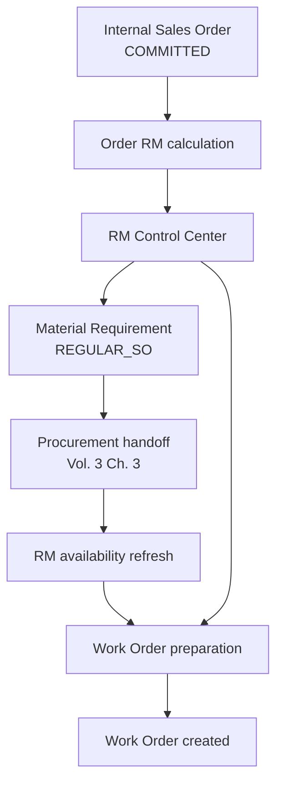
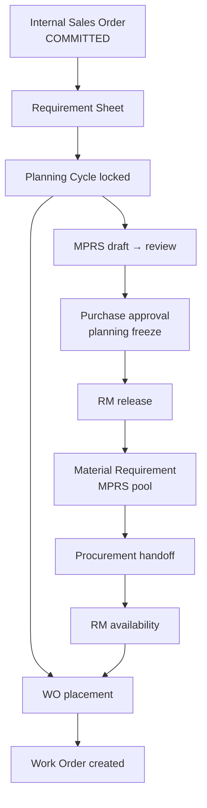
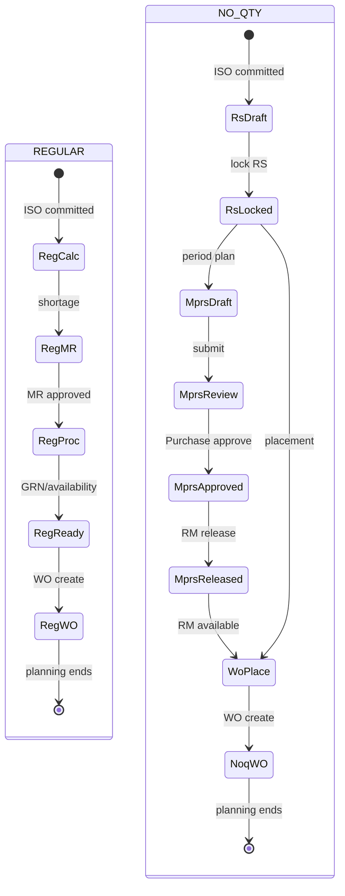

# Planning Domain Specification

| Field | Value |
|-------|-------|
| **Document ID** | FT-PD-031 |
| **Volume** | 3 — Domain Specifications |
| **Chapter** | 2 — Planning Domain Specification |
| **Title** | Planning Domain Specification |
| **Version** | 1.0.0 |
| **Status** | Draft — Architecture Review |
| **Effective date** | 2026-05-29 |
| **Author** | FT ERP Product Team |
| **Owner** | FT ERP Product Architecture |
| **Audience** | Product, domain authors, workflow engineers, Store/Purchase process owners |
| **Classification** | Product — Domain Specification |

**Parent documents:**

- [Volume 2, Chapter 2 — REGULAR Order Planning Pipeline](../02_Business_Architecture/Chapter_02_REGULAR_Order_Planning_Pipeline.md)
- [Volume 2, Chapter 3 — NO_QTY Agreement Planning Pipeline](../02_Business_Architecture/Chapter_03_NO_QTY_Agreement_Planning_Pipeline.md)
- [Volume 3, Chapter 1 — Commercial Domain Specification](./Chapter_01_Commercial_Domain_Specification.md)
- [Volume 2, Chapter 5 — Document Ownership & Responsibility Matrix](../02_Business_Architecture/Chapter_05_Document_Ownership_and_Responsibility_Matrix.md)
- [Chapter 2 — FT ERP Constitution](../01_Product_Foundation/Chapter_02_FT_ERP_Constitution.md)
- [Chapter 3 — Glossary](../01_Product_Foundation/Chapter_03_FT_ERP_Glossary_and_Standard_Terminology.md)

---

## 1. Document Control

| Version | Date | Author | Summary |
|---------|------|--------|---------|
| 1.0.0 | 2026-05-29 | FT ERP Product Team | Initial Planning domain — REGULAR and NO_QTY documents, states, logic |

**Supersedes:** None.

**Change authority:** Product Architecture. MPRS or RS semantics changes require Volume 2 Ch. 2–3 alignment and Volume 4 workflow review.

**Out of scope:** Procurement execution detail (Volume 3 Ch. 3), Work Order execution / PMR (Volume 3 Ch. 4), APIs, database, UI implementation.

---

## 2. Purpose

This chapter defines the **complete functional specification** of the **Planning domain** in FT ERP.

It covers **both** planning pipelines:

- **REGULAR Order Planning** — order-quantity-driven RM readiness and Work Order preparation
- **NO_QTY Agreement Planning** — Requirement Sheet cycles, MPRS, RM release, and WO placement

Architecture is defined in [Volume 2, Chapters 2–3](../02_Business_Architecture/README.md); this chapter specifies **document behavior**, **workflow states**, **planning logic**, **validations**, and **role surfaces**.

---

## 3. Scope

### 3.1 In scope

- Planning domain boundaries and handoffs (Commercial → Planning → Manufacturing)
- Document specs: RS, Planning Cycle, MPRS, Material Requirement, RM Release, Work Order Preparation
- Workflow states and transitions
- Planning logic (Green Level, carry forward, freeze, calculations)
- Business Rules, Pending Actions, Dashboard, Workspace, Control Tower, validation matrix
- REGULAR and NO_QTY differences **explicit** in each section

### 3.2 Out of scope

- Commercial documents ([Volume 3, Ch. 1](./Chapter_01_Commercial_Domain_Specification.md))
- PR, PO, GRN behavior ([Volume 3, Ch. 3](./README.md) — planned)
- PMR, Material Issue, Production ([Volume 3, Ch. 4](./README.md) — planned)
- Workflow Engine implementation (Volume 4)

### 3.3 Terminology

[Glossary](../01_Product_Foundation/Chapter_03_FT_ERP_Glossary_and_Standard_Terminology.md) terms only.

---

## 4. Domain Responsibilities

### 4.1 What the Planning domain owns

| Responsibility | REGULAR | NO_QTY |
|----------------|---------|--------|
| RM need identification | Order BOM explosion vs stock | MPRS RM Snapshot; RS-driven placement |
| Demand documents | Material Requirement (REGULAR_SO) | RS, MPRS, MR (MPRS pool) |
| Period / cycle planning | N/A (order-scoped) | Requirement Sheet, Planning Cycle, MPRS |
| Procurement demand publication | MR approval → REGULAR_SO | RM release → MPRS pool MR |
| Work Order creation (planning terminus) | WO prepare from ISO | WO placement from RS balance |
| Readiness workspaces | RM Control Center | Requirement & Cycle Planning, MPRS |

### 4.2 What the Planning domain does not own

| Excluded | Owned by |
|----------|----------|
| Enquiry → Internal Sales Order | Commercial domain (Vol. 3 Ch. 1) |
| PR, PO, supplier follow-up | Procurement domain |
| PMR, issue, production | Manufacturing domain |
| Dispatch, Sales Bill | Dispatch & Billing domain |

### 4.3 Domain boundaries

| Boundary | Rule |
|----------|------|
| **Commercial → Planning** | Planning starts when ISO ≥ `COMMITTED` ([Vol. 3 Ch. 1](./Chapter_01_Commercial_Domain_Specification.md) CDS-06) |
| **Planning → Manufacturing** | Planning ends at **Work Order creation**; PMR begins in Manufacturing domain ([Vol. 2 Ch. 4](../02_Business_Architecture/Chapter_04_Manufacturing_Execution_Pipeline.md)) |
| **Planning ≠ execution** | Planning freeze, MR, release, GRN, WO create do **not** issue RM or start production |

### 4.4 Primary roles

| Role | Planning responsibility |
|------|-------------------------|
| **Store** | RS, MPRS draft, RM release, REGULAR MR, WO preparation/placement |
| **Purchase** | MPRS Purchase review and approval only (NO_QTY) |
| **Admin** | ISO commercial context; no planning document ownership (standard) |

---

## 5. Planning Documents

### 5.1 Requirement Sheet (RS)

*NO_QTY Agreement only.*

| Attribute | Specification |
|-----------|---------------|
| **Purpose** | Capture cycle-level FG demand (Requirement Lines) for manufacturing placement |
| **Creator** | Store |
| **Owner** | Store |
| **Inputs** | Committed NO_QTY Internal Sales Order; customer schedule; carry forward from prior cycle |
| **Outputs** | Locked RS → Planning Cycle; WO placement balance per line |
| **Lifecycle** | Draft → Active → Locked → Superseded \| Cancelled |
| **Allowed actions** | Add/edit lines; import schedule; lock; supersede with new version; cancel (pre-lock) |
| **Validation rules** | Parent ISO NO_QTY + ≥ COMMITTED; FG items on approved BOM list; line qty > 0 when locking; no duplicate active RS for same cycle key |
| **Completion criteria** | **Locked** enables WO placement; balance consumed by Work Orders until cycle close |

---

### 5.2 Planning Cycle

*NO_QTY — logical period bound to RS version.*

| Attribute | Specification |
|-----------|---------------|
| **Purpose** | Bounded window: plan → procure → place WO → execute → dispatch → replan |
| **Creator** | Store (on RS lock) |
| **Owner** | Store |
| **Inputs** | Locked Requirement Sheet version; period/cycle identity |
| **Outputs** | Cycle progress metrics; carry forward candidate qty |
| **Lifecycle** | Open → Locked → In Execution → Closed |
| **Allowed actions** | Open on RS draft; lock with RS; mark in execution on first WO; close after dispatch threshold or manual cycle complete |
| **Validation rules** | One active locked cycle per RS version; cannot lock without ≥1 requirement line |
| **Completion criteria** | **Closed** when cycle intent fulfilled or explicitly rolled to next RS version |

---

### 5.3 Monthly Production Planning Sheet (MPRS)

*NO_QTY — period FG plan and procurement freeze.*

| Attribute | Specification |
|-----------|---------------|
| **Purpose** | Consolidate period FG planned qty; freeze RM after Purchase approval; source of MPRS procurement |
| **Creator** | Store |
| **Owner** | Store (draft/release); Purchase (review/approve) |
| **Inputs** | RS lines; Green Level shortage; carry forward; suggested production |
| **Outputs** | Monthly Production Plan (`INITIAL` or `ADDITIONAL`); Monthly Planning RM Snapshot on approval |
| **Lifecycle** | Draft → Awaiting Purchase Review → Approved → Release Pending → Released \| Rejected \| Cancelled |
| **Allowed actions** | Edit FG plan (draft); submit for review; Purchase approve/reject; Store release RM; create Additional Plan |
| **Validation rules** | Period identity required; planKind INITIAL before ADDITIONAL in period; approved BOM for FG lines; Purchase cannot approve own draft |
| **Completion criteria** | **Released** — RM requirement published to procurement pool; incremental Additional Plans follow same path |

---

### 5.4 Material Requirement (MR)

*Both models — **source pool differs**.*

| Attribute | REGULAR | NO_QTY |
|-----------|---------|--------|
| **Purpose** | Document RM shortage for procurement | Same — from released MPRS snapshot |
| **Creator** | Store | System on RM release (Store action) |
| **Owner** | Store (raise/approve) | Store (release context); Purchase (PR stage) |
| **Inputs** | Order RM gap; ISO/WO planning context | Frozen Monthly Planning RM Snapshot |
| **Outputs** | REGULAR_SO pool demand | MPRS pool demand (`MONTHLY_PLAN` source) |
| **Lifecycle** | Draft → Approved → In Procurement → Closed | Created on release → In Procurement → Closed |
| **Allowed actions** | Create; approve; cancel duplicate; close when fulfilled | Release creates; cancel only per reversal policy |
| **Validation rules** | REGULAR_SO source only; ISO REGULAR | MPRS source only; plan Approved+Released |
| **Completion criteria** | Shortage covered or MR closed with reason | Procurement chain complete or MR closed |

**Pool firewall:** MR **must not** mix REGULAR_SO and MPRS sources in one document or one PR ([Vol. 2 Ch. 3](../02_Business_Architecture/Chapter_03_NO_QTY_Agreement_Planning_Pipeline.md) NPL-08).

---

### 5.5 RM Release

*NO_QTY — explicit planning **action/stage** on approved Monthly Production Plan.*

| Attribute | Specification |
|-----------|---------------|
| **Purpose** | Publish frozen RM requirement to procurement (MPRS pool); handoff to Procurement domain |
| **Creator** | Store |
| **Owner** | Store |
| **Inputs** | MPRS in **Approved** state; Monthly Planning RM Snapshot present |
| **Outputs** | Material Requirement(s) in MPRS pool; `releasedAt` timestamp on plan |
| **Lifecycle** | Not Released → Released |
| **Allowed actions** | Release (confirm); **no** Work Order create on this action |
| **Validation rules** | Plan must be Approved; snapshot immutable; not already Released for same revision |
| **Completion criteria** | **Released** — Procurement domain owns PR/PO/GRN |

*REGULAR:* No RM release stage — MR raised directly from order shortage ([Vol. 2 Ch. 2](../02_Business_Architecture/Chapter_02_REGULAR_Order_Planning_Pipeline.md) §8).

---

### 5.6 Work Order Preparation

*REGULAR: **WO prepare** · NO_QTY: **WO placement**.*

| Attribute | REGULAR | NO_QTY |
|-----------|---------|--------|
| **Purpose** | Validate order RM readiness; create Work Order | Validate RS balance vs RM; create Work Order(s) |
| **Creator** | Store | Store |
| **Owner** | Store |
| **Inputs** | ISO lines; RM coverage; MR/GRN status | Locked RS; RM availability; optional WO Batch |
| **Outputs** | Work Order document(s) | Work Order document(s); RS balance consumption |
| **Lifecycle** | Not Ready → Ready → Partial Ready → WO Created | Awaiting RS → Awaiting RM → Ready → Placed |
| **Allowed actions** | Evaluate readiness; create full/partial WO; defer | Place WO wave; multiple WOs per RS |
| **Validation rules** | Approved BOM; REGULAR ISO open; coverage policy | RS locked; placement balance > 0; RM readiness |
| **Completion criteria** | **WO Created** — Planning domain handoff to Manufacturing |

**REGULAR workspace:** RM Control Center supports WO prepare case diagnosis ([Vol. 2 Ch. 2](../02_Business_Architecture/Chapter_02_REGULAR_Order_Planning_Pipeline.md) §7).

**Planning terminus:** Work Order creation ends Planning domain responsibility for placed quantity.

---

## 6. Workflow States

### 6.1 Requirement Sheet

```
DRAFT → ACTIVE → LOCKED → SUPERSEDED
         ↓
      CANCELLED (pre-lock only)
```

| State | WO placement | Edit lines |
|-------|--------------|------------|
| `DRAFT` | Blocked | Yes |
| `ACTIVE` | Blocked | Yes |
| `LOCKED` | Allowed | No |
| `SUPERSEDED` | No (new version active) | No |
| `CANCELLED` | Blocked | No |

### 6.2 Planning Cycle

```
OPEN → LOCKED → IN_EXECUTION → CLOSED
```

| State | Meaning |
|-------|---------|
| `OPEN` | RS editable; cycle not committed |
| `LOCKED` | RS locked; cycle authoritative |
| `IN_EXECUTION` | ≥1 WO placed or execution started |
| `CLOSED` | Cycle complete; carry forward evaluated |

### 6.3 MPRS (Monthly Production Plan)

```
DRAFT
  ↓ submit
AWAITING_PURCHASE_REVIEW
  ↓ approve | reject
APPROVED | REJECTED
  ↓ release (Store)
RELEASE_PENDING (optional UI state) → RELEASED
  ↓ cancel (draft only)
CANCELLED
```

| State | Planning freeze | Procurement |
|-------|-----------------|-------------|
| `DRAFT` | No | No |
| `AWAITING_PURCHASE_REVIEW` | No | No |
| `APPROVED` | **Yes** (FG + RM Snapshot) | Awaiting release |
| `REJECTED` | No | No |
| `RELEASED` | Yes | MR in MPRS pool |
| `CANCELLED` | No | No |

**Additional Plan:** New document `planKind = ADDITIONAL`; own State Machine; does not mutate Initial Plan history.

### 6.4 RM Release

```
NOT_RELEASED → RELEASED
```

Tied to parent MPRS `APPROVED` → `RELEASED`. Irreversible without formal reversal workflow (Volume 4).

### 6.5 Material Requirement

**REGULAR:**

```
DRAFT → APPROVED → IN_PROCUREMENT → CLOSED
         ↓
      CANCELLED
```

**NO_QTY (MPRS-sourced):**

```
CREATED → IN_PROCUREMENT → CLOSED
```

### 6.6 Work Order Preparation (readiness case)

**REGULAR case states:**

```
NOT_READY → READY | PARTIAL_READY → WO_CREATED
```

**NO_QTY placement states:**

```
AWAITING_RS_LOCK → AWAITING_RM → READY → PLACED (WO exists)
```

---

## 7. Planning Logic

### 7.1 Green Level

**Applies:** NO_QTY (MPRS composition).

FG buffer planning metadata on items ([Glossary](../01_Product_Foundation/Chapter_03_FT_ERP_Glossary_and_Standard_Terminology.md)). Informs **suggested production** in MPRS—not RM minimum stock, not shop-floor safety stock.

**Green Level Shortage** = FG qty below Green Level target → contributes to suggested FG plan lines before RM explosion.

### 7.2 Carry Forward

**Applies:** NO_QTY.

Rolls unmet or partially met cycle/period intent into current planning view **without double-counting** fulfilled qty. Sources next RS or MPRS draft lines. Not a new commercial order.

**Validation:** Carry forward qty ≤ prior cycle unfulfilled balance; audit link to source cycle.

### 7.3 Additional Planning

**Applies:** NO_QTY.

**Additional Plan** (`planKind = ADDITIONAL`) after Initial Plan approval in same period. Captures incremental FG/RM delta. Requires Purchase review and approval; RM release publishes **incremental** MR only.

ARR may cover ad-hoc RM outside monthly freeze—supplementary, not substitute for base MPRS release ([Glossary ARR](../01_Product_Foundation/Chapter_03_FT_ERP_Glossary_and_Standard_Terminology.md)).

### 7.4 Planning Freeze

**Applies:** NO_QTY (MPRS approval).

At Purchase **approval** of Monthly Production Plan:

- FG plan lines immutable for revision reference
- **Monthly Planning RM Snapshot** created (frozen RM lines)
- Execution and procurement cite frozen revision—not live BOM re-explosion

**REGULAR:** Order planning snapshots (e.g. production Planning Snapshot) freeze intent at defined milestones per product policy; no MPRS document.

### 7.5 Suggested Production

**Applies:** NO_QTY (MPRS draft).

System-composed FG qty suggestion from:

- RS requirement lines in period
- Green Level shortage
- Carry forward
- Configured buffers (Volume 10)

Store may override before submit; after approval, suggestion is historical only.

### 7.6 RM Requirement Calculation

| Model | Basis | Timing |
|-------|-------|--------|
| **REGULAR** | ISO FG qty × approved BOM (+ buffer) minus available/incoming RM | Live at MR create and WO prepare refresh |
| **NO_QTY** | Planned FG qty × approved BOM per MPRS composition rules | Live estimate pre-approval; **frozen Snapshot** post-approval |

Post-freeze NO_QTY procurement uses snapshot lines at RM release—not live replan.

### 7.7 Suggested WO Quantity

| Model | Formula (conceptual) |
|-------|----------------------|
| **REGULAR** | `min(remaining ISO line qty, RM-readiness-constrained FG capacity)` |
| **NO_QTY** | `min(RS line placement balance, RM-readiness-constrained FG capacity, policy limits)` |

Partial RM → proportional reduction. Multiple placement waves allowed. Suggestion is advisory; Store confirms on WO create.

---

## 8. Business Rules

| ID | Rule |
|----|------|
| **PLN-01** | Planning starts only after ISO **COMMITTED** (Commercial handoff). |
| **PLN-02** | **Requirement Sheet** drives NO_QTY manufacturing demand capture and WO placement balance. |
| **PLN-03** | **MPRS** drives NO_QTY period **procurement** after approval, release, and MR creation. |
| **PLN-04** | **Planning freeze** at MPRS Purchase approval; post-freeze RM from snapshot. |
| **PLN-05** | **Additional Plan** follows same review/release discipline; does not rewrite Initial Plan. |
| **PLN-06** | **RM release never creates Work Orders.** |
| **PLN-07** | **REGULAR_SO** and **MPRS** procurement pools **never mix** in MR or PR. |
| **PLN-08** | **Planning ends at Work Order creation** for placed quantity. |
| **PLN-09** | Planning actions **never** start PMR, issue, production, or dispatch. |
| **PLN-10** | REGULAR WO prepare **must not** use MPRS or RS as primary entry. |
| **PLN-11** | NO_QTY WO placement **must not** use REGULAR order WO prepare as primary entry. |
| **PLN-12** | **Multiple Work Orders** may consume one RS within balance limits. |
| **PLN-13** | WO creation **consumes** RS placement balance (NO_QTY) or reduces ISO preparable balance (REGULAR). |
| **PLN-14** | **Purchase review** on MPRS is monthly plan approval—not REGULAR PR queue semantics. |
| **PLN-15** | Store creates REGULAR MR and REGULAR PR (standard); Purchase creates MPRS PR (standard). |
| **PLN-16** | Locked RS required before NO_QTY WO placement. |
| **PLN-17** | Approved BOM required before MR raise or WO create (both models). |
| **PLN-18** | Carry forward **must not** duplicate already-fulfilled quantity. |

*Architecture rules RPL-* and NPL-* in Volume 2 remain authoritative; PLN rules operationalize them.*

---

## 9. Pending Actions

Engine-generated only. Representative planning Pending Actions:

### 9.1 Store

| ID | Trigger | Action |
|----|---------|--------|
| `PLN_RS_LOCK` | RS Active; lines complete | Lock Requirement Sheet |
| `PLN_MPRS_DRAFT` | Period open; no draft plan | Complete MPRS draft |
| `PLN_MPRS_SUBMIT` | MPRS Draft complete | Submit for Purchase review |
| `PLN_MPRS_RELEASE` | MPRS Approved; not Released | Release RM to procurement |
| `PLN_MR_REGULAR` | REGULAR shortage; no MR | Raise Material Requirement |
| `PLN_MR_PR` | REGULAR MR Approved; no PR | Create Purchase Requisition |
| `PLN_WO_PREPARE` | REGULAR case Ready | Create Work Order |
| `PLN_WO_PLACE` | NO_QTY RS locked + RM ready | Place Work Order |
| `PLN_RS_CONTINUE` | Post-dispatch cycle | Continue next cycle planning |
| `PLN_BOM_BLOCK` | BOM missing on case | Resolve BOM (escalation) |

### 9.2 Purchase

| ID | Trigger | Action |
|----|---------|--------|
| `PLN_MPRS_REVIEW` | MPRS Awaiting Purchase Review | Review monthly plan |
| `PLN_MPRS_APPROVE` | Review complete | Approve or reject plan |
| `PLN_MPRS_PR` | MPRS MR released; no PR | Create Purchase Requisition |

*REGULAR PR/PO queue actions belong to Procurement domain Pending Actions when PR exists.*

### 9.3 Admin

| ID | Trigger | Action |
|----|---------|--------|
| `PLN_ISO_HANDOFF` | ISO Committed; planning not acknowledged | Commercial handoff visibility only |

Admin does not own planning document actions in standard product.

---

## 10. Dashboard Responsibilities

**Store Dashboard = My Work** for planning ([Constitution Art. 13](../01_Product_Foundation/Chapter_02_FT_ERP_Constitution.md)).

| Zone | REGULAR | NO_QTY |
|------|---------|--------|
| **My Work** | §9.1 Store Pending Actions | §9.1 Store Pending Actions |
| **Order RM queue** | ISO cases in RM Control Center | — |
| **Cycle planning queue** | — | Open RS / locked cycles |
| **Monthly planning queue** | — | Draft / release-pending MPRS |
| **WO queue** | Ready for WO prepare | Ready for placement |
| **KPIs** | Orders awaiting RM; ready WO count | Plans awaiting review/release; RS balance open |

**Purchase Dashboard:** `PLN_MPRS_REVIEW`, `PLN_MPRS_PR` only for NO_QTY monthly governance.

**Rule:** REGULAR Store Dashboard does not show MPRS review actions; Purchase Dashboard does not show REGULAR Store PR creation.

---

## 11. Workspace Responsibilities

| Workspace | Model | Owner | Behavior |
|-----------|-------|-------|----------|
| **RM Control Center** | REGULAR | Store | Case-oriented ISO RM diagnosis; coverage strip; WO prepare handoff ([Vol. 2 Ch. 2](../02_Business_Architecture/Chapter_02_REGULAR_Order_Planning_Pipeline.md) §7) |
| **Requirement & Cycle Planning** | NO_QTY | Store | RS lines; lock; placement balance; cycle progress |
| **Monthly Production Planning Sheet** | NO_QTY | Store / Purchase | FG plan; live RM estimate (draft); snapshot view (approved); release action |
| **WO prepare / placement** | Both | Store | Readiness validation; suggested qty; create WO |

### 11.1 Common workspace rules

- Document header: number, state, Business Model badge, parent ISO
- Wrong-flow Guard: REGULAR ISO cannot open MPRS-primary workspace; NO_QTY cannot open REGULAR WO prepare as primary
- Write CTAs only for owning role
- Continuity strip: MR → PR → PO → GRN for procurement context (read-only in Planning workspace)
- Handoff banner at WO create → Manufacturing domain

---

## 12. Control Tower Visibility

| KPI / theme | REGULAR | NO_QTY |
|-------------|---------|--------|
| Planning backlog | ISO awaiting RM; MR/PR/GRN aging | Draft RS; draft MPRS; awaiting Purchase review |
| Procurement bottleneck | REGULAR_SO MR without PR/PO/GRN | Approved plan not released; MPRS MR aging |
| RM shortage | Order line gap | Cycle/period RM gap |
| WO waiting | Ready but no WO | RS ready; placement blocked on RM |
| Cycle progress | Order % on WO | RS placed vs balance |
| Owner column | Store / Purchase | Store / Purchase |
| Recommended action | Deep-link to RM Control Center or MPRS | Deep-link to RS or MPRS Workspace |

Control Tower monitors; does not execute Store/Purchase planning writes.

---

## 13. Validation Matrix

| Validation | Trigger | Blocking behavior | Role |
|------------|---------|-------------------|------|
| ISO ≥ COMMITTED | Planning start | Block RS/MR/MPRS/WO | Store |
| Business Model REGULAR | REGULAR planning doc create | Block RS/MPRS on REGULAR ISO | System |
| Business Model NO_QTY | NO_QTY planning doc create | Block REGULAR-primary WO prepare | System |
| Approved BOM exists | MR / WO / MPRS line | Block save | Store |
| RS locked | NO_QTY WO placement | Block WO create | Store |
| RS placement balance > 0 | WO placement | Block WO create | Store |
| MPRS Approved | RM release | Block release | Store |
| MPRS not Released | Duplicate release | Block release | Store |
| Purchase approval required | MPRS submit → approve | Block release until Approved | Purchase |
| Pool source REGULAR_SO | REGULAR MR | Block MPRS source | System |
| Pool source MPRS | NO_QTY MR from release | Block REGULAR_SO source | System |
| Mixed pool PR | PR create | Block PR | System |
| Planning freeze | Edit approved FG/snapshot | Block edit | Store |
| Carry forward audit | Carry forward line | Block if exceeds source | Store |
| Additional before Initial | ADDITIONAL plan create | Block if no approved Initial | Store |
| RM release ≠ WO | Release action | Block WO on same action | System |
| Duplicate active MR | MR create | Block or merge per policy | Store |
| ISO commercial complete | New planning | Block new WO (policy) | Store |

---

## 14. Lifecycle Diagrams

### 14.1 REGULAR planning



### 14.2 NO_QTY planning



### 14.3 Planning state transitions (combined)



---

## 15. Review Checklist

- [ ] Functional spec only; no API, DB, UI
- [ ] Both REGULAR and NO_QTY covered with explicit differences
- [ ] Volume 2 Ch. 2–3 cross-referenced, not redefined
- [ ] All six planning artifacts specified (§5)
- [ ] Workflow states per document (§6)
- [ ] Planning logic §7 complete
- [ ] PLN Business Rules
- [ ] Pending Actions Store / Purchase / Admin
- [ ] Dashboard, Workspace, Control Tower
- [ ] Validation matrix
- [ ] Three Mermaid diagrams
- [ ] Planning terminus at WO creation
- [ ] Pool firewall and RM release ≠ WO

---

## 16. Change Log

| Version | Date | Author | Summary |
|---------|------|--------|---------|
| 1.0.0 | 2026-05-29 | FT ERP Product Team | Initial Planning Domain Specification |

---

## 17. Approval Block

| Role | Name | Signature | Date |
|------|------|-----------|------|
| Product Owner | | | |
| Product Architecture | | | |
| Store Process Owner | | | |
| Purchase Process Owner | | | |
| Workflow Engineering Lead | | | |

---

## Document navigation

| | Link |
|--|------|
| **Previous** | [Commercial Domain Specification](./Chapter_01_Commercial_Domain_Specification.md) (FT-PD-030) |
| **Next** | [Procurement Domain Specification](./Chapter_03_Procurement_Domain_Specification.md) (FT-PD-032) |
| **Volume** | [Domain Specifications](./README.md) |
| **Product** | [Product Documentation Index](../README.md) |

