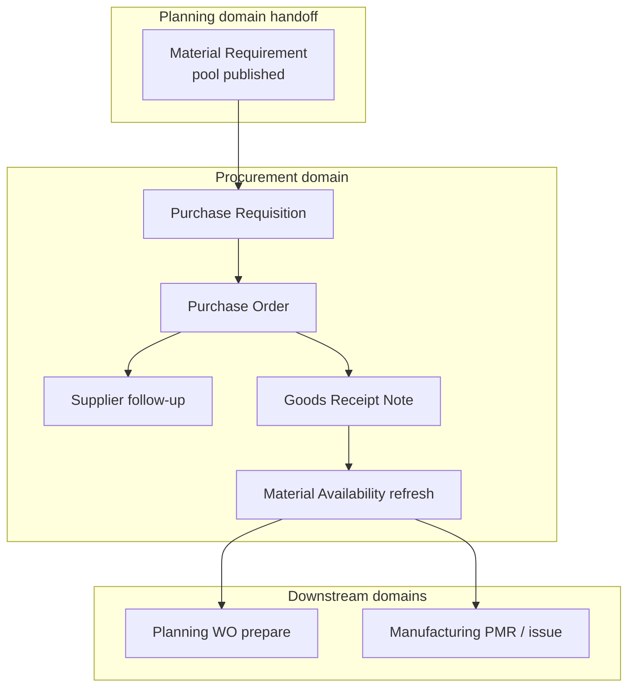
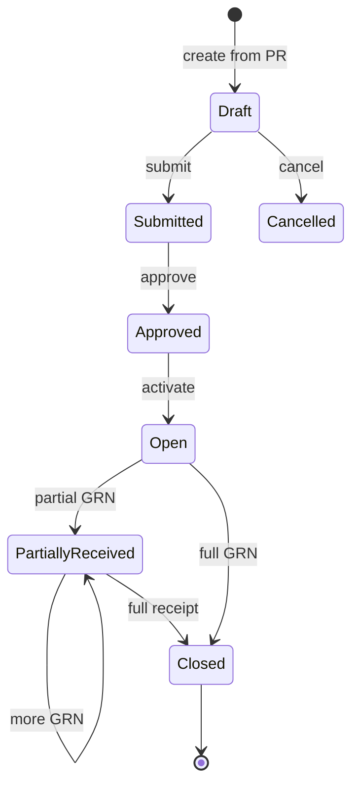
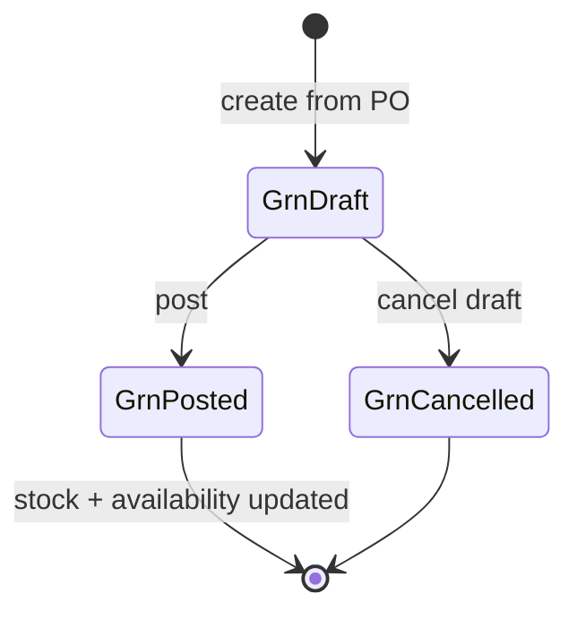

# Procurement Domain Specification

| Field | Value |
|-------|-------|
| **Document ID** | FT-PD-032 |
| **Volume** | 3 — Domain Specifications |
| **Chapter** | 3 — Procurement Domain Specification |
| **Title** | Procurement Domain Specification |
| **Version** | 1.0.0 |
| **Status** | Draft — Architecture Review |
| **Effective date** | 2026-05-29 |
| **Author** | FT ERP Product Team |
| **Owner** | FT ERP Product Architecture |
| **Audience** | Product, domain authors, workflow engineers, Store/Purchase process owners |
| **Classification** | Product — Domain Specification |

**Parent documents:**

- [Volume 3, Chapter 2 — Planning Domain Specification](./Chapter_02_Planning_Domain_Specification.md)
- [Volume 2, Chapter 2 — REGULAR Order Planning Pipeline](../02_Business_Architecture/Chapter_02_REGULAR_Order_Planning_Pipeline.md)
- [Volume 2, Chapter 3 — NO_QTY Agreement Planning Pipeline](../02_Business_Architecture/Chapter_03_NO_QTY_Agreement_Planning_Pipeline.md)
- [Volume 2, Chapter 5 — Document Ownership & Responsibility Matrix](../02_Business_Architecture/Chapter_05_Document_Ownership_and_Responsibility_Matrix.md)
- [Chapter 2 — FT ERP Constitution](../01_Product_Foundation/Chapter_02_FT_ERP_Constitution.md)
- [Chapter 3 — Glossary](../01_Product_Foundation/Chapter_03_FT_ERP_Glossary_and_Standard_Terminology.md)

---

## 1. Document Control

| Version | Date | Author | Summary |
|---------|------|--------|---------|
| 1.0.0 | 2026-05-29 | FT ERP Product Team | Initial Procurement domain — PR, PO, GRN, pools, availability |

**Supersedes:** None.

**Change authority:** Product Architecture. Pool segregation or PR ownership changes require Volume 2 alignment and Volume 4 workflow review.

**Out of scope:** Material Requirement creation (Planning domain), PMR/issue (Manufacturing domain), APIs, database, UI implementation.

---

## 2. Purpose

This chapter defines the **complete functional specification** of the **Procurement domain** in FT ERP.

Procurement begins where **Planning publishes demand** (approved REGULAR Material Requirement or MPRS RM release) and ends when **raw material becomes available** for manufacturing planning and issue—via **Goods Receipt Note** posting and **Material Availability** refresh.

Architecture is in [Volume 2, Chapters 2–3](../02_Business_Architecture/README.md) and [Volume 3, Chapter 2](./Chapter_02_Planning_Domain_Specification.md); this chapter specifies **procurement document behavior**, **demand pools**, **ownership**, **states**, and **validations**.

---

## 3. Scope

### 3.1 In scope

- Procurement domain boundaries (Planning handoff → Manufacturing readiness)
- Artifacts: Purchase Requisition, Purchase Order, Supplier Follow-up, GRN, Material Availability
- Workflow states and transitions
- Three demand pools and source-aware PR ownership
- Business Rules, Pending Actions, Dashboard, Workspace, Control Tower, validation matrix

### 3.2 Out of scope

- Material Requirement raise/approve/release ([Volume 3, Ch. 2](./Chapter_02_Planning_Domain_Specification.md))
- MPRS monthly plan approval (Planning domain — Purchase review stage)
- PMR, Material Issue, Work Order creation
- Purchase Bill / supplier invoice (future financial domain)
- Workflow Engine implementation (Volume 4)

### 3.3 Terminology

[Glossary](../01_Product_Foundation/Chapter_03_FT_ERP_Glossary_and_Standard_Terminology.md): **Purchase Requisition (PR)**, **Purchase Order (PO)**, **Goods Receipt Note (GRN)**, **Material Requirement (MR)**, **Material Availability**.

---

## 4. Domain Responsibilities

### 4.1 What the Procurement domain owns

| Responsibility | Description |
|----------------|-------------|
| **Demand execution** | Convert published MR lines into PR → PO → inbound stock |
| **Pool segregation** | REGULAR_SO, MPRS, STOCK_REPLENISHMENT queues never mixed |
| **Supplier commercial** | PO terms, supplier allocation, expedite/follow-up |
| **Inbound posting** | GRN receipt into stock locations |
| **Availability Read Model** | Recompute on-hand, incoming, free, shortage after receipt |

### 4.2 What the Procurement domain does not own

| Excluded | Owned by |
|----------|----------|
| MR creation, MPRS release | Planning domain |
| WO create, PMR, Material Issue | Manufacturing domain |
| Supplier master maintenance | Master data (Volume 5) |
| Sales-side commercial orders | Commercial domain |

### 4.3 Domain boundaries

| Boundary | Rule |
|----------|------|
| **Planning → Procurement** | MR **Approved** (REGULAR) or MPRS **Released** (NO_QTY) enables PR creation |
| **Procurement → Manufacturing** | GRN posted → Material Availability refreshed → Planning/Manufacturing may proceed to WO prepare / issue |
| **Procurement ≠ manufacturing** | PR, PO, GRN **never** create Work Orders or issue RM to production |

### 4.4 Primary roles

| Role | Procurement responsibility |
|------|---------------------------|
| **Purchase** | PO creation, supplier follow-up, MPRS PR creation (standard) |
| **Store** | REGULAR_SO PR creation (standard), GRN posting, replenishment PR (default) |
| **Admin** | Supplier master; no standard PR/PO/GRN ownership |

---

## 5. Procurement Artifacts

### 5.1 Purchase Requisition (PR)

| Attribute | Specification |
|-----------|---------------|
| **Purpose** | Formal request to execute RM supply from consolidated MR demand |
| **Creator** | **Store** (REGULAR_SO, STOCK_REPLENISHMENT default) · **Purchase** (MPRS standard) |
| **Owner** | Creator role at PR stage; Purchase accountable for PO conversion |
| **Inputs** | Approved/open Material Requirement lines; single demand pool per PR |
| **Outputs** | Purchase Order (on conversion); MR procurement stage advance |
| **Lifecycle** | Draft → Submitted → Approved → Converted → Closed \| Cancelled |
| **Allowed actions** | Create from MR; edit (draft); submit; approve; convert to PO; cancel |
| **Validation rules** | One pool per PR; MR lines same source; creator role matches pool policy; qty ≤ MR open qty |
| **Completion criteria** | **Converted** to PO or **Closed** when MR fulfilled/cancelled |

**Pool → PR creator (standard product):**

| Demand pool | MR source | PR creator |
|-------------|-----------|------------|
| **REGULAR_SO** | Order / WO planning MR | **Store** |
| **MPRS** | `MONTHLY_PLAN` released MR | **Purchase** |
| **STOCK_REPLENISHMENT** | Replenishment / ARR MR | **Store** (default) |

---

### 5.2 Purchase Order (PO)

| Attribute | Specification |
|-----------|---------------|
| **Purpose** | Supplier commercial order for RM supply |
| **Creator** | Purchase |
| **Owner** | Purchase |
| **Inputs** | Approved PR lines; supplier master; commercial terms |
| **Outputs** | Open PO lines; incoming qty in Material Availability; GRN targets |
| **Lifecycle** | Draft → Submitted → Approved → Open → Partially Received → Closed \| Cancelled |
| **Allowed actions** | Create from PR; edit (draft); submit; approve; send to supplier; record follow-up; close |
| **Validation rules** | Must reference approved PR (standard); supplier active; line qty ≤ PR remaining; single pool inherited from PR |
| **Completion criteria** | **Closed** when fully received or formally short-closed; **Cancelled** only pre-receipt per policy |

---

### 5.3 Supplier Follow-up

| Attribute | Specification |
|-----------|---------------|
| **Purpose** | Expedite delivery, confirm dates, resolve supplier blockers — **not** a separate ERP document |
| **Creator** | Purchase |
| **Owner** | Purchase |
| **Inputs** | Open PO lines; expected delivery dates; supplier communication |
| **Outputs** | Updated expected date notes; escalation flags; optional PO line schedule revision (pre-close) |
| **Lifecycle** | N/A — activity log on PO case |
| **Allowed actions** | Log follow-up; mark expedited; escalate to Control Tower |
| **Validation rules** | PO must be Open or Partially Received |
| **Completion criteria** | PO received or closed |

---

### 5.4 Goods Receipt Note (GRN)

| Attribute | Specification |
|-----------|---------------|
| **Purpose** | Post supplier RM into stock from PO lines |
| **Creator** | Store |
| **Owner** | Store |
| **Inputs** | Open PO lines; receiving location; received qty (full or partial) |
| **Outputs** | Stock Ledger increase; Material Availability refresh; PO receipt progress |
| **Lifecycle** | Draft → Posted \| Cancelled (draft only) |
| **Allowed actions** | Create from PO; edit draft; post; partial line receipt; cancel draft |
| **Validation rules** | PO Open/Partially Received; qty > 0; qty ≤ PO line remaining; receiving location valid |
| **Completion criteria** | **Posted** — stock and availability updated; irreversible without formal reversal (Volume 4) |

---

### 5.5 Material Availability (RM Availability)

| Attribute | Specification |
|-----------|---------------|
| **Purpose** | Read Model of RM position for planning and issue decisions |
| **Creator** | System (computed) |
| **Owner** | System |
| **Inputs** | Stock Ledger; reservations; open PO incoming; open MR/PMR demand |
| **Outputs** | On-hand, reserved, incoming, free, shortage per item/location context |
| **Lifecycle** | N/A — continuous recompute on stock events |
| **Allowed actions** | None (read-only); drill-down to MR/PO/GRN trace |
| **Validation rules** | N/A |
| **Completion criteria** | N/A — availability reflects latest posted GRN and issues |

**Procurement domain terminus:** Posted GRN → availability refresh → Planning WO prepare / Manufacturing PMR issue may proceed per their domain rules.

---

## 6. Workflow States

### 6.1 Purchase Requisition

```
DRAFT
  ↓ submit
SUBMITTED
  ↓ approve
APPROVED
  ↓ convert to PO
CONVERTED
  ↓ MR closed
CLOSED
  ↓ cancel (draft/submitted)
CANCELLED
```

| State | PO conversion | Edit |
|-------|---------------|------|
| `DRAFT` | No | Yes |
| `SUBMITTED` | No | Limited |
| `APPROVED` | Yes | No |
| `CONVERTED` | Done | No |
| `CLOSED` | N/A | No |
| `CANCELLED` | No | No |

### 6.2 Purchase Order

```
DRAFT
  ↓ submit
SUBMITTED
  ↓ approve
APPROVED
  ↓ activate / send
OPEN
  ↓ partial GRN
PARTIALLY_RECEIVED
  ↓ full receipt or short-close
CLOSED
  ↓ cancel (pre-receipt policy)
CANCELLED
```

| State | GRN allowed | Edit lines |
|-------|-------------|------------|
| `DRAFT` | No | Yes |
| `SUBMITTED` | No | Limited |
| `APPROVED` | No | No |
| `OPEN` | Yes | No |
| `PARTIALLY_RECEIVED` | Yes | No |
| `CLOSED` | No | **No** |
| `CANCELLED` | No | No |

**Rule:** **Closed PO cannot be modified** (lines, qty, supplier).

### 6.3 Goods Receipt Note

```
DRAFT
  ↓ post
POSTED
  ↓ cancel
CANCELLED (draft only)
```

| State | Stock impact |
|-------|--------------|
| `DRAFT` | None |
| `POSTED` | Stock Ledger + availability refresh |
| `CANCELLED` | None |

**Partial GRN:** Multiple GRN documents may post against one PO line until line fully received.

---

## 7. Procurement Logic

### 7.1 REGULAR_SO demand pool

| Attribute | Value |
|-----------|-------|
| **Source** | REGULAR order / WO planning Material Requirements |
| **Typical path** | Store raises MR → Store creates PR → Purchase creates PO → Store posts GRN |
| **Planning link** | Internal Sales Order / RM Control Center case |
| **PR creator** | **Store** (standard) |

MR enters pool on **Approved** state ([Vol. 3 Ch. 2](./Chapter_02_Planning_Domain_Specification.md) §5.4).

### 7.2 MPRS demand pool

| Attribute | Value |
|-----------|-------|
| **Source** | `MONTHLY_PLAN` MR from MPRS RM release |
| **Typical path** | Planning release → Purchase creates PR → Purchase PO → Store GRN |
| **Planning link** | Monthly Production Plan revision / Snapshot |
| **PR creator** | **Purchase** (standard) |

MR created on **Released** MPRS ([Vol. 3 Ch. 2](./Chapter_02_Planning_Domain_Specification.md) §5.5).

### 7.3 STOCK_REPLENISHMENT demand pool

| Attribute | Value |
|-----------|-------|
| **Source** | RM Stock Planning, ARR, min-stock replenishment MR |
| **Typical path** | Store (or Purchase) PR → PO → GRN |
| **Planning link** | Supplementary — not substitute for MPRS base demand (NO_QTY) |
| **PR creator** | **Store** (default) |

May be exempt from planning-driven procurement guards where policy allows ([Glossary ARR](../01_Product_Foundation/Chapter_03_FT_ERP_Glossary_and_Standard_Terminology.md)).

### 7.4 Source-aware PR ownership

| Pool | Standard PR creator | PO creator | GRN poster |
|------|---------------------|------------|------------|
| REGULAR_SO | Store | Purchase | Store |
| MPRS | Purchase | Purchase | Store |
| STOCK_REPLENISHMENT | Store | Purchase | Store |

Engine validates creator role against MR `demandPool` / `source` on PR create ([Volume 2, Ch. 5](../02_Business_Architecture/Chapter_05_Document_Ownership_and_Responsibility_Matrix.md) OWN-11).

### 7.5 Supplier allocation

On PO create, Purchase assigns **supplier** per line from:

- Item–supplier master preference
- MR/PR suggested supplier (if present)
- Manual selection with audit

One PO may include multiple lines; lines must share pool segregation rules (no cross-pool PR merge).

### 7.6 Partial deliveries

| Stage | Partial behavior |
|-------|-------------------|
| **GRN** | Receive qty < PO line open qty → PO → `PARTIALLY_RECEIVED` |
| **PR → PO** | PR may convert to PO with qty ≤ approved PR line |
| **MR fulfillment** | MR remains open until cumulative receipt covers shortage or manual close |

Each partial GRN **immediately** updates Material Availability for received qty.

### 7.7 RM availability calculation

**Material Availability** recomputes on:

- GRN posted
- Material Issue / return (Manufacturing domain)
- Reservation changes (MR, PMR, allocations)

Conceptual buckets per item (location context where applicable):

| Bucket | Meaning |
|--------|---------|
| **On-hand** | Physical stock per Stock Ledger |
| **Reserved** | Allocated to MR, PMR, or allocations |
| **Incoming** | Open PO qty not yet GRN-posted |
| **Free** | On-hand minus reserved (policy-defined) |
| **Shortage** | Demand minus free and approved incoming |

**Rule:** **RM availability refreshes automatically after GRN** — no manual refresh action in standard product.

### 7.8 Backorder handling

When PO is Open but delivery date passed:

- Purchase **Supplier Follow-up** activity logged
- Control Tower flags aging PO lines
- Material Availability shows incoming until receipt or PO short-close
- Planning may proceed with partial readiness or wait — per Planning domain rules

Backorder does not auto-create WO or bypass PMR gates.

---

## 8. Business Rules

| ID | Rule |
|----|------|
| **PRC-01** | **Procurement pools never mix** in one PR, PO, or MR source set. |
| **PRC-02** | **PR ownership depends on demand source** — Store (REGULAR_SO), Purchase (MPRS), Store default (STOCK_REPLENISHMENT). |
| **PRC-03** | **PO must reference approved PR** (standard product; direct PO only via Configuration with audit). |
| **PRC-04** | **Partial GRN** updates Material Availability and PO receipt state immediately on post. |
| **PRC-05** | **Closed PO cannot be modified** — lines, qty, or supplier locked. |
| **PRC-06** | **RM availability refreshes automatically** after GRN post and stock events. |
| **PRC-07** | **Procurement never creates Work Orders** or PMR. |
| **PRC-08** | **GRN posting is Store-owned**; Purchase does not post receipt. |
| **PRC-09** | **PO creation is Purchase-owned** for supplier commercial execution. |
| **PRC-10** | MR must be **Approved** (REGULAR) or **Released** (MPRS) before PR create. |
| **PRC-11** | PR line qty **cannot exceed** MR open qty. |
| **PRC-12** | GRN qty **cannot exceed** PO line remaining qty. |
| **PRC-13** | **Customer PO reference** on commercial docs does not authorize PR/PO/GRN. |
| **PRC-14** | Cancelled PR/PO does not delete audit history. |
| **PRC-15** | Multiple GRNs per PO line allowed until fully received. |
| **PRC-16** | STOCK_REPLENISHMENT **cannot** satisfy NO_QTY base MPRS demand as substitute ([Vol. 3 Ch. 2](./Chapter_02_Planning_Domain_Specification.md) PLN-07). |

---

## 9. Pending Actions

Engine-generated only.

### 9.1 Purchase

| ID | Trigger | Action |
|----|---------|--------|
| `PRC_PR_MPRS` | MPRS MR; no PR | Create Purchase Requisition |
| `PRC_PO_PREP` | PR Approved; no PO | Create Purchase Order |
| `PRC_PO_APPROVE` | PO Submitted | Approve PO |
| `PRC_SUP_FOLLOWUP` | PO Open; past expected date | Supplier follow-up |
| `PRC_PO_CLOSE` | PO fully received | Close PO |
| `PRC_REGULAR_QUEUE` | REGULAR_SO PR awaiting PO (monitor) | Prepare PO from Store PR |

### 9.2 Store

| ID | Trigger | Action |
|----|---------|--------|
| `PRC_PR_REGULAR` | REGULAR MR Approved; no PR | Create Purchase Requisition |
| `PRC_PR_REPLEN` | Replenishment MR; no PR | Create PR (replenishment) |
| `PRC_GRN_POST` | PO Open; material arrived | Post Goods Receipt Note |
| `PRC_GRN_PARTIAL` | Partial delivery | Post partial GRN |
| `PRC_WAIT_PO` | MR approved; awaiting Purchase PO | Monitor (read-only) |

### 9.3 Admin

| ID | Trigger | Action |
|----|---------|--------|
| `PRC_SUP_MASTER` | Supplier inactive on PO attempt | Maintain supplier master |

Admin does not own standard PR/PO/GRN workflow in product default.

---

## 10. Dashboard Responsibilities

### 10.1 Purchase Dashboard

| Zone | Content |
|------|---------|
| **My Work** | §9.1 Pending Actions |
| **MPRS queue** | MPRS pool MR/PR/PO aging |
| **REGULAR_SO queue** | PRs awaiting PO (from Store) |
| **PO pipeline** | Draft / submitted / open PO counts |
| **Supplier follow-up** | Overdue expected dates |
| **KPIs** | PR→PO cycle time; open PO value; GRN wait aging (Store-owned GRN flagged) |

**Rule:** Purchase Dashboard does **not** show Store GRN post buttons; shows **awaiting GRN** monitor with Store owner label.

### 10.2 Store Dashboard (procurement slice)

| Zone | Content |
|------|---------|
| **My Work** | §9.2 Store Pending Actions |
| **REGULAR PR queue** | MR awaiting PR creation |
| **GRN queue** | PO lines awaiting receipt |
| **KPIs** | Open GRN drafts; REGULAR_MR without PR |

Store Dashboard does **not** show MPRS PR creation actions (Purchase-owned).

---

## 11. Workspace Responsibilities

**Procurement Workspace** = demand-pool–segmented execution environment ([Design Principles §9.2](../01_Product_Foundation/Chapter_04_FT_ERP_Product_Design_Principles.md)).

### 11.1 Structure

| Element | Behavior |
|---------|----------|
| **Demand pool tabs** | REGULAR_SO \| MPRS \| STOCK_REPLENISHMENT — never merged list |
| **Queue table** | MR / PR / PO rows with stage, age, owner |
| **Detail panel** | Selected row lines, trace to ISO/MPRS/WO context |
| **Continuity strip** | MR → PR → PO → GRN stage chips |
| **Action column** | Pool-aware: Store PR create (REGULAR); Purchase PR create (MPRS) |
| **Write authority** | PR create per §7.4; PO write Purchase only; GRN write Store only |

### 11.2 Cross-pool Guard

Selecting MR from multiple pools for one PR → **blocked** with explicit pool firewall message (PRC-01).

### 11.3 Handoff banners

- **From Planning:** MR visible after Planning publish; banner links to source MR/MPRS
- **To Planning/Manufacturing:** After GRN post — “Availability updated” — deep link to RM Control Center or WO prepare context

---

## 12. Control Tower Visibility

| KPI / theme | Description |
|-------------|-------------|
| **MR without PR** | By pool; owner Store vs Purchase |
| **PR without PO** | Aging; REGULAR_SO vs MPRS |
| **Open PO aging** | Expected date vs today; supplier |
| **Awaiting GRN** | PO received at gate but not posted — **Store owner** |
| **Partial receipt stall** | PARTIALLY_RECEIVED with no GRN in N days |
| **Pool mix violations** | Attempted or resolved firewall blocks |
| **Procurement cycle time** | MR publish → first GRN post |
| **Backorder flags** | Open PO past due |

Rows: document, pool, stage, owner, age, recommended action, Workspace deep link.

---

## 13. Validation Matrix

| Validation | Trigger | Blocking behavior | Role |
|------------|---------|-------------------|------|
| MR Approved / Released | PR create | Block PR | Store / Purchase |
| Single demand pool | PR line add | Block save | System |
| PR creator vs pool | PR create | Block create | System |
| PR Approved | PO create | Block PO | Purchase |
| PO references PR | PO create | Block PO | Purchase |
| Supplier active | PO submit | Block submit | Purchase |
| PR line qty ≤ MR open | PR line save | Block save | Creator |
| PO line qty ≤ PR remaining | PO line save | Block save | Purchase |
| PO Open / Partial | GRN create | Block GRN | Store |
| GRN qty ≤ PO remaining | GRN post | Block post | Store |
| Receiving location valid | GRN post | Block post | Store |
| PO Closed | PO edit / GRN | Block | System |
| Mixed pool PR | PR save | Block | System |
| Closed MR | PR create | Block | System |
| Customer PO only | PR/PO/GRN | No bypass | System |
| GRN post | Availability | Auto recompute | System |
| Direct PO without PR | PO create | Block (standard) | Purchase |
| Cancelled PR | PO create | Block | Purchase |

---

## 14. Lifecycle Diagrams

### 14.1 Procurement lifecycle (end-to-end)



### 14.2 PO lifecycle



### 14.3 GRN lifecycle



---

## 15. Review Checklist

- [ ] Functional spec only; no API, DB, UI
- [ ] Planning handoff and Manufacturing readiness boundaries clear
- [ ] All five artifacts specified (§5)
- [ ] Three demand pools explicit throughout
- [ ] Source-aware PR ownership (Store REGULAR, Purchase MPRS)
- [ ] Workflow states PR, PO, GRN (§6)
- [ ] Procurement logic §7 complete
- [ ] PRC Business Rules
- [ ] Pending Actions Purchase / Store / Admin
- [ ] Dashboard, Workspace, Control Tower
- [ ] Validation matrix
- [ ] Three Mermaid diagrams
- [ ] Volume 2 cross-referenced

---

## 16. Change Log

| Version | Date | Author | Summary |
|---------|------|--------|---------|
| 1.0.0 | 2026-05-29 | FT ERP Product Team | Initial Procurement Domain Specification |

---

## 17. Approval Block

| Role | Name | Signature | Date |
|------|------|-----------|------|
| Product Owner | | | |
| Product Architecture | | | |
| Store Process Owner | | | |
| Purchase Process Owner | | | |
| Workflow Engineering Lead | | | |

---

## Document navigation

| | Link |
|--|------|
| **Previous** | [Planning Domain Specification](./Chapter_02_Planning_Domain_Specification.md) (FT-PD-031) |
| **Next** | [Manufacturing Domain Specification](./Chapter_04_Manufacturing_Domain_Specification.md) (FT-PD-033) |
| **Volume** | [Domain Specifications](./README.md) |
| **Product** | [Product Documentation Index](../README.md) |

