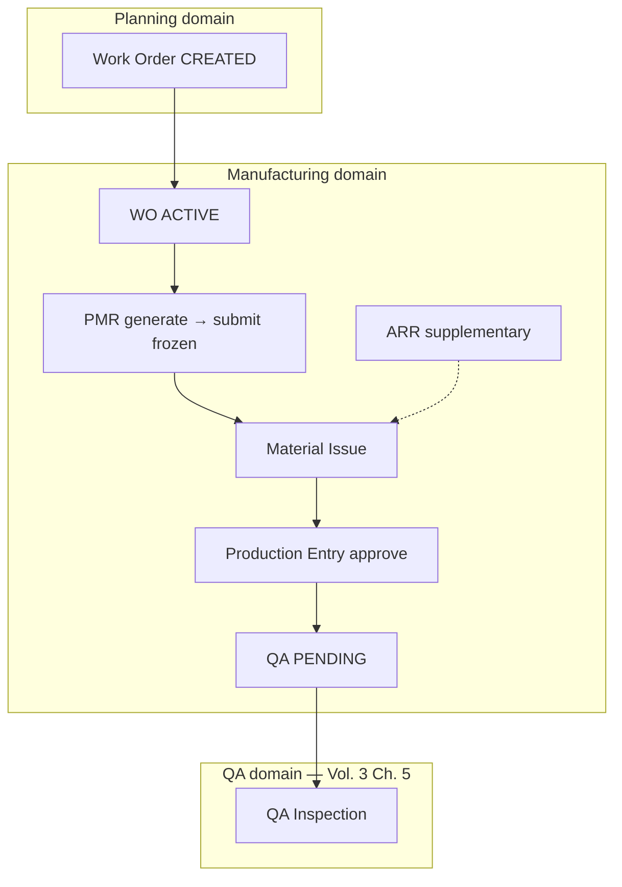
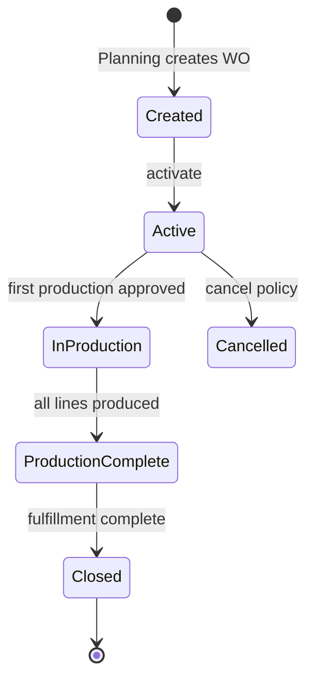
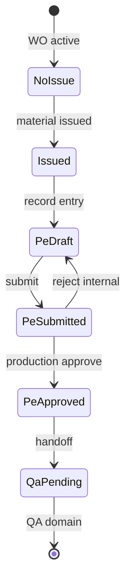

# Manufacturing Domain Specification

| Field | Value |
|-------|-------|
| **Document ID** | FT-PD-033 |
| **Volume** | 3 — Domain Specifications |
| **Chapter** | 4 — Manufacturing Domain Specification |
| **Title** | Manufacturing Domain Specification |
| **Version** | 1.0.0 |
| **Status** | Draft — Architecture Review |
| **Effective date** | 2026-05-29 |
| **Author** | FT ERP Product Team |
| **Owner** | FT ERP Product Architecture |
| **Audience** | Product, domain authors, workflow engineers, Store/Production process owners |
| **Classification** | Product — Domain Specification |

**Parent documents:**

- [Volume 2, Chapter 4 — Manufacturing Execution Pipeline](../02_Business_Architecture/Chapter_04_Manufacturing_Execution_Pipeline.md)
- [Volume 3, Chapter 2 — Planning Domain Specification](./Chapter_02_Planning_Domain_Specification.md)
- [Volume 3, Chapter 3 — Procurement Domain Specification](./Chapter_03_Procurement_Domain_Specification.md)
- [Volume 2, Chapter 5 — Document Ownership & Responsibility Matrix](../02_Business_Architecture/Chapter_05_Document_Ownership_and_Responsibility_Matrix.md)
- [Chapter 2 — FT ERP Constitution](../01_Product_Foundation/Chapter_02_FT_ERP_Constitution.md) (Articles 7–9)
- [Chapter 3 — Glossary](../01_Product_Foundation/Chapter_03_FT_ERP_Glossary_and_Standard_Terminology.md)

---

## 1. Document Control

| Version | Date | Author | Summary |
|---------|------|--------|---------|
| 1.0.0 | 2026-05-29 | FT ERP Product Team | Initial Manufacturing domain — WO through Production Entry handoff to QA |

**Supersedes:** None.

**Change authority:** Product Architecture. PMR immutability or accountability chain changes require Constitution Art. 9 review and Volume 4 alignment.

**Out of scope:** QA Inspection, Dispatch, Sales Bill (Volume 3 Ch. 5–6); Work Order creation logic detail (Planning domain); APIs, database, UI implementation.

---

## 2. Purpose

This chapter defines the **complete functional specification** of the **Manufacturing domain** in FT ERP.

Manufacturing begins at **Work Order** (execution lifecycle) and ends when **Production Entry** is **approved** and **submitted to QA**—the handoff point to the QA domain.

Architecture is in [Volume 2, Chapter 4](../02_Business_Architecture/Chapter_04_Manufacturing_Execution_Pipeline.md); this chapter specifies **document behavior**, **material accountability**, **workflow states**, and **validations** for shop-floor execution through production posting.

---

## 3. Scope

### 3.1 In scope

- Manufacturing boundaries (Procurement availability → QA handoff)
- Artifacts: Work Order, PMR, ARR, Material Issue, Production Entry
- Workflow states, manufacturing logic, Business Rules
- Pending Actions (Store, Production); QA handoff visibility
- Dashboard, Workspace, Control Tower, validation matrix

### 3.2 Out of scope

- Work Order **creation** / WO prepare ([Volume 3, Ch. 2](./Chapter_02_Planning_Domain_Specification.md) §5.6)
- PR, PO, GRN ([Volume 3, Ch. 3](./Chapter_03_Procurement_Domain_Specification.md))
- QA Inspection, rework disposition, scrap ([Volume 3, Ch. 5](./README.md) — planned)
- Dispatch and billing
- Workflow Engine implementation (Volume 4)

### 3.3 Terminology

[Glossary](../01_Product_Foundation/Chapter_03_FT_ERP_Glossary_and_Standard_Terminology.md): **Work Order**, **PMR**, **Material Issue**, **Production Entry**, **Production Batch**, **ARR**.

---

## 4. Domain Responsibilities

### 4.1 What the Manufacturing domain owns

| Responsibility | Description |
|----------------|-------------|
| **Work Order execution lifecycle** | Active WO tracking from create through production complete |
| **Material request** | PMR generation, freeze, issue authorization |
| **Supplementary RM** | ARR initiation for need beyond frozen PMR |
| **Physical RM movement to floor** | Material Issue to production location |
| **Shop-floor output** | Production Entry, batch identity, RM consumption on approval |
| **Material accountability** | requirement → PMR → issue → consumption chain |

### 4.2 What the Manufacturing domain does not own

| Excluded | Owned by |
|----------|----------|
| WO placement / prepare validation | Planning domain |
| MR, PR, PO, GRN | Procurement domain |
| QA accept/reject/rework/scrap | QA domain |
| Dispatch, Sales Bill | Dispatch & Billing domain |

### 4.3 Domain boundaries

| Boundary | Rule |
|----------|------|
| **Procurement → Manufacturing** | Material Issue requires RM **available** at source location (typically post-GRN) |
| **Planning → Manufacturing** | Work Order document created in Planning; Manufacturing owns **execution states** from `CREATED` forward |
| **Manufacturing → QA** | Approved Production Entry with batch identity → **QA Pending**; QA domain owns inspection |
| **Manufacturing ≠ dispatch** | Production approval does **not** make FG dispatch-eligible |

### 4.4 Primary roles

| Role | Manufacturing responsibility |
|------|------------------------------|
| **Store** | PMR submit, Material Issue, ARR initiate, WO execution support |
| **Production** | Production Entry record and approve |
| **QA** | Receives handoff only — inspection in QA domain (§9.3 visibility) |

**Business Model:** Execution behavior is **identical** for REGULAR and NO_QTY after Work Order exists ([Vol. 2 Ch. 4](../02_Business_Architecture/Chapter_04_Manufacturing_Execution_Pipeline.md) §4.2).

---

## 5. Manufacturing Artifacts

### 5.1 Work Order

| Attribute | Specification |
|-----------|---------------|
| **Purpose** | Authorize manufacturing execution for defined FG lines and quantities |
| **Creator** | Store (in Planning domain) |
| **Owner** | Store (execution lifecycle) |
| **Inputs** | Planning handoff: ISO (REGULAR) or RS placement (NO_QTY); approved BOM |
| **Outputs** | PMR; production batches; trace to commercial/planning ancestry |
| **Lifecycle** | Created → Active → In Production → Production Complete → Closed \| Cancelled |
| **Allowed actions** | Activate; cancel (pre-production policy); view trace; no direct issue/production bypass |
| **Validation rules** | Approved BOM; parent commercial/planning link valid; Business Model inherited |
| **Completion criteria** | **Production Complete** when all WO line qty has approved Production Entries submitted to QA; **Closed** after downstream fulfillment rules (Volume 3 Ch. 5–6) |

*Note:* Document **creation** is Planning terminus; **execution lifecycle** is Manufacturing domain from `CREATED`.

---

### 5.2 PMR (Production Material Request)

| Attribute | Specification |
|-----------|---------------|
| **Purpose** | Frozen RM requirement authorizing Material Issue for a Work Order |
| **Creator** | System generate + Store submit |
| **Owner** | Store |
| **Inputs** | Work Order lines; approved BOM revision; WO FG qty |
| **Outputs** | Issue-eligible RM lines; production readiness basis |
| **Lifecycle** | Generated → Draft → Submitted (Frozen) → Partially Issued → Fully Issued → Closed |
| **Allowed actions** | Generate; submit (freeze); view; supplementary path via ARR — **no edit after submit** |
| **Validation rules** | WO Active; BOM approved; qty from WO/planning basis at freeze |
| **Completion criteria** | **Fully Issued** or **Closed** when WO production complete / WO cancelled per policy |

---

### 5.3 ARR (Additional RM Requisition)

| Attribute | Specification |
|-----------|---------------|
| **Purpose** | Supplementary RM need **beyond** frozen PMR — shortage, variance, extra batch |
| **Creator** | Store or Production (initiate) |
| **Owner** | Store (initiate); Procurement executes supply |
| **Inputs** | WO/PMR context; identified gap qty |
| **Outputs** | STOCK_REPLENISHMENT MR → PR → PO → GRN path; supplementary Material Issue |
| **Lifecycle** | Draft → Submitted → In Procurement → Issued → Closed |
| **Allowed actions** | Create; submit; link to WO; cancel draft |
| **Validation rules** | Active WO; documented reason; **does not replace** PMR lines |
| **Completion criteria** | Supplementary material issued via Material Issue or ARR closed with reason |

---

### 5.4 Material Issue

| Attribute | Specification |
|-----------|---------------|
| **Purpose** | Move RM from store to production location against PMR |
| **Creator** | Store |
| **Owner** | Store |
| **Inputs** | Submitted PMR lines; source location stock; target production location |
| **Outputs** | Stock Transaction; issued qty; production capacity envelope |
| **Lifecycle** | Draft → Posted \| Cancelled (draft) |
| **Allowed actions** | Create from PMR; partial line issue; post; cancel draft |
| **Validation rules** | PMR Submitted; free stock ≥ issue qty; locations valid; WO not cancelled |
| **Completion criteria** | **Posted** — updates issued totals on PMR; enables production within issued envelope |

---

### 5.5 Production Entry

| Attribute | Specification |
|-----------|---------------|
| **Purpose** | Record FG quantity produced for WO line as **Production Batch** |
| **Creator** | Production |
| **Owner** | Production |
| **Inputs** | Active WO line; issued RM envelope; batch/lot identity |
| **Outputs** | Approved production qty; RM consumption posting; **QA Pending** handoff |
| **Lifecycle** | Draft → Submitted → Approved → QA Pending \| Rejected (internal) |
| **Allowed actions** | Record draft; submit; approve; cancel draft |
| **Validation rules** | Material issued; qty ≤ PMR-aligned production capacity; qty ≤ WO line remaining |
| **Completion criteria** | **Approved** → **QA Pending** — Manufacturing domain handoff complete |

---

## 6. Workflow States

### 6.1 Work Order

```
CREATED (Planning handoff)
  ↓ activate
ACTIVE
  ↓ first approved production entry
IN_PRODUCTION
  ↓ all lines production approved → QA pending
PRODUCTION_COMPLETE
  ↓ downstream QA/dispatch complete (other domains)
CLOSED
  ↓ cancel (policy)
CANCELLED
```

| State | PMR | Production | QA handoff |
|-------|-----|------------|------------|
| `CREATED` | May generate | No | No |
| `ACTIVE` | Yes | After issue | No |
| `IN_PRODUCTION` | Yes | Yes | Per batch |
| `PRODUCTION_COMPLETE` | Closed/issued | Complete | Batches in QA queue |
| `CLOSED` | Terminal | Terminal | Complete |
| `CANCELLED` | Blocked | Blocked | No |

### 6.2 PMR

```
GENERATED
  ↓ Store review
DRAFT
  ↓ submit (freeze)
SUBMITTED
  ↓ partial issue
PARTIALLY_ISSUED
  ↓ full issue
FULLY_ISSUED
  ↓ WO complete / cancel
CLOSED
```

| State | Editable | Issue allowed |
|-------|----------|---------------|
| `GENERATED` | Yes (pre-submit) | No |
| `DRAFT` | Yes | No |
| `SUBMITTED` | **No** | Yes |
| `PARTIALLY_ISSUED` | No | Yes (remaining) |
| `FULLY_ISSUED` | No | No (unless ARR) |
| `CLOSED` | No | No |

### 6.3 Material Issue

```
DRAFT → POSTED
DRAFT → CANCELLED
```

Cumulative **partial issues** across multiple documents update PMR issued totals.

### 6.4 Production Entry

```
DRAFT
  ↓ submit
SUBMITTED
  ↓ approve | reject (internal)
APPROVED → QA_PENDING
REJECTED (internal) → DRAFT (rework entry)
```

| State | Consumption posted | QA domain |
|-------|-------------------|-----------|
| `DRAFT` | No | No |
| `SUBMITTED` | No | No |
| `APPROVED` | Yes | **QA_PENDING** — QA owns next step |
| `QA_PENDING` | Yes | Inspection (Vol. 3 Ch. 5) |

---

## 7. Manufacturing Logic

### 7.1 Work Order execution

After Planning creates WO:

1. Store **activates** WO for execution
2. PMR **generated** from WO BOM basis
3. Store **issues** RM per PMR
4. Production **records** output
5. WO tracks cumulative produced vs line qty until **Production Complete**

Display context (ISO vs RS ancestry) differs by Business Model; **gates do not**.

### 7.2 PMR generation

Triggered by controlled action when WO is `ACTIVE`:

- Explode **approved BOM** for WO FG quantity
- Attach BOM revision id to PMR
- Pre-fill RM lines with required qty
- Store reviews before **submit**

Not silent background mutation ([Vol. 2 Ch. 4](../02_Business_Architecture/Chapter_04_Manufacturing_Execution_Pipeline.md) §7.1).

### 7.3 Frozen PMR

On **submit**, PMR becomes **immutable**:

- RM line qty fixed
- BOM revision fixed
- Production readiness and issue validation use PMR lines
- Corrections: formal reversal, supplementary PMR (policy), Material Return, or ARR — **not** line edit

### 7.4 ARR for additional RM

When issued PMR insufficient:

- Store/Production raises **ARR** with reason code
- Routes to **STOCK_REPLENISHMENT** procurement ([Vol. 3 Ch. 3](./Chapter_03_Procurement_Domain_Specification.md) §7.3)
- Supplementary receipt → supplementary **Material Issue** linked to WO
- ARR **does not** alter frozen PMR lines

### 7.5 Material Issue

Store moves RM:

- Source: store (or approved source location)
- Target: production location
- Reference: PMR line + Material Issue doc
- Posts Stock Transaction ([Glossary](../01_Product_Foundation/Chapter_03_FT_ERP_Glossary_and_Standard_Terminology.md))

### 7.6 Partial issue

Issue qty < PMR line open qty:

- PMR → `PARTIALLY_ISSUED`
- Production capacity = `floor(issued × woQty / pmrRequired)` per PMR-aligned readiness
- Further issues increase capacity until `FULLY_ISSUED`

### 7.7 Partial production

Multiple **Production Entries** per WO line until line balance exhausted. Each approved entry creates **Production Batch** for QA.

### 7.8 Batch recording

**Production Batch** carries:

- Batch/lot id
- WO line reference
- Produced qty
- PMR/issue trace reference
- Links forward to QA Inspection (QA domain)

### 7.9 Material accountability

Constitution Art. 9 chain:

```
Planning basis (WO / BOM revision)
  → PMR line (frozen)
  → Material Issue line
  → Production Entry consumption (on approve)
  → (Material Return if applicable)
```

Every RM unit in production is traceable. No silent consumption.

### 7.10 Production completion

| Level | Criterion |
|-------|-----------|
| **Production Entry** | Approved → QA Pending |
| **WO line** | Cumulative approved production = line qty (or early close with reason) |
| **Work Order** | All lines production complete → `PRODUCTION_COMPLETE` |

**Rule:** Production qty **cannot exceed** issued material aligned to frozen PMR.

---

## 8. Business Rules

| ID | Rule |
|----|------|
| **MFG-01** | **PMR auto-generated** from Work Order BOM basis via controlled action. |
| **MFG-02** | **PMR immutable after submit** — no line edit; use reversal/ARR/return paths. |
| **MFG-03** | **ARR supplies additional RM only** — does not replace PMR accountability. |
| **MFG-04** | **No production before Material Issue** against submitted PMR. |
| **MFG-05** | **Production cannot exceed issued material** aligned to PMR readiness. |
| **MFG-06** | Production readiness uses **frozen PMR** when PMR exists — not live BOM bypass. |
| **MFG-07** | **Material consumption** posts on Production Entry **approval** only. |
| **MFG-08** | **Material consumption is fully traceable** to PMR and Issue lines. |
| **MFG-09** | **Work Order Production Complete** only after all lines have approved Production Entries posted. |
| **MFG-10** | WO **does not** auto-start PMR, issue, or production on create. |
| **MFG-11** | Material Issue is **Store-owned**; Production cannot self-issue. |
| **MFG-12** | Production Entry approval is **Production-owned**; Store cannot approve shop output. |
| **MFG-13** | Approved Production Entry enters **QA Pending** — not dispatch-eligible. |
| **MFG-14** | Execution gates **identical** for REGULAR and NO_QTY Work Orders. |
| **MFG-15** | Cancelled WO blocks new issue and production. |
| **MFG-16** | Partial issue, partial production, and multiple batches per WO line are permitted. |

*Architecture rules EXE-* in [Vol. 2 Ch. 4](../02_Business_Architecture/Chapter_04_Manufacturing_Execution_Pipeline.md) remain authoritative.*

---

## 9. Pending Actions

Engine-generated only.

### 9.1 Store

| ID | Trigger | Action |
|----|---------|--------|
| `MFG_WO_ACTIVATE` | WO Created; not Active | Activate Work Order |
| `MFG_PMR_GEN` | WO Active; no PMR | Generate PMR |
| `MFG_PMR_SUBMIT` | PMR Draft complete | Submit PMR (freeze) |
| `MFG_ISSUE` | PMR Submitted; open lines | Post Material Issue |
| `MFG_ISSUE_PARTIAL` | Partial PMR issue | Issue remaining RM |
| `MFG_ARR` | Shortage beyond PMR | Create ARR |
| `MFG_RETURN` | Return from production | Process Material Return |

### 9.2 Production

| ID | Trigger | Action |
|----|---------|--------|
| `MFG_PE_RECORD` | Material issued; WO Active | Record Production Entry |
| `MFG_PE_APPROVE` | Production Entry Submitted | Approve production batch |
| `MFG_PE_BLOCK` | Issue gap on floor | Report production blocker |

### 9.3 QA (handoff visibility)

Manufacturing generates **QA Pending** state; QA domain owns inspection Pending Actions ([Volume 3, Ch. 5](./README.md)):

| ID | Trigger | Owner | Note |
|----|---------|-------|------|
| `MFG_QA_HANDOFF` | Production Entry Approved | QA | Inspect batch — QA domain action |

Production Dashboard may show **batches awaiting QA** as read-only monitor — not QA write actions.

---

## 10. Dashboard Responsibilities

### 10.1 Store Dashboard (manufacturing slice)

| Zone | Content |
|------|---------|
| **My Work** | §9.1 Pending Actions |
| **PMR queue** | WO awaiting PMR submit |
| **Issue queue** | PMR awaiting issue |
| **ARR queue** | Open supplementary requisitions |
| **KPIs** | WOs Active without issue; partial issue WOs |

### 10.2 Production Dashboard

| Zone | Content |
|------|---------|
| **My Work** | §9.2 Pending Actions |
| **Floor queue** | WOs with issued RM awaiting production |
| **Approval queue** | Submitted Production Entries |
| **QA handoff monitor** | Approved batches QA Pending (read-only) |
| **KPIs** | WOs in production; draft entries aging |

### 10.3 Cross-role rule

Store Dashboard does not show Production approve buttons; Production Dashboard does not show Material Issue post actions.

---

## 11. Workspace Responsibilities

| Workspace | Owner | Behavior |
|-----------|-------|----------|
| **Work Order context** | Store / Production (read) | Header: WO no, state, Business Model, ISO/RS trace; continuity strip PMR → Issue → Production |
| **PMR / Material Issue** | Store | PMR lines; issue from PMR; partial issue history; ARR link |
| **Production entry** | Production | WO lines; record batch; submit/approve; consumption preview on approve |

### 11.1 Common workspace rules

- Document header + stage indicator ([Design Principles §8](../01_Product_Foundation/Chapter_04_FT_ERP_Product_Design_Principles.md))
- Write CTAs only for owning role
- PMR submit shows **freeze warning**
- Production Entry blocked without issued RM — explicit rule message (MFG-04)
- Handoff banner on Production Entry approve → “Submitted to QA”

### 11.2 Wrong-flow Guard

NO_QTY and REGULAR WO use **same** manufacturing workspaces — only ancestry labels differ.

---

## 12. Control Tower Visibility

| KPI / theme | Description |
|-------------|-------------|
| **WO by stage** | Created / Active / In Production / Production Complete |
| **PMR backlog** | Submitted but not fully issued |
| **Issue stall** | PMR submitted > N days without issue |
| **Production delay** | Issued RM but no Production Entry |
| **Partial issue WOs** | Capacity constrained production |
| **ARR open** | Supplementary RM in procurement |
| **QA handoff backlog** | QA Pending batch count (QA owns resolution) |
| **Material accountability gaps** | Issue without consumption path audit flags |

Rows: WO, stage, owner (Store/Production), age, recommended action, Workspace deep link.

---

## 13. Validation Matrix

| Validation | Trigger | Blocking behavior | Role |
|------------|---------|-------------------|------|
| WO Active | PMR generate | Block | Store |
| BOM approved | PMR generate | Block | Store |
| PMR Submitted | Material Issue | Block issue | Store |
| Free stock ≥ issue qty | Issue post | Block | Store |
| PMR frozen | PMR line edit | Block | Store |
| Material issued | Production Entry | Block record | Production |
| PMR-aligned capacity | Production qty | Block save/approve | Production |
| WO line remaining | Production qty | Block | Production |
| WO cancelled | Issue / production | Block | System |
| Production approve | Consumption post | Auto on approve | System |
| Issue > PMR open | Issue post | Block | Store |
| ARR without reason | ARR submit | Block | Store |
| Live BOM bypass | Production gate | Block when PMR exists | System |
| QA skip | Dispatch from manufacturing | Block (QA domain) | System |
| REGULAR vs NO_QTY gate branch | Any manufacturing action | No branch — same gates | System |

---

## 14. Lifecycle Diagrams

### 14.1 Manufacturing execution



### 14.2 Work Order lifecycle



### 14.3 Production lifecycle



---

## 15. Review Checklist

- [ ] Functional spec only; no API, DB, UI
- [ ] Domain ends at QA Pending handoff
- [ ] WO creation attributed to Planning; execution to Manufacturing
- [ ] All five artifacts specified (§5)
- [ ] PMR freeze and immutability explicit
- [ ] ARR supplementary only
- [ ] Material accountability chain (§7.9)
- [ ] MFG Business Rules
- [ ] Pending Actions Store / Production / QA handoff
- [ ] Dashboard, Workspace, Control Tower
- [ ] Validation matrix
- [ ] Three Mermaid diagrams
- [ ] Volume 2 Ch. 4 cross-referenced

---

## 16. Change Log

| Version | Date | Author | Summary |
|---------|------|--------|---------|
| 1.0.0 | 2026-05-29 | FT ERP Product Team | Initial Manufacturing Domain Specification |

---

## 17. Approval Block

| Role | Name | Signature | Date |
|------|------|-----------|------|
| Product Owner | | | |
| Product Architecture | | | |
| Store Process Owner | | | |
| Production Process Owner | | | |
| Workflow Engineering Lead | | | |

---

## Document navigation

| | Link |
|--|------|
| **Previous** | [Procurement Domain Specification](./Chapter_03_Procurement_Domain_Specification.md) (FT-PD-032) |
| **Next** | [Quality Assurance Domain Specification](./Chapter_05_Quality_Assurance_Domain_Specification.md) (FT-PD-034) |
| **Volume** | [Domain Specifications](./README.md) |
| **Product** | [Product Documentation Index](../README.md) |

