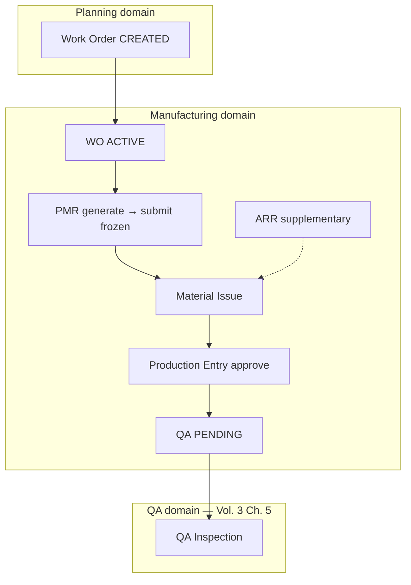
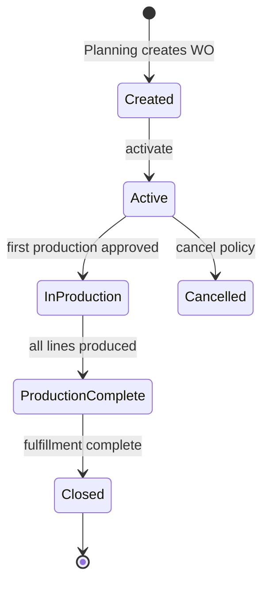
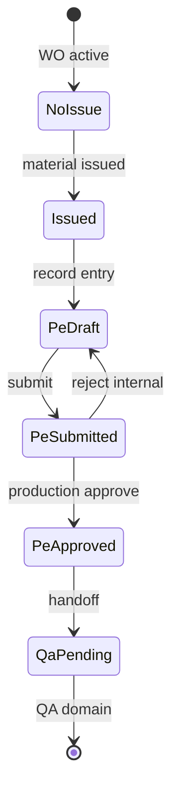

# Manufacturing Domain Specification

| Field | Value |
|-------|-------|
| **Document ID** | FT-PD-033 |
| **Volume** | 3 — Domain Specifications |
| **Chapter** | 4 — Manufacturing Domain Specification |
| **Title** | Manufacturing Domain Specification |
| **Version** | 1.1.2 |
| **Status** | Draft — Architecture Review |
| **Effective date** | 2026-05-29 |
| **Author** | FT ERP Product Team |
| **Owner** | FT ERP Product Architecture |
| **Audience** | Product, domain authors, workflow engineers, Store/Production process owners |
| **Classification** | Product — Domain Specification |

**Parent documents:**

- [Volume 2, Chapter 4 — Manufacturing Execution Pipeline](../02_Business_Architecture/Chapter_04_Manufacturing_Execution_Pipeline.md)
- [Volume 3, Chapter 2 — Planning Domain Specification](./Chapter_02_Planning_Domain_Specification.md)
- [Volume 3, Chapter 3 — Procurement Domain Specification](./Chapter_03_Procurement_Domain_Specification.md)
- [Volume 2, Chapter 5 — Document Ownership & Responsibility Matrix](../02_Business_Architecture/Chapter_05_Document_Ownership_and_Responsibility_Matrix.md)
- [Chapter 2 — FT ERP Constitution](../01_Product_Foundation/Chapter_02_FT_ERP_Constitution.md) (Articles 7–9)
- [Chapter 3 — Glossary](../01_Product_Foundation/Chapter_03_FT_ERP_Glossary_and_Standard_Terminology.md)

---

## 1. Document Control

| Version | Date | Author | Summary |
|---------|------|--------|---------|
| 1.0.0 | 2026-05-29 | FT ERP Product Team | Initial Manufacturing domain — WO through Production Entry handoff to QA |
| 1.1.0 | 2026-07-10 | FT ERP Product Team | WastageType master extension (code/category/description); Lane C Production Report classification analytics ownership clarified |
| 1.1.1 | 2026-07-15 | FT ERP Product Team | BOM lifecycle — Phase-2 Future Enhancement for BOM Revision FK traceability (docs only) |
| 1.1.2 | 2026-07-15 | FT ERP Product Team | Cross-ref FT-PD-100 §7.1 Phase-2 planning register (docs only) |
| 1.1.4 | 2026-08-24 | FT ERP Product Team | Production Run Start Confirmation; actual purging from issued RM; run-linked Production Entry |
| 1.1.3 | 2026-07-22 | FT ERP Product Team | Interim — REGULAR SO demand vs WO-plan production completion |

**Supersedes:** None.

**Change authority:** Product Architecture. PMR immutability or accountability chain changes require Constitution Art. 9 review and Volume 4 alignment.

**Out of scope:** QA Inspection, Dispatch, Sales Bill (Volume 3 Ch. 5–6); Work Order creation logic detail (Planning domain); APIs, database, UI implementation.

---

## 2. Purpose

This chapter defines the **complete functional specification** of the **Manufacturing domain** in FT ERP.

Manufacturing begins at **Work Order** (execution lifecycle) and ends when **Production Entry** is **approved** and **submitted to QA**—the handoff point to the QA domain.

Architecture is in [Volume 2, Chapter 4](../02_Business_Architecture/Chapter_04_Manufacturing_Execution_Pipeline.md); this chapter specifies **document behavior**, **material accountability**, **workflow states**, and **validations** for shop-floor execution through production posting.

---

## 3. Scope

### 3.1 In scope

- Manufacturing boundaries (Procurement availability → QA handoff)
- Artifacts: Work Order, PMR, ARR, Material Issue, Production Entry
- Workflow states, manufacturing logic, Business Rules
- Pending Actions (Store, Production); QA handoff visibility
- Dashboard, Workspace, Control Tower, validation matrix

### 3.2 Out of scope

- Work Order **creation** / WO prepare ([Volume 3, Ch. 2](./Chapter_02_Planning_Domain_Specification.md) §5.6)
- PR, PO, GRN ([Volume 3, Ch. 3](./Chapter_03_Procurement_Domain_Specification.md))
- QA Inspection, rework disposition, scrap ([Volume 3, Ch. 5](./README.md) — planned)
- Dispatch and billing
- Workflow Engine implementation (Volume 4)

### 3.3 Terminology

[Glossary](../01_Product_Foundation/Chapter_03_FT_ERP_Glossary_and_Standard_Terminology.md): **Work Order**, **PMR**, **Material Issue**, **Production Entry**, **Production Batch**, **ARR**.

---

## 4. Domain Responsibilities

### 4.1 What the Manufacturing domain owns

| Responsibility | Description |
|----------------|-------------|
| **Work Order execution lifecycle** | Active WO tracking from create through production complete |
| **Material request** | PMR generation, freeze, issue authorization |
| **Supplementary RM** | ARR initiation for need beyond frozen PMR |
| **Physical RM movement to floor** | Material Issue to production location |
| **Shop-floor output** | Production Entry, batch identity, RM consumption on approval |
| **Material accountability** | requirement → PMR → issue → consumption chain |

### 4.2 What the Manufacturing domain does not own

| Excluded | Owned by |
|----------|----------|
| WO placement / prepare validation | Planning domain |
| MR, PR, PO, GRN | Procurement domain |
| QA accept/reject/rework/scrap | QA domain |
| Dispatch, Sales Bill | Dispatch & Billing domain |

### 4.3 Domain boundaries

| Boundary | Rule |
|----------|------|
| **Procurement → Manufacturing** | Material Issue requires RM **available** at source location (typically post-GRN) |
| **Planning → Manufacturing** | Work Order document created in Planning; Manufacturing owns **execution states** from `CREATED` forward |
| **Manufacturing → QA** | Approved Production Entry with batch identity → **QA Pending**; QA domain owns inspection |
| **Manufacturing ≠ dispatch** | Production approval does **not** make FG dispatch-eligible |

### 4.4 Primary roles

| Role | Manufacturing responsibility |
|------|------------------------------|
| **Store** | PMR submit, Material Issue, ARR initiate, WO execution support |
| **Production** | Production Entry record and approve |
| **QA** | Receives handoff only — inspection in QA domain (§9.3 visibility) |

**Business Model:** Execution behavior is **identical** for REGULAR and NO_QTY after Work Order exists ([Vol. 2 Ch. 4](../02_Business_Architecture/Chapter_04_Manufacturing_Execution_Pipeline.md) §4.2).

---

## 5. Manufacturing Artifacts

### 5.1 Work Order

| Attribute | Specification |
|-----------|---------------|
| **Purpose** | Authorize manufacturing execution for defined FG lines and quantities |
| **Creator** | Store (in Planning domain) |
| **Owner** | Store (execution lifecycle) |
| **Inputs** | Planning handoff: ISO (REGULAR) or RS placement (NO_QTY); approved BOM |
| **Outputs** | PMR; production batches; trace to commercial/planning ancestry |
| **Lifecycle** | Created → Active → In Production → Production Complete → Closed \| Cancelled |
| **Allowed actions** | Activate; cancel (pre-production policy); view trace; no direct issue/production bypass |
| **Validation rules** | Approved BOM; parent commercial/planning link valid; Business Model inherited |
| **Completion criteria** | **Production Complete** when all WO line qty has approved Production Entries submitted to QA; **Closed** after downstream fulfillment rules (Volume 3 Ch. 5–6) |

*Note:* Document **creation** is Planning terminus; **execution lifecycle** is Manufacturing domain from `CREATED`.

---

### 5.2 PMR (Production Material Request)

| Attribute | Specification |
|-----------|---------------|
| **Purpose** | Frozen RM requirement authorizing Material Issue for a Work Order |
| **Creator** | System generate + Store submit |
| **Owner** | Store |
| **Inputs** | Work Order lines; approved BOM revision; WO FG qty |
| **Outputs** | Issue-eligible RM lines; production readiness basis |
| **Lifecycle** | Generated → Draft → Submitted (Frozen) → Partially Issued → Fully Issued → Closed |
| **Allowed actions** | Generate; submit (freeze); view; supplementary path via ARR — **no edit after submit** |
| **Validation rules** | WO Active; BOM approved; qty from WO/planning basis at freeze |
| **Completion criteria** | **Fully Issued** or **Closed** when WO production complete / WO cancelled per policy |

---

### 5.3 ARR (Additional RM Requisition)

| Attribute | Specification |
|-----------|---------------|
| **Purpose** | Supplementary RM need **beyond** frozen PMR — shortage, variance, extra batch |
| **Creator** | Store or Production (initiate) |
| **Owner** | Store (initiate); Procurement executes supply |
| **Inputs** | WO/PMR context; identified gap qty |
| **Outputs** | STOCK_REPLENISHMENT MR → PR → PO → GRN path; supplementary Material Issue |
| **Lifecycle** | Draft → Submitted → In Procurement → Issued → Closed |
| **Allowed actions** | Create; submit; link to WO; cancel draft |
| **Validation rules** | Active WO; documented reason; **does not replace** PMR lines |
| **Completion criteria** | Supplementary material issued via Material Issue or ARR closed with reason |

---

### 5.4 Material Issue

| Attribute | Specification |
|-----------|---------------|
| **Purpose** | Move RM from store to production location against PMR |
| **Creator** | Store |
| **Owner** | Store |
| **Inputs** | Submitted PMR lines; source location stock; target production location |
| **Outputs** | Stock Transaction; issued qty; production capacity envelope |
| **Lifecycle** | Draft → Posted \| Cancelled (draft) |
| **Allowed actions** | Create from PMR; partial line issue; post; cancel draft; **Short Issue close** (close remaining unissued demand) |
| **Validation rules** | PMR Submitted; free stock ≥ issue qty; locations valid; WO not cancelled |
| **Completion criteria** | **Posted** — updates issued totals on PMR; enables production within **issued** envelope. Short Issue close → PMR `SHORT_ISSUE_ACCEPTED` |

**Inventory rule (authoritative):** Stock Transactions **SHALL** move **Issued Qty only**. Unissued / Short Issue Qty **SHALL NOT** create stock movements and **SHALL** remain available in RM Store. Short Issue is an **audit / demand-closure** event (`waivedQty` on PMR line), not consumption.

**Short Issue close:** Store may intentionally stop issue before Required Qty (e.g. Required 6.396, Issued 6.000). PMR records Required / Issued / Short Issue Qty + reason/actor via audit. Residual Material Allocations for unissued qty **SHALL** be released so free stock is restored. Production proceeds on Issued Qty; any FG shortfall uses the **existing NO_QTY production shortfall / recovery** workflow — not a second RM carry-forward.

---

### 5.4.5 Production Run Start Confirmation (machine-run WOs)

| Attribute | Specification |
|-----------|---------------|
| **Purpose** | Gate first quantity entry per **planned machine run** — operator confirms machine material and mould before production |
| **Creator / Owner** | Production (Admin may override purge decision where policy allows) |
| **When required** | Work Order has **machine-run allocations** from REGULAR Machine Run Planning |
| **Operator confirmation** | Material currently in machine; mould fitted; actual purging required/not required and quantity (grams) |
| **Actual purging** | Posts `PURGING_CONSUMPTION` against **already-issued Production RM** — **Store stock is not deducted again** |
| **Wastage separation** | Purging consumption is **not** process wastage (Lane C Production Report classification remains separate) |
| **Production Entry link** | Each entry on a machine-run WO **SHALL** reference its **run allocation** when the run model applies |
| **Machine state** | Confirmed run updates machine material state with **optimistic version locking** |
| **Legacy compatibility** | Work Orders **without** machine runs **SHALL NOT** require start confirmation |
| **Future scope** | **PLC / machine interlock** (automated lock from machine signals) is premium future scope; **shift-wise reports** and **Shift Over** are the next checkpoint |

Applied schema migration: `20260823200000_production_run_start_confirmation`.

---

### 5.5 Production Entry

| Attribute | Specification |
|-----------|---------------|
| **Purpose** | Record FG quantity produced for WO line as **Production Batch** |
| **Creator** | Production |
| **Owner** | Production |
| **Inputs** | Active WO line; issued RM envelope; batch/lot identity |
| **Outputs** | Approved production qty; RM consumption posting; **QA Pending** handoff |
| **Lifecycle** | Draft → Submitted → Approved → QA Pending \| Rejected (internal) |
| **Allowed actions** | Record draft; submit; approve; cancel draft |
| **Validation rules** | Material issued; qty ≤ remaining RM-supported capacity. **Machine-run WOs:** run start confirmed for selected run. For REGULAR and NO_QTY, WO qty is the planned **target** (Target Remaining / Use Remaining) and is not a hard entry cap when issued RM supports more FG. Limiting BOM/PMR RM line governs; floor for whole-number FG UOMs. Open **draft** qty is not finalized production — Target Remaining and Finalized Produced stay based on approved qty until Review & Finalize. |

### REGULAR / NO_QTY excess production authorization

Net usable issued RM is gross issue minus Store return minus RM consumed by approved production. BOM/PMR per-FG demand converts each component balance to FG capacity; the lowest component controls. Saved unapproved batches reserve this remaining envelope once. Production may exceed planned WO quantity within that envelope. The WO planned quantity and (for NO_QTY) RS placement balance remain unchanged. Excess follows normal Production → QC → accepted FG stock/rejection processing. Dispatch remains capped by SO remaining and QC-accepted usable FG; accepted excess beyond SO demand is general usable FG.

**Named projection fields (UI + API readiness):** `finalizedProducedQty`, `activeDraftQty`, `plannedTargetRemainingQty`, `rmSupportedMaximumQty`, `rmSupportedEntryCapacityBeforeDraft`, `rmSupportedCapacityAfterDraft`, `projectedProducedAfterDraft`, `projectedExtraQty`. Do not overload a single `producedQty` for draft and approved.
| **Completion criteria** | **Approved** → **QA Pending** — Manufacturing domain handoff complete |

---

## 6. Workflow States

### 6.1 Work Order

```
CREATED (Planning handoff)
  ↓ activate
ACTIVE
  ↓ first approved production entry
IN_PRODUCTION
  ↓ all lines production approved → QA pending
PRODUCTION_COMPLETE
  ↓ downstream QA/dispatch complete (other domains)
CLOSED
  ↓ cancel (policy)
CANCELLED
```

| State | PMR | Production | QA handoff |
|-------|-----|------------|------------|
| `CREATED` | May generate | No | No |
| `ACTIVE` | Yes | After issue | No |
| `IN_PRODUCTION` | Yes | Yes | Per batch |
| `PRODUCTION_COMPLETE` | Closed/issued | Complete | Batches in QA queue |
| `CLOSED` | Terminal | Terminal | Complete |
| `CANCELLED` | Blocked | Blocked | No |

### 6.2 PMR

```
GENERATED
  ↓ Store review
DRAFT
  ↓ submit (freeze)
SUBMITTED
  ↓ partial issue
PARTIALLY_ISSUED
  ↓ full issue
FULLY_ISSUED
  ↓ WO complete / cancel
CLOSED
```

| State | Editable | Issue allowed |
|-------|----------|---------------|
| `GENERATED` | Yes (pre-submit) | No |
| `DRAFT` | Yes | No |
| `SUBMITTED` | **No** | Yes |
| `PARTIALLY_ISSUED` | No | Yes (remaining) |
| `FULLY_ISSUED` | No | No (unless ARR) |
| `CLOSED` | No | No |

### 6.3 Material Issue

```
DRAFT → POSTED
DRAFT → CANCELLED
```

Cumulative **partial issues** across multiple documents update PMR issued totals.

### 6.4 Production Entry

```
DRAFT
  ↓ submit
SUBMITTED
  ↓ approve | reject (internal)
APPROVED → QA_PENDING
REJECTED (internal) → DRAFT (rework entry)
```

| State | Consumption posted | QA domain |
|-------|-------------------|-----------|
| `DRAFT` | No | No |
| `SUBMITTED` | No | No |
| `APPROVED` | Yes | **QA_PENDING** — QA owns next step |
| `QA_PENDING` | Yes | Inspection (Vol. 3 Ch. 5) |

---

## 7. Manufacturing Logic

### 7.1 Work Order execution

After Planning creates WO:

1. Store **activates** WO for execution
2. PMR **generated** from WO BOM basis
3. Store **issues** RM per PMR
4. Production **records** output
5. WO tracks cumulative produced vs line qty until **Production Complete**

Display context (ISO vs RS ancestry) differs by Business Model; **gates do not**.

### 7.2 PMR generation

Triggered by controlled action when WO is `ACTIVE`:

- Explode **approved BOM** for WO FG quantity
- Attach BOM revision id to PMR
- Pre-fill RM lines with required qty
- Store reviews before **submit**

Not silent background mutation ([Vol. 2 Ch. 4](../02_Business_Architecture/Chapter_04_Manufacturing_Execution_Pipeline.md) §7.1).

### 7.3 Frozen PMR

On **submit**, PMR becomes **immutable**:

- RM line qty fixed
- BOM revision fixed
- Production readiness and issue validation use PMR lines
- Corrections: formal reversal, supplementary PMR (policy), Material Return, or ARR — **not** line edit

### 7.4 ARR for additional RM

When issued PMR insufficient:

- Store/Production raises **ARR** with reason code
- Routes to **STOCK_REPLENISHMENT** procurement ([Vol. 3 Ch. 3](./Chapter_03_Procurement_Domain_Specification.md) §7.3)
- Supplementary receipt → supplementary **Material Issue** linked to WO
- ARR **does not** alter frozen PMR lines

### 7.5 Material Issue

Store moves RM:

- Source: store (or approved source location)
- Target: production location
- Reference: PMR line + Material Issue doc
- Posts Stock Transaction ([Glossary](../01_Product_Foundation/Chapter_03_FT_ERP_Glossary_and_Standard_Terminology.md))

### 7.6 Partial issue

Issue qty < PMR line open qty:

- PMR → `PARTIALLY_ISSUED`
- Production capacity = `floor(issued × woQty / pmrRequired)` per PMR-aligned readiness
- Further issues increase capacity until `FULLY_ISSUED`

### 7.7 Partial production

Multiple **Production Entries** per WO line until line balance exhausted. Each approved entry creates **Production Batch** for QA.

### 7.8 Batch recording

**Production Batch** carries:

- Batch/lot id
- WO line reference
- Produced qty
- PMR/issue trace reference
- Links forward to QA Inspection (QA domain)

### 7.9 Material accountability

Constitution Art. 9 chain:

```
Planning basis (WO / BOM revision)
  → PMR line (frozen)
  → Material Issue line
  → Production Entry consumption (on approve)
  → (Material Return if applicable)
```

Every RM unit in production is traceable. No silent consumption.

### 7.10 Production completion

| Level | Criterion |
|-------|-----------|
| **Production Entry** | Approved → QA Pending (all produced qty; no usable FG bypass of QC) |
| **WO line (REGULAR)** | Obligation met when approved produced ≥ **remaining SO demand** (authoritative; other WOs counted) **or** WO planned qty fully produced. WO-plan buffer remainder is not mandatory production. |
| **WO line (NO_QTY)** | Shop-floor execution + mandatory Production Report close (WO plan is a target) |
| **Work Order** | Lines production-complete **and** Production Report confirmed → document `COMPLETED` (REGULAR SO-covered) or `CLOSED_WITH_SHORTFALL` (true SO shortage only) |

**REGULAR decision matrix (interim):**

1. Produced &lt; remaining SO demand → Continue Later **or** End with Shortage → Production Report → shortfall close / recovery as applicable.
2. Produced ≥ remaining SO demand and Produced &lt; WO plan → End Production → Production Report → `COMPLETED` (expected excess before QC = produced − remaining SO demand).
3. Produced ≥ WO plan → normal final closure; Production Report still mandatory.
4. Pause / Continue Later does **not** open Production Report and does **not** close the WO.

**Rule:** Production qty **cannot exceed** issued material aligned to frozen PMR (REGULAR also respects WO + tolerance).

---

## 8. Business Rules

| ID | Rule |
|----|------|
| **MFG-01** | **PMR auto-generated** from Work Order BOM basis via controlled action. |
| **MFG-02** | **PMR immutable after submit** — no line edit; use reversal/ARR/return paths. |
| **MFG-03** | **ARR supplies additional RM only** — does not replace PMR accountability. |
| **MFG-04** | **No production before Material Issue** against submitted PMR. |
| **MFG-05** | **Production cannot exceed issued material** aligned to PMR readiness. |
| **MFG-06** | Production readiness uses **frozen PMR** when PMR exists — not live BOM bypass. |
| **MFG-07** | **Material consumption** posts on Production Entry **approval** only. |
| **MFG-08** | **Material consumption is fully traceable** to PMR and Issue lines. |
| **MFG-09** | **Work Order Production Complete** only after all lines have approved Production Entries posted. |
| **MFG-10** | WO **does not** auto-start PMR, issue, or production on create. |
| **MFG-11** | Material Issue is **Store-owned**; Production cannot self-issue. |
| **MFG-12** | Production Entry approval is **Production-owned**; Store cannot approve shop output. |
| **MFG-13** | Approved Production Entry enters **QA Pending** — not dispatch-eligible. |
| **MFG-14** | Execution gates **identical** for REGULAR and NO_QTY Work Orders. |
| **MFG-15** | Cancelled WO blocks new issue and production. |
| **MFG-16** | Partial issue, partial production, and multiple batches per WO line are permitted. |

*Architecture rules EXE-* in [Vol. 2 Ch. 4](../02_Business_Architecture/Chapter_04_Manufacturing_Execution_Pipeline.md) remain authoritative.*

---

## 9. Pending Actions

Engine-generated only.

### 9.1 Store

| ID | Trigger | Action |
|----|---------|--------|
| `MFG_WO_ACTIVATE` | WO Created; not Active | Activate Work Order |
| `MFG_PMR_GEN` | WO Active; no PMR | Generate PMR |
| `MFG_PMR_SUBMIT` | PMR Draft complete | Submit PMR (freeze) |
| `MFG_ISSUE` | PMR Submitted; open lines | Post Material Issue |
| `MFG_ISSUE_PARTIAL` | Partial PMR issue | Continue RM Issue (Material Issue → Partially Issued queue) |
| `MFG_ARR` | Shortage beyond PMR | Create ARR |
| `MFG_RETURN` | Return from production | Process Material Return |

### 9.2 Production

| ID | Trigger | Action |
|----|---------|--------|
| `MFG_PE_RECORD` | Material issued; WO Active | Record Production Entry |
| `MFG_PE_APPROVE` | Production Entry Submitted | Approve production batch |
| `MFG_PE_BLOCK` | Issue gap on floor | Report production blocker |

### 9.3 QA (handoff visibility)

Manufacturing generates **QA Pending** state; QA domain owns inspection Pending Actions ([Volume 3, Ch. 5](./README.md)):

| ID | Trigger | Owner | Note |
|----|---------|-------|------|
| `MFG_QA_HANDOFF` | Production Entry Approved | QA | Inspect batch — QA domain action |

Production Dashboard may show **batches awaiting QA** as read-only monitor — not QA write actions.

---

## 10. Dashboard Responsibilities

### 10.1 Store Dashboard (manufacturing slice)

| Zone | Content |
|------|---------|
| **My Work** | §9.1 Pending Actions |
| **PMR queue** | WO awaiting PMR submit |
| **Issue queue** | PMR awaiting issue |
| **ARR queue** | Open supplementary requisitions |
| **KPIs** | WOs Active without issue; partial issue WOs; **Ready for WO** includes eligible Regular RM-ready SO cases (`rmReceivedCreateWoCount`) plus NO_QTY `PLACE_WO` |

### 10.2 Production Dashboard

| Zone | Content |
|------|---------|
| **My Work** | §9.2 Pending Actions |
| **Floor queue** | WOs with issued RM awaiting production |
| **Approval queue** | Submitted Production Entries |
| **QA handoff monitor** | Approved batches QA Pending (read-only) |
| **KPIs** | WOs in production; draft entries aging |

### 10.3 Cross-role rule

Store Dashboard does not show Production approve buttons; Production Dashboard does not show Material Issue post actions.

---

## 11. Workspace Responsibilities

| Workspace | Owner | Behavior |
|-----------|-------|----------|
| **Work Order context** | Store / Production (read) | Header: WO no, state, Business Model, ISO/RS trace; continuity strip PMR → Issue → Production |
| **PMR / Material Issue** | Store | PMR lines; issue from PMR; partial issue history; ARR link |
| **Production entry** | Production | WO lines; record batch; submit/approve; consumption preview on approve |

### 11.1 Common workspace rules

- Document header + stage indicator ([Design Principles §8](../01_Product_Foundation/Chapter_04_FT_ERP_Product_Design_Principles.md))
- Write CTAs only for owning role
- PMR submit shows **freeze warning**
- Production Entry blocked without issued RM — explicit rule message (MFG-04)
- Handoff banner on Production Entry approve → “Submitted to QA”

### 11.2 Wrong-flow Guard

NO_QTY and REGULAR WO use **same** manufacturing workspaces — only ancestry labels differ.

---

## 12. Control Tower Visibility

| KPI / theme | Description |
|-------------|-------------|
| **WO by stage** | Created / Active / In Production / Production Complete |
| **PMR backlog** | Submitted but not fully issued |
| **Issue stall** | PMR submitted > N days without issue |
| **Production delay** | Issued RM but no Production Entry |
| **Partial issue WOs** | Capacity constrained production |
| **ARR open** | Supplementary RM in procurement |
| **QA handoff backlog** | QA Pending batch count (QA owns resolution) |
| **Material accountability gaps** | Issue without consumption path audit flags |

Rows: WO, stage, owner (Store/Production), age, recommended action, Workspace deep link.

---

## 13. Validation Matrix

| Validation | Trigger | Blocking behavior | Role |
|------------|---------|-------------------|------|
| WO Active | PMR generate | Block | Store |
| BOM approved | PMR generate | Block | Store |
| PMR Submitted | Material Issue | Block issue | Store |
| Free stock ≥ issue qty | Issue post | Block | Store |
| PMR frozen | PMR line edit | Block | Store |
| Material issued | Production Entry | Block record | Production |
| PMR-aligned capacity | Production qty | Block save/approve | Production |
| WO line remaining | Production qty | Block | Production |
| WO cancelled | Issue / production | Block | System |
| Production approve | Consumption post | Auto on approve | System |
| Issue > PMR open | Issue post | Block | Store |
| ARR without reason | ARR submit | Block | Store |
| Live BOM bypass | Production gate | Block when PMR exists | System |
| QA skip | Dispatch from manufacturing | Block (QA domain) | System |
| REGULAR vs NO_QTY gate branch | Any manufacturing action | No branch — same gates | System |

---

## 14. Lifecycle Diagrams

### 14.1 Manufacturing execution


```mermaid
flowchart TB
  subgraph PlanningHandoff["Planning domain"]
    WO[Work Order CREATED]
  end

  subgraph Manufacturing["Manufacturing domain"]
    ACT[WO ACTIVE]
    PMR[PMR generate → submit frozen]
    ISS[Material Issue]
    ARR[ARR supplementary]
    PE[Production Entry approve]
    QAP[QA PENDING]
    WO --> ACT --> PMR --> ISS
    ARR -.-> ISS
    ISS --> PE --> QAP
  end

  subgraph QA["QA domain — Vol. 3 Ch. 5"]
    QA_INSP[QA Inspection]
    QAP --> QA_INSP
  end
```

### 14.2 Work Order lifecycle


```mermaid
stateDiagram-v2
  [*] --> Created: Planning creates WO
  Created --> Active: activate
  Active --> InProduction: first production approved
  InProduction --> ProductionComplete: all lines produced
  ProductionComplete --> Closed: fulfillment complete
  Active --> Cancelled: cancel policy
  Closed --> [*]
```

### 14.3 Production lifecycle


```mermaid
stateDiagram-v2
  [*] --> NoIssue: WO active
  NoIssue --> Issued: material issued
  Issued --> PeDraft: record entry
  PeDraft --> PeSubmitted: submit
  PeSubmitted --> PeApproved: production approve
  PeApproved --> QaPending: handoff
  QaPending --> [*]: QA domain
  PeSubmitted --> PeDraft: reject internal
```

---

## 15. Review Checklist

- [ ] Functional spec only; no API, DB, UI
- [ ] Domain ends at QA Pending handoff
- [ ] WO creation attributed to Planning; execution to Manufacturing
- [ ] All five artifacts specified (§5)
- [ ] PMR freeze and immutability explicit
- [ ] ARR supplementary only
- [ ] Material accountability chain (§7.9)
- [ ] MFG Business Rules
- [ ] Pending Actions Store / Production / QA handoff
- [ ] Dashboard, Workspace, Control Tower
- [ ] Validation matrix
- [ ] Three Mermaid diagrams
- [ ] Volume 2 Ch. 4 cross-referenced

---

## 16. Change Log

| Version | Date | Author | Summary |
|---------|------|--------|---------|
| 1.0.0 | 2026-05-29 | FT ERP Product Team | Initial Manufacturing Domain Specification |
| 1.1.0 | 2026-07-10 | FT ERP Product Team | WastageType master (code/category/description); Lane C Production Report wastage classification analytics |

---

## 16A. Production Report wastage classification (Lane C)

Production Work Order Report confirmation owns **wastage classification** against the `WastageType` master (`code` optional unique, `category`, `description`, `name`, `sortOrder`, `isActive`).

| Rule | Requirement |
|------|-------------|
| Ownership | Classification is entered/confirmed on **Production Work Order Report**, not Production Entry |
| Active types | Inactive types are unavailable for **new** classification |
| Historical | Inactive types remain visible on confirmed historical reports and Lane C analytics |
| Analytical lanes | Lane C classification qty **SHALL NOT** be merged with MaterialWastageNote (Lane A), PE consumption variance (Lane B), or ScrapRecord (Lane D) in the same KPI |
| Deferred | Machine / Shift / Operator dimensions and Material Cost Loss are **not** implemented until persisted dimensions / valuation policy exist |

### 16A.1 Authoritative RM reconciliation

Production Entry `actualQty` is the Consumed authority. Because BOM explosion and production approval consumption use Shot Weight (FG plus runner), runner material is already included in Consumed. Expected runner is informational; it is not actual wastage and is not part of the conservation equation unless Production explicitly classifies physical runner wastage.

`Remaining Unreconciled = Issued - Consumed - Returned - Valid Classified Wastage`

The per-line tolerance is `0.0005` in the RM UOM. Negative return/wastage is invalid; Returned cannot exceed `max(0, Issued - Consumed)`; line-classified wastage cannot exceed the balance after return. The backend independently recalculates these rules. Expected runner variance is `Actual Runner-classified Wastage - Expected Runner`; it does not alter Remaining Unreconciled. Draft recovery overlays only user-entered return, wastage details, and remarks on current server quantities, then recomputes all derived values.

---

## 17. Approval Block

| Role | Name | Signature | Date |
|------|------|-----------|------|
| Product Owner | | | |
| Product Architecture | | | |
| Store Process Owner | | | |
| Production Process Owner | | | |
| Workflow Engineering Lead | | | |

---

## Document navigation

## Engineering BOM boundary — injection moulding

The approved BOM describes the engineering recipe for one FG item. It SHALL contain FG identity, revision, effective date, output quantity, FG weight and unit, runner weight, component mix/weight, and notes. It SHALL NOT own process wastage, QC allowance, or FG planning buffer percentages.

Runner weight is the sprue/runner produced with one mould shot and is not delivered FG weight:

`Shot Weight = (FG Weight × Output Quantity) + Runner Weight`

`RM per FG = Shot Weight ÷ Output Quantity`

Each component's engineering RM weight is its mix percentage of Shot Weight, divided by Output Quantity for the per-FG consumption basis. BOM explosion, PMR, Material Issue calculation, RM readiness, and production approval consumption SHALL use that engineering basis. Actual process loss and QC rejection remain execution facts; planning buffer remains a Planning-domain policy.

| | Link |
|--|------|
| **Previous** | [Procurement Domain Specification](./Chapter_03_Procurement_Domain_Specification.md) (FT-PD-032) |
| **Next** | [Quality Assurance Domain Specification](./Chapter_05_Quality_Assurance_Domain_Specification.md) (FT-PD-034) |
| **Volume** | [Domain Specifications](./README.md) |
| **Product** | [Product Documentation Index](../README.md) |

## BOM lifecycle and manufacturing history

Tally BOM import is unsupported in Release-1. A future safe importer may create Draft revisions only and must never update approved engineering history. Manufacturing quantities remain in the canonical Item Primary Unit. See the [Tally Compatibility Contract](../05_Data_Architecture/Tally_Compatibility_Contract.md).

BOM approval, effective dates, revision numbering, locking, and history are unchanged. A revision with manufacturing participation cannot be deleted. Participation includes Monthly Planning, Work Order, PMR, Material Issue, Production, QC, or Dispatch connected to its finished good. Such a BOM may only become **Inactive**.

The execution schema does not currently store a direct BOM revision on downstream rows, so the dependency rule uses FG/work-order history as a conservative boundary. No inventory movement, production, QC, dispatch, or NO_QTY recovery rule changes when a master is deactivated.

### Future Enhancement — BOM Revision traceability (Phase-2 roadmap)

Current Flowtix ERP preserves manufacturing history by conservatively preventing deletion whenever downstream manufacturing history exists.

A future release may persist the exact BOM Revision ID on:

- Work Order
- PMR
- Material Issue
- Production
- QC

This will provide complete engineering traceability and enable more precise dependency analysis without relying on conservative blocking.

This enhancement is intentionally deferred because the current implementation already guarantees audit safety and meets Release-1 business requirements. It is a **Phase-2** engineering-traceability roadmap item. Until delivered, Release-1 deletion and Inactive rules **SHALL** remain unchanged (no schema, API, or workflow change for this purpose).

**Roadmap register:** Priority, business value, deferral rationale, and dependencies are maintained in [FT-PD-100 §7.1](../10_Product_Lifecycle_and_Continuous_Evolution/Chapter_01_Product_Lifecycle_Roadmap_and_Continuous_Evolution.md#71-phase-2-roadmap--engineering-planning-register) (Priority: **High**; Target: **Phase-2**).

# NO_QTY over-production and accepted FG balance (2026-07-15)

Accepted over-production is stock, not additional customer demand. Once locked cycle demand is fully dispatched, its accepted excess remains in the USABLE bucket without a dispatch or sales-bill obligation and remains attributable to the same SO + FG for carry-forward.

WO quantity remains planned quantity. RM-supported over-production is valid, but only final QC-accepted FG can offset later production. The balance is reconstructed per SO + FG across all WOs and active prior cycles. Pending/rejected QC and cancelled RS versions never contribute. Customer demand and WO placement history remain gross; manufacturing consumes the snapshotted net production requirement.
