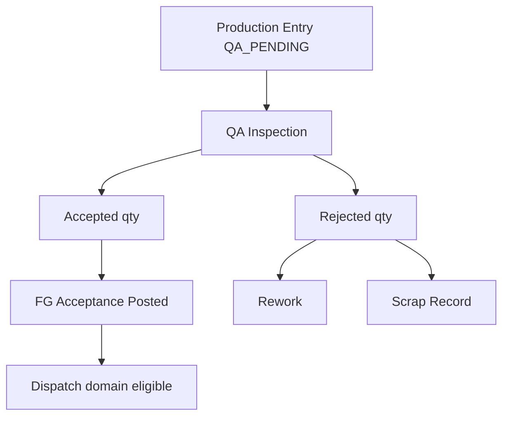
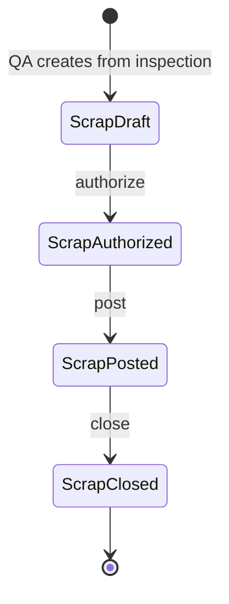

# Quality Assurance Domain Specification

| Field | Value |
|-------|-------|
| **Document ID** | FT-PD-034 |
| **Volume** | 3 — Domain Specifications |
| **Chapter** | 5 — Quality Assurance Domain Specification |
| **Title** | Quality Assurance Domain Specification |
| **Version** | 1.0.0 |
| **Status** | Draft — Architecture Review |
| **Effective date** | 2026-05-29 |
| **Author** | FT ERP Product Team |
| **Owner** | FT ERP Product Architecture |
| **Audience** | Product, domain authors, workflow engineers, QA / Production / Store process owners |
| **Classification** | Product — Domain Specification |

**Parent documents:**

- [Volume 2, Chapter 4 — Manufacturing Execution Pipeline](../02_Business_Architecture/Chapter_04_Manufacturing_Execution_Pipeline.md)
- [Volume 3, Chapter 4 — Manufacturing Domain Specification](./Chapter_04_Manufacturing_Domain_Specification.md)
- [Volume 2, Chapter 5 — Document Ownership & Responsibility Matrix](../02_Business_Architecture/Chapter_05_Document_Ownership_and_Responsibility_Matrix.md)
- [Chapter 2 — FT ERP Constitution](../01_Product_Foundation/Chapter_02_FT_ERP_Constitution.md)
- [Chapter 3 — Glossary](../01_Product_Foundation/Chapter_03_FT_ERP_Glossary_and_Standard_Terminology.md)

---

## 1. Document Control

| Version | Date | Author | Summary |
|---------|------|--------|---------|
| 1.0.0 | 2026-05-29 | FT ERP Product Team | Initial QA domain — inspection through FG acceptance for dispatch |

**Supersedes:** None.

**Change authority:** Product Architecture. Dispatch eligibility or disposition semantics require Volume 2 Ch. 4 alignment and Volume 4 workflow review.

**Out of scope:** Dispatch Note, Sales Bill ([Volume 3, Ch. 6](./README.md)); Production Entry before QA_PENDING; APIs, database, UI implementation.

---

## 2. Purpose

This chapter defines the **complete functional specification** of the **Quality Assurance (QA) domain** in FT ERP.

QA begins when a **Production Entry** reaches **`QA_PENDING`** ([Volume 3, Ch. 4](./Chapter_04_Manufacturing_Domain_Specification.md)) and ends when **accepted finished goods** are **posted to dispatch-eligible inventory** via **FG Acceptance**—the handoff to the Dispatch domain.

Architecture is in [Volume 2, Chapter 4](../02_Business_Architecture/Chapter_04_Manufacturing_Execution_Pipeline.md) §10; this chapter specifies **QA document behavior**, **dispositions**, **states**, and **validations**.

---

## 3. Scope

### 3.1 In scope

- QA boundaries (Manufacturing handoff → Dispatch eligibility)
- Artifacts: QA Inspection, Rework, Scrap Record, FG Acceptance
- Workflow states, QA logic, Business Rules
- Pending Actions (QA, Production, Store)
- QA Dashboard, Workspace, Control Tower, validation matrix

### 3.2 Out of scope

- Production Entry recording and approval ([Volume 3, Ch. 4](./Chapter_04_Manufacturing_Domain_Specification.md))
- Dispatch Note creation and shipment ([Volume 3, Ch. 6](./README.md))
- PMR, Material Issue, RM consumption
- Workflow Engine implementation (Volume 4)

### 3.3 Terminology

[Glossary](../01_Product_Foundation/Chapter_03_FT_ERP_Glossary_and_Standard_Terminology.md): **QA Inspection**, **Accepted Quantity**, **Rejected Quantity**, **Rework**, **Scrap**, **Production Batch**. Documentation uses **QA Inspection** — not “QC” as official term.

---

## 4. Domain Responsibilities

### 4.1 What the QA domain owns

| Responsibility | Description |
|----------------|-------------|
| **Inspection** | Evaluate Production Batch against quality criteria |
| **Disposition** | Accept, reject, route to rework, or scrap |
| **FG posting** | Post **Accepted Quantity** to dispatch-eligible stock |
| **Reject control** | Rejected qty never dispatch-eligible until re-inspected accept |
| **Audit trail** | Full QA decision history per batch |
| **Traceability** | Batch link to WO, Production Entry, PMR/issue chain |

### 4.2 What the QA domain does not own

| Excluded | Owned by |
|----------|----------|
| Production Entry create/approve | Manufacturing domain |
| Physical shipment | Dispatch domain |
| Rework shop-floor execution | Production domain (under QA gate) |
| Commercial billing | Dispatch & Billing domain |

### 4.3 Domain boundaries

| Boundary | Rule |
|----------|------|
| **Manufacturing → QA** | Production Entry `APPROVED` → `QA_PENDING` triggers QA Inspection eligibility |
| **QA → Dispatch** | **FG Acceptance** posts dispatch-eligible stock; Dispatch domain may allocate |
| **QA ≠ dispatch** | **No dispatch before QA acceptance** ([Vol. 2 Ch. 4](../02_Business_Architecture/Chapter_04_Manufacturing_Execution_Pipeline.md) EXE-03) |
| **Production ≠ QA** | Production cannot self-release dispatch-eligible FG |

### 4.4 Primary role

**QA** is primary owner of inspection, disposition, and FG Acceptance. **Production** executes rework under QA authorization. **Store** receives dispatch-eligible stock Read Model (no QA write).

---

## 5. QA Artifacts

### 5.1 QA Inspection

| Attribute | Specification |
|-----------|---------------|
| **Purpose** | Formal quality evaluation of a **Production Batch** |
| **Creator** | QA |
| **Owner** | QA |
| **Inputs** | Production Entry / Production Batch; WO trace; produced qty; inspection criteria |
| **Outputs** | Accepted qty; Rejected qty; disposition (rework/scrap); FG Acceptance trigger |
| **Lifecycle** | Pending → In Progress → Dispositioned → Closed \| Cancelled |
| **Allowed actions** | Start inspection; record measurements; accept full/partial; reject; route rework; route scrap |
| **Validation rules** | Parent Production Entry `QA_PENDING`; inspection qty ≤ produced qty; disposition qty sums to inspected qty |
| **Completion criteria** | **Closed** when all batch qty dispositioned (accept + scrap + rework path resolved) |

---

### 5.2 Rework

| Attribute | Specification |
|-----------|---------------|
| **Purpose** | Controlled re-entry to Manufacturing for correction before re-inspection |
| **Creator** | QA (disposition from QA Inspection) |
| **Owner** | QA (gate); **Production** (execute) |
| **Inputs** | QA Inspection rejected/rework qty; Production Batch reference |
| **Outputs** | Rework work order context; re-inspection QA Inspection on completion |
| **Lifecycle** | Authorized → In Progress → Complete → Re-inspection Pending → Closed |
| **Allowed actions** | QA authorize; Production start/complete rework; QA re-inspect |
| **Validation rules** | Must link to originating batch; qty ≤ rejected/rework disposition; cannot bypass QA on re-entry |
| **Completion criteria** | **Complete** → new or linked Production Entry / batch candidate → **Re-inspection Pending** |

**Rule:** **Rework creates controlled re-entry into Manufacturing** — not dispatch bypass.

---

### 5.3 Scrap Record

| Attribute | Specification |
|-----------|---------------|
| **Purpose** | Permanent write-off of non-salable FG (or non-recoverable reject) with audit |
| **Creator** | QA |
| **Owner** | QA |
| **Inputs** | QA Inspection scrap disposition; batch reference; reason code |
| **Outputs** | Scrap qty; audit trail; effective good output reduction |
| **Lifecycle** | Draft → Authorized → Posted → Closed |
| **Allowed actions** | Create from inspection; authorize; post; cancel draft only |
| **Validation rules** | Qty ≤ rejected/disposition qty; reason required; irreversible after post |
| **Completion criteria** | **Posted** — scrap permanently closes that material from dispatch pool |

**Rule:** **Scrap permanently closes rejected material** — no silent return to accepted stock.

---

### 5.4 FG Acceptance

| Attribute | Specification |
|-----------|---------------|
| **Purpose** | Post **Accepted Quantity** to **dispatch-eligible FG inventory** |
| **Creator** | System on QA accept (or QA confirm) |
| **Owner** | QA (decision); System (stock post) |
| **Inputs** | QA Inspection accepted qty; batch/lot identity; FG item; location policy |
| **Outputs** | Dispatch-eligible stock; FG Acceptance record; Dispatch domain handoff |
| **Lifecycle** | Pending → Posted |
| **Allowed actions** | Auto-post on inspection accept; QA confirm (if policy requires separate confirm) |
| **Validation rules** | Accepted qty > 0; inspection closed for accepted portion; FG location valid |
| **Completion criteria** | **Posted** — FG available for Dispatch allocation (**QA domain terminus**) |

---

## 6. Workflow States

### 6.1 QA Inspection

```
PENDING (from Production Entry QA_PENDING)
  ↓ start
IN_PROGRESS
  ↓ disposition
PARTIALLY_DISPOSITIONED (optional)
  ↓ all qty allocated
DISPOSITIONED
  ↓ FG accept post
CLOSED
  ↓ cancel (pre-start only)
CANCELLED
```

| State | Dispatch eligible |
|-------|-------------------|
| `PENDING` | No |
| `IN_PROGRESS` | No |
| `DISPOSITIONED` | Partial if accept posted |
| `CLOSED` | Yes for accepted portion |
| `CANCELLED` | No |

### 6.2 Rework

```
AUTHORIZED
  ↓ production start
IN_PROGRESS
  ↓ production complete
COMPLETE
  ↓ re-inspection created
RE_INSPECTION_PENDING
  ↓ QA closed
CLOSED
```

| State | Manufacturing re-entry |
|-------|------------------------|
| `AUTHORIZED` | Production may execute |
| `IN_PROGRESS` | Yes |
| `COMPLETE` | Awaiting QA |
| `RE_INSPECTION_PENDING` | New QA Inspection required |
| `CLOSED` | Terminal |

### 6.3 Scrap Record

```
DRAFT
  ↓ authorize
AUTHORIZED
  ↓ post
POSTED
  ↓
CLOSED
```

Posted scrap is **terminal** for scrapped qty — no transition to accepted.

---

## 7. QA Logic

### 7.1 Inspection process

1. Production Entry enters **`QA_PENDING`** (Manufacturing handoff)
2. QA creates/claims **QA Inspection** for **Production Batch**
3. QA records results against criteria (pass/fail, measurements, notes)
4. QA allocates produced qty across dispositions: **accept**, **rework**, **scrap**
5. System validates: `accept + rework + scrap = inspected qty ≤ produced qty`

### 7.2 Accepted quantity

**Accepted Quantity** passes inspection and flows to **FG Acceptance**:

- Posts to dispatch-eligible FG stock (location per product rules)
- Available for Dispatch domain allocation
- Traceable to batch, WO, Production Entry

Partial accept permitted: e.g. 80 accept, 20 rework from 100 produced.

### 7.3 Rejected quantity

**Rejected Quantity** fails inspection **without** dispatch rights:

- Held in controlled state pending disposition
- Must become **rework** or **scrap** — cannot silently become accepted
- **Rejected quantity never becomes dispatchable** until re-inspected and accepted

### 7.4 Rework handling

| Step | Actor |
|------|-------|
| QA authorizes rework | QA |
| Production executes correction | Production |
| Production records rework completion | Production |
| QA re-inspects | QA |
| Accept → FG Acceptance or further disposition | QA |

Rework retains **originating Production Batch** trace id.

### 7.5 Scrap handling

QA creates **Scrap Record** from inspection disposition:

- Reason code and authorizer required
- **Posted** scrap removes qty from salable/dispatch pool permanently
- May trigger variance review vs WO expected output — audit only in QA domain

### 7.6 FG posting

On accept disposition:

- **FG Acceptance** posts Accepted Quantity to inventory
- Stock state = **dispatch-eligible** (not yet dispatched)
- Until FG Acceptance, produced qty is **not** dispatch-eligible ([Vol. 2 Ch. 4](../02_Business_Architecture/Chapter_04_Manufacturing_Execution_Pipeline.md) §10.6)

### 7.7 Dispatch eligibility

Dispatch domain may allocate FG only when:

- **FG Acceptance** status = `Posted`
- Qty ≤ accepted available for batch/WO/commercial line
- QA Inspection closed for accepted portion

QA domain **sets** eligibility; Dispatch domain **consumes** it ([Volume 3, Ch. 6](./README.md)).

### 7.8 Traceability

```
Work Order
  → Production Entry / Production Batch
  → QA Inspection
  → FG Acceptance (accept path)
  → Scrap Record (scrap path)
  → Rework → re-inspection (rework path)
```

Full chain auditable for disputes and recalls. QA decision records: actor, timestamp, qty, disposition, reason.

---

## 8. Business Rules

| ID | Rule |
|----|------|
| **QAS-01** | **No dispatch before QA acceptance** — FG Acceptance required. |
| **QAS-02** | **Accepted FG posts to inventory** as dispatch-eligible on FG Acceptance. |
| **QAS-03** | **Rejected quantity never becomes dispatchable** without pass re-inspection. |
| **QAS-04** | **Rework creates controlled re-entry** into Manufacturing under QA authorization. |
| **QAS-05** | **Scrap permanently closes** rejected material from dispatch pool. |
| **QAS-06** | **QA decision is fully auditable** — no silent disposition changes. |
| **QAS-07** | **Inspection qty cannot exceed produced quantity** on Production Entry. |
| **QAS-08** | **Production cannot approve** QA Inspection or FG Acceptance. |
| **QAS-09** | Disposition qty must **sum to inspected qty** (accept + rework + scrap). |
| **QAS-10** | Partial accept permitted; each portion dispositioned independently. |
| **QAS-11** | Re-inspection after rework follows same QA Inspection rules. |
| **QAS-12** | Posted Scrap Record **cannot be reversed** without formal adjustment workflow (Volume 4). |
| **QAS-13** | QA gates **identical** for REGULAR and NO_QTY batches. |
| **QAS-14** | Cancelled QA Inspection (pre-start) returns batch to `QA_PENDING` queue. |
| **QAS-15** | FG Acceptance is **QA domain terminus** — Dispatch owns shipment. |

*Architecture rules EXE-03, EXE-11 in [Vol. 2 Ch. 4](../02_Business_Architecture/Chapter_04_Manufacturing_Execution_Pipeline.md) remain authoritative.*

---

## 9. Pending Actions

Engine-generated only.

### 9.1 QA

| ID | Trigger | Action |
|----|---------|--------|
| `QAS_INSP_START` | Batch `QA_PENDING`; no inspection | Start QA Inspection |
| `QAS_INSP_COMPLETE` | Inspection In Progress | Complete disposition |
| `QAS_SCRAP_AUTH` | Scrap Record Draft | Authorize scrap |
| `QAS_SCRAP_POST` | Scrap Authorized | Post scrap |
| `QAS_REWORK_REINSP` | Rework Complete | Re-inspect batch |
| `QAS_FG_ACCEPT` | Accept disposition; post pending | Confirm FG Acceptance (if policy) |

### 9.2 Production

| ID | Trigger | Action |
|----|---------|--------|
| `QAS_REWORK_EXEC` | Rework Authorized | Execute rework |
| `QAS_REWORK_DONE` | Rework In Progress | Complete rework |

### 9.3 Store

| ID | Trigger | Action |
|----|---------|--------|
| `QAS_DISPATCH_READY` | FG Acceptance Posted | Monitor — dispatch prep (Dispatch domain action) |

Store **does not** own QA Inspection. `QAS_DISPATCH_READY` is **read-only monitor** on Store Dashboard until Dispatch domain Pending Action fires ([Volume 3, Ch. 6](./README.md)).

---

## 10. Dashboard Responsibilities

**QA Dashboard = My Work** for QA role.

| Zone | Content |
|------|---------|
| **My Work** | §9.1 Pending Actions |
| **Inspection queue** | `QA_PENDING` batches without inspection |
| **In progress** | Inspections In Progress aging |
| **Rework queue** | Authorized rework awaiting Production |
| **Re-inspection queue** | Rework complete awaiting QA |
| **KPIs** | QA backlog count; median inspection time; reject rate; scrap rate |

**Production Dashboard (QA slice):** `QAS_REWORK_EXEC`, `QAS_REWORK_DONE` only.

**Store Dashboard (QA slice):** `QAS_DISPATCH_READY` monitor — accepted FG awaiting dispatch, no QA write.

---

## 11. Workspace Responsibilities

**QA Inspection Workspace** = batch-context quality environment.

| Element | Behavior |
|---------|----------|
| **Header** | Batch id, WO, FG item, produced qty, QA state, Business Model badge |
| **Trace panel** | Production Entry → PMR/issue references (read-only) |
| **Inspection form** | Criteria, measurements, notes |
| **Disposition grid** | Accept / rework / scrap qty per line |
| **Action zone** | QA-only: start, disposition, authorize scrap, complete |
| **Audit tab** | Full decision history |

### 11.1 Write authority

Only **QA** sees inspection disposition and scrap authorize actions. Production sees **rework execution** zone only when Rework `AUTHORIZED`.

### 11.2 Handoff banners

- **From Manufacturing:** “Production batch awaiting inspection”
- **To Dispatch:** On FG Acceptance — “Dispatch-eligible — open Dispatch Workspace” (read link; Store executes dispatch)

### 11.3 Wrong-flow Guard

Cannot inspect batch not in `QA_PENDING`. Cannot dispatch from QA Workspace.

---

## 12. Control Tower Visibility

| KPI / theme | Description |
|-------------|-------------|
| **QA backlog** | Batches `QA_PENDING` without inspection start |
| **Inspection aging** | In Progress > N days |
| **Reject rate** | Rejected / produced (period) |
| **Rework loop** | Rework authorized but not complete |
| **Scrap exposure** | Posted scrap qty (period) |
| **Dispatch-ready FG** | FG Acceptance posted not yet dispatched |
| **Bottleneck** | Production complete → QA delay → dispatch delay chain |

Rows: batch, WO, customer context, QA state, owner (QA/Production), age, recommended action.

---

## 13. Validation Matrix

| Validation | Trigger | Blocking behavior | Role |
|------------|---------|-------------------|------|
| Production Entry QA_PENDING | Inspection create | Block | QA |
| Inspection qty ≤ produced | Disposition save | Block | QA |
| Disposition sum = inspected | Disposition complete | Block | QA |
| Accept qty > 0 | FG Acceptance | Block if zero accept path N/A | System |
| Scrap reason required | Scrap authorize | Block | QA |
| Scrap qty ≤ disposition | Scrap post | Block | QA |
| Rework qty ≤ reject | Rework authorize | Block | QA |
| Production not QA owner | QA disposition | Block | System |
| Dispatch without FG Acceptance | Dispatch attempt | Block (Dispatch domain) | Store |
| Re-inspection required | Rework complete | Block accept until re-inspect | QA |
| Posted scrap reversal | Edit scrap | Block | System |
| Cancel inspection started | Cancel | Block | QA |
| Batch already closed | New inspection | Block | System |
| Partial accept + open rework | Close inspection | Warn if rework not authorized | QA |

---

## 14. Lifecycle Diagrams

### 14.1 QA inspection flow



### 14.2 Rework flow


### 14.3 Scrap flow



---

## 15. Review Checklist

- [ ] Functional spec only; no API, DB, UI
- [ ] Begins at QA_PENDING; ends at FG Acceptance / dispatch eligibility
- [ ] All four QA artifacts specified (§5)
- [ ] Workflow states QA Inspection, Rework, Scrap (§6)
- [ ] No dispatch before QA acceptance (QAS-01)
- [ ] Rework re-entry and scrap permanence explicit
- [ ] Traceability chain (§7.8)
- [ ] QAS Business Rules
- [ ] Pending Actions QA / Production / Store
- [ ] Dashboard, Workspace, Control Tower
- [ ] Validation matrix
- [ ] Three Mermaid diagrams
- [ ] Volume 2 Ch. 4 cross-referenced

---

## 16. Change Log

| Version | Date | Author | Summary |
|---------|------|--------|---------|
| 1.0.0 | 2026-05-29 | FT ERP Product Team | Initial Quality Assurance Domain Specification |

---

## 17. Approval Block

| Role | Name | Signature | Date |
|------|------|-----------|------|
| Product Owner | | | |
| Product Architecture | | | |
| QA Process Owner | | | |
| Production Process Owner | | | |
| Workflow Engineering Lead | | | |

---

## Document navigation

| | Link |
|--|------|
| **Previous** | [Manufacturing Domain Specification](./Chapter_04_Manufacturing_Domain_Specification.md) (FT-PD-033) |
| **Next** | [Dispatch & Billing Domain Specification](./Chapter_06_Dispatch_and_Billing_Domain_Specification.md) (FT-PD-035) |
| **Volume** | [Domain Specifications](./README.md) |
| **Product** | [Product Documentation Index](../README.md) |

