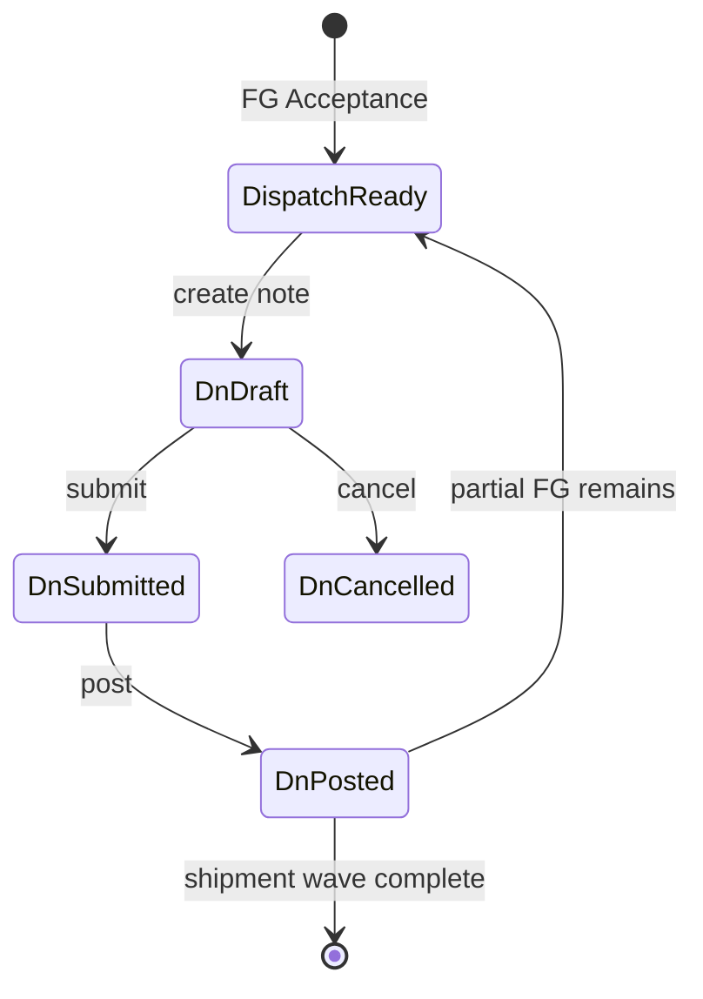
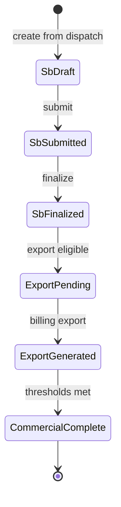
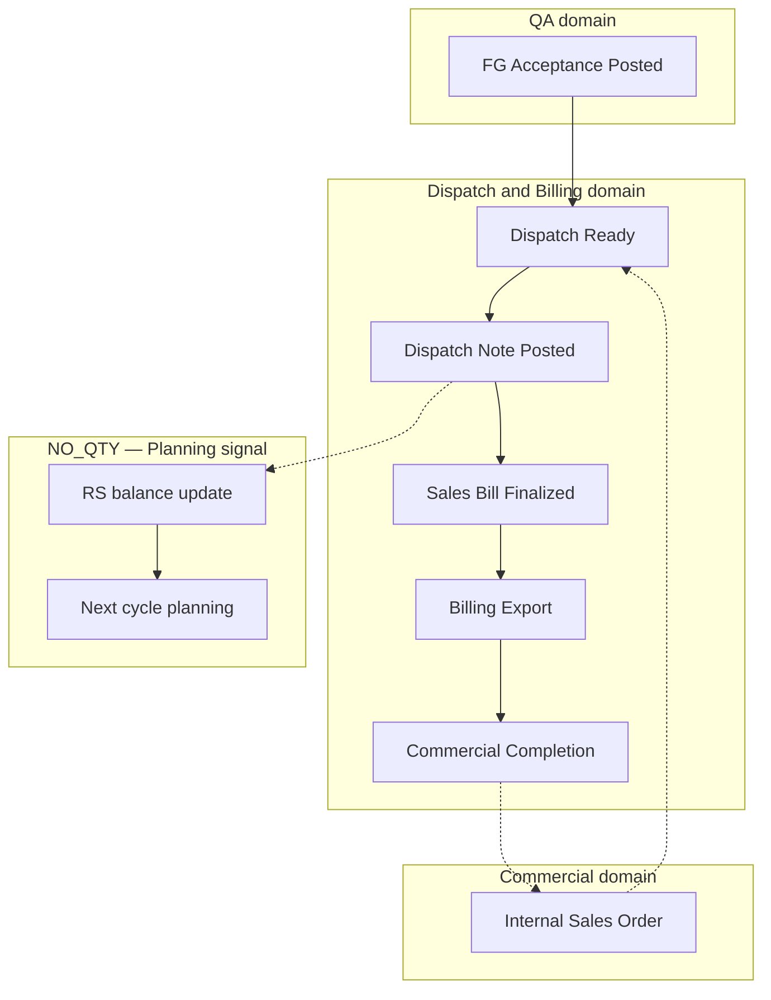

# Dispatch & Billing Domain Specification

| Field | Value |
|-------|-------|
| **Document ID** | FT-PD-035 |
| **Volume** | 3 — Domain Specifications |
| **Chapter** | 6 — Dispatch & Billing Domain Specification |
| **Title** | Dispatch & Billing Domain Specification |
| **Version** | 1.0.0 |
| **Status** | Draft — Architecture Review |
| **Effective date** | 2026-05-29 |
| **Author** | FT ERP Product Team |
| **Owner** | FT ERP Product Architecture |
| **Audience** | Product, domain authors, workflow engineers, Store/Admin process owners |
| **Classification** | Product — Domain Specification |

**Parent documents:**

- [Volume 2, Chapter 4 — Manufacturing Execution Pipeline](../02_Business_Architecture/Chapter_04_Manufacturing_Execution_Pipeline.md)
- [Volume 3, Chapter 5 — Quality Assurance Domain Specification](./Chapter_05_Quality_Assurance_Domain_Specification.md)
- [Volume 3, Chapter 1 — Commercial Domain Specification](./Chapter_01_Commercial_Domain_Specification.md)
- [Volume 2, Chapter 3 — NO_QTY Agreement Planning Pipeline](../02_Business_Architecture/Chapter_03_NO_QTY_Agreement_Planning_Pipeline.md)
- [Volume 2, Chapter 5 — Document Ownership & Responsibility Matrix](../02_Business_Architecture/Chapter_05_Document_Ownership_and_Responsibility_Matrix.md)
- [Chapter 2 — FT ERP Constitution](../01_Product_Foundation/Chapter_02_FT_ERP_Constitution.md)
- [Chapter 3 — Glossary](../01_Product_Foundation/Chapter_03_FT_ERP_Glossary_and_Standard_Terminology.md)

---

## 1. Document Control

| Version | Date | Author | Summary |
|---------|------|--------|---------|
| 1.0.0 | 2026-05-29 | FT ERP Product Team | Initial Dispatch & Billing domain — dispatch through commercial completion |

**Supersedes:** None.

**Change authority:** Product Architecture. Dispatch eligibility or billing ownership changes require Volume 2 alignment and Volume 4 workflow review.

**Out of scope:** QA Inspection, FG Acceptance posting ([Volume 3, Ch. 5](./Chapter_05_Quality_Assurance_Domain_Specification.md)); APIs, database, UI implementation.

---

## 2. Purpose

This chapter defines the **complete functional specification** of the **Dispatch & Billing domain** in FT ERP.

The domain begins when finished goods become **Dispatch Ready** after **FG Acceptance** (QA domain) and ends with **Commercial Completion**—the commercial lifecycle milestone for an order or agreement cycle.

Architecture is in [Volume 2, Chapter 4](../02_Business_Architecture/Chapter_04_Manufacturing_Execution_Pipeline.md) §11–12; this chapter specifies **dispatch and billing document behavior**, **validations**, **ownership separation** (Store vs Admin), and **NO_QTY cycle continuation** after dispatch.

---

## 3. Scope

### 3.1 In scope

- Domain boundaries: QA → Dispatch → Billing → Commercial Completion
- Artifacts: Dispatch (process), Dispatch Note, Sales Bill, Billing Export, Commercial Completion
- Workflow states, dispatch/billing logic, Business Rules
- Pending Actions (Store, Admin; Accounts optional module note)
- Dashboard, Workspace, Control Tower, validation matrix
- NO_QTY RS balance update and planning re-entry signals

### 3.2 Out of scope

- QA Inspection and FG Acceptance ([Volume 3, Ch. 5](./Chapter_05_Quality_Assurance_Domain_Specification.md))
- Enquiry through ISO commercial chain ([Volume 3, Ch. 1](./Chapter_01_Commercial_Domain_Specification.md)) — except ISO balance consumption
- Purchase Bill / supplier invoicing
- Workflow Engine implementation (Volume 4)

### 3.3 Terminology

[Glossary](../01_Product_Foundation/Chapter_03_FT_ERP_Glossary_and_Standard_Terminology.md): **Dispatch**, **Dispatch Note**, **Sales Bill**, **Billing Export**, **Commercial Completion**, **Internal Sales Order**.

---

## 4. Domain Responsibilities

### 4.1 What the Dispatch & Billing domain owns

| Responsibility | Owner (standard) |
|----------------|------------------|
| **Physical shipment authorization** | Store (Dispatch Note) |
| **Dispatch-eligible FG allocation** | Store |
| **Commercial fulfillment progress** | System + Store dispatch |
| **Customer invoice** | Admin (Sales Bill) |
| **Accounting export** | Admin (Billing Export) |
| **Commercial lifecycle milestone** | Admin (Commercial Completion) |
| **NO_QTY post-dispatch cycle signals** | System → Planning domain |

### 4.2 Domain boundary map

| Boundary | From | To | Rule |
|----------|------|-----|------|
| **QA → Dispatch** | FG Acceptance Posted | Dispatch Ready | No dispatch without QA acceptance |
| **Dispatch → Billing** | Dispatch Note Posted | Sales Bill eligible | Billing follows dispatch (standard) |
| **Billing → Completion** | Sales Bill Finalized | Commercial Completion | Completion per configured thresholds |
| **Dispatch → Planning (NO_QTY)** | Dispatch Posted | RS balance / cycle update | Enables next-cycle planning |

### 4.3 Role separation (mandatory in standard product)

| Role | Dispatch & Billing scope |
|------|--------------------------|
| **Store** | Dispatch Note create/post; shipment execution |
| **Admin** | Sales Bill, Billing Export, Commercial Completion |
| **Accounts** | *Optional module* — may mirror export/reconciliation; **does not** replace Admin billing ownership in Core |

**Rule:** Store **never** creates Sales Bill; Admin **never** posts Dispatch Note in standard product ([Volume 2, Ch. 5](../02_Business_Architecture/Chapter_05_Document_Ownership_and_Responsibility_Matrix.md)).

### 4.4 Optional Accounts module

**Accounts** (Optional Module per Constitution Art. 16) may provide extended ledger views, reconciliation workspaces, or export automation. Configurable responsibility (Art. 20) may assign export execution to Accounts role—but **Sales Bill creation and Commercial Completion remain Admin-owned** in standard FT ERP unless explicitly configured with audit trail.

---

## 5. Domain Artifacts

### 5.1 Dispatch (process)

| Attribute | Specification |
|-----------|---------------|
| **Purpose** | Controlled act of shipping **Accepted Quantity** FG to customer |
| **Creator** | Store (executes) |
| **Owner** | Store |
| **Inputs** | Dispatch-eligible FG; Internal Sales Order / schedule link; batch trace |
| **Outputs** | Dispatch Note; stock decrement; fulfillment progress |
| **Lifecycle** | Eligible → In Preparation → Note Posted → Complete (per shipment wave) |
| **Allowed actions** | Prepare shipment; allocate FG lines; create/post Dispatch Note |
| **Validation rules** | FG Acceptance posted; qty ≤ accepted available; ≤ SO/schedule balance |
| **Completion criteria** | **Dispatch Note Posted** for shipment wave |

*Dispatch* is the **process**; **Dispatch Note** is the ERP-controlled document record.

---

### 5.2 Dispatch Note

| Attribute | Specification |
|-----------|---------------|
| **Purpose** | ERP-controlled shipment document — quantities, batch trace, shipment metadata |
| **Creator** | Store |
| **Owner** | Store |
| **Inputs** | FG Acceptance allocations; ISO line; WO/batch references; optional Customer PO ref (display) |
| **Outputs** | Posted shipment; reduced dispatch-eligible stock; billing eligibility |
| **Lifecycle** | Draft → Submitted → Posted \| Cancelled (draft) |
| **Allowed actions** | Create; edit draft; submit; post; cancel draft |
| **Validation rules** | See §7; Customer PO does not authorize dispatch |
| **Completion criteria** | **Posted** — irreversible without formal reversal (Volume 4) |

---

### 5.3 Sales Bill

| Attribute | Specification |
|-----------|---------------|
| **Purpose** | Commercial invoice for dispatched FG (or configured contract billing) |
| **Creator** | Admin |
| **Owner** | Admin |
| **Inputs** | Posted Dispatch Note(s); ISO commercial terms; pricing from quotation/ISO |
| **Outputs** | Finalized invoice; Billing Export eligibility; Commercial Completion progress |
| **Lifecycle** | Draft → Submitted → Finalized \| Cancelled (draft) |
| **Allowed actions** | Create from dispatch; edit draft; submit; finalize; controlled correction |
| **Validation rules** | Linked dispatch posted; bill qty ≤ dispatched qty; billing after dispatch |
| **Completion criteria** | **Finalized** — ready for export and completion evaluation |

---

### 5.4 Billing Export

| Attribute | Specification |
|-----------|---------------|
| **Purpose** | Structured export payload for external accounting (e.g. Tally XML) |
| **Creator** | Admin (standard); Accounts role if Optional Module enabled |
| **Owner** | Admin (standard) |
| **Inputs** | Finalized Sales Bill |
| **Outputs** | Export file / integration payload; export audit log |
| **Lifecycle** | Pending → Generated → Acknowledged \| Failed |
| **Allowed actions** | Generate; re-generate (policy); acknowledge import |
| **Validation rules** | Sales Bill **Finalized**; export only after finalize |
| **Completion criteria** | **Generated** or **Acknowledged** per integration policy |

---

### 5.5 Commercial Completion

| Attribute | Specification |
|-----------|---------------|
| **Purpose** | Milestone marking contractual/documentary obligations satisfied for order or agreement cycle |
| **Creator** | Admin (confirm) / System (evaluate) |
| **Owner** | Admin |
| **Inputs** | ISO state; dispatch totals; finalized billing totals; configured thresholds |
| **Outputs** | ISO `COMMERCIALLY_COMPLETE`; NO_QTY cycle closure signals; audit record |
| **Lifecycle** | Not Evaluated → Pending Review → Completed |
| **Allowed actions** | System evaluate; Admin confirm; Admin reverse (controlled) |
| **Validation rules** | Thresholds met per Business Model policy; billing completion required |
| **Completion criteria** | **Completed** — **domain terminus** for fulfillment arc |

---

## 6. Workflow States

### 6.1 Dispatch (Dispatch Note)

```
DRAFT
  ↓ submit
SUBMITTED
  ↓ post
POSTED
  ↓ cancel (draft only)
CANCELLED
```

| State | Stock impact | Billing eligible |
|-------|--------------|------------------|
| `DRAFT` | None | No |
| `SUBMITTED` | None | No |
| `POSTED` | FG decrement | Yes |
| `CANCELLED` | None | No |

### 6.2 Sales Bill

```
DRAFT
  ↓ submit
SUBMITTED
  ↓ finalize
FINALIZED
  ↓ controlled correction
CORRECTION_PENDING (optional)
  ↓ cancel (draft)
CANCELLED
```

| State | Export eligible | Commercial Completion |
|-------|-----------------|----------------------|
| `DRAFT` | No | No |
| `SUBMITTED` | No | No |
| `FINALIZED` | Yes | Evaluates |
| `CANCELLED` | No | No |

### 6.3 Billing Export

```
PENDING
  ↓ generate
GENERATED
  ↓ acknowledge | fail
ACKNOWLEDGED | FAILED
```

**Rule:** **Export only after finalized bill** — `PENDING` blocked until Sales Bill `FINALIZED`.

---

## 7. Dispatch Logic

### 7.1 Dispatch eligibility

Dispatch may proceed only when **all** hold:

| Gate | Source |
|------|--------|
| FG Acceptance Posted | QA domain ([Vol. 3 Ch. 5](./Chapter_05_Quality_Assurance_Domain_Specification.md)) |
| Dispatch-eligible qty available | Stock Read Model |
| Internal Sales Order active | Commercial domain |
| WO/commercial line permits shipment | Business Model rules |
| No execution guard (cancelled WO/ISO policy) | System |

### 7.2 FG Acceptance requirement

**No dispatch before QA acceptance.** Unaccepted production, rejected, rework-pending, or scrap qty **cannot** be dispatched.

### 7.3 SO / schedule balance validation

| Business Model | Balance rule |
|----------------|--------------|
| **REGULAR Order** | Dispatch qty ≤ ISO line **remaining dispatch balance** |
| **NO_QTY Agreement** | Dispatch qty ≤ schedule/agreement context for cycle (RS-linked semantics) |

Customer PO reference is **display/match only** — does not set balance.

### 7.4 Partial dispatch

Multiple **Dispatch Notes** may ship portions of:

- Accepted FG pool for a batch/WO
- ISO line remaining balance

Each posted note reduces dispatch-eligible stock and remaining commercial balance.

### 7.5 Multiple dispatches

One ISO line or NO_QTY cycle may have **many** Dispatch Notes over time until balance exhausted or Commercial Completion.

### 7.6 Dispatch completion

| Level | Meaning |
|-------|---------|
| **Note Posted** | Shipment wave complete |
| **Line fulfilled** | Cumulative dispatch = line balance (REGULAR) or cycle threshold (NO_QTY) |
| **ISO dispatch complete** | All lines satisfied per policy |

### 7.7 Traceability

Dispatch Note lines carry:

- FG item, qty, batch/lot reference
- WO, Production Entry, QA Inspection, FG Acceptance links
- Internal Sales Order line reference
- Optional Customer PO ref on paperwork

---

## 8. Billing Logic

### 8.1 Sales Bill creation

- Created **after** Dispatch Note **Posted** (standard FG shipment billing)
- Lines derived from dispatched qty × commercial price terms
- May consolidate multiple Dispatch Notes per ISO per policy
- **Billing always follows dispatch** for standard product

### 8.2 Billing ownership

**Admin** owns Sales Bill lifecycle in standard product. Store has read-only visibility of billing status for shipment context.

### 8.3 Finalization

**Finalize** locks invoice for export and Commercial Completion evaluation. Post-finalize edits require **controlled correction** workflow—not silent overwrite.

### 8.4 Export to accounting

**Billing Export** generates integration payload from **Finalized** Sales Bill. Admin executes in standard product; Accounts Optional Module may provide automation UI.

### 8.5 Commercial completion

System evaluates when configured thresholds met:

| Typical threshold (configurable) | REGULAR | NO_QTY |
|----------------------------------|---------|--------|
| Dispatch % of ISO commitment | Required | Per agreement |
| Billing finalized | Required | Required |
| Open WO/dispatch exceptions | None blocking | Cycle may continue |

Admin **confirms** Commercial Completion → ISO `COMMERCIALLY_COMPLETE` ([Vol. 3 Ch. 1](./Chapter_01_Commercial_Domain_Specification.md)).

### 8.6 Billing corrections and controlled reversals

| Scenario | Path |
|----------|------|
| Draft error | Edit/cancel draft |
| Post-finalize error | Credit note / correction Sales Bill (Volume 3 extension) with audit |
| Dispatch reversal | Formal reversal workflow (Volume 4) — never silent stock restore |

### 8.7 NO_QTY cycle continuation after dispatch

On Dispatch Note **Posted** under NO_QTY Agreement:

1. **Requirement Sheet balance** updated — fulfilled qty increases, remaining placement/dispatch balance decreases
2. **Planning Cycle progress** advanced
3. **Carry forward** candidates evaluated for next cycle ([Vol. 2 Ch. 4](../02_Business_Architecture/Chapter_04_Manufacturing_Execution_Pipeline.md) §16)
4. **Planning domain** Pending Actions may fire — e.g. continue next cycle (`PLN_RS_CONTINUE`)

Agreement continues until **Commercial Completion**; individual cycles iterate plan → execute → dispatch → replan.

---

## 9. Business Rules

| ID | Rule |
|----|------|
| **DSP-01** | **No dispatch before QA acceptance** (FG Acceptance Posted). |
| **DSP-02** | **Dispatch cannot exceed accepted FG** available for allocation. |
| **DSP-03** | **Dispatch cannot exceed remaining SO/schedule balance.** |
| **DSP-04** | **Billing always follows dispatch** for standard FG shipment billing. |
| **DSP-05** | **Export only after finalized** Sales Bill. |
| **DSP-06** | **Commercial completion only after billing completion** per configured thresholds. |
| **DSP-07** | **NO_QTY dispatch updates Requirement Sheet balance** and enables future planning cycles. |
| **DSP-08** | **Dispatch Note** is Store-owned; **Sales Bill** is Admin-owned. |
| **DSP-09** | **Customer PO** never authorizes dispatch or billing. |
| **DSP-10** | Posted Dispatch Note reduces dispatch-eligible FG stock immediately. |
| **DSP-11** | Multiple Dispatch Notes per ISO line permitted. |
| **DSP-12** | Sales Bill qty **cannot exceed** linked dispatched qty. |
| **DSP-13** | Billing Export **cannot** run on draft/submitted Sales Bill. |
| **DSP-14** | Commercial Completion **does not** auto-close open WOs without policy. |
| **DSP-15** | REGULAR and NO_QTY share dispatch gate structure; balance semantics differ. |
| **DSP-16** | Accounts Optional Module **does not** bypass Admin billing ownership by default. |

---

## 10. Pending Actions

Engine-generated only.

### 10.1 Store

| ID | Trigger | Action |
|----|---------|--------|
| `DSP_PREP` | FG Acceptance; dispatch-eligible qty | Prepare dispatch |
| `DSP_NOTE_DRAFT` | Shipment prepared | Complete Dispatch Note |
| `DSP_NOTE_POST` | Dispatch Note Submitted | Post Dispatch Note |
| `DSP_PARTIAL` | Remaining accepted FG | Plan next shipment wave |

### 10.2 Admin

| ID | Trigger | Action |
|----|---------|--------|
| `DSP_BILL_CREATE` | Dispatch Note Posted; no bill | Create Sales Bill |
| `DSP_BILL_FINAL` | Sales Bill Submitted | Finalize Sales Bill |
| `DSP_EXPORT` | Sales Bill Finalized | Run Billing Export |
| `DSP_COMM_COMPLETE` | Thresholds met | Confirm Commercial Completion |

### 10.3 Accounts (Optional Module)

When **Accounts** module enabled and responsibility configured:

| ID | Trigger | Action | Note |
|----|---------|--------|------|
| `DSP_EXPORT_ACC` | Sales Bill Finalized | Generate/reconcile export | Optional; Admin may still own |
| `DSP_RECON` | Export Generated | Acknowledge accounting import | Optional |

**Standard product:** All §10.2 Admin actions apply; Accounts actions are **additive**, not replacements.

---

## 11. Dashboard Responsibilities

### 11.1 Dispatch Dashboard (Store)

| Zone | Content |
|------|---------|
| **My Work** | §10.1 Pending Actions |
| **Dispatch-ready queue** | FG Acceptance posted not dispatched |
| **Draft notes** | Dispatch Notes in Draft/Submitted |
| **KPIs** | Awaiting dispatch count; aging dispatch-ready FG |

### 11.2 Billing Dashboard (Admin)

| Zone | Content |
|------|---------|
| **My Work** | §10.2 Pending Actions |
| **Unbilled dispatch** | Posted notes without Sales Bill |
| **Draft bills** | Sales Bill Draft/Submitted |
| **Export queue** | Finalized awaiting export |
| **Completion queue** | Pending Commercial Completion |
| **KPIs** | Bill cycle time; unbilled dispatch value |

**Separation:** Store Dashboard shows **unbilled dispatch** as read-only monitor; Admin Dashboard shows **dispatch-ready** only as context link—not Store post actions.

---

## 12. Workspace Responsibilities

### 12.1 Dispatch Workspace (Store)

| Element | Behavior |
|---------|----------|
| **Header** | ISO, customer, Business Model, dispatch balance remaining |
| **FG picker** | Dispatch-eligible lines only (FG Acceptance filter) |
| **Batch trace** | Lot/batch, WO, QA references |
| **Shipment metadata** | Vehicle, LR, dates, Customer PO ref (display) |
| **Actions** | Create/submit/post Dispatch Note — Store only |
| **Continuity** | QA accepted → dispatch posted → billing status (read-only) |

### 12.2 Billing Workspace (Admin)

| Element | Behavior |
|---------|----------|
| **Header** | Sales Bill no, state, ISO, customer |
| **Dispatch link panel** | Posted Dispatch Notes included |
| **Line grid** | Dispatched qty × price; tax references |
| **Actions** | Finalize, export, commercial completion — Admin only |
| **Correction zone** | Controlled post-finalize corrections |

### 12.3 Cross-workspace rules

- Deep-link from Admin billing to read-only Dispatch Note trace
- Store cannot open billing finalize actions
- Wrong-flow: block billing create without posted dispatch

---

## 13. Control Tower Visibility

| KPI / theme | Description |
|-------------|-------------|
| **Dispatch-ready aging** | FG accepted not shipped |
| **Dispatch backlog** | Draft/submitted notes not posted |
| **Unbilled dispatch** | Posted notes without Sales Bill |
| **Billing backlog** | Submitted bills not finalized |
| **Export failures** | Billing Export Failed |
| **Commercial completion** | ISO/agreement pending completion |
| **NO_QTY cycle fulfillment** | RS/cycle dispatch % vs plan |
| **End-to-end cycle time** | FG Acceptance → dispatch → bill → completion |

Rows: document, customer, Business Model, stage, owner (Store/Admin), age, recommended action.

---

## 14. Validation Matrix

| Validation | Trigger | Blocking behavior | Role |
|------------|---------|-------------------|------|
| FG Acceptance Posted | Dispatch Note create | Block | Store |
| Dispatch qty ≤ accepted FG | Note line save | Block | Store |
| Dispatch qty ≤ ISO balance (REGULAR) | Note post | Block | Store |
| Dispatch qty ≤ schedule balance (NO_QTY) | Note post | Block | Store |
| QA not accepted | Dispatch | Block | System |
| Dispatch Note Posted | Sales Bill create | Block | Admin |
| Bill qty ≤ dispatched qty | Bill line save | Block | Admin |
| Sales Bill Finalized | Billing Export | Block | Admin |
| Billing complete (policy) | Commercial Completion | Block | Admin |
| Customer PO only | Dispatch/bill | No bypass | System |
| Store creates Sales Bill | Bill create | Block | System |
| Admin posts Dispatch Note | Dispatch post | Block (standard) | System |
| Draft bill export | Export | Block | Admin |
| Cancelled ISO | Dispatch | Block | System |
| NO_QTY RS update | Dispatch post | Auto update | System |

---

## 15. Lifecycle Diagrams

### 15.1 Dispatch lifecycle



### 15.2 Billing lifecycle



### 15.3 End-to-end fulfillment flow



---

## 16. Review Checklist

- [ ] Functional spec only; no API, DB, UI
- [ ] QA handoff via FG Acceptance explicit
- [ ] All five artifacts specified (§5)
- [ ] Store vs Admin separation maintained
- [ ] Accounts Optional Module noted (§4.4, §10.3)
- [ ] Workflow states Dispatch Note, Sales Bill, Export (§6)
- [ ] Dispatch and billing logic (§7–8)
- [ ] NO_QTY cycle continuation (§8.7)
- [ ] DSP Business Rules
- [ ] Pending Actions Store / Admin / Accounts
- [ ] Dashboard, Workspace, Control Tower
- [ ] Validation matrix
- [ ] Three Mermaid diagrams
- [ ] Volume 2 cross-referenced

---

## 17. Change Log

| Version | Date | Author | Summary |
|---------|------|--------|---------|
| 1.0.0 | 2026-05-29 | FT ERP Product Team | Initial Dispatch & Billing Domain Specification |

---

## 18. Approval Block

| Role | Name | Signature | Date |
|------|------|-----------|------|
| Product Owner | | | |
| Product Architecture | | | |
| Store Process Owner | | | |
| Admin / Commercial Process Owner | | | |
| Workflow Engineering Lead | | | |

---

## Document navigation

| | Link |
|--|------|
| **Previous** | [Quality Assurance Domain Specification](./Chapter_05_Quality_Assurance_Domain_Specification.md) (FT-PD-034) |
| **Next** | [Workflow Engine Overview & Pending Actions Contract](../04_Workflow_Engine/Chapter_01_Workflow_Engine_Overview_and_Pending_Actions_Contract.md) (FT-PD-040) |
| **Volume** | [Domain Specifications](./README.md) |
| **Product** | [Product Documentation Index](../README.md) |
---

## Document navigation

| | Link |
|--|------|
| **Previous** | [Quality Assurance Domain Specification](./Chapter_05_Quality_Assurance_Domain_Specification.md) (FT-PD-034) |
| **Next** | [Workflow Engine Overview & Pending Actions Contract](../04_Workflow_Engine/Chapter_01_Workflow_Engine_Overview_and_Pending_Actions_Contract.md) (FT-PD-040) |
| **Volume** | [Domain Specifications](./README.md) |
| **Product** | [Product Documentation Index](../README.md) |

