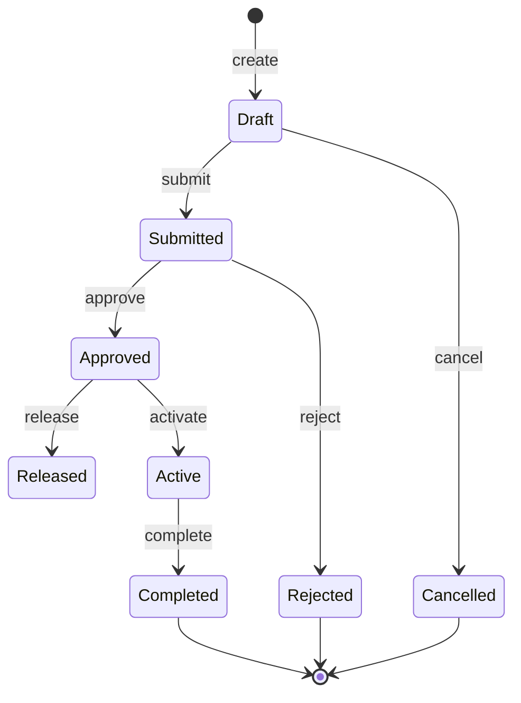
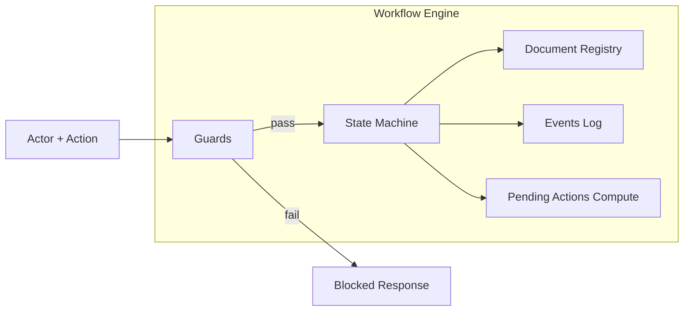
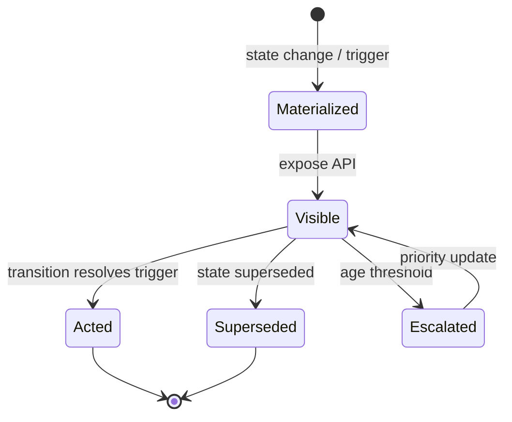
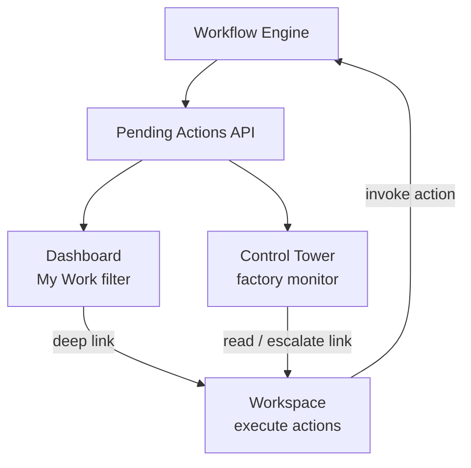

# Workflow Engine Overview & Pending Actions Contract

| Field | Value |
|-------|-------|
| **Document ID** | FT-PD-040 |
| **Volume** | 4 — Workflow Engine |
| **Chapter** | 1 — Workflow Engine Overview & Pending Actions Contract |
| **Title** | Workflow Engine Overview & Pending Actions Contract |
| **Version** | 1.0.0 |
| **Status** | Draft — Architecture Review |
| **Effective date** | 2026-05-29 |
| **Author** | FT ERP Product Team |
| **Owner** | FT ERP Product Architecture |
| **Audience** | Product, workflow engineers, backend/frontend leads, QA architects |
| **Classification** | Product — Workflow Engine Contract |

**Parent documents:**

- [Volume 1, Chapter 2 — FT ERP Constitution](../01_Product_Foundation/Chapter_02_FT_ERP_Constitution.md) (Articles 11–14)
- [Volume 1, Chapter 4 — Product Design Principles](../01_Product_Foundation/Chapter_04_FT_ERP_Product_Design_Principles.md) (§5.5, §9–10)
- [Volume 2 — Business Architecture](../02_Business_Architecture/README.md)
- [Volume 3 — Domain Specifications](../03_Domain_Specifications/README.md)
- [Volume 1, Chapter 3 — Glossary](../01_Product_Foundation/Chapter_03_FT_ERP_Glossary_and_Standard_Terminology.md)

---

## 1. Document Control

| Version | Date | Author | Summary |
|---------|------|--------|---------|
| 1.0.0 | 2026-05-29 | FT ERP Product Team | Initial Workflow Engine overview and Pending Actions contract |

**Supersedes:** None.

**Change authority:** Product Architecture. Contract changes require Constitution Arts. 11–14 compliance review and Volume 3 domain alignment.

**Out of scope for this chapter:** Per-document state tables (Volume 4 subsequent chapters), database schema, API routes, UI components.

---

## 2. Purpose

This chapter defines the **architecture and operating contract** of the **FT ERP Workflow Engine**.

It explains how **workflow states**, **transitions**, **validations**, **Pending Actions**, **Dashboard**, **Workspace**, and **Control Tower** interact—and serves as the **implementation bridge** between:

- **Volume 2** — business architecture (pipelines, ownership, rules)
- **Volume 3** — domain specifications (document behavior, state names, Pending Action IDs)

This document is the **authoritative specification for workflow behavior** in FT ERP. All implementations must conform to this contract.

---

## 3. Scope

### 3.1 In scope

- Workflow Engine philosophy and core concepts
- Generic State Machine model (ownership, guards, audit)
- **Pending Actions Contract** — creation, lifecycle, resolution, visibility
- **Dashboard**, **Workspace**, **Control Tower** contracts
- Standard workflow events, transition guards, reusable patterns
- Engine Business Rules and lifecycle diagrams

### 3.2 Out of scope

- Document-specific state transition matrices (Volume 4 Ch. 2+)
- Persistence layer design (Volume 5)
- Screen layouts (Volume 6)
- HTTP/MCP API specifications (Volume 7)

### 3.3 Authority hierarchy

| Layer | Authority |
|-------|-----------|
| Constitution (Vol. 1) | Non-negotiable laws |
| Business Architecture (Vol. 2) | Pipeline and ownership |
| Domain Specifications (Vol. 3) | Document states and domain Pending Action IDs |
| **This chapter (Vol. 4 Ch. 1)** | Engine contract and cross-cutting workflow mechanics |
| Implementation | Must implement contract; cannot redefine workflow truth |

---

## 4. Workflow Engine Philosophy

### 4.1 Single source of workflow truth

The **Workflow Engine** is the **only** component that:

- Owns authoritative **workflow state**
- Evaluates **transition guards**
- Emits **workflow events**
- Generates **Pending Actions**
- Writes **state history** and transition audit

No screen, report, batch job, or integration adapter may maintain a competing workflow model.

### 4.2 Screens never own workflow

UI surfaces **project** engine state—they do not **define** it (Constitution Art. 11). Buttons and Quick Actions invoke **engine-supported transitions** only.

### 4.3 Documents own state

Each **ERP-controlled document** (and defined workflow stage objects such as RM Release on MPRS) has exactly one **current workflow state** stored with the document aggregate. State is a property of the document in the engine registry—not of the screen session.

### 4.4 Workflow Engine owns transitions

State changes occur **only** through engine **transitions**: validated, guarded, audited operations—not direct field edits to status columns by application code outside the engine.

### 4.5 Pending Actions are engine outputs

**Pending Actions** are **derived Read Models** computed from normalized workflow state plus ownership rules ([Constitution Art. 12](../01_Product_Foundation/Chapter_02_FT_ERP_Constitution.md)). They are not user-created tasks.

---

## 5. Core Workflow Concepts

| Concept | Definition |
|---------|------------|
| **Workflow State** | Current position of a document or case in a business workflow (e.g. `AWAITING_PURCHASE_REVIEW`, `QA_PENDING`). Engine-controlled enumerated value. |
| **Transition** | Named, allowed movement from state A → state B on a document type, invoked by an **Action**. |
| **Guard** | Predicate evaluated before transition; failure **blocks** with reason code and responsible role. |
| **Trigger** | Condition (state entry, event, cross-document rule) that causes Pending Action materialization or pattern activation. |
| **Event** | Immutable record that a transition or system milestone occurred (e.g. `SUBMITTED`, `POSTED`). |
| **Action** | Engine-registered operation a role may invoke (e.g. `submitPMR`, `postGRN`) mapping to one or more transitions. |
| **Pending Action** | Engine-generated work item for primary owner: document ref, action label, priority, deep link. |
| **Workflow Queue** | Logical set of documents in a state awaiting a class of work—not a separate database queue; computed from state + ownership. |
| **Handoff** | Transition that changes **primary owner** or **domain responsibility** (e.g. MPRS submit → Purchase review). |
| **Completion** | Terminal or domain-exit state where no further Pending Actions of that class are generated (e.g. Commercial Completion). |

---

## 6. Workflow State Machine

### 6.1 State ownership

Every state has:

- **Document type** (or stage object type)
- **Primary owner role** for Pending Actions while in state (may differ from document creator)
- **Domain** (Commercial, Planning, Procurement, Manufacturing, QA, Dispatch & Billing)

Ownership defaults from [Volume 2, Chapter 5](../02_Business_Architecture/Chapter_05_Document_Ownership_and_Responsibility_Matrix.md). Engine resolves owner at Pending Action generation time.

### 6.2 Transition validation

A transition request includes:

| Field | Purpose |
|-------|---------|
| `documentType` | Registry lookup |
| `documentId` | Target instance |
| `action` | Registered action id |
| `actorRole` | Must match allowed roles for action |
| `payload` | Transition-specific data (reason, qty, revision) |

Engine sequence: **authorize role** → **run guards** → **apply transition** → **emit event** → **recompute Pending Actions** → **return result**.

### 6.3 Guard execution

Guards are **ordered**. First failure stops transition and returns:

- `blocked: true`
- `reasonCode` (stable product id, e.g. `GUARD_PMR_NOT_SUBMITTED`)
- `message` (human-readable)
- `responsibleRole` (who can fix)

Domain validation matrices in Volume 3 map to Guard implementations (Volume 4 Ch. 2+).

### 6.4 State history

Each transition appends a **state history** entry:

- Prior state, new state, action, actor, timestamp
- Optional reason (reject, cancel)
- Correlation id for cross-document handoffs

### 6.5 Audit logging

Audit log is **append-only**. Transitions, guard failures, Pending Action resolution, and reversals are logged. Audit satisfies Constitution material accountability and commercial traceability requirements.

### 6.6 Generic State Machine diagram



*Specific document types use subsets and custom state names per [Volume 3](../03_Domain_Specifications/README.md).*

---

## 7. Pending Actions Contract

### 7.1 Creation

Pending Actions are **created or refreshed** when:

1. A transition completes (state change)
2. A cross-document dependency changes (e.g. GRN posted → recompute planning readiness)
3. Scheduled **escalation** evaluation (aging thresholds)
4. Engine **bootstrap** on document create

**Never created by:** UI components, SQL reports, ad hoc `if` blocks in route handlers, or Control Tower.

### 7.2 Pending Action record schema (contract)

| Field | Required | Description |
|-------|----------|-------------|
| `id` | Yes | Stable action type id (e.g. `PLN_MPRS_REVIEW`, `DSP_NOTE_POST`) |
| `documentType` | Yes | ERP document type |
| `documentId` | Yes | Instance id |
| `documentNo` | Yes | Display number |
| `ownerRole` | Yes | Primary owner role |
| `domain` | Yes | Commercial \| Planning \| Procurement \| Manufacturing \| QA \| DispatchBilling |
| `actionLabel` | Yes | User-facing verb phrase |
| `priority` | Yes | `LOW` \| `NORMAL` \| `HIGH` \| `CRITICAL` |
| `deepLink` | Yes | Workspace entry route + context |
| `triggerState` | Yes | Workflow state that caused action |
| `createdAt` | Yes | Materialization time |
| `age` | Derived | Now − createdAt |
| `businessModel` | Optional | `REGULAR_ORDER` \| `NO_QTY_AGREEMENT` for filtering |
| `metadata` | Optional | Pool, ISO ref, risk flags |

Domain chapters define **id catalogs** (e.g. [Vol. 3 Ch. 1](../03_Domain_Specifications/Chapter_01_Commercial_Domain_Specification.md) `COMPL_*`, [Ch. 2](../03_Domain_Specifications/Chapter_02_Planning_Domain_Specification.md) `PLN_*`, [Ch. 3](../03_Domain_Specifications/Chapter_03_Procurement_Domain_Specification.md) `PRC_*`, [Ch. 4](../03_Domain_Specifications/Chapter_04_Manufacturing_Domain_Specification.md) `MFG_*`, [Ch. 5](../03_Domain_Specifications/Chapter_05_Quality_Assurance_Domain_Specification.md) `QAS_*`, [Ch. 6](../03_Domain_Specifications/Chapter_06_Dispatch_and_Billing_Domain_Specification.md) `DSP_*`).

### 7.3 Ownership rules

- **One primary owner** per Pending Action ([Volume 2, Ch. 5](../02_Business_Architecture/Chapter_05_Document_Ownership_and_Responsibility_Matrix.md) OWN-01)
- `ownerRole` must match Constitution Art. 10 defaults unless Configuration overrides (Art. 20)
- Dashboard filters: `ownerRole == currentUser.role`
- Control Tower shows owner column but **does not reassign** ownership on view

### 7.4 Lifecycle

```
MATERIALIZED → VISIBLE → (ACTED | SUPERSEDED | EXPIRED)
```

| Phase | Meaning |
|-------|---------|
| **Materialized** | Engine computed action exists |
| **Visible** | Exposed via Pending Actions API to Dashboard/CT |
| **Acted** | Transition resolved trigger; action removed |
| **Superseded** | Higher-priority action or state change invalidated this id |
| **Expired** | SLA/policy removed action with audit (optional) |

### 7.5 Resolution

A Pending Action **resolves** when:

- The **trigger condition** is false (e.g. MPRS no longer `AWAITING_PURCHASE_REVIEW`)
- The owning role completes the **registered transition**
- Document reaches **terminal state** for that action class

Resolution is **automatic** on next engine recompute—UI does not manually delete Pending Actions.

### 7.6 Expiration

Optional **expiration policy** per action id:

- Aging SLA for escalation only—not auto-completion
- Expired actions may move to Control Tower **exception** view without removing underlying workflow need

### 7.7 Escalation

When `age > threshold`:

- Priority may increase (`NORMAL` → `HIGH`)
- Control Tower **risk** flag set
- Notifications (integration layer) may fire—notifications do not create duplicate Pending Action sources

### 7.8 Visibility rules

| Surface | Visibility rule |
|---------|-----------------|
| **Dashboard** | `ownerRole` match only; actionable CTAs |
| **Workspace** | Actions valid for document state **and** actor role |
| **Control Tower** | Factory-wide; all roles; monitor primary; escalation deep-link only |
| **KPI strips** | Counts from engine aggregates—not parallel queries |

---

## 8. Dashboard Contract

### 8.1 My Work only

Dashboard displays:

- Engine-generated **Pending Actions** for logged-in user's role
- **Role KPIs** derived from engine aggregates
- **Quick Actions** deep-linking to Workspaces

(Constitution Art. 13; [Design Principles §5.5](../01_Product_Foundation/Chapter_04_FT_ERP_Product_Design_Principles.md))

### 8.2 Never creates workflow

Dashboard **must not**:

- Compute independent task lists from raw SQL/UI logic
- Expose other roles' write buttons
- Invoke transitions without Workspace/engine action registration
- Host factory-wide execution (belongs on Control Tower)

### 8.3 KPI contract

KPIs are **read-only aggregates** (queue depth, aging buckets). KPI click → filter Pending Actions or deep-link Workspace—KPI does not bypass Guards.

---

## 9. Workspace Contract

### 9.1 Executes workflow

Workspace is where authorized roles invoke **registered Actions** that trigger **transitions** (Constitution Art. 13 companion rule).

### 9.2 Never owns workflow logic

Workspace **must not**:

- Embed Business Rules duplicating Volume 3 validation matrices
- Set workflow state directly
- Show write CTAs for non-owning roles (except Admin override policy)

Business Rules live in **engine Guards**; Workspace calls engine.

### 9.3 Consumes engine state

Workspace loads:

- Document header: `documentNo`, `workflowState`, `ownerRole`, Business Model badge
- Valid actions: from engine `getAvailableActions(documentId, actorRole)`
- State history / audit tab from engine
- Continuity strip from normalized cross-document stage keys

### 9.4 Return navigation

Workspace preserves `returnTo` (`dashboard`, `pendingAction`, `controlTower`) for back navigation without affecting state.

---

## 10. Control Tower Contract

### 10.1 Monitors factory state

Control Tower answers: *What is the status of factory work across roles?* (Constitution Art. 14)

### 10.2 No ownership transfer

Viewing Control Tower **does not** change `ownerRole` or reassign Pending Actions.

### 10.3 Cross-domain visibility

Rows normalized across domains:

`document`, `domain`, `workflowState`, `ownerRole`, `age`, `risk`, `recommendedPendingActionId`, `deepLink`

### 10.4 Exception monitoring

Themes from Volume 2–3: planning backlog, procurement stall, QA backlog, dispatch-ready aging, commercial bottlenecks.

### 10.5 Read-only execution default

**Execution buttons prohibited** except engine-defined **escalation-only** actions explicitly whitelisted in Volume 4 Guard catalog. Default interaction: deep-link to owning role's Workspace.

---

## 11. Workflow Events

Standard event vocabulary used across domains:

| Event | Typical meaning |
|-------|-----------------|
| **Created** | Document instantiated |
| **Submitted** | Sent for review / customer / approval queue |
| **Approved** | Review passed; may freeze |
| **Rejected** | Review failed; terminal or return path |
| **Released** | Demand published (e.g. RM release to procurement) |
| **Posted** | Stock or financial effect applied (GRN, dispatch, scrap) |
| **Activated** | Execution enabled (WO Active) |
| **Completed** | Domain or document complete |
| **Cancelled** | Voided from draft/pre-effect |
| **Reversed** | Formal undo of Posted effect (controlled policy) |
| **Finalized** | Billing lock (Sales Bill) |
| **Dispositioned** | QA allocation complete |

Events are **immutable audit facts**—not workflow state themselves. State derives from latest successful transition.

---

## 12. Transition Guards

### 12.1 Validation before transition

Every transition has **one or more guards**. Guard sources:

- Volume 3 **validation matrices** per domain
- Volume 2 **Business Rules** (COM, PLN, PRC, MFG, QAS, DSP)
- Constitution articles (Business Model immutability, pool firewall, QA before dispatch)

**Authoritative Guard ID definitions:** [Chapter 2 §9 — Guard Registry](./Chapter_02_Transition_Guards_and_Cross_Domain_Dependency_Catalog.md#9-guard-registry). Domain State Machine chapters (Ch. 3–8) define **ordered Guard lists per action** only.

### 12.2 Blocking conditions

On Guard failure:

- Transition **not applied**
- State **unchanged**
- Client receives `reasonCode` + `responsibleRole`
- Optional Pending Action for responsible role if different from actor

### 12.3 Audit requirements

Guard failures on sensitive transitions (approve, post, finalize) are **audit logged** at `INFO` or higher severity for compliance review.

### 12.4 Cross-domain dependencies

Examples engine must evaluate:

| Guard dependency | Domains |
|------------------|---------|
| ISO ≥ `COMMITTED` before planning | Commercial → Planning |
| MR Approved / MPRS Released before PR | Planning → Procurement |
| PMR Submitted before Issue | Manufacturing internal |
| FG Acceptance before Dispatch | QA → Dispatch |
| Dispatch Posted before Sales Bill | Dispatch → Billing |
| REGULAR_SO ≠ MPRS pool mix | Planning + Procurement |

Cross-domain guards call **Read Models** (Material Availability, balances)—never mutate foreign aggregates inside wrong domain transition.

---

## 13. Workflow Patterns

Reusable patterns implemented by the engine:

### 13.1 Approval

`Draft → Submitted → Approved | Rejected`  
Examples: Feasibility, MPRS Purchase review, Sales Bill finalize path.  
**Owner handoff** often changes at `Submitted`.

### 13.2 Release

`Approved → Released`  
Explicit publish of frozen demand (MPRS RM release). **Does not** imply downstream auto-transitions (no auto WO).

### 13.3 Handoff

State change transfers **primary owner** without completing document.  
Example: MPRS `AWAITING_PURCHASE_REVIEW` → Purchase Pending Actions.

### 13.4 Freeze

Transition creates **immutable snapshot** (PMR submit, MPRS approve). Later transitions must reference frozen revision.

### 13.5 Rework

QA `Rework` → Manufacturing re-entry → QA re-inspection. Pattern links two domain State Machines via **child Rework** document.

### 13.6 Reversal

`Posted → Reversed` (controlled). Requires elevated policy; creates compensating stock/commercial entries—never silent delete.

### 13.7 Completion

Terminal or domain-exit: `Commercial Completion`, `PRODUCTION_COMPLETE`, MR `CLOSED`. Clears Pending Action class; may emit **downstream triggers** (NO_QTY planning).

---

## 14. Business Rules

| ID | Rule |
|----|------|
| **WFE-01** | **Workflow Engine is the only component** that changes authoritative workflow state. |
| **WFE-02** | **Pending Actions are never created by UI code** or parallel queue logic. |
| **WFE-03** | **Dashboards never contain business logic** that gates transitions. |
| **WFE-04** | **Workspaces never bypass Guards**—all writes go through engine actions. |
| **WFE-05** | **Control Tower is read-only** for execution except whitelisted escalation actions. |
| **WFE-06** | **Every transition is auditable** with actor, timestamp, prior/new state. |
| **WFE-07** | **Guards fail closed**—ambiguous Guard result blocks transition. |
| **WFE-08** | **One document, one current state** per workflow registry entry. |
| **WFE-09** | **Pending Action id** is stable across releases; new work gets new ids, not repurposed semantics. |
| **WFE-10** | **Business Model** is available on engine context for Guard branching where architecture requires; execution gates do not branch except display. |
| **WFE-11** | **Customer PO reference** never registers as workflow document. |
| **WFE-12** | **Recompute Pending Actions** runs after every successful transition and configured cross-domain events. |
| **WFE-13** | **Quick Actions** map 1:1 to registered engine actions for role. |
| **WFE-14** | **Configurable responsibility** (Art. 20) changes `ownerRole` mapping only—not Guard truth. |
| **WFE-15** | Volume 3 domain specs **define** states and action ids; engine **implements** them. |

---

## 15. Engine Lifecycle Diagrams

### 15.1 Generic Workflow State Machine (engine view)



### 15.2 Pending Action lifecycle



### 15.3 Dashboard → Workspace → Control Tower



---

## 16. Review Checklist

- [ ] Constitution Arts. 11–14 fully reflected
- [ ] Volume 2–3 cross-referenced; not redefining domain states
- [ ] Core concepts defined (§5)
- [ ] State Machine model with audit (§6)
- [ ] Pending Actions Contract complete (§7)
- [ ] Dashboard, Workspace, Control Tower contracts (§8–10)
- [ ] Standard events and guards (§11–12)
- [ ] Workflow patterns (§13)
- [ ] WFE Business Rules
- [ ] Three Mermaid diagrams
- [ ] No database schema, API, UI implementation
- [ ] Authoritative workflow behavior claim explicit

---

## 17. Change Log

| Version | Date | Author | Summary |
|---------|------|--------|---------|
| 1.0.0 | 2026-05-29 | FT ERP Product Team | Initial Workflow Engine overview and Pending Actions contract |

---

## 18. Approval Block

| Role | Name | Signature | Date |
|------|------|-----------|------|
| Product Owner | | | |
| Product Architecture | | | |
| Workflow Engineering Lead | | | |
| Backend Engineering Lead | | | |
| Frontend / UX Lead | | | |

---

## Document navigation

| | Link |
|--|------|
| **Previous** | [Dispatch & Billing Domain Specification](../03_Domain_Specifications/Chapter_06_Dispatch_and_Billing_Domain_Specification.md) (FT-PD-035) |
| **Next** | [Transition Guards & Cross-Domain Dependency Catalog](./Chapter_02_Transition_Guards_and_Cross_Domain_Dependency_Catalog.md) (FT-PD-041) |
| **Volume** | [Workflow Engine](./README.md) |
| **Product** | [Product Documentation Index](../README.md) |

