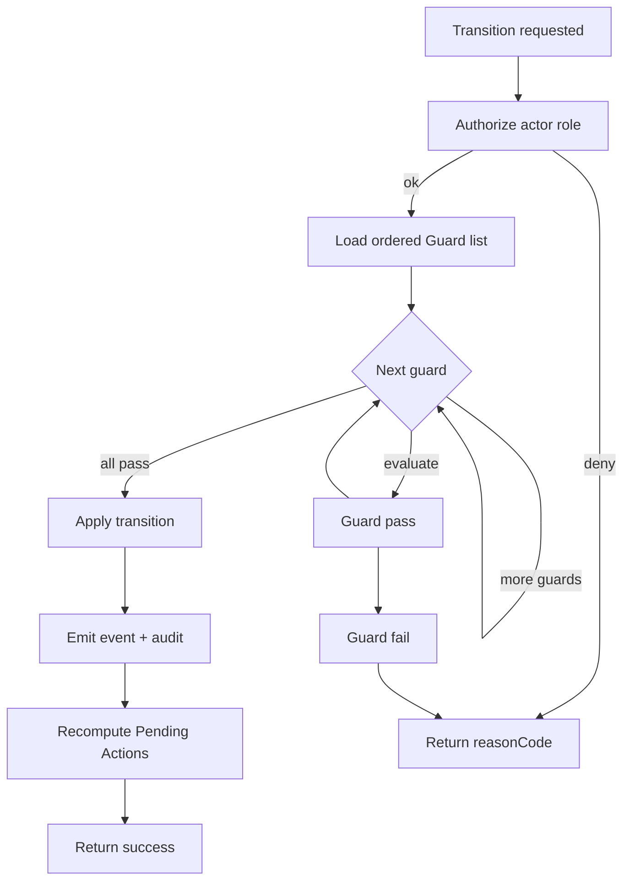
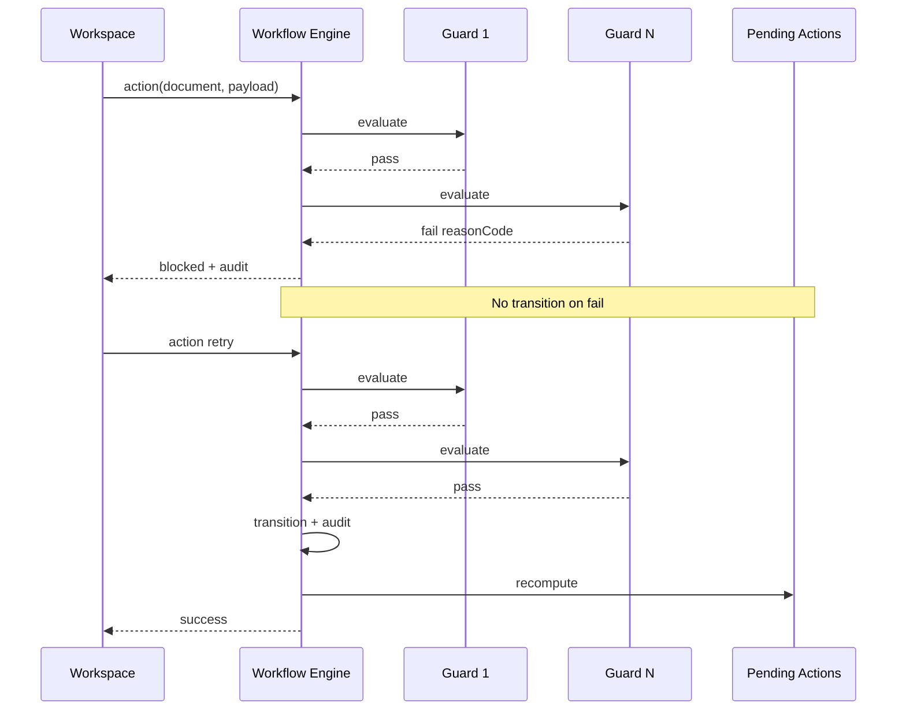
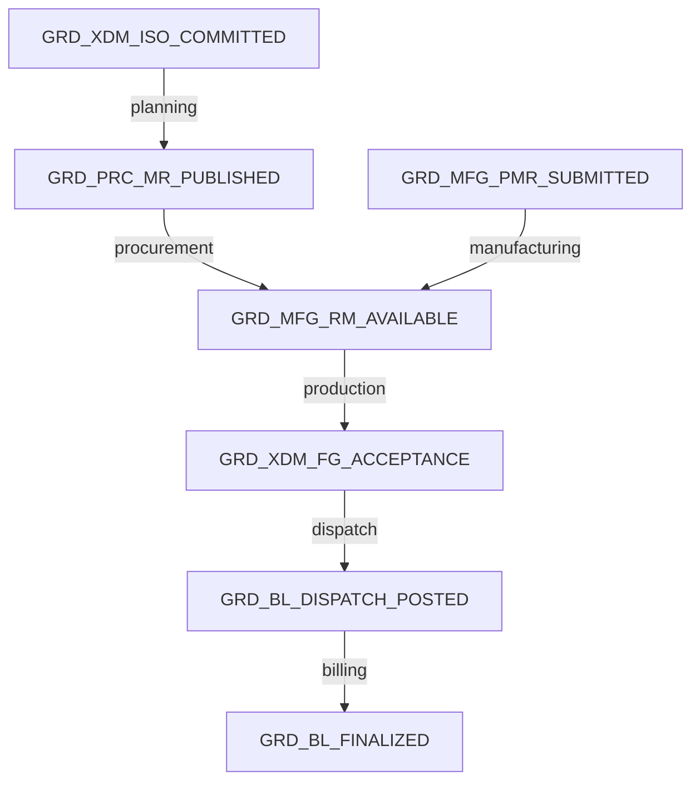
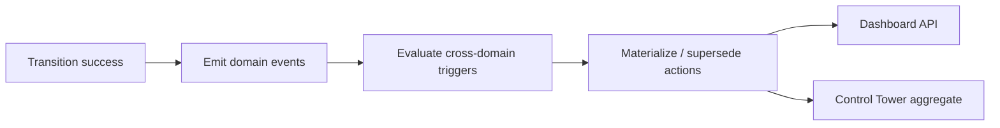

# Transition Guards & Cross-Domain Dependency Catalog

| Field | Value |
|-------|-------|
| **Document ID** | FT-PD-041 |
| **Volume** | 4 — Workflow Engine |
| **Chapter** | 2 — Transition Guards & Cross-Domain Dependency Catalog |
| **Title** | Transition Guards & Cross-Domain Dependency Catalog |
| **Version** | 1.0.0 |
| **Status** | Draft — Architecture Review |
| **Effective date** | 2026-05-29 |
| **Author** | FT ERP Product Team |
| **Owner** | FT ERP Product Architecture |
| **Audience** | Workflow engineers, backend leads, QA architects, domain authors |
| **Classification** | Product — Workflow Engine Contract |

**Parent documents:**

- [Chapter 1 — Workflow Engine Overview & Pending Actions Contract](./Chapter_01_Workflow_Engine_Overview_and_Pending_Actions_Contract.md)
- [Volume 3 — Domain Specifications](../03_Domain_Specifications/README.md)
- [Volume 2 — Business Architecture](../02_Business_Architecture/README.md)
- [Volume 1, Chapter 2 — FT ERP Constitution](../01_Product_Foundation/Chapter_02_FT_ERP_Constitution.md)

---

## 1. Document Control

| Version | Date | Author | Summary |
|---------|------|--------|---------|
| 1.0.0 | 2026-05-29 | FT ERP Product Team | Initial Guard catalog — Volume 3 validations as engine Guards |

**Supersedes:** None.

**Change authority:** Product Architecture. New guards require Volume 3 validation alignment; `reasonCode` changes are **breaking** for clients and require MINOR version bump.

**Out of scope:** Guard implementation code, API routes, database schema, per-transition ordering tables (domain State Machine chapters).

---

## 2. Purpose

This chapter defines **every workflow Guard** that controls state transitions across FT ERP.

It is the **authoritative Guard catalog** for the Workflow Engine—converting [Volume 3](../03_Domain_Specifications/README.md) validation matrices into **reusable engine Guards** with stable **Guard IDs** and **reasonCode** values.

Implementations must register guards from this catalog; ad hoc validation in UI or routes is prohibited ([Chapter 1](./Chapter_01_Workflow_Engine_Overview_and_Pending_Actions_Contract.md) WFE-04).

---

## 3. Scope

### 3.1 In scope

- Guard philosophy and lifecycle
- Guard categories (Commercial through Cross-domain)
- Cross-domain dependency map
- **reasonCode** naming rules and catalog
- **Guard Registry** master table
- Pending Action recompute rules
- Business Rules and lifecycle diagrams

### 3.2 Out of scope

- Document-specific transition matrices (Volume 4 Ch. 3–8)
- Persistence and API design (Volumes 5, 7)
- UI error copy (Volume 6)

### 3.3 Mapping authority

| Source | Maps to |
|--------|---------|
| Volume 3 validation matrix rows | Guard Registry entries |
| Volume 2 Business Rules (COM, PLN, PRC, MFG, QAS, DSP) | Guard blocking conditions |
| Volume 3 Pending Action IDs | `pendingActionOnFailure` where applicable |

---

## 4. Guard Philosophy

### 4.1 Execute before every transition

Guards run **before** any state change is committed. No transition is atomic without Guard pass.

### 4.2 Prevent invalid workflow progression

Guards encode **business truth** from Volumes 2–3—pool firewalls, QA gates, ownership, freeze rules—not presentation convenience.

### 4.3 Owned by the Workflow Engine

Only the engine invokes guards. Domain services may expose **Read Models** guards consume; they do not self-approve transitions.

### 4.4 UI never bypasses guards

Workspace actions, Quick Actions, integrations, and batch jobs all call the same engine transition API guarded by this catalog.

### 4.5 Standard reasonCode on failure

Every blocking Guard returns:

| Field | Required |
|-------|----------|
| `blocked` | `true` |
| `reasonCode` | Stable catalog code (§8) |
| `message` | Human-readable (localizable) |
| `responsibleRole` | Role that can resolve |
| `guardId` | Registry id (§9) |

---

## 5. Guard Lifecycle

### 5.1 Sequence

| Step | Behavior |
|------|----------|
| **1. Trigger** | Actor invokes registered `action` on `documentType` + `documentId` |
| **2. Validation order** | Engine loads ordered Guard list for `(documentType, action)` |
| **3. Execute guards** | Each guard evaluated; **stop on first failure** |
| **4. Success** | All guards pass → apply transition → emit event → audit |
| **5. Failure** | Guard fails → no state change → failure audit → return `reasonCode` |
| **6. Pending Action recompute** | On success or qualifying cross-domain events, engine refreshes Pending Actions (§10) |

### 5.2 Lifecycle diagram

---

## 6. Guard Categories

| Category | Code | Scope | Volume 3 source |
|----------|------|-------|-----------------|
| **Commercial** | `COM` | Enquiry → ISO | [Ch. 1](../03_Domain_Specifications/Chapter_01_Commercial_Domain_Specification.md) |
| **Planning** | `PLN` | RS, MPRS, MR, WO prepare | [Ch. 2](../03_Domain_Specifications/Chapter_02_Planning_Domain_Specification.md) |
| **Procurement** | `PRC` | PR, PO, GRN | [Ch. 3](../03_Domain_Specifications/Chapter_03_Procurement_Domain_Specification.md) |
| **Manufacturing** | `MFG` | WO, PMR, Issue, Production | [Ch. 4](../03_Domain_Specifications/Chapter_04_Manufacturing_Domain_Specification.md) |
| **QA** | `QA` | Inspection, rework, scrap, FG accept | [Ch. 5](../03_Domain_Specifications/Chapter_05_Quality_Assurance_Domain_Specification.md) |
| **Dispatch** | `DSP` | Dispatch Note | [Ch. 6](../03_Domain_Specifications/Chapter_06_Dispatch_and_Billing_Domain_Specification.md) |
| **Billing** | `BL` | Sales Bill, export, completion | [Ch. 6](../03_Domain_Specifications/Chapter_06_Dispatch_and_Billing_Domain_Specification.md) |
| **Cross-domain** | `XDM` | Dependencies across domains | §7 |

Guards are **reusable**: one Guard ID may attach to multiple `(documentType, action)` pairs with same semantic rule.

---

## 7. Cross-Domain Dependencies

### 7.1 Dependency rules

| Dependent domain | Requires | Guard theme |
|------------------|----------|-------------|
| **Planning** | Commercial **ISO ≥ COMMITTED** | `ISO_NOT_COMMITTED` |
| **Procurement** | Planning **MR Approved / MPRS Released** | `MR_NOT_PUBLISHED` |
| **Manufacturing** | Procurement **RM available** (issue) | `RM_NOT_AVAILABLE` |
| **Manufacturing** | Manufacturing **PMR Submitted** (issue) | `PMR_NOT_SUBMITTED` |
| **QA** | Manufacturing **Production Entry QA_PENDING** | `PRODUCTION_NOT_QA_PENDING` |
| **Dispatch** | QA **FG Acceptance Posted** | `QA_NOT_ACCEPTED` |
| **Billing** | Dispatch **Note Posted** | `DISPATCH_NOT_POSTED` |
| **Commercial Completion** | Billing **Finalized** (policy) | `BILL_NOT_FINALIZED` |

### 7.2 Additional cross-cutting dependencies

| Rule | Domains |
|------|---------|
| Business Model ancestry match | All child document creates |
| REGULAR_SO ≠ MPRS pool mix | Planning + Procurement |
| Customer PO never authorizes workflow | All execution domains |
| Planning freeze immutability | Planning + Procurement |
| NO_QTY RS balance on dispatch post | Dispatch → Planning signal |

### 7.3 Dependency diagram

---

## 8. Standard reasonCode Catalog

### 8.1 Naming rules

| Rule | Convention | Example |
|------|------------|---------|
| Format | `SCREAMING_SNAKE_CASE` | `ISO_NOT_COMMITTED` |
| Prefix | Domain or cross-domain hint | `PLN_`, `PRC_`, `XDM_` |
| Semantics | **Condition that failed** — not action name | `PMR_NOT_SUBMITTED` not `SUBMIT_PMR_DENIED` |
| Stability | **Immutable** once released; new condition = new code | — |
| Client use | UI maps `reasonCode` → message; never parse `message` for logic | — |

### 8.2 Core reasonCode catalog

| reasonCode | Meaning | Typical responsibleRole |
|------------|---------|------------------------|
| `ISO_NOT_COMMITTED` | ISO below COMMITTED for planning/execution | Admin |
| `ISO_COMMERCIALLY_COMPLETE` | ISO closed; no new planning WO | Admin |
| `ISO_CANCELLED` | ISO cancelled | Admin |
| `BM_MISMATCH` | Business Model ancestry mismatch | System |
| `BM_REGULAR_REQUIRED` | Action requires REGULAR Order context | System |
| `BM_NO_QTY_REQUIRED` | Action requires NO_QTY context | System |
| `BM_IMMUTABLE` | Business Model change attempted | Admin |
| `CUSTOMER_REQUIRED` | Customer master missing | Admin |
| `PARENT_CANCELLED` | Parent document cancelled | System |
| `QUOTATION_NOT_WON` | ISO create without WON quotation | Admin |
| `QUOTATION_EXPIRED` | Quotation expired | Admin |
| `FEASIBILITY_NOT_APPROVED` | Quotation blocked | Admin |
| `BOM_NOT_APPROVED` | BOM missing or draft | Store |
| `RS_NOT_LOCKED` | NO_QTY WO placement without locked RS | Store |
| `RS_BALANCE_ZERO` | No placement balance | Store |
| `PLAN_NOT_APPROVED` | MPRS not Purchase-approved | Purchase |
| `PLAN_NOT_RELEASED` | RM release before approval / duplicate release | Store |
| `PLANNING_FROZEN` | Edit blocked on frozen plan/snapshot | Store |
| `POOL_MIXED` | REGULAR_SO + MPRS in one PR/MR | System |
| `POOL_SOURCE_INVALID` | MR source wrong for pool | System |
| `PR_CREATOR_ROLE_INVALID` | PR creator vs pool policy | System |
| `MR_NOT_PUBLISHED` | MR not Approved/Released for PR | Store / Purchase |
| `MR_CLOSED` | MR closed | Store |
| `PR_NOT_APPROVED` | PO without approved PR | Purchase |
| `PO_WITHOUT_PR` | Direct PO blocked | Purchase |
| `SUPPLIER_INACTIVE` | Supplier invalid | Admin |
| `PO_CLOSED` | PO closed; no edit/GRN | Purchase |
| `PO_NOT_OPEN` | GRN against closed PO | Store |
| `GRN_QTY_EXCEEDS_PO` | GRN over PO remaining | Store |
| `LOCATION_INVALID` | Receiving location invalid | Store |
| `RM_NOT_AVAILABLE` | Insufficient free stock for issue | Store |
| `WO_NOT_ACTIVE` | WO not active for PMR/issue/production | Store |
| `WO_CANCELLED` | WO cancelled | Store |
| `PMR_NOT_SUBMITTED` | Issue without submitted PMR | Store |
| `PMR_FROZEN` | PMR line edit after submit | Store |
| `PMR_ISSUE_EXCEEDS_OPEN` | Issue qty > PMR open | Store |
| `MATERIAL_NOT_ISSUED` | Production without issue | Store |
| `PRODUCTION_EXCEEDS_ISSUED` | Production qty > PMR capacity | Production |
| `PRODUCTION_EXCEEDS_WO` | Production > WO line remaining | Production |
| `BOM_LIVE_BYPASS_DENIED` | Live BOM used when PMR exists | System |
| `PRODUCTION_NOT_QA_PENDING` | QA inspect without QA_PENDING | Production |
| `QA_INSPECTION_QTY_EXCEEDS` | Inspection > produced | QA |
| `QA_DISPOSITION_INVALID` | Disposition sum mismatch | QA |
| `QA_REINSPECTION_REQUIRED` | Accept before rework re-inspect | QA |
| `SCRAP_REASON_REQUIRED` | Scrap without reason | QA |
| `SCRAP_POSTED_IMMUTABLE` | Edit posted scrap | QA |
| `FG_ACCEPTANCE_REQUIRED` | Dispatch without FG Acceptance | QA |
| `QA_NOT_ACCEPTED` | Dispatch eligibility fail | QA |
| `DISPATCH_EXCEEDS_ACCEPTED_FG` | Dispatch > accepted pool | Store |
| `DISPATCH_EXCEEDS_ISO_BALANCE` | REGULAR over SO line | Store |
| `DISPATCH_EXCEEDS_SCHEDULE` | NO_QTY over schedule balance | Store |
| `DISPATCH_NOT_POSTED` | Billing without posted dispatch | Store |
| `BILL_EXCEEDS_DISPATCHED` | Bill qty > dispatched | Admin |
| `BILL_NOT_FINALIZED` | Export/completion before finalize | Admin |
| `ROLE_STORE_CANNOT_BILL` | Store creates Sales Bill | Admin |
| `ROLE_ADMIN_CANNOT_DISPATCH` | Admin posts dispatch (standard) | Store |
| `CUSTOMER_PO_NO_WORKFLOW` | Customer PO used as authority | System |
| `COMMERCIAL_REVISION_REQUIRED` | ISO edit post-planning | Admin |
| `CARRY_FORWARD_EXCEEDS` | Carry forward audit fail | Store |
| `ADDITIONAL_BEFORE_INITIAL` | Additional plan without Initial | Store |
| `RM_RELEASE_CREATES_WO_DENIED` | RM release must not create WO | System |
| `DUPLICATE_ACTIVE_MR` | Duplicate MR policy | Store |
| `DUPLICATE_ACTIVE_ISO` | Second ISO from quotation | Admin |
| `ARR_REASON_REQUIRED` | ARR without reason | Store |
| `ACTOR_ROLE_DENIED` | Actor role not permitted for action | System |

---

## 9. Guard Registry

**Authoritative definitions:** Every `GRD_*` Guard ID is defined **exactly once** in §9.1–§9.7 below. Other chapters reference these rows by ID and define **per-action Guard order** only — they must not restate registry columns.

**Columns:** Guard ID · Domain · Trigger (representative) · Blocking condition · reasonCode · Pending Action (on failure / for resolver)

### 9.1 Commercial guards

| Guard ID | Domain | Trigger | Blocking condition | reasonCode | Pending Action |
|----------|--------|---------|-------------------|------------|----------------|
| `GRD_COM_CUSTOMER_REQUIRED` | COM | `enquiry.submit` | Customer missing | `CUSTOMER_REQUIRED` | `COMPL_ENQ_DRAFT` |
| `GRD_COM_BM_REQUIRED` | COM | `enquiry.submit` | Business Model null | `BM_MISMATCH` | `COMPL_ENQ_DRAFT` |
| `GRD_COM_BM_IMMUTABLE` | COM | `enquiry.update` | BM change after submit | `BM_IMMUTABLE` | — |
| `GRD_COM_PARENT_ACTIVE` | COM | `feasibility.create` | Enquiry not active | `PARENT_CANCELLED` | `COMPL_ENQ_FEAS` |
| `GRD_COM_FEZ_BOM_RECORDED` | COM | `feasibility.submit` | BOM status missing | `BOM_NOT_APPROVED` | `COMPL_FEZ_REVIEW` |
| `GRD_COM_FEZ_APPROVED` | COM | `quotation.create` | Feasibility not approved | `FEASIBILITY_NOT_APPROVED` | `COMPL_FEZ_QUOTE` |
| `GRD_COM_QUO_VALIDITY` | COM | `quotation.submit` | Validity date invalid | `QUOTATION_EXPIRED` | `COMPL_QUO_SEND` |
| `GRD_COM_REGULAR_LINE_QTY` | COM | `quotation.save` / `iso.save` | REGULAR qty ≤ 0 | `BM_REGULAR_REQUIRED` | — |
| `GRD_COM_QUO_WON` | COM | `iso.create` | Quotation not WON | `QUOTATION_NOT_WON` | `COMPL_QUO_CONVERT` |
| `GRD_COM_QUO_NOT_EXPIRED` | COM | `iso.create` | Quotation EXPIRED/LOST | `QUOTATION_EXPIRED` | `COMPL_QUO_EXPIRED` |
| `GRD_COM_BM_ANCESTRY` | COM | `*.create` (child) | BM mismatch with Enquiry | `BM_MISMATCH` | — |
| `GRD_COM_PARENT_CANCELLED` | COM | child `create` | Parent cancelled | `PARENT_CANCELLED` | — |
| `GRD_COM_DUPLICATE_ISO` | COM | `iso.convert` | Active ISO exists for Quotation | `DUPLICATE_ACTIVE_ISO` | — |
| `GRD_COM_REVISION_REQUIRED` | COM | `iso.update` | Post-planning edit without revision | `COMMERCIAL_REVISION_REQUIRED` | `COMPL_ISO_REV` |

### 9.2 Planning guards

| Guard ID | Domain | Trigger | Blocking condition | reasonCode | Pending Action |
|----------|--------|---------|-------------------|------------|----------------|
| `GRD_XDM_ISO_COMMITTED` | XDM | planning `*.start` | ISO < COMMITTED | `ISO_NOT_COMMITTED` | `COMPL_ISO_COMMIT` |
| `GRD_PLN_BM_REGULAR_CTX` | PLN | `rs.create` / `mprs.create` | REGULAR ISO | `BM_REGULAR_REQUIRED` | — |
| `GRD_PLN_BM_NO_QTY_CTX` | PLN | `woPrepare.primary` | NO_QTY wrong entry | `BM_NO_QTY_REQUIRED` | — |
| `GRD_PLN_BOM_APPROVED` | PLN | `mr.*` / `wo.*` / `mprs.line` | BOM not approved | `BOM_NOT_APPROVED` | `PLN_BOM_BLOCK` |
| `GRD_PLN_RS_LOCKED` | PLN | `wo.create` (NO_QTY) | RS not LOCKED | `RS_NOT_LOCKED` | `PLN_RS_LOCK` |
| `GRD_PLN_RS_BALANCE` | PLN | `wo.place` | Balance ≤ 0 | `RS_BALANCE_ZERO` | `PLN_WO_PLACE` |
| `GRD_PLN_MPRS_APPROVED` | PLN | `mprs.release` | Not APPROVED | `PLAN_NOT_APPROVED` | `PLN_MPRS_RELEASE` |
| `GRD_PLN_MPRS_NOT_RELEASED` | PLN | `mprs.release` | Already RELEASED | `PLAN_NOT_RELEASED` | — |
| `GRD_PLN_FREEZE` | PLN | `mprs.update` | Approved snapshot edit | `PLANNING_FROZEN` | — |
| `GRD_PLN_POOL_REGULAR` | PLN | `mr.create` | MPRS source on REGULAR | `POOL_SOURCE_INVALID` | — |
| `GRD_PLN_POOL_MPRS` | PLN | `mr.release` | REGULAR_SO source on MPRS | `POOL_SOURCE_INVALID` | — |
| `GRD_XDM_POOL_MIXED_PR` | XDM | `pr.save` | Mixed pool lines | `POOL_MIXED` | — |
| `GRD_PLN_CARRY_FORWARD` | PLN | `carryForward.save` | Exceeds source | `CARRY_FORWARD_EXCEEDS` | — |
| `GRD_PLN_ADDITIONAL_INITIAL` | PLN | `mprs.additional.create` | No approved Initial | `ADDITIONAL_BEFORE_INITIAL` | — |
| `GRD_PLN_RELEASE_NOT_WO` | PLN | `mprs.release` | WO create on same action | `RM_RELEASE_CREATES_WO_DENIED` | — |
| `GRD_PLN_DUPLICATE_MR` | PLN | `mr.create` | Duplicate active MR | `DUPLICATE_ACTIVE_MR` | — |
| `GRD_PLN_ISO_COMPLETE` | PLN | `wo.create` | ISO commercially complete | `ISO_COMMERCIALLY_COMPLETE` | — |

### 9.3 Procurement guards

| Guard ID | Domain | Trigger | Blocking condition | reasonCode | Pending Action |
|----------|--------|---------|-------------------|------------|----------------|
| `GRD_PRC_MR_PUBLISHED` | PRC | `pr.create` | MR not Approved/Released | `MR_NOT_PUBLISHED` | `PRC_PR_REGULAR` / `PRC_PR_MPRS` |
| `GRD_PRC_PR_CREATOR_ROLE` | PRC | `pr.create` | Creator vs pool | `PR_CREATOR_ROLE_INVALID` | — |
| `GRD_PRC_SINGLE_POOL` | PRC | `pr.line.add` | Multiple pools | `POOL_MIXED` | — |
| `GRD_PRC_PR_APPROVED` | PRC | `po.create` | PR not approved | `PR_NOT_APPROVED` | `PRC_PO_PREP` |
| `GRD_PRC_PO_REQUIRES_PR` | PRC | `po.create` | No PR reference | `PO_WITHOUT_PR` | — |
| `GRD_PRC_SUPPLIER_ACTIVE` | PRC | `po.submit` | Supplier inactive | `SUPPLIER_INACTIVE` | `PRC_SUP_MASTER` |
| `GRD_PRC_PR_QTY` | PRC | `pr.line.save` | Qty > MR open | `MR_NOT_PUBLISHED` | — |
| `GRD_PRC_PO_QTY` | PRC | `po.line.save` | Qty > PR remaining | `PR_NOT_APPROVED` | — |
| `GRD_PRC_PO_OPEN` | PRC | `grn.create` | PO not Open/Partial | `PO_NOT_OPEN` | `PRC_GRN_POST` |
| `GRD_PRC_GRN_QTY` | PRC | `grn.post` | Qty > PO remaining | `GRN_QTY_EXCEEDS_PO` | — |
| `GRD_PRC_LOCATION` | PRC | `grn.post` | Invalid location | `LOCATION_INVALID` | — |
| `GRD_PRC_PO_CLOSED` | PRC | `po.update` / `grn.*` | PO CLOSED | `PO_CLOSED` | — |
| `GRD_PRC_MR_CLOSED` | PRC | `pr.create` | MR closed | `MR_CLOSED` | — |
| `GRD_XDM_CUSTOMER_PO_AUTH` | XDM | `pr.*` / `po.*` / `grn.*` | Customer PO as authority | `CUSTOMER_PO_NO_WORKFLOW` | — |

### 9.4 Manufacturing guards

| Guard ID | Domain | Trigger | Blocking condition | reasonCode | Pending Action |
|----------|--------|---------|-------------------|------------|----------------|
| `GRD_MFG_WO_ACTIVE` | MFG | `pmr.generate` | WO not ACTIVE | `WO_NOT_ACTIVE` | `MFG_WO_ACTIVATE` |
| `GRD_MFG_BOM_APPROVED` | MFG | `pmr.generate` | BOM not approved | `BOM_NOT_APPROVED` | `PLN_BOM_BLOCK` |
| `GRD_MFG_PMR_SUBMITTED` | MFG | `issue.post` | PMR not SUBMITTED | `PMR_NOT_SUBMITTED` | `MFG_PMR_SUBMIT` |
| `GRD_MFG_RM_AVAILABLE` | MFG | `issue.post` | Free stock < issue qty | `RM_NOT_AVAILABLE` | `MFG_ISSUE` |
| `GRD_MFG_PMR_FROZEN` | MFG | `pmr.line.update` | After submit | `PMR_FROZEN` | — |
| `GRD_MFG_ISSUE_EXCEEDS_PMR` | MFG | `issue.post` | Issue > PMR open | `PMR_ISSUE_EXCEEDS_OPEN` | — |
| `GRD_MFG_MATERIAL_ISSUED` | MFG | `productionEntry.create` | No issue | `MATERIAL_NOT_ISSUED` | `MFG_ISSUE` |
| `GRD_MFG_PRODUCTION_CAPACITY` | MFG | `productionEntry.approve` | Qty > PMR capacity | `PRODUCTION_EXCEEDS_ISSUED` | — |
| `GRD_MFG_WO_LINE_REMAINING` | MFG | `productionEntry.save` | Qty > WO remaining | `PRODUCTION_EXCEEDS_WO` | — |
| `GRD_MFG_WO_CANCELLED` | MFG | `issue.*` / `production.*` | WO cancelled | `WO_CANCELLED` | — |
| `GRD_MFG_BOM_BYPASS` | MFG | `productionEntry.approve` | Live BOM bypass | `BOM_LIVE_BYPASS_DENIED` | — |
| `GRD_MFG_ARR_REASON` | MFG | `arr.submit` | Reason missing | `ARR_REASON_REQUIRED` | `MFG_ARR` |

### 9.5 QA guards

| Guard ID | Domain | Trigger | Blocking condition | reasonCode | Pending Action |
|----------|--------|---------|-------------------|------------|----------------|
| `GRD_QA_PE_QA_PENDING` | QA | `inspection.create` | PE not QA_PENDING | `PRODUCTION_NOT_QA_PENDING` | `QAS_INSP_START` |
| `GRD_QA_INSP_QTY` | QA | `inspection.disposition` | Qty > produced | `QA_INSPECTION_QTY_EXCEEDS` | — |
| `GRD_QA_DISPOSITION_SUM` | QA | `inspection.complete` | Sum ≠ inspected | `QA_DISPOSITION_INVALID` | — |
| `GRD_QA_SCRAP_REASON` | QA | `scrap.authorize` | Reason missing | `SCRAP_REASON_REQUIRED` | `QAS_SCRAP_AUTH` |
| `GRD_QA_SCRAP_QTY` | QA | `scrap.post` | Qty > disposition | `QA_DISPOSITION_INVALID` | — |
| `GRD_QA_REWORK_QTY` | QA | `rework.authorize` | Qty > reject | `QA_DISPOSITION_INVALID` | — |
| `GRD_QA_ROLE` | QA | `inspection.disposition` | Actor not QA | `ACTOR_ROLE_DENIED` | — |
| `GRD_QA_REINSPECTION` | QA | `inspection.accept` | Rework not re-inspected | `QA_REINSPECTION_REQUIRED` | `QAS_REWORK_REINSP` |
| `GRD_QA_SCRAP_IMMUTABLE` | QA | `scrap.update` | Posted scrap | `SCRAP_POSTED_IMMUTABLE` | — |
| `GRD_XDM_FG_ACCEPTANCE` | XDM | `dispatchNote.create` | No FG Acceptance | `FG_ACCEPTANCE_REQUIRED` | `QAS_INSP_START` |

### 9.6 Dispatch guards

| Guard ID | Domain | Trigger | Blocking condition | reasonCode | Pending Action |
|----------|--------|---------|-------------------|------------|----------------|
| `GRD_DSP_FG_ACCEPTED` | DSP | `dispatchNote.create` | Not dispatch-eligible | `QA_NOT_ACCEPTED` | `DSP_PREP` |
| `GRD_DSP_QTY_ACCEPTED` | DSP | `dispatchNote.line.save` | Qty > accepted FG | `DISPATCH_EXCEEDS_ACCEPTED_FG` | — |
| `GRD_DSP_ISO_BALANCE` | DSP | `dispatchNote.post` | REGULAR over SO | `DISPATCH_EXCEEDS_ISO_BALANCE` | — |
| `GRD_DSP_SCHEDULE_BALANCE` | DSP | `dispatchNote.post` | NO_QTY over schedule | `DISPATCH_EXCEEDS_SCHEDULE` | — |
| `GRD_DSP_ISO_CANCELLED` | DSP | `dispatchNote.*` | ISO cancelled | `ISO_CANCELLED` | — |
| `GRD_XDM_ROLE_DISPATCH` | XDM | `dispatchNote.post` | Admin posts (standard) | `ROLE_ADMIN_CANNOT_DISPATCH` | — |

### 9.7 Billing guards

| Guard ID | Domain | Trigger | Blocking condition | reasonCode | Pending Action |
|----------|--------|---------|-------------------|------------|----------------|
| `GRD_BL_DISPATCH_POSTED` | BL | `salesBill.create` | No posted dispatch | `DISPATCH_NOT_POSTED` | `DSP_BILL_CREATE` |
| `GRD_BL_QTY_DISPATCHED` | BL | `salesBill.line.save` | Bill > dispatched | `BILL_EXCEEDS_DISPATCHED` | — |
| `GRD_BL_FINALIZED` | BL | `billingExport.generate` | Bill not FINALIZED | `BILL_NOT_FINALIZED` | `DSP_EXPORT` |
| `GRD_BL_COMPLETE_POLICY` | BL | `commercialCompletion.confirm` | Billing incomplete | `BILL_NOT_FINALIZED` | `DSP_COMM_COMPLETE` |
| `GRD_XDM_ROLE_BILLING` | XDM | `salesBill.create` | Store creates bill | `ROLE_STORE_CANNOT_BILL` | — |
| `GRD_BL_DRAFT_EXPORT` | BL | `billingExport.generate` | Draft bill | `BILL_NOT_FINALIZED` | — |

*Registry is authoritative for guard **semantics**; domain State Machine chapters (Vol. 4 Ch. 3–8) define **per-action Guard order**.*

---

## 10. Pending Action Recompute Rules

### 10.1 When recomputation occurs

| Event | Recompute scope |
|-------|-----------------|
| Successful transition | Document subtree + dependent cross-domain rows |
| Cross-domain Read Model change | Configured dependents (e.g. GRN → planning readiness) |
| Document create | New document queue |
| Escalation timer tick | Priority/age flags only |
| Configuration ownership change | Owner filter remap |

### 10.2 Removal

Pending Action removed when **trigger condition** false. UI never deletes rows directly.

### 10.3 Escalation

If `age > slaThreshold[actionId]`:

- Increase `priority` one step (cap `CRITICAL`)
- Set Control Tower `risk = true`
- Do **not** duplicate action with new id

### 10.4 Owner changes

On transition with handoff (e.g. MPRS submit → Purchase):

- Clear Pending Actions for prior state's owner on that document
- Materialize new actions for new `ownerRole`

### 10.5 Priority recalculation

| Factor | Effect |
|--------|--------|
| SLA breach | +1 priority step |
| CRITICAL domain (production stop, dispatch commit) | Floor `HIGH` |
| Optional policy: ISO strategic customer | Config bump |

Base priority from Volume 3 Pending Action definitions; engine applies escalation overlay.

---

## 11. Business Rules

| ID | Rule |
|----|------|
| **GRD-01** | Guards **always execute in deterministic order** per `(documentType, action)` registry. |
| **GRD-02** | Guards **never modify business data**—read-only evaluation only. |
| **GRD-03** | Guards **only validate**; transitions apply only after all pass. |
| **GRD-04** | Workflow transitions **stop on first blocking Guard**. |
| **GRD-05** | Every Guard failure is **auditable** with `guardId` + `reasonCode`. |
| **GRD-06** | `reasonCode` values are **stable**; renaming requires version bump. |
| **GRD-07** | Cross-domain guards (`XDM`) **read foreign state**; they do not mutate foreign aggregates. |
| **GRD-08** | UI, API, and batch jobs **share** the same Guard Registry. |
| **GRD-09** | New domain validation (Volume 3) requires new Guard Registry entry before release. |
| **GRD-10** | `responsibleRole` on failure may differ from `actorRole` on the transition. |
| **GRD-11** | Non-blocking guards (warn) must be explicitly marked; default is **block**. |
| **GRD-12** | Guard pass **never** skips Pending Action recompute when transition succeeds. |

---

## 12. Lifecycle Diagrams

### 12.1 Guard execution sequence (multi-guard)

### 12.2 Cross-domain dependency graph (guard triggers)

### 12.3 Pending Action recomputation

---

## 13. Review Checklist

- [ ] All Volume 3 validation matrix rows mapped to Guard Registry
- [ ] reasonCode naming rules documented
- [ ] Cross-domain dependencies §7 align with Volume 2 pipelines
- [ ] No implementation code, API, or database
- [ ] Guard philosophy and lifecycle (§4–5)
- [ ] Pending Action recompute rules (§10)
- [ ] GRD Business Rules
- [ ] Three Mermaid diagrams
- [ ] Chapter 1 contract cross-referenced
- [ ] Stable Guard IDs and reasonCodes for engineering use

---

## 14. Change Log

| Version | Date | Author | Summary |
|---------|------|--------|---------|
| 1.0.0 | 2026-05-29 | FT ERP Product Team | Initial Transition Guards & Cross-Domain Dependency Catalog |

---

## 15. Approval Block

| Role | Name | Signature | Date |
|------|------|-----------|------|
| Product Owner | | | |
| Product Architecture | | | |
| Workflow Engineering Lead | | | |
| Backend Engineering Lead | | | |

---

## Document navigation

| | Link |
|--|------|
| **Previous** | [Workflow Engine Overview & Pending Actions Contract](./Chapter_01_Workflow_Engine_Overview_and_Pending_Actions_Contract.md) (FT-PD-040) |
| **Next** | [Commercial Workflow State Machine](./Chapter_03_Commercial_Workflow_State_Machine.md) (FT-PD-042) |
| **Volume** | [Workflow Engine](./README.md) |
| **Product** | [Product Documentation Index](../README.md) |

