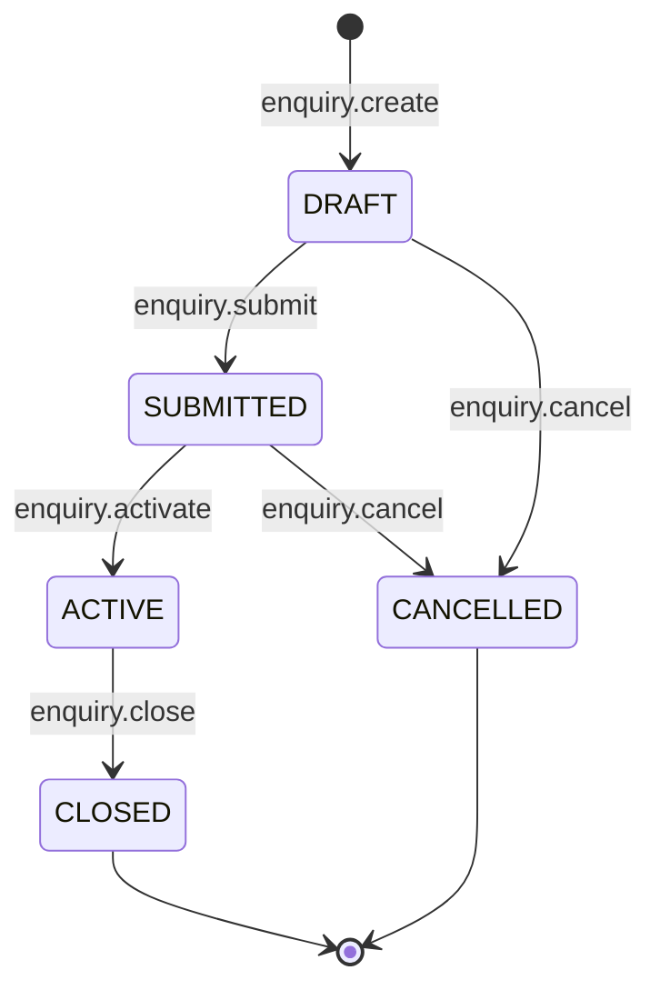
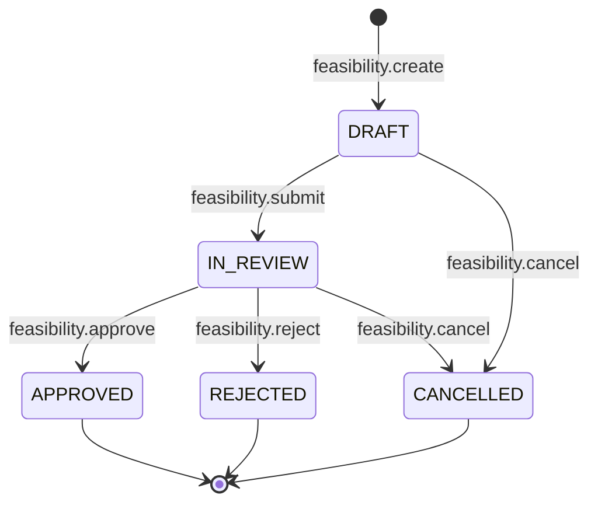
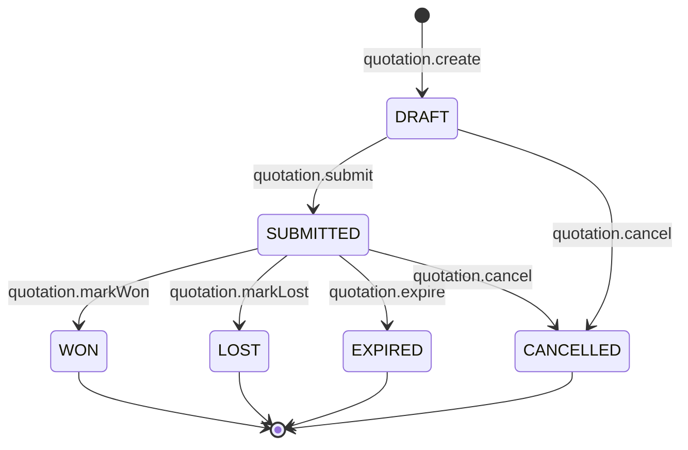
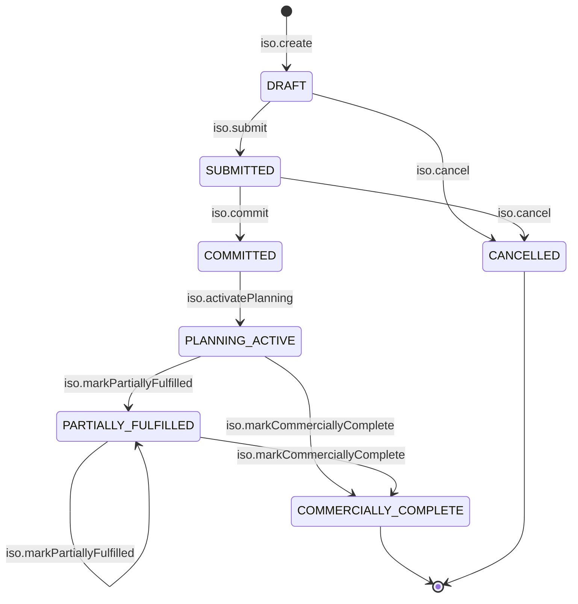

# Commercial Workflow State Machine

| Field | Value |
|-------|-------|
| **Document ID** | FT-PD-042 |
| **Volume** | 4 — Workflow Engine |
| **Chapter** | 3 — Commercial Workflow State Machine |
| **Title** | Commercial Workflow State Machine |
| **Version** | 1.0.0 |
| **Status** | Draft — Architecture Review |
| **Effective date** | 2026-05-29 |
| **Author** | FT ERP Product Team |
| **Owner** | FT ERP Product Architecture |
| **Audience** | Workflow engineers, backend leads, domain authors |
| **Classification** | Product — Workflow Engine Contract |

**Parent documents:**

- [Chapter 1 — Workflow Engine Overview & Pending Actions Contract](./Chapter_01_Workflow_Engine_Overview_and_Pending_Actions_Contract.md)
- [Chapter 2 — Transition Guards & Cross-Domain Dependency Catalog](./Chapter_02_Transition_Guards_and_Cross_Domain_Dependency_Catalog.md)
- [Volume 3, Chapter 1 — Commercial Domain Specification](../03_Domain_Specifications/Chapter_01_Commercial_Domain_Specification.md)
- [Volume 2, Chapter 6 — Commercial Document Chain](../02_Business_Architecture/Chapter_06_Commercial_Document_Chain.md)

---

## 1. Document Control

| Version | Date | Author | Summary |
|---------|------|--------|---------|
| 1.0.0 | 2026-05-29 | FT ERP Product Team | Initial Commercial domain State Machines and transition tables |

**Supersedes:** None.

**Change authority:** Product Architecture. State or transition changes require Volume 3 Ch. 1 alignment; new Guards reference [FT-PD-041](./Chapter_02_Transition_Guards_and_Cross_Domain_Dependency_Catalog.md) only.

**Out of scope:** Guard semantics (FT-PD-041), database, API, UI.

---

## 2. Purpose

This chapter defines the **executable workflow State Machines** for the **Commercial domain**: Enquiry, Feasibility, Quotation, and Internal Sales Order.

It **implements** [Volume 3, Chapter 1](../03_Domain_Specifications/Chapter_01_Commercial_Domain_Specification.md) using the Workflow Engine contracts in [Chapters 1–2](./Chapter_01_Workflow_Engine_Overview_and_Pending_Actions_Contract.md).

Guard **definitions** are not repeated—only **Guard IDs** and **execution order** per transition.

---

## 3. Scope

### 3.1 In scope

- State Machines for four commercial document types
- Transition tables: action, guards, next state, Pending Actions, audit events
- Pending Action materialization and resolution rules
- Mermaid state diagrams

### 3.2 Out of scope

- Customer PO reference field (no workflow state; metadata edit only)
- Planning, procurement, manufacturing transitions (Volume 4 Ch. 4+)
- Guard implementation and `reasonCode` text (FT-PD-041)
- Sales Bill / Commercial Completion detail ([Volume 3, Ch. 6](../03_Domain_Specifications/Chapter_06_Dispatch_and_Billing_Domain_Specification.md))

### 3.3 Actor role

All commercial transitions: **`Admin`** (commercial) unless noted as **engine** (scheduled/system).

---

## 4. Relationship with Previous Volumes

| Volume | Relationship |
|--------|--------------|
| **Vol. 2, Ch. 6** | Commercial chain architecture; Business Model at Enquiry; ISO planning handoff |
| **Vol. 3, Ch. 1** | Authoritative states, Pending Action IDs (`COMPL_*`), CDS rules |
| **Vol. 4, Ch. 1** | Engine contract, Pending Actions schema, audit requirement |
| **Vol. 4, Ch. 2** | Guard Registry (`GRD_COM_*`, `GRD_XDM_*`) referenced by ID |

**Customer PO:** Field update on ISO — **no transition**; optional policy warn only ([Vol. 3 Ch. 1](../03_Domain_Specifications/Chapter_01_Commercial_Domain_Specification.md) CDS-14).

---

## 5. State Machines

### 5.1 Enquiry

| Attribute | Value |
|-----------|-------|
| **Document type** | `enquiry` |
| **Initial state** | `DRAFT` |
| **Terminal states** | `CLOSED`, `CANCELLED` |
| **Primary owner** | Admin |
| **Business Model** | Selected on `enquiry.submit`; immutable after |

**States:** `DRAFT` · `SUBMITTED` · `ACTIVE` · `CLOSED` · `CANCELLED`

**Key transitions:** submit → activate → (child docs) → close \| cancel

**Pending Actions:** `COMPL_ENQ_DRAFT`, `COMPL_ENQ_FEAS`

**Cross-doc:** `feasibility.create` requires Enquiry `ACTIVE` (or `SUBMITTED` per policy—standard: `ACTIVE` only)

---

### 5.2 Feasibility

| Attribute | Value |
|-----------|-------|
| **Document type** | `feasibility` |
| **Initial state** | `DRAFT` (on create) |
| **Terminal states** | `APPROVED`, `REJECTED`, `CANCELLED` |
| **Parent** | Enquiry (inherits Business Model) |

**States:** `DRAFT` · `IN_REVIEW` · `APPROVED` · `REJECTED` · `CANCELLED`

**Pending Actions:** `COMPL_FEZ_REVIEW`, `COMPL_FEZ_QUOTE`

---

### 5.3 Quotation

| Attribute | Value |
|-----------|-------|
| **Document type** | `quotation` |
| **Initial state** | `DRAFT` |
| **Terminal states** | `WON`, `LOST`, `EXPIRED`, `CANCELLED` |
| **Parent** | Feasibility `APPROVED` (or conditional) |

**States:** `DRAFT` · `SUBMITTED` · `WON` · `LOST` · `EXPIRED` · `CANCELLED`

**Pending Actions:** `COMPL_QUO_SEND`, `COMPL_QUO_FOLLOWUP`, `COMPL_QUO_CONVERT`, `COMPL_QUO_EXPIRED`

**Engine transition:** `quotation.expire` on validity date while `SUBMITTED`

---

### 5.4 Internal Sales Order

| Attribute | Value |
|-----------|-------|
| **Document type** | `internalSalesOrder` |
| **Initial state** | `DRAFT` (on convert from Quotation `WON`) |
| **Terminal states** | `COMMERCIALLY_COMPLETE`, `CANCELLED` |
| **Planning gate** | `COMMITTED` minimum for Planning domain ([GRD_XDM_ISO_COMMITTED](./Chapter_02_Transition_Guards_and_Cross_Domain_Dependency_Catalog.md)) |

**States:** `DRAFT` · `SUBMITTED` · `COMMITTED` · `PLANNING_ACTIVE` · `PARTIALLY_FULFILLED` · `COMMERCIALLY_COMPLETE` · `CANCELLED`

**Pending Actions:** `COMPL_ISO_COMMIT`, `COMPL_ISO_CPO` (optional), `COMPL_ISO_REV`

**Fulfillment transitions:** `PARTIALLY_FULFILLED` and `COMMERCIALLY_COMPLETE` driven by Dispatch & Billing domain events (Volume 4 Ch. 8).

---

## 6. Transition Tables

Guard order is **top-to-bottom**. First failure stops transition ([FT-PD-041](./Chapter_02_Transition_Guards_and_Cross_Domain_Dependency_Catalog.md) GRD-04).

### 6.1 Enquiry transitions

| Current state | User action | Guard IDs (order) | Next state | Pending Action | Audit event |
|---------------|-------------|-------------------|------------|----------------|-------------|
| — | `enquiry.create` | — | `DRAFT` | `COMPL_ENQ_DRAFT` | `Created` |
| `DRAFT` | `enquiry.submit` | `GRD_COM_CUSTOMER_REQUIRED`, `GRD_COM_BM_REQUIRED` | `SUBMITTED` | — (resolves `COMPL_ENQ_DRAFT`) | `Submitted` |
| `SUBMITTED` | `enquiry.activate` | — | `ACTIVE` | `COMPL_ENQ_FEAS` | `Activated` |
| `ACTIVE` | `enquiry.close` | — | `CLOSED` | — (resolves commercial queue) | `Completed` |
| `DRAFT` | `enquiry.cancel` | — | `CANCELLED` | — | `Cancelled` |
| `SUBMITTED` | `enquiry.cancel` | — | `CANCELLED` | — | `Cancelled` |

**Child create (no Enquiry state change):**

| Current state | User action | Guard IDs | Effect | Pending Action | Audit event |
|---------------|-------------|-----------|--------|----------------|-------------|
| `ACTIVE` | `feasibility.create` | `GRD_COM_PARENT_ACTIVE`, `GRD_COM_BM_ANCESTRY` | Creates Feasibility `DRAFT` | Resolves `COMPL_ENQ_FEAS` when created | `Created` (on child) |

---

### 6.2 Feasibility transitions

| Current state | User action | Guard IDs (order) | Next state | Pending Action | Audit event |
|---------------|-------------|-------------------|------------|----------------|-------------|
| — | `feasibility.create` | `GRD_COM_PARENT_ACTIVE`, `GRD_COM_BM_ANCESTRY` | `DRAFT` | — | `Created` |
| `DRAFT` | `feasibility.submit` | `GRD_COM_FEZ_BOM_RECORDED` | `IN_REVIEW` | `COMPL_FEZ_REVIEW` | `Submitted` |
| `IN_REVIEW` | `feasibility.approve` | — | `APPROVED` | `COMPL_FEZ_QUOTE` (resolves `COMPL_FEZ_REVIEW`) | `Approved` |
| `IN_REVIEW` | `feasibility.reject` | — | `REJECTED` | — (resolves `COMPL_FEZ_REVIEW`) | `Rejected` |
| `DRAFT` | `feasibility.cancel` | — | `CANCELLED` | — | `Cancelled` |
| `IN_REVIEW` | `feasibility.cancel` | — | `CANCELLED` | — | `Cancelled` |

**Child create:**

| Current state | User action | Guard IDs | Effect | Pending Action | Audit event |
|---------------|-------------|-----------|--------|----------------|-------------|
| `APPROVED` | `quotation.create` | `GRD_COM_FEZ_APPROVED`, `GRD_COM_BM_ANCESTRY` | Creates Quotation `DRAFT` | `COMPL_QUO_SEND` | `Created` (on child) |

---

### 6.3 Quotation transitions

| Current state | User action | Guard IDs (order) | Next state | Pending Action | Audit event |
|---------------|-------------|-------------------|------------|----------------|-------------|
| — | `quotation.create` | `GRD_COM_FEZ_APPROVED`, `GRD_COM_BM_ANCESTRY` | `DRAFT` | `COMPL_QUO_SEND` | `Created` |
| `DRAFT` | `quotation.submit` | `GRD_COM_QUO_VALIDITY`, `GRD_COM_REGULAR_LINE_QTY` | `SUBMITTED` | `COMPL_QUO_FOLLOWUP` (resolves `COMPL_QUO_SEND`) | `Submitted` |
| `SUBMITTED` | `quotation.markWon` | — | `WON` | `COMPL_QUO_CONVERT` (resolves `COMPL_QUO_FOLLOWUP`) | `Completed` |
| `SUBMITTED` | `quotation.markLost` | — | `LOST` | — (resolves `COMPL_QUO_FOLLOWUP`) | `Rejected` |
| `SUBMITTED` | `quotation.expire` (engine) | — | `EXPIRED` | `COMPL_QUO_EXPIRED` | `Completed` |
| `DRAFT` | `quotation.cancel` | — | `CANCELLED` | — | `Cancelled` |
| `SUBMITTED` | `quotation.cancel` | — | `CANCELLED` | — | `Cancelled` |

**Child create:**

| Current state | User action | Guard IDs | Effect | Pending Action | Audit event |
|---------------|-------------|-----------|--------|----------------|-------------|
| `WON` | `iso.create` | `GRD_COM_QUO_WON`, `GRD_COM_QUO_NOT_EXPIRED`, `GRD_COM_BM_ANCESTRY`, `GRD_COM_DUPLICATE_ISO` | Creates ISO `DRAFT` | — (resolves `COMPL_QUO_CONVERT`) | `Created` (on child) |

---

### 6.4 Internal Sales Order transitions

| Current state | User action | Guard IDs (order) | Next state | Pending Action | Audit event |
|---------------|-------------|-------------------|------------|----------------|-------------|
| — | `iso.create` | `GRD_COM_QUO_WON`, `GRD_COM_QUO_NOT_EXPIRED`, `GRD_COM_BM_ANCESTRY`, `GRD_COM_DUPLICATE_ISO` | `DRAFT` | — | `Created` |
| `DRAFT` | `iso.submit` | `GRD_COM_REGULAR_LINE_QTY` | `SUBMITTED` | `COMPL_ISO_COMMIT` | `Submitted` |
| `SUBMITTED` | `iso.commit` | — | `COMMITTED` | `COMPL_ISO_CPO` (optional policy; resolves `COMPL_ISO_COMMIT`) | `Approved` |
| `COMMITTED` | `iso.activatePlanning` | — | `PLANNING_ACTIVE` | — | `Activated` |
| `PLANNING_ACTIVE` | `iso.markPartiallyFulfilled` (engine) | — | `PARTIALLY_FULFILLED` | — | `Completed` |
| `PARTIALLY_FULFILLED` | `iso.markPartiallyFulfilled` (engine) | — | `PARTIALLY_FULFILLED` | — | `Completed` |
| `PLANNING_ACTIVE` / `PARTIALLY_FULFILLED` | `iso.markCommerciallyComplete` (engine) | `GRD_BL_COMPLETE_POLICY` | `COMMERCIALLY_COMPLETE` | — | `Completed` |
| `DRAFT` | `iso.cancel` | — | `CANCELLED` | — | `Cancelled` |
| `SUBMITTED` | `iso.cancel` | — | `CANCELLED` | — | `Cancelled` |

**Metadata (no transition):**

| Current state | User action | Guard IDs | Effect | Audit event |
|---------------|-------------|-----------|--------|-------------|
| `COMMITTED`+ | `iso.updateCustomerPoRef` | — (optional warn policy) | Field only | — |

**Commercial revision (post-planning):**

| Current state | User action | Guard IDs | Next state | Pending Action | Audit event |
|---------------|-------------|-----------|------------|----------------|-------------|
| `PLANNING_ACTIVE`+ | `iso.requestRevision` | — | unchanged | `COMPL_ISO_REV` | `Submitted` |
| `PLANNING_ACTIVE`+ | `iso.approveRevision` | `GRD_COM_REVISION_REQUIRED` | unchanged | — (resolves `COMPL_ISO_REV`) | `Approved` |

**Line edit guard:** `iso.update` while `PLANNING_ACTIVE`+ requires `GRD_COM_REVISION_REQUIRED` unless revision workflow approved.

---

## 7. Pending Action Materialization

### 7.1 Creation triggers

| Trigger | Commercial Pending Actions |
|---------|---------------------------|
| Document enters state | See §6 transition tables |
| Child document missing | `COMPL_ENQ_FEAS`, `COMPL_FEZ_QUOTE`, `COMPL_QUO_CONVERT` |
| Engine schedule | `COMPL_QUO_EXPIRED` on quotation validity |
| Optional policy | `COMPL_ISO_CPO` when ISO `COMMITTED` and ref empty |
| Revision request | `COMPL_ISO_REV` |

### 7.2 Resolution

Pending Action **resolves** when trigger condition false:

| Action ID | Resolves when |
|-----------|---------------|
| `COMPL_ENQ_DRAFT` | Enquiry ≠ `DRAFT` |
| `COMPL_ENQ_FEAS` | Feasibility exists or Enquiry closed |
| `COMPL_FEZ_REVIEW` | Feasibility ≠ `IN_REVIEW` |
| `COMPL_FEZ_QUOTE` | Quotation exists or Feasibility not `APPROVED` |
| `COMPL_QUO_SEND` | Quotation ≠ `DRAFT` |
| `COMPL_QUO_FOLLOWUP` | Quotation ∉ `{SUBMITTED}` |
| `COMPL_QUO_CONVERT` | ISO exists or Quotation ≠ `WON` |
| `COMPL_ISO_COMMIT` | ISO ∉ `{DRAFT, SUBMITTED}` |
| `COMPL_ISO_CPO` | Customer PO ref populated or policy off |
| `COMPL_ISO_REV` | Revision approved/cancelled |
| `COMPL_QUO_EXPIRED` | Quotation renewed or Enquiry closed |

### 7.3 Escalation

Per [Chapter 1](./Chapter_01_Workflow_Engine_Overview_and_Pending_Actions_Contract.md) §7.7:

| Action ID | SLA hint | Escalation |
|-----------|----------|------------|
| `COMPL_FEZ_REVIEW` | 2 business days | Priority → `HIGH` |
| `COMPL_QUO_FOLLOWUP` | Validity − 3 days | Priority → `HIGH` |
| `COMPL_ISO_COMMIT` | 1 business day | Control Tower risk flag |

### 7.4 Owner changes

All commercial Pending Actions: **`ownerRole = Admin`**. No handoff within commercial chain except ISO `COMMITTED` enables **Planning** domain actions (Store)—commercial actions remain Admin.

### 7.5 ISO commit → Planning

On `iso.commit` → `COMMITTED`:

- Satisfies `GRD_XDM_ISO_COMMITTED` for Planning transitions
- Materializes Planning domain Pending Actions (Volume 4 Ch. 4)—not commercial `COMPL_*`
- `iso.activatePlanning` → `PLANNING_ACTIVE` on first Store planning document create **or** explicit ack (implementation choice; default: **first planning doc create**)

---

## 8. Audit Events

Every successful transition emits **exactly one** primary audit event ([WFE-06](./Chapter_01_Workflow_Engine_Overview_and_Pending_Actions_Contract.md)):

| Audit event | Used on transitions |
|-------------|---------------------|
| `Created` | `*.create` |
| `Submitted` | `*.submit`, `iso.requestRevision` |
| `Activated` | `enquiry.activate`, `iso.activatePlanning` |
| `Approved` | `feasibility.approve`, `iso.commit`, `iso.approveRevision` |
| `Rejected` | `feasibility.reject`, `quotation.markLost` |
| `Completed` | `enquiry.close`, `quotation.markWon`, `quotation.expire`, fulfillment marks |
| `Cancelled` | `*.cancel` |

Audit record includes: `documentType`, `documentId`, `priorState`, `newState`, `action`, `actorId`, `actorRole`, `timestamp`, `correlationId` (parent Enquiry root).

Guard failures emit **`GuardBlocked`** audit with `guardId` + `reasonCode`—no state change.

---

## 9. Business Rules

| ID | Rule |
|----|------|
| **CWF-01** | **No skipped states** — only transitions defined in §6 permitted. |
| **CWF-02** | **No direct bypass** — e.g. `DRAFT` → `WON` on Quotation prohibited. |
| **CWF-03** | **Guards execute before transition** per ordered list. |
| **CWF-04** | **Failed Guards leave state unchanged.** |
| **CWF-05** | **Every successful transition emits exactly one** primary audit event. |
| **CWF-06** | **Business Model** set on `enquiry.submit` only; `GRD_COM_BM_IMMUTABLE` on later edits. |
| **CWF-07** | **Child documents** inherit Enquiry Business Model via `GRD_COM_BM_ANCESTRY`. |
| **CWF-08** | **ISO `COMMITTED`** required before Planning domain transitions. |
| **CWF-09** | **Customer PO ref** update does not emit workflow transition audit. |
| **CWF-10** | **Quotation `EXPIRED`** only from engine scheduler on `SUBMITTED`. |
| **CWF-11** | **Terminal states** reject all actions except read-only. |

---

## 10. State Machine Diagrams

### 10.1 Enquiry

### 10.2 Feasibility

### 10.3 Quotation

### 10.4 Internal Sales Order

---

## 11. Review Checklist

- [ ] Implements Volume 3 Ch. 1 states without redefining semantics
- [ ] Guard IDs reference FT-PD-041 only—no duplicate validation logic
- [ ] All §6 transitions have Guards, next state, PA, audit event
- [ ] Pending Action materialization §7 aligns with `COMPL_*` catalog
- [ ] ISO planning handoff and fulfillment engine transitions documented
- [ ] Customer PO excluded from State Machine
- [ ] CWF Business Rules
- [ ] Four Mermaid diagrams
- [ ] No database, API, UI implementation

---

## 12. Change Log

| Version | Date | Author | Summary |
|---------|------|--------|---------|
| 1.0.0 | 2026-05-29 | FT ERP Product Team | Initial Commercial Workflow State Machine |

---

## 13. Approval Block

| Role | Name | Signature | Date |
|------|------|-----------|------|
| Product Owner | | | |
| Product Architecture | | | |
| Workflow Engineering Lead | | | |
| Admin / Commercial Process Owner | | | |

---

## Document navigation

| | Link |
|--|------|
| **Previous** | [Transition Guards & Cross-Domain Dependency Catalog](./Chapter_02_Transition_Guards_and_Cross_Domain_Dependency_Catalog.md) (FT-PD-041) |
| **Next** | [Planning Workflow State Machine](./Chapter_04_Planning_Workflow_State_Machine.md) (FT-PD-043) |
| **Volume** | [Workflow Engine](./README.md) |
| **Product** | [Product Documentation Index](../README.md) |

