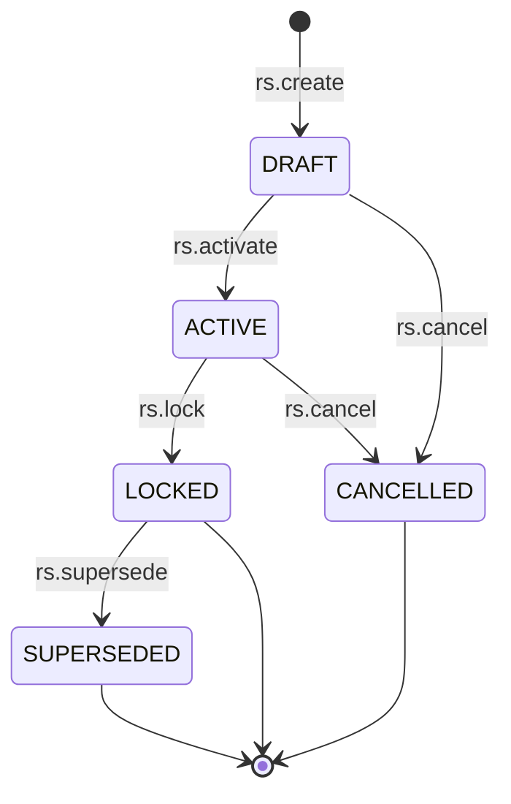
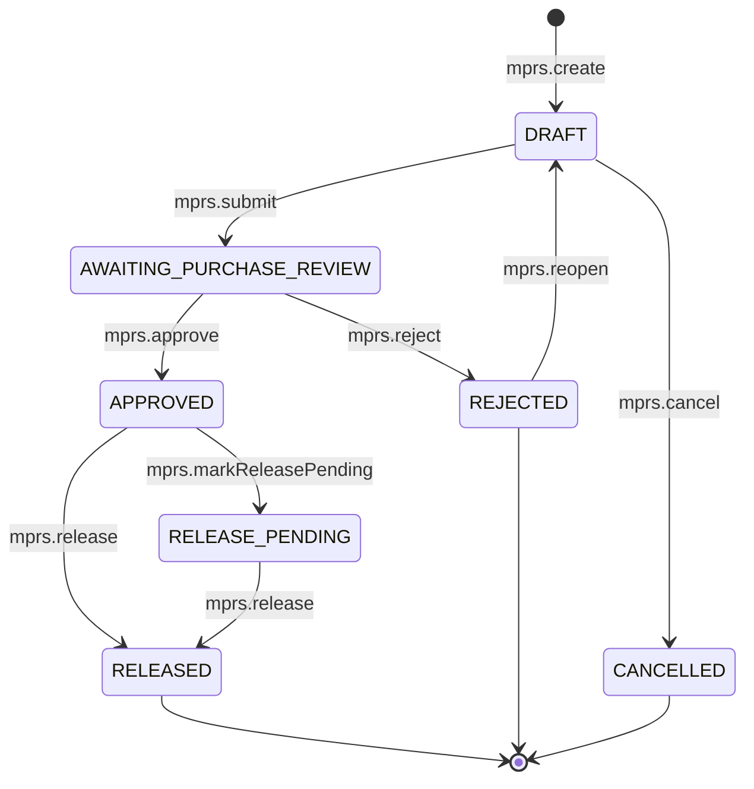
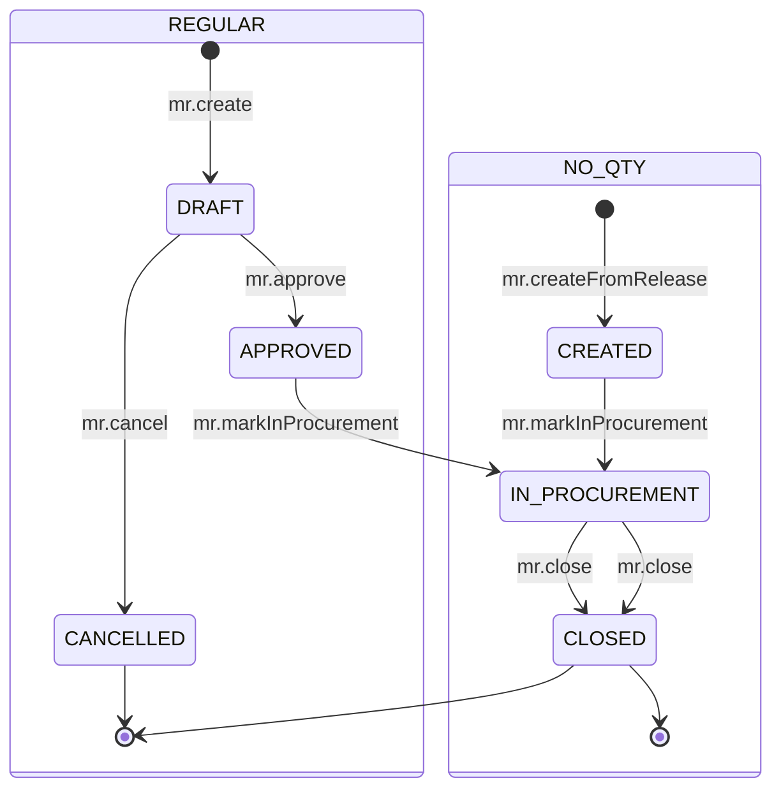
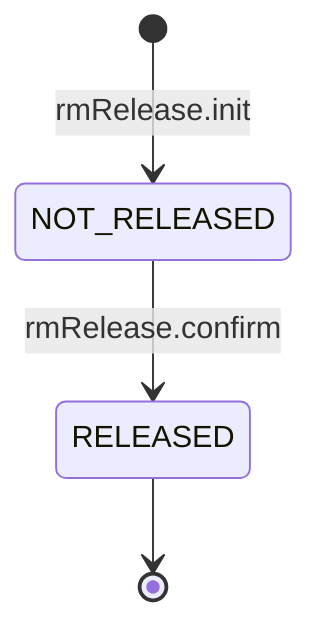
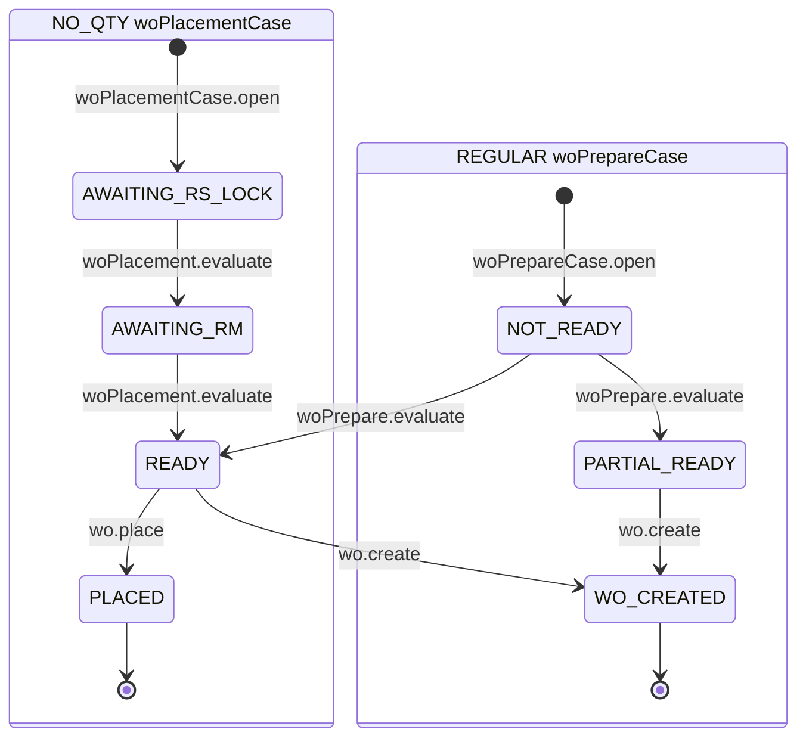
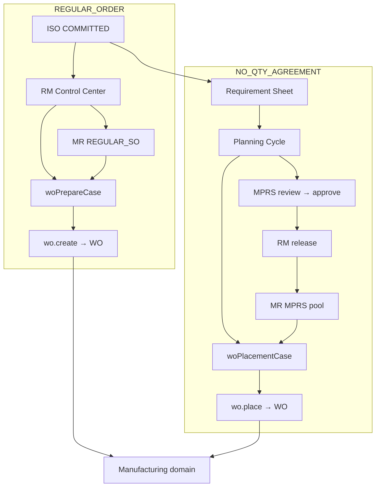

# Planning Workflow State Machine

| Field | Value |
|-------|-------|
| **Document ID** | FT-PD-043 |
| **Volume** | 4 — Workflow Engine |
| **Chapter** | 4 — Planning Workflow State Machine |
| **Title** | Planning Workflow State Machine |
| **Version** | 1.0.0 |
| **Status** | Draft — Architecture Review |
| **Effective date** | 2026-05-29 |
| **Author** | FT ERP Product Team |
| **Owner** | FT ERP Product Architecture |
| **Audience** | Workflow engineers, backend leads, Store/Purchase process owners |
| **Classification** | Product — Workflow Engine Contract |

**Parent documents:**

- [Chapter 1 — Workflow Engine Overview & Pending Actions Contract](./Chapter_01_Workflow_Engine_Overview_and_Pending_Actions_Contract.md)
- [Chapter 2 — Transition Guards & Cross-Domain Dependency Catalog](./Chapter_02_Transition_Guards_and_Cross_Domain_Dependency_Catalog.md)
- [Chapter 3 — Commercial Workflow State Machine](./Chapter_03_Commercial_Workflow_State_Machine.md)
- [Volume 3, Chapter 2 — Planning Domain Specification](../03_Domain_Specifications/Chapter_02_Planning_Domain_Specification.md)
- [Volume 2, Chapter 2 — REGULAR Order Planning Pipeline](../02_Business_Architecture/Chapter_02_REGULAR_Order_Planning_Pipeline.md)
- [Volume 2, Chapter 3 — NO_QTY Agreement Planning Pipeline](../02_Business_Architecture/Chapter_03_NO_QTY_Agreement_Planning_Pipeline.md)

---

## 1. Document Control

| Version | Date | Author | Summary |
|---------|------|--------|---------|
| 1.0.0 | 2026-05-29 | FT ERP Product Team | Initial Planning domain State Machines and transition tables |

**Supersedes:** None.

**Change authority:** Product Architecture. State or transition changes require Volume 3 Ch. 2 alignment; new Guards reference [FT-PD-041](./Chapter_02_Transition_Guards_and_Cross_Domain_Dependency_Catalog.md) only.

**Out of scope:** Guard semantics (FT-PD-041), database, API, UI, Procurement/Manufacturing document transitions (Volume 4 Ch. 5–6).

---

## 2. Purpose

This chapter defines the **executable workflow State Machines** for the **Planning domain**: Requirement Sheet, Planning Cycle, Monthly Production Planning Sheet (MPRS), Material Requirement, RM Release, and Work Order Preparation.

It **implements** [Volume 3, Chapter 2](../03_Domain_Specifications/Chapter_02_Planning_Domain_Specification.md) using the Workflow Engine contracts in [Chapters 1–2](./Chapter_01_Workflow_Engine_Overview_and_Pending_Actions_Contract.md).

Guard **definitions** are not repeated—only **Guard IDs** and **execution order** per transition.

---

## 3. Scope

### 3.1 In scope

- Six planning workflow artifacts (§5)
- Transition tables with ordered Guard IDs, Pending Actions, audit events
- REGULAR vs NO_QTY transition subsets (§7)
- Pending Action materialization for Store, Purchase, and Admin visibility
- Mermaid state diagrams and overall planning flow

### 3.2 Out of scope

- PR, PO, GRN transitions ([Volume 4, Ch. 5](./README.md) — planned)
- Work Order execution, PMR, issue, production ([Volume 4, Ch. 6](./README.md) — planned)
- Guard implementation and `reasonCode` text (FT-PD-041)
- Planning logic formulas (Green Level, carry forward) — behavior only via transition side effects named, not redefined

### 3.3 Actor roles

| Role | Planning transitions |
|------|---------------------|
| **Store** | RS, Planning Cycle, MPRS draft/submit/release, REGULAR MR, WO prepare/place |
| **Purchase** | MPRS review, approve, reject |
| **Engine** | Readiness refresh, MR procurement stage signals, ISO planning activation |
| **Admin** | Visibility only (`PLN_ISO_HANDOFF`); no standard planning writes |

---

## 4. Relationship with Previous Volumes

| Volume | Relationship |
|--------|--------------|
| **Vol. 2, Ch. 2** | REGULAR pipeline — RM Control Center, REGULAR_SO MR, WO prepare terminus |
| **Vol. 2, Ch. 3** | NO_QTY pipeline — RS, MPRS, RM release, WO placement; pool firewall |
| **Vol. 3, Ch. 2** | Authoritative states, `PLN_*` Pending Actions, PLN Business Rules |
| **Vol. 4, Ch. 1** | Engine contract, audit requirement, Pending Actions schema |
| **Vol. 4, Ch. 2** | Guard Registry (`GRD_PLN_*`, `GRD_XDM_*`) referenced by ID |
| **Vol. 4, Ch. 3** | ISO `COMMITTED` / `PLANNING_ACTIVE`; `iso.activatePlanning` on first planning doc |

**Planning entry gate:** All planning document creates require ISO ≥ `COMMITTED` ([`GRD_XDM_ISO_COMMITTED`](./Chapter_02_Transition_Guards_and_Cross_Domain_Dependency_Catalog.md)).

**Planning terminus:** `wo.create` success creates Manufacturing Work Order and completes Planning workflow for placed quantity ([PLN-08](../03_Domain_Specifications/Chapter_02_Planning_Domain_Specification.md)).

---

## 5. State Machines

### 5.1 Requirement Sheet (RS)

*NO_QTY Agreement only.*

| Attribute | Value |
|-----------|-------|
| **Document type** | `requirementSheet` |
| **Initial state** | `DRAFT` |
| **Terminal states** | `LOCKED` (active placement), `SUPERSEDED`, `CANCELLED` |
| **Primary owner** | Store |
| **Parent** | Internal Sales Order (NO_QTY, ≥ `COMMITTED`) |

**States:** `DRAFT` · `ACTIVE` · `LOCKED` · `SUPERSEDED` · `CANCELLED`

**Entry:** `rs.create` after ISO commit; triggers `iso.activatePlanning` if first planning document ([Ch. 3](./Chapter_03_Commercial_Workflow_State_Machine.md) §7.5).

**Exit to placement:** `rs.lock` → `LOCKED` enables NO_QTY WO placement.

**Pending Actions:** `PLN_RS_LOCK`, `PLN_RS_CONTINUE` (post-cycle)

**Side effect on lock:** Planning Cycle `planningCycle.lock` (§5.2).

---

### 5.2 Planning Cycle

*NO_QTY — logical period bound to RS version.*

| Attribute | Value |
|-----------|-------|
| **Document type** | `planningCycle` |
| **Initial state** | `OPEN` |
| **Terminal state** | `CLOSED` |
| **Primary owner** | Store |
| **Parent** | Requirement Sheet |

**States:** `OPEN` · `LOCKED` · `IN_EXECUTION` · `CLOSED`

**Entry:** `planningCycle.open` on `rs.create`.

**Exit:** `planningCycle.close` after dispatch threshold or manual cycle complete.

**Pending Actions:** None dedicated — surfaced via RS/MPRS queues.

---

### 5.3 Monthly Production Planning Sheet (MPRS)

*NO_QTY — period FG plan and procurement freeze.*

| Attribute | Value |
|-----------|-------|
| **Document type** | `monthlyProductionPlan` |
| **Initial state** | `DRAFT` |
| **Terminal states** | `RELEASED`, `REJECTED`, `CANCELLED` |
| **Owners** | Store (draft/submit/release); Purchase (review/approve/reject) |
| **planKind** | `INITIAL` \| `ADDITIONAL` |

**States:** `DRAFT` · `AWAITING_PURCHASE_REVIEW` · `APPROVED` · `REJECTED` · `RELEASE_PENDING` (optional) · `RELEASED` · `CANCELLED`

**Planning freeze:** On `mprs.approve` → `APPROVED` — FG plan and **Monthly Planning RM Snapshot** immutable ([PLN-04](../03_Domain_Specifications/Chapter_02_Planning_Domain_Specification.md)).

**Pending Actions:** `PLN_MPRS_DRAFT`, `PLN_MPRS_SUBMIT`, `PLN_MPRS_REVIEW`, `PLN_MPRS_APPROVE`, `PLN_MPRS_RELEASE`

**Additional Plan:** `mprs.additional.create` — separate document instance; same State Machine; does not mutate Initial Plan history ([PLN-05](../03_Domain_Specifications/Chapter_02_Planning_Domain_Specification.md)).

---

### 5.4 Material Requirement (MR)

*Both models — **source pool differs**.*

| Attribute | REGULAR | NO_QTY |
|-----------|---------|--------|
| **Document type** | `materialRequirement` | `materialRequirement` |
| **Initial state** | `DRAFT` | `CREATED` (on RM release) |
| **Terminal states** | `CLOSED`, `CANCELLED` | `CLOSED` |
| **Source pool** | `REGULAR_SO` | `MPRS` (`MONTHLY_PLAN`) |
| **Owner** | Store | Store (context); Purchase at PR stage |

**REGULAR states:** `DRAFT` · `APPROVED` · `IN_PROCUREMENT` · `CLOSED` · `CANCELLED`

**NO_QTY states:** `CREATED` · `IN_PROCUREMENT` · `CLOSED`

**Pending Actions:** `PLN_MR_REGULAR`, `PLN_MR_PR` (REGULAR Store); `PLN_MPRS_PR` (NO_QTY Purchase after release)

**Pool firewall:** [`GRD_PLN_POOL_REGULAR`](./Chapter_02_Transition_Guards_and_Cross_Domain_Dependency_Catalog.md), [`GRD_PLN_POOL_MPRS`](./Chapter_02_Transition_Guards_and_Cross_Domain_Dependency_Catalog.md) — [PLN-07](../03_Domain_Specifications/Chapter_02_Planning_Domain_Specification.md).

---

### 5.5 RM Release

*NO_QTY — explicit handoff stage on approved MPRS.*

| Attribute | Value |
|-----------|-------|
| **Document type** | `rmRelease` (logical stage; 1:1 with MPRS revision) |
| **Initial state** | `NOT_RELEASED` |
| **Terminal state** | `RELEASED` |
| **Primary owner** | Store |
| **Parent** | Monthly Production Plan (`APPROVED`) |

**States:** `NOT_RELEASED` · `RELEASED`

**Transition:** `rmRelease.confirm` — alias of `mprs.release` engine action.

**Outputs:** MPRS → `RELEASED`; MR document(s) `CREATED` in MPRS pool; `releasedAt` timestamp.

**Rule:** [`GRD_PLN_RELEASE_NOT_WO`](./Chapter_02_Transition_Guards_and_Cross_Domain_Dependency_Catalog.md) — **never** creates Work Order on same action ([PLN-06](../03_Domain_Specifications/Chapter_02_Planning_Domain_Specification.md)).

*REGULAR:* No RM Release artifact — MR raised directly from order shortage.

---

### 5.6 Work Order Preparation

*REGULAR: readiness case · NO_QTY: placement case.*

| Attribute | REGULAR | NO_QTY |
|-----------|---------|--------|
| **Document type** | `woPrepareCase` | `woPlacementCase` |
| **Keyed by** | Internal Sales Order | Requirement Sheet (locked) |
| **Initial state** | `NOT_READY` | `AWAITING_RS_LOCK` |
| **Terminal state** | `WO_CREATED` | `PLACED` |
| **Primary owner** | Store | Store |

**REGULAR states:** `NOT_READY` · `READY` · `PARTIAL_READY` · `WO_CREATED`

**NO_QTY states:** `AWAITING_RS_LOCK` · `AWAITING_RM` · `READY` · `PLACED`

**Transition:** `wo.create` — creates Manufacturing `workOrder` document; consumes RS balance (NO_QTY) or ISO preparable balance (REGULAR).

**Pending Actions:** `PLN_WO_PREPARE` (REGULAR), `PLN_WO_PLACE` (NO_QTY)

**Side effect:** First `wo.create` on cycle → `planningCycle.markInExecution` → `IN_EXECUTION`.

**Planning terminus:** Case reaches terminal state; Manufacturing domain owns WO thereafter.

---

## 6. Transition Tables

Guard order is **top-to-bottom**. First failure stops transition ([FT-PD-041](./Chapter_02_Transition_Guards_and_Cross_Domain_Dependency_Catalog.md) GRD-04).

### 6.1 Requirement Sheet transitions

| Current state | User action | Guard IDs (order) | Next state | Pending Action | Audit event |
|---------------|-------------|-------------------|------------|----------------|-------------|
| — | `rs.create` | `GRD_XDM_ISO_COMMITTED`, `GRD_PLN_BM_REGULAR_CTX`, `GRD_COM_BM_ANCESTRY` | `DRAFT` | `PLN_RS_LOCK` (when lines complete → promote) | `Created` |
| `DRAFT` | `rs.activate` | — | `ACTIVE` | `PLN_RS_LOCK` | `Activated` |
| `ACTIVE` | `rs.lock` | `GRD_PLN_BOM_APPROVED` | `LOCKED` | — (resolves `PLN_RS_LOCK`; enables `PLN_WO_PLACE`) | `Approved` |
| `LOCKED` | `rs.supersede` | — | `SUPERSEDED` | — | `Completed` |
| `DRAFT` | `rs.cancel` | — | `CANCELLED` | — | `Cancelled` |
| `ACTIVE` | `rs.cancel` | — | `CANCELLED` | — | `Cancelled` |

**Child create (no RS state change):**

| Current state | User action | Guard IDs | Effect | Pending Action | Audit event |
|---------------|-------------|-----------|--------|----------------|-------------|
| `ACTIVE` / `LOCKED` | `carryForward.save` | `GRD_PLN_CARRY_FORWARD` | Line metadata update | — | `Submitted` |

**Side effect on `rs.create`:** Creates Planning Cycle `OPEN` via `planningCycle.open`. May trigger `iso.activatePlanning` on parent ISO.

**Side effect on `rs.lock`:** `planningCycle.lock` on bound cycle.

---

### 6.2 Planning Cycle transitions

| Current state | User action | Guard IDs (order) | Next state | Pending Action | Audit event |
|---------------|-------------|-------------------|------------|----------------|-------------|
| — | `planningCycle.open` | `GRD_XDM_ISO_COMMITTED`, `GRD_PLN_BM_REGULAR_CTX` | `OPEN` | — | `Created` |
| `OPEN` | `planningCycle.lock` | — (invoked with `rs.lock`) | `LOCKED` | — | `Approved` |
| `LOCKED` | `planningCycle.markInExecution` | — (engine; first `wo.create` on cycle) | `IN_EXECUTION` | — | `Activated` |
| `IN_EXECUTION` | `planningCycle.close` | — | `CLOSED` | `PLN_RS_CONTINUE` | `Completed` |
| `LOCKED` | `planningCycle.close` | — | `CLOSED` | `PLN_RS_CONTINUE` | `Completed` |

---

### 6.3 MPRS transitions

| Current state | User action | Actor | Guard IDs (order) | Next state | Pending Action | Audit event |
|---------------|-------------|-------|-------------------|------------|----------------|-------------|
| — | `mprs.create` | Store | `GRD_XDM_ISO_COMMITTED`, `GRD_PLN_BM_REGULAR_CTX`, `GRD_COM_BM_ANCESTRY` | `DRAFT` | `PLN_MPRS_DRAFT` | `Created` |
| — | `mprs.additional.create` | Store | `GRD_XDM_ISO_COMMITTED`, `GRD_PLN_BM_REGULAR_CTX`, `GRD_PLN_ADDITIONAL_INITIAL` | `DRAFT` | `PLN_MPRS_DRAFT` | `Created` |
| `DRAFT` | `mprs.line.save` | Store | `GRD_PLN_BOM_APPROVED` | `DRAFT` | `PLN_MPRS_SUBMIT` (when complete) | `Submitted` |
| `DRAFT` | `mprs.submit` | Store | `GRD_PLN_BOM_APPROVED` | `AWAITING_PURCHASE_REVIEW` | `PLN_MPRS_REVIEW` (resolves `PLN_MPRS_DRAFT`, `PLN_MPRS_SUBMIT`) | `Submitted` |
| `AWAITING_PURCHASE_REVIEW` | `mprs.approve` | Purchase | — | `APPROVED` | `PLN_MPRS_RELEASE` (resolves `PLN_MPRS_REVIEW`, `PLN_MPRS_APPROVE`) | `Approved` |
| `AWAITING_PURCHASE_REVIEW` | `mprs.reject` | Purchase | — | `REJECTED` | — (resolves `PLN_MPRS_REVIEW`) | `Rejected` |
| `APPROVED` | `mprs.release` | Store | `GRD_PLN_MPRS_APPROVED`, `GRD_PLN_MPRS_NOT_RELEASED`, `GRD_PLN_POOL_MPRS`, `GRD_PLN_RELEASE_NOT_WO` | `RELEASED` | `PLN_MPRS_PR` (Purchase; resolves `PLN_MPRS_RELEASE`) | `Completed` |
| `APPROVED` | `mprs.markReleasePending` | Store | `GRD_PLN_MPRS_APPROVED` | `RELEASE_PENDING` | `PLN_MPRS_RELEASE` | `Submitted` |
| `RELEASE_PENDING` | `mprs.release` | Store | `GRD_PLN_MPRS_NOT_RELEASED`, `GRD_PLN_POOL_MPRS`, `GRD_PLN_RELEASE_NOT_WO` | `RELEASED` | `PLN_MPRS_PR` | `Completed` |
| `DRAFT` | `mprs.cancel` | Store | — | `CANCELLED` | — | `Cancelled` |
| `APPROVED`+ | `mprs.update` | Store | `GRD_PLN_FREEZE` | unchanged | — | `GuardBlocked` |
| `REJECTED` | `mprs.reopen` | Store | — | `DRAFT` | `PLN_MPRS_SUBMIT` | `Activated` |

**Side effect on `mprs.approve`:** Planning freeze — Monthly Planning RM Snapshot created; FG lines immutable.

**Side effect on `mprs.release`:** `rmRelease.confirm`; MR(s) `CREATED`; rmRelease `RELEASED`.

---

### 6.4 RM Release transitions

| Current state | User action | Guard IDs (order) | Next state | Pending Action | Audit event |
|---------------|-------------|-------------------|------------|----------------|-------------|
| — | `rmRelease.init` | — (with MPRS `APPROVED`) | `NOT_RELEASED` | `PLN_MPRS_RELEASE` | `Created` |
| `NOT_RELEASED` | `rmRelease.confirm` | `GRD_PLN_MPRS_APPROVED`, `GRD_PLN_MPRS_NOT_RELEASED`, `GRD_PLN_POOL_MPRS`, `GRD_PLN_RELEASE_NOT_WO` | `RELEASED` | `PLN_MPRS_PR` | `Completed` |

*Alias:* `rmRelease.confirm` ≡ `mprs.release` — single engine transaction; one primary audit on MPRS.

---

### 6.5 Material Requirement transitions

#### 6.5.1 REGULAR

| Current state | User action | Guard IDs (order) | Next state | Pending Action | Audit event |
|---------------|-------------|-------------------|------------|----------------|-------------|
| — | `mr.create` | `GRD_XDM_ISO_COMMITTED`, `GRD_PLN_BOM_APPROVED`, `GRD_PLN_POOL_REGULAR`, `GRD_PLN_DUPLICATE_MR` | `DRAFT` | `PLN_MR_REGULAR` | `Created` |
| `DRAFT` | `mr.approve` | — | `APPROVED` | `PLN_MR_PR` (resolves `PLN_MR_REGULAR`) | `Approved` |
| `APPROVED` | `mr.markInProcurement` | — (engine; PR created — Vol. 4 Ch. 5) | `IN_PROCUREMENT` | — | `Activated` |
| `IN_PROCUREMENT` | `mr.close` | — | `CLOSED` | — | `Completed` |
| `DRAFT` | `mr.cancel` | — | `CANCELLED` | — | `Cancelled` |

#### 6.5.2 NO_QTY (MPRS-sourced)

| Current state | User action | Guard IDs (order) | Next state | Pending Action | Audit event |
|---------------|-------------|-------------------|------------|----------------|-------------|
| — | `mr.createFromRelease` | `GRD_PLN_POOL_MPRS` | `CREATED` | `PLN_MPRS_PR` | `Created` |
| `CREATED` | `mr.markInProcurement` | — (engine; PR created) | `IN_PROCUREMENT` | — | `Activated` |
| `IN_PROCUREMENT` | `mr.close` | — | `CLOSED` | — | `Completed` |

*Note:* `mr.createFromRelease` is **engine-only** — invoked inside `mprs.release`; not a Store workspace action.

---

### 6.6 Work Order Preparation transitions

#### 6.6.1 REGULAR (`woPrepareCase`)

| Current state | User action | Guard IDs (order) | Next state | Pending Action | Audit event |
|---------------|-------------|-------------------|------------|----------------|-------------|
| — | `woPrepareCase.open` | `GRD_XDM_ISO_COMMITTED`, `GRD_PLN_BM_NO_QTY_CTX` | `NOT_READY` | — | `Created` |
| `NOT_READY` | `woPrepare.evaluate` | — (engine refresh) | `NOT_READY` \| `READY` \| `PARTIAL_READY` | `PLN_WO_PREPARE` (when Ready) | `Submitted` |
| `READY` | `woPrepare.evaluate` | — | `READY` \| `PARTIAL_READY` | `PLN_WO_PREPARE` | `Submitted` |
| `PARTIAL_READY` | `woPrepare.evaluate` | — | `PARTIAL_READY` \| `READY` | `PLN_WO_PREPARE` | `Submitted` |
| `READY` \| `PARTIAL_READY` | `wo.create` | `GRD_PLN_BOM_APPROVED`, `GRD_PLN_ISO_COMPLETE` | `WO_CREATED` | — (resolves `PLN_WO_PREPARE`) | `Completed` |
| `NOT_READY` | `wo.create` | `GRD_PLN_BOM_APPROVED`, `GRD_PLN_ISO_COMPLETE` | blocked | — | `GuardBlocked` |

**Side effect on `wo.create`:** Manufacturing `workOrder` created ([Volume 4, Ch. 6](./README.md)); Planning responsibility ends for placed qty.

#### 6.6.2 NO_QTY (`woPlacementCase`)

| Current state | User action | Guard IDs (order) | Next state | Pending Action | Audit event |
|---------------|-------------|-------------------|------------|----------------|-------------|
| — | `woPlacementCase.open` | `GRD_XDM_ISO_COMMITTED`, `GRD_PLN_BM_REGULAR_CTX` | `AWAITING_RS_LOCK` | `PLN_RS_LOCK` | `Created` |
| `AWAITING_RS_LOCK` | `woPlacement.evaluate` | — (engine; RS lock check) | `AWAITING_RS_LOCK` \| `AWAITING_RM` | — | `Submitted` |
| `AWAITING_RM` | `woPlacement.evaluate` | — | `AWAITING_RM` \| `READY` | `PLN_WO_PLACE` (when Ready) | `Submitted` |
| `READY` | `wo.place` | `GRD_PLN_RS_LOCKED`, `GRD_PLN_RS_BALANCE`, `GRD_PLN_BOM_APPROVED`, `GRD_PLN_ISO_COMPLETE` | `PLACED` | — (resolves `PLN_WO_PLACE`) | `Completed` |
| `READY` | `wo.create` | `GRD_PLN_RS_LOCKED`, `GRD_PLN_RS_BALANCE`, `GRD_PLN_BOM_APPROVED`, `GRD_PLN_ISO_COMPLETE` | `PLACED` | — | `Completed` |

**Alias:** `wo.place` ≡ `wo.create` for NO_QTY — same Guard list; creates Work Order and consumes RS balance.

**Wrong-flow block:** Opening REGULAR-primary WO prepare on NO_QTY ISO → `GRD_PLN_BM_NO_QTY_CTX` on `woPrepare.primary`.

**Side effects:** `planningCycle.markInExecution` on first WO; may re-open `woPlacementCase` for additional waves while RS balance > 0 (new case instance or return from `PLACED` per policy — default: **new wave** re-evaluates to `READY` without resetting RS).

---

## 7. REGULAR vs NO_QTY Differences

### 7.1 Shared transitions

| Artifact / action | Applies to |
|-------------------|------------|
| `GRD_XDM_ISO_COMMITTED` on all planning starts | Both |
| `GRD_PLN_BOM_APPROVED` on MR / WO / MPRS lines | Both |
| `GRD_PLN_ISO_COMPLETE` on `wo.create` | Both |
| `wo.create` → Manufacturing handoff | Both |
| `mr.markInProcurement` / `mr.close` | Both (different entry paths) |
| Engine `woPrepare.evaluate` / readiness refresh | Both (different case types) |

### 7.2 REGULAR-only transitions

| Transition | Document |
|------------|----------|
| `mr.create` → `DRAFT` | Material Requirement (`REGULAR_SO` pool) |
| `mr.approve` | Material Requirement |
| `mr.cancel` | Material Requirement |
| `woPrepareCase.*` | Work Order Preparation |
| `wo.create` from `READY` / `PARTIAL_READY` | WO prepare |

*Absent on REGULAR:* `rs.*`, `planningCycle.*`, `mprs.*`, `rmRelease.*`, `mprs.additional.create`, `mr.createFromRelease`.

### 7.3 NO_QTY-only transitions

| Transition | Document |
|------------|----------|
| `rs.create` … `rs.lock` | Requirement Sheet |
| `planningCycle.*` | Planning Cycle |
| `mprs.create` / `mprs.additional.create` … `mprs.release` | MPRS |
| `rmRelease.confirm` | RM Release |
| `mr.createFromRelease` | Material Requirement (MPRS pool) |
| `woPlacementCase.*` / `wo.place` | WO placement |

*Absent on NO_QTY:* REGULAR `mr.create` / `mr.approve`; REGULAR-primary `woPrepareCase` entry.

### 7.4 MPRS approval and release sequence

| Step | State | Actor | Outcome |
|------|-------|-------|---------|
| 1 | `DRAFT` | Store | Edit FG plan; live RM **estimate** |
| 2 | `AWAITING_PURCHASE_REVIEW` | Store → Purchase | Submit for governance |
| 3 | `APPROVED` | Purchase | **Planning freeze** + RM Snapshot |
| 4 | `RELEASED` | Store | RM release → MR in **MPRS pool** |
| 5 | PR stage | Purchase | `PLN_MPRS_PR` → Procurement domain (Ch. 5) |

**Additional Plan:** Repeats steps 1–5 as new `monthlyProductionPlan` instance (`planKind = ADDITIONAL`); Initial Plan history unchanged.

### 7.5 WO preparation differences

| Aspect | REGULAR | NO_QTY |
|--------|---------|--------|
| **Entry document** | Internal Sales Order | Locked Requirement Sheet |
| **Case type** | `woPrepareCase` | `woPlacementCase` |
| **Primary states** | `NOT_READY` → `READY` / `PARTIAL_READY` | `AWAITING_RS_LOCK` → `AWAITING_RM` → `READY` |
| **Qty basis** | ISO line remaining | RS placement balance |
| **RM timing** | Order shortage MR → procurement | MPRS release MR → procurement |
| **Partial WO** | `PARTIAL_READY` explicit | Multiple placement waves |
| **Terminal** | `WO_CREATED` | `PLACED` |
| **Workspace** | RM Control Center | Requirement & Cycle Planning |

---

## 8. Pending Action Materialization

### 8.1 Store Pending Actions

| Action ID | Materializes when | Resolves when |
|-----------|-------------------|---------------|
| `PLN_RS_LOCK` | RS `ACTIVE` with completable lines | RS `LOCKED` or cancelled |
| `PLN_MPRS_DRAFT` | Period open; MPRS `DRAFT` | MPRS submitted or cancelled |
| `PLN_MPRS_SUBMIT` | MPRS `DRAFT` complete | MPRS ≠ `DRAFT` |
| `PLN_MPRS_RELEASE` | MPRS `APPROVED`; not `RELEASED` | MPRS `RELEASED` |
| `PLN_MR_REGULAR` | REGULAR shortage; no active MR | MR `APPROVED` or cancelled |
| `PLN_MR_PR` | REGULAR MR `APPROVED`; no PR | PR created (Procurement Ch. 5) |
| `PLN_WO_PREPARE` | REGULAR case `READY` / `PARTIAL_READY` | `WO_CREATED` |
| `PLN_WO_PLACE` | NO_QTY RS locked + case `READY` | `PLACED` |
| `PLN_RS_CONTINUE` | Cycle `CLOSED` | New RS started or policy off |
| `PLN_BOM_BLOCK` | BOM Guard failure on any planning action | BOM approved |

**Owner:** `ownerRole = Store` for all §8.1 actions.

### 8.2 Purchase Pending Actions

| Action ID | Materializes when | Resolves when |
|-----------|-------------------|---------------|
| `PLN_MPRS_REVIEW` | MPRS `AWAITING_PURCHASE_REVIEW` | Approved, rejected, or cancelled |
| `PLN_MPRS_APPROVE` | Review in progress (optional sub-step) | MPRS `APPROVED` or `REJECTED` |
| `PLN_MPRS_PR` | MPRS `RELEASED`; MR exists; no PR | PR created (MPRS pool) |

**Owner:** `ownerRole = Purchase`.

**Handoff on `mprs.submit`:** Clears Store `PLN_MPRS_DRAFT` / `PLN_MPRS_SUBMIT`; materializes Purchase `PLN_MPRS_REVIEW`.

### 8.3 Admin visibility

| Action ID | Purpose | Owner |
|-----------|---------|-------|
| `PLN_ISO_HANDOFF` | ISO `COMMITTED`; no Store planning activity yet | Admin (read/ack only) |

Admin Pending Actions **do not** authorize planning writes. Resolves when any planning document created or ISO leaves `COMMITTED`/`PLANNING_ACTIVE` planning window.

### 8.4 Escalation

Per [Chapter 1](./Chapter_01_Workflow_Engine_Overview_and_Pending_Actions_Contract.md) §7.7 and [FT-PD-041](./Chapter_02_Transition_Guards_and_Cross_Domain_Dependency_Catalog.md) §10.3:

| Action ID | SLA hint | Escalation |
|-----------|----------|------------|
| `PLN_MPRS_REVIEW` | 3 business days | Priority → `HIGH`; Control Tower risk |
| `PLN_MPRS_RELEASE` | 2 business days post-approval | Priority → `HIGH` |
| `PLN_MR_REGULAR` | 2 business days | RM Control Center flag |
| `PLN_WO_PREPARE` / `PLN_WO_PLACE` | 5 business days ready-state | Control Tower WO waiting KPI |
| `PLN_BOM_BLOCK` | 1 business day | Priority → `CRITICAL` |

### 8.5 Resolution rules

1. **Transition success** — actions tied to departed state resolve ([WFE-12](./Chapter_01_Workflow_Engine_Overview_and_Pending_Actions_Contract.md)).
2. **Cross-domain** — `PLN_MR_PR` / `PLN_MPRS_PR` resolve on Procurement `pr.create` (Vol. 4 Ch. 5).
3. **Readiness refresh** — `woPrepare.evaluate` may materialize or resolve `PLN_WO_*` without state terminal change.
4. **Owner change** — MPRS submit transfers queue from Store to Purchase without duplicate ids.
5. **UI never deletes** — engine recompute only.

### 8.6 ISO commit → Planning bridge

On first planning document create (`rs.create`, `mprs.create`, `mr.create`, or `woPrepareCase.open`):

- Satisfies planning entry for ISO
- Triggers `iso.activatePlanning` → `PLANNING_ACTIVE` ([Ch. 3](./Chapter_03_Commercial_Workflow_State_Machine.md) §7.5)
- Resolves `PLN_ISO_HANDOFF`
- Does **not** resolve commercial `COMPL_*` actions

---

## 9. Audit Events

Every **successful** transition emits **exactly one** primary audit event ([WFE-06](./Chapter_01_Workflow_Engine_Overview_and_Pending_Actions_Contract.md)):

| Audit event | Used on planning transitions |
|-------------|------------------------------|
| `Created` | `*.create`, `*.open`, `rmRelease.init`, `mr.createFromRelease` |
| `Submitted` | `*.submit`, `mprs.line.save`, `*.evaluate`, `carryForward.save`, `mprs.markReleasePending` |
| `Activated` | `rs.activate`, `planningCycle.markInExecution`, `mr.markInProcurement`, `mprs.reopen` |
| `Approved` | `rs.lock`, `mr.approve`, `mprs.approve`, `planningCycle.lock` |
| `Rejected` | `mprs.reject` |
| `Completed` | `mprs.release`, `rmRelease.confirm`, `wo.create` / `wo.place`, `mr.close`, `rs.supersede`, `planningCycle.close` |
| `Cancelled` | `*.cancel` |

**Guard failures** emit `GuardBlocked` with `guardId` + `reasonCode` — no state change.

**Planning freeze side effect** on `mprs.approve`: recorded as fields on audit payload (`snapshotRevision`, `frozenAt`) — not a second primary event.

**Correlation:** All planning audits include `correlationId` = root Enquiry id; `businessModel` = `REGULAR_ORDER` \| `NO_QTY_AGREEMENT`.

---

## 10. Business Rules

| ID | Rule |
|----|------|
| **PLNWF-01** | **No skipped states** — only transitions in §6 permitted. |
| **PLNWF-02** | **No direct bypass** — e.g. MPRS `DRAFT` → `RELEASED` prohibited. |
| **PLNWF-03** | **Guards execute before transition** per ordered list. |
| **PLNWF-04** | **Failed Guards leave state unchanged.** |
| **PLNWF-05** | **Every successful transition emits exactly one** primary audit event. |
| **PLNWF-06** | **Planning freeze** after MPRS Purchase approval — post-approve edits blocked by `GRD_PLN_FREEZE`. |
| **PLNWF-07** | **RM release never creates Work Orders** — `GRD_PLN_RELEASE_NOT_WO`. |
| **PLNWF-08** | **WO creation completes Planning workflow** for placed quantity ([PLN-08](../03_Domain_Specifications/Chapter_02_Planning_Domain_Specification.md)). |
| **PLNWF-09** | **Pool firewall preserved** — `GRD_PLN_POOL_REGULAR`, `GRD_PLN_POOL_MPRS`, `GRD_XDM_POOL_MIXED_PR`. |
| **PLNWF-10** | **Additional Plans** use the **same State Machine** as Initial Plan; separate document instance ([PLN-05](../03_Domain_Specifications/Chapter_02_Planning_Domain_Specification.md)). |
| **PLNWF-11** | **REGULAR** planning **must not** use RS/MPRS as primary entry (`GRD_PLN_BM_REGULAR_CTX`). |
| **PLNWF-12** | **NO_QTY** placement **must not** use REGULAR-primary WO prepare (`GRD_PLN_BM_NO_QTY_CTX`). |
| **PLNWF-13** | **Locked RS** required for NO_QTY WO (`GRD_PLN_RS_LOCKED`). |
| **PLNWF-14** | **Planning actions never** start PMR, issue, production, or dispatch ([PLN-09](../03_Domain_Specifications/Chapter_02_Planning_Domain_Specification.md)). |
| **PLNWF-15** | **Terminal planning states** reject writes except read-only and configured reversal (Volume 4 future). |

*Operational rules PLN-01–PLN-18 in Volume 3 Ch. 2 remain authoritative; PLNWF rules are engine enforcement.*

---

## 11. State Machine Diagrams

### 11.1 Requirement Sheet

### 11.2 MPRS

### 11.3 Material Requirement

### 11.4 RM Release

### 11.5 Work Order Preparation

### 11.6 Overall Planning flow

---

## 12. Review Checklist

- [ ] Implements Volume 3 Ch. 2 states without redefining semantics
- [ ] Guard IDs reference FT-PD-041 only — no duplicate validation logic
- [ ] All §6 transitions have Guards, next state, PA, audit event
- [ ] REGULAR vs NO_QTY differences explicit (§7)
- [ ] MPRS approval → freeze → release sequence documented
- [ ] RM release ≠ WO create (PLNWF-07)
- [ ] Pool firewall and WO planning terminus
- [ ] Additional Plan same State Machine
- [ ] Six Mermaid diagrams + overall flow
- [ ] No database, API, UI implementation

---

## 13. Change Log

| Version | Date | Author | Summary |
|---------|------|--------|---------|
| 1.0.0 | 2026-05-29 | FT ERP Product Team | Initial Planning Workflow State Machine |

---

## 14. Approval Block

| Role | Name | Signature | Date |
|------|------|-----------|------|
| Product Owner | | | |
| Product Architecture | | | |
| Workflow Engineering Lead | | | |
| Store Process Owner | | | |
| Purchase Process Owner | | | |

---

## Document navigation

| | Link |
|--|------|
| **Previous** | [Commercial Workflow State Machine](./Chapter_03_Commercial_Workflow_State_Machine.md) (FT-PD-042) |
| **Next** | [Procurement Workflow State Machine](./Chapter_05_Procurement_Workflow_State_Machine.md) (FT-PD-044) |
| **Volume** | [Workflow Engine](./README.md) |
| **Product** | [Product Documentation Index](../README.md) |

