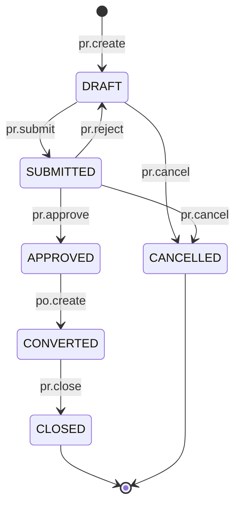
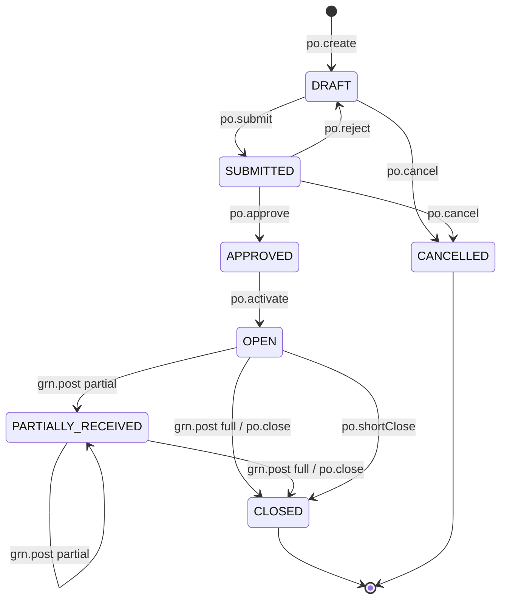
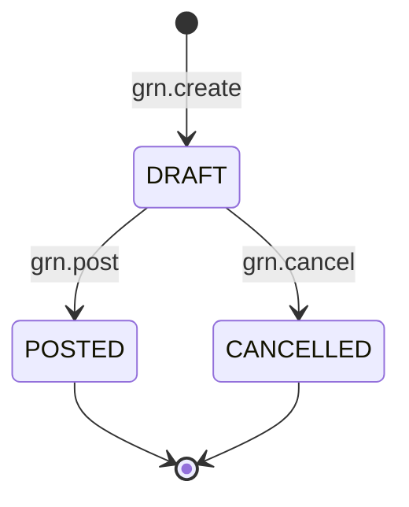
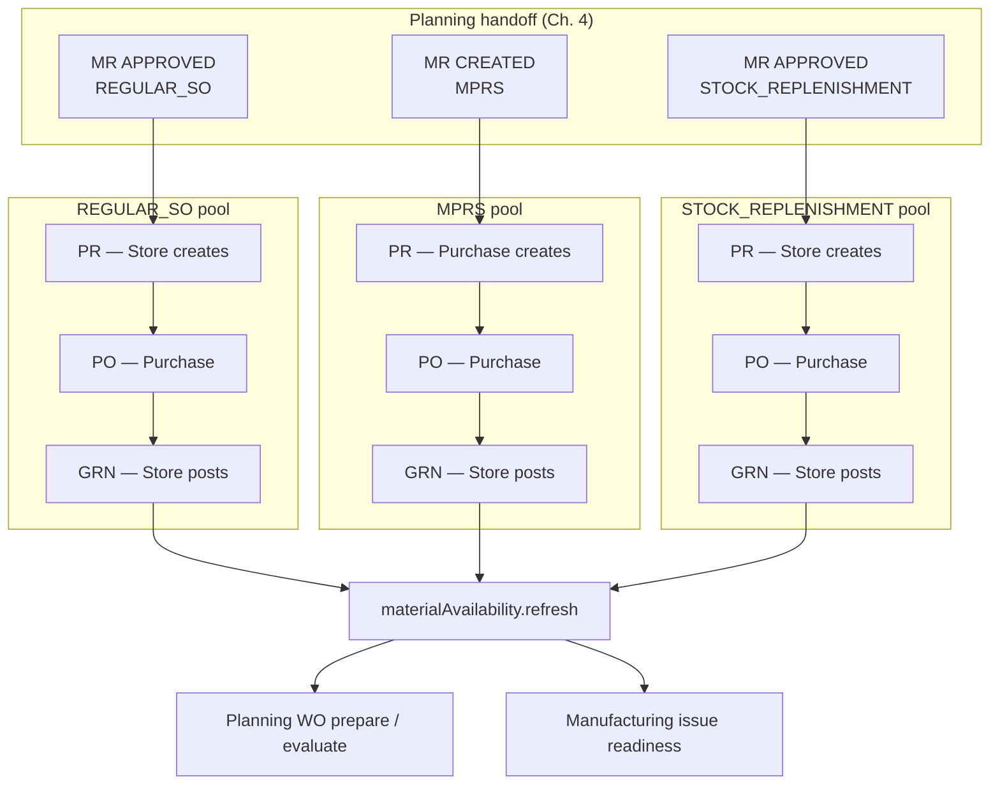

# Procurement Workflow State Machine

| Field | Value |
|-------|-------|
| **Document ID** | FT-PD-044 |
| **Volume** | 4 — Workflow Engine |
| **Chapter** | 5 — Procurement Workflow State Machine |
| **Title** | Procurement Workflow State Machine |
| **Version** | 1.0.0 |
| **Status** | Draft — Architecture Review |
| **Effective date** | 2026-05-29 |
| **Author** | FT ERP Product Team |
| **Owner** | FT ERP Product Architecture |
| **Audience** | Workflow engineers, backend leads, Store/Purchase process owners |
| **Classification** | Product — Workflow Engine Contract |

**Parent documents:**

- [Chapter 1 — Workflow Engine Overview & Pending Actions Contract](./Chapter_01_Workflow_Engine_Overview_and_Pending_Actions_Contract.md)
- [Chapter 2 — Transition Guards & Cross-Domain Dependency Catalog](./Chapter_02_Transition_Guards_and_Cross_Domain_Dependency_Catalog.md)
- [Chapter 4 — Planning Workflow State Machine](./Chapter_04_Planning_Workflow_State_Machine.md)
- [Volume 3, Chapter 3 — Procurement Domain Specification](../03_Domain_Specifications/Chapter_03_Procurement_Domain_Specification.md)
- [Volume 2, Chapter 2 — REGULAR Order Planning Pipeline](../02_Business_Architecture/Chapter_02_REGULAR_Order_Planning_Pipeline.md)
- [Volume 2, Chapter 3 — NO_QTY Agreement Planning Pipeline](../02_Business_Architecture/Chapter_03_NO_QTY_Agreement_Planning_Pipeline.md)
- [Volume 2, Chapter 5 — Document Ownership & Responsibility Matrix](../02_Business_Architecture/Chapter_05_Document_Ownership_and_Responsibility_Matrix.md)

---

## 1. Document Control

| Version | Date | Author | Summary |
|---------|------|--------|---------|
| 1.0.0 | 2026-05-29 | FT ERP Product Team | Initial Procurement domain State Machines and transition tables |

**Supersedes:** None.

**Change authority:** Product Architecture. Pool or ownership changes require Volume 3 Ch. 3 alignment; new Guards reference [FT-PD-041](./Chapter_02_Transition_Guards_and_Cross_Domain_Dependency_Catalog.md) only.

**Out of scope:** Guard semantics (FT-PD-041), MR/MPRS planning transitions (Ch. 4), Manufacturing WO/PMR (Ch. 6), database, API, UI.

---

## 2. Purpose

This chapter defines the **executable workflow State Machines** for the **Procurement domain**: Purchase Requisition, Purchase Order, Goods Receipt Note, and Material Availability refresh.

It **implements** [Volume 3, Chapter 3](../03_Domain_Specifications/Chapter_03_Procurement_Domain_Specification.md) using the Workflow Engine contracts in [Chapters 1–2](./Chapter_01_Workflow_Engine_Overview_and_Pending_Actions_Contract.md).

Guard **definitions** are not repeated—only **Guard IDs** and **execution order** per transition.

---

## 3. Scope

### 3.1 In scope

- Four procurement workflow artifacts (§5)
- Transition tables with ordered Guard IDs, Pending Actions, audit events
- Three demand pools: `REGULAR_SO`, `MPRS`, `STOCK_REPLENISHMENT` (§7)
- Pool-aware PR ownership and cross-pool prohibition
- Pending Action materialization for Purchase, Store, and Admin
- Mermaid state diagrams and overall procurement flow

### 3.2 Out of scope

- Material Requirement create/approve/release ([Volume 4, Ch. 4](./Chapter_04_Planning_Workflow_State_Machine.md))
- MPRS monthly plan approval (Planning domain)
- Supplier Follow-up as separate document (activity log on PO — no state transition)
- Purchase Bill / supplier invoice
- Work Order, PMR, Material Issue creation

### 3.3 Actor roles

| Role | Procurement transitions |
|------|------------------------|
| **Store** | REGULAR_SO / STOCK_REPLENISHMENT PR create; GRN create/post |
| **Purchase** | MPRS PR create; PR approve (standard); PO create/submit/approve/activate/close; supplier follow-up log |
| **Engine** | MR procurement stage advance; PO receipt progress; Material Availability refresh; Planning readiness recompute |
| **Admin** | Supplier master visibility (`PRC_SUP_MASTER`); no standard PR/PO/GRN writes |

---

## 4. Relationship with Previous Volumes

| Volume | Relationship |
|--------|--------------|
| **Vol. 2, Ch. 2** | REGULAR_SO path — Store PR → Purchase PO → Store GRN |
| **Vol. 2, Ch. 3** | MPRS pool — Purchase PR/PO → Store GRN; pool firewall |
| **Vol. 2, Ch. 5** | Source-aware PR ownership (OWN-11) |
| **Vol. 3, Ch. 3** | Authoritative states, `PRC_*` Pending Actions, PRC Business Rules |
| **Vol. 4, Ch. 1** | Engine contract, audit requirement, Pending Actions schema |
| **Vol. 4, Ch. 2** | Guard Registry (`GRD_PRC_*`, `GRD_XDM_*`) referenced by ID |
| **Vol. 4, Ch. 4** | Planning handoff — MR `APPROVED` / `CREATED` enables `pr.create`; `mr.markInProcurement` on PR create |

**Procurement entry gate:** MR ≥ `APPROVED` (REGULAR) or `CREATED`/`IN_PROCUREMENT` from MPRS release ([`GRD_PRC_MR_PUBLISHED`](./Chapter_02_Transition_Guards_and_Cross_Domain_Dependency_Catalog.md)).

**Procurement terminus:** `grn.post` → Material Availability refresh → Planning WO prepare / Manufacturing issue may proceed per their domain rules ([PRC-06](../03_Domain_Specifications/Chapter_03_Procurement_Domain_Specification.md)).

---

## 5. State Machines

### 5.1 Purchase Requisition (PR)

| Attribute | Value |
|-----------|-------|
| **Document type** | `purchaseRequisition` |
| **Initial state** | `DRAFT` |
| **Terminal states** | `CLOSED`, `CANCELLED` |
| **demandPool** | `REGULAR_SO` \| `MPRS` \| `STOCK_REPLENISHMENT` (immutable after create) |
| **Completion state** | `CONVERTED` (PO created) |

**States:** `DRAFT` · `SUBMITTED` · `APPROVED` · `CONVERTED` · `CLOSED` · `CANCELLED`

**Entry:** `pr.create` from published MR lines — **single pool per PR** ([PRC-01](../03_Domain_Specifications/Chapter_03_Procurement_Domain_Specification.md)).

**Exit:** `po.create` → `CONVERTED`; or `pr.close` when MR fulfilled without full conversion.

**Pending Actions:** `PRC_PR_REGULAR`, `PRC_PR_MPRS`, `PRC_PR_REPLEN`, `PRC_PO_PREP`, `PRC_REGULAR_QUEUE`, `PRC_WAIT_PO`

**Cross-domain on create:** `mr.markInProcurement` on parent MR ([Ch. 4](./Chapter_04_Planning_Workflow_State_Machine.md) §6.5).

---

### 5.2 Purchase Order (PO)

| Attribute | Value |
|-----------|-------|
| **Document type** | `purchaseOrder` |
| **Initial state** | `DRAFT` |
| **Terminal states** | `CLOSED`, `CANCELLED` |
| **Primary owner** | Purchase |
| **demandPool** | Inherited from PR (immutable) |

**States:** `DRAFT` · `SUBMITTED` · `APPROVED` · `OPEN` · `PARTIALLY_RECEIVED` · `CLOSED` · `CANCELLED`

**Entry:** `po.create` from `APPROVED` PR — **must reference PR** ([`GRD_PRC_PO_REQUIRES_PR`](./Chapter_02_Transition_Guards_and_Cross_Domain_Dependency_Catalog.md)).

**GRN eligibility:** `OPEN` or `PARTIALLY_RECEIVED` only.

**Pending Actions:** `PRC_PO_PREP`, `PRC_PO_APPROVE`, `PRC_SUP_FOLLOWUP`, `PRC_PO_CLOSE`, `PRC_GRN_POST`, `PRC_GRN_PARTIAL`

**Rule:** `CLOSED` PO — no line/qty/supplier edits ([`GRD_PRC_PO_CLOSED`](./Chapter_02_Transition_Guards_and_Cross_Domain_Dependency_Catalog.md), [PRC-05](../03_Domain_Specifications/Chapter_03_Procurement_Domain_Specification.md)).

---

### 5.3 Goods Receipt Note (GRN)

| Attribute | Value |
|-----------|-------|
| **Document type** | `goodsReceiptNote` |
| **Initial state** | `DRAFT` |
| **Terminal state** | `POSTED` |
| **Primary owner** | Store |
| **Parent** | Purchase Order (`OPEN` \| `PARTIALLY_RECEIVED`) |

**States:** `DRAFT` · `POSTED` · `CANCELLED` (draft only)

**Partial receipt:** Multiple GRNs per PO line until line fully received ([PRC-15](../03_Domain_Specifications/Chapter_03_Procurement_Domain_Specification.md)).

**Pending Actions:** `PRC_GRN_POST`, `PRC_GRN_PARTIAL`

**Side effects on `grn.post`:** Stock Ledger increase; PO receipt progress; `materialAvailability.refresh`; optional `woPrepare.evaluate` / `woPlacement.evaluate` (Planning).

---

### 5.4 Material Availability (Read Model refresh)

| Attribute | Value |
|-----------|-------|
| **Document type** | `materialAvailability` |
| **Model** | Computed Read Model — not user-authored |
| **Scope** | Per item (+ location context per policy) |
| **Primary owner** | Engine |

**States:** `STALE` · `CURRENT`

**Transitions:** Engine-only `materialAvailability.refresh` — no user workspace write.

**Triggers:** `grn.post`, Material Issue/return (Manufacturing), reservation changes (Planning/Manufacturing).

**Pending Actions:** None — availability is downstream of `PRC_GRN_*` actions.

**Outputs:** On-hand, reserved, incoming, free, shortage buckets ([Vol. 3 Ch. 3](../03_Domain_Specifications/Chapter_03_Procurement_Domain_Specification.md) §7.7).

---

## 6. Transition Tables

Guard order is **top-to-bottom**. First failure stops transition ([FT-PD-041](./Chapter_02_Transition_Guards_and_Cross_Domain_Dependency_Catalog.md) GRD-04).

### 6.1 Purchase Requisition transitions

| Current state | User action | Actor | Guard IDs (order) | Next state | Pending Action | Audit event |
|---------------|-------------|-------|-------------------|------------|----------------|-------------|
| — | `pr.create` | Store / Purchase | `GRD_PRC_MR_PUBLISHED`, `GRD_PRC_MR_CLOSED`, `GRD_PRC_PR_CREATOR_ROLE`, `GRD_XDM_CUSTOMER_PO_AUTH` | `DRAFT` | Pool-specific (see §7) | `Created` |
| `DRAFT` | `pr.line.save` | Creator | `GRD_PRC_SINGLE_POOL`, `GRD_PRC_PR_QTY`, `GRD_XDM_POOL_MIXED_PR`, `GRD_XDM_CUSTOMER_PO_AUTH` | `DRAFT` | — | `Submitted` |
| `DRAFT` | `pr.submit` | Creator | `GRD_PRC_SINGLE_POOL` | `SUBMITTED` | `PRC_PO_PREP` (optional pre-approve policy) | `Submitted` |
| `SUBMITTED` | `pr.approve` | Purchase | — | `APPROVED` | `PRC_PO_PREP` | `Approved` |
| `SUBMITTED` | `pr.reject` | Purchase | — | `DRAFT` | — | `Rejected` |
| `APPROVED` | `po.create` | Purchase | `GRD_PRC_PR_APPROVED`, `GRD_PRC_PO_REQUIRES_PR` | `CONVERTED` | `PRC_REGULAR_QUEUE` / `PRC_WAIT_PO` resolve; `PRC_PO_PREP` resolves | `Completed` |
| `CONVERTED` | `pr.close` | Purchase | — | `CLOSED` | — | `Completed` |
| `DRAFT` | `pr.cancel` | Creator | — | `CANCELLED` | — | `Cancelled` |
| `SUBMITTED` | `pr.cancel` | Creator / Purchase | — | `CANCELLED` | — | `Cancelled` |

**Side effect on `pr.create`:** Parent MR → `IN_PROCUREMENT` via `mr.markInProcurement` ([Ch. 4](./Chapter_04_Planning_Workflow_State_Machine.md)); resolves `PLN_MR_PR` / `PLN_MPRS_PR`.

**Direct `DRAFT` → `APPROVED`:** Permitted only when configuration enables creator self-approve for `STOCK_REPLENISHMENT`; standard product uses `pr.submit` → `pr.approve`.

---

### 6.2 Purchase Order transitions

| Current state | User action | Actor | Guard IDs (order) | Next state | Pending Action | Audit event |
|---------------|-------------|-------|-------------------|------------|----------------|-------------|
| — | `po.create` | Purchase | `GRD_PRC_PR_APPROVED`, `GRD_PRC_PO_REQUIRES_PR`, `GRD_XDM_CUSTOMER_PO_AUTH` | `DRAFT` | `PRC_PO_APPROVE` | `Created` |
| `DRAFT` | `po.line.save` | Purchase | `GRD_PRC_PO_QTY`, `GRD_XDM_CUSTOMER_PO_AUTH` | `DRAFT` | — | `Submitted` |
| `DRAFT` | `po.submit` | Purchase | `GRD_PRC_SUPPLIER_ACTIVE` | `SUBMITTED` | `PRC_PO_APPROVE` | `Submitted` |
| `SUBMITTED` | `po.approve` | Purchase | — | `APPROVED` | — (resolves `PRC_PO_APPROVE`) | `Approved` |
| `SUBMITTED` | `po.reject` | Purchase | — | `DRAFT` | `PRC_PO_APPROVE` | `Rejected` |
| `APPROVED` | `po.activate` | Purchase | `GRD_PRC_SUPPLIER_ACTIVE` | `OPEN` | `PRC_GRN_POST`, `PRC_SUP_FOLLOWUP` (when overdue) | `Activated` |
| `OPEN` | `po.logFollowUp` | Purchase | — | `OPEN` | — (resolves `PRC_SUP_FOLLOWUP` when logged) | `Submitted` |
| `OPEN` | `po.shortClose` | Purchase | — | `CLOSED` | `PRC_PO_CLOSE` resolves | `Completed` |
| `OPEN` \| `PARTIALLY_RECEIVED` | `po.close` | Purchase | — | `CLOSED` | — | `Completed` |
| `DRAFT` | `po.cancel` | Purchase | — | `CANCELLED` | — | `Cancelled` |
| `SUBMITTED` | `po.cancel` | Purchase | — | `CANCELLED` | — | `Cancelled` |
| `CLOSED` | `po.update` | Purchase | `GRD_PRC_PO_CLOSED` | unchanged | — | `GuardBlocked` |

**Side effect on `po.create`:** Parent PR → `CONVERTED`.

**Side effect on `po.activate`:** Incoming qty reflected in Material Availability (`materialAvailability.refresh` — incoming bucket only).

**PO receipt progress:** Updated by `grn.post` (§6.3) — not a standalone user action.

---

### 6.3 Goods Receipt Note transitions

| Current state | User action | Actor | Guard IDs (order) | Next state | Pending Action | Audit event |
|---------------|-------------|-------|-------------------|------------|----------------|-------------|
| — | `grn.create` | Store | `GRD_PRC_PO_OPEN`, `GRD_PRC_PO_CLOSED`, `GRD_XDM_CUSTOMER_PO_AUTH` | `DRAFT` | — | `Created` |
| `DRAFT` | `grn.line.save` | Store | `GRD_PRC_PO_CLOSED` | `DRAFT` | — | `Submitted` |
| `DRAFT` | `grn.post` | Store | `GRD_PRC_GRN_QTY`, `GRD_PRC_LOCATION`, `GRD_PRC_PO_CLOSED`, `GRD_XDM_CUSTOMER_PO_AUTH` | `POSTED` | Resolves `PRC_GRN_POST` / `PRC_GRN_PARTIAL` | `Completed` |
| `DRAFT` | `grn.cancel` | Store | — | `CANCELLED` | — | `Cancelled` |

**Side effects on `grn.post`:**

| Effect | Target |
|--------|--------|
| Stock Ledger increase | Inventory |
| PO line receipt qty | Parent PO |
| PO state | `OPEN` → `PARTIALLY_RECEIVED` if partial; → `CLOSED` if all lines fully received |
| `materialAvailability.refresh` | Affected items |
| `woPrepare.evaluate` / `woPlacement.evaluate` | Planning cases (optional engine) |
| `PRC_PO_CLOSE` | Materializes when PO fully received |

**Partial GRN:** PO remains `PARTIALLY_RECEIVED`; additional `grn.create` allowed until line qty satisfied ([PRC-04](../03_Domain_Specifications/Chapter_03_Procurement_Domain_Specification.md)).

---

### 6.4 Material Availability transitions

| Current state | User action | Guard IDs | Next state | Pending Action | Audit event |
|---------------|-------------|-----------|------------|----------------|-------------|
| `STALE` \| `CURRENT` | `materialAvailability.refresh` | — (engine) | `CURRENT` | — | `Completed` |
| `CURRENT` | `materialAvailability.markStale` | — (engine; stock event) | `STALE` | — | — |

*Note:* `markStale` is an internal engine signal — **no user action**. Primary user-visible procurement terminus is `grn.post` → refresh chain.

**Correlation:** Refresh audits include `triggerDocumentType`, `triggerDocumentId`, `triggerAction` (e.g. `grn.post`).

---

## 7. Demand Pool Behavior

### 7.1 REGULAR_SO procurement flow

| Stage | Actor | Document transition | Pool |
|-------|-------|---------------------|------|
| MR publish | Store (Planning) | MR `APPROVED` | `REGULAR_SO` |
| PR create | **Store** | `pr.create` | `REGULAR_SO` |
| PR approve | Purchase | `pr.approve` | `REGULAR_SO` |
| PO create | Purchase | `po.create` | `REGULAR_SO` |
| GRN post | Store | `grn.post` | `REGULAR_SO` |

**Pending Actions:** `PRC_PR_REGULAR` → `PRC_WAIT_PO` (Store monitor) + `PRC_REGULAR_QUEUE` (Purchase) → `PRC_GRN_POST`.

**Planning link:** Internal Sales Order / RM Control Center case.

**Guards:** `GRD_PRC_PR_CREATOR_ROLE` requires **Store** actor on `pr.create`.

---

### 7.2 MPRS procurement flow

| Stage | Actor | Document transition | Pool |
|-------|-------|---------------------|------|
| MR publish | Engine (Planning) | MR `CREATED` on MPRS release | `MPRS` |
| PR create | **Purchase** | `pr.create` | `MPRS` |
| PR approve | Purchase | `pr.approve` | `MPRS` |
| PO create | Purchase | `po.create` | `MPRS` |
| GRN post | Store | `grn.post` | `MPRS` |

**Pending Actions:** `PLN_MPRS_PR` (Planning) resolves on `pr.create` → `PRC_PR_MPRS` resolves → `PRC_PO_PREP` → `PRC_GRN_POST`.

**Planning link:** Monthly Production Plan revision / frozen Snapshot.

**Guards:** `GRD_PRC_PR_CREATOR_ROLE` requires **Purchase** actor on `pr.create`.

---

### 7.3 STOCK_REPLENISHMENT procurement flow

| Stage | Actor | Document transition | Pool |
|-------|-------|---------------------|------|
| MR publish | Store (Planning) | Replenishment / ARR MR approved | `STOCK_REPLENISHMENT` |
| PR create | **Store** (default) | `pr.create` | `STOCK_REPLENISHMENT` |
| PR approve | Purchase (standard) | `pr.approve` | `STOCK_REPLENISHMENT` |
| PO create | Purchase | `po.create` | `STOCK_REPLENISHMENT` |
| GRN post | Store | `grn.post` | `STOCK_REPLENISHMENT` |

**Pending Actions:** `PRC_PR_REPLEN` → `PRC_PO_PREP` → `PRC_GRN_POST`.

**Rule:** Supplementary only — **cannot** substitute NO_QTY base MPRS demand ([PRC-16](../03_Domain_Specifications/Chapter_03_Procurement_Domain_Specification.md), [PLN-07](../03_Domain_Specifications/Chapter_02_Planning_Domain_Specification.md)).

**Guards:** `GRD_PRC_PR_CREATOR_ROLE` requires **Store** actor (default); may be exempt from planning-driven procurement guards per ARR policy ([Vol. 3 Ch. 3](../03_Domain_Specifications/Chapter_03_Procurement_Domain_Specification.md) §7.3).

---

### 7.4 PR ownership summary

| Demand pool | Standard PR creator | PR approver (standard) | PO creator | GRN poster |
|-------------|---------------------|------------------------|------------|------------|
| **REGULAR_SO** | Store | Purchase | Purchase | Store |
| **MPRS** | Purchase | Purchase | Purchase | Store |
| **STOCK_REPLENISHMENT** | Store | Purchase | Purchase | Store |

Enforced by [`GRD_PRC_PR_CREATOR_ROLE`](./Chapter_02_Transition_Guards_and_Cross_Domain_Dependency_Catalog.md) on `pr.create`.

---

### 7.5 Pool isolation and cross-pool prohibition

| Rule | Guard IDs | Effect |
|------|-----------|--------|
| One pool per PR | `GRD_PRC_SINGLE_POOL`, `GRD_XDM_POOL_MIXED_PR` | Block save/create |
| MR source must match pool | `GRD_PLN_POOL_REGULAR`, `GRD_PLN_POOL_MPRS` (Planning, on MR) | MR creation firewall |
| PO inherits PR pool | Engine ancestry | No cross-pool PO lines |
| PR lines from one MR source set | `GRD_PRC_MR_PUBLISHED` | Block PR without published MR |

**Cross-pool prohibition:** A single PR, PO, or GRN **must not** contain lines from more than one `demandPool` ([PRC-01](../03_Domain_Specifications/Chapter_03_Procurement_Domain_Specification.md)).

---

## 8. Pending Action Materialization

### 8.1 Purchase Pending Actions

| Action ID | Materializes when | Resolves when |
|-----------|-------------------|---------------|
| `PRC_PR_MPRS` | MPRS MR exists; no PR | `pr.create` (MPRS pool) |
| `PRC_PO_PREP` | PR `APPROVED`; no PO | `po.create` |
| `PRC_PO_APPROVE` | PO `SUBMITTED` | PO `APPROVED` or `CANCELLED` |
| `PRC_SUP_FOLLOWUP` | PO `OPEN`; past expected date | Follow-up logged or PO `CLOSED` |
| `PRC_PO_CLOSE` | PO fully received (engine detect) | `po.close` |
| `PRC_REGULAR_QUEUE` | REGULAR_SO PR `APPROVED`; awaiting PO | `po.create` |

**Owner:** `ownerRole = Purchase`.

### 8.2 Store Pending Actions

| Action ID | Materializes when | Resolves when |
|-----------|-------------------|---------------|
| `PRC_PR_REGULAR` | REGULAR MR `APPROVED`; no PR | `pr.create` (REGULAR_SO) |
| `PRC_PR_REPLEN` | Replenishment MR; no PR | `pr.create` (STOCK_REPLENISHMENT) |
| `PRC_GRN_POST` | PO `OPEN`; no GRN draft | `grn.post` or PO `CLOSED` |
| `PRC_GRN_PARTIAL` | PO `PARTIALLY_RECEIVED`; line open | Next `grn.post` or PO `CLOSED` |
| `PRC_WAIT_PO` | REGULAR PR submitted/approved; Store awaiting Purchase PO | `po.create` |

**Owner:** `ownerRole = Store`.

### 8.3 Admin visibility

| Action ID | Purpose | Owner |
|-----------|---------|-------|
| `PRC_SUP_MASTER` | Supplier inactive on `po.submit` | Admin |

Resolves when supplier reactivated. Admin does **not** own standard PR/PO/GRN transitions.

### 8.4 Escalation

Per [Chapter 1](./Chapter_01_Workflow_Engine_Overview_and_Pending_Actions_Contract.md) §7.7:

| Action ID | SLA hint | Escalation |
|-----------|----------|------------|
| `PRC_PR_MPRS` | 2 business days post MPRS release | Priority → `HIGH` |
| `PRC_PO_PREP` | 3 business days PR approved | Control Tower procurement bottleneck |
| `PRC_GRN_POST` | 1 business day material at gate | Priority → `HIGH`; Store owner flagged |
| `PRC_SUP_FOLLOWUP` | Expected date + 2 days | Priority → `HIGH`; backorder KPI |
| `PRC_WAIT_PO` | 5 business days | Purchase escalation on `PRC_REGULAR_QUEUE` |

### 8.5 Resolution rules

1. **Planning handoff** — `PLN_MR_PR` / `PLN_MPRS_PR` resolve on `pr.create` ([Ch. 4](./Chapter_04_Planning_Workflow_State_Machine.md) §8.5).
2. **PR → PO** — `PRC_PO_PREP` resolves on `po.create`; PR → `CONVERTED`.
3. **GRN → availability** — `PRC_GRN_*` resolve on `grn.post`; engine runs `materialAvailability.refresh`.
4. **Owner handoff** — Store creates REGULAR PR; Purchase queue (`PRC_REGULAR_QUEUE`) materializes without duplicate PR id.
5. **UI never deletes** — engine recompute only ([WFE-02](./Chapter_01_Workflow_Engine_Overview_and_Pending_Actions_Contract.md)).

### 8.6 Downstream Planning / Manufacturing signals

On `materialAvailability.refresh` after `grn.post`:

- Engine may invoke `woPrepare.evaluate` (REGULAR) or `woPlacement.evaluate` (NO_QTY)
- Manufacturing `GRD_MFG_RM_AVAILABLE` Read Model updated for future `issue.post`
- No Work Order or PMR created by Procurement transitions ([PRC-07](../03_Domain_Specifications/Chapter_03_Procurement_Domain_Specification.md))

---

## 9. Audit Events

Every **successful** user-initiated transition emits **exactly one** primary audit event ([WFE-06](./Chapter_01_Workflow_Engine_Overview_and_Pending_Actions_Contract.md)):

| Audit event | Used on procurement transitions |
|-------------|----------------------------------|
| `Created` | `pr.create`, `po.create`, `grn.create` |
| `Submitted` | `pr.submit`, `pr.line.save`, `po.submit`, `po.line.save`, `grn.line.save`, `po.logFollowUp` |
| `Activated` | `po.activate` |
| `Approved` | `pr.approve`, `po.approve` |
| `Rejected` | `pr.reject`, `po.reject` |
| `Completed` | `po.create` (on PR convert), `pr.close`, `grn.post`, `po.close`, `po.shortClose`, `materialAvailability.refresh` |
| `Cancelled` | `pr.cancel`, `po.cancel`, `grn.cancel` |

**Guard failures** emit `GuardBlocked` with `guardId` + `reasonCode` — no state change.

**Engine-only audits:** `materialAvailability.markStale` does not emit a primary user-facing audit; refresh triggered by `grn.post` inherits GRN `correlationId`.

**Correlation:** All procurement audits include `demandPool`, `materialRequirementId` (when applicable), root Enquiry `correlationId`.

---

## 10. Business Rules

| ID | Rule |
|----|------|
| **PRCWF-01** | **No skipped states** — only transitions in §6 permitted. |
| **PRCWF-02** | **No direct bypass** — e.g. `po.create` without `APPROVED` PR prohibited. |
| **PRCWF-03** | **Guards execute before transition** per ordered list. |
| **PRCWF-04** | **Failed Guards leave state unchanged.** |
| **PRCWF-05** | **Every successful user transition emits exactly one** primary audit event. |
| **PRCWF-06** | **PR ownership depends on demand pool** — `GRD_PRC_PR_CREATOR_ROLE` ([PRC-02](../03_Domain_Specifications/Chapter_03_Procurement_Domain_Specification.md)). |
| **PRCWF-07** | **PO requires approved PR** — `GRD_PRC_PR_APPROVED`, `GRD_PRC_PO_REQUIRES_PR` ([PRC-03](../03_Domain_Specifications/Chapter_03_Procurement_Domain_Specification.md)). |
| **PRCWF-08** | **Partial GRN allowed** — multiple GRNs per PO line; PO → `PARTIALLY_RECEIVED` ([PRC-04](../03_Domain_Specifications/Chapter_03_Procurement_Domain_Specification.md)). |
| **PRCWF-09** | **GRN post updates Material Availability** — automatic `materialAvailability.refresh` ([PRC-06](../03_Domain_Specifications/Chapter_03_Procurement_Domain_Specification.md)). |
| **PRCWF-10** | **Procurement never creates Work Orders** or PMR ([PRC-07](../03_Domain_Specifications/Chapter_03_Procurement_Domain_Specification.md)). |
| **PRCWF-11** | **Pool firewall always enforced** — `GRD_PRC_SINGLE_POOL`, `GRD_XDM_POOL_MIXED_PR` ([PRC-01](../03_Domain_Specifications/Chapter_03_Procurement_Domain_Specification.md)). |
| **PRCWF-12** | **Closed PO cannot be modified** — `GRD_PRC_PO_CLOSED` ([PRC-05](../03_Domain_Specifications/Chapter_03_Procurement_Domain_Specification.md)). |
| **PRCWF-13** | **GRN posting is Store-owned**; Purchase does not post GRN ([PRC-08](../03_Domain_Specifications/Chapter_03_Procurement_Domain_Specification.md)). |
| **PRCWF-14** | **Customer PO reference never authorizes** PR/PO/GRN — `GRD_XDM_CUSTOMER_PO_AUTH` ([PRC-13](../03_Domain_Specifications/Chapter_03_Procurement_Domain_Specification.md)). |
| **PRCWF-15** | **Terminal states** reject writes except read-only and formal reversal (future). |

*Operational rules PRC-01–PRC-16 in Volume 3 Ch. 3 remain authoritative; PRCWF rules are engine enforcement.*

---

## 11. State Machine Diagrams

### 11.1 Purchase Requisition

### 11.2 Purchase Order

### 11.3 Goods Receipt Note

### 11.4 Overall Procurement flow

---

## 12. Review Checklist

- [ ] Implements Volume 3 Ch. 3 states without redefining semantics
- [ ] Guard IDs reference FT-PD-041 only — no duplicate validation logic
- [ ] All §6 transitions have Guards, next state, PA, audit event
- [ ] Three demand pools explicit (§7) with PR ownership table
- [ ] Cross-pool prohibition documented
- [ ] Planning handoff (`mr.markInProcurement`) and availability refresh chain
- [ ] Partial GRN and closed PO rules
- [ ] Procurement never creates WO (PRCWF-10)
- [ ] Four Mermaid diagrams
- [ ] No database, API, UI implementation

---

## 13. Change Log

| Version | Date | Author | Summary |
|---------|------|--------|---------|
| 1.0.0 | 2026-05-29 | FT ERP Product Team | Initial Procurement Workflow State Machine |

---

## 14. Approval Block

| Role | Name | Signature | Date |
|------|------|-----------|------|
| Product Owner | | | |
| Product Architecture | | | |
| Workflow Engineering Lead | | | |
| Store Process Owner | | | |
| Purchase Process Owner | | | |

---

## Document navigation

| | Link |
|--|------|
| **Previous** | [Planning Workflow State Machine](./Chapter_04_Planning_Workflow_State_Machine.md) (FT-PD-043) |
| **Next** | [Manufacturing Workflow State Machine](./Chapter_06_Manufacturing_Workflow_State_Machine.md) (FT-PD-045) |
| **Volume** | [Workflow Engine](./README.md) |
| **Product** | [Product Documentation Index](../README.md) |

