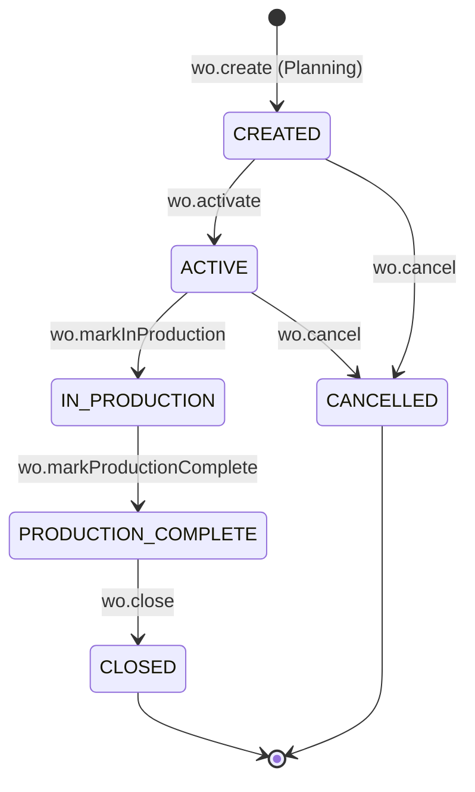
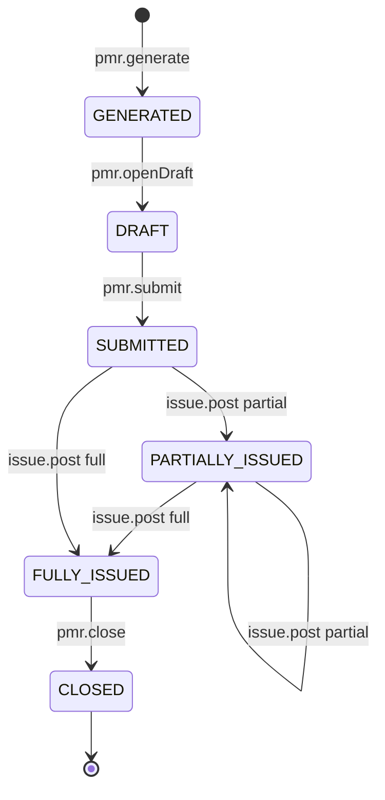
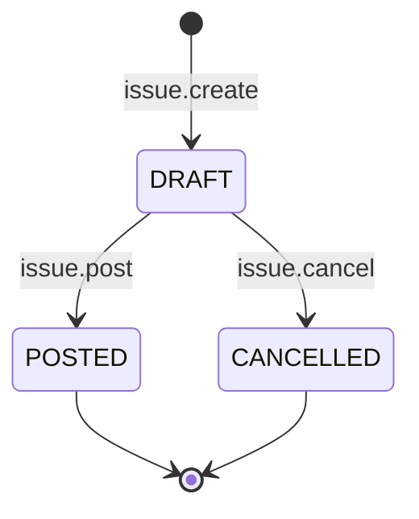
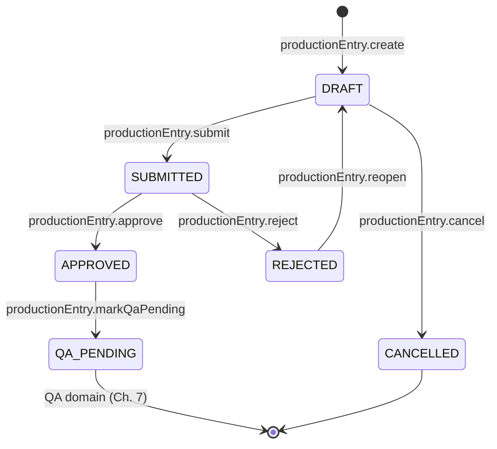
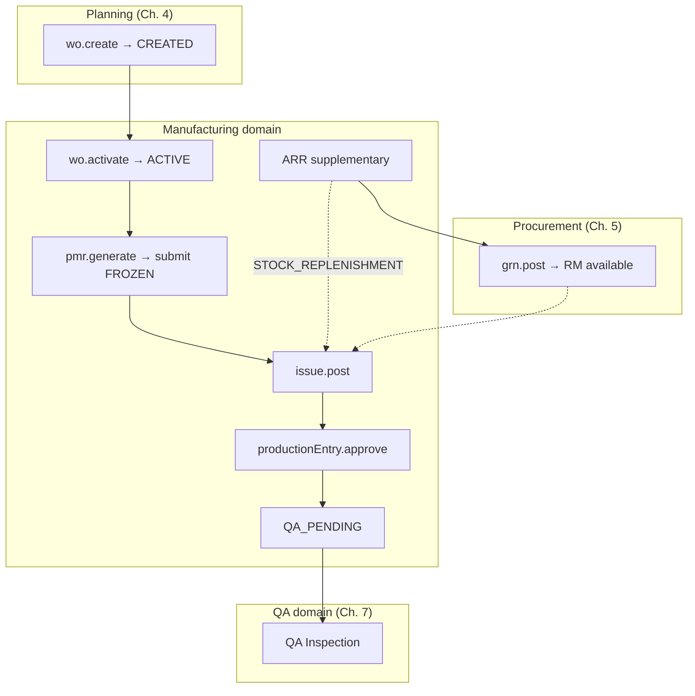

# Manufacturing Workflow State Machine

| Field | Value |
|-------|-------|
| **Document ID** | FT-PD-045 |
| **Volume** | 4 — Workflow Engine |
| **Chapter** | 6 — Manufacturing Workflow State Machine |
| **Title** | Manufacturing Workflow State Machine |
| **Version** | 1.0.0 |
| **Status** | Draft — Architecture Review |
| **Effective date** | 2026-05-29 |
| **Author** | FT ERP Product Team |
| **Owner** | FT ERP Product Architecture |
| **Audience** | Workflow engineers, backend leads, Store/Production process owners |
| **Classification** | Product — Workflow Engine Contract |

**Parent documents:**

- [Chapter 1 — Workflow Engine Overview & Pending Actions Contract](./Chapter_01_Workflow_Engine_Overview_and_Pending_Actions_Contract.md)
- [Chapter 2 — Transition Guards & Cross-Domain Dependency Catalog](./Chapter_02_Transition_Guards_and_Cross_Domain_Dependency_Catalog.md)
- [Chapter 4 — Planning Workflow State Machine](./Chapter_04_Planning_Workflow_State_Machine.md)
- [Chapter 5 — Procurement Workflow State Machine](./Chapter_05_Procurement_Workflow_State_Machine.md)
- [Volume 3, Chapter 4 — Manufacturing Domain Specification](../03_Domain_Specifications/Chapter_04_Manufacturing_Domain_Specification.md)
- [Volume 2, Chapter 4 — Manufacturing Execution Pipeline](../02_Business_Architecture/Chapter_04_Manufacturing_Execution_Pipeline.md)

---

## 1. Document Control

| Version | Date | Author | Summary |
|---------|------|--------|---------|
| 1.0.0 | 2026-05-29 | FT ERP Product Team | Initial Manufacturing domain State Machines and transition tables |

**Supersedes:** None.

**Change authority:** Product Architecture. PMR immutability or accountability chain changes require Volume 3 Ch. 4 alignment; new Guards reference [FT-PD-041](./Chapter_02_Transition_Guards_and_Cross_Domain_Dependency_Catalog.md) only.

**Out of scope:** Guard semantics (FT-PD-041), WO creation logic (Planning Ch. 4), QA inspection transitions (Ch. 7), database, API, UI.

---

## 2. Purpose

This chapter defines the **executable workflow State Machines** for the **Manufacturing domain**: Work Order, PMR, ARR, Material Issue, and Production Entry.

It **implements** [Volume 3, Chapter 4](../03_Domain_Specifications/Chapter_04_Manufacturing_Domain_Specification.md) using the Workflow Engine contracts in [Chapters 1–5](./Chapter_01_Workflow_Engine_Overview_and_Pending_Actions_Contract.md).

Guard **definitions** are not repeated—only **Guard IDs** and **execution order** per transition.

---

## 3. Scope

### 3.1 In scope

- Five manufacturing workflow artifacts (§5)
- Transition tables with ordered Guard IDs, Pending Actions, audit events
- User transitions vs engine side effects vs cross-domain events (§7)
- Pending Action materialization for Store, Production, and QA handoff
- Mermaid state diagrams and overall manufacturing flow
- **Identical execution** for REGULAR and NO_QTY after Work Order exists ([MFG-14](../03_Domain_Specifications/Chapter_04_Manufacturing_Domain_Specification.md))

### 3.2 Out of scope

- Work Order **create** from Planning (`wo.create` — [Ch. 4](./Chapter_04_Planning_Workflow_State_Machine.md) §6.6)
- MR, PR, PO, GRN ([Ch. 5](./Chapter_05_Procurement_Workflow_State_Machine.md))
- QA Inspection, rework, scrap, FG Acceptance ([Volume 4, Ch. 7](./README.md) — planned)
- Dispatch and Sales Bill
- Material Return detail (referenced only via `MFG_RETURN` Pending Action)

### 3.3 Actor roles

| Role | Manufacturing transitions |
|------|--------------------------|
| **Store** | WO activate; PMR generate/submit; Material Issue; ARR create/submit |
| **Production** | Production Entry record/submit/approve |
| **Engine** | PMR issue progress; WO stage advance; consumption post; QA Pending handoff; ARR procurement linkage |
| **QA** | Receives handoff only — no Manufacturing writes |

---

## 4. Relationship with Previous Volumes

| Volume | Relationship |
|--------|--------------|
| **Vol. 2, Ch. 4** | Common execution pipeline after WO; material accountability chain |
| **Vol. 3, Ch. 4** | Authoritative states, `MFG_*` Pending Actions, MFG Business Rules |
| **Vol. 4, Ch. 1** | Engine contract, audit requirement, Pending Actions schema |
| **Vol. 4, Ch. 2** | Guard Registry (`GRD_MFG_*`) referenced by ID |
| **Vol. 4, Ch. 4** | Planning `wo.create` → WO `CREATED`; Planning terminus |
| **Vol. 4, Ch. 5** | ARR → `STOCK_REPLENISHMENT` MR/PR/GRN; `GRD_MFG_RM_AVAILABLE` after GRN |

**Manufacturing entry:** Work Order enters `CREATED` from Planning `wo.create` ([Ch. 4](./Chapter_04_Planning_Workflow_State_Machine.md)).

**Manufacturing terminus:** Production Entry `APPROVED` → `QA_PENDING` — QA domain owns next step ([MFG-13](../03_Domain_Specifications/Chapter_04_Manufacturing_Domain_Specification.md)).

---

## 5. State Machines

### 5.1 Work Order

| Attribute | Value |
|-----------|-------|
| **Document type** | `workOrder` |
| **Initial state** | `CREATED` (Planning handoff) |
| **Terminal states** | `CLOSED`, `CANCELLED` |
| **Primary owner** | Store (execution lifecycle) |
| **Business Model** | Inherited from Enquiry — **no execution gate branch** |

**States:** `CREATED` · `ACTIVE` · `IN_PRODUCTION` · `PRODUCTION_COMPLETE` · `CLOSED` · `CANCELLED`

**Entry:** Planning `wo.create` — not a Manufacturing user action.

**Exit to QA path:** Indirect via Production Entry `QA_PENDING` batches.

**Pending Actions:** `MFG_WO_ACTIVATE`

**Rule:** WO **does not** auto-start PMR, issue, or production on create ([MFG-10](../03_Domain_Specifications/Chapter_04_Manufacturing_Domain_Specification.md)).

---

### 5.2 PMR (Production Material Request)

| Attribute | Value |
|-----------|-------|
| **Document type** | `productionMaterialRequest` |
| **Initial state** | `GENERATED` |
| **Terminal state** | `CLOSED` |
| **Primary owner** | Store |
| **Parent** | Work Order (`ACTIVE`) |

**States:** `GENERATED` · `DRAFT` · `SUBMITTED` · `PARTIALLY_ISSUED` · `FULLY_ISSUED` · `CLOSED`

**Freeze point:** `pmr.submit` → `SUBMITTED` — lines **immutable** thereafter ([`GRD_MFG_PMR_FROZEN`](./Chapter_02_Transition_Guards_and_Cross_Domain_Dependency_Catalog.md), [MFG-02](../03_Domain_Specifications/Chapter_04_Manufacturing_Domain_Specification.md)).

**Pending Actions:** `MFG_PMR_GEN`, `MFG_PMR_SUBMIT`, `MFG_ISSUE`, `MFG_ISSUE_PARTIAL`

**Generation:** Controlled action `pmr.generate` when WO `ACTIVE` — BOM explosion, not silent background ([MFG-01](../03_Domain_Specifications/Chapter_04_Manufacturing_Domain_Specification.md)).

---

### 5.3 ARR (Additional RM Requisition)

| Attribute | Value |
|-----------|-------|
| **Document type** | `additionalRmRequisition` |
| **Initial state** | `DRAFT` |
| **Terminal state** | `CLOSED` |
| **Primary owner** | Store (initiate) |
| **demandPool** | `STOCK_REPLENISHMENT` (on linked MR) |

**States:** `DRAFT` · `SUBMITTED` · `IN_PROCUREMENT` · `ISSUED` · `CLOSED` · `CANCELLED`

**Rule:** ARR **supplements** PMR — **never replaces** frozen PMR lines ([MFG-03](../03_Domain_Specifications/Chapter_04_Manufacturing_Domain_Specification.md)).

**Pending Actions:** `MFG_ARR`

**Cross-domain:** `arr.submit` → creates/links `STOCK_REPLENISHMENT` MR → Procurement path ([Ch. 5](./Chapter_05_Procurement_Workflow_State_Machine.md) §7.3).

---

### 5.4 Material Issue

| Attribute | Value |
|-----------|-------|
| **Document type** | `materialIssue` |
| **Initial state** | `DRAFT` |
| **Terminal state** | `POSTED` |
| **Primary owner** | Store |
| **Parent** | Submitted PMR (+ optional ARR supplementary context) |

**States:** `DRAFT` · `POSTED` · `CANCELLED` (draft only)

**Partial issue:** Multiple Issue documents per PMR line; cumulative qty updates PMR issued totals ([MFG-16](../03_Domain_Specifications/Chapter_04_Manufacturing_Domain_Specification.md)).

**Pending Actions:** `MFG_ISSUE`, `MFG_ISSUE_PARTIAL`

---

### 5.5 Production Entry

| Attribute | Value |
|-----------|-------|
| **Document type** | `productionEntry` |
| **Initial state** | `DRAFT` |
| **Manufacturing terminal** | `QA_PENDING` |
| **Primary owner** | Production |
| **Outputs** | Production Batch identity; RM consumption on approve |

**States:** `DRAFT` · `SUBMITTED` · `APPROVED` · `QA_PENDING` · `REJECTED` (internal)

**Handoff:** `productionEntry.markQaPending` (engine) on approve → QA domain ([MFG-13](../03_Domain_Specifications/Chapter_04_Manufacturing_Domain_Specification.md)).

**Pending Actions:** `MFG_PE_RECORD`, `MFG_PE_APPROVE`, `MFG_PE_BLOCK`, `MFG_QA_HANDOFF` (QA owner)

---

## 6. Transition Tables

Guard order is **top-to-bottom**. First failure stops transition ([FT-PD-041](./Chapter_02_Transition_Guards_and_Cross_Domain_Dependency_Catalog.md) GRD-04).

### 6.1 Work Order transitions

| Current state | User action | Actor | Guard IDs (order) | Next state | Pending Action | Audit event |
|---------------|-------------|-------|-------------------|------------|----------------|-------------|
| — | `wo.create` | Store (Planning) | See [Ch. 4](./Chapter_04_Planning_Workflow_State_Machine.md) §6.6 | `CREATED` | `MFG_WO_ACTIVATE` | `Created` |
| `CREATED` | `wo.activate` | Store | — | `ACTIVE` | `MFG_PMR_GEN` (resolves `MFG_WO_ACTIVATE`) | `Activated` |
| `ACTIVE` | `wo.cancel` | Store | — | `CANCELLED` | — | `Cancelled` |
| `ACTIVE` | `wo.markInProduction` | Engine | — | `IN_PRODUCTION` | — | `Activated` |
| `IN_PRODUCTION` | `wo.markProductionComplete` | Engine | — | `PRODUCTION_COMPLETE` | — | `Completed` |
| `PRODUCTION_COMPLETE` | `wo.close` | Engine / Store | — | `CLOSED` | — | `Completed` |

**Engine triggers:**

| Engine action | When |
|---------------|------|
| `wo.markInProduction` | First `productionEntry.approve` on WO |
| `wo.markProductionComplete` | All WO lines have cumulative approved production = line qty |
| `wo.close` | Downstream QA/dispatch fulfillment complete (cross-domain — Ch. 7–8) |

*Planning handoff row included for correlation; `wo.create` guards are in Ch. 4.*

---

### 6.2 PMR transitions

| Current state | User action | Actor | Guard IDs (order) | Next state | Pending Action | Audit event |
|---------------|-------------|-------|-------------------|------------|----------------|-------------|
| — | `pmr.generate` | Store | `GRD_MFG_WO_ACTIVE`, `GRD_MFG_BOM_APPROVED` | `GENERATED` | `MFG_PMR_SUBMIT` | `Created` |
| `GENERATED` | `pmr.openDraft` | Store | — | `DRAFT` | `MFG_PMR_SUBMIT` | `Activated` |
| `DRAFT` | `pmr.line.save` | Store | — | `DRAFT` | `MFG_PMR_SUBMIT` | `Submitted` |
| `DRAFT` | `pmr.submit` | Store | — | `SUBMITTED` | `MFG_ISSUE` (resolves `MFG_PMR_SUBMIT`) | `Approved` |
| `SUBMITTED` | `pmr.line.update` | Store | `GRD_MFG_PMR_FROZEN` | unchanged | — | `GuardBlocked` |
| `SUBMITTED` | `pmr.updateIssuedProgress` | Engine | — | `PARTIALLY_ISSUED` \| `FULLY_ISSUED` | `MFG_ISSUE_PARTIAL` or resolve `MFG_ISSUE` | `Completed` |
| `PARTIALLY_ISSUED` | `pmr.updateIssuedProgress` | Engine | — | `PARTIALLY_ISSUED` \| `FULLY_ISSUED` | `MFG_ISSUE_PARTIAL` | `Completed` |
| `FULLY_ISSUED` | `pmr.close` | Engine | — | `CLOSED` | — | `Completed` |
| `SUBMITTED`+ | `pmr.cancel` | — | — | blocked (policy) | — | `GuardBlocked` |

**Side effect on `pmr.submit`:** BOM revision id and RM line qty **frozen**; issue validation uses PMR lines only.

---

### 6.3 ARR transitions

| Current state | User action | Actor | Guard IDs (order) | Next state | Pending Action | Audit event |
|---------------|-------------|-------|-------------------|------------|----------------|-------------|
| — | `arr.create` | Store / Production | `GRD_MFG_WO_ACTIVE`, `GRD_MFG_WO_CANCELLED` | `DRAFT` | `MFG_ARR` | `Created` |
| `DRAFT` | `arr.line.save` | Store | — | `DRAFT` | — | `Submitted` |
| `DRAFT` | `arr.submit` | Store | `GRD_MFG_ARR_REASON` | `SUBMITTED` | — | `Submitted` |
| `SUBMITTED` | `arr.publishProcurement` | Engine | — | `IN_PROCUREMENT` | Links to `PRC_PR_REPLEN` | `Activated` |
| `IN_PROCUREMENT` | `arr.markIssued` | Engine | — | `ISSUED` | Resolves `MFG_ARR` | `Completed` |
| `ISSUED` | `arr.close` | Store | — | `CLOSED` | — | `Completed` |
| `DRAFT` | `arr.cancel` | Store | — | `CANCELLED` | — | `Cancelled` |

**Cross-domain on `arr.publishProcurement`:** Creates `STOCK_REPLENISHMENT` MR → `pr.create` path ([Ch. 5](./Chapter_05_Procurement_Workflow_State_Machine.md)); supplementary `issue.post` with ARR reference → `arr.markIssued`.

**Rule:** ARR does **not** mutate frozen PMR lines.

---

### 6.4 Material Issue transitions

| Current state | User action | Actor | Guard IDs (order) | Next state | Pending Action | Audit event |
|---------------|-------------|-------|-------------------|------------|----------------|-------------|
| — | `issue.create` | Store | `GRD_MFG_PMR_SUBMITTED`, `GRD_MFG_WO_CANCELLED` | `DRAFT` | — | `Created` |
| `DRAFT` | `issue.line.save` | Store | — | `DRAFT` | — | `Submitted` |
| `DRAFT` | `issue.post` | Store | `GRD_MFG_RM_AVAILABLE`, `GRD_MFG_ISSUE_EXCEEDS_PMR`, `GRD_MFG_WO_CANCELLED` | `POSTED` | Resolves `MFG_ISSUE` / `MFG_ISSUE_PARTIAL`; `MFG_PE_RECORD` | `Completed` |
| `DRAFT` | `issue.cancel` | Store | — | `CANCELLED` | — | `Cancelled` |

**Side effects on `issue.post`:**

| Effect | Target |
|--------|--------|
| Stock Transaction (store → production location) | Inventory |
| `pmr.updateIssuedProgress` | Parent PMR |
| `materialAvailability.refresh` | Procurement Read Model |
| `MFG_PE_RECORD` | Production queue when issued envelope > 0 |

**Partial issue:** Issue qty < PMR line open → PMR `PARTIALLY_ISSUED`; further `issue.post` allowed until `FULLY_ISSUED`.

---

### 6.5 Production Entry transitions

| Current state | User action | Actor | Guard IDs (order) | Next state | Pending Action | Audit event |
|---------------|-------------|-------|-------------------|------------|----------------|-------------|
| — | `productionEntry.create` | Production | `GRD_MFG_MATERIAL_ISSUED`, `GRD_MFG_WO_CANCELLED` | `DRAFT` | — | `Created` |
| `DRAFT` | `productionEntry.save` | Production | `GRD_MFG_WO_LINE_REMAINING` | `DRAFT` | `MFG_PE_APPROVE` (when ready) | `Submitted` |
| `DRAFT` | `productionEntry.submit` | Production | `GRD_MFG_WO_LINE_REMAINING` | `SUBMITTED` | `MFG_PE_APPROVE` | `Submitted` |
| `SUBMITTED` | `productionEntry.approve` | Production | `GRD_MFG_PRODUCTION_CAPACITY`, `GRD_MFG_BOM_BYPASS` | `APPROVED` | — | `Approved` |
| `APPROVED` | `productionEntry.markQaPending` | Engine | — | `QA_PENDING` | `MFG_QA_HANDOFF` (QA owner) | `Completed` |
| `SUBMITTED` | `productionEntry.reject` | Production | — | `REJECTED` | `MFG_PE_RECORD` | `Rejected` |
| `REJECTED` | `productionEntry.reopen` | Production | — | `DRAFT` | `MFG_PE_RECORD` | `Activated` |
| `DRAFT` | `productionEntry.cancel` | Production | — | `CANCELLED` | — | `Cancelled` |

**Side effects on `productionEntry.approve`:**

| Effect | Type |
|--------|------|
| RM **consumption post** (PMR + Issue trace) | Engine |
| Production **Batch** record finalized | Engine |
| `wo.markInProduction` (if first approve) | Engine / cross-doc |
| `wo.markProductionComplete` (if all lines satisfied) | Engine / cross-doc |
| `productionEntry.markQaPending` | Engine |
| `MFG_QA_HANDOFF` for QA domain | Pending Action |

**Partial production:** Multiple Production Entries per WO line until line balance exhausted; each approve → separate batch → `QA_PENDING`.

---

## 7. Manufacturing Workflow Behavior

### 7.1 User transitions vs engine side effects vs cross-domain events

| Category | Examples | Actor |
|----------|----------|-------|
| **User transitions** | `wo.activate`, `pmr.submit`, `issue.post`, `productionEntry.approve`, `arr.submit` | Store / Production |
| **Engine side effects** | `pmr.updateIssuedProgress`, `wo.markInProduction`, consumption post, `productionEntry.markQaPending` | Engine |
| **Cross-domain events** | Planning `wo.create`; ARR → MR/PR/GRN; GRN → `GRD_MFG_RM_AVAILABLE`; PE `QA_PENDING` → QA Inspection (Ch. 7) | Multi-domain |

### 7.2 Work Order activation

1. Planning `wo.create` → WO `CREATED` ([Ch. 4](./Chapter_04_Planning_Workflow_State_Machine.md)).
2. Store `wo.activate` → `ACTIVE`.
3. **No** automatic PMR, issue, or production ([MFG-10](../03_Domain_Specifications/Chapter_04_Manufacturing_Domain_Specification.md)).
4. REGULAR and NO_QTY: **identical** activation gates ([MFG-14](../03_Domain_Specifications/Chapter_04_Manufacturing_Domain_Specification.md)).

### 7.3 PMR generation and freeze

| Step | Action | Type |
|------|--------|------|
| 1 | `pmr.generate` on `ACTIVE` WO | User (Store) |
| 2 | BOM explosion → RM lines with revision id | Engine side effect |
| 3 | `pmr.openDraft` / line review | User |
| 4 | `pmr.submit` → `SUBMITTED` | User — **freeze** |
| 5 | All line edits blocked | `GRD_MFG_PMR_FROZEN` |

Corrections after freeze: reversal workflow (future), Material Return, or **ARR** — not PMR line edit.

### 7.4 ARR supplementary flow

```
Active WO + frozen PMR insufficient
  → arr.create / arr.submit (reason required)
  → Engine: STOCK_REPLENISHMENT MR + Procurement path (Ch. 5)
  → grn.post → availability refresh
  → Supplementary issue.post (ARR-linked)
  → arr.markIssued → ISSUED
```

ARR **never** replaces PMR accountability ([MFG-03](../03_Domain_Specifications/Chapter_04_Manufacturing_Domain_Specification.md)).

### 7.5 Material Issue

- Requires PMR `SUBMITTED` ([`GRD_MFG_PMR_SUBMITTED`](./Chapter_02_Transition_Guards_and_Cross_Domain_Dependency_Catalog.md)).
- Requires free stock ≥ issue qty ([`GRD_MFG_RM_AVAILABLE`](./Chapter_02_Transition_Guards_and_Cross_Domain_Dependency_Catalog.md)) — typically after Procurement GRN.
- Store-owned; Production cannot `issue.post` ([MFG-11](../03_Domain_Specifications/Chapter_04_Manufacturing_Domain_Specification.md)).

### 7.6 Partial issue

| Condition | PMR state | Production capacity |
|-----------|-----------|---------------------|
| First issue < PMR open | `PARTIALLY_ISSUED` | Proportional to issued RM |
| Cumulative issue = PMR required | `FULLY_ISSUED` | Full PMR-aligned capacity |
| Further issue after partial | Remains / → `FULLY_ISSUED` | Increases until cap |

Engine: `pmr.updateIssuedProgress` after each `issue.post`.

### 7.7 Partial production

- Multiple `productionEntry` documents per WO line.
- Each `approve` creates **Production Batch** with batch/lot identity.
- Cumulative approved qty tracked against WO line remaining ([`GRD_MFG_WO_LINE_REMAINING`](./Chapter_02_Transition_Guards_and_Cross_Domain_Dependency_Catalog.md)).
- Qty cannot exceed PMR-aligned issued envelope ([`GRD_MFG_PRODUCTION_CAPACITY`](./Chapter_02_Transition_Guards_and_Cross_Domain_Dependency_Catalog.md)).

### 7.8 Batch recording

On `productionEntry.approve`:

- **Production Batch** id assigned (engine).
- Links: WO line, PMR revision, Issue line(s).
- Forwards to QA Inspection (Ch. 7) when `QA_PENDING`.

### 7.9 Production completion

| Level | Trigger | State |
|-------|---------|-------|
| **Production Entry** | `productionEntry.approve` | `APPROVED` → `QA_PENDING` |
| **WO line** | Cumulative approved = line qty | Line complete |
| **Work Order** | All lines complete | `wo.markProductionComplete` → `PRODUCTION_COMPLETE` |

### 7.10 QA handoff

| Step | Domain | Transition |
|------|--------|------------|
| 1 | Manufacturing | `productionEntry.approve` |
| 2 | Manufacturing (engine) | Consumption post + `markQaPending` |
| 3 | Manufacturing | `MFG_QA_HANDOFF` Pending Action (QA owner) |
| 4 | QA (Ch. 7) | Inspection on `QA_PENDING` batch |

Manufacturing domain **ends** at `QA_PENDING`; Production approval does **not** make FG dispatch-eligible ([MFG-13](../03_Domain_Specifications/Chapter_04_Manufacturing_Domain_Specification.md)).

### 7.11 Material accountability chain

```
WO (planning basis) → PMR line (frozen) → Material Issue line → Production Entry consumption (on approve)
```

Every transition in §6 preserves trace ids in audit `correlationId` and document lineage ([MFG-08](../03_Domain_Specifications/Chapter_04_Manufacturing_Domain_Specification.md)).

---

## 8. Pending Action Materialization

### 8.1 Store Pending Actions

| Action ID | Materializes when | Resolves when |
|-----------|-------------------|---------------|
| `MFG_WO_ACTIVATE` | WO `CREATED` | `wo.activate` |
| `MFG_PMR_GEN` | WO `ACTIVE`; no PMR | `pmr.generate` |
| `MFG_PMR_SUBMIT` | PMR `GENERATED` / `DRAFT` complete | `pmr.submit` |
| `MFG_ISSUE` | PMR `SUBMITTED`; open lines | `issue.post` or PMR `FULLY_ISSUED` |
| `MFG_ISSUE_PARTIAL` | PMR `PARTIALLY_ISSUED` | Next `issue.post` or `FULLY_ISSUED` |
| `MFG_ARR` | Shortage beyond PMR | `arr.markIssued` or `arr.close` |
| `MFG_RETURN` | Return from production event | Return processed |

**Owner:** `ownerRole = Store`.

### 8.2 Production Pending Actions

| Action ID | Materializes when | Resolves when |
|-----------|-------------------|---------------|
| `MFG_PE_RECORD` | Material issued; WO `ACTIVE` / `IN_PRODUCTION` | `productionEntry.submit` |
| `MFG_PE_APPROVE` | Production Entry `SUBMITTED` | `productionEntry.approve` or `reject` |
| `MFG_PE_BLOCK` | Issue gap on floor (engine detect) | `issue.post` or ARR resolved |

**Owner:** `ownerRole = Production`.

### 8.3 QA handoff Pending Actions

| Action ID | Materializes when | Resolves when |
|-----------|-------------------|---------------|
| `MFG_QA_HANDOFF` | Production Entry `QA_PENDING` | QA Inspection started (Ch. 7) |

**Owner:** `ownerRole = QA` — Manufacturing generates; QA domain resolves.

Production Dashboard may show QA Pending batches as **read-only monitor** — not QA write actions.

### 8.4 Escalation

Per [Chapter 1](./Chapter_01_Workflow_Engine_Overview_and_Pending_Actions_Contract.md) §7.7:

| Action ID | SLA hint | Escalation |
|-----------|----------|------------|
| `MFG_WO_ACTIVATE` | 1 business day post WO create | Priority → `HIGH` |
| `MFG_PMR_SUBMIT` | 2 business days WO Active | Control Tower PMR backlog |
| `MFG_ISSUE` | 2 business days PMR Submitted | Priority → `HIGH` |
| `MFG_PE_RECORD` | 1 business day after issue | Production floor KPI |
| `MFG_QA_HANDOFF` | 4 hours QA Pending | Priority → `CRITICAL`; QA queue |

### 8.5 Resolution rules

1. **PMR freeze** — `MFG_PMR_SUBMIT` resolves on `pmr.submit`; line edit Pending Actions never materialize post-freeze.
2. **Issue → production** — `MFG_ISSUE` resolves on post; `MFG_PE_RECORD` materializes when issued envelope > 0.
3. **Approve → QA** — `MFG_PE_APPROVE` resolves on approve; `MFG_QA_HANDOFF` materializes for QA.
4. **ARR → procurement** — `MFG_ARR` persists through `IN_PROCUREMENT` until supplementary issue.
5. **UI never deletes** — engine recompute only ([WFE-02](./Chapter_01_Workflow_Engine_Overview_and_Pending_Actions_Contract.md)).

---

## 9. Audit Events

Every **successful** user-initiated transition emits **exactly one** primary audit event ([WFE-06](./Chapter_01_Workflow_Engine_Overview_and_Pending_Actions_Contract.md)):

| Audit event | Used on manufacturing transitions |
|-------------|----------------------------------|
| `Created` | `pmr.generate`, `issue.create`, `productionEntry.create`, `arr.create`, `wo.create` (Planning) |
| `Submitted` | `pmr.line.save`, `productionEntry.submit`, `productionEntry.save`, `issue.line.save`, `arr.line.save`, `arr.submit` |
| `Activated` | `wo.activate`, `pmr.openDraft`, `arr.publishProcurement`, `productionEntry.reopen`, `wo.markInProduction` |
| `Approved` | `pmr.submit`, `productionEntry.approve` |
| `Rejected` | `productionEntry.reject` |
| `Completed` | `issue.post`, `pmr.updateIssuedProgress`, `productionEntry.markQaPending`, `arr.markIssued`, `wo.markProductionComplete`, `wo.close`, `pmr.close`, `arr.close` |
| `Cancelled` | `wo.cancel`, `issue.cancel`, `productionEntry.cancel`, `arr.cancel` |

**Guard failures** emit `GuardBlocked` with `guardId` + `reasonCode` — no state change.

**Engine-only side effects** (consumption post, batch id assignment) are recorded on the **parent transition audit payload** (`productionEntry.approve`) — not as separate primary user events.

**Correlation:** All manufacturing audits include `workOrderId`, `pmrRevisionId` (when applicable), `productionBatchId` (on approve), root Enquiry `correlationId`.

---

## 10. Business Rules

| ID | Rule |
|----|------|
| **MFGWF-01** | **No skipped states** — only transitions in §6 permitted. |
| **MFGWF-02** | **Guards execute before transition** per ordered list. |
| **MFGWF-03** | **Failed Guards leave state unchanged.** |
| **MFGWF-04** | **Every successful user transition emits exactly one** primary audit event. |
| **MFGWF-05** | **PMR auto-generated** from WO via `pmr.generate` — controlled action ([MFG-01](../03_Domain_Specifications/Chapter_04_Manufacturing_Domain_Specification.md)). |
| **MFGWF-06** | **PMR freezes after submit** — `GRD_MFG_PMR_FROZEN` on line edit ([MFG-02](../03_Domain_Specifications/Chapter_04_Manufacturing_Domain_Specification.md)). |
| **MFGWF-07** | **ARR supplements PMR only** — never replaces frozen PMR ([MFG-03](../03_Domain_Specifications/Chapter_04_Manufacturing_Domain_Specification.md)). |
| **MFGWF-08** | **Production requires Material Issue** — `GRD_MFG_MATERIAL_ISSUED` ([MFG-04](../03_Domain_Specifications/Chapter_04_Manufacturing_Domain_Specification.md)). |
| **MFGWF-09** | **Production cannot exceed issued material** — `GRD_MFG_PRODUCTION_CAPACITY` ([MFG-05](../03_Domain_Specifications/Chapter_04_Manufacturing_Domain_Specification.md)). |
| **MFGWF-10** | **Frozen PMR required for production gates** — `GRD_MFG_BOM_BYPASS` blocks live BOM ([MFG-06](../03_Domain_Specifications/Chapter_04_Manufacturing_Domain_Specification.md)). |
| **MFGWF-11** | **Consumption posts on Production Entry approve only** ([MFG-07](../03_Domain_Specifications/Chapter_04_Manufacturing_Domain_Specification.md)). |
| **MFGWF-12** | **Production approval generates QA handoff** — `MFG_QA_HANDOFF` ([MFG-13](../03_Domain_Specifications/Chapter_04_Manufacturing_Domain_Specification.md)). |
| **MFGWF-13** | **REGULAR and NO_QTY share identical execution** after WO — no Business Model branch on guards ([MFG-14](../03_Domain_Specifications/Chapter_04_Manufacturing_Domain_Specification.md)). |
| **MFGWF-14** | **Cancelled WO blocks** issue and production — `GRD_MFG_WO_CANCELLED` ([MFG-15](../03_Domain_Specifications/Chapter_04_Manufacturing_Domain_Specification.md)). |
| **MFGWF-15** | **Partial issue and partial production permitted** — multiple Issue and Production Entry docs ([MFG-16](../03_Domain_Specifications/Chapter_04_Manufacturing_Domain_Specification.md)). |
| **MFGWF-16** | **Procurement never creates WO**; **Manufacturing never creates dispatch** — domain boundaries preserved. |

*Operational rules MFG-01–MFG-16 in Volume 3 Ch. 4 remain authoritative; MFGWF rules are engine enforcement.*

---

## 11. State Machine Diagrams

### 11.1 Work Order



### 11.2 PMR



### 11.3 Material Issue



### 11.4 Production Entry



### 11.5 Overall Manufacturing workflow



---

## 12. Review Checklist

- [ ] Implements Volume 3 Ch. 4 states without redefining semantics
- [ ] Guard IDs reference FT-PD-041 only — no duplicate validation logic
- [ ] All §6 transitions have Guards, next state, PA, audit event
- [ ] User vs engine vs cross-domain clearly separated (§7)
- [ ] PMR immutability and material accountability emphasized
- [ ] ARR supplementary flow documented
- [ ] REGULAR / NO_QTY identical execution after WO
- [ ] QA handoff at `QA_PENDING`
- [ ] Five Mermaid diagrams
- [ ] No database, API, UI implementation

---

## 13. Change Log

| Version | Date | Author | Summary |
|---------|------|--------|---------|
| 1.0.0 | 2026-05-29 | FT ERP Product Team | Initial Manufacturing Workflow State Machine |

---

## 14. Approval Block

| Role | Name | Signature | Date |
|------|------|-----------|------|
| Product Owner | | | |
| Product Architecture | | | |
| Workflow Engineering Lead | | | |
| Store Process Owner | | | |
| Production Process Owner | | | |

---

## Document navigation

| | Link |
|--|------|
| **Previous** | [Procurement Workflow State Machine](./Chapter_05_Procurement_Workflow_State_Machine.md) (FT-PD-044) |
| **Next** | [Quality Assurance Workflow State Machine](./Chapter_07_Quality_Assurance_Workflow_State_Machine.md) (FT-PD-046) |
| **Volume** | [Workflow Engine](./README.md) |
| **Product** | [Product Documentation Index](../README.md) |

