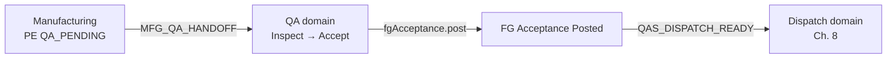
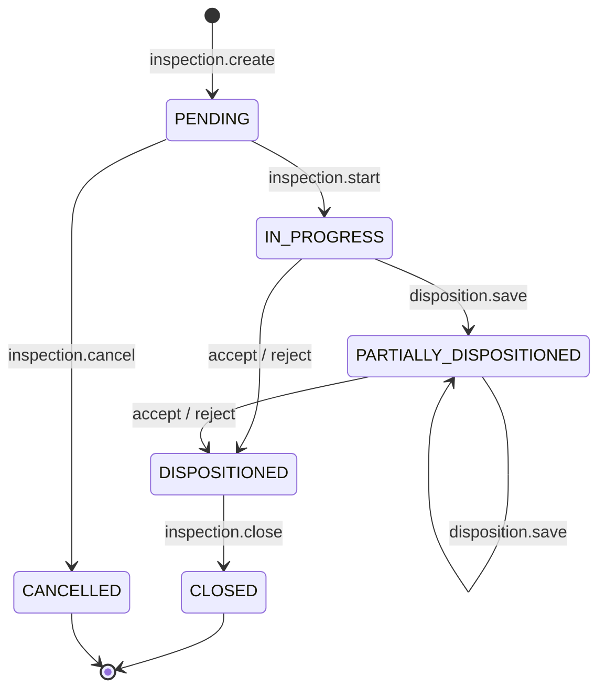
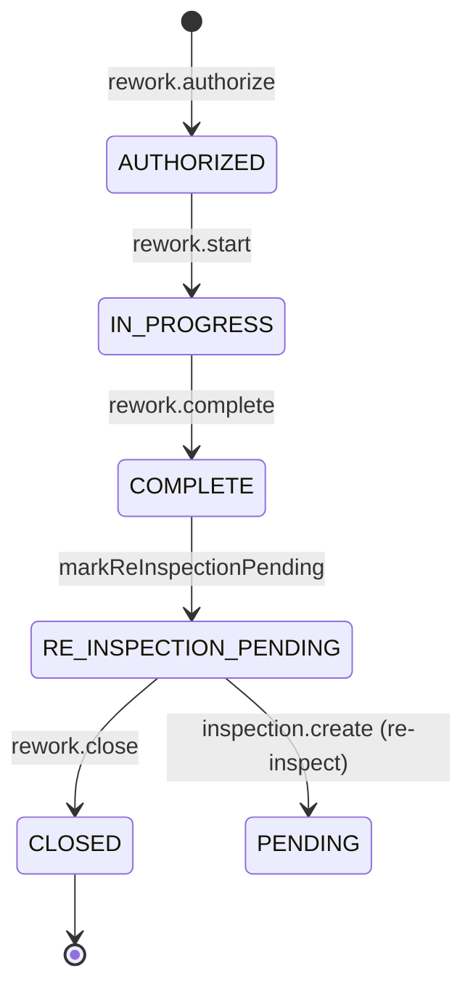
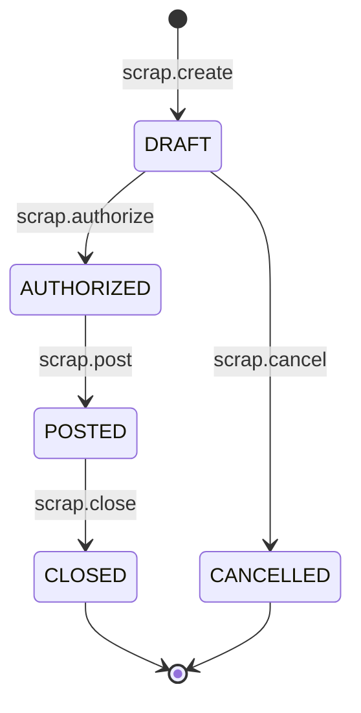
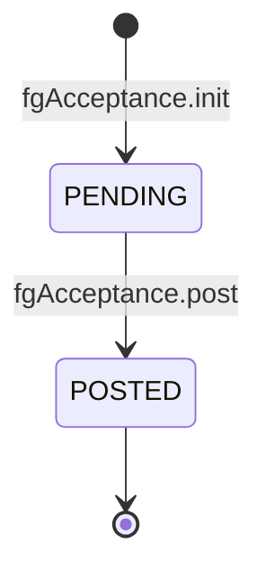
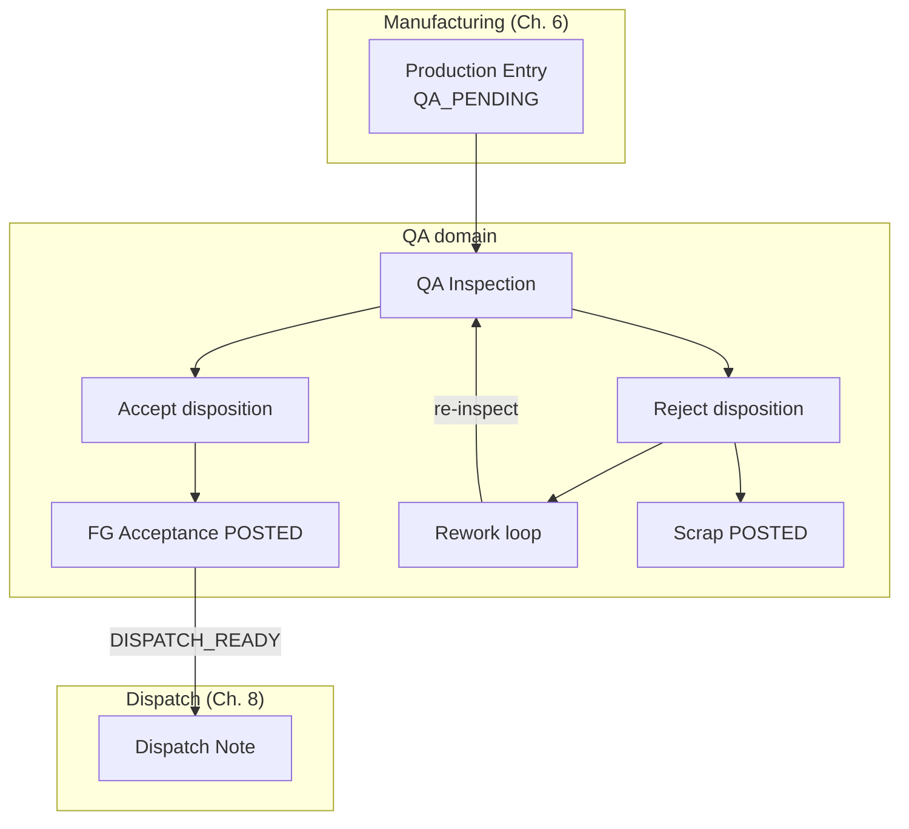

# Quality Assurance Workflow State Machine

| Field | Value |
|-------|-------|
| **Document ID** | FT-PD-046 |
| **Volume** | 4 — Workflow Engine |
| **Chapter** | 7 — Quality Assurance Workflow State Machine |
| **Title** | Quality Assurance Workflow State Machine |
| **Version** | 1.0.0 |
| **Status** | Draft — Architecture Review |
| **Effective date** | 2026-05-29 |
| **Author** | FT ERP Product Team |
| **Owner** | FT ERP Product Architecture |
| **Audience** | Workflow engineers, backend leads, QA / Production / Store process owners |
| **Classification** | Product — Workflow Engine Contract |

**Parent documents:**

- [Chapter 1 — Workflow Engine Overview & Pending Actions Contract](./Chapter_01_Workflow_Engine_Overview_and_Pending_Actions_Contract.md)
- [Chapter 2 — Transition Guards & Cross-Domain Dependency Catalog](./Chapter_02_Transition_Guards_and_Cross_Domain_Dependency_Catalog.md)
- [Chapter 6 — Manufacturing Workflow State Machine](./Chapter_06_Manufacturing_Workflow_State_Machine.md)
- [Volume 3, Chapter 5 — Quality Assurance Domain Specification](../03_Domain_Specifications/Chapter_05_Quality_Assurance_Domain_Specification.md)
- [Volume 2, Chapter 4 — Manufacturing Execution Pipeline](../02_Business_Architecture/Chapter_04_Manufacturing_Execution_Pipeline.md)

---

## 1. Document Control

| Version | Date | Author | Summary |
|---------|------|--------|---------|
| 1.0.0 | 2026-05-29 | FT ERP Product Team | Initial QA domain State Machines and transition tables |

**Supersedes:** None.

**Change authority:** Product Architecture. Dispatch eligibility or disposition semantics require Volume 3 Ch. 5 alignment; new Guards reference [FT-PD-041](./Chapter_02_Transition_Guards_and_Cross_Domain_Dependency_Catalog.md) only.

**Out of scope:** Guard semantics (FT-PD-041), Production Entry approve (Ch. 6), Dispatch Note / Sales Bill (Ch. 8), database, API, UI.

---

## 2. Purpose

This chapter defines the **executable workflow State Machines** for the **Quality Assurance domain**: QA Inspection, QA Batch, Rework, Scrap Authorization, and Finished Goods Acceptance.

It **implements** [Volume 3, Chapter 5](../03_Domain_Specifications/Chapter_05_Quality_Assurance_Domain_Specification.md) using the Workflow Engine contracts in [Chapters 1–6](./Chapter_01_Workflow_Engine_Overview_and_Pending_Actions_Contract.md).

Execution **begins** at Production Entry `QA_PENDING` ([Ch. 6](./Chapter_06_Manufacturing_Workflow_State_Machine.md)) and **ends** at **FG Acceptance Posted** — dispatch-eligible inventory and Dispatch domain handoff.

Guard **definitions** are not repeated—only **Guard IDs** and **execution order** per transition.

---

## 3. Scope

### 3.1 In scope

- Five QA workflow artifacts (§5)
- Transition tables with Guard IDs, Pending Actions, QA audit event codes (§9)
- User transitions vs engine side effects vs cross-domain events (§7)
- Partial accept/reject, rework loop, scrap governance, FG posting
- Pending Action materialization for QA, Production, and Store
- Mermaid state diagrams and overall QA flow
- **Identical QA execution** for REGULAR and NO_QTY ([QAS-13](../03_Domain_Specifications/Chapter_05_Quality_Assurance_Domain_Specification.md))

### 3.2 Out of scope

- Production Entry record/approve ([Ch. 6](./Chapter_06_Manufacturing_Workflow_State_Machine.md))
- Dispatch Note create/post, Sales Bill ([Volume 4, Ch. 8](./README.md) — planned)
- PMR, Material Issue, RM consumption
- QA criteria master data (Volume 5)

### 3.3 Actor roles

| Role | QA transitions |
|------|----------------|
| **QA** | Inspection, disposition, scrap authorize/post, rework authorize, FG confirm (policy) |
| **Production** | Rework execute/complete only |
| **Engine** | FG Acceptance post on accept; QA Batch progress; Dispatch-ready signals |
| **Store** | Read-only monitor (`QAS_DISPATCH_READY`); Dispatch writes in Ch. 8 |

---

## 4. Relationship with Previous Volumes

| Volume | Relationship |
|--------|--------------|
| **Vol. 2, Ch. 4** | EXE-03 — no dispatch before QA acceptance; execution convergence |
| **Vol. 3, Ch. 4** | Manufacturing handoff at `QA_PENDING`; `MFG_QA_HANDOFF` |
| **Vol. 3, Ch. 5** | Authoritative states, `QAS_*` Pending Actions, QAS Business Rules |
| **Vol. 3, Ch. 6** | Dispatch consumes FG Acceptance only ([`GRD_XDM_FG_ACCEPTANCE`](./Chapter_02_Transition_Guards_and_Cross_Domain_Dependency_Catalog.md)) |
| **Vol. 4, Ch. 1** | Engine contract, audit requirement, Pending Actions schema |
| **Vol. 4, Ch. 2** | Guard Registry (`GRD_QA_*`, `GRD_XDM_FG_ACCEPTANCE`) |
| **Vol. 4, Ch. 6** | Entry: `productionEntry.markQaPending` → `QA_PENDING` |

### 4.1 How QA bridges Manufacturing and Dispatch



| Bridge | Mechanism |
|--------|-----------|
| **Manufacturing → QA** | `productionEntry.markQaPending`; `MFG_QA_HANDOFF` resolves on `inspection.create` |
| **QA → Inventory** | `fgAcceptance.post` — accepted qty only; rejected never posts FG |
| **QA → Dispatch** | `QAS_DISPATCH_READY` monitor; `GRD_XDM_FG_ACCEPTANCE` on `dispatchNote.create` |
| **Manufacturing ownership** | Ends at `QA_PENDING` — QA owns inspection through FG Acceptance |

---

## 5. State Machines

### 5.1 QA Inspection

| Attribute | Value |
|-----------|-------|
| **Document type** | `qaInspection` |
| **Purpose** | Formal quality evaluation and disposition of a Production Batch |
| **Initial state** | `PENDING` |
| **Terminal states** | `CLOSED`, `CANCELLED` |
| **Primary owner** | QA |
| **Parent** | Production Entry (`QA_PENDING`) / Production Batch |

**States:** `PENDING` · `IN_PROGRESS` · `PARTIALLY_DISPOSITIONED` · `DISPOSITIONED` · `CLOSED` · `CANCELLED`

**Entry:** `inspection.create` when Production Entry `QA_PENDING`.

**Exit:** `inspection.close` when all batch qty dispositioned (accept + rework + scrap paths resolved).

**Pending Actions:** `QAS_INSP_START`, `QAS_INSP_COMPLETE`

**Guard IDs:** `GRD_QA_PE_QA_PENDING`, `GRD_QA_INSP_QTY`, `GRD_QA_DISPOSITION_SUM`, `GRD_QA_ROLE`, `GRD_QA_REINSPECTION`

---

### 5.2 QA Batch

| Attribute | Value |
|-----------|-------|
| **Document type** | `qaBatch` |
| **Purpose** | Logical workflow view of **Production Batch** progress through QA (1:1 correlation) |
| **Initial state** | `QA_PENDING` |
| **Terminal state** | `CLOSED` |
| **Primary owner** | Engine (state derived); QA (actions) |

**States:** `QA_PENDING` · `IN_INSPECTION` · `AWAITING_DISPOSITION` · `DISPOSITIONED` · `FG_POSTED` · `DISPATCH_READY` · `CLOSED`

**Entry:** Production Entry `markQaPending` (Manufacturing).

**Exit:** Batch closed when inspection closed and all rework/scrap paths terminal.

**Pending Actions:** Mirrors inspection + FG + dispatch monitor.

**Engine side effects:** `qaBatch.updateProgress` on each QA transition — no direct user write.

---

### 5.3 Rework

| Attribute | Value |
|-----------|-------|
| **Document type** | `rework` |
| **Purpose** | Controlled Manufacturing re-entry for correction before re-inspection |
| **Initial state** | `AUTHORIZED` |
| **Terminal state** | `CLOSED` |
| **Owners** | QA (authorize); Production (execute) |

**States:** `AUTHORIZED` · `IN_PROGRESS` · `COMPLETE` · `RE_INSPECTION_PENDING` · `CLOSED`

**Entry:** `rework.authorize` from QA Inspection disposition.

**Exit:** Re-inspection `inspection.create` → `rework.close`.

**Pending Actions:** `QAS_REWORK_EXEC`, `QAS_REWORK_DONE`, `QAS_REWORK_REINSP` (Production + QA)

**Guard IDs:** `GRD_QA_REWORK_QTY`, `GRD_QA_REINSPECTION`

---

### 5.4 Scrap Authorization (Scrap Record)

| Attribute | Value |
|-----------|-------|
| **Document type** | `scrapRecord` |
| **Purpose** | Permanent write-off of non-salable FG with audit |
| **Initial state** | `DRAFT` |
| **Terminal state** | `CLOSED` |
| **Primary owner** | QA |

**States:** `DRAFT` · `AUTHORIZED` · `POSTED` · `CLOSED`

**Entry:** `scrap.create` from inspection disposition.

**Exit:** `scrap.post` — scrapped qty **never** dispatch-eligible ([QAS-05](../03_Domain_Specifications/Chapter_05_Quality_Assurance_Domain_Specification.md)).

**Pending Actions:** `QAS_SCRAP_AUTH`, `QAS_SCRAP_POST`

**Guard IDs:** `GRD_QA_SCRAP_REASON`, `GRD_QA_SCRAP_QTY`, `GRD_QA_SCRAP_IMMUTABLE`

---

### 5.5 Finished Goods Acceptance

| Attribute | Value |
|-----------|-------|
| **Document type** | `fgAcceptance` |
| **Purpose** | Post **Accepted Quantity** to dispatch-eligible FG inventory |
| **Initial state** | `PENDING` |
| **Terminal state** | `POSTED` |
| **Primary owner** | Engine (post); QA (decision source) |

**States:** `PENDING` · `POSTED`

**Entry:** Engine on inspection accept disposition (`fgAcceptance.init`).

**Exit:** `fgAcceptance.post` — **QA domain terminus** ([QAS-15](../03_Domain_Specifications/Chapter_05_Quality_Assurance_Domain_Specification.md)).

**Pending Actions:** `QAS_FG_ACCEPT` (optional confirm policy), `QAS_DISPATCH_READY` (Store monitor)

**Cross-domain:** Enables `dispatchNote.create` per [`GRD_XDM_FG_ACCEPTANCE`](./Chapter_02_Transition_Guards_and_Cross_Domain_Dependency_Catalog.md).

---

## 6. Transition Tables

Guard order is **top-to-bottom**. First failure stops transition ([FT-PD-041](./Chapter_02_Transition_Guards_and_Cross_Domain_Dependency_Catalog.md) GRD-04).

### 6.1 QA Inspection transitions

| Current state | User action | Actor | Guard IDs (order) | Next state | Pending Action | Audit event |
|---------------|-------------|-------|-------------------|------------|----------------|-------------|
| — | `inspection.create` | QA | `GRD_QA_PE_QA_PENDING` | `PENDING` | `QAS_INSP_START` | `Created` |
| `PENDING` | `inspection.start` | QA | `GRD_QA_ROLE` | `IN_PROGRESS` | `QAS_INSP_COMPLETE` (resolves `QAS_INSP_START`, `MFG_QA_HANDOFF`) | `QA_STARTED` |
| `IN_PROGRESS` | `inspection.sample` | QA | `GRD_QA_ROLE` | `IN_PROGRESS` | — | `Submitted` |
| `IN_PROGRESS` | `inspection.disposition.save` | QA | `GRD_QA_INSP_QTY`, `GRD_QA_ROLE` | `IN_PROGRESS` \| `PARTIALLY_DISPOSITIONED` | `QAS_INSP_COMPLETE` | `Submitted` |
| `PARTIALLY_DISPOSITIONED` | `inspection.disposition.save` | QA | `GRD_QA_INSP_QTY`, `GRD_QA_ROLE` | `PARTIALLY_DISPOSITIONED` | `QAS_INSP_COMPLETE` | `Submitted` |
| `IN_PROGRESS` \| `PARTIALLY_DISPOSITIONED` | `inspection.accept` | QA | `GRD_QA_DISPOSITION_SUM`, `GRD_QA_ROLE`, `GRD_QA_REINSPECTION` | `DISPOSITIONED` \| `PARTIALLY_DISPOSITIONED` | `QAS_FG_ACCEPT` | `QA_ACCEPTED` \| `QA_PARTIAL_ACCEPT` |
| `IN_PROGRESS` \| `PARTIALLY_DISPOSITIONED` | `inspection.reject` | QA | `GRD_QA_DISPOSITION_SUM`, `GRD_QA_ROLE` | `DISPOSITIONED` \| `PARTIALLY_DISPOSITIONED` | `QAS_SCRAP_AUTH` / `QAS_REWORK_EXEC` | `QA_REJECTED` |
| `DISPOSITIONED` | `inspection.complete` | QA | `GRD_QA_DISPOSITION_SUM` | `DISPOSITIONED` | — | `Completed` |
| `DISPOSITIONED` | `inspection.close` | QA | — | `CLOSED` | Resolves `QAS_INSP_COMPLETE` | `Completed` |
| `PENDING` | `inspection.cancel` | QA | — | `CANCELLED` | Restores `MFG_QA_HANDOFF` | `Cancelled` |

**Engine side effects on `inspection.accept`:**

| Accept pattern | Engine action | Audit |
|----------------|---------------|-------|
| Full accept (100% accept) | `fgAcceptance.post` | `FG_POSTED` |
| Partial accept | `fgAcceptance.post` (accepted portion only) | `QA_PARTIAL_ACCEPT` + `FG_POSTED` |

**Rejected qty** on `inspection.reject` does **not** trigger FG post.

---

### 6.2 QA Batch transitions (engine)

| Current state | Trigger | Type | Next state | Pending Action | Audit event |
|---------------|---------|------|------------|----------------|-------------|
| — | `productionEntry.markQaPending` | Cross-domain | `QA_PENDING` | `MFG_QA_HANDOFF` | — |
| `QA_PENDING` | `inspection.start` | Engine | `IN_INSPECTION` | `QAS_INSP_COMPLETE` | `QA_STARTED` |
| `IN_INSPECTION` | `inspection.disposition.save` | Engine | `AWAITING_DISPOSITION` | `QAS_INSP_COMPLETE` | — |
| `AWAITING_DISPOSITION` | `inspection.close` | Engine | `DISPOSITIONED` | — | — |
| `DISPOSITIONED` | `fgAcceptance.post` | Engine | `FG_POSTED` | `QAS_DISPATCH_READY` | `FG_POSTED` |
| `FG_POSTED` | `qaBatch.markDispatchReady` | Engine | `DISPATCH_READY` | `QAS_DISPATCH_READY` | `DISPATCH_READY` |
| `DISPOSITIONED`+ | `qaBatch.close` | Engine | `CLOSED` | — | `Completed` |

*QA Batch has no user-facing write transitions — progress mirrors §6.1 and §6.5.*

---

### 6.3 Rework transitions

| Current state | User action | Actor | Guard IDs (order) | Next state | Pending Action | Audit event |
|---------------|-------------|-------|-------------------|------------|----------------|-------------|
| — | `rework.authorize` | QA | `GRD_QA_REWORK_QTY`, `GRD_QA_ROLE` | `AUTHORIZED` | `QAS_REWORK_EXEC` | `REWORK_CREATED` |
| `AUTHORIZED` | `rework.start` | Production | — | `IN_PROGRESS` | `QAS_REWORK_DONE` (resolves `QAS_REWORK_EXEC`) | `Activated` |
| `IN_PROGRESS` | `rework.complete` | Production | — | `COMPLETE` | `QAS_REWORK_REINSP` (resolves `QAS_REWORK_DONE`) | `REWORK_COMPLETED` |
| `COMPLETE` | `rework.markReInspectionPending` | Engine | — | `RE_INSPECTION_PENDING` | `QAS_INSP_START` | `Activated` |
| `RE_INSPECTION_PENDING` | `inspection.create` | QA | `GRD_QA_REINSPECTION` | — (new inspection `PENDING`) | Resolves `QAS_REWORK_REINSP` | `Created` |
| `RE_INSPECTION_PENDING` | `rework.close` | QA | — | `CLOSED` | — | `Completed` |

**Cross-domain:** Rework execution is Manufacturing shop-floor activity under QA gate — no dispatch bypass ([QAS-04](../03_Domain_Specifications/Chapter_05_Quality_Assurance_Domain_Specification.md)).

---

### 6.4 Scrap Authorization transitions

| Current state | User action | Actor | Guard IDs (order) | Next state | Pending Action | Audit event |
|---------------|-------------|-------|-------------------|------------|----------------|-------------|
| — | `scrap.create` | QA | `GRD_QA_ROLE` | `DRAFT` | `QAS_SCRAP_AUTH` | `Created` |
| `DRAFT` | `scrap.authorize` | QA | `GRD_QA_SCRAP_REASON`, `GRD_QA_ROLE` | `AUTHORIZED` | `QAS_SCRAP_POST` (resolves `QAS_SCRAP_AUTH`) | `SCRAP_APPROVED` |
| `AUTHORIZED` | `scrap.post` | QA | `GRD_QA_SCRAP_QTY` | `POSTED` | — (resolves `QAS_SCRAP_POST`) | `Completed` |
| `POSTED` | `scrap.close` | QA | — | `CLOSED` | — | `Completed` |
| `POSTED` | `scrap.update` | QA | `GRD_QA_SCRAP_IMMUTABLE` | unchanged | — | `GuardBlocked` |
| `DRAFT` | `scrap.cancel` | QA | — | `DRAFT` cancelled | — | `Cancelled` |

**Material accountability:** Posted scrap permanently removes qty from dispatch pool; effective good output reduced.

---

### 6.5 Finished Goods Acceptance transitions

| Current state | User action | Actor | Guard IDs | Next state | Pending Action | Audit event |
|---------------|-------------|-------|-----------|------------|----------------|-------------|
| — | `fgAcceptance.init` | Engine | — (on `inspection.accept`) | `PENDING` | `QAS_FG_ACCEPT` (optional) | `Created` |
| `PENDING` | `fgAcceptance.confirm` | QA | — (optional policy) | `PENDING` | Resolves `QAS_FG_ACCEPT` | `Approved` |
| `PENDING` | `fgAcceptance.post` | Engine | — | `POSTED` | `QAS_DISPATCH_READY` | `FG_POSTED` |

**Side effects on `fgAcceptance.post`:**

| Effect | Target |
|--------|--------|
| FG stock increase (dispatch-eligible location) | Inventory |
| `qaBatch.updateProgress` → `FG_POSTED` | QA Batch |
| `qaBatch.markDispatchReady` | `DISPATCH_READY` audit |
| `QAS_DISPATCH_READY` | Store monitor (read-only) |
| Dispatch domain eligibility | `GRD_XDM_FG_ACCEPTANCE` satisfied |

**Rule:** Rejected quantity **never** posts via FG Acceptance ([QAS-03](../03_Domain_Specifications/Chapter_05_Quality_Assurance_Domain_Specification.md)).

---

## 7. QA Workflow Behavior

### 7.1 User transitions vs engine side effects vs cross-domain events

| Category | Examples | Actor |
|----------|----------|-------|
| **User transitions** | `inspection.start`, `inspection.accept`, `rework.authorize`, `scrap.post`, `rework.complete` | QA / Production |
| **Engine side effects** | `fgAcceptance.post`, `qaBatch.updateProgress`, `qaBatch.markDispatchReady` | Engine |
| **Cross-domain events** | `productionEntry.markQaPending` (Ch. 6); `dispatchNote.create` (Ch. 8); `MFG_QA_HANDOFF` resolution | Multi-domain |

### 7.2 QA Inspection

| Phase | Behavior | Type |
|-------|----------|------|
| **Inspection creation** | `inspection.create` on `QA_PENDING` batch | User (QA) |
| **Sampling** | `inspection.sample` — criteria/measurements; no disposition | User |
| **Inspection execution** | `inspection.start` → `IN_PROGRESS` | User |
| **Disposition entry** | Accept / rework / scrap qty allocation | User |

### 7.3 Acceptance

| Pattern | Transition | FG post | Audit |
|---------|------------|---------|-------|
| **Full acceptance** | 100% accept disposition | Yes — full qty | `QA_ACCEPTED`, `FG_POSTED` |
| **Partial acceptance** | Accept + rework/scrap remainder | Yes — accepted portion only | `QA_PARTIAL_ACCEPT`, `FG_POSTED` |

Partial accept and partial reject may coexist on **same batch** ([QAS-10](../03_Domain_Specifications/Chapter_05_Quality_Assurance_Domain_Specification.md)).

### 7.4 Rejection

| Pattern | Disposition | FG post | Next path |
|---------|-------------|---------|-----------|
| **Partial rejection** | Rework and/or scrap qty | No for rejected portion | Rework or Scrap |
| **Complete rejection** | 100% rework and/or scrap | No | Rework or Scrap |

**Rejected quantity never posts FG** until pass re-inspection ([QAS-03](../03_Domain_Specifications/Chapter_05_Quality_Assurance_Domain_Specification.md)).

### 7.5 Rework

| Step | Action | Actor |
|------|--------|-------|
| 1 | `rework.authorize` from inspection | QA |
| 2 | `rework.start` | Production |
| 3 | Shop-floor correction | Production |
| 4 | `rework.complete` | Production |
| 5 | `inspection.create` (re-inspection) | QA |
| 6 | Accept → `fgAcceptance.post` or further disposition | QA / Engine |

`GRD_QA_REINSPECTION` blocks accept until rework re-inspected.

### 7.6 Scrap

| Step | Action | Audit |
|------|--------|-------|
| Create from disposition | `scrap.create` | `Created` |
| Authorize | `scrap.authorize` — reason required | `SCRAP_APPROVED` |
| Post | `scrap.post` — irreversible | `Completed` |

Scrap governance: [`GRD_QA_SCRAP_REASON`](./Chapter_02_Transition_Guards_and_Cross_Domain_Dependency_Catalog.md), [`GRD_QA_SCRAP_IMMUTABLE`](./Chapter_02_Transition_Guards_and_Cross_Domain_Dependency_Catalog.md).

### 7.7 Material accountability

```
Production Batch → QA Inspection → FG Acceptance (accept)
                              → Scrap Record (scrap)
                              → Rework → re-inspection
```

Disposition sum: `accept + rework + scrap = inspected qty ≤ produced qty` ([`GRD_QA_DISPOSITION_SUM`](./Chapter_02_Transition_Guards_and_Cross_Domain_Dependency_Catalog.md)).

### 7.8 FG Acceptance and batch closure

1. Accept disposition → `fgAcceptance.init` → `fgAcceptance.post`.
2. Accepted qty posts to **dispatch-eligible** FG stock.
3. `qaBatch` → `FG_POSTED` → `DISPATCH_READY`.
4. `inspection.close` when all paths resolved.
5. Manufacturing trace preserved on audit `correlationId`.

### 7.9 Dispatch handoff

| Signal | Owner | Dispatch action |
|--------|-------|-----------------|
| `FG_POSTED` | QA domain complete | — |
| `DISPATCH_READY` | Engine audit | — |
| `QAS_DISPATCH_READY` | Store monitor | Read-only until `DSP_*` (Ch. 8) |

Dispatch note creation is gated by [`GRD_XDM_FG_ACCEPTANCE`](./Chapter_02_Transition_Guards_and_Cross_Domain_Dependency_Catalog.md#9-guard-registry) on `dispatchNote.create`. Dispatch uses **only QA-accepted FG** ([QAS-01](../03_Domain_Specifications/Chapter_05_Quality_Assurance_Domain_Specification.md)).

---

## 8. Pending Action Materialization

### 8.1 QA Pending Actions

| Action ID | Materializes when | Resolves when |
|-----------|-------------------|---------------|
| `QAS_INSP_START` | PE `QA_PENDING`; no inspection | `inspection.start` |
| `QAS_INSP_COMPLETE` | Inspection `IN_PROGRESS` | `inspection.close` |
| `QAS_SCRAP_AUTH` | Scrap `DRAFT` | `scrap.authorize` |
| `QAS_SCRAP_POST` | Scrap `AUTHORIZED` | `scrap.post` |
| `QAS_REWORK_REINSP` | Rework `COMPLETE` | Re-inspection `inspection.create` |
| `QAS_FG_ACCEPT` | Accept disposition; confirm policy on | `fgAcceptance.post` |

**Owner:** `ownerRole = QA`.

### 8.2 Production Pending Actions

| Action ID | Materializes when | Resolves when |
|-----------|-------------------|---------------|
| `QAS_REWORK_EXEC` | Rework `AUTHORIZED` | `rework.start` |
| `QAS_REWORK_DONE` | Rework `IN_PROGRESS` | `rework.complete` |

**Owner:** `ownerRole = Production`.

### 8.3 Store Pending Actions

| Action ID | Materializes when | Resolves when |
|-----------|-------------------|---------------|
| `QAS_DISPATCH_READY` | `fgAcceptance.post` | Dispatch Note posted (Ch. 8) or policy off |

**Owner:** `ownerRole = Store` — **monitor only**; no QA write.

### 8.4 Escalation

| Action ID | SLA hint | Escalation |
|-----------|----------|------------|
| `QAS_INSP_START` / `MFG_QA_HANDOFF` | 4 hours `QA_PENDING` | Priority → `CRITICAL` |
| `QAS_INSP_COMPLETE` | 1 business day in progress | Control Tower QA aging |
| `QAS_REWORK_EXEC` | 1 business day authorized | Production floor flag |
| `QAS_DISPATCH_READY` | 2 business days FG posted | Dispatch backlog KPI |

### 8.5 Resolution and automatic removal

1. **Manufacturing handoff** — `MFG_QA_HANDOFF` resolves on `inspection.start`.
2. **Inspection complete** — `QAS_INSP_*` resolve on `inspection.close`.
3. **Rework loop** — `QAS_REWORK_*` chain resolves through re-inspection.
4. **FG → Dispatch** — `QAS_DISPATCH_READY` resolves when Dispatch domain consumes FG (Ch. 8).
5. **Automatic removal** — engine recompute when trigger condition false; UI never deletes ([WFE-02](./Chapter_01_Workflow_Engine_Overview_and_Pending_Actions_Contract.md)).
6. **QA completion → Dispatch Pending** — `fgAcceptance.post` materializes `QAS_DISPATCH_READY`; Dispatch domain `DSP_*` actions materialize separately (Ch. 8).

---

## 9. Audit Events

### 9.1 QA domain audit event catalog

QA transitions emit **QA-specific audit event codes** (stable for clients and Control Tower). Each successful user transition also maps to a **primary WFE event** per [WFE-06](./Chapter_01_Workflow_Engine_Overview_and_Pending_Actions_Contract.md).

| QA audit code | Primary WFE event | Emitted on |
|---------------|-------------------|------------|
| `QA_STARTED` | `Activated` | `inspection.start` |
| `QA_ACCEPTED` | `Approved` | `inspection.accept` (full) |
| `QA_PARTIAL_ACCEPT` | `Approved` | `inspection.accept` (partial) |
| `QA_REJECTED` | `Rejected` | `inspection.reject` |
| `REWORK_CREATED` | `Created` | `rework.authorize` |
| `REWORK_COMPLETED` | `Completed` | `rework.complete` |
| `SCRAP_APPROVED` | `Approved` | `scrap.authorize` |
| `FG_POSTED` | `Completed` | `fgAcceptance.post` |
| `DISPATCH_READY` | `Completed` | `qaBatch.markDispatchReady` |

**Standard WFE events** also used:

| WFE event | QA transitions |
|-----------|----------------|
| `Created` | `inspection.create`, `scrap.create`, `fgAcceptance.init`, re-inspection create |
| `Submitted` | `inspection.sample`, `inspection.disposition.save` |
| `Completed` | `inspection.close`, `scrap.post`, `scrap.close`, `rework.close` |
| `Cancelled` | `inspection.cancel`, `scrap.cancel` |
| `GuardBlocked` | Any Guard failure |

**Audit payload (required):** `productionBatchId`, `productionEntryId`, `workOrderId`, `qaInspectionId`, `disposition` (accept/rework/scrap qty), `actorRole`, `correlationId`.

**Engine-only side effects** (FG stock post detail) recorded on parent `FG_POSTED` audit — not as duplicate primary user events.

---

## 10. Business Rules

| ID | Rule |
|----|------|
| **QASWF-01** | **No skipped states** — only transitions in §6 permitted. |
| **QASWF-02** | **Guards execute before transition** per ordered list. |
| **QASWF-03** | **Failed Guards leave state unchanged.** |
| **QASWF-04** | **QA begins only after approved Production Entry** — `GRD_QA_PE_QA_PENDING` ([MFG-13](../03_Domain_Specifications/Chapter_04_Manufacturing_Domain_Specification.md)). |
| **QASWF-05** | **Partial accept and partial reject** permitted on same batch ([QAS-10](../03_Domain_Specifications/Chapter_05_Quality_Assurance_Domain_Specification.md)). |
| **QASWF-06** | **Accepted quantity posts FG** via `fgAcceptance.post` only ([QAS-02](../03_Domain_Specifications/Chapter_05_Quality_Assurance_Domain_Specification.md)). |
| **QASWF-07** | **Rejected quantity never posts FG** ([QAS-03](../03_Domain_Specifications/Chapter_05_Quality_Assurance_Domain_Specification.md)). |
| **QASWF-08** | **Rework creates Production Pending Action** — `QAS_REWORK_EXEC` ([QAS-04](../03_Domain_Specifications/Chapter_05_Quality_Assurance_Domain_Specification.md)). |
| **QASWF-09** | **Scrap requires authorization** — `GRD_QA_SCRAP_REASON` ([QAS-05](../03_Domain_Specifications/Chapter_05_Quality_Assurance_Domain_Specification.md)). |
| **QASWF-10** | **FG Acceptance generates Dispatch monitor** — `QAS_DISPATCH_READY` / `DISPATCH_READY` ([QAS-15](../03_Domain_Specifications/Chapter_05_Quality_Assurance_Domain_Specification.md)). |
| **QASWF-11** | **Manufacturing ownership ends after QA handoff** — QA owns through FG Acceptance. |
| **QASWF-12** | **Dispatch uses only QA-accepted FG** — `GRD_XDM_FG_ACCEPTANCE` ([QAS-01](../03_Domain_Specifications/Chapter_05_Quality_Assurance_Domain_Specification.md)). |
| **QASWF-13** | **REGULAR and NO_QTY share identical QA workflow** — no Business Model guard branch ([QAS-13](../03_Domain_Specifications/Chapter_05_Quality_Assurance_Domain_Specification.md)). |
| **QASWF-14** | **Disposition sum must equal inspected qty** — `GRD_QA_DISPOSITION_SUM` ([QAS-09](../03_Domain_Specifications/Chapter_05_Quality_Assurance_Domain_Specification.md)). |
| **QASWF-15** | **Posted scrap immutable** — `GRD_QA_SCRAP_IMMUTABLE` ([QAS-12](../03_Domain_Specifications/Chapter_05_Quality_Assurance_Domain_Specification.md)). |
| **QASWF-16** | **Production cannot disposition QA** — `GRD_QA_ROLE` ([QAS-08](../03_Domain_Specifications/Chapter_05_Quality_Assurance_Domain_Specification.md)). |
| **QASWF-17** | **Re-inspection required after rework** before accept — `GRD_QA_REINSPECTION` ([QAS-11](../03_Domain_Specifications/Chapter_05_Quality_Assurance_Domain_Specification.md)). |

*Operational rules QAS-01–QAS-15 in Volume 3 Ch. 5 remain authoritative; QASWF rules are engine enforcement.*

---

## 11. State Machine Diagrams

### 11.1 QA Inspection



### 11.2 Rework



### 11.3 Scrap



### 11.4 FG Acceptance



### 11.5 Overall QA workflow



---

## 12. Review Checklist

- [ ] Implements Volume 3 Ch. 5 states without redefining semantics
- [ ] Guard IDs reference FT-PD-041 only — no duplicate validation logic
- [ ] All §6 transitions have Guards, next state, PA, audit event
- [ ] Complete state coverage for five artifacts
- [ ] User vs engine vs cross-domain separated (§7)
- [ ] Partial accept/reject and rework loop documented
- [ ] Material accountability chain preserved
- [ ] Manufacturing → QA → Dispatch continuity
- [ ] QA audit event catalog (§9.1) complete
- [ ] Pending Action materialization QA / Production / Store
- [ ] Five Mermaid diagrams
- [ ] No database, API, UI implementation

---

## 13. Change Log

| Version | Date | Author | Summary |
|---------|------|--------|---------|
| 1.0.0 | 2026-05-29 | FT ERP Product Team | Initial QA Workflow Engine implementation |

---

## 14. Approval Block

| Role | Name | Signature | Date |
|------|------|-----------|------|
| Product Owner | | | |
| Product Architecture | | | |
| Workflow Engineering Lead | | | |
| QA Process Owner | | | |
| Production Process Owner | | | |
| Store Process Owner | | | |

---

## Document navigation

| | Link |
|--|------|
| **Previous** | [Manufacturing Workflow State Machine](./Chapter_06_Manufacturing_Workflow_State_Machine.md) (FT-PD-045) |
| **Next** | [Dispatch & Billing Workflow State Machine](./Chapter_08_Dispatch_and_Billing_Workflow_State_Machine.md) (FT-PD-047) |
| **Volume** | [Workflow Engine](./README.md) |
| **Product** | [Product Documentation Index](../README.md) |

