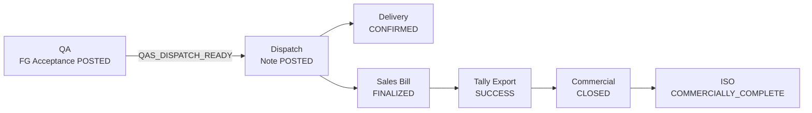
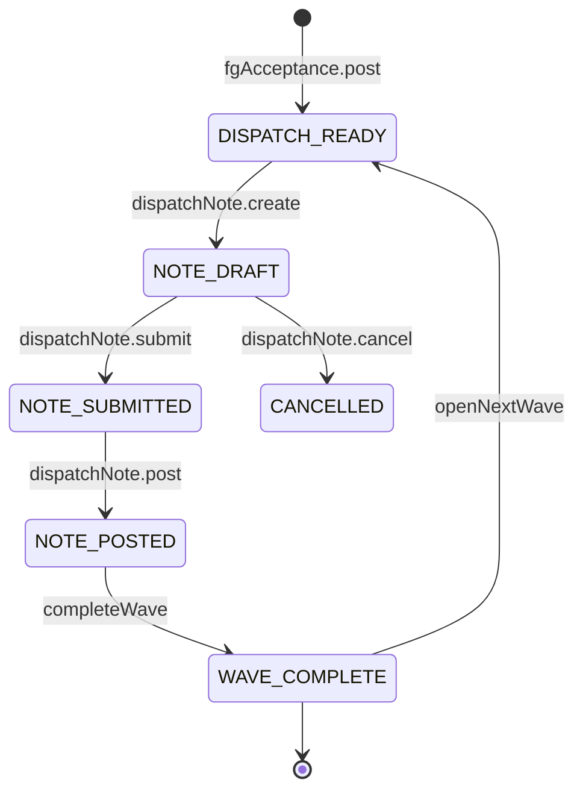
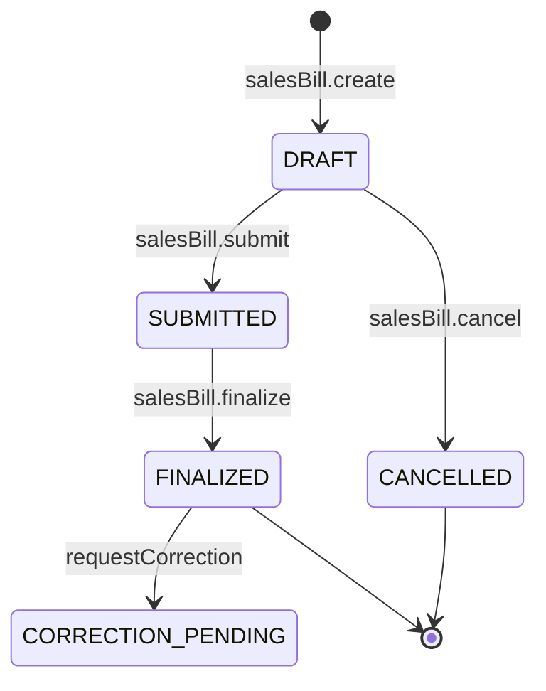
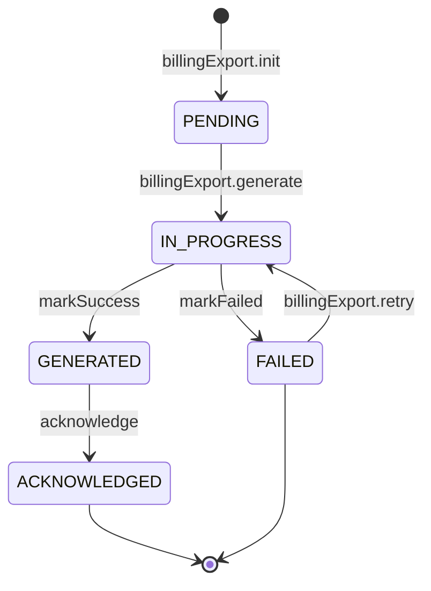
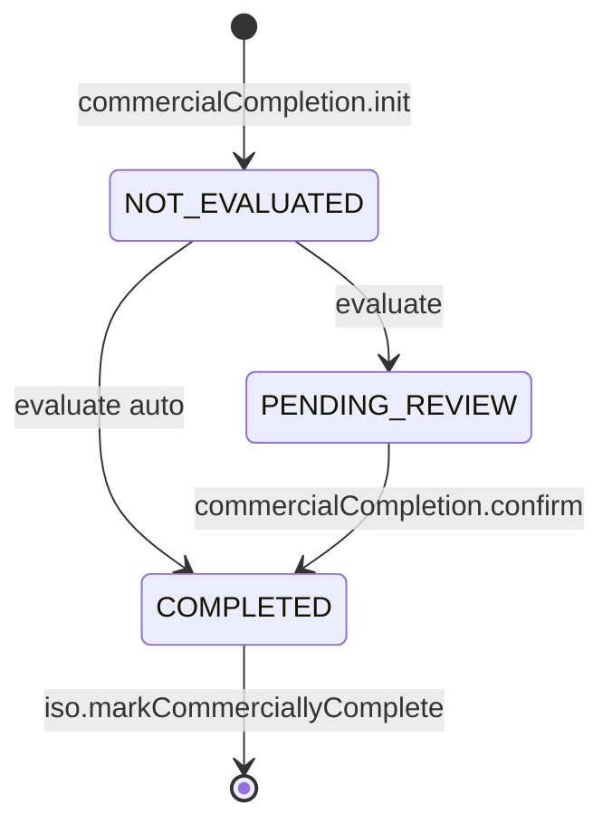
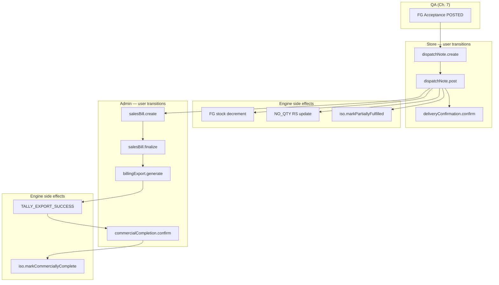

# Dispatch & Billing Workflow State Machine

| Field | Value |
|-------|-------|
| **Document ID** | FT-PD-047 |
| **Volume** | 4 — Workflow Engine |
| **Chapter** | 8 — Dispatch & Billing Workflow State Machine |
| **Title** | Dispatch & Billing Workflow State Machine |
| **Version** | 1.0.0 |
| **Status** | Draft — Architecture Review |
| **Effective date** | 2026-05-29 |
| **Author** | FT ERP Product Team |
| **Owner** | FT ERP Product Architecture |
| **Audience** | Workflow engineers, backend leads, Store/Admin process owners |
| **Classification** | Product — Workflow Engine Contract |

**Parent documents:**

- [Chapter 1 — Workflow Engine Overview & Pending Actions Contract](./Chapter_01_Workflow_Engine_Overview_and_Pending_Actions_Contract.md)
- [Chapter 2 — Transition Guards & Cross-Domain Dependency Catalog](./Chapter_02_Transition_Guards_and_Cross_Domain_Dependency_Catalog.md)
- [Chapter 3 — Commercial Workflow State Machine](./Chapter_03_Commercial_Workflow_State_Machine.md)
- [Chapter 7 — Quality Assurance Workflow State Machine](./Chapter_07_Quality_Assurance_Workflow_State_Machine.md)
- [Volume 3, Chapter 6 — Dispatch & Billing Domain Specification](../03_Domain_Specifications/Chapter_06_Dispatch_and_Billing_Domain_Specification.md)
- [Volume 2, Chapter 4 — Manufacturing Execution Pipeline](../02_Business_Architecture/Chapter_04_Manufacturing_Execution_Pipeline.md)

---

## 1. Document Control

| Version | Date | Author | Summary |
|---------|------|--------|---------|
| 1.0.0 | 2026-05-29 | FT ERP Product Team | Initial Dispatch & Billing workflow State Machines and transition tables |

**Supersedes:** None.

**Change authority:** Product Architecture. Dispatch eligibility or billing ownership changes require Volume 3 Ch. 6 alignment; new Guards reference [FT-PD-041](./Chapter_02_Transition_Guards_and_Cross_Domain_Dependency_Catalog.md) only.

**Out of scope:** Guard semantics (FT-PD-041), QA inspection (Ch. 7), database, API, UI, Purchase Bill.

---

## 2. Purpose

This chapter defines the **executable workflow State Machines** for the **Dispatch & Billing domain**: Dispatch (process), Delivery Confirmation, Sales Bill, Tally Export, and Commercial Closure.

Execution **begins** when QA posts FG Acceptance and materializes `QAS_DISPATCH_READY` ([Ch. 7](./Chapter_07_Quality_Assurance_Workflow_State_Machine.md)) and **ends** with **Commercial Closure** — ISO `COMMERCIALLY_COMPLETE`, successful billing, and Tally export per policy.

Guard **definitions** are not repeated—only **Guard IDs** and **execution order** per transition.

---

## 3. Scope

### 3.1 In scope

- Five dispatch/billing workflow artifacts (§5)
- Dispatch Note transitions (within Dispatch process)
- Transition tables with Guard IDs, Pending Actions, domain audit event codes (§9)
- User vs engine vs cross-domain events (§7)
- Store vs Admin role separation
- NO_QTY RS balance / planning signals on dispatch post
- **Identical execution** for REGULAR and NO_QTY after FG Acceptance ([DSP-15](../03_Domain_Specifications/Chapter_06_Dispatch_and_Billing_Domain_Specification.md))

### 3.2 Out of scope

- FG Acceptance posting ([Ch. 7](./Chapter_07_Quality_Assurance_Workflow_State_Machine.md))
- Enquiry → ISO commercial chain ([Ch. 3](./Chapter_03_Commercial_Workflow_State_Machine.md)) — except ISO balance consumption
- Formal reversal workflows (future volume)
- Accounts Optional Module UI (noted where additive)

### 3.3 Actor roles

| Role | Dispatch & Billing transitions |
|------|-------------------------------|
| **Store** | Dispatch preparation; Dispatch Note create/submit/post; Delivery Confirmation (standard) |
| **Admin** | Sales Bill create/submit/finalize/cancel; Tally Export; Commercial Closure confirm |
| **Engine** | FG stock decrement; ISO fulfillment marks; NO_QTY RS update; export idempotency; completion evaluate |
| **Accounts** | Optional — may execute `billingExport.generate` if configured; does not replace Admin ownership |

---

## 4. Relationship with Previous Volumes

| Volume | Relationship |
|--------|--------------|
| **Vol. 2, Ch. 4** | Fulfillment arc §11–12; NO_QTY cycle continuation after dispatch |
| **Vol. 3, Ch. 1** | ISO `PARTIALLY_FULFILLED` / `COMMERCIALLY_COMPLETE` |
| **Vol. 3, Ch. 5** | FG Acceptance → dispatch eligibility ([DSP-01](../03_Domain_Specifications/Chapter_06_Dispatch_and_Billing_Domain_Specification.md)) |
| **Vol. 3, Ch. 6** | Authoritative states, `DSP_*` Pending Actions, DSP Business Rules |
| **Vol. 4, Ch. 2** | `GRD_DSP_*`, `GRD_BL_*`, `GRD_XDM_*` guards |
| **Vol. 4, Ch. 7** | Entry: `fgAcceptance.post` → `QAS_DISPATCH_READY` |

### 4.1 How Dispatch consumes QA output and completes fulfillment

| Stage | Domain | Accountability |
|-------|--------|----------------|
| **QA Accepted FG** | QA (complete) | Only accepted qty dispatch-eligible |
| **Dispatch** | Dispatch & Billing | Store posts shipment; stock decrement |
| **Delivery** | Dispatch & Billing | Confirms physical delivery (policy) |
| **Billing** | Dispatch & Billing | Admin invoices posted dispatch only |
| **Tally Export** | Dispatch & Billing | Idempotent accounting payload |
| **Commercial Closure** | Dispatch & Billing → Commercial | ISO lifecycle terminus |

**Customer fulfillment lifecycle:** Enquiry → … → Production → QA → **this chapter** → Commercial Completion.

---

## 5. State Machines

### 5.1 Dispatch (process)

| Attribute | Value |
|-----------|-------|
| **Document type** | `dispatchCase` |
| **Purpose** | Shipment wave orchestration from dispatch-ready FG to posted Dispatch Note |
| **Initial state** | `DISPATCH_READY` |
| **Terminal state** | `WAVE_COMPLETE` (per shipment wave) |
| **Primary owner** | Store |
| **Child document** | `dispatchNote` |

**States:** `DISPATCH_READY` · `IN_PREPARATION` · `NOTE_DRAFT` · `NOTE_SUBMITTED` · `NOTE_POSTED` · `WAVE_COMPLETE`

**Entry:** `fgAcceptance.post` (QA) materializes `QAS_DISPATCH_READY` / `DSP_PREP`.

**Exit:** `dispatchCase.completeWave` when note posted and delivery policy satisfied.

**Pending Actions:** `DSP_PREP`, `DSP_NOTE_DRAFT`, `DSP_NOTE_POST`, `DSP_PARTIAL`, `DSP_CONTINUE`

**Guard IDs:** `GRD_DSP_FG_ACCEPTED`, `GRD_DSP_QTY_ACCEPTED`, `GRD_DSP_ISO_BALANCE`, `GRD_DSP_SCHEDULE_BALANCE`, `GRD_DSP_ISO_CANCELLED`, `GRD_XDM_ROLE_DISPATCH`, `GRD_XDM_CUSTOMER_PO_AUTH`

---

### 5.2 Delivery Confirmation

| Attribute | Value |
|-----------|-------|
| **Document type** | `deliveryConfirmation` |
| **Purpose** | Acknowledge physical delivery / in-transit completion before commercial readiness (policy) |
| **Initial state** | `PENDING` |
| **Terminal state** | `CONFIRMED` |
| **Primary owner** | Store (standard) |
| **Parent** | Posted `dispatchNote` |

**States:** `PENDING` · `CONFIRMED` · `WAIVED` (policy — auto-confirm on post)

**Entry:** Engine on `dispatchNote.post` → `deliveryConfirmation.init`.

**Exit:** `deliveryConfirmation.confirm` → billing eligibility unlocked (when policy requires).

**Pending Actions:** None dedicated — surfaced via `DSP_BILL_CREATE` gating when policy on.

---

### 5.3 Sales Bill

| Attribute | Value |
|-----------|-------|
| **Document type** | `salesBill` |
| **Purpose** | Commercial invoice for dispatched FG |
| **Initial state** | `DRAFT` |
| **Terminal states** | `FINALIZED`, `CANCELLED` |
| **Primary owner** | Admin |

**States:** `DRAFT` · `SUBMITTED` · `FINALIZED` · `CORRECTION_PENDING` (optional) · `CANCELLED`

**Entry:** `salesBill.create` from posted Dispatch Note(s).

**Exit:** `salesBill.finalize` → Tally Export eligible.

**Pending Actions:** `DSP_BILL_CREATE`, `DSP_BILL_FINAL`

**Guard IDs:** `GRD_BL_DISPATCH_POSTED`, `GRD_BL_QTY_DISPATCHED`, `GRD_XDM_ROLE_BILLING`, `GRD_XDM_CUSTOMER_PO_AUTH`

---

### 5.4 Tally Export (Billing Export)

| Attribute | Value |
|-----------|-------|
| **Document type** | `billingExport` |
| **Purpose** | Idempotent Tally / accounting integration payload from finalized Sales Bill |
| **Initial state** | `PENDING` |
| **Terminal states** | `ACKNOWLEDGED`, `FAILED` |
| **Primary owner** | Admin (standard) |

**States:** `PENDING` · `IN_PROGRESS` · `GENERATED` · `ACKNOWLEDGED` · `FAILED`

**Entry:** `billingExport.init` on `salesBill.finalize` (engine).

**Exit:** `billingExport.acknowledge` → Commercial Closure evaluate.

**Pending Actions:** `DSP_EXPORT`, `DSP_EXPORT_RETRY`

**Guard IDs:** `GRD_BL_FINALIZED`, `GRD_BL_DRAFT_EXPORT`

**Idempotency:** Re-generate with same `(salesBillId, exportRevision)` returns existing success payload — no duplicate ledger post ([DSPWF-09](#10-business-rules)).

---

### 5.5 Commercial Closure

| Attribute | Value |
|-----------|-------|
| **Document type** | `commercialCompletion` |
| **Purpose** | Milestone — contractual obligations satisfied; ISO commercial terminus |
| **Initial state** | `NOT_EVALUATED` |
| **Terminal state** | `COMPLETED` |
| **Primary owner** | Admin (confirm); Engine (evaluate) |

**States:** `NOT_EVALUATED` · `PENDING_REVIEW` · `COMPLETED`

**Entry:** Engine evaluate after export success + policy thresholds.

**Exit:** `commercialCompletion.confirm` → `iso.markCommerciallyComplete` ([Ch. 3](./Chapter_03_Commercial_Workflow_State_Machine.md) §6.4).

**Pending Actions:** `DSP_COMM_COMPLETE`

**Guard IDs:** `GRD_BL_COMPLETE_POLICY`

---

## 6. Transition Tables

Guard order is **top-to-bottom**. First failure stops transition ([FT-PD-041](./Chapter_02_Transition_Guards_and_Cross_Domain_Dependency_Catalog.md) GRD-04).

### 6.1 Dispatch (process) and Dispatch Note transitions

| Current state | User action | Actor | Guard IDs (order) | Next state | Pending Action | Audit event |
|---------------|-------------|-------|-------------------|------------|----------------|-------------|
| — | `dispatchCase.open` | Engine | — (`fgAcceptance.post`) | `DISPATCH_READY` | `DSP_PREP` | — |
| `DISPATCH_READY` | `dispatchNote.create` | Store | `GRD_DSP_FG_ACCEPTED`, `GRD_DSP_ISO_CANCELLED`, `GRD_XDM_CUSTOMER_PO_AUTH` | `NOTE_DRAFT` | `DSP_NOTE_DRAFT` (resolves `DSP_PREP`) | `DISPATCH_CREATED` |
| `NOTE_DRAFT` | `dispatchNote.line.save` | Store | `GRD_DSP_QTY_ACCEPTED`, `GRD_DSP_ISO_CANCELLED` | `NOTE_DRAFT` | `DSP_NOTE_POST` | `Submitted` |
| `NOTE_DRAFT` | `dispatchNote.submit` | Store | `GRD_DSP_QTY_ACCEPTED` | `NOTE_SUBMITTED` | `DSP_NOTE_POST` | `Submitted` |
| `NOTE_SUBMITTED` | `dispatchNote.post` | Store | `GRD_DSP_ISO_BALANCE`, `GRD_DSP_SCHEDULE_BALANCE`, `GRD_DSP_ISO_CANCELLED`, `GRD_XDM_ROLE_DISPATCH`, `GRD_XDM_CUSTOMER_PO_AUTH` | `NOTE_POSTED` | `DSP_BILL_CREATE`; `DSP_PARTIAL` if FG remains | `DISPATCH_POSTED` |
| `NOTE_POSTED` | `dispatchCase.completeWave` | Engine | — | `WAVE_COMPLETE` | `DSP_CONTINUE` if balance remains | `DISPATCH_COMPLETED` |
| `WAVE_COMPLETE` | `dispatchCase.openNextWave` | Engine | — | `DISPATCH_READY` | `DSP_PREP` | — |
| `NOTE_DRAFT` | `dispatchNote.cancel` | Store | — | `CANCELLED` | Restores `DSP_PREP` | `Cancelled` |

**Side effects on `dispatchNote.post`:**

| Effect | Type | Target |
|--------|------|--------|
| FG stock decrement (dispatch-eligible) | Engine | Inventory |
| `deliveryConfirmation.init` | Engine | Delivery Confirmation |
| `QAS_DISPATCH_READY` partial resolve | Cross-domain | QA monitor |
| `iso.markPartiallyFulfilled` | Cross-domain | Commercial ISO |
| RS balance update (NO_QTY) | Cross-domain | Planning |
| `PLN_RS_CONTINUE` materialize | Cross-domain | Planning |

---

### 6.2 Delivery Confirmation transitions

| Current state | User action | Actor | Guard IDs | Next state | Pending Action | Audit event |
|---------------|-------------|-------|-----------|------------|----------------|-------------|
| — | `deliveryConfirmation.init` | Engine | — (on `dispatchNote.post`) | `PENDING` | — | `Created` |
| `PENDING` | `deliveryConfirmation.confirm` | Store | — | `CONFIRMED` | Unblocks `DSP_BILL_CREATE` (policy) | `Completed` |
| `PENDING` | `deliveryConfirmation.waive` | Engine | — (policy auto) | `WAIVED` | — | `Completed` |

*When policy waives delivery step, `deliveryConfirmation.waive` runs in same transaction as `dispatchNote.post`.*

---

### 6.3 Sales Bill transitions

| Current state | User action | Actor | Guard IDs (order) | Next state | Pending Action | Audit event |
|---------------|-------------|-------|-------------------|------------|----------------|-------------|
| — | `salesBill.create` | Admin | `GRD_BL_DISPATCH_POSTED`, `GRD_XDM_ROLE_BILLING`, `GRD_XDM_CUSTOMER_PO_AUTH` | `DRAFT` | `DSP_BILL_FINAL` | `SALES_BILL_CREATED` |
| `DRAFT` | `salesBill.line.save` | Admin | `GRD_BL_QTY_DISPATCHED` | `DRAFT` | — | `Submitted` |
| `DRAFT` | `salesBill.submit` | Admin | `GRD_BL_QTY_DISPATCHED` | `SUBMITTED` | `DSP_BILL_FINAL` | `Submitted` |
| `SUBMITTED` | `salesBill.finalize` | Admin | `GRD_BL_QTY_DISPATCHED` | `FINALIZED` | `DSP_EXPORT` (resolves `DSP_BILL_FINAL`) | `SALES_BILL_FINALIZED` |
| `DRAFT` | `salesBill.cancel` | Admin | — | `CANCELLED` | — | `SALES_BILL_CANCELLED` |
| `FINALIZED` | `salesBill.requestCorrection` | Admin | — (controlled policy) | `CORRECTION_PENDING` | — | `Submitted` |

**Regeneration rule:** New `salesBill.create` from same dispatch requires prior bill `CANCELLED` or correction workflow complete — no silent overwrite.

**Cancellation:** Draft cancel only in standard product; post-finalize uses correction/credit path ([Vol. 3 Ch. 6](../03_Domain_Specifications/Chapter_06_Dispatch_and_Billing_Domain_Specification.md) §8.6).

---

### 6.4 Tally Export transitions

| Current state | User action | Actor | Guard IDs (order) | Next state | Pending Action | Audit event |
|---------------|-------------|-------|-------------------|------------|----------------|-------------|
| — | `billingExport.init` | Engine | — (on `salesBill.finalize`) | `PENDING` | `DSP_EXPORT` | `Created` |
| `PENDING` | `billingExport.generate` | Admin | `GRD_BL_FINALIZED`, `GRD_BL_DRAFT_EXPORT` | `IN_PROGRESS` | — | `TALLY_EXPORT_STARTED` |
| `IN_PROGRESS` | `billingExport.markSuccess` | Engine | — | `GENERATED` | `DSP_COMM_COMPLETE` evaluate | `TALLY_EXPORT_SUCCESS` |
| `IN_PROGRESS` | `billingExport.markFailed` | Engine | — | `FAILED` | `DSP_EXPORT_RETRY` | `TALLY_EXPORT_FAILED` |
| `FAILED` | `billingExport.retry` | Admin | `GRD_BL_FINALIZED` | `IN_PROGRESS` | Resolves `DSP_EXPORT_RETRY` | `TALLY_EXPORT_STARTED` |
| `GENERATED` | `billingExport.acknowledge` | Admin | — | `ACKNOWLEDGED` | — | `Completed` |

**Idempotency:** `billingExport.generate` with existing successful `exportRevision` → `TALLY_EXPORT_SUCCESS` without duplicate external post.

**Reconciliation:** `billingExport.acknowledge` records external import confirmation; optional Accounts module (`DSP_RECON`) additive only.

---

### 6.5 Commercial Closure transitions

| Current state | User action | Actor | Guard IDs (order) | Next state | Pending Action | Audit event |
|---------------|-------------|-------|-------------------|------------|----------------|-------------|
| — | `commercialCompletion.init` | Engine | — | `NOT_EVALUATED` | — | `Created` |
| `NOT_EVALUATED` | `commercialCompletion.evaluate` | Engine | — | `PENDING_REVIEW` \| `COMPLETED` | `DSP_COMM_COMPLETE` (if pending) | `Submitted` |
| `PENDING_REVIEW` | `commercialCompletion.confirm` | Admin | `GRD_BL_COMPLETE_POLICY` | `COMPLETED` | — (resolves `DSP_COMM_COMPLETE`) | `COMMERCIAL_CLOSED` |
| `COMPLETED` | `iso.markCommerciallyComplete` | Engine | `GRD_BL_COMPLETE_POLICY` | — (ISO → `COMMERCIALLY_COMPLETE`) | — | `Completed` |

**Side effect on `commercialCompletion.confirm`:** ISO commercial terminus; fulfillment arc audit closure ([DSP-06](../03_Domain_Specifications/Chapter_06_Dispatch_and_Billing_Domain_Specification.md)).

---

## 7. Dispatch & Billing Workflow Behavior

### 7.1 User transitions vs engine side effects vs cross-domain events

| Category | Examples | Actor |
|----------|----------|-------|
| **User transitions** | `dispatchNote.post`, `deliveryConfirmation.confirm`, `salesBill.finalize`, `billingExport.retry`, `commercialCompletion.confirm` | Store / Admin |
| **Engine side effects** | Stock decrement, `billingExport.init`, export success/fail, `commercialCompletion.evaluate`, idempotent export | Engine |
| **Cross-domain events** | `fgAcceptance.post` → entry; `iso.markPartiallyFulfilled`; NO_QTY RS update; `iso.markCommerciallyComplete` | Multi-domain |

### 7.2 Dispatch

| Topic | Behavior |
|-------|----------|
| **Creation** | `dispatchNote.create` only on QA-accepted FG ([`GRD_DSP_FG_ACCEPTED`](./Chapter_02_Transition_Guards_and_Cross_Domain_Dependency_Catalog.md)) |
| **Partial dispatch** | Post qty < accepted pool → `DSP_PARTIAL` / `DSP_CONTINUE` |
| **Multiple dispatches** | Many notes per ISO line until balance exhausted ([DSP-11](../03_Domain_Specifications/Chapter_06_Dispatch_and_Billing_Domain_Specification.md)) |
| **Completion** | `DISPATCH_POSTED` per wave; `DISPATCH_COMPLETED` on wave close |

**Balance guards:** REGULAR → `GRD_DSP_ISO_BALANCE`; NO_QTY → `GRD_DSP_SCHEDULE_BALANCE`.

### 7.3 Delivery

| State | Meaning |
|-------|---------|
| **Pending delivery** | `deliveryConfirmation.PENDING` after post |
| **Delivery confirmation** | Store confirms physical delivery |
| **Commercial readiness** | `CONFIRMED` or `WAIVED` → `DSP_BILL_CREATE` eligible |

### 7.4 Sales Billing

| Phase | Transition | Owner |
|-------|------------|-------|
| **Bill creation** | `salesBill.create` from posted dispatch | Admin |
| **Draft** | Line edit with `GRD_BL_QTY_DISPATCHED` | Admin |
| **Finalization** | `salesBill.finalize` → export eligible | Admin |
| **Cancellation** | `salesBill.cancel` draft only; commercial guard rules for post-finalize | Admin |

**Rule:** Billing **always follows dispatch** ([DSP-04](../03_Domain_Specifications/Chapter_06_Dispatch_and_Billing_Domain_Specification.md)).

### 7.5 Tally Export

| Phase | Audit | Pending Action |
|-------|-------|----------------|
| Initiate | `TALLY_EXPORT_STARTED` | — |
| Success | `TALLY_EXPORT_SUCCESS` | Triggers completion evaluate |
| Failure | `TALLY_EXPORT_FAILED` | `DSP_EXPORT_RETRY` |
| Retry | `TALLY_EXPORT_STARTED` | Resolves retry PA |
| Reconciliation | `billingExport.acknowledge` | Optional `DSP_RECON` |

### 7.6 Commercial Closure

| Step | Behavior |
|------|----------|
| **Sales Order completion** | Cumulative dispatch + billing vs ISO/agreement thresholds |
| **Workflow completion** | All waves billed and exported per policy |
| **Final audit closure** | `COMMERCIAL_CLOSED` + ISO `COMMERCIALLY_COMPLETE` |

Commercial closure **only after** successful billing and export per configured thresholds ([DSP-06](../03_Domain_Specifications/Chapter_06_Dispatch_and_Billing_Domain_Specification.md)).

### 7.7 NO_QTY planning signal (cross-domain)

On `dispatchNote.post` (NO_QTY):

- RS fulfilled qty increases
- `PLN_RS_CONTINUE` may materialize
- Agreement continues until Commercial Closure — cycles iterate

---

## 8. Pending Action Materialization

### 8.1 Store Pending Actions

| Action ID | Materializes when | Resolves when |
|-----------|-------------------|---------------|
| `DSP_PREP` | FG Acceptance posted; dispatch-eligible qty | `dispatchNote.create` |
| `DSP_NOTE_DRAFT` | Dispatch case in preparation | `dispatchNote.submit` |
| `DSP_NOTE_POST` | Dispatch Note `SUBMITTED` | `dispatchNote.post` |
| `DSP_PARTIAL` | Posted note; accepted FG remains | Next dispatch wave or balance zero |
| `DSP_CONTINUE` | Wave complete; ISO/schedule balance remains | Next `dispatchNote.create` |

**Owner:** `ownerRole = Store`.

**Alias mapping (prompt):** *Dispatch Pending* = `DSP_PREP`; *Continue Dispatch* = `DSP_CONTINUE` / `DSP_PARTIAL`.

### 8.2 Admin / Accounts Pending Actions

| Action ID | Materializes when | Resolves when |
|-----------|-------------------|---------------|
| `DSP_BILL_CREATE` | Dispatch Note posted; no Sales Bill | `salesBill.create` |
| `DSP_BILL_FINAL` | Sales Bill `SUBMITTED` | `salesBill.finalize` |
| `DSP_EXPORT` | Sales Bill `FINALIZED` | `billingExport.markSuccess` |
| `DSP_EXPORT_RETRY` | Export `FAILED` | `billingExport.retry` success |
| `DSP_COMM_COMPLETE` | Thresholds met; export success | `commercialCompletion.confirm` |

**Owner:** `ownerRole = Admin` (Accounts additive for `DSP_EXPORT_ACC` per Vol. 3 §10.3).

**Alias mapping:** *Sales Bill Pending* = `DSP_BILL_CREATE` / `DSP_BILL_FINAL`; *Export Pending* = `DSP_EXPORT`; *Commercial Closure Pending* = `DSP_COMM_COMPLETE`.

### 8.3 QA handoff resolution

| Action ID | Resolves when |
|-----------|---------------|
| `QAS_DISPATCH_READY` | First `dispatchNote.post` consuming FG (or accepted pool zero) |

### 8.4 Escalation

| Action ID | SLA hint | Escalation |
|-----------|----------|------------|
| `DSP_PREP` | 2 business days FG posted | Priority → `HIGH` |
| `DSP_NOTE_POST` | 1 business day submitted | Store dispatch KPI |
| `DSP_BILL_CREATE` | 3 business days post-dispatch | Admin billing backlog |
| `DSP_EXPORT_RETRY` | 4 hours failed | Priority → `CRITICAL` |
| `DSP_COMM_COMPLETE` | 5 business days pending | Control Tower commercial risk |

### 8.5 Resolution and automatic removal

1. **Engine recompute only** — UI never deletes ([WFE-02](./Chapter_01_Workflow_Engine_Overview_and_Pending_Actions_Contract.md)).
2. **Partial dispatch** — `DSP_PARTIAL` persists until balance exhausted.
3. **Export failure** — `DSP_EXPORT_RETRY` materializes; auto-removes on success.
4. **Commercial closure** — `DSP_COMM_COMPLETE` resolves on `commercialCompletion.confirm`.
5. **Automatic removal** — when trigger condition false (e.g. bill finalized → `DSP_BILL_FINAL` gone).

---

## 9. Audit Events

### 9.1 Dispatch & Billing audit event catalog

Domain-specific codes map to **primary WFE events** per [WFE-06](./Chapter_01_Workflow_Engine_Overview_and_Pending_Actions_Contract.md).

| Domain audit code | Primary WFE event | Emitted on |
|-------------------|-------------------|------------|
| `DISPATCH_CREATED` | `Created` | `dispatchNote.create` |
| `DISPATCH_POSTED` | `Completed` | `dispatchNote.post` |
| `DISPATCH_COMPLETED` | `Completed` | `dispatchCase.completeWave` |
| `SALES_BILL_CREATED` | `Created` | `salesBill.create` |
| `SALES_BILL_FINALIZED` | `Approved` | `salesBill.finalize` |
| `SALES_BILL_CANCELLED` | `Cancelled` | `salesBill.cancel` |
| `TALLY_EXPORT_STARTED` | `Submitted` | `billingExport.generate` / `retry` |
| `TALLY_EXPORT_SUCCESS` | `Completed` | `billingExport.markSuccess` |
| `TALLY_EXPORT_FAILED` | `Rejected` | `billingExport.markFailed` |
| `COMMERCIAL_CLOSED` | `Completed` | `commercialCompletion.confirm` |

**Standard WFE events also used:** `Submitted`, `Cancelled`, `GuardBlocked`.

**Audit payload (required):** `internalSalesOrderId`, `dispatchNoteId`, `salesBillId`, `billingExportId`, `fgAcceptanceId`, `businessModel`, `demandPool` (if applicable), `correlationId` (root Enquiry).

---

## 10. Business Rules

| ID | Rule |
|----|------|
| **DSPWF-01** | **No skipped states** — only transitions in §6 permitted. |
| **DSPWF-02** | **Guards execute before transition** per ordered list. |
| **DSPWF-03** | **Failed Guards leave state unchanged.** |
| **DSPWF-04** | **Dispatch uses only QA-accepted FG** — `GRD_DSP_FG_ACCEPTED` ([DSP-01](../03_Domain_Specifications/Chapter_06_Dispatch_and_Billing_Domain_Specification.md)). |
| **DSPWF-05** | **Dispatch cannot exceed accepted FG** — `GRD_DSP_QTY_ACCEPTED` ([DSP-02](../03_Domain_Specifications/Chapter_06_Dispatch_and_Billing_Domain_Specification.md)). |
| **DSPWF-06** | **Dispatch cannot exceed SO/schedule balance** — `GRD_DSP_ISO_BALANCE`, `GRD_DSP_SCHEDULE_BALANCE` ([DSP-03](../03_Domain_Specifications/Chapter_06_Dispatch_and_Billing_Domain_Specification.md)). |
| **DSPWF-07** | **Partial dispatch supported** — multiple waves ([DSP-11](../03_Domain_Specifications/Chapter_06_Dispatch_and_Billing_Domain_Specification.md)). |
| **DSPWF-08** | **Multiple dispatches allowed** per ISO line / cycle. |
| **DSPWF-09** | **Tally export is idempotent** — same revision returns success without duplicate external post. |
| **DSPWF-10** | **Sales Bill references posted dispatch only** — `GRD_BL_DISPATCH_POSTED` ([DSP-04](../03_Domain_Specifications/Chapter_06_Dispatch_and_Billing_Domain_Specification.md)). |
| **DSPWF-11** | **Bill qty ≤ dispatched qty** — `GRD_BL_QTY_DISPATCHED` ([DSP-12](../03_Domain_Specifications/Chapter_06_Dispatch_and_Billing_Domain_Specification.md)). |
| **DSPWF-12** | **Sales Bill cancellation** — draft cancel; post-finalize via controlled correction ([Vol. 3 Ch. 6](../03_Domain_Specifications/Chapter_06_Dispatch_and_Billing_Domain_Specification.md) §8.6). |
| **DSPWF-13** | **Failed export generates retry Pending Action** — `DSP_EXPORT_RETRY`. |
| **DSPWF-14** | **Commercial closure only after billing + export** — `GRD_BL_COMPLETE_POLICY` ([DSP-06](../03_Domain_Specifications/Chapter_06_Dispatch_and_Billing_Domain_Specification.md)). |
| **DSPWF-15** | **Store never creates Sales Bill** — `GRD_XDM_ROLE_BILLING` ([DSP-08](../03_Domain_Specifications/Chapter_06_Dispatch_and_Billing_Domain_Specification.md)). |
| **DSPWF-16** | **Admin never posts Dispatch Note** (standard) — `GRD_XDM_ROLE_DISPATCH`. |
| **DSPWF-17** | **REGULAR and NO_QTY share identical dispatch/billing execution** — balance guard differs only ([DSP-15](../03_Domain_Specifications/Chapter_06_Dispatch_and_Billing_Domain_Specification.md)). |
| **DSPWF-18** | **Customer PO never authorizes dispatch or billing** — `GRD_XDM_CUSTOMER_PO_AUTH` ([DSP-09](../03_Domain_Specifications/Chapter_06_Dispatch_and_Billing_Domain_Specification.md)). |
| **DSPWF-19** | **NO_QTY dispatch updates RS balance** — engine side effect on post ([DSP-07](../03_Domain_Specifications/Chapter_06_Dispatch_and_Billing_Domain_Specification.md)). |

*Operational rules DSP-01–DSP-16 in Volume 3 Ch. 6 remain authoritative; DSPWF rules are engine enforcement.*

---

## 11. State Machine Diagrams

### 11.1 Dispatch (process + Dispatch Note)

### 11.2 Sales Bill

### 11.3 Tally Export

### 11.4 Commercial Closure

### 11.5 Overall Dispatch → Billing workflow

**Legend:** Solid arrows = typical happy path; engine nodes run automatically on triggering transitions.

---

## 12. Review Checklist

- [ ] Implements Volume 3 Ch. 6 states without redefining semantics
- [ ] Guard IDs reference FT-PD-041 only
- [ ] Dispatch lifecycle complete (create → post → wave complete)
- [ ] Billing lifecycle complete (create → finalize → export → closure)
- [ ] Pending Action generation Store / Admin documented
- [ ] Audit event catalog §9.1 complete
- [ ] QA → Dispatch → Billing → Commercial continuity
- [ ] Cross-domain: ISO fulfillment, NO_QTY RS, `QAS_DISPATCH_READY` resolution
- [ ] User vs engine transitions separated in §7 and diagrams
- [ ] Commercial closure integrity (`GRD_BL_COMPLETE_POLICY`)
- [ ] Five Mermaid diagrams
- [ ] No database, API, UI implementation

---

## 13. Change Log

| Version | Date | Author | Summary |
|---------|------|--------|---------|
| 1.0.0 | 2026-05-29 | FT ERP Product Team | Initial Dispatch & Billing Workflow Engine implementation |

---

## 14. Approval Block

| Role | Name | Signature | Date |
|------|------|-----------|------|
| Product Owner | | | |
| Product Architecture | | | |
| Workflow Engineering Lead | | | |
| Store Process Owner | | | |
| Admin / Commercial Process Owner | | | |
| Accounts Process Owner | | | |

---

## Document navigation

| | Link |
|--|------|
| **Previous** | [Quality Assurance Workflow State Machine](./Chapter_07_Quality_Assurance_Workflow_State_Machine.md) (FT-PD-046) |
| **Next** | [Cross-Domain Workflow Orchestration & Event Coordination](./Chapter_09_Cross_Domain_Workflow_Orchestration_and_Event_Coordination.md) (FT-PD-048) |
| **Volume** | [Workflow Engine](./README.md) |
| **Product** | [Product Documentation Index](../README.md) |

