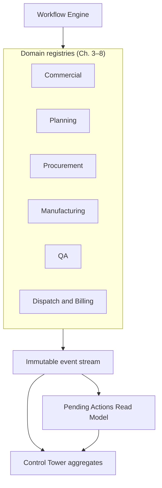
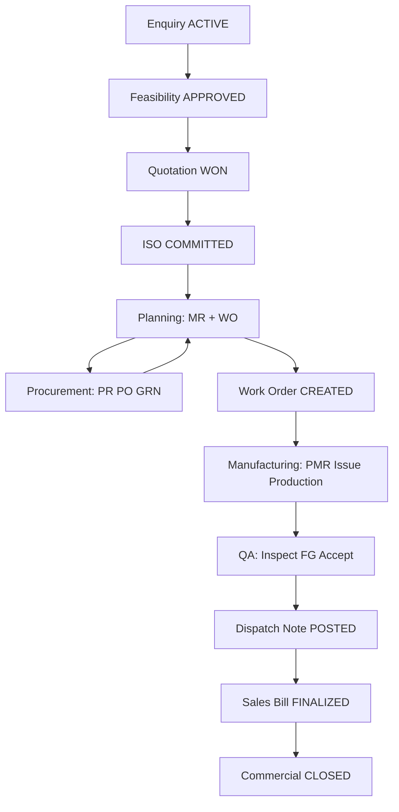
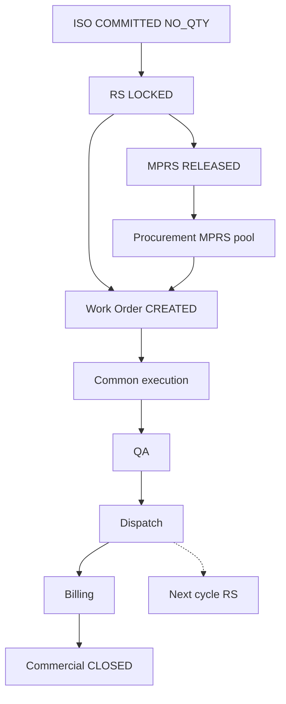
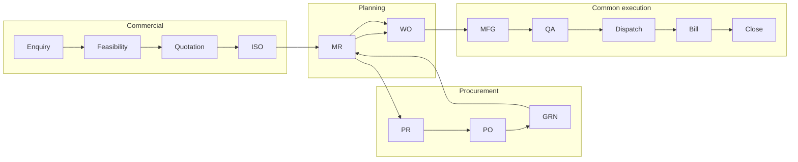
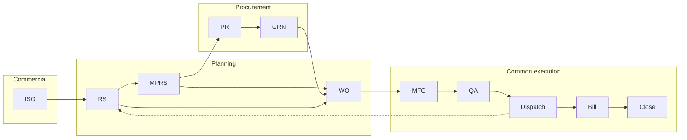
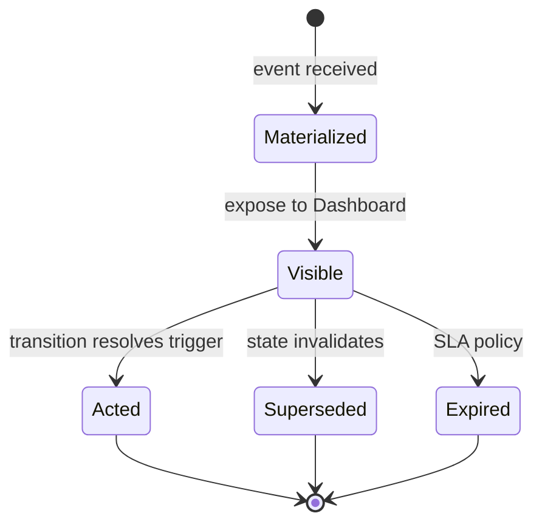
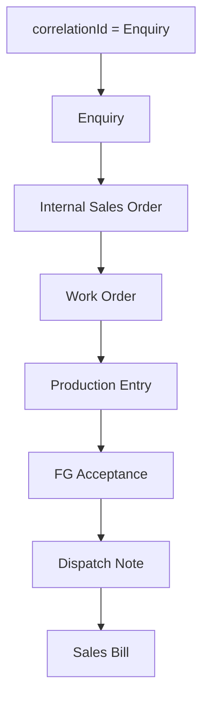

# Cross-Domain Workflow Orchestration & Event Coordination

| Field | Value |
|-------|-------|
| **Document ID** | FT-PD-048 |
| **Volume** | 4 — Workflow Engine |
| **Chapter** | 9 — Cross-Domain Workflow Orchestration & Event Coordination |
| **Title** | Cross-Domain Workflow Orchestration & Event Coordination |
| **Version** | 1.0.0 |
| **Status** | Draft — Architecture Review |
| **Effective date** | 2026-05-29 |
| **Author** | FT ERP Product Team |
| **Owner** | FT ERP Product Architecture |
| **Audience** | Workflow engineers, architects, backend leads, Control Tower owners |
| **Classification** | Product — Workflow Engine Contract |

**Parent documents:**

- [Chapter 1 — Workflow Engine Overview & Pending Actions Contract](./Chapter_01_Workflow_Engine_Overview_and_Pending_Actions_Contract.md)
- [Chapter 2 — Transition Guards & Cross-Domain Dependency Catalog](./Chapter_02_Transition_Guards_and_Cross_Domain_Dependency_Catalog.md)
- [Chapters 3–8 — Domain State Machines](./README.md)
- [Volume 2 — Business Architecture](../02_Business_Architecture/README.md)
- [Volume 3 — Domain Specifications](../03_Domain_Specifications/README.md)

---

## 1. Document Control

| Version | Date | Author | Summary |
|---------|------|--------|---------|
| 1.0.0 | 2026-05-29 | FT ERP Product Team | Initial cross-domain orchestration, events, correlation, and Pending Action coordination |

**Supersedes:** None.

**Change authority:** Product Architecture. Orchestration contract changes require review of all domain State Machine chapters (Ch. 3–8).

**Out of scope:** Per-domain transition tables (Ch. 3–8), Guard semantics (Ch. 2), database, API, UI, implementation code.

---

## 2. Purpose

This chapter defines **how all ERP workflow domains collaborate** through the **Workflow Engine**.

It specifies:

- **Cross-domain orchestration** — REGULAR and NO_QTY end-to-end paths
- **Workflow correlation** — traceability from Enquiry to Commercial Closure
- **Event propagation** — publisher/consumer matrix
- **Pending Action coordination** — materialization, resolution, escalation across domains
- **Workflow ownership transfer** — role handoffs across the factory
- **Control Tower integration** — factory-wide Read Model over orchestration

This chapter **does not redefine** individual domain workflows. It defines **how Chapters 3–8 interact**.

---

## 3. Scope

### 3.1 In scope

- End-to-end orchestration diagrams and narratives (§5)
- Cross-domain event coordination and matrix (§6)
- Ownership transfer catalog (§7)
- Pending Action coordination rules (§8)
- Workflow correlation model (§9)
- Event taxonomy (§10)
- Orchestration Business Rules (§11)
- Mermaid diagrams (§12)
- Control Tower integration contract

### 3.2 Out of scope

- Document-specific states and transitions (Ch. 3–8)
- Guard definitions and `reasonCode` text (Ch. 2)
- Persistence schema (Volume 5)
- Screen layouts (Volume 6)
- HTTP/integration protocols (Volume 7)

### 3.3 Authority

| Layer | This chapter |
|-------|--------------|
| Domain State Machines (Ch. 3–8) | **Source** for per-document transitions |
| **This chapter (Ch. 9)** | **Source** for cross-domain orchestration only |
| Implementation | Must not bypass engine event bus or correlation model |

---

## 4. Relationship with Previous Volumes

| Volume | Relationship |
|--------|--------------|
| **Vol. 2, Ch. 1** | Business Model selection; document inheritance |
| **Vol. 2, Ch. 2–3** | REGULAR vs NO_QTY planning pipelines |
| **Vol. 2, Ch. 4** | Convergence at Work Order; common execution |
| **Vol. 2, Ch. 5** | Ownership matrix — basis for §7 transfers |
| **Vol. 3** | Domain artifacts, Pending Action ID catalogs |
| **Vol. 4, Ch. 1** | Engine contract, Pending Actions schema, WFE rules |
| **Vol. 4, Ch. 2** | Cross-domain guards (`GRD_XDM_*`) at integration points |
| **Vol. 4, Ch. 3–8** | Executable domain State Machines — **referenced, not repeated** |

### 4.1 One factory execution engine

All domains are **facets of one Workflow Engine instance** per factory tenant:



**Principle:** Domains **do not call each other directly**. They **publish events**; the engine **orchestrates** consumers, guard evaluation, Pending Action recompute, and correlation updates ([ORCH-05](#11-business-rules)).

---

## 5. End-to-End Workflow Orchestration

### 5.1 REGULAR Sales Order — complete path

| Step | Domain | Key transition / event | Chapter |
|------|--------|------------------------|---------|
| 1 | Commercial | `enquiry.create` → … → `enquiry.activate` | [Ch. 3](./Chapter_03_Commercial_Workflow_State_Machine.md) |
| 2 | Commercial | `feasibility.create` → `feasibility.approve` | Ch. 3 |
| 3 | Commercial | `quotation.create` → `quotation.markWon` | Ch. 3 |
| 4 | Commercial | `iso.create` → `iso.commit` → `COMMITTED` | Ch. 3 |
| 5 | Planning | `mr.create` (REGULAR_SO) → `wo.create` | [Ch. 4](./Chapter_04_Planning_Workflow_State_Machine.md) |
| 6 | Procurement | `pr.create` → `po.create` → `grn.post` | [Ch. 5](./Chapter_05_Procurement_Workflow_State_Machine.md) |
| 7 | Manufacturing | `wo.activate` → `pmr.submit` → `issue.post` → `productionEntry.approve` | [Ch. 6](./Chapter_06_Manufacturing_Workflow_State_Machine.md) |
| 8 | QA | `inspection.start` → `inspection.accept` → `fgAcceptance.post` | [Ch. 7](./Chapter_07_Quality_Assurance_Workflow_State_Machine.md) |
| 9 | Dispatch | `dispatchNote.post` | [Ch. 8](./Chapter_08_Dispatch_and_Billing_Workflow_State_Machine.md) |
| 10 | Billing | `salesBill.finalize` → `billingExport.markSuccess` | Ch. 8 |
| 11 | Commercial | `commercialCompletion.confirm` → `iso.markCommerciallyComplete` | Ch. 3 + Ch. 8 |

**REGULAR planning entry:** ISO `COMMITTED` → RM Control Center → MR → procurement → WO prepare ([Vol. 2 Ch. 2](../02_Business_Architecture/Chapter_02_REGULAR_Order_Planning_Pipeline.md)).

**Convergence point:** Step 7 begins **common execution** — identical to NO_QTY after `wo.create`.



*Procurement may interleave with planning readiness; diagram shows logical dependency.*

---

### 5.2 NO_QTY Agreement — complete path

| Step | Domain | Key transition / event | Chapter |
|------|--------|------------------------|---------|
| 1 | Commercial | Enquiry → Feasibility → Quotation → ISO (`NO_QTY`) | Ch. 3 |
| 2 | Planning | `rs.create` → `rs.lock` → `mprs.approve` → `mprs.release` | Ch. 4 |
| 3 | Procurement | `pr.create` (MPRS pool) → `grn.post` | Ch. 5 |
| 4 | Planning | `wo.place` / `wo.create` | Ch. 4 |
| 5–11 | *Same as REGULAR steps 7–11* | Manufacturing → QA → Dispatch → Billing → Closure | Ch. 6–8 |

**NO_QTY planning entry:** RS → MPRS → RM release → MR (MPRS pool) → WO placement ([Vol. 2 Ch. 3](../02_Business_Architecture/Chapter_03_NO_QTY_Agreement_Planning_Pipeline.md)).

**Cycle continuation:** After dispatch post, engine publishes `planning.rsBalanceUpdated` → may materialize `PLN_RS_CONTINUE` ([Ch. 8](./Chapter_08_Dispatch_and_Billing_Workflow_State_Machine.md) §7.7).



---

### 5.3 Convergence after Work Order

| Before WO | REGULAR | NO_QTY |
|-----------|---------|--------|
| Planning artifacts | MR, woPrepareCase | RS, MPRS, woPlacementCase |
| Procurement pool | `REGULAR_SO` | `MPRS` |
| Ancestry label | ISO line qty | RS balance |

| After `wo.create` | Both models |
|-------------------|-------------|
| Manufacturing | Identical State Machines ([MFGWF-13](./Chapter_06_Manufacturing_Workflow_State_Machine.md)) |
| QA | Identical ([QASWF-13](./Chapter_07_Quality_Assurance_Workflow_State_Machine.md)) |
| Dispatch & Billing | Identical; balance guards differ ([DSPWF-17](./Chapter_08_Dispatch_and_Billing_Workflow_State_Machine.md)) |
| `businessModel` on events | Preserved for reporting — **no execution branch** |

---

## 6. Cross-Domain Event Coordination

### 6.1 Event publication rules

| Rule | Description |
|------|-------------|
| **Emit on success** | Every successful transition emits one primary domain event |
| **Emit on cross-domain side effect** | Engine publishes derived events in same correlation scope |
| **Immutable** | Events append-only; no in-place edit ([ORCH-02](#11-business-rules)) |
| **Idempotent consume** | Handlers keyed by `(eventId, consumerId)` ([ORCH-09](#11-business-rules)) |

### 6.2 Domain event summary

#### Commercial (producer)

| Published event | Trigger | Consumers | Pending Actions | Downstream impact |
|-----------------|---------|-----------|-----------------|-------------------|
| `commercial.enquiry.activated` | `enquiry.activate` | Planning (eligibility) | `COMPL_ENQ_FEAS` | Child doc creates enabled |
| `commercial.iso.committed` | `iso.commit` | Planning | `PLN_ISO_HANDOFF` | `GRD_XDM_ISO_COMMITTED` satisfied |
| `commercial.iso.planningActive` | `iso.activatePlanning` | Planning, CT | — | Planning docs allowed |
| `commercial.iso.partiallyFulfilled` | `iso.markPartiallyFulfilled` | CT, Commercial | — | Fulfillment progress |
| `commercial.iso.commerciallyComplete` | `iso.markCommerciallyComplete` | CT, all domains | — | Terminal commercial arc |

#### Planning (producer)

| Published event | Trigger | Consumers | Pending Actions | Downstream impact |
|-----------------|---------|-----------|-----------------|-------------------|
| `planning.mr.approved` | `mr.approve` (REGULAR) | Procurement | `PLN_MR_PR` | `PRC_PR_REGULAR` |
| `planning.mprs.released` | `mprs.release` | Procurement | `PLN_MPRS_PR` | `PRC_PR_MPRS`; MR `CREATED` |
| `planning.wo.created` | `wo.create` | Manufacturing | `MFG_WO_ACTIVATE` | Execution begins |
| `planning.rs.locked` | `rs.lock` | Planning, MFG context | `PLN_WO_PLACE` | WO placement enabled |
| `planning.rs.balanceUpdated` | Dispatch post (NO_QTY) | Planning | `PLN_RS_CONTINUE` | Next cycle |

#### Procurement (producer)

| Published event | Trigger | Consumers | Pending Actions | Downstream impact |
|-----------------|---------|-----------|-----------------|-------------------|
| `procurement.pr.created` | `pr.create` | Planning | — | `mr.markInProcurement` |
| `procurement.grn.posted` | `grn.post` | Planning, Manufacturing | `PRC_GRN_*` resolve | `materialAvailability.refresh`; `woPrepare.evaluate` |
| `procurement.availability.refreshed` | `materialAvailability.refresh` | Planning, MFG | `MFG_ISSUE`, `PLN_WO_*` | RM readiness |

#### Manufacturing (producer)

| Published event | Trigger | Consumers | Pending Actions | Downstream impact |
|-----------------|---------|-----------|-----------------|-------------------|
| `manufacturing.pmr.submitted` | `pmr.submit` | Manufacturing | `MFG_ISSUE` | Issue enabled |
| `manufacturing.issue.posted` | `issue.post` | Manufacturing | `MFG_PE_RECORD` | Production enabled |
| `manufacturing.production.qaPending` | `productionEntry.markQaPending` | QA | `MFG_QA_HANDOFF` | QA inspection eligible |

#### QA (producer)

| Published event | Trigger | Consumers | Pending Actions | Downstream impact |
|-----------------|---------|-----------|-----------------|-------------------|
| `qa.fgAcceptance.posted` | `fgAcceptance.post` | Dispatch | `QAS_DISPATCH_READY`, `DSP_PREP` | Dispatch eligible |
| `qa.rework.authorized` | `rework.authorize` | Production | `QAS_REWORK_EXEC` | Shop-floor rework |
| `qa.scrap.posted` | `scrap.post` | CT | — | Output reduction audit |

#### Dispatch & Billing (producer)

| Published event | Trigger | Consumers | Pending Actions | Downstream impact |
|-----------------|---------|-----------|-----------------|-------------------|
| `dispatch.note.posted` | `dispatchNote.post` | Billing, Commercial, Planning | `DSP_BILL_CREATE` | Stock decrement; ISO partial |
| `billing.salesBill.finalized` | `salesBill.finalize` | Billing export | `DSP_EXPORT` | Tally eligible |
| `billing.export.success` | `billingExport.markSuccess` | Commercial closure | `DSP_COMM_COMPLETE` | Closure evaluate |
| `billing.commercial.closed` | `commercialCompletion.confirm` | Commercial | — | ISO terminal |

---

### 6.3 Publisher / consumer matrix

| Event | Commercial | Planning | Procurement | Manufacturing | QA | Dispatch/Billing | System/CT |
|-------|:----------:|:--------:|:-----------:|:-------------:|:--:|:----------------:|:---------:|
| `commercial.iso.committed` | ● | ○ | | | | | ○ |
| `planning.mr.approved` | | ● | ○ | | | | ○ |
| `planning.mprs.released` | | ● | ○ | | | | ○ |
| `planning.wo.created` | ○ | ● | | ○ | | | ○ |
| `procurement.grn.posted` | | ○ | ● | ○ | | | ○ |
| `procurement.availability.refreshed` | | ○ | ● | ○ | | | ○ |
| `manufacturing.production.qaPending` | | | | ● | ○ | | ○ |
| `qa.fgAcceptance.posted` | | | | ○ | ● | ○ | ○ |
| `dispatch.note.posted` | ○ | ○ | | | | ● | ○ |
| `billing.salesBill.finalized` | ○ | | | | | ● | ○ |
| `billing.commercial.closed` | ○ | ○ | | | | ● | ○ |

**Legend:** ● = producer · ○ = consumer

**Cross-domain guards at consume time:** [`GRD_XDM_ISO_COMMITTED`](./Chapter_02_Transition_Guards_and_Cross_Domain_Dependency_Catalog.md#9-guard-registry), [`GRD_XDM_FG_ACCEPTANCE`](./Chapter_02_Transition_Guards_and_Cross_Domain_Dependency_Catalog.md#9-guard-registry), [`GRD_XDM_POOL_MIXED_PR`](./Chapter_02_Transition_Guards_and_Cross_Domain_Dependency_Catalog.md#9-guard-registry), [`GRD_XDM_ROLE_DISPATCH`](./Chapter_02_Transition_Guards_and_Cross_Domain_Dependency_Catalog.md#9-guard-registry), [`GRD_XDM_ROLE_BILLING`](./Chapter_02_Transition_Guards_and_Cross_Domain_Dependency_Catalog.md#9-guard-registry), [`GRD_BL_COMPLETE_POLICY`](./Chapter_02_Transition_Guards_and_Cross_Domain_Dependency_Catalog.md#9-guard-registry).

---

## 7. Workflow Ownership Transfer

Standard factory ownership arc:

```
Admin → Purchase → Store → Production → QA → Store → Admin
```

### 7.1 Transfer catalog

| # | From | To | Trigger event / transition | Resolves (examples) | Materializes (examples) | Audit | Correlation |
|---|------|-----|---------------------------|---------------------|-------------------------|-------|-------------|
| 1 | Admin | Admin | `quotation.markWon` | `COMPL_QUO_*` | `COMPL_QUO_CONVERT` | `Completed` | Unchanged |
| 2 | Admin | Store | `iso.commit` + first planning doc | `COMPL_ISO_COMMIT`, `PLN_ISO_HANDOFF` | `PLN_MR_REGULAR` / `PLN_RS_LOCK` | `Activated` | Unchanged |
| 3 | Store | Purchase | `mprs.submit` | `PLN_MPRS_SUBMIT` | `PLN_MPRS_REVIEW` | `Submitted` | Unchanged |
| 4 | Purchase | Store | `mprs.release` (after approve) | `PLN_MPRS_REVIEW` | `PLN_MPRS_RELEASE` | `Completed` | Unchanged |
| 5 | Store | Purchase | MPRS MR → `pr.create` | `PLN_MPRS_PR` | `PRC_PO_PREP` | `Created` | Unchanged |
| 6 | Store | Store | `wo.create` | `PLN_WO_*` | `MFG_WO_ACTIVATE` | `Completed` | +`workOrderId` |
| 7 | Store | Store | `pmr.submit` | `MFG_PMR_SUBMIT` | `MFG_ISSUE` | `Approved` | Unchanged |
| 8 | Store | Production | `issue.post` | `MFG_ISSUE` | `MFG_PE_RECORD` | `Completed` | Unchanged |
| 9 | Production | QA | `productionEntry.markQaPending` | `MFG_PE_APPROVE` | `MFG_QA_HANDOFF` | `Completed` | +`productionBatchId` |
| 10 | QA | Production | `rework.authorize` | — | `QAS_REWORK_EXEC` | `REWORK_CREATED` | Unchanged |
| 11 | Production | QA | `rework.complete` | `QAS_REWORK_DONE` | `QAS_REWORK_REINSP` | `REWORK_COMPLETED` | Unchanged |
| 12 | QA | Store | `fgAcceptance.post` | `MFG_QA_HANDOFF`, `QAS_INSP_*` | `QAS_DISPATCH_READY`, `DSP_PREP` | `FG_POSTED` | Unchanged |
| 13 | Store | Admin | `dispatchNote.post` | `DSP_PREP`, `QAS_DISPATCH_READY` | `DSP_BILL_CREATE` | `DISPATCH_POSTED` | Unchanged |
| 14 | Admin | Admin | `salesBill.finalize` | `DSP_BILL_FINAL` | `DSP_EXPORT` | `SALES_BILL_FINALIZED` | Unchanged |
| 15 | Admin | Admin | `commercialCompletion.confirm` | `DSP_COMM_COMPLETE` | — | `COMMERCIAL_CLOSED` | Terminal |

### 7.2 Correlation ID continuity

- **Root `correlationId`** = Enquiry id — assigned at `enquiry.create`; **immutable** ([ORCH-01](#11-business-rules)).
- **Child artifacts** carry `correlationId` + typed parent refs (`internalSalesOrderId`, `workOrderId`, etc.).
- **Ownership transfer never changes** `correlationId`.
- **Document splits** (partial dispatch, partial accept) append child event lineage under same correlation.

---

## 8. Pending Action Coordination

### 8.1 Lifecycle (cross-domain)

```
EVENT → ENGINE_RECOMPUTE → MATERIALIZE | SUPERSEDE | RESOLVE → VISIBLE → (ACTED | EXPIRED)
```

Per [Chapter 1](./Chapter_01_Workflow_Engine_Overview_and_Pending_Actions_Contract.md) §7.4 — applies **uniformly** across all domains.

### 8.2 Materialization

| Source | Examples |
|--------|----------|
| Transition success | `DSP_NOTE_POST` on `dispatchNote.submit` |
| Cross-domain event | `DSP_PREP` on `qa.fgAcceptance.posted` |
| Engine detect | `MFG_PE_BLOCK` on issue gap |
| Escalation tick | Priority bump only — no duplicate id |

**Rule:** Pending Actions materialize **from events**, not UI ([ORCH-03](#11-business-rules)).

### 8.3 Resolution

| Pattern | Example |
|---------|---------|
| **Same-domain** | `MFG_PMR_SUBMIT` resolves on `pmr.submit` |
| **Cross-domain** | `PLN_MR_PR` resolves on `pr.create` (Ch. 5) |
| **Monitor-only** | `QAS_DISPATCH_READY` resolves on `dispatchNote.post` |
| **Handoff** | `PLN_MPRS_REVIEW` replaces Store queue on `mprs.submit` |

### 8.4 Escalation

Engine applies SLA overlay per action id ([Ch. 1](./Chapter_01_Workflow_Engine_Overview_and_Pending_Actions_Contract.md) §7.7; domain chapters for thresholds). Cross-domain bottlenecks surface on **Control Tower** with `correlationId` drill-down.

### 8.5 Cancellation, replacement, role reassignment

| Mechanism | Behavior |
|-----------|----------|
| **Cancellation** | Trigger false → auto-remove on recompute |
| **Replacement** | New state supersedes prior action id (same document) |
| **Role reassignment** | Configuration Art. 20 changes `ownerRole` mapping only — not Guard truth |
| **Multiple Pending Actions** | Allowed per document when triggers independent |
| **Cross-domain Pending Actions** | May reference different `documentType` under same `correlationId` |
| **Engine-owned** | `materialAvailability.refresh`, `iso.markCommerciallyComplete` — no PA unless configured |

### 8.6 Pending Action prefix map

| Prefix | Domain | Chapter |
|--------|--------|---------|
| `COMPL_*` | Commercial | [Ch. 3](./Chapter_03_Commercial_Workflow_State_Machine.md) |
| `PLN_*` | Planning | [Ch. 4](./Chapter_04_Planning_Workflow_State_Machine.md) |
| `PRC_*` | Procurement | [Ch. 5](./Chapter_05_Procurement_Workflow_State_Machine.md) |
| `MFG_*` | Manufacturing | [Ch. 6](./Chapter_06_Manufacturing_Workflow_State_Machine.md) |
| `QAS_*` | QA | [Ch. 7](./Chapter_07_Quality_Assurance_Workflow_State_Machine.md) |
| `DSP_*` | Dispatch & Billing | [Ch. 8](./Chapter_08_Dispatch_and_Billing_Workflow_State_Machine.md) |

---

## 9. Workflow Correlation Model

### 9.1 Workflow Instance

A **Workflow Instance** is the logical execution of one commercial intent rooted at an **Enquiry**.

| Field | Description |
|-------|-------------|
| `correlationId` | Root Enquiry id — **immutable** |
| `businessModel` | `REGULAR_ORDER` \| `NO_QTY_AGREEMENT` — set at `enquiry.submit` |
| `currentPhase` | Derived: Commercial \| Planning \| Procurement \| Manufacturing \| QA \| DispatchBilling \| Complete |
| `primaryOwnerRole` | Derived from highest-priority open Pending Action |
| `artifactGraph` | Nodes = documents; edges = parent/create/handoff |

### 9.2 Parent / child relationships

| Child | Typical parent |
|-------|----------------|
| Feasibility, Quotation, ISO | Enquiry |
| RS, MPRS, MR, WO | ISO |
| PR, PO, GRN | MR |
| PMR, Issue, Production Entry | WO |
| QA Inspection, FG Acceptance | Production Entry / Batch |
| Dispatch Note | ISO + FG Acceptance |
| Sales Bill | Dispatch Note(s) |
| Commercial Completion | ISO |

### 9.3 Cross-domain traceability

**Trace query contract** (implementation-agnostic):

1. Input: `correlationId` OR any document id
2. Engine resolves root Enquiry
3. Returns: ordered event lineage + open Pending Actions + artifact graph
4. Control Tower renders bottleneck KPIs on same graph

### 9.4 Event lineage

Each event record includes:

| Field | Purpose |
|-------|---------|
| `eventId` | Unique immutable id |
| `eventType` | Taxonomy code (§10) |
| `correlationId` | Root trace |
| `causationId` | Prior event that triggered side effect |
| `documentType` / `documentId` | Primary artifact |
| `actorRole` | Human actor if user transition |
| `timestamp` | Ordering |

---

## 10. Event Taxonomy

### 10.1 Categories

| Category | Prefix | Purpose | Producer | Consumer |
|----------|--------|---------|----------|----------|
| **Commercial** | `commercial.*` | Enquiry → ISO lifecycle | Commercial transitions | Planning, CT |
| **Planning** | `planning.*` | RS, MPRS, MR, WO | Planning transitions | Procurement, MFG, CT |
| **Procurement** | `procurement.*` | PR, PO, GRN, availability | Procurement transitions | Planning, MFG, CT |
| **Manufacturing** | `manufacturing.*` | WO, PMR, issue, production | MFG transitions | QA, CT |
| **QA** | `qa.*` | Inspection, FG, rework, scrap | QA transitions | Dispatch, Production, CT |
| **Dispatch** | `dispatch.*` | Shipment waves | Dispatch transitions | Billing, Commercial, Planning |
| **Billing** | `billing.*` | Sales Bill, export, closure | Billing transitions | Commercial, CT |
| **Cross-domain** | `xdm.*` | Engine-orchestrated side effects | Engine | Multiple |
| **System** | `system.*` | Escalation, recompute, scheduled | Engine | CT, notifications |

### 10.2 Cross-domain (`xdm.*`) examples

| Event | Trigger | Guard context |
|-------|---------|---------------|
| `xdm.mr.markInProcurement` | `pr.create` | Planning consumer |
| `xdm.materialAvailability.refresh` | `grn.post`, `issue.post` | Procurement + MFG |
| `xdm.iso.markPartiallyFulfilled` | `dispatchNote.post` | Commercial consumer |
| `xdm.iso.markCommerciallyComplete` | `commercialCompletion.confirm` | `GRD_BL_COMPLETE_POLICY` |

### 10.3 System (`system.*`) examples

| Event | Purpose |
|-------|---------|
| `system.pendingActions.recomputed` | Audit recompute cycle |
| `system.escalation.applied` | SLA breach overlay |
| `system.workflow.phaseChanged` | Derived phase transition for CT |

---

## 11. Business Rules

| ID | Rule |
|----|------|
| **ORCH-01** | Every workflow instance has **one immutable `correlationId`** (root Enquiry). |
| **ORCH-02** | **Events are immutable** — append-only stream. |
| **ORCH-03** | **Pending Actions materialize from events** — never from UI ([WFE-02](./Chapter_01_Workflow_Engine_Overview_and_Pending_Actions_Contract.md)). |
| **ORCH-04** | **Domains communicate only through events** — no direct aggregate mutation across domain boundaries. |
| **ORCH-05** | **Engine owns orchestration** — consumers, guards, PA recompute ([WFE-01](./Chapter_01_Workflow_Engine_Overview_and_Pending_Actions_Contract.md)). |
| **ORCH-06** | **Users never manually manipulate cross-domain state** — transitions only via registered actions. |
| **ORCH-07** | **REGULAR and NO_QTY share execution after Work Order** — convergence §5.3 ([Vol. 2 Ch. 4](../02_Business_Architecture/Chapter_04_Manufacturing_Execution_Pipeline.md)). |
| **ORCH-08** | **Correlation survives document splits and merges** — partial dispatch, partial accept, multiple WOs. |
| **ORCH-09** | **Event replay must be idempotent** — `(eventId, consumerId)` processing key. |
| **ORCH-10** | **Cross-domain workflows remain eventually consistent** — Read Models may lag; Guards enforce at transition time. |
| **ORCH-11** | **Cross-domain integration points use `GRD_XDM_*` guards** — reference [Ch. 2](./Chapter_02_Transition_Guards_and_Cross_Domain_Dependency_Catalog.md) only. |
| **ORCH-12** | **Control Tower reads orchestration aggregates** — never executes domain writes ([WFE-05](./Chapter_01_Workflow_Engine_Overview_and_Pending_Actions_Contract.md)). |
| **ORCH-13** | **Ownership transfer emits audit** — every handoff in §7.1 traceable. |
| **ORCH-14** | **Pool firewall preserved across orchestration** — `REGULAR_SO` ≠ `MPRS` ([`GRD_XDM_POOL_MIXED_PR`](./Chapter_02_Transition_Guards_and_Cross_Domain_Dependency_Catalog.md)). |

---

## 12. Cross-Domain Diagrams

### 12.1 End-to-end REGULAR workflow



### 12.2 End-to-end NO_QTY workflow



### 12.3 Event publication flow

```mermaid
sequenceDiagram
  participant U as User/Role
  participant ENG as Workflow Engine
  participant DOM as Domain registry
  participant BUS as Event stream
  participant PA as Pending Actions
  participant CT as Control Tower

  U->>ENG: action(document)
  ENG->>DOM: evaluate guards
  DOM-->>ENG: pass
  ENG->>DOM: apply transition
  ENG->>BUS: publish domain event
  ENG->>BUS: publish xdm side effects
  BUS->>ENG: consume downstream
  ENG->>PA: recompute
  ENG->>CT: aggregate refresh
  ENG-->>U: success + audit
```



### 12.4 Pending Action lifecycle



### 12.5 Ownership transfer


### 12.6 Correlation model



---

## 13. Control Tower Integration

Control Tower is the **factory-wide orchestration monitor** ([Ch. 1](./Chapter_01_Workflow_Engine_Overview_and_Pending_Actions_Contract.md) §10).

| Capability | Source |
|------------|--------|
| **Workflow phase** | Derived from `system.workflow.phaseChanged` |
| **Bottleneck KPIs** | Cross-domain event aging (§6) |
| **Open Pending Actions** | All roles; grouped by `correlationId` |
| **Recommended action** | Highest-priority unresolved PA with deep link |
| **Risk / escalation** | `system.escalation.applied` |
| **End-to-end cycle time** | Event lineage timestamps |
| **REGULAR vs NO_QTY** | `businessModel` filter on instance |

**Rule:** Control Tower **never** invokes domain transitions except whitelisted escalation acks ([WFE-05](./Chapter_01_Workflow_Engine_Overview_and_Pending_Actions_Contract.md)).

---

## 14. Review Checklist

- [ ] Domain integration via events only — no direct cross-domain mutation
- [ ] Event publisher/consumer matrix complete (§6.3)
- [ ] Ownership continuity documented (§7)
- [ ] Pending Action coordination aligns with Ch. 1
- [ ] Correlation model supports full trace (§9)
- [ ] Audit traceability via event lineage
- [ ] REGULAR / NO_QTY convergence after WO (§5.3)
- [ ] End-to-end paths complete (§5.1–5.2)
- [ ] Guard references by ID only (`GRD_XDM_*`)
- [ ] Six Mermaid diagrams
- [ ] No API, database, UI, implementation code

---

## 15. Change Log

| Version | Date | Author | Summary |
|---------|------|--------|---------|
| 1.0.0 | 2026-05-29 | FT ERP Product Team | Initial Cross-Domain Workflow Orchestration specification |

---

## 16. Approval Block

| Role | Name | Signature | Date |
|------|------|-----------|------|
| Product Owner | | | |
| Product Architecture | | | |
| Workflow Engineering Lead | | | |
| Backend Engineering Lead | | | |
| Store / Production / QA Process Owners | | | |
| Admin / Commercial Process Owner | | | |

---

## Document navigation

| | Link |
|--|------|
| **Previous** | [Dispatch & Billing Workflow State Machine](./Chapter_08_Dispatch_and_Billing_Workflow_State_Machine.md) (FT-PD-047) |
| **Next** | [Workflow Event Store & Correlation Persistence](../05_Data_Architecture/Chapter_01_Workflow_Event_Store_and_Correlation_Persistence.md) (FT-PD-050) |
| **Volume** | [Workflow Engine](./README.md) |
| **Product** | [Product Documentation Index](../README.md) |
---

## Document navigation

| | Link |
|--|------|
| **Previous** | [Dispatch & Billing Workflow State Machine](./Chapter_08_Dispatch_and_Billing_Workflow_State_Machine.md) (FT-PD-047) |
| **Next** | [Workflow Event Store & Correlation Persistence](../05_Data_Architecture/Chapter_01_Workflow_Event_Store_and_Correlation_Persistence.md) (FT-PD-050) |
| **Volume** | [Workflow Engine](./README.md) |
| **Product** | [Product Documentation Index](../README.md) |

