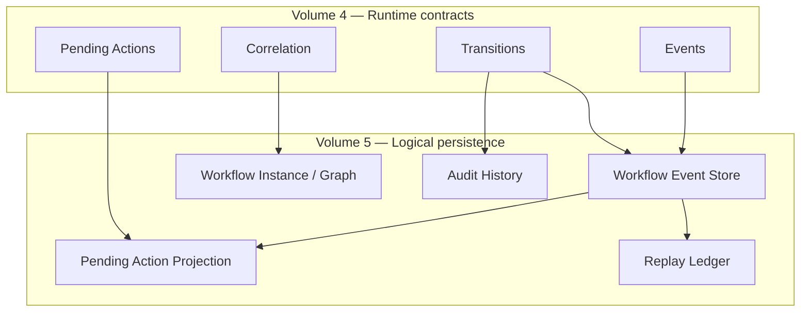
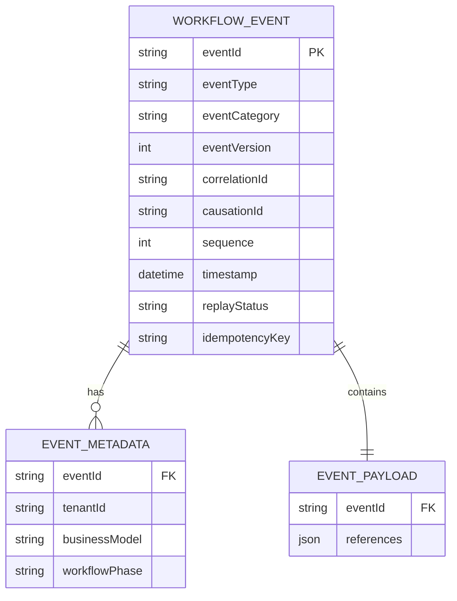
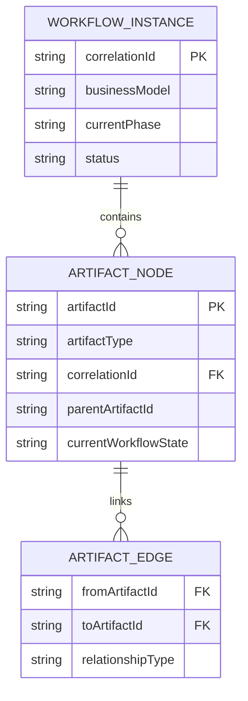
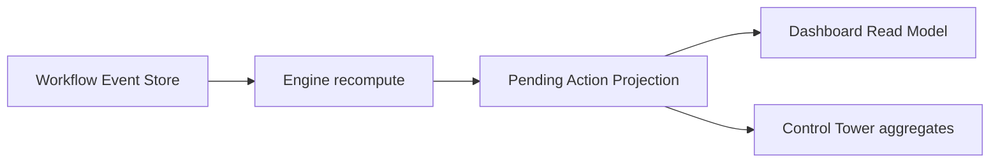
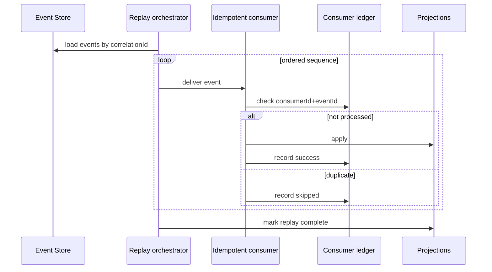
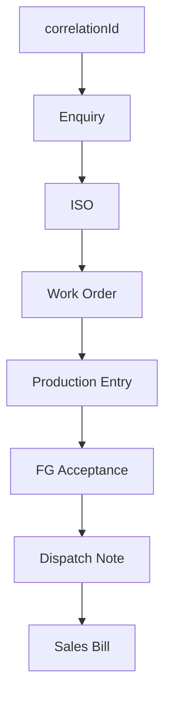
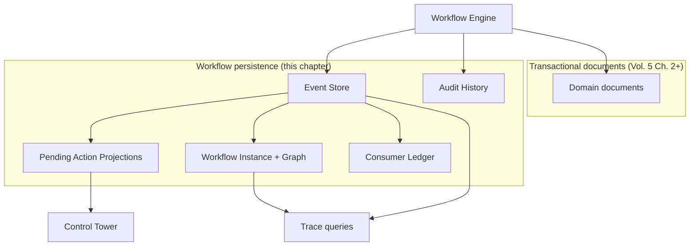

# Workflow Event Store & Correlation Persistence

| Field | Value |
|-------|-------|
| **Document ID** | FT-PD-050 |
| **Volume** | 5 — Data Architecture |
| **Chapter** | 1 — Workflow Event Store & Correlation Persistence |
| **Title** | Workflow Event Store & Correlation Persistence |
| **Version** | 1.0.0 |
| **Status** | Draft — Architecture Review |
| **Effective date** | 2026-05-29 |
| **Author** | FT ERP Product Team |
| **Owner** | FT ERP Product Architecture |
| **Audience** | Data architects, workflow engineers, backend leads, compliance owners |
| **Classification** | Product — Logical Data Architecture |

**Parent documents:**

- [Volume 4, Chapter 1 — Workflow Engine Overview & Pending Actions Contract](../04_Workflow_Engine/Chapter_01_Workflow_Engine_Overview_and_Pending_Actions_Contract.md)
- [Volume 4, Chapter 9 — Cross-Domain Workflow Orchestration & Event Coordination](../04_Workflow_Engine/Chapter_09_Cross_Domain_Workflow_Orchestration_and_Event_Coordination.md)
- [Volume 3 — Domain Specifications](../03_Domain_Specifications/README.md)
- [Volume 2 — Business Architecture](../02_Business_Architecture/README.md)

---

## 1. Document Control

| Version | Date | Author | Summary |
|---------|------|--------|---------|
| 1.0.0 | 2026-05-29 | FT ERP Product Team | Initial logical persistence for workflow events, correlation, Pending Actions, audit, replay |

**Supersedes:** None.

**Change authority:** Product Architecture. Immutability or correlation rule changes require Volume 4 alignment and Volume 7 implementation review.

**Out of scope:** Physical database schema, SQL, ORM models, APIs, UI, storage technology selection.

---

## 2. Purpose

This chapter defines the **canonical logical persistence architecture** for the **Workflow Engine**.

It specifies how workflow **events**, **correlation**, **Pending Actions**, **audit history**, and **event replay** are persisted—implementing the runtime contracts in [Volume 4](../04_Workflow_Engine/README.md).

This is a **logical data architecture** document. It describes **responsibilities and structure**, not physical tables or technology.

---

## 3. Scope

### 3.1 In scope

- Persistence principles (§5)
- Logical structures: Event Store, Correlation, Pending Actions, Audit (§6–9)
- Event replay model (§10)
- Business Rules (§11)
- Logical data diagrams (§12)

### 3.2 Out of scope

- Domain transactional field specs (Volume 5 Ch. 2+)
- Master data entities (Volume 5 Ch. 3+)
- HTTP APIs and message buses (Volume 7)
- Screen-level audit display (Volume 6)
- Guard semantics (Volume 4 Ch. 2)

### 3.3 Logical vs physical

| Layer | This chapter | Volume 7 |
|-------|--------------|----------|
| **Logical entity** | Workflow Event, Workflow Instance | Table/collection mapping |
| **Immutability rules** | Authoritative | Enforcement mechanism |
| **Indexes / partitioning** | Requirements only (correlation, time) | Implementation |

---

## 4. Relationship with Previous Volumes

| Volume | Relationship |
|--------|--------------|
| **Vol. 2** | Business Model inheritance; artifact ancestry in correlation graph |
| **Vol. 3** | Document types referenced in events and artifact nodes |
| **Vol. 4, Ch. 1** | Pending Action schema; WFE rules; audit on transition |
| **Vol. 4, Ch. 2** | Guard failures persisted in audit/exception history |
| **Vol. 4, Ch. 3–8** | Domain events and states referenced in payloads |
| **Vol. 4, Ch. 9** | Correlation model, event taxonomy, orchestration rules — **primary source** |

### 4.1 How Volume 5 persists Volume 4

| Volume 4 concept | Volume 5 persistence |
|------------------|---------------------|
| Transition success | Workflow Event + State Transition Audit |
| `correlationId` | Workflow Instance root key |
| Pending Action | Derived projection row(s) |
| Event taxonomy (`commercial.*`, etc.) | Event category + type |
| Cross-domain side effect | Event with `causationId` |
| Idempotent consumer | Consumer processing ledger |

---

## 5. Persistence Principles

| # | Principle | Description |
|---|-----------|-------------|
| **P-01** | **Event-first architecture** | Workflow truth is established by **events**; current state is derivable from event history + transactional snapshots where defined. |
| **P-02** | **Immutable event history** | Published workflow events are **never updated or deleted** ([WES-01](#11-business-rules)). |
| **P-03** | **Correlation-first tracing** | Every persisted event and projection carries `correlationId` for factory-wide trace ([ORCH-01](../04_Workflow_Engine/Chapter_09_Cross_Domain_Workflow_Orchestration_and_Event_Coordination.md)). |
| **P-04** | **Append-only event stream** | Events append to per-tenant stream ordered by `(correlationId, sequence)`. |
| **P-05** | **Event sourcing (where applicable)** | Pending Actions, phase, escalation overlays are **projections** — not authoritative sources ([WES-04](#11-business-rules)). |
| **P-06** | **Separation of transactional data and event history** | Domain documents (ISO, WO, GRN, etc.) hold business fields; workflow events hold **transition facts** — linked by reference ids. |
| **P-07** | **Replay capability** | Event store supports deterministic replay for recovery and projection rebuild ([§10](#10-event-replay-model)). |
| **P-08** | **Idempotent persistence** | Event append and consumer processing use stable idempotency keys ([WES-07](#11-business-rules)). |
| **P-09** | **Audit integrity** | User actions, engine actions, and guard failures append to audit history — tamper-evident retention policy (Volume 7). |
| **P-10** | **Long-term workflow history** | Workflow history retained for product horizon (5–10 years) unless legal hold policy dictates otherwise. |

---

## 6. Workflow Event Store

### 6.1 Responsibility

The **Workflow Event Store** is the **authoritative append-only log** of all workflow-significant occurrences: user transitions, engine side effects, cross-domain publications, and system milestones.

### 6.2 Logical entity: Workflow Event

| Attribute | Required | Description |
|-----------|----------|-------------|
| **eventId** | Yes | Globally unique immutable identifier |
| **eventType** | Yes | Taxonomy code (e.g. `planning.wo.created`, `xdm.mr.markInProcurement`) — [Vol. 4 Ch. 9 §10](../04_Workflow_Engine/Chapter_09_Cross_Domain_Workflow_Orchestration_and_Event_Coordination.md) |
| **eventCategory** | Yes | `Commercial` \| `Planning` \| `Procurement` \| `Manufacturing` \| `QA` \| `Dispatch` \| `Billing` \| `CrossDomain` \| `System` |
| **eventVersion** | Yes | Schema version for payload evolution (semantic versioning) |
| **correlationId** | Yes | Root Enquiry id — immutable |
| **causationId** | No | Prior `eventId` that caused this event (cross-domain chain) |
| **parentEventId** | No | Alias for lineage display; equals `causationId` when single parent |
| **sequence** | Yes | Monotonic order **within** `correlationId` |
| **timestamp** | Yes | Occurrence time (UTC, logical clock acceptable for ordering tie-break) |
| **producer** | Yes | `{ domain, action, actorRole, actorId }` — `actorId` null for engine |
| **consumer** | No | Populated on consumption records (§10) — not on publish row |
| **documentType** | Yes | Primary artifact type |
| **documentId** | Yes | Primary artifact instance id |
| **priorState** | No | Workflow state before transition |
| **newState** | No | Workflow state after transition |
| **auditCode** | No | Domain audit code (e.g. `DISPATCH_POSTED`, `QA_STARTED`) when distinct from WFE event |
| **replayStatus** | Yes | `Live` \| `Replayed` \| `SupersededByReplay` — see §10 |
| **idempotencyKey** | Yes | `(tenantId, action, documentType, documentId, clientRequestId)` for deduplication |

### 6.3 Event Metadata

Logical container for query and governance — may be embedded or normalized:

| Field | Purpose |
|-------|---------|
| `tenantId` | Factory tenant isolation |
| `businessModel` | `REGULAR_ORDER` \| `NO_QTY_AGREEMENT` |
| `workflowPhase` | Derived phase at emit time |
| `guardIdsPassed` | Ordered list on transition success |
| `guardIdFailed` | On blocked transition (paired with exception record) |
| `reasonCode` | Guard failure code ([Vol. 4 Ch. 2](../04_Workflow_Engine/Chapter_02_Transition_Guards_and_Cross_Domain_Dependency_Catalog.md)) |
| `pendingActionsAffected` | Action ids materialized/resolved by this event |
| `retentionClass` | Standard \| Extended \| LegalHold |

### 6.4 Event Payload

| Rule | Description |
|------|-------------|
| **Reference, don't duplicate** | Payload holds ids and transition context — not full document snapshots |
| **Snapshot exception** | Freeze milestones (e.g. MPRS RM Snapshot id) referenced by id only |
| **Versioned** | `eventVersion` governs payload shape |
| **PII minimization** | Actor id yes; no redundant customer PII in payload |

**Typical payload keys:** `internalSalesOrderId`, `workOrderId`, `demandPool`, `productionBatchId`, `dispatchNoteId`, `salesBillId`, `exportRevision`.

### 6.5 Store responsibilities (summary)

| Responsibility | Owner |
|----------------|-------|
| Append events | Workflow Engine only |
| Query by correlation | Trace API (Volume 7) |
| Query by document | Artifact drill-down |
| Stream to projections | Pending Actions, Control Tower, Audit |
| Replay source | Recovery and rebuild |

---

## 7. Correlation Persistence

### 7.1 Workflow Instance

Logical aggregate keyed by **`correlationId`** (Enquiry id):

| Attribute | Description |
|-----------|-------------|
| **correlationId** | Primary key — immutable |
| **businessModel** | Set at `enquiry.submit`; immutable |
| **enquiryId** | Same as correlationId |
| **internalSalesOrderId** | Primary ISO when created |
| **currentPhase** | Derived; updated on phase-change events |
| **status** | `Active` \| `CommerciallyComplete` \| `Cancelled` |
| **startedAt** | First event timestamp |
| **completedAt** | Commercial closure event timestamp |
| **primaryOwnerRole** | Derived from open Pending Actions |

### 7.2 Artifact graph

Persisted as **nodes** and **edges**:

**Node (Artifact):**

| Field | Description |
|-------|-------------|
| `artifactId` | Document instance id |
| `artifactType` | Engine document type |
| `correlationId` | Root trace |
| `parentArtifactId` | Immediate parent (nullable for Enquiry) |
| `createdEventId` | Event that created artifact |
| `currentWorkflowState` | Denormalized for query — updated on transition events |
| `domain` | Commercial \| Planning \| … |

**Edge (Relationship):**

| Field | Description |
|-------|-------------|
| `fromArtifactId` | Parent |
| `toArtifactId` | Child |
| `relationshipType` | `CreatedFrom` \| `Handoff` \| `Fulfillment` \| `BillingLink` |
| `createdEventId` | Provenance |

### 7.3 Cross-domain references

| Reference | Persisted on |
|-----------|--------------|
| ISO → WO | WO node; `planning.wo.created` event |
| MR → PR | PR node; `procurement.pr.created` event |
| PE → QA Inspection | Inspection node; `inspection.create` event |
| Dispatch Note → Sales Bill | Bill node; `salesBill.create` event |

### 7.4 Workflow lineage & traceability

**Lineage query** returns:

1. Workflow Instance header
2. Artifact graph (nodes + edges)
3. Ordered event list by `sequence`
4. Open Pending Action projections
5. Exception history (guard blocks)

Supports [Vol. 4 Ch. 9 §9.3](../04_Workflow_Engine/Chapter_09_Cross_Domain_Workflow_Orchestration_and_Event_Coordination.md) trace contract.

---

## 8. Pending Action Persistence

### 8.1 Nature: projection

Pending Actions are **not authoritative workflow state**. They are **materialized projections** rebuilt from events + ownership rules ([WFE-02](../04_Workflow_Engine/Chapter_01_Workflow_Engine_Overview_and_Pending_Actions_Contract.md), [ORCH-03](../04_Workflow_Engine/Chapter_09_Cross_Domain_Workflow_Orchestration_and_Event_Coordination.md)).

### 8.2 Logical entity: Pending Action Projection

| Attribute | Required | Maps from Vol. 4 Ch. 1 |
|-----------|----------|--------------------------|
| **projectionId** | Yes | Surrogate — unique per materialization row |
| **actionId** | Yes | Stable type id (`PLN_MPRS_REVIEW`, etc.) |
| **correlationId** | Yes | Root trace |
| **documentType** | Yes | ✓ |
| **documentId** | Yes | ✓ |
| **documentNo** | Yes | ✓ |
| **ownerRole** | Yes | ✓ |
| **domain** | Yes | ✓ |
| **actionLabel** | Yes | ✓ |
| **priority** | Yes | `LOW` \| `NORMAL` \| `HIGH` \| `CRITICAL` |
| **status** | Yes | `Materialized` \| `Visible` \| `Acted` \| `Superseded` \| `Expired` |
| **triggerState** | Yes | Workflow state that caused action |
| **materializationSource** | Yes | `{ eventId, eventType }` — originating event |
| **duePolicy** | No | SLA id / threshold reference |
| **escalationState** | No | `{ escalatedAt, priorPriority, riskFlag }` |
| **resolutionEventId** | No | Event that resolved trigger |
| **supersededByProjectionId** | No | Replacement row when state invalidates |
| **deepLink** | Yes | Workspace route context |
| **businessModel** | No | Filter dimension |
| **metadata** | No | Pool, ISO ref, risk flags |
| **materializedAt** | Yes | ✓ createdAt |
| **resolvedAt** | No | When status → Acted/Superseded/Expired |

### 8.3 Projection lifecycle persistence

| Transition | Persistence effect |
|------------|-------------------|
| Event append | Recompute job evaluates triggers |
| Materialize | Insert projection row `status = Materialized` |
| Visible | Expose to Dashboard API |
| Resolve | Set `resolutionEventId`, `resolvedAt`, `status = Acted` |
| Supersede | Link `supersededByProjectionId`; no delete |
| Escalate | Update `priority`, `escalationState`; append `system.escalation.applied` event |

### 8.4 Multiple and cross-domain actions

- Multiple open projections per `correlationId` allowed
- Cross-domain actions reference different `documentType` under same `correlationId`
- Unique constraint (logical): `(actionId, documentType, documentId)` while `status` ∈ `{Materialized, Visible}`

---

## 9. Audit Persistence

### 9.1 Separation from Event Store

| Store | Purpose |
|-------|---------|
| **Workflow Event Store** | Workflow-significant facts for orchestration and replay |
| **Audit History** | Compliance-oriented record including failures and reads |

Audit records **reference** `eventId` when paired; guard blocks may exist **only** in audit if no transition occurred.

### 9.2 Audit record types

| Type | Content |
|------|---------|
| **User action** | Actor, action, document, outcome success/fail |
| **Engine action** | Side effect name, causation, targets |
| **Cross-domain event** | `xdm.*` publication and consumption |
| **State transition** | prior/new state, audit code |
| **Approval history** | MPRS approve, PMR submit, Sales Bill finalize, Commercial Closure |
| **Exception history** | GuardBlocked: `guardId`, `reasonCode`, responsibleRole |

### 9.3 Logical entity: Audit Entry

| Attribute | Description |
|-----------|-------------|
| `auditId` | Unique |
| `correlationId` | Root trace |
| `eventId` | Nullable — links to workflow event when exists |
| `auditType` | User \| Engine \| CrossDomain \| Transition \| Approval \| Exception |
| `timestamp` | Append time |
| `actorRole` / `actorId` | Nullable for engine |
| `summary` | Human-readable (localizable key + params) |
| `immutable` | Always true |

**Rule:** Audit history is **append-only** ([WES-03](#11-business-rules)).

---

## 10. Event Replay Model

### 10.1 Replay eligibility

| Eligible | Not eligible |
|----------|--------------|
| Projection rebuild (Pending Actions, phase) | Mutating original events |
| Control Tower aggregate refresh | Changing `correlationId` |
| Consumer recovery after outage | Deleting history |
| Sandbox / diagnostic recompute | Replaying guard decisions as new writes without marking `Replayed` |

### 10.2 Replay ordering

1. Load all events for `correlationId` ordered by `sequence`
2. Optionally filter by `eventCategory` / time window
3. Apply consumers in **publication order**
4. Within same sequence, engine-defined tie-break (timestamp)

**Rule:** Event ordering preserved within workflow instance ([WES-06](#11-business-rules)).

### 10.3 Replay safety & idempotent consumers

**Consumer Processing Ledger** (logical):

| Field | Purpose |
|-------|---------|
| `consumerId` | Registered consumer name |
| `eventId` | Processed event |
| `processedAt` | Timestamp |
| `outcome` | Success \| SkippedDuplicate |
| `idempotencyKey` | `(consumerId, eventId)` unique |

Consumers **must** be idempotent ([ORCH-09](../04_Workflow_Engine/Chapter_09_Cross_Domain_Workflow_Orchestration_and_Event_Coordination.md), [WES-07](#11-business-rules)).

### 10.4 Duplicate detection

| Layer | Key |
|-------|-----|
| Event append | `idempotencyKey` on transition request |
| Consumer | `(consumerId, eventId)` |

Duplicate append returns existing `eventId` — no second row.

### 10.5 Recovery

| Scenario | Approach |
|----------|----------|
| Projection drift | Full replay from event store |
| Partial consumer failure | Resume from last ledger entry |
| Corrupted projection row | Supersede and rebuild — never delete events |

### 10.6 Compensation boundaries

| In scope | Out of scope |
|----------|--------------|
| Mark event `SupersededByReplay` + compensating **new** event | Edit original event |
| Formal reversal workflows (future) | Silent stock/commercial rollback |
| Replay emits `system.replay.completed` | Replay invokes user transitions without actor |

**Rule:** Replay **never modifies** original events ([WES-05](#11-business-rules)).

---

## 11. Business Rules

| ID | Rule |
|----|------|
| **WES-01** | **Events are immutable** — no update/delete of published workflow events. |
| **WES-02** | **Correlation IDs never change** after `enquiry.create`. |
| **WES-03** | **Audit history is append-only.** |
| **WES-04** | **Pending Actions are projections derived from events** — rebuildable from event store + rules. |
| **WES-05** | **Replay never modifies original events** — only new events or projection rows. |
| **WES-06** | **Event ordering is preserved within a workflow instance** via `sequence`. |
| **WES-07** | **Consumers must be idempotent** — ledger enforces `(consumerId, eventId)`. |
| **WES-08** | **Workflow history is never deleted** in standard product — retention archive only. |
| **WES-09** | **Transactional document state** may be denormalized for query; **event store is authoritative** for transition history. |
| **WES-10** | **Guard failures are auditable** even when no workflow event is appended. |
| **WES-11** | **Cross-domain references** persist on artifact graph — not embedded in unrelated documents. |
| **WES-12** | **Tenant isolation** — all persistence scoped by `tenantId`. |

*Orchestration rules ORCH-* in [Vol. 4 Ch. 9](../04_Workflow_Engine/Chapter_09_Cross_Domain_Workflow_Orchestration_and_Event_Coordination.md) remain authoritative for runtime behavior; WES rules govern persistence.*

---

## 12. Logical Data Diagrams

### 12.1 Event Store

### 12.2 Correlation graph

### 12.3 Pending Action projection

### 12.4 Event replay

### 12.5 Workflow lineage

### 12.6 Overall persistence architecture

---

## 13. Review Checklist

- [ ] Event store logical entity complete (§6)
- [ ] Correlation and artifact graph integrity (§7)
- [ ] Pending Action projection — not authoritative source (§8)
- [ ] Audit append-only and exception coverage (§9)
- [ ] Replay safety and idempotent consumers (§10)
- [ ] WES Business Rules align with ORCH/WFE rules
- [ ] Cross-domain traceability via `correlationId`
- [ ] Immutability compliance — no event delete/update
- [ ] Technology-neutral — no SQL/ORM/API
- [ ] Six Mermaid diagrams
- [ ] Volume 4 cross-references

---

## 14. Change Log

| Version | Date | Author | Summary |
|---------|------|--------|---------|
| 1.0.0 | 2026-05-29 | FT ERP Product Team | Initial Data Architecture — Workflow Event Store & Correlation Persistence |

---

## 15. Approval Block

| Role | Name | Signature | Date |
|------|------|-----------|------|
| Product Owner | | | |
| Product Architecture | | | |
| Data Architecture Lead | | | |
| Workflow Engineering Lead | | | |
| Backend Engineering Lead | | | |
| Compliance / Audit Owner | | | |

---

## Document navigation

| | Link |
|--|------|
| **Previous** | [Cross-Domain Workflow Orchestration & Event Coordination](../04_Workflow_Engine/Chapter_09_Cross_Domain_Workflow_Orchestration_and_Event_Coordination.md) (FT-PD-048) |
| **Next** | [Transactional Document Model](./Chapter_02_Transactional_Document_Model.md) (FT-PD-051) |
| **Volume** | [Data Architecture](./README.md) |
| **Product** | [Product Documentation Index](../README.md) |

