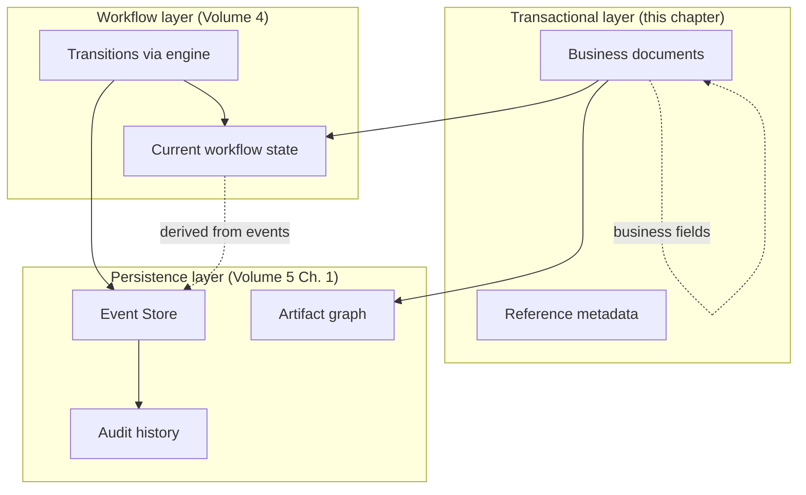
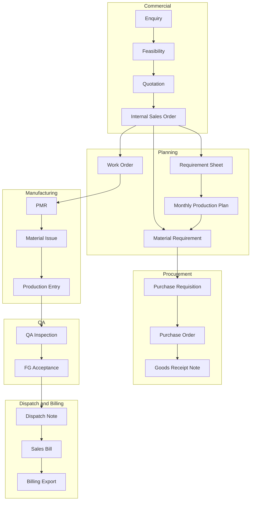
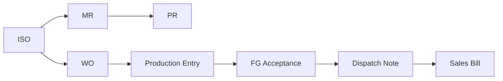
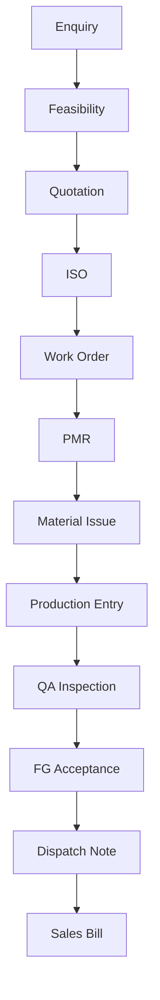
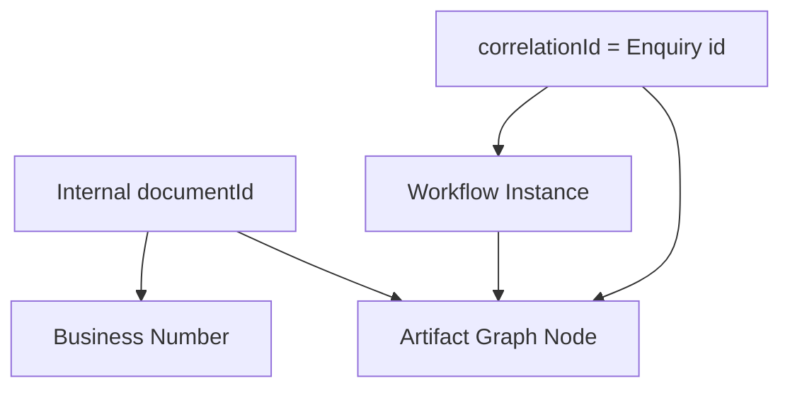
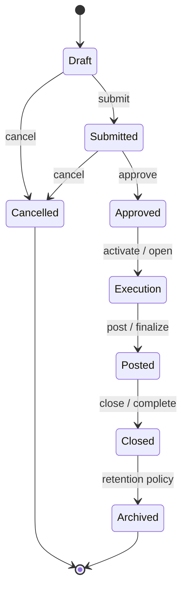
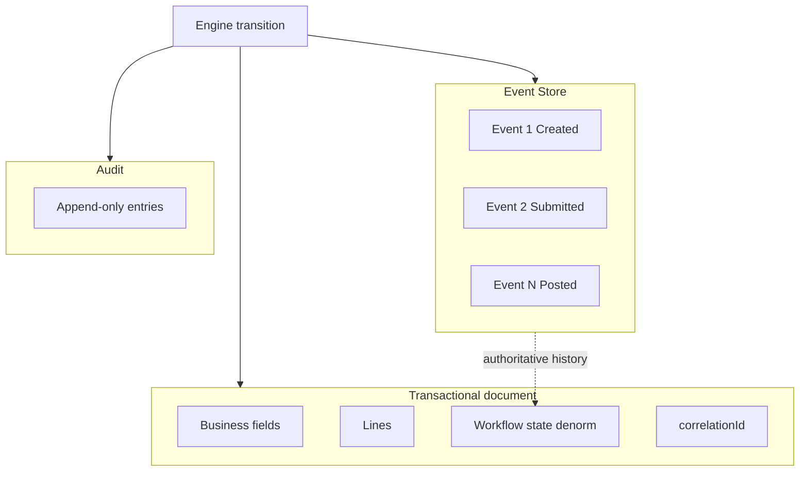

# Transactional Document Model

| Field | Value |
|-------|-------|
| **Document ID** | FT-PD-051 |
| **Volume** | 5 — Data Architecture |
| **Chapter** | 2 — Transactional Document Model |
| **Title** | Transactional Document Model |
| **Version** | 1.0.0 |
| **Status** | Draft — Architecture Review |
| **Effective date** | 2026-05-29 |
| **Author** | FT ERP Product Team |
| **Owner** | FT ERP Product Architecture |
| **Audience** | Data architects, domain authors, workflow engineers, backend leads |
| **Classification** | Product — Logical Data Architecture |

**Parent documents:**

- [Chapter 1 — Workflow Event Store & Correlation Persistence](./Chapter_01_Workflow_Event_Store_and_Correlation_Persistence.md)
- [Volume 4 — Workflow Engine](../04_Workflow_Engine/README.md)
- [Volume 3 — Domain Specifications](../03_Domain_Specifications/README.md)
- [Volume 2 — Business Architecture](../02_Business_Architecture/README.md)

---

## 1. Document Control

| Version | Date | Author | Summary |
|---------|------|--------|---------|
| 1.0.0 | 2026-05-29 | FT ERP Product Team | Initial canonical transactional document model |

**Supersedes:** None.

**Change authority:** Product Architecture. New document types require Volume 3 domain review and Volume 4 State Machine registration.

**Out of scope:** Physical schema, SQL, ORM, APIs, UI, master data detail (Volume 5 Ch. 3).

---

## 2. Purpose

This chapter defines the **logical architecture of all ERP transactional documents**—the canonical business artifacts managed by FT ERP.

It specifies:

- Document **classification** and taxonomy
- **Ownership**, **lifecycle**, and **relationships**
- **Identity** and **immutability** rules
- **Workflow linkage** (Volume 4) and **correlation linkage** (Volume 5 Ch. 1)

This is a **logical model only**. It does not define database tables or implementation technology.

---

## 3. Scope

### 3.1 In scope

- All workflow-managed transactional documents across six domains + billing
- Reference metadata entities (Customer PO reference)
- Logical stage objects tightly bound to parent documents (Planning Cycle, RM Release, Delivery Confirmation, QA Batch view)
- Relationship and identity models
- Lifecycle categories
- Artifact graph integration

### 3.2 Out of scope

- Master data (Item, Customer, Supplier, BOM master — Volume 5 Ch. 3)
- Planning/procurement **snapshots** (Volume 5 Ch. 4–6)
- Stock Ledger entries (Volume 5 Ch. 5)
- Workflow Event Store structure (Volume 5 Ch. 1 — referenced)
- Field-level line specs (Volume 3 — behavior authority)

### 3.3 Non-document Read Models

| Artifact | Classification |
|----------|----------------|
| **Material Availability** | Computed Read Model — not a transactional document |
| **woPrepareCase / woPlacementCase** | Workflow case objects — not standalone business documents |
| **dispatchCase** | Process orchestration — child of ISO + FG context |
| **commercialCompletion** | Milestone aggregate — links ISO + billing |

---

## 4. Relationship with Previous Volumes

| Volume | Relationship |
|--------|--------------|
| **Vol. 2** | Business Model inheritance; pipeline document chain |
| **Vol. 3** | Domain behavior, validation, Pending Action IDs — **semantic authority** |
| **Vol. 4** | Workflow state per document type; transitions; guard references |
| **Vol. 5, Ch. 1** | Artifact graph nodes; `correlationId`; event linkage |

### 4.1 Coexistence with Event Store and Workflow Engine

| Concern | Authoritative source |
|---------|---------------------|
| **Business data** (lines, qty, terms) | Transactional document |
| **Workflow state** | Workflow Engine (denormalized on document for query) |
| **Transition history** | Workflow Event Store |
| **Compliance audit** | Audit history (append-only) |
| **Factory trace** | `correlationId` + artifact graph |
| **Work queue** | Pending Action projections (derived) |

**Rule:** Transactional state is **separate** from event history ([TDM-07](#10-business-rules)). Workflow state changes **only** through engine transitions ([WFE-01](../04_Workflow_Engine/Chapter_01_Workflow_Engine_Overview_and_Pending_Actions_Contract.md)).

---

## 5. Document Classification

### 5.1 Taxonomy overview

| Domain | Transactional documents | Stage / bound objects |
|--------|------------------------|------------------------|
| **Commercial** | Enquiry, Feasibility, Quotation, Internal Sales Order | — |
| **Commercial reference** | Customer PO reference (metadata on ISO) | — |
| **Planning** | Requirement Sheet, Monthly Production Plan, Material Requirement, Work Order | Planning Cycle, RM Release, WO Preparation case |
| **Procurement** | Purchase Requisition, Purchase Order, Goods Receipt Note | — |
| **Manufacturing** | Work Order, PMR, ARR, Material Issue, Production Entry | Production Batch |
| **QA** | QA Inspection, Rework, Scrap Record, FG Acceptance | QA Batch (logical view) |
| **Dispatch** | Dispatch Note | Delivery Confirmation, Dispatch case |
| **Billing** | Sales Bill, Billing Export (Export Batch) | — |

*Official term: **Material Requirement** (MR) — not “Material Requisition” ([Glossary](../01_Product_Foundation/Chapter_03_FT_ERP_Glossary_and_Standard_Terminology.md)).*

### 5.2 Commercial

| Document | Engine type key | Workflow chapter |
|----------|-----------------|------------------|
| Enquiry | `enquiry` | [Vol. 4 Ch. 3](../04_Workflow_Engine/Chapter_03_Commercial_Workflow_State_Machine.md) |
| Feasibility | `feasibility` | Ch. 3 |
| Quotation | `quotation` | Ch. 3 |
| Internal Sales Order | `internalSalesOrder` | Ch. 3 |
| Customer PO reference | *metadata* | No State Machine |

### 5.3 Planning

| Document | Engine type key | Workflow chapter |
|----------|-----------------|------------------|
| Requirement Sheet | `requirementSheet` | [Vol. 4 Ch. 4](../04_Workflow_Engine/Chapter_04_Planning_Workflow_State_Machine.md) |
| Planning Cycle | `planningCycle` | Ch. 4 |
| Monthly Production Plan (MPRS) | `monthlyProductionPlan` | Ch. 4 |
| Material Requirement | `materialRequirement` | Ch. 4 |
| RM Release | `rmRelease` | Ch. 4 |
| Work Order | `workOrder` | Ch. 4 (create) / [Ch. 6](../04_Workflow_Engine/Chapter_06_Manufacturing_Workflow_State_Machine.md) (execution) |

### 5.4 Procurement

| Document | Engine type key | Workflow chapter |
|----------|-----------------|------------------|
| Purchase Requisition | `purchaseRequisition` | [Vol. 4 Ch. 5](../04_Workflow_Engine/Chapter_05_Procurement_Workflow_State_Machine.md) |
| Purchase Order | `purchaseOrder` | Ch. 5 |
| Goods Receipt Note | `goodsReceiptNote` | Ch. 5 |

### 5.5 Manufacturing

| Document | Engine type key | Workflow chapter |
|----------|-----------------|------------------|
| Work Order | `workOrder` | [Vol. 4 Ch. 6](../04_Workflow_Engine/Chapter_06_Manufacturing_Workflow_State_Machine.md) |
| PMR | `productionMaterialRequest` | Ch. 6 |
| ARR | `additionalRmRequisition` | Ch. 6 |
| Material Issue | `materialIssue` | Ch. 6 |
| Production Entry | `productionEntry` | Ch. 6 |
| Production Batch | `productionBatch` | Embedded in Production Entry |

### 5.6 QA

| Document | Engine type key | Workflow chapter |
|----------|-----------------|------------------|
| QA Inspection | `qaInspection` | [Vol. 4 Ch. 7](../04_Workflow_Engine/Chapter_07_Quality_Assurance_Workflow_State_Machine.md) |
| Rework | `rework` | Ch. 7 |
| Scrap Record | `scrapRecord` | Ch. 7 |
| FG Acceptance | `fgAcceptance` | Ch. 7 |
| QA Batch | `qaBatch` | Logical view — Ch. 7 |

### 5.7 Dispatch & Billing

| Document | Engine type key | Workflow chapter |
|----------|-----------------|------------------|
| Dispatch Note | `dispatchNote` | [Vol. 4 Ch. 8](../04_Workflow_Engine/Chapter_08_Dispatch_and_Billing_Workflow_State_Machine.md) |
| Delivery Confirmation | `deliveryConfirmation` | Ch. 8 |
| Sales Bill | `salesBill` | Ch. 8 |
| Billing Export (Export Batch) | `billingExport` | Ch. 8 |
| Commercial Completion | `commercialCompletion` | Ch. 8 + Commercial ISO |

---

## 6. Canonical Document Structure

For each document: **purpose**, **business identity**, **owner**, **parents/children**, **lifecycle owner**, **workflow**, **correlation**, **audit**. Implementation fields are intentionally omitted.

### 6.1 Commercial

#### Enquiry

| Attribute | Value |
|-----------|-------|
| **Purpose** | Capture commercial intent; select Business Model |
| **Business identity** | Enquiry number; **`correlationId` root** |
| **Owner role** | Admin |
| **Parent(s)** | — |
| **Child(ren)** | Feasibility, Quotation (via chain), ISO (indirect) |
| **Lifecycle owner** | Commercial domain |
| **Workflow** | Yes — [Ch. 3](../04_Workflow_Engine/Chapter_03_Commercial_Workflow_State_Machine.md) |
| **Correlation** | **Root** — `correlationId` = Enquiry id |
| **Audit** | All transitions; Business Model selection immutable |

#### Feasibility

| Attribute | Value |
|-----------|-------|
| **Purpose** | Technical/commercial feasibility assessment |
| **Business identity** | Feasibility number |
| **Owner role** | Admin |
| **Parent(s)** | Enquiry |
| **Child(ren)** | Quotation |
| **Lifecycle owner** | Commercial |
| **Workflow** | Yes — Ch. 3 |
| **Correlation** | Inherits Enquiry `correlationId` |
| **Audit** | Full transition history |

#### Quotation

| Attribute | Value |
|-----------|-------|
| **Purpose** | Commercial offer to customer |
| **Business identity** | Quotation number |
| **Owner role** | Admin |
| **Parent(s)** | Feasibility (typical) |
| **Child(ren)** | Internal Sales Order |
| **Lifecycle owner** | Commercial |
| **Workflow** | Yes — Ch. 3 |
| **Correlation** | Same `correlationId` |
| **Audit** | Win/loss/expiry events |

#### Customer PO reference

| Attribute | Value |
|-----------|-------|
| **Purpose** | External customer order reference for traceability |
| **Business identity** | N/A — **not a document**; fields on ISO |
| **Owner role** | Admin (edit) |
| **Parent(s)** | Internal Sales Order |
| **Child(ren)** | — |
| **Lifecycle owner** | Commercial metadata |
| **Workflow** | **No** — metadata edit only ([CDS-14](../03_Domain_Specifications/Chapter_01_Commercial_Domain_Specification.md)) |
| **Correlation** | Same `correlationId` |
| **Audit** | Optional field-change log; not workflow transition |

#### Internal Sales Order

| Attribute | Value |
|-----------|-------|
| **Purpose** | Committed commercial frame for fulfillment |
| **Business identity** | ISO number |
| **Owner role** | Admin (commercial); Store (execution context) |
| **Parent(s)** | Quotation |
| **Child(ren)** | RS, MPRS, MR, WO, Dispatch Notes, Sales Bills |
| **Lifecycle owner** | Commercial → fulfillment arc |
| **Workflow** | Yes — Ch. 3 + fulfillment engine marks |
| **Correlation** | Same `correlationId` |
| **Audit** | Commit, revision, commercial completion |

---

### 6.2 Planning

#### Requirement Sheet

| Attribute | Value |
|-----------|-------|
| **Purpose** | NO_QTY cycle demand capture |
| **Business identity** | RS number + version |
| **Owner role** | Store |
| **Parent(s)** | ISO (NO_QTY) |
| **Child(ren)** | Planning Cycle, WO placements |
| **Lifecycle owner** | Planning |
| **Workflow** | Yes — [Ch. 4](../04_Workflow_Engine/Chapter_04_Planning_Workflow_State_Machine.md) |
| **Correlation** | Same `correlationId` |
| **Audit** | Lock, supersede |

#### Planning Cycle

| Attribute | Value |
|-----------|-------|
| **Purpose** | Bounded planning period for RS version |
| **Business identity** | Cycle key (RS version + period) |
| **Owner role** | Store |
| **Parent(s)** | Requirement Sheet |
| **Child(ren)** | MPRS, WO waves |
| **Lifecycle owner** | Planning |
| **Workflow** | Yes — Ch. 4 |
| **Correlation** | Same `correlationId` |
| **Audit** | Lock, close |

#### Monthly Production Plan (MPRS)

| Attribute | Value |
|-----------|-------|
| **Purpose** | Period FG plan and procurement freeze (NO_QTY) |
| **Business identity** | MPRS number; `planKind` INITIAL \| ADDITIONAL |
| **Owner role** | Store (draft); Purchase (review) |
| **Parent(s)** | ISO; Planning Cycle |
| **Child(ren)** | RM Release, MR (MPRS pool) |
| **Lifecycle owner** | Planning |
| **Workflow** | Yes — Ch. 4 |
| **Correlation** | Same `correlationId` |
| **Audit** | Approve, release, freeze snapshot ref |

#### Material Requirement

| Attribute | Value |
|-----------|-------|
| **Purpose** | Published RM demand for procurement |
| **Business identity** | MR number; `demandPool` REGULAR_SO \| MPRS \| STOCK_REPLENISHMENT |
| **Owner role** | Store (REGULAR); Engine/Purchase context (MPRS) |
| **Parent(s)** | ISO (REGULAR) or MPRS release (NO_QTY) |
| **Child(ren)** | Purchase Requisition |
| **Lifecycle owner** | Planning → Procurement handoff |
| **Workflow** | Yes — Ch. 4 |
| **Correlation** | Same `correlationId` |
| **Audit** | Approve, release, close |

#### RM Release

| Attribute | Value |
|-----------|-------|
| **Purpose** | Publish frozen RM to MPRS procurement pool |
| **Business identity** | Bound to MPRS revision |
| **Owner role** | Store |
| **Parent(s)** | Monthly Production Plan |
| **Child(ren)** | Material Requirement(s) |
| **Lifecycle owner** | Planning |
| **Workflow** | Yes — stage object — Ch. 4 |
| **Correlation** | Same `correlationId` |
| **Audit** | Release confirm |

#### Work Order

| Attribute | Value |
|-----------|-------|
| **Purpose** | Authorize manufacturing execution quantity |
| **Business identity** | WO number |
| **Owner role** | Store (create in Planning; execute in MFG) |
| **Parent(s)** | ISO (REGULAR) or RS (NO_QTY) |
| **Child(ren)** | PMR, Material Issues, Production Entries |
| **Lifecycle owner** | Planning create → Manufacturing execution |
| **Workflow** | Yes — Ch. 4 create; [Ch. 6](../04_Workflow_Engine/Chapter_06_Manufacturing_Workflow_State_Machine.md) execution |
| **Correlation** | Same `correlationId` |
| **Audit** | Create, activate, production complete |

---

### 6.3 Procurement

#### Purchase Requisition

| Attribute | Value |
|-----------|-------|
| **Purpose** | Formal RM supply request from MR |
| **Business identity** | PR number; single `demandPool` |
| **Owner role** | Store (REGULAR_SO, STOCK_REPLENISHMENT); Purchase (MPRS) |
| **Parent(s)** | Material Requirement |
| **Child(ren)** | Purchase Order |
| **Lifecycle owner** | Procurement |
| **Workflow** | Yes — [Ch. 5](../04_Workflow_Engine/Chapter_05_Procurement_Workflow_State_Machine.md) |
| **Correlation** | Same `correlationId` |
| **Audit** | Approve, convert |

#### Purchase Order

| Attribute | Value |
|-----------|-------|
| **Purpose** | Supplier commercial RM order |
| **Business identity** | PO number |
| **Owner role** | Purchase |
| **Parent(s)** | Purchase Requisition |
| **Child(ren)** | Goods Receipt Note(s) |
| **Lifecycle owner** | Procurement |
| **Workflow** | Yes — Ch. 5 |
| **Correlation** | Same `correlationId` |
| **Audit** | Activate, close |

#### Goods Receipt Note

| Attribute | Value |
|-----------|-------|
| **Purpose** | Post inbound RM to stock |
| **Business identity** | GRN number |
| **Owner role** | Store |
| **Parent(s)** | Purchase Order |
| **Child(ren)** | — (feeds Material Availability Read Model) |
| **Lifecycle owner** | Procurement |
| **Workflow** | Yes — Ch. 5 |
| **Correlation** | Same `correlationId` |
| **Audit** | Post irreversible |

---

### 6.4 Manufacturing

#### PMR (Production Material Request)

| Attribute | Value |
|-----------|-------|
| **Purpose** | Frozen RM requirement for WO issue |
| **Business identity** | PMR number; BOM revision ref |
| **Owner role** | Store |
| **Parent(s)** | Work Order |
| **Child(ren)** | Material Issue(s) |
| **Lifecycle owner** | Manufacturing |
| **Workflow** | Yes — Ch. 6 |
| **Correlation** | Same `correlationId` |
| **Audit** | Submit freeze immutable |

#### ARR (Additional RM Requisition)

| Attribute | Value |
|-----------|-------|
| **Purpose** | Supplementary RM beyond frozen PMR |
| **Business identity** | ARR number |
| **Owner role** | Store |
| **Parent(s)** | Work Order / PMR context |
| **Child(ren)** | STOCK_REPLENISHMENT MR → procurement chain |
| **Lifecycle owner** | Manufacturing → Procurement |
| **Workflow** | Yes — Ch. 6 |
| **Correlation** | Same `correlationId` |
| **Audit** | Reason required |

#### Material Issue

| Attribute | Value |
|-----------|-------|
| **Purpose** | Move RM store → production against PMR |
| **Business identity** | Issue number |
| **Owner role** | Store |
| **Parent(s)** | PMR |
| **Child(ren)** | Production Entry (capacity) |
| **Lifecycle owner** | Manufacturing |
| **Workflow** | Yes — Ch. 6 |
| **Correlation** | Same `correlationId` |
| **Audit** | Post; partial issues |

#### Production Entry

| Attribute | Value |
|-----------|-------|
| **Purpose** | Record FG produced for WO line |
| **Business identity** | Production Entry number |
| **Owner role** | Production |
| **Parent(s)** | Work Order |
| **Child(ren)** | Production Batch, QA Inspection |
| **Lifecycle owner** | Manufacturing |
| **Workflow** | Yes — Ch. 6 |
| **Correlation** | Same `correlationId` |
| **Audit** | Approve → QA handoff |

#### Production Batch

| Attribute | Value |
|-----------|-------|
| **Purpose** | Lot/batch identity for QA trace |
| **Business identity** | Batch id |
| **Owner role** | Engine on Production Entry approve |
| **Parent(s)** | Production Entry |
| **Child(ren)** | QA Inspection |
| **Lifecycle owner** | Manufacturing → QA |
| **Workflow** | Embedded — not separate State Machine |
| **Correlation** | Same `correlationId` |
| **Audit** | Created on approve |

---

### 6.5 QA

#### QA Inspection

| Attribute | Value |
|-----------|-------|
| **Purpose** | Quality evaluation and disposition |
| **Business identity** | Inspection number |
| **Owner role** | QA |
| **Parent(s)** | Production Entry / Batch |
| **Child(ren)** | Rework, Scrap Record, FG Acceptance |
| **Lifecycle owner** | QA |
| **Workflow** | Yes — [Ch. 7](../04_Workflow_Engine/Chapter_07_Quality_Assurance_Workflow_State_Machine.md) |
| **Correlation** | Same `correlationId` |
| **Audit** | Disposition, partial accept/reject |

#### Rework

| Attribute | Value |
|-----------|-------|
| **Purpose** | Controlled production re-entry |
| **Business identity** | Rework number |
| **Owner role** | QA (authorize); Production (execute) |
| **Parent(s)** | QA Inspection |
| **Child(ren)** | Re-inspection |
| **Lifecycle owner** | QA |
| **Workflow** | Yes — Ch. 7 |
| **Correlation** | Same `correlationId` |
| **Audit** | Authorize, complete |

#### Scrap Record (Scrap Authorization)

| Attribute | Value |
|-----------|-------|
| **Purpose** | Permanent reject write-off |
| **Business identity** | Scrap number |
| **Owner role** | QA |
| **Parent(s)** | QA Inspection |
| **Child(ren)** | — |
| **Lifecycle owner** | QA |
| **Workflow** | Yes — Ch. 7 |
| **Correlation** | Same `correlationId` |
| **Audit** | Post immutable |

#### FG Acceptance

| Attribute | Value |
|-----------|-------|
| **Purpose** | Post accepted FG to dispatch-eligible stock |
| **Business identity** | FG Acceptance number |
| **Owner role** | Engine (post); QA (decision source) |
| **Parent(s)** | QA Inspection accept path |
| **Child(ren)** | Dispatch Note eligibility |
| **Lifecycle owner** | QA terminus → Dispatch |
| **Workflow** | Yes — Ch. 7 |
| **Correlation** | Same `correlationId` |
| **Audit** | Post |

---

### 6.6 Dispatch & Billing

#### Dispatch Note

| Attribute | Value |
|-----------|-------|
| **Purpose** | ERP-controlled shipment record |
| **Business identity** | Dispatch Note number |
| **Owner role** | Store |
| **Parent(s)** | ISO; FG Acceptance |
| **Child(ren)** | Delivery Confirmation, Sales Bill |
| **Lifecycle owner** | Dispatch & Billing |
| **Workflow** | Yes — [Ch. 8](../04_Workflow_Engine/Chapter_08_Dispatch_and_Billing_Workflow_State_Machine.md) |
| **Correlation** | Same `correlationId` |
| **Audit** | Post; stock decrement |

#### Delivery Confirmation

| Attribute | Value |
|-----------|-------|
| **Purpose** | Physical delivery acknowledgment |
| **Business identity** | Bound to Dispatch Note |
| **Owner role** | Store |
| **Parent(s)** | Dispatch Note |
| **Child(ren)** | — |
| **Lifecycle owner** | Dispatch |
| **Workflow** | Yes — stage — Ch. 8 |
| **Correlation** | Same `correlationId` |
| **Audit** | Confirm / waive |

#### Sales Bill

| Attribute | Value |
|-----------|-------|
| **Purpose** | Customer invoice |
| **Business identity** | Sales Bill number |
| **Owner role** | Admin |
| **Parent(s)** | Dispatch Note(s) |
| **Child(ren)** | Billing Export |
| **Lifecycle owner** | Dispatch & Billing |
| **Workflow** | Yes — Ch. 8 |
| **Correlation** | Same `correlationId` |
| **Audit** | Finalize |

#### Billing Export (Export Batch)

| Attribute | Value |
|-----------|-------|
| **Purpose** | Tally/accounting export payload |
| **Business identity** | Export batch id; `exportRevision` |
| **Owner role** | Admin |
| **Parent(s)** | Sales Bill (FINALIZED) |
| **Child(ren)** | — |
| **Lifecycle owner** | Dispatch & Billing |
| **Workflow** | Yes — Ch. 8 |
| **Correlation** | Same `correlationId` |
| **Audit** | Generate, retry, acknowledge |

---

## 7. Document Relationships

### 7.1 Parent-child patterns

| Pattern | Example |
|---------|---------|
| **One-to-many** | ISO → many Dispatch Notes; PO → many GRNs; WO → many Production Entries |
| **Many-to-one** | Many PR lines → one MR; many GRNs → one PO |
| **Optional parent** | ARR → WO (required) + supplementary MR |
| **Cross-domain** | MR (Planning) → PR (Procurement); PE (MFG) → QA Inspection |

### 7.2 Document lineage

**Lineage** = ordered creation chain under one `correlationId`:

Enquiry → Feasibility → Quotation → ISO → … → Sales Bill → Commercial Completion

**Branching:** Multiple WO, MR, Dispatch waves under same lineage.

### 7.3 Dependency graph

**Dependencies** (must exist before create):

| Child | Depends on |
|-------|------------|
| ISO | Quotation WON |
| MR (REGULAR) | ISO COMMITTED |
| PR | MR published |
| WO | Planning readiness |
| PMR | WO ACTIVE |
| QA Inspection | PE QA_PENDING |
| Dispatch Note | FG Acceptance POSTED |
| Sales Bill | Dispatch Note POSTED |

Enforced by **guards** ([Vol. 4 Ch. 2](../04_Workflow_Engine/Chapter_02_Transition_Guards_and_Cross_Domain_Dependency_Catalog.md)) — not application UI.

### 7.4 Artifact graph integration

Each transactional document maps to one **Artifact Node** ([Ch. 1 §7.2](./Chapter_01_Workflow_Event_Store_and_Correlation_Persistence.md)):

- Created on document create event
- `parentArtifactId` on create transition
- `currentWorkflowState` updated on each transition event
- Edges typed: `CreatedFrom`, `Handoff`, `Fulfillment`, `BillingLink`

---

## 8. Identity Model

### 8.1 Identifiers

| Identifier | Scope | Mutability | Purpose |
|------------|-------|------------|---------|
| **Business Number** | Human-facing (`ISO-26-0001`) | Immutable after assign | Operations, paperwork |
| **Internal Identifier** | System surrogate (`documentId`) | Immutable | References, foreign keys |
| **Correlation ID** | Workflow instance root | **Immutable** | End-to-end trace (= Enquiry id) |
| **Workflow Instance** | Logical aggregate | Derived | Phase, open PA summary |
| **Revision** | Document supersession (RS, BOM ref) | New revision = new document or version row | Planning/commercial change control |
| **Version** | Optimistic concurrency / event schema | Increment on controlled edit | Technical — not business revision |

### 8.2 Business identity rules

- Every transactional document receives **one** business number at creation ([TDM-01](#10-business-rules))
- Number sequences are **domain-scoped** per tenant
- Duplicate business numbers **prohibited** per document type per tenant

### 8.3 Immutability, cancellation, replacement

| Operation | Effect |
|-----------|--------|
| **Cancel** | Workflow terminal state; document retained; history preserved |
| **Delete** | **Prohibited** for posted/approved documents — cancel/reversal only |
| **Replace** | **New document** (e.g. superseded RS, correction Sales Bill) — old remains in lineage |
| **Revise** | Commercial ISO revision workflow — state unchanged until approved |

---

## 9. Lifecycle Categories

Lifecycle **categories** group workflow states across document types ([Vol. 4](../04_Workflow_Engine/README.md)).

| Category | Meaning | Typical states | Responsibility |
|----------|---------|----------------|----------------|
| **Draft** | Editable; not committed | `DRAFT`, `GENERATED`, `PENDING` | Creator role |
| **Submitted** | Awaiting review/approval | `SUBMITTED`, `IN_REVIEW`, `AWAITING_PURCHASE_REVIEW` | Reviewer role |
| **Approved** | Committed; limited edit | `APPROVED`, `COMMITTED`, `SUBMITTED` (PMR freeze pending) | Owner + policy |
| **Execution** | Active operational work | `ACTIVE`, `OPEN`, `IN_PROGRESS`, `IN_PRODUCTION`, `QA_PENDING` | Domain owner |
| **Posted** | Irreversible operational post | `POSTED`, `RELEASED`, `FINALIZED` | Store/Admin/Engine |
| **Closed** | Domain-complete | `CLOSED`, `CONVERTED`, `COMMERCIALLY_COMPLETE` | Engine evaluate |
| **Cancelled** | Voided pre-commit or policy | `CANCELLED`, `REJECTED` | Creator/owner |
| **Archived** | Retention tier; read-only | Policy-driven | System |

**Workflow state** on each document is **one enumerated value** from its State Machine — mapped to a lifecycle category for Control Tower filters.

---

## 10. Business Rules

| ID | Rule |
|----|------|
| **TDM-01** | Every document has **one immutable business identity** (number + internal id). |
| **TDM-02** | Every document belongs to **exactly one workflow instance** (`correlationId`). |
| **TDM-03** | Documents **never change** `correlationId` after creation. |
| **TDM-04** | Documents link through **artifact relationships** — not embedded parent copies. |
| **TDM-05** | **Cancellation never deletes history** — terminal state + audit retained. |
| **TDM-06** | **Replacement creates a new document** — supersession links preserved. |
| **TDM-07** | **Transactional state is separate from event history** — events authoritative for transitions. |
| **TDM-08** | **Workflow state is derived from Workflow Engine transitions** only. |
| **TDM-09** | **Audit history remains append-only** ([WES-03](./Chapter_01_Workflow_Event_Store_and_Correlation_Persistence.md)). |
| **TDM-10** | **Customer PO reference is not a document** — no workflow state ([CDS-02](../03_Domain_Specifications/Chapter_01_Commercial_Domain_Specification.md)). |
| **TDM-11** | **Work Order** is the single **convergence document** for REGULAR and NO_QTY execution paths. |
| **TDM-12** | **demandPool** on MR/PR/PO is **immutable** after create ([PRC-01](../03_Domain_Specifications/Chapter_03_Procurement_Domain_Specification.md)). |
| **TDM-13** | **Posted documents** (GRN, FG Acceptance, Scrap, Dispatch Note) require **formal reversal** workflow for undo — not silent delete. |
| **TDM-14** | **Business Model** inherited from Enquiry — stored on workflow instance and denormalized on documents. |

---

## 11. Logical Diagrams

### 11.1 Complete document taxonomy

### 11.2 Cross-domain document graph

### 11.3 Parent-child relationships (core chain)

### 11.4 Identity model

### 11.5 Lifecycle model

*Category diagram — actual states are document-specific per Volume 4.*

### 11.6 Transactional document vs Event Store

---

## 12. Review Checklist

- [ ] Complete document coverage (§5–6) — all domains
- [ ] Customer PO as metadata — not workflow document
- [ ] Material Requirement official term used
- [ ] Domain ownership aligns with Vol. 2 Ch. 5
- [ ] Identity model consistent with Ch. 1
- [ ] Workflow linkage references Vol. 4 chapters
- [ ] Correlation linkage — single root per instance
- [ ] Artifact graph compatibility (§7.4)
- [ ] Lifecycle categories defined (§9)
- [ ] TDM Business Rules
- [ ] Six Mermaid diagrams
- [ ] No database, SQL, ORM, API, UI

---

## 13. Change Log

| Version | Date | Author | Summary |
|---------|------|--------|---------|
| 1.0.0 | 2026-05-29 | FT ERP Product Team | Initial Transactional Document Model |

---

## 14. Approval Block

| Role | Name | Signature | Date |
|------|------|-----------|------|
| Product Owner | | | |
| Product Architecture | | | |
| Data Architecture Lead | | | |
| Domain Specification Owners | | | |
| Workflow Engineering Lead | | | |

---

## Document navigation

| | Link |
|--|------|
| **Previous** | [Workflow Event Store & Correlation Persistence](./Chapter_01_Workflow_Event_Store_and_Correlation_Persistence.md) (FT-PD-050) |
| **Next** | [Master Data & Reference Architecture](./Chapter_03_Master_Data_and_Reference_Architecture.md) (FT-PD-052) |
| **Volume** | [Data Architecture](./README.md) |
| **Product** | [Product Documentation Index](../README.md) |

