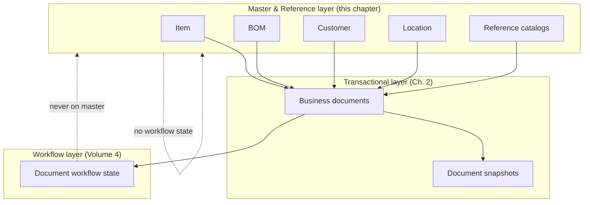
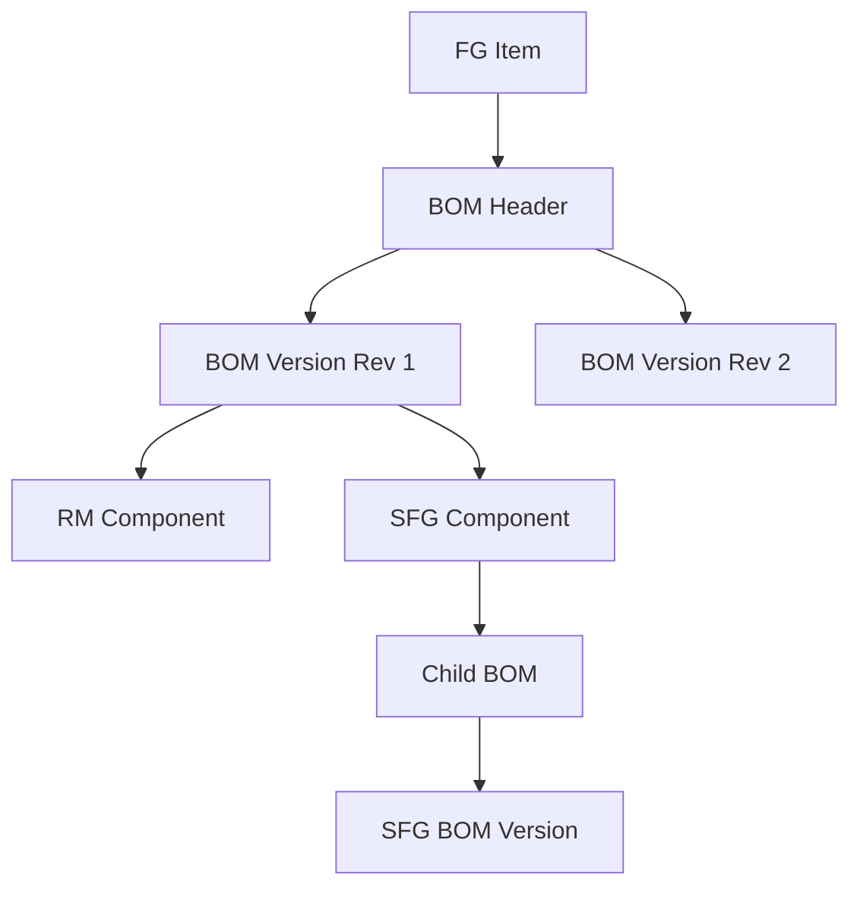
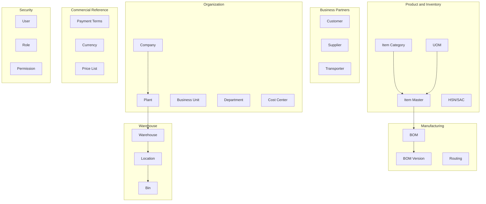
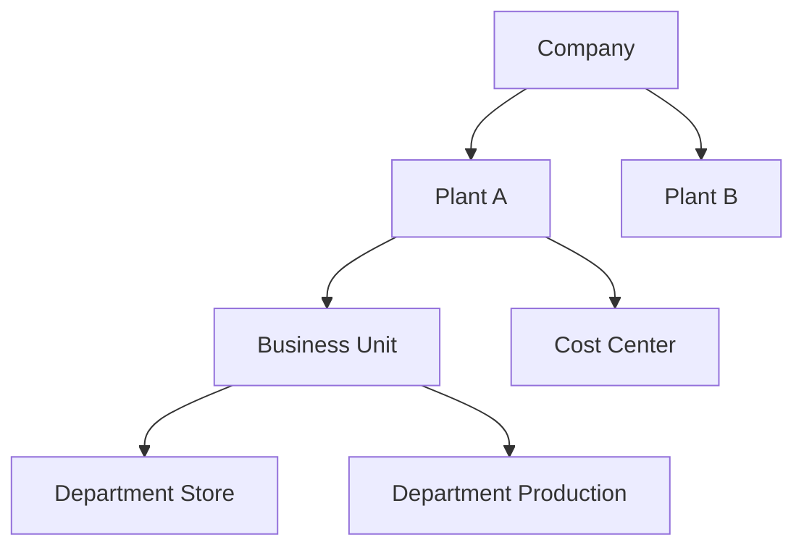
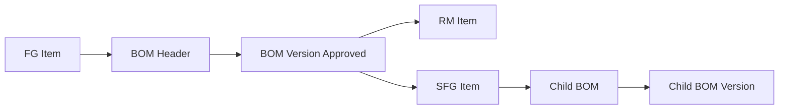
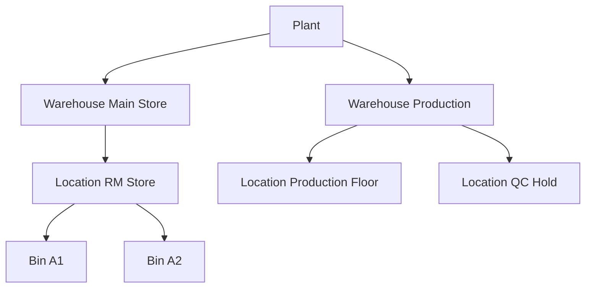
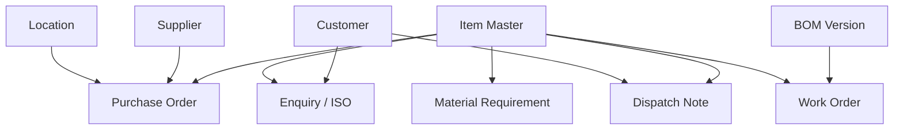
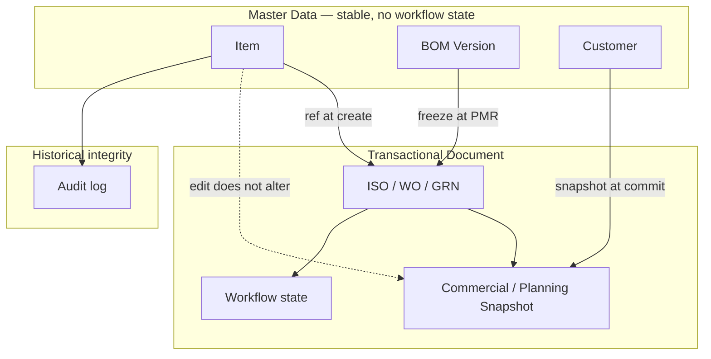

# Master Data & Reference Architecture

| Field | Value |
|-------|-------|
| **Document ID** | FT-PD-052 |
| **Volume** | 5 — Data Architecture |
| **Chapter** | 3 — Master Data & Reference Architecture |
| **Title** | Master Data & Reference Architecture |
| **Version** | 1.0.0 |
| **Status** | Draft — Architecture Review |
| **Effective date** | 2026-05-29 |
| **Author** | FT ERP Product Team |
| **Owner** | FT ERP Product Architecture |
| **Audience** | Data architects, master data owners, domain authors, backend leads |
| **Classification** | Product — Logical Data Architecture |

**Parent documents:**

- [Chapter 2 — Transactional Document Model](./Chapter_02_Transactional_Document_Model.md)
- [Chapter 1 — Workflow Event Store & Correlation Persistence](./Chapter_01_Workflow_Event_Store_and_Correlation_Persistence.md)
- [Volume 4 — Workflow Engine](../04_Workflow_Engine/README.md)
- [Volume 3 — Domain Specifications](../03_Domain_Specifications/README.md)
- [Volume 2 — Business Architecture](../02_Business_Architecture/README.md)

---

## 1. Document Control

| Version | Date | Author | Summary |
|---------|------|--------|---------|
| 1.0.0 | 2026-05-29 | FT ERP Product Team | Initial Master Data & Reference Architecture specification |

**Supersedes:** None.

**Change authority:** Product Architecture. New master entity types require domain owner review and Volume 3 alignment.

**Out of scope:** Physical schema, SQL, ORM, APIs, UI, snapshot field detail (Volume 5 Ch. 4–6).

---

## 2. Purpose

This chapter defines the **canonical logical architecture** for all **Master Data** and **Reference Data** used throughout FT ERP.

It specifies:

- Master data **domains** and taxonomy
- **Ownership**, **lifecycle**, and **relationships**
- **Reference integrity** and **historical preservation**
- **Shared catalogs** and **governance**

This is a **logical architecture document**. It does not define physical database implementation.

---

## 3. Scope

### 3.1 In scope

- Organization, business partner, product, manufacturing, warehouse, commercial, and security master entities
- Reference catalogs (UOM, currency, tax codes, payment terms)
- Lifecycle, versioning, and status policies
- Reference integrity rules and Business Rules
- Relationship to transactional documents ([Ch. 2](./Chapter_02_Transactional_Document_Model.md))

### 3.2 Out of scope

- Transactional document structure (Volume 5 Ch. 2)
- Planning/procurement/commercial **snapshots** on documents (Volume 5 Ch. 4–6)
- Stock ledger postings (Volume 5 Ch. 5)
- Workflow State Machines (Volume 4)
- Tally/export field mapping (Volume 6)

### 3.3 Master Data vs Reference Data vs Transactional Data

| Layer | Definition | Workflow state | Example |
|-------|------------|----------------|---------|
| **Master Data** | Durable business entities with ownership and lifecycle | **None** | Customer, Item, BOM |
| **Reference Data** | Shared, governed catalogs referenced by masters and transactions | **None** | UOM, Currency, HSN/SAC |
| **Transactional Documents** | Workflow-managed business artifacts | **Yes** (Volume 4) | ISO, WO, GRN |
| **Event Store** | Append-only transition history | N/A | `Submitted`, `Posted` events |
| **Audit History** | Compliance and change log | N/A | Master edit, transition audit |

### 3.4 Configuration vs Master Data

**Configuration** (feature flags, sequences, thresholds — [Design Principles §15](../01_Product_Foundation/Chapter_04_FT_ERP_Product_Design_Principles.md)) tunes product behavior. **Master data** describes the factory, partners, and products. Configuration is out of scope except where a catalog entity is explicitly shared (e.g. Payment Terms).

---

## 4. Relationship with Previous Volumes

| Volume | Relationship |
|--------|--------------|
| **Vol. 2** | Domain ownership matrix; pipeline dependencies on approved BOM and items |
| **Vol. 3** | Domain validation rules referencing masters (BOM approval, item type, location) |
| **Vol. 4** | Guards require **Active** masters; masters never participate in workflow transitions |
| **Vol. 5, Ch. 1** | Master changes may emit audit events; not workflow events unless master-approval workflow added |
| **Vol. 5, Ch. 2** | Documents **reference** masters; snapshots preserve point-in-time master context |

### 4.1 How master data supports transactional documents



**Principle:** Transactional documents **consume** master data at create and freeze points. Master data **remains independent** of document workflow state ([MDA-07](#10-business-rules)). Historical documents retain **original references** or **snapshots** — master edits do not rewrite history ([RIR-02](#9-reference-integrity-rules)).

---

## 5. Master Data Domains

### 5.1 Domain taxonomy

| Domain | Entity types | Primary owner role |
|--------|--------------|-------------------|
| **Organization** | Company, Plant, Business Unit, Department, Cost Center | Admin / System |
| **Business Partners** | Customer, Supplier, Transporter | Admin (Customer); Purchase (Supplier) |
| **Product & Inventory** | Item Master, Item Category, Item Group, Brand | Admin / Store |
| **Reference — Product** | UOM, HSN/SAC, Tax Classification | Admin |
| **Manufacturing** | BOM, BOM Version, Operation, Routing, Machine, Work Center, Production Line | Admin / Store |
| **Warehouse** | Warehouse, Location, Bin | Store |
| **Commercial** | Payment Terms, Currency, Price List | Admin |
| **Security** | User, Role, Permission | System / Admin |

### 5.2 Organization

| Entity | Purpose |
|--------|---------|
| **Company** | Legal entity; tenant root for multi-company deployments |
| **Plant** | Manufacturing/site scope; stock and production context |
| **Business Unit** | Operational subdivision within plant |
| **Department** | Functional unit (Commercial, Store, Production, QA) |
| **Cost Center** | Cost allocation anchor for reporting (logical; not workflow driver) |

### 5.3 Business Partners

| Entity | Purpose |
|--------|---------|
| **Customer** | Commercial counterparty; ISO and billing party |
| **Supplier** | Procurement counterparty; PO and GRN party |
| **Transporter** | Logistics carrier reference on Dispatch Note metadata |

### 5.4 Product & Inventory

| Entity | Purpose |
|--------|---------|
| **Item Master** | Canonical material/product identity (RM, SFG, FG, Consumable) |
| **Item Category** | High-level classification for reporting and policy |
| **Item Group** | Grouping for planning, procurement, or pricing rules |
| **Brand** | Commercial/trade brand attribute |
| **UOM** | Unit of measure for qty, issue, and billing |
| **HSN/SAC** | Statutory commodity/service code for tax reporting |
| **Tax Classification** | GST/tax treatment profile linked to items and bills |

### 5.5 Manufacturing

| Entity | Purpose |
|--------|---------|
| **BOM** | Bill of materials header for an FG (or SFG) item |
| **BOM Version** | Immutable released revision of BOM structure and qty basis |
| **Operation** | Standard manufacturing step definition |
| **Routing** | Ordered sequence of operations for an item/BOM |
| **Machine** | Physical equipment asset |
| **Work Center** | Capacity group for operations (machines, labor) |
| **Production Line** | Line-level execution grouping for shop floor |

*BOM Version is the **authoritative** structure for planning explosion, PMR freeze, and feasibility checks.*

### 5.6 Warehouse

| Entity | Purpose |
|--------|---------|
| **Warehouse** | Top-level storage facility within plant |
| **Location** | Addressable stock position (store, production, QC hold, dispatch staging) |
| **Bin** | Sub-location within a location for granular placement (optional depth) |

### 5.7 Commercial reference

| Entity | Purpose |
|--------|---------|
| **Payment Terms** | Due-date and credit rules for commercial documents |
| **Currency** | Monetary unit for quotations, PO, and billing |
| **Price List** | Customer or item price catalog for quotation/ISO commercial lines |

### 5.8 Security

| Entity | Purpose |
|--------|---------|
| **User** | Authenticated operator identity |
| **Role** | Named responsibility bundle (Admin, Store, Purchase, Production, QA) |
| **Permission** | Atomic authorization to perform an action on a resource class |

*Security entities govern **access** to masters and documents; they are not workflow documents.*

---

## 6. Canonical Master Data Structure

For each entity: **purpose**, **business identity**, **owner**, **lifecycle**, **referenced by**, **versioning**, **status**, **audit**. Implementation fields are intentionally omitted.

### 6.1 Organization

#### Company

| Attribute | Value |
|-----------|-------|
| **Purpose** | Legal entity root; GSTIN and statutory identity |
| **Business identity** | Company code |
| **Owner** | System / Admin |
| **Lifecycle** | Proposed → Active → Archived |
| **Referenced by** | Plant, users, commercial snapshots, billing export |
| **Versioning** | Org structure version for hierarchy changes |
| **Status** | Active required for new transactions |
| **Audit** | Create, activate, hierarchy change |

#### Plant

| Attribute | Value |
|-----------|-------|
| **Purpose** | Site/factory scope for stock and production |
| **Business identity** | Plant code |
| **Owner** | Admin |
| **Lifecycle** | Proposed → Active → Suspended → Archived |
| **Referenced by** | Warehouse, WO, stock ledger, GRN |
| **Versioning** | Bound to company org version |
| **Status** | Active for operational transactions |
| **Audit** | Full lifecycle |

#### Business Unit

| Attribute | Value |
|-----------|-------|
| **Purpose** | Operational subdivision |
| **Business identity** | BU code within plant |
| **Owner** | Admin |
| **Lifecycle** | Proposed → Active → Deprecated → Archived |
| **Referenced by** | Reporting dimensions; optional document attributes |
| **Versioning** | Org hierarchy version-aware |
| **Status** | Active for new references |
| **Audit** | Hierarchy moves |

#### Department

| Attribute | Value |
|-----------|-------|
| **Purpose** | Functional alignment with standard roles |
| **Business identity** | Department code |
| **Owner** | Admin |
| **Lifecycle** | Active / Deprecated |
| **Referenced by** | User assignment; routing metadata |
| **Versioning** | Org version-aware |
| **Status** | Active |
| **Audit** | Assignment changes |

#### Cost Center

| Attribute | Value |
|-----------|-------|
| **Purpose** | Cost allocation for management reporting |
| **Business identity** | Cost center code |
| **Owner** | Admin / Finance liaison |
| **Lifecycle** | Active → Deprecated → Archived |
| **Referenced by** | Optional line attributes; export payloads |
| **Versioning** | Effective-dated |
| **Status** | Active for new postings |
| **Audit** | Effective date changes |

---

### 6.2 Business Partners

#### Customer

| Attribute | Value |
|-----------|-------|
| **Purpose** | Commercial counterparty for enquiry through billing |
| **Business identity** | Customer code |
| **Owner** | Admin |
| **Lifecycle** | Proposed → Active → Suspended → Archived |
| **Referenced by** | Enquiry, Quotation, ISO, Dispatch Note, Sales Bill |
| **Versioning** | Address and commercial profile versioned; identity immutable |
| **Status** | Active required for new ISO; Suspended blocks new commercial docs |
| **Audit** | Profile, address, GSTIN changes |

#### Supplier

| Attribute | Value |
|-----------|-------|
| **Purpose** | Procurement counterparty |
| **Business identity** | Supplier code |
| **Owner** | Purchase (maintain); Admin (master create policy) |
| **Lifecycle** | Proposed → Active → Suspended → Archived |
| **Referenced by** | PO, GRN, supplier locations |
| **Versioning** | Commercial address snapshots on PO/GRN |
| **Status** | Active for new PO |
| **Audit** | GSTIN, payment terms, location changes |

#### Transporter

| Attribute | Value |
|-----------|-------|
| **Purpose** | Carrier identity for dispatch logistics |
| **Business identity** | Transporter code |
| **Owner** | Store / Admin |
| **Lifecycle** | Active / Deprecated |
| **Referenced by** | Dispatch Note shipment metadata |
| **Versioning** | None — reference only |
| **Status** | Active for new dispatch |
| **Audit** | Profile edits |

---

### 6.3 Product & Inventory

#### Item Master

| Attribute | Value |
|-----------|-------|
| **Purpose** | Canonical identity for RM, SFG, FG, Consumable |
| **Business identity** | Item code — **immutable** ([RIR-05](#9-reference-integrity-rules)) |
| **Owner** | Admin / Store (item maintenance policy) |
| **Lifecycle** | Proposed → Active → Suspended → Deprecated → Archived |
| **Referenced by** | All document lines, BOM, stock ledger, planning |
| **Versioning** | Item **identity** fixed; descriptive attributes versioned via audit |
| **Status** | Active required for new document lines |
| **Audit** | Type change policy-restricted; UOM/tax linkage changes |

| Item type | Usage |
|-----------|-------|
| **RM** | Procurement, issue, consumption |
| **SFG** | Multi-level BOM; requires child BOM when used as component |
| **FG** | Commercial, WO output, dispatch, billing |
| **Consumable** | Shop-floor consumables where modeled |

#### Item Category

| Attribute | Value |
|-----------|-------|
| **Purpose** | Reporting and policy grouping |
| **Business identity** | Category code |
| **Owner** | Admin |
| **Lifecycle** | Active / Deprecated |
| **Referenced by** | Item Master |
| **Versioning** | Catalog revision optional |
| **Status** | Active |
| **Audit** | Hierarchy changes |

#### Item Group

| Attribute | Value |
|-----------|-------|
| **Purpose** | Planning/procurement/pricing grouping |
| **Business identity** | Group code |
| **Owner** | Admin / Store |
| **Lifecycle** | Active / Deprecated |
| **Referenced by** | Item Master, optional planning rules |
| **Versioning** | None |
| **Status** | Active |
| **Audit** | Membership changes |

#### Brand

| Attribute | Value |
|-----------|-------|
| **Purpose** | Trade/commercial brand attribute |
| **Business identity** | Brand code |
| **Owner** | Admin |
| **Lifecycle** | Active / Deprecated |
| **Referenced by** | Item Master, commercial lines |
| **Versioning** | None |
| **Status** | Active |
| **Audit** | Rename |

#### UOM

| Attribute | Value |
|-----------|-------|
| **Purpose** | Quantity unit for all qty fields |
| **Business identity** | UOM code |
| **Owner** | Admin |
| **Lifecycle** | Active / Deprecated — **reference catalog** |
| **Referenced by** | Item, BOM lines, all qty documents |
| **Versioning** | Immutable code; conversion factors effective-dated |
| **Status** | Deprecated UOM blocked on **new** items |
| **Audit** | Conversion factor changes |

#### HSN/SAC

| Attribute | Value |
|-----------|-------|
| **Purpose** | Statutory classification for GST |
| **Business identity** | HSN/SAC code |
| **Owner** | Admin |
| **Lifecycle** | Active / Deprecated — **reference catalog** |
| **Referenced by** | Item, Sales Bill, Purchase Bill lines |
| **Status** | Active |
| **Audit** | Rate linkage changes |

#### Tax Classification

| Attribute | Value |
|-----------|-------|
| **Purpose** | Tax treatment profile (GST rate, exempt, reverse charge flags) |
| **Business identity** | Tax class code |
| **Owner** | Admin |
| **Lifecycle** | Active / Deprecated |
| **Referenced by** | Item, commercial and billing snapshots |
| **Versioning** | Effective-dated rate schedules |
| **Status** | Active for new lines |
| **Audit** | Rate effective dates |

---

### 6.4 Manufacturing

#### BOM

| Attribute | Value |
|-----------|-------|
| **Purpose** | Header for material structure of FG/SFG item |
| **Business identity** | BOM id keyed to **one FG/SFG item** |
| **Owner** | Admin / Store |
| **Lifecycle** | Draft → Approved → Archived (header) |
| **Referenced by** | Feasibility, planning explosion, PMR, WO |
| **Versioning** | Multiple **BOM Versions** per header |
| **Status** | Approved version required for planning/MR/WO |
| **Audit** | Approve, archive, normalization policy |

#### BOM Version

| Attribute | Value |
|-----------|-------|
| **Purpose** | Immutable released structure and qty basis for one revision |
| **Business identity** | BOM id + revision number |
| **Owner** | Admin / Store |
| **Lifecycle** | Draft → Approved → **Immutable after release** |
| **Referenced by** | PMR freeze, planning snapshots, feasibility |
| **Versioning** | New revision supersedes; old revisions **coexist** for history |
| **Status** | Only **Approved** versions usable in new PMR/planning |
| **Audit** | Release, archive; lines frozen at approve |

#### Operation

| Attribute | Value |
|-----------|-------|
| **Purpose** | Standard manufacturing step |
| **Business identity** | Operation code |
| **Owner** | Admin / Production |
| **Lifecycle** | Active / Deprecated |
| **Referenced by** | Routing |
| **Versioning** | Optional effective dating |
| **Status** | Active |
| **Audit** | Definition changes |

#### Routing

| Attribute | Value |
|-----------|-------|
| **Purpose** | Ordered operations for item manufacture |
| **Business identity** | Routing id + revision |
| **Owner** | Admin / Production |
| **Lifecycle** | Draft → Active → Deprecated |
| **Referenced by** | WO optional metadata; shop-floor planning |
| **Versioning** | Revision coexistence |
| **Status** | Active |
| **Audit** | Revision release |

#### Machine

| Attribute | Value |
|-----------|-------|
| **Purpose** | Equipment asset identity |
| **Business identity** | Machine code |
| **Owner** | Production / Admin |
| **Lifecycle** | Active / Maintenance / Retired |
| **Referenced by** | Work Center, Production Entry optional metadata |
| **Versioning** | None |
| **Status** | Active |
| **Audit** | Status changes |

#### Work Center

| Attribute | Value |
|-----------|-------|
| **Purpose** | Capacity and scheduling group |
| **Business identity** | Work center code |
| **Owner** | Production |
| **Lifecycle** | Active / Suspended |
| **Referenced by** | Routing, operations |
| **Versioning** | None |
| **Status** | Active |
| **Audit** | Capacity changes |

#### Production Line

| Attribute | Value |
|-----------|-------|
| **Purpose** | Physical line grouping for batch production |
| **Business identity** | Line code |
| **Owner** | Production |
| **Lifecycle** | Active / Suspended |
| **Referenced by** | Production Entry, WO optional attributes |
| **Versioning** | None |
| **Status** | Active |
| **Audit** | Assignment changes |

---

### 6.5 Warehouse

#### Warehouse

| Attribute | Value |
|-----------|-------|
| **Purpose** | Storage facility within plant |
| **Business identity** | Warehouse code |
| **Owner** | Store |
| **Lifecycle** | Active / Suspended / Archived |
| **Referenced by** | Location, stock summary |
| **Versioning** | Org/plant binding |
| **Status** | Active for stock transactions |
| **Audit** | Create, suspend |

#### Location

| Attribute | Value |
|-----------|-------|
| **Purpose** | Addressable stock position (store RM, production floor, QC hold, dispatch) |
| **Business identity** | Location code within warehouse/plant |
| **Owner** | Store |
| **Lifecycle** | Active / Suspended / Archived |
| **Referenced by** | GRN, Material Issue, stock ledger, reservations |
| **Versioning** | Hierarchy moves version-aware |
| **Status** | Active required for new stock movement |
| **Audit** | Type and hierarchy changes |

| Location class (logical) | Typical use |
|--------------------------|-------------|
| **Store** | RM/FG storage |
| **Production** | Issued RM / WIP |
| **QC Hold** | Pending QA |
| **Dispatch Staging** | FG ready to ship |

#### Bin

| Attribute | Value |
|-----------|-------|
| **Purpose** | Sub-position within location (optional granularity) |
| **Business identity** | Bin code within location |
| **Owner** | Store |
| **Lifecycle** | Active / Blocked |
| **Referenced by** | GRN line, issue line (when bin tracking enabled) |
| **Versioning** | None |
| **Status** | Active |
| **Audit** | Block/unblock |

---

### 6.6 Commercial reference

#### Payment Terms

| Attribute | Value |
|-----------|-------|
| **Purpose** | Credit period and due-date rules |
| **Business identity** | Terms code — **reference catalog** |
| **Owner** | Admin |
| **Lifecycle** | Active / Deprecated |
| **Referenced by** | Customer, Supplier, Quotation, PO, Sales Bill |
| **Versioning** | Effective-dated |
| **Status** | Active |
| **Audit** | Term changes |

#### Currency

| Attribute | Value |
|-----------|-------|
| **Purpose** | Monetary unit |
| **Business identity** | ISO currency code — **reference catalog** |
| **Owner** | Admin |
| **Lifecycle** | Active / Deprecated |
| **Referenced by** | Quotation, PO, Sales Bill |
| **Versioning** | Exchange rates effective-dated (if multi-currency) |
| **Status** | Active |
| **Audit** | Rate table changes |

#### Price List

| Attribute | Value |
|-----------|-------|
| **Purpose** | Item prices for commercial offers |
| **Business identity** | Price list code + effective period |
| **Owner** | Admin |
| **Lifecycle** | Draft → Active → Expired |
| **Referenced by** | Quotation, ISO commercial lines |
| **Versioning** | Period-based coexistence |
| **Status** | Active for new quotations |
| **Audit** | Price line changes |

---

### 6.7 Security

#### User

| Attribute | Value |
|-----------|-------|
| **Purpose** | Operator identity for auth and audit attribution |
| **Business identity** | User id / login |
| **Owner** | System / Admin |
| **Lifecycle** | Proposed → Active → Suspended → Deactivated |
| **Referenced by** | Audit entries, document creator fields |
| **Versioning** | Role assignment history |
| **Status** | Active for login |
| **Audit** | Role changes, suspend |

#### Role

| Attribute | Value |
|-----------|-------|
| **Purpose** | Standard responsibility (Admin, Store, Purchase, Production, QA) |
| **Business identity** | Role code |
| **Owner** | System / Admin |
| **Lifecycle** | Active / Deprecated |
| **Referenced by** | User, Pending Action routing ([Vol. 2 Ch. 5](../02_Business_Architecture/Chapter_05_Document_Ownership_and_Responsibility_Matrix.md)) |
| **Versioning** | Permission bundle versioned |
| **Status** | Active |
| **Audit** | Permission changes |

#### Permission

| Attribute | Value |
|-----------|-------|
| **Purpose** | Atomic authorization grant |
| **Business identity** | Permission key |
| **Owner** | System |
| **Lifecycle** | Active / Deprecated |
| **Referenced by** | Role composition |
| **Versioning** | Catalog version with product releases |
| **Status** | Active |
| **Audit** | Grant/revoke on role |

---

## 7. Reference Relationships

### 7.1 One-to-many

| Parent | Children |
|--------|----------|
| Company | Plants, warehouses |
| Plant | Warehouses, cost centers |
| Warehouse | Locations |
| Location | Bins (optional) |
| Item (FG) | BOM header |
| BOM | BOM Versions |
| BOM Version | BOM component lines (RM/SFG) |
| Customer | Delivery addresses (logical child) |
| Supplier | Supplier locations |
| Role | Permissions (via mapping) |

### 7.2 Many-to-one

| Child | Parent |
|-------|--------|
| Document line | Item Master |
| BOM component line | Component Item (RM/SFG) |
| GRN line | Item, Location, Supplier |
| User | Department, Role assignments |
| WO / PMR | BOM Version (frozen reference) |

### 7.3 Shared references

Reference catalogs (**UOM**, **Currency**, **HSN/SAC**, **Tax Classification**, **Payment Terms**) are **shared enterprise-wide** — single definition, many consumers. Changes propagate to **new** transactions only unless effective-dating applies.

### 7.4 Cross-domain references

| Master | Domains consuming |
|--------|-------------------|
| **Item** | Commercial (FG lines), Planning, Procurement, MFG, QA, Dispatch, Billing |
| **BOM Version** | Commercial (feasibility), Planning, MFG (PMR) |
| **Customer** | Commercial, Dispatch, Billing |
| **Supplier** | Procurement |
| **Location** | Procurement (GRN), MFG (issue), Stock ledger |
| **Customer delivery address** | ISO snapshot, Dispatch Note |

### 7.5 BOM relationships



- **Single-level** explosion uses approved BOM Version lines directly.
- **Multi-level:** SFG components require **child BOM** with approved version ([Vol. 3 MFG](../03_Domain_Specifications/Chapter_04_Manufacturing_Domain_Specification.md)).
- **PMR freeze** locks BOM Version id — execution does not re-explode on a different revision.

### 7.6 Item usage graph

Items participate in **directed relationships**:

- FG Item → BOM → RM/SFG components
- SFG Item → child BOM → further components
- Same Item may be **FG** in one BOM and **component** in another (different roles — not duplicate identity)

### 7.7 Location hierarchy

```
Company → Plant → Warehouse → Location → Bin (optional)
```

Location **class** (store, production, QC, dispatch) drives validation on GRN, Issue, and dispatch eligibility — not workflow state.

### 7.8 Organization hierarchy

```
Company → Plant → Business Unit → Department
                              ↘ Cost Center (cross-cutting)
```

**Version-aware:** Org restructuring creates a new **org structure version**. Historical documents retain references valid at transaction time ([RIR-06](#9-reference-integrity-rules)).

---

## 8. Master Data Lifecycle

### 8.1 Lifecycle categories

| Category | Meaning | New transaction use | Existing references |
|----------|---------|---------------------|---------------------|
| **Proposed** | Draft master; incomplete | **Blocked** | N/A |
| **Active** | Governed and usable | **Allowed** | Valid |
| **Suspended** | Temporarily blocked | **Blocked** | Existing docs retain ref |
| **Deprecated** | Successor exists; wind-down | **Blocked** for new lines | Historical preserved |
| **Archived** | Retention tier; read-only | **Blocked** | Read-only lookup |

*BOM Version uses **Draft → Approved** with **immutable Approved** — maps to Active + frozen.*

### 8.2 Activation

- **Proposed → Active** requires domain owner approval policy (Item, Customer, Supplier, BOM Version).
- Activation emits **audit** record; does **not** emit workflow transition ([Design Principles §11](../01_Product_Foundation/Chapter_04_FT_ERP_Product_Design_Principles.md)).

### 8.3 Change management

| Change type | Policy |
|-------------|--------|
| **Descriptive** (name, address text) | Allowed on Active; audit logged |
| **Structural** (BOM lines, item type) | New version or restricted policy |
| **Identity** (item code, customer code) | **Prohibited** — create successor master |
| **Tax/rate** | Effective-dated; snapshots on billing docs |

### 8.4 Retirement

- **Deprecated** — no new references; existing transactions unchanged.
- **Archived** — read-only; excluded from pick lists.
- **Never delete** posted-referenced masters — deprecate/archive only ([RIR-11](#9-reference-integrity-rules)).

### 8.5 Replacement

Replacement = **new master record** (or new BOM Version) with **supersession link** to predecessor. Old record remains for historical lookup.

### 8.6 Version coexistence

| Entity | Coexistence rule |
|--------|------------------|
| **BOM Version** | All approved revisions retained; PMR pins one revision |
| **Price List** | Overlapping effective periods disallowed per customer/item policy |
| **Org hierarchy** | Version chain; documents bind to org version at create |
| **Tax rate** | Effective-dated schedules coexist |

---

## 9. Reference Integrity Rules

| ID | Rule |
|----|------|
| **RIR-01** | Transactional documents **reference** master data but **never own** it. |
| **RIR-02** | Master data changes **never rewrite** historical transaction lines or snapshots. |
| **RIR-03** | **Inactive** master records (Suspended, Deprecated, Archived) **cannot** be selected on **new** transactions. |
| **RIR-04** | **BOM Versions** are **immutable** after **Approved** release. |
| **RIR-05** | **Item identity** (item code) is **immutable** after first use in a posted transaction. |
| **RIR-06** | **Organization hierarchy** is **version-aware**; moves do not retroactively re-attribute history. |
| **RIR-07** | Historical documents **preserve original master references** or **point-in-time snapshots** ([Ch. 4–6 planned](./README.md)). |
| **RIR-08** | **SFG** components in BOM require **approved child BOM** before planning/WO guards pass. |
| **RIR-09** | **Location** on stock movements must be **Active** and class-appropriate for movement type. |
| **RIR-10** | **Customer** and **Supplier** commercial addresses on PO/GRN/bills use **snapshot** at document commit — master edit does not alter posted doc. |
| **RIR-11** | Deleting master rows referenced by **posted** documents is **prohibited**. |
| **RIR-12** | **UOM** on document line must match item base UOM or allowed conversion policy. |

---

## 10. Business Rules

| ID | Rule |
|----|------|
| **MDA-01** | Every master record has **one immutable business identity** (code/id). |
| **MDA-02** | Master data is **owned by exactly one domain** (§5.1) — cross-domain **read**, single-domain **write** accountability. |
| **MDA-03** | **Reference data** is **shared across domains** — governed centrally, consumed locally. |
| **MDA-04** | **Versioning preserves historical integrity** — new version does not alter past transactions. |
| **MDA-05** | **Master data changes are auditable** — append-only change log. |
| **MDA-06** | **Transaction history never changes** because master data changes — snapshots and frozen refs authoritative for past docs. |
| **MDA-07** | **Workflow state never belongs to master data** — masters are maintenance surfaces ([Design Principles §11](../01_Product_Foundation/Chapter_04_FT_ERP_Product_Design_Principles.md)). |
| **MDA-08** | **Reference integrity must be enforced across all domains** — guards block invalid master refs ([Vol. 4 Ch. 2](../04_Workflow_Engine/Chapter_02_Transition_Guards_and_Cross_Domain_Dependency_Catalog.md)). |
| **MDA-09** | **Item type** determines domain eligibility (RM on PR/GRN; FG on ISO/WO output). |
| **MDA-10** | **Approved BOM Version** is mandatory for Feasibility pass, MR explosion, and PMR generation. |
| **MDA-11** | **Customer PO reference** is ISO metadata — not a master entity ([TDM-10](./Chapter_02_Transactional_Document_Model.md)). |
| **MDA-12** | **Security permissions** gate master maintenance — not workflow transitions on masters. |
| **MDA-13** | **Plant** scope binds stock — cross-plant issue/transfer requires explicit policy (Volume 5 Ch. 5). |
| **MDA-14** | **Master data maintenance does not emit Pending Actions** unless optional master-approval workflow is configured. |

---

## 11. Logical Diagrams

### 11.1 Master data taxonomy



### 11.2 Organization hierarchy



### 11.3 Item / BOM relationships



### 11.4 Warehouse hierarchy



### 11.5 Cross-domain master references



### 11.6 Transaction vs Master Data relationship



---

## 12. Review Checklist

- [ ] Complete master data coverage (§5–6) — all listed domains
- [ ] Ownership clarity aligned with [Vol. 2 Ch. 5](../02_Business_Architecture/Chapter_05_Document_Ownership_and_Responsibility_Matrix.md)
- [ ] Lifecycle categories consistent (§8)
- [ ] Reference integrity rules (§9) and MDA Business Rules (§10)
- [ ] Cross-domain compatibility with [Ch. 2](./Chapter_02_Transactional_Document_Model.md) documents
- [ ] Historical preservation via snapshots and immutable BOM versions
- [ ] Master vs reference vs transactional distinction clear
- [ ] Workflow state excluded from masters ([MDA-07](#10-business-rules))
- [ ] Six Mermaid diagrams
- [ ] No database, SQL, ORM, API, UI, implementation code

---

## 13. Change Log

| Version | Date | Author | Summary |
|---------|------|--------|---------|
| 1.0.0 | 2026-05-29 | FT ERP Product Team | Initial Master Data Architecture specification |

---

## 14. Approval Block

| Role | Name | Signature | Date |
|------|------|-----------|------|
| Product Owner | | | |
| Product Architecture | | | |
| Data Architecture Lead | | | |
| Domain Specification Owners | | | |
| Master Data Governance Lead | | | |

---

## Document navigation

| | Link |
|--|------|
| **Previous** | [Transactional Document Model](./Chapter_02_Transactional_Document_Model.md) (FT-PD-051) |
| **Next** | [Planning & Procurement Snapshot Architecture](./Chapter_04_Planning_and_Procurement_Snapshot_Architecture.md) (FT-PD-053) |
| **Volume** | [Data Architecture](./README.md) |
| **Product** | [Product Documentation Index](../README.md) |

