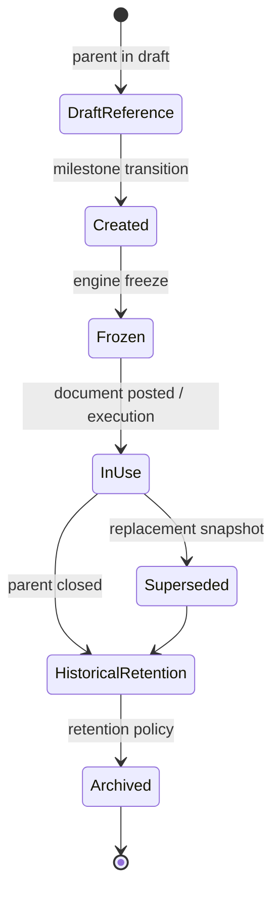
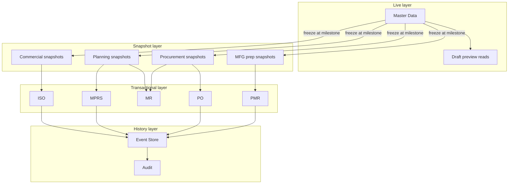
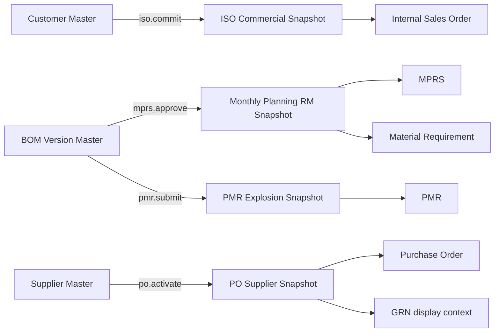
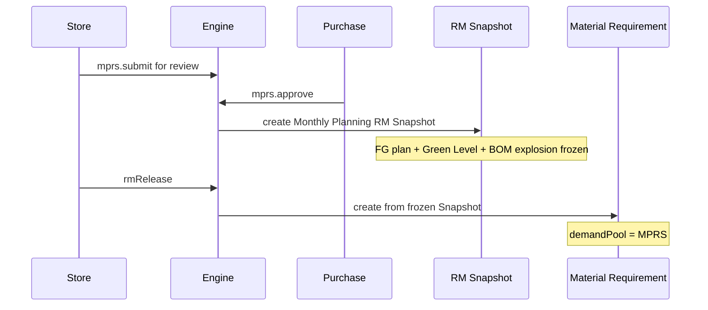
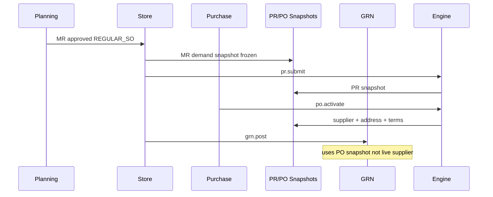
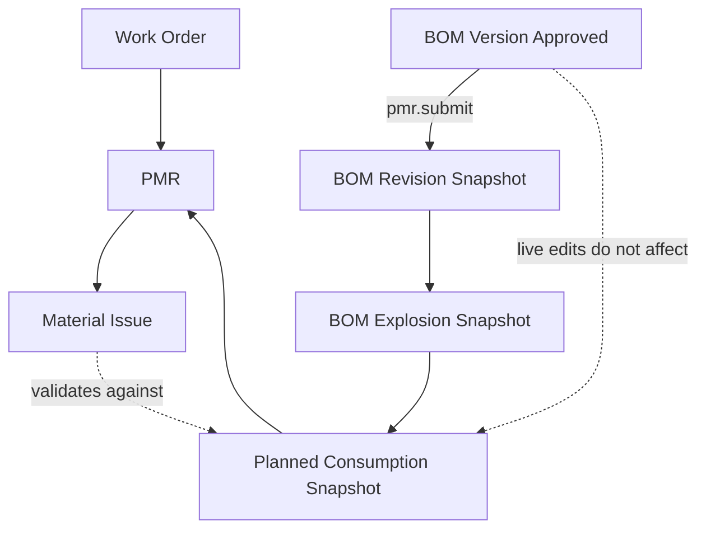
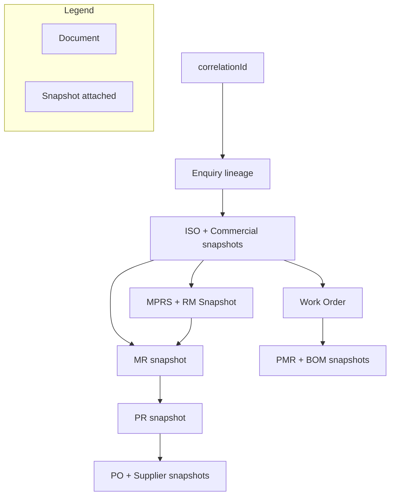

# Planning & Procurement Snapshot Architecture

| Field | Value |
|-------|-------|
| **Document ID** | FT-PD-053 |
| **Volume** | 5 — Data Architecture |
| **Chapter** | 4 — Planning & Procurement Snapshot Architecture |
| **Title** | Planning & Procurement Snapshot Architecture |
| **Version** | 1.0.0 |
| **Status** | Draft — Architecture Review |
| **Effective date** | 2026-05-29 |
| **Author** | FT ERP Product Team |
| **Owner** | FT ERP Product Architecture |
| **Audience** | Data architects, planning/procurement owners, workflow engineers, backend leads |
| **Classification** | Product — Logical Data Architecture |

**Parent documents:**

- [Chapter 3 — Master Data & Reference Architecture](./Chapter_03_Master_Data_and_Reference_Architecture.md)
- [Chapter 2 — Transactional Document Model](./Chapter_02_Transactional_Document_Model.md)
- [Chapter 1 — Workflow Event Store & Correlation Persistence](./Chapter_01_Workflow_Event_Store_and_Correlation_Persistence.md)
- [Volume 3, Ch. 2 — Planning Domain Specification](../03_Domain_Specifications/Chapter_02_Planning_Domain_Specification.md)
- [Volume 3, Ch. 3 — Procurement Domain Specification](../03_Domain_Specifications/Chapter_03_Procurement_Domain_Specification.md)
- [Volume 4, Ch. 4 — Planning Workflow](../04_Workflow_Engine/Chapter_04_Planning_Workflow_State_Machine.md)
- [Volume 4, Ch. 5 — Procurement Workflow](../04_Workflow_Engine/Chapter_05_Procurement_Workflow_State_Machine.md)

---

## 1. Document Control

| Version | Date | Author | Summary |
|---------|------|--------|---------|
| 1.0.0 | 2026-05-29 | FT ERP Product Team | Initial Planning & Procurement Snapshot Architecture |
| 1.0.1 | 2026-05-29 | FT ERP Product Team | Added §6A Snapshot Creation Matrix; §3.4 four-concept distinction; Writing Requirements |

**Supersedes:** None.

**Change authority:** Product Architecture. New snapshot types require Volume 3 domain review and Volume 4 transition side-effect alignment.

**Out of scope:** Physical schema, SQL, ORM, APIs, UI, stock ledger postings (Volume 5 Ch. 5), billing export field mapping (Volume 5 Ch. 6).

---

## 2. Purpose

This chapter defines the **logical snapshot architecture** used by **Planning** and **Procurement** (and supporting **Commercial** and **Manufacturing-preparation** freeze points).

It specifies how planning decisions, commercial context, supplier information, BOM revisions, and procurement context are **frozen at business milestones** to guarantee **historical correctness** independent of later master data changes.

This is a **logical architecture document**. It does not define physical database implementation.

---

## 3. Scope

### 3.1 In scope

- Snapshot philosophy and lifecycle
- Snapshot type taxonomy (Commercial, Planning, Procurement, Manufacturing-preparation)
- **Snapshot Creation Matrix** (§6A) — trigger, freeze, consumers, lifetime per snapshot type
- Ownership, freeze triggers, immutability, supersession
- Reference integrity and Business Rules
- Relationship to master data ([Ch. 3](./Chapter_03_Master_Data_and_Reference_Architecture.md)) and transactional documents ([Ch. 2](./Chapter_02_Transactional_Document_Model.md))

### 3.2 Out of scope

- Master entity definitions (Volume 5 Ch. 3)
- Transactional document workflow states (Volume 4)
- Event Store structure (Volume 5 Ch. 1 — referenced)
- Material Availability Read Model (derived, not snapshot)
- Sales Bill / Dispatch commercial snapshots in detail (Volume 5 Ch. 6 — referenced)

### 3.3 Snapshot vs other persistence layers

| Layer | Mutability | Purpose |
|-------|------------|---------|
| **Live master data** | Governed edit | Current truth for new transactions |
| **Transactional document** | Workflow-controlled | Business artifact with state |
| **Snapshot** | **Immutable after freeze** | Point-in-time business context |
| **Event history** | Append-only | Transition audit trail |
| **Audit history** | Append-only | Compliance and master-change log |

### 3.4 Four architectural concepts — never interchangeable

| Concept | What it is | Mutability | Example |
|---------|------------|------------|---------|
| **Snapshot** | Point-in-time **business context** captured at a workflow milestone | Immutable after freeze | Supplier address on PO at activate |
| **Document revision** | A **new transactional document instance** or version superseding a prior one | Prior revision retained read-only | RS v2 supersedes RS v1; Additional MPRS |
| **Master-data version** | A **released revision** of a master entity (catalog truth for *future* use) | New version coexists; old version historical | BOM Version Rev 3 Approved |
| **Event** | An **append-only workflow transition record** in the Event Store | Never edited | `mprs.approve` at 2026-05-29T10:00 |

**Rule:** A snapshot is **not** a document revision, **not** a master-data version, and **not** an event. Events *record* snapshot creation; master versions *seed* snapshot content; document revisions *may trigger* new snapshots — but each concept has a distinct identity and lifecycle ([§3.5 Writing Requirements](#35-writing-requirements)).

### 3.5 Writing Requirements

This is a **logical data architecture** document.

**Do not include:** database schema, SQL, Prisma models, APIs, UI, implementation code.

**Remain technology-neutral.** Cross-reference Volumes 3–5.

**Clearly distinguish:**

- Master Data
- Transactional Documents
- Snapshots
- Workflow State
- Event Store
- Audit History
- **Snapshot vs document revision vs master-data version vs event** — these four concepts are separate architectural concepts and must **never** be treated as interchangeable (§3.4)

**Emphasize:** historical correctness, immutable business context, BOM revision preservation, planning integrity, procurement integrity, snapshot traceability.

---

## 4. Relationship with Previous Volumes

| Volume | Relationship |
|--------|--------------|
| **Vol. 3, Ch. 2** | Planning freeze, MPRS approval, MR sources — **semantic authority** |
| **Vol. 3, Ch. 3** | PR/PO pools, supplier commercial on PO — **semantic authority** |
| **Vol. 4, Ch. 4** | `mprs.approve`, `mr.approve`, RS lock — **freeze triggers** |
| **Vol. 4, Ch. 5** | `pr.submit`, `po.approve`, `grn.post` — procurement milestones |
| **Vol. 4, Ch. 6** | `pmr.submit` — BOM/RM freeze (manufacturing-preparation) |
| **Vol. 4, Ch. 9** | Cross-domain orchestration; correlation on all parent documents |
| **Vol. 5, Ch. 1** | Snapshot creation may appear in event payload; not workflow state |
| **Vol. 5, Ch. 2** | Parent documents own snapshot references |
| **Vol. 5, Ch. 3** | RIR-02, RIR-07, MDA-06 — master independence rules |

### 4.1 How snapshots bridge Master Data and Transactional Documents

**Principle:** At a workflow milestone, the engine **captures** selected master and computed context into a **snapshot**. Posted and approved documents **never re-read** mutable master fields for authoritative business meaning ([SNP-01](#10-business-rules)).

---

## 5. Snapshot Philosophy

### 5.1 Why snapshots exist

Manufacturing ERP requires **accountability across time**:

- Supplier addresses change; PO paperwork must show the address **at order time**.
- BOM revisions are superseded; PMR and planning must reference the **revision used at freeze**.
- Green Level targets shift; monthly plan approval must preserve **the shortage basis approved by Purchase**.
- Customer commercial terms evolve; committed ISO lines must retain **commitment context**.

Snapshots implement **business immutability** without freezing entire master catalogs.

### 5.2 Business immutability

| Concept | Rule |
|---------|------|
| **Freeze** | Snapshot content fixed at defined workflow transition |
| **Immutability** | No in-place edit after freeze; correction = new document or superseding snapshot |
| **Historical correctness** | Reports and trace views use snapshot + document, not live master |

### 5.3 Effective dating vs snapshots

| Mechanism | Use case |
|-----------|----------|
| **Effective dating** | Master catalogs (tax rates, payment terms) — governs **future** defaults |
| **Snapshots** | Transaction-specific context — governs **this** document forever |

Effective-dated masters may **seed** snapshot content at create; after freeze, the snapshot is authoritative.

### 5.4 Workflow milestone freezing

Snapshots are created as **engine-controlled side effects** on workflow transitions ([Vol. 4 Ch. 1 §9](../04_Workflow_Engine/Chapter_01_Workflow_Engine_Overview_and_Pending_Actions_Contract.md)):

| Pattern | Example transition | Snapshot |
|---------|---------------------|----------|
| **Approve freeze** | `mprs.approve` | Monthly Planning RM Snapshot |
| **Submit freeze** | `pmr.submit` | PMR BOM/RM freeze |
| **Commit capture** | `iso.commit` | ISO commercial commitment snapshot |
| **Activate capture** | `po.activate` | Supplier commercial snapshot on PO |

### 5.5 Audit preservation

- Snapshot **creation** recorded in event payload and audit history.
- Snapshot **content** is not workflow state — it does not transition.
- Master changes after freeze appear only in **master audit** — not in frozen Snapshot.

---

## 6. Snapshot Types

### 6.1 Taxonomy overview

| Category | Snapshot types | Primary parent documents |
|----------|----------------|-------------------------|
| **Commercial** | Customer profile, delivery address, payment terms, tax profile, commercial commitment | ISO, Quotation |
| **Planning** | RS version, MPRS FG plan, Green Level composition, REGULAR order planning, demand pool identity | RS, MPRS, ISO, MR |
| **Procurement** | MR demand lines, PR pool/lines, PO commercial, supplier profile, supplier address, supplier terms | MR, PR, PO |
| **Manufacturing preparation** | BOM revision pin, BOM explosion result, planned RM consumption | PMR, WO planning context |

### 6.2 Commercial snapshots

| Snapshot type | Content frozen | Typical parent |
|---------------|----------------|----------------|
| **Customer details snapshot** | Name, GSTIN, billing profile refs | ISO at commit |
| **Delivery address snapshot** | Ship-to lines, state, contact | ISO; copied to Dispatch |
| **Payment terms snapshot** | Terms code, due-day rules | Quotation / ISO |
| **Tax profile snapshot** | Tax class, HSN/SAC refs per line | ISO commercial lines |
| **Commercial commitment snapshot** | FG lines, qty basis (REGULAR), agreement scope (NO_QTY), buffer policy | ISO at `COMMITTED` |

*Customer PO reference is ISO metadata — included in commitment snapshot when present; not a separate document.*

### 6.3 Planning snapshots

| Snapshot type | Content frozen | Typical parent |
|---------------|----------------|----------------|
| **Requirement Sheet snapshot** | RS version, requirement lines, cycle binding | RS at `LOCKED` |
| **Monthly Planning snapshot (FG plan)** | Period FG planned qty per line; planKind; carry-forward inputs | MPRS at `APPROVED` |
| **Monthly Planning RM Snapshot** | RM lines from BOM explosion of approved FG plan; revision id | MPRS at `mprs.approve` |
| **Green Level snapshot** | Green Level targets and **Green Level Shortage** composition used in plan | MPRS at approve (embedded in FG/RM Snapshot) |
| **REGULAR order Planning Snapshot** | Buffered FG-to-produce intent; RM planning qty per ISO line | ISO / planning milestone (REGULAR) |
| **Demand pool snapshot** | `demandPool` identity: REGULAR_SO \| MPRS \| STOCK_REPLENISHMENT | MR at create; inherited by PR |

### 6.4 Procurement snapshots

| Snapshot type | Content frozen | Typical parent |
|---------------|----------------|----------------|
| **Material Requirement snapshot** | MR lines, shortage qty, source refs (ISO/MPRS), pool | MR at `Approved` / release |
| **Purchase Requisition snapshot** | PR lines, pool, MR linkage, approver context | PR at `SUBMITTED` or `APPROVED` |
| **Purchase Order snapshot** | PO lines, qty, rates, delivery dates | PO at `APPROVED` or `ACTIVATED` |
| **Supplier snapshot** | Supplier code, legal name, GSTIN | PO at activate |
| **Supplier address snapshot** | Bill-from / ship-from address block | PO at activate |
| **Supplier commercial terms snapshot** | Payment terms, incoterms, credit notes | PO at activate |

*GRN inherits PO line and supplier snapshot context — does not re-query live supplier master for posted display.*

### 6.5 Manufacturing preparation snapshots

*Planning terminus hands off to Manufacturing; PMR freeze is the first execution snapshot.*

| Snapshot type | Content frozen | Typical parent |
|---------------|----------------|----------------|
| **BOM revision snapshot** | Approved BOM Version id and revision number | PMR at `pmr.submit` |
| **BOM explosion snapshot** | Component lines, qty per FG/WO qty basis | PMR at `pmr.submit` |
| **Planned consumption snapshot** | RM line qty authorized for issue | PMR at `pmr.submit` |

**Rule:** Execution (Material Issue, Production Entry) references **PMR planned consumption snapshot** — not live BOM re-explosion ([MFGWF-06](../04_Workflow_Engine/Chapter_06_Manufacturing_Workflow_State_Machine.md)).

### 6A. Snapshot Creation Matrix

Authoritative register of **when** each snapshot is created, **what** freezes it, and **who** consumes it. All snapshots listed here are **engine-created** (Workflow Engine side effect on transition). Users trigger the parent document transition; they **never** manually author snapshot rows ([SNP-02](#10-business-rules)).

#### 6A.1 Master matrix

| Snapshot | Created By | Trigger | Frozen At | Referenced By | Lifetime |
|----------|------------|---------|-----------|---------------|----------|
| **Customer Snapshot** | Engine | `iso.commit` | ISO `COMMITTED` | ISO display; Dispatch Note; Sales Bill (via ISO); planning trace | Retained for life of correlation; superseded on commercial revision |
| **Delivery Address Snapshot** | Engine | `iso.commit` | ISO `COMMITTED` | ISO; Dispatch Note; delivery paperwork | Same as parent ISO lineage; copied forward to dispatch |
| **Payment Terms Snapshot** | Engine | `quotation.submit` or `iso.commit` | Quotation `SUBMITTED` / ISO `COMMITTED` | Quotation; ISO; Sales Bill commercial context | Retained per document chain; new quotation replaces operationally |
| **Requirement Sheet Snapshot** | Engine | `rs.lock` | RS `LOCKED` | Planning Cycle; MPRS composition; WO placement (NO_QTY) | Retained until RS `SUPERSEDED`; historical RS versions permanent |
| **Monthly Planning Snapshot** | Engine | `mprs.approve` | MPRS `APPROVED` | RM Release; MPRS trace; MR (MPRS pool) source context | Retained per MPRS document; superseded by Additional Plan MPRS |
| **Green Level Snapshot** | Engine | `mprs.approve` | MPRS `APPROVED` | Monthly Planning Snapshot; Monthly Planning RM Snapshot inputs | Embedded in planning freeze; retained with parent MPRS |
| **Demand Pool Snapshot** | Engine | `mr.create` | MR create (immutable thereafter) | PR; PO; procurement trace; pool segregation guards | Retained for life of MR; inherited by child PR/PO snapshots |
| **Material Requirement Snapshot** | Engine | `mr.approve` (REGULAR) / `rmRelease` (NO_QTY) | MR `APPROVED` / release | PR; procurement trace; WO prepare context (REGULAR) | Retained until MR `CLOSED`; never deleted |
| **Purchase Requisition Snapshot** | Engine | `pr.submit` | PR `SUBMITTED` | PO conversion; procurement trace; approval audit | Retained per PR; superseded if PR cancelled and re-raised |
| **Purchase Order Snapshot** | Engine | `po.approve` | PO `APPROVED` | GRN lines; supplier follow-up; procurement trace | Retained per PO; immutable after first GRN post |
| **Supplier Snapshot** | Engine | `po.activate` | PO `ACTIVATED` | GRN; PO display; supplier trace | Retained with PO; master edits do not alter |
| **Supplier Address Snapshot** | Engine | `po.activate` | PO `ACTIVATED` | GRN; PO paperwork; inbound logistics | Retained with PO |
| **Supplier Commercial Terms Snapshot** | Engine | `po.activate` | PO `ACTIVATED` | GRN; PO; payment follow-up | Retained with PO |
| **BOM Revision Snapshot** | Engine | `pmr.submit` | PMR `SUBMITTED` | PMR; Material Issue validation; production trace | Retained per PMR; never rewritten |
| **BOM Explosion Snapshot** | Engine | `pmr.submit` | PMR `SUBMITTED` | Planned Consumption Snapshot; PMR lines; issue trace | Retained per PMR |
| **Planned Consumption Snapshot** | Engine | `pmr.submit` | PMR `SUBMITTED` | Material Issue; Production Entry consumption envelope | Retained per PMR; ARR supplements without mutation |

#### 6A.2 Architectural attributes per snapshot

| Snapshot | Creation mode | Workflow milestone (freeze) | Parent transactional document | Downstream consumers | Correlation participation | Audit participation |
|----------|---------------|----------------------------|------------------------------|----------------------|---------------------------|---------------------|
| **Customer Snapshot** | Engine-created | `iso.commit` → `COMMITTED` | Internal Sales Order | Dispatch Note, Sales Bill, Control Tower trace | Inherits parent ISO `correlationId` | Creation logged on `iso.commit` event payload |
| **Delivery Address Snapshot** | Engine-created | `iso.commit` → `COMMITTED` | Internal Sales Order | Dispatch Note (ship-to), delivery confirmation | Same `correlationId` as ISO | Same event as ISO commit |
| **Payment Terms Snapshot** | Engine-created | `quotation.submit` or `iso.commit` | Quotation and/or ISO | ISO, Sales Bill | Same `correlationId` | Transition event + terms ref in audit |
| **Requirement Sheet Snapshot** | Engine-created | `rs.lock` → `LOCKED` | Requirement Sheet | Planning Cycle, MPRS, WO placement | Same `correlationId` | `rs.lock` event; version id in payload |
| **Monthly Planning Snapshot** | Engine-created | `mprs.approve` → `APPROVED` | Monthly Production Plan | RM Release, MR (MPRS), planning reports | Same `correlationId` | `mprs.approve` event; `frozenAt` in payload |
| **Green Level Snapshot** | Engine-created | `mprs.approve` → `APPROVED` | Monthly Production Plan | Monthly Planning RM Snapshot composition | Same `correlationId` | Embedded in approve event payload |
| **Demand Pool Snapshot** | Engine-created | MR document create | Material Requirement | PR, PO, pool guards (`GRD_PRC_SINGLE_POOL`) | Same `correlationId` | MR create event records pool identity |
| **Material Requirement Snapshot** | Engine-created | `mr.approve` / release confirm | Material Requirement | PR, Procurement Workspace, REGULAR WO prepare | Same `correlationId` | Approve/release event with line snapshot ref |
| **Purchase Requisition Snapshot** | Engine-created | `pr.submit` → `SUBMITTED` | Purchase Requisition | PO conversion, Purchase follow-up | Same `correlationId` | `pr.submit` event |
| **Purchase Order Snapshot** | Engine-created | `po.approve` → `APPROVED` | Purchase Order | GRN, Material Availability incoming qty | Same `correlationId` | `po.approve` event |
| **Supplier Snapshot** | Engine-created | `po.activate` → `ACTIVATED` | Purchase Order | GRN header context, supplier trace | Same `correlationId` | `po.activate` event |
| **Supplier Address Snapshot** | Engine-created | `po.activate` → `ACTIVATED` | Purchase Order | GRN, inbound documentation | Same `correlationId` | `po.activate` event |
| **Supplier Commercial Terms Snapshot** | Engine-created | `po.activate` → `ACTIVATED` | Purchase Order | GRN, payment scheduling | Same `correlationId` | `po.activate` event |
| **BOM Revision Snapshot** | Engine-created | `pmr.submit` → `SUBMITTED` | PMR (parent WO) | Material Issue guards, production trace | Same `correlationId` | `pmr.submit` event; BOM revision id in payload |
| **BOM Explosion Snapshot** | Engine-created | `pmr.submit` → `SUBMITTED` | PMR | Planned Consumption Snapshot derivation | Same `correlationId` | Same `pmr.submit` event |
| **Planned Consumption Snapshot** | Engine-created | `pmr.submit` → `SUBMITTED` | PMR | Material Issue, Production Entry RM envelope | Same `correlationId` | Same `pmr.submit` event |

**Correlation rule:** Every snapshot participates in factory trace through its **parent transactional document's** `correlationId` (Enquiry root). Snapshots do **not** receive a separate correlation identity ([Ch. 1 §6](./Chapter_01_Workflow_Event_Store_and_Correlation_Persistence.md)).

**Audit rule:** Snapshot **creation** is audit-participating (event payload + audit history). Snapshot **content** does not generate workflow transitions. Master-data edits after freeze appear in **master audit only** — not in the frozen Snapshot ([§5.5](#55-audit-preservation)).

**User-created snapshots:** **None** in standard product. If configuration adds manual snapshot capture, it must still be engine-persisted with explicit audit — not free-form user document edit.

---

## 7. Snapshot Ownership

For each snapshot category: **parent document**, **creation trigger**, **owner**, **frozen at stage**, **modification**, **cancellation**, **replacement**, **audit**.

### 7.1 Commercial snapshots

| Snapshot | Parent | Trigger | Owner | Frozen at | Modify | Cancel | Replace | Audit |
|----------|--------|---------|-------|-----------|--------|--------|---------|-------|
| Customer details | ISO | `iso.commit` | Admin | `COMMITTED` | Prohibited | Void with ISO cancel (pre-planning) | Commercial revision → new snapshot revision | Yes |
| Delivery address | ISO | `iso.commit` | Admin | `COMMITTED` | Prohibited post-commit | Same | Revision workflow | Yes |
| Payment terms | Quotation / ISO | `quotation.submit` / commit | Admin | Submit / commit | Prohibited post-commit | Doc cancel | New quotation / revision | Yes |
| Tax profile | ISO lines | `iso.commit` | Admin | `COMMITTED` | Prohibited | Doc cancel | Commercial revision | Yes |
| Commercial commitment | ISO | `iso.commit` | Admin | `COMMITTED` | Prohibited | Pre-planning cancel only | Controlled commercial revision | Yes |

### 7.2 Planning snapshots

| Snapshot | Parent | Trigger | Owner | Frozen at | Modify | Cancel | Replace | Audit |
|----------|--------|---------|-------|-----------|--------|--------|---------|-------|
| RS version snapshot | RS | `rs.lock` | Store | `LOCKED` | Prohibited | Pre-lock only | New RS version supersedes | Yes |
| MPRS FG plan | MPRS | `mprs.approve` | Store / Purchase | `APPROVED` | Prohibited — `GRD_PLN_FREEZE` | MPRS cancel (policy) | Additional Plan (new MPRS) | Yes |
| Monthly Planning RM Snapshot | MPRS | `mprs.approve` | Engine | `APPROVED` | **Prohibited** | MPRS cancel (policy) | New plan revision / Additional Plan | Yes — `snapshotRevision`, `frozenAt` in event |
| Green Level composition | MPRS | `mprs.approve` | Engine | `APPROVED` | Prohibited | With MPRS | New MPRS period plan | Embedded in RM Snapshot |
| REGULAR order planning | ISO | Planning milestone / commit policy | Store | REGULAR planning active | Prohibited post-freeze | ISO cancel (policy) | Re-snapshot on controlled replan | Yes |
| Demand pool identity | MR | `mr.create` / approve | Store | MR create | **Immutable** | MR cancel | New MR document | Yes |

### 7.3 Procurement snapshots

| Snapshot | Parent | Trigger | Owner | Frozen at | Modify | Cancel | Replace | Audit |
|----------|--------|---------|-------|-----------|--------|--------|---------|-------|
| MR demand snapshot | MR | `mr.approve` / release | Store | Approved / released | Prohibited | MR close/cancel | New MR | Yes |
| PR snapshot | PR | `pr.submit` | Store / Purchase | `SUBMITTED` | Prohibited post-submit | PR cancel | New PR | Yes |
| PO line snapshot | PO | `po.approve` | Purchase | `APPROVED` | Prohibited post-approve | PO cancel (pre-GRN) | New PO | Yes |
| Supplier profile | PO | `po.activate` | Purchase | `ACTIVATED` | Prohibited | PO cancel (policy) | New PO | Yes |
| Supplier address | PO | `po.activate` | Purchase | `ACTIVATED` | Prohibited | PO cancel (policy) | New PO | Yes |
| Supplier terms | PO | `po.activate` | Purchase | `ACTIVATED` | Prohibited | PO cancel (policy) | New PO | Yes |

### 7.4 Manufacturing preparation snapshots

| Snapshot | Parent | Trigger | Owner | Frozen at | Modify | Cancel | Replace | Audit |
|----------|--------|---------|-------|-----------|--------|--------|---------|-------|
| BOM revision pin | PMR | `pmr.submit` | Store | `SUBMITTED` | **Prohibited** | PMR reversal (policy) | New PMR (policy) | Yes |
| BOM explosion | PMR | `pmr.submit` | Engine | `SUBMITTED` | Prohibited | PMR reversal | ARR for supplement only | Yes |
| Planned consumption | PMR | `pmr.submit` | Engine | `SUBMITTED` | Prohibited | PMR reversal | ARR — not PMR line edit | Yes |

**Ownership rule:** Snapshot **owner** matches parent document owner at freeze ([Vol. 2 Ch. 5](../02_Business_Architecture/Chapter_05_Document_Ownership_and_Responsibility_Matrix.md)). **Creation** is **engine-controlled** — users do not manually edit frozen Snapshot rows ([SNP-02](#10-business-rules)).

---

## 8. Snapshot Lifecycle

### 8.1 Lifecycle stages

| Stage | Meaning |
|-------|---------|
| **Draft reference** | Parent editable; live master read for preview only |
| **Snapshot creation** | Engine persists snapshot instance on transition |
| **Freeze** | Content immutable; guards block parent edits that would invalidate snapshot |
| **Usage** | Downstream documents reference snapshot id / embedded copy |
| **Historical retention** | Retained for trace; read-only |
| **Supersession** | New snapshot instance replaces operational reference; old retained |
| **Archival** | Long-term retention tier; no operational use |

### 8.2 Supersession patterns

| Scenario | Pattern |
|----------|---------|
| **Additional MPRS** | New MPRS document + new RM Snapshot; prior snapshot historical |
| **Commercial revision** | New commitment snapshot revision; planning uses latest approved revision |
| **BOM revision for new WO** | New PMR with new BOM revision snapshot; old PMR historical |
| **Duplicate MR resolved** | Cancel superseded MR; snapshot retained |

### 8.3 Cancellation

- Cancelling **parent document** does not **delete** snapshot — marks parent terminal; snapshot remains for audit.
- **Posted GRN** with PO supplier snapshot — PO cancel blocked; snapshot immutable regardless.

---

## 9. Reference Integrity Rules

| ID | Rule |
|----|------|
| **SIR-01** | **Posted** planning/procurement documents **never re-read** mutable master data for authoritative qty, address, or BOM meaning. |
| **SIR-02** | Snapshots are **immutable after freeze** — no in-place field updates. |
| **SIR-03** | Later master data changes **never rewrite** existing snapshots. |
| **SIR-04** | **BOM revision snapshots** preserve execution integrity — Material Issue validates against PMR snapshot, not live BOM ([Constitution Art. 16](../01_Product_Foundation/Chapter_02_FT_ERP_Constitution.md)). |
| **SIR-05** | **Supplier address** changes on master **never affect** historical Purchase Orders or posted GRNs. |
| **SIR-06** | **Planning snapshots** preserve **approval context** — Purchase-approved MPRS RM lines match snapshot at release. |
| **SIR-07** | **Snapshot lineage** traceable via `correlationId` on parent document and artifact graph ([Ch. 1 §7](./Chapter_01_Workflow_Event_Store_and_Correlation_Persistence.md)). |
| **SIR-08** | **demandPool** captured in MR/PR snapshots — must match across MR → PR → PO chain ([PRC-01](../03_Domain_Specifications/Chapter_03_Procurement_Domain_Specification.md)). |
| **SIR-09** | **Green Level Shortage** in approved MPRS is **not re-computed** at RM release — release reads frozen RM Snapshot. |
| **SIR-10** | **REGULAR** and **NO_QTY** planning snapshots **never mixed** in one MR or PR snapshot. |
| **SIR-11** | Snapshot **supersession** creates a **new instance** — does not mutate prior instance. |
| **SIR-12** | Downstream guards validate **snapshot presence** at required milestones (`GRD_PLN_FREEZE`, `GRD_MFG_PMR_FROZEN`). |

---

## 10. Business Rules

| ID | Rule |
|----|------|
| **SNP-01** | Every **posted or approved** planning/procurement document **owns** its required snapshots. |
| **SNP-02** | **Snapshot creation is engine-controlled** on workflow transitions — not user free-form edit. |
| **SNP-03** | **Snapshot updates prohibited after freeze** — corrections via reversal, replacement document, or superseding snapshot. |
| **SNP-04** | **Snapshot replacement creates a new snapshot instance** — prior instance retained. |
| **SNP-05** | **Historical transactions always reference frozen business context** — snapshots or embedded snapshot copies. |
| **SNP-06** | Snapshots **participate in audit history** (creation record) but **not workflow state**. |
| **SNP-07** | Snapshots **never own business workflows** — parent document owns workflow ([MDA-07](./Chapter_03_Master_Data_and_Reference_Architecture.md)). |
| **SNP-08** | **Monthly Planning RM Snapshot** mandatory before MPRS **RM Release** ([PLN-04](../03_Domain_Specifications/Chapter_02_Planning_Domain_Specification.md)). |
| **SNP-09** | **PMR submit** mandatory before Material Issue against WO ([MFG-02](../03_Domain_Specifications/Chapter_04_Manufacturing_Domain_Specification.md)). |
| **SNP-10** | **ISO commit** captures commercial commitment snapshot before `PLANNING_ACTIVE` ([CDS-06](../03_Domain_Specifications/Chapter_01_Commercial_Domain_Specification.md)). |
| **SNP-11** | **PO activate** captures supplier snapshots before GRN posting uses PO context. |
| **SNP-12** | Snapshot ids (or logical keys) **link in artifact graph** as child nodes of parent document where trace depth required. |
| **SNP-13** | **Preview / draft** screens may show live master — **posted views** use snapshot. |
| **SNP-14** | **ARR** creates **new procurement demand** — does not alter frozen PMR or MPRS snapshots. |

---

## 11. Logical Diagrams

### 11.1 Snapshot architecture

### 11.2 Live Master → Snapshot → Transaction

### 11.3 Planning snapshot lifecycle

### 11.4 Procurement snapshot lifecycle

### 11.5 BOM revision snapshot

### 11.6 Overall snapshot ecosystem

---

## 12. Review Checklist

- [ ] Snapshot completeness — Commercial, Planning, Procurement, MFG prep (§6)
- [ ] **Snapshot Creation Matrix** complete for all 16 snapshot types (§6A)
- [ ] Engine-created vs user-created distinguished — all standard snapshots engine-created (§6A.2)
- [ ] Four concepts distinguished — snapshot, document revision, master-data version, event (§3.4)
- [ ] Historical correctness — immutability after freeze (§5, §9)
- [ ] Master data independence — SIR/SNP rules align with Ch. 3
- [ ] Workflow integration — freeze triggers match Vol. 4 Ch. 4–6
- [ ] Audit participation — creation in event/audit; no workflow state on snapshots
- [ ] Correlation compatibility — lineage via parent `correlationId`
- [ ] demandPool and REGULAR/NO_QTY segregation in snapshots
- [ ] Six Mermaid diagrams
- [ ] No database, SQL, ORM, API, UI, implementation code

---

## 13. Change Log

| Version | Date | Author | Summary |
|---------|------|--------|---------|
| 1.0.0 | 2026-05-29 | FT ERP Product Team | Initial Planning & Procurement Snapshot Architecture (includes §6A Snapshot Creation Matrix and §3.4 four-concept distinction) |

---

## 14. Approval Block

| Role | Name | Signature | Date |
|------|------|-----------|------|
| Product Owner | | | |
| Product Architecture | | | |
| Data Architecture Lead | | | |
| Planning Domain Owner | | | |
| Procurement Domain Owner | | | |
| Workflow Engineering Lead | | | |

---

## Document navigation

| | Link |
|--|------|
| **Previous** | [Master Data & Reference Architecture](./Chapter_03_Master_Data_and_Reference_Architecture.md) (FT-PD-052) |
| **Next** | [Inventory Ledger & Stock Persistence Architecture](./Chapter_05_Inventory_Ledger_and_Stock_Persistence_Architecture.md) (FT-PD-054) |
| **Volume** | [Data Architecture](./README.md) |
| **Product** | [Product Documentation Index](../README.md) |
---

## Document navigation

| | Link |
|--|------|
| **Previous** | [Master Data & Reference Architecture](./Chapter_03_Master_Data_and_Reference_Architecture.md) (FT-PD-052) |
| **Next** | [Inventory Ledger & Stock Persistence Architecture](./Chapter_05_Inventory_Ledger_and_Stock_Persistence_Architecture.md) (FT-PD-054) |
| **Volume** | [Data Architecture](./README.md) |
| **Product** | [Product Documentation Index](../README.md) |

