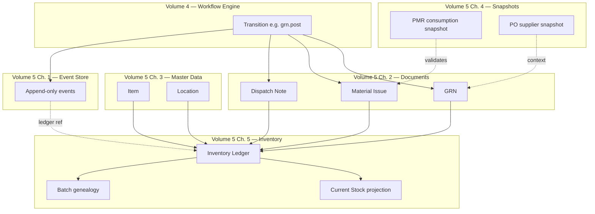
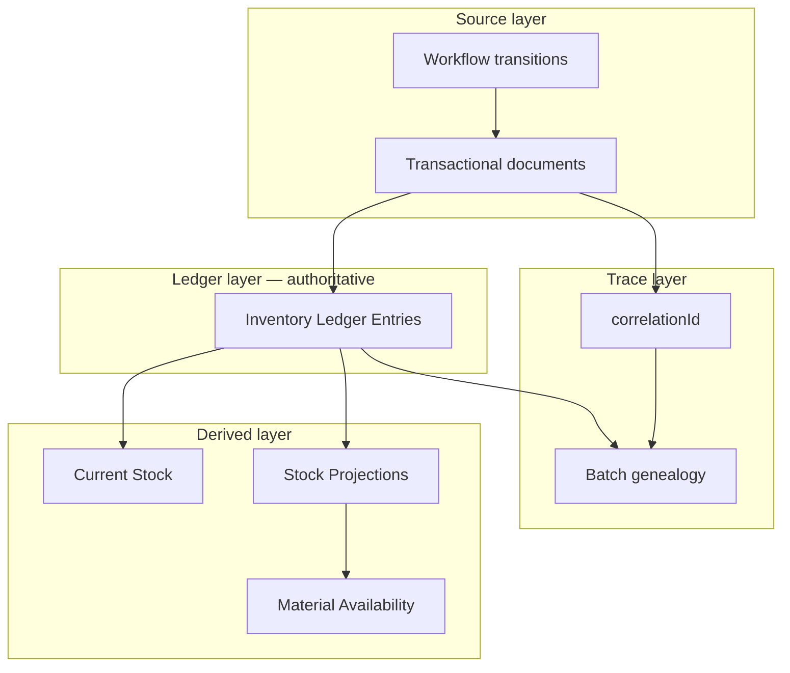
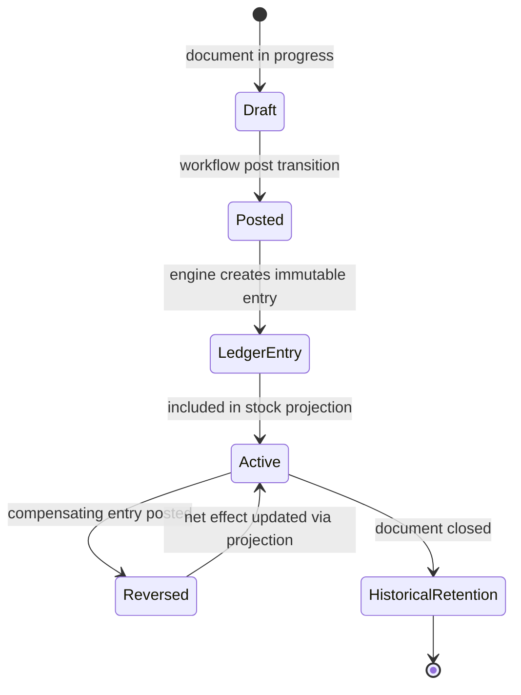
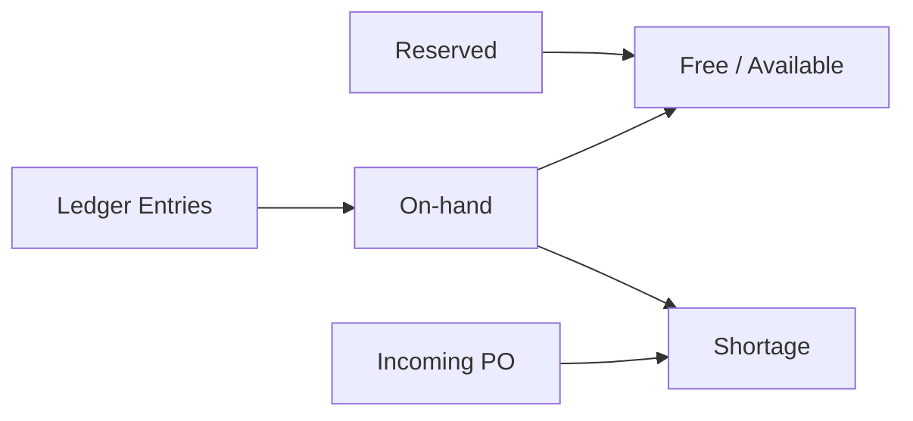
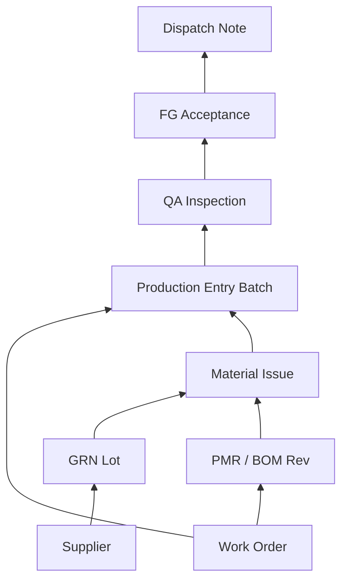
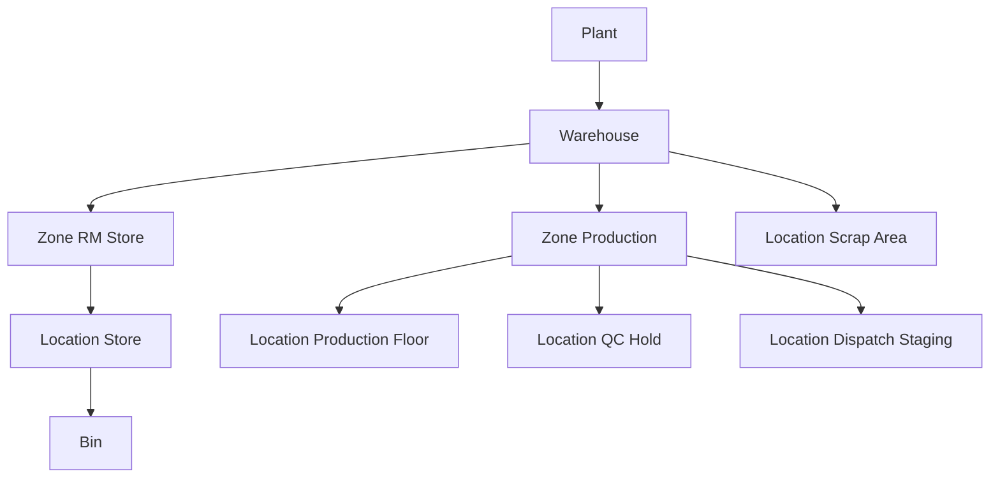
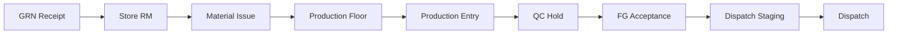

# Inventory Ledger & Stock Persistence Architecture

| Field | Value |
|-------|-------|
| **Document ID** | FT-PD-054 |
| **Volume** | 5 — Data Architecture |
| **Chapter** | 5 — Inventory Ledger & Stock Persistence Architecture |
| **Title** | Inventory Ledger & Stock Persistence Architecture |
| **Version** | 1.0.0 |
| **Status** | Draft — Architecture Review |
| **Effective date** | 2026-05-29 |
| **Author** | FT ERP Product Team |
| **Owner** | FT ERP Product Architecture |
| **Audience** | Data architects, Store/inventory owners, workflow engineers, compliance leads |
| **Classification** | Product — Logical Data Architecture |

**Parent documents:**

- [Chapter 4 — Planning & Procurement Snapshot Architecture](./Chapter_04_Planning_and_Procurement_Snapshot_Architecture.md)
- [Chapter 3 — Master Data & Reference Architecture](./Chapter_03_Master_Data_and_Reference_Architecture.md)
- [Chapter 2 — Transactional Document Model](./Chapter_02_Transactional_Document_Model.md)
- [Chapter 1 — Workflow Event Store & Correlation Persistence](./Chapter_01_Workflow_Event_Store_and_Correlation_Persistence.md)
- [Volume 3, Ch. 3 — Procurement](../03_Domain_Specifications/Chapter_03_Procurement_Domain_Specification.md)
- [Volume 3, Ch. 4 — Manufacturing](../03_Domain_Specifications/Chapter_04_Manufacturing_Domain_Specification.md)
- [Volume 3, Ch. 5 — QA](../03_Domain_Specifications/Chapter_05_Quality_Assurance_Domain_Specification.md)
- [Volume 3, Ch. 6 — Dispatch & Billing](../03_Domain_Specifications/Chapter_06_Dispatch_and_Billing_Domain_Specification.md)
- [Volume 4, Ch. 5–8](../04_Workflow_Engine/README.md)

---

## 1. Document Control

| Version | Date | Author | Summary |
|---------|------|--------|---------|
| 1.0.0 | 2026-05-29 | FT ERP Product Team | Initial Inventory Ledger & Stock Persistence Architecture |

**Supersedes:** None.

**Change authority:** Product Architecture. New ledger movement types require Volume 3 domain review and Volume 4 transition side-effect alignment.

**Out of scope:** Physical schema, SQL, ORM, APIs, UI, billing export (Volume 5 Ch. 6).

---

## 2. Purpose

This chapter defines the **canonical logical architecture for inventory persistence** in FT ERP — the **single source of truth** for inventory movement across RM, SFG, FG, Consumables, Scrap, and all warehouse locations.

It specifies:

- **Inventory Ledger** structure and immutability
- **Stock movements** and posting rules
- **Batch/lot traceability** and genealogy
- **Warehouse and location** hierarchy
- **Inventory ownership** and historical integrity
- **Inventory reconstruction** from ledger replay

This is a **logical architecture document**. It does not define physical database implementation.

---

## 3. Scope

### 3.1 In scope

- Ledger-first inventory model
- All standard stock movements (procurement through dispatch)
- Batch genealogy (forward and backward trace)
- Warehouse/location/bin persistence semantics
- Stock projections (on-hand, reserved, free)
- Ledger replay and point-in-time reconstruction
- Integration with workflow, events, documents, snapshots, master data
- **Inventory Movement Creation Matrix** (§7A)

### 3.2 Out of scope

- Planning/procurement **business snapshots** (Volume 5 Ch. 4 — referenced at post time)
- Commercial/billing snapshots (Volume 5 Ch. 6)
- Material Availability **formula** detail (Volume 3 Ch. 3 — behavior authority)
- Physical count **UI** and cycle-count procedures (Volume 6)

### 3.3 Persistence layer distinctions

| Concept | Role | Mutability |
|---------|------|------------|
| **Inventory Ledger Entry** | Authoritative movement record | **Immutable** — reversals via compensating entries |
| **Current Stock** | Aggregated balance projection | **Derived** — never edited directly |
| **Inventory Snapshot** | Point-in-time balance capture for audit/report | Immutable once taken; **not** ledger substitute |
| **Stock Projection** | Reserved, incoming, free, shortage views | **Derived** — refreshed on ledger/reservation change |
| **Inventory Event** | Workflow transition triggering ledger post | Append-only in Event Store |
| **Transactional Document** | Business artifact (GRN, Issue, etc.) | Workflow state; posts ledger on milestone |
| **Planning Snapshot** | Frozen BOM/qty context (Ch. 4) | Immutable; informs validation, not stock qty |

---

## 4. Relationship with Previous Volumes

| Volume | Relationship |
|--------|--------------|
| **Vol. 3, Ch. 3** | GRN posting, Material Availability buckets — **semantic authority** |
| **Vol. 3, Ch. 4** | Material Issue, Production Entry consumption — **semantic authority** |
| **Vol. 3, Ch. 5** | FG Acceptance, Scrap — QA stock impact |
| **Vol. 3, Ch. 6** | Dispatch Note stock decrement |
| **Vol. 4, Ch. 5–8** | `grn.post`, `materialIssue.post`, `fgAcceptance.post`, `dispatchNote.post` — **ledger triggers** |
| **Vol. 5, Ch. 1** | Workflow events reference ledger entry ids in payload |
| **Vol. 5, Ch. 2** | Source documents for every ledger entry |
| **Vol. 5, Ch. 3** | Item, Location, Warehouse master refs |
| **Vol. 5, Ch. 4** | PMR/PO snapshots validate issue/receipt context at post |

### 4.1 Integration architecture



**Principle:** Posted transactional documents **generate** immutable ledger entries. Current stock is **always derived** from the ledger ([ILG-01](#12-business-rules)).

---

## 5. Inventory Philosophy

### 5.1 Inventory as financial and operational asset

Inventory represents **physical material** with **operational accountability** (Constitution Art. 9) and **financial significance**. Every unit in a production or dispatch location must trace to a ledger movement with a source document.

### 5.2 Immutable inventory history

Ledger entries are **never edited or deleted**. Corrections use **compensating reversal entries** linked to the original entry. Audit and compliance require a complete, append-only movement history.

### 5.3 Ledger-first architecture

| Layer | Authority |
|-------|-----------|
| **Ledger** | System of record for all quantity changes |
| **Stock balance** | Projection computed from ledger |
| **Availability display** | Projection + reservations + incoming supply |

No parallel spreadsheet or manual stock override bypasses the ledger for posted material.

### 5.4 Stock derived from ledger

**Current Stock** at any `(item, location, bucket)` = sum of ledger entry effects through that point in time. Direct balance mutation is **prohibited** ([ILG-02](#12-business-rules)).

### 5.5 Historical reconstruction

Given the full ledger (and reservation history where applicable), **any historical on-hand** at a timestamp can be recomputed. Reconstruction must match what operators saw at post time ([ILG-08](#12-business-rules)).

### 5.6 Event-driven inventory updates

Inventory ledger posts occur as **engine-controlled side effects** on workflow transitions — not as silent background jobs detached from documents ([Vol. 4 Ch. 1](../04_Workflow_Engine/Chapter_01_Workflow_Engine_Overview_and_Pending_Actions_Contract.md)).

### 5.7 Physical inventory vs logical inventory

| Type | Meaning |
|------|---------|
| **Physical inventory** | Material confirmed present at a location (GRN, count, issue) |
| **Logical inventory** | Reservations, incoming PO qty, WIP envelopes not yet physically moved |

Only **physical movements** create ledger entries. Logical allocations update **Stock Projections** (reserved/free) without double-counting on-hand.

### 5.8 Concept distinctions

| Concept | Definition |
|---------|------------|
| **Ledger Entry** | One immutable inventory movement record |
| **Current Stock** | Live aggregated balance from ledger |
| **Inventory Snapshot** | Frozen balance image at count/audit instant — supplementary to ledger |
| **Stock Projection** | Material Availability, reserved, incoming — derived Read Models |
| **Inventory Event** | Workflow transition event that caused ledger post |

*Inventory Snapshot (this chapter) ≠ Planning Snapshot (Ch. 4).*

---

## 6. Inventory Domains

| Domain | Item types | Typical locations | Primary movements |
|--------|------------|-------------------|-------------------|
| **Raw Material (RM)** | RM | Store, production floor | GRN, Issue, Return, Consumption |
| **Semi-Finished Goods (SFG)** | SFG | Store, production, QC | Production, Issue (multi-level), Transfer |
| **Finished Goods (FG)** | FG | QC hold, dispatch staging, store | FG Acceptance, Dispatch |
| **Consumables** | Consumable | Store, production | GRN, Issue, Adjustment |
| **Scrap** | RM/FG/SFG (rejected) | Scrap area | Scrap posting, adjustment |
| **Customer-owned material** | *Future-ready* | Quarantine/consignment | Receipt/issue with ownership flag |
| **Vendor-owned inventory** | *Future-ready* | Consignment store | GRN with vendor ownership; no COGS until consumed |

**Ownership dimension:** Each ledger entry carries **inventory ownership** — `COMPANY` (default), `CUSTOMER`, `VENDOR` (future-ready fields; logical model only).

---

## 7. Inventory Ledger Model

### 7.1 Logical ledger entry

Each **Inventory Ledger Entry** (Stock Transaction) represents one atomic movement effect.

| Attribute | Responsibility |
|-----------|----------------|
| **Inventory transaction id** | Unique immutable identity |
| **Transaction type** | Movement classification (GRN, ISSUE, DISPATCH, etc.) |
| **Source document** | GRN, Material Issue, Production Entry, FG Acceptance, Dispatch Note, Adjustment doc |
| **Source workflow event** | Event Store reference for transition that triggered post |
| **Item** | Item Master reference |
| **Batch/Lot** | Batch identity when trace required |
| **Warehouse** | Warehouse Master reference |
| **Location** | Location Master reference |
| **Quantity in / out** | Signed movement effect (policy: separate in/out or net qty) |
| **UOM** | Unit from item master at post time |
| **Stock bucket** | Usable, QC hold, reserved transfer, scrap (logical partition) |
| **Ownership** | Company / customer / vendor |
| **correlationId** | Factory trace root from source document |
| **Reversal link** | Points to original entry when compensating |
| **Audit participation** | Actor, timestamp, reason on post and reversal |

**Responsibilities:**

- **Record** exactly one movement effect per entry line
- **Reference** source document and workflow event — never standalone orphan qty
- **Preserve** item/location/batch context for reconstruction
- **Link** reversals without mutating original entry

---

## 7A. Inventory Movement Creation Matrix

All standard movements are **engine-created** on workflow transition (or authorized adjustment workflow). Users authorize the **document transition**; the engine writes ledger entries.

| Inventory Movement | Created By | Trigger | Source Document | Ledger Effect | Stock Effect | Reversible | Correlation Participation |
|--------------------|------------|---------|-----------------|---------------|--------------|------------|---------------------------|
| **Opening Balance** | Engine (admin-authorized) | Opening balance post | Opening Balance / Stock Init | +qty to location (IN) | Increases on-hand | Yes — compensating reversal | Optional tenant scope; not order-correlated |
| **GRN Receipt** | Engine | `grn.post` | Goods Receipt Note | +RM/Consumable IN at receiving location | Increases on-hand; refreshes incoming | Yes — GRN reversal workflow | Inherits PO/MR `correlationId` |
| **Material Issue** | Engine | `materialIssue.post` | Material Issue | −qty OUT store; +qty IN production location (paired transfer) | Store ↓ production ↑ | Yes — issue reversal / return | WO/PMR `correlationId` |
| **Material Return** | Engine | `materialReturn.post` | Material Return Note | +qty IN store; −qty OUT production | Reverses issue envelope | Yes — return reversal | Same WO `correlationId` |
| **Production Consumption** | Engine | `productionEntry.approve` | Production Entry | −qty OUT production (RM consumed) | Production location ↓ | Yes — PE reversal (policy) | WO `correlationId` |
| **FG Production Post** | Engine | `productionEntry.approve` | Production Entry | +FG qty IN QC hold / WIP (policy) | QC/WIP ↑ pending QA | Yes — PE reversal | WO `correlationId` |
| **FG Acceptance** | Engine | `fgAcceptance.post` | FG Acceptance | +FG IN dispatch-eligible location | Dispatch-eligible stock ↑ | Yes — QA reversal (policy) | QA/PE `correlationId` |
| **Scrap Posting** | Engine | `scrapRecord.post` | Scrap Record | −qty OUT (usable/QC) to scrap bucket/area | On-hand ↓ scrap ↑ | No undelete — adjustment only | QA `correlationId` |
| **Dispatch** | Engine | `dispatchNote.post` | Dispatch Note | −FG OUT dispatch staging | Dispatch-eligible ↓ | Yes — dispatch reversal | ISO `correlationId` |
| **Stock Transfer** | Engine | Location transfer post | Transfer doc / Issue transfer leg | −OUT source location; +IN target | Location rebalance | Yes — transfer reversal | Optional WO/project ref |
| **Physical Count Adjustment** | Engine (authorized) | Count post / approve | Physical Count | ±qty ADJUSTMENT per variance | On-hand corrected | Yes — compensating adjustment | Audit-driven; optional correlation |
| **Manual Correction** | Engine (authorized only) | Approved correction workflow | Stock Correction | ±qty ADJUSTMENT with reason | On-hand corrected | Yes — compensating entry required | Audit mandatory |

### 7A.1 Movement classification

| Class | Movements | Nature |
|-------|-----------|--------|
| **Engine-created, user-authorized** | GRN, Issue, Return, PE, FG Acceptance, Scrap, Dispatch | Operational — tied to workflow documents |
| **Engine-created, admin-authorized** | Opening Balance, Physical Count, Manual Correction | Governance — explicit approval policy |
| **Financial vs operational** | All movements are **operational** ledger facts; financial valuation is downstream (Volume 6+) | Ledger qty is operational source of truth |
| **Permanent vs compensating** | Initial post = permanent entry; reversal = **new compensating entry** linked to original — never in-place edit | |

---

## 8. Stock Movement Architecture

For each movement class: **source document**, **ledger impact**, **inventory domain**, **correlation**, **audit**.

### 8.1 Procurement — GRN

| Attribute | Value |
|-----------|-------|
| **Source document** | Goods Receipt Note |
| **Ledger impact** | +IN per line at receiving location; links PO line |
| **Domain** | RM, Consumables |
| **Correlation** | Inherits procurement chain `correlationId` |
| **Audit** | `grn.post` event; PO supplier snapshot context (Ch. 4) |

### 8.2 Manufacturing — Material Issue

| Attribute | Value |
|-----------|-------|
| **Source document** | Material Issue |
| **Ledger impact** | Store OUT → production IN (transfer pair); may reserve release |
| **Domain** | RM (primary), Consumables |
| **Correlation** | WO / PMR lineage |
| **Audit** | Validates against PMR Planned Consumption Snapshot |

### 8.3 Manufacturing — Production Entry

| Attribute | Value |
|-----------|-------|
| **Source document** | Production Entry |
| **Ledger impact** | RM consumption OUT; FG/WIP IN; creates Production Batch ref |
| **Domain** | RM consumption; FG/SFG output |
| **Correlation** | WO `correlationId` |
| **Audit** | Consumption within issued envelope |

### 8.4 Manufacturing — Material Return

| Attribute | Value |
|-----------|-------|
| **Source document** | Material Return Note |
| **Ledger impact** | Production OUT → store IN |
| **Domain** | RM |
| **Correlation** | WO |
| **Audit** | Linked to prior issue lines |

### 8.5 QA — FG Acceptance

| Attribute | Value |
|-----------|-------|
| **Source document** | FG Acceptance |
| **Ledger impact** | +FG IN dispatch-eligible bucket/location |
| **Domain** | FG |
| **Correlation** | QA Inspection / PE chain |
| **Audit** | Accepted qty from QA disposition |

### 8.6 QA — Scrap

| Attribute | Value |
|-----------|-------|
| **Source document** | Scrap Record |
| **Ledger impact** | −OUT from usable/QC; +IN scrap area (or write-off OUT only) |
| **Domain** | RM, FG, SFG (rejected) |
| **Correlation** | QA chain |
| **Audit** | Permanent reject — no return to accepted |

### 8.7 Dispatch — Dispatch Note

| Attribute | Value |
|-----------|-------|
| **Source document** | Dispatch Note |
| **Ledger impact** | −FG OUT dispatch staging |
| **Domain** | FG |
| **Correlation** | ISO `correlationId` |
| **Audit** | Batch refs on dispatch lines |

### 8.8 Adjustments

| Movement | Source | Ledger | Domain |
|----------|--------|--------|--------|
| **Opening Balance** | Stock initialization | +IN | All item types |
| **Stock Correction** | Authorized correction | ±ADJUSTMENT | Per item/location |
| **Physical Count** | Count document | ±ADJUSTMENT vs system | Per count scope |
| **Stock Transfer** | Inter-location transfer | OUT + IN pair | All physical domains |

All adjustments require **authorized workflow** and **audit reason**. Correlation optional unless tied to order context.

---

## 9. Batch & Lot Traceability

### 9.1 Identity

| Term | Definition |
|------|------------|
| **Batch identity** | Production lot id created on Production Entry approve — primary FG trace unit |
| **Lot identity** | Supplier or RM lot on GRN line — primary inbound trace unit |
| **Parent-child batches** | Rework re-entry creates child batch linked to parent PE batch |

### 9.2 Genealogy

**Production genealogy (forward):** GRN lot → Issue → Consumption → PE batch → QA → FG Acceptance → Dispatch batch ref

**Material genealogy (backward):** FG dispatch batch → FG Acceptance → PE batch → Issue lines → PMR → BOM Revision → WO → (optional) GRN lots

### 9.3 Batch lifecycle

```
Created (PE approve or GRN post)
  → In QC (QA pending)
  → Accepted (FG Acceptance) | Scrapped | Rework (child batch)
  → Dispatched (partial or full)
  → Closed (fully dispatched or scrapped)
```

### 9.4 Trace operations

| Direction | From | To |
|-----------|------|-----|
| **Forward trace** | GRN lot / supplier | WO, PE batches, dispatch |
| **Backward trace** | Dispatch FG batch | PE, issues, PMR, BOM version, GRN, supplier |

Every **FG batch** on a Dispatch Note must resolve backward to **Production Entry**, **Material Issue**, **PMR**, **Work Order**, **BOM Revision**, and where applicable **GRN** and **Supplier** ([ILG-07](#12-business-rules)).

---

## 10. Warehouse & Location Persistence

### 10.1 Hierarchy

```
Company → Plant → Warehouse → Zone (optional) → Location → Bin (optional)
```

| Entity | Purpose |
|--------|---------|
| **Warehouse** | Facility boundary for stock summary |
| **Zone** | Logical subdivision (RM store, FG store, production adjunct) |
| **Location** | Addressable stock position |
| **Bin** | Granular slot within location |

### 10.2 Location classes

| Class | Purpose | Typical domains |
|-------|---------|-----------------|
| **Store** | RM/FG/SFG storage | RM, FG |
| **Production Floor** | Issued RM / WIP | RM, SFG |
| **QC Hold** | Pending QA FG | FG |
| **Dispatch Staging** | Dispatch-eligible FG | FG |
| **Scrap Area** | Rejected material | Scrap |

### 10.3 Inventory ownership by location

- **Company-owned** stock default at all operational locations
- **QC Hold** — FG ownership unchanged; dispatch eligibility blocked until FG Acceptance
- **Scrap Area** — material removed from usable buckets; still company inventory until write-off policy
- **Future:** customer/vendor-owned at designated consignment locations

Ledger entries always record **warehouse + location + bucket** — not warehouse alone.

---

## 11. Inventory Reconstruction

### 11.1 Ledger replay

Recompute balances by replaying ledger entries in **posting sequence** (timestamp + transaction id tie-break). Sum effects per `(item, location, bucket)` to derive on-hand at any point.

### 11.2 Point-in-time stock

**As-of timestamp T** = replay all entries where `postedAt ≤ T`. Must match historical reports generated at T ([ILG-08](#12-business-rules)).

### 11.3 Historical inventory

Archived ledger entries remain in replay set forever. Cancelled **documents** retain posted ledger history unless formally reversed.

### 11.4 Audit reconstruction

Auditors can rebuild: document → workflow event → ledger entry → batch genealogy → `correlationId` factory trace.

### 11.5 Event replay interaction

Workflow Event Store replay **re-derives workflow state** — it does **not** re-post ledger entries. Ledger is already authoritative; event replay validates document state consistency ([Ch. 1 §10](./Chapter_01_Workflow_Event_Store_and_Correlation_Persistence.md)).

### 11.6 Recovery principles

| Principle | Rule |
|-----------|------|
| **No silent rebuild** | Missing ledger detected via reconciliation — not auto-regenerated from stock table |
| **Compensate, don't delete** | Errors corrected by reversal entries |
| **Snapshot supplementary** | Inventory balance snapshots (count freeze) supplement — never replace — ledger |

---

## 12. Business Rules

| ID | Rule |
|----|------|
| **ILG-01** | **Inventory is derived from ledger entries** — not edited balances. |
| **ILG-02** | **Stock is a projection** — Current Stock = aggregate of ledger effects. |
| **ILG-03** | **Ledger entries are immutable** — no in-place edit or delete. |
| **ILG-04** | **Posted transactions always generate ledger entries** — one post, one ledger effect set. |
| **ILG-05** | **Reversals generate compensating entries** linked to the original. |
| **ILG-06** | **Inventory history is never deleted** — retention permanent. |
| **ILG-07** | **Batch genealogy is fully traceable** forward and backward. |
| **ILG-08** | **Inventory reconstruction must reproduce historical stock** at any timestamp. |
| **ILG-09** | **Inventory balance snapshots never replace ledger history** (Ch. 4 planning snapshots ≠ ledger). |
| **ILG-10** | **Material Issue** requires PMR Planned Consumption Snapshot validation ([Ch. 4 §6A](./Chapter_04_Planning_and_Procurement_Snapshot_Architecture.md)). |
| **ILG-11** | **GRN** posts only to **Active** locations ([RIR-09](./Chapter_03_Master_Data_and_Reference_Architecture.md)). |
| **ILG-12** | **Dispatch** decrements only **dispatch-eligible** FG (post FG Acceptance). |
| **ILG-13** | **Scrap posting** permanently removes material from usable buckets. |
| **ILG-14** | **Reservations** affect **Stock Projection** (free/available) — not a substitute for physical issue ledger. |
| **ILG-15** | Every ledger entry carries **correlationId** when source document participates in factory trace. |

---

## 13. Logical Diagrams

### 13.1 Inventory architecture



### 13.2 Ledger lifecycle



### 13.3 Stock projection



### 13.4 Batch genealogy



### 13.5 Warehouse hierarchy



### 13.6 End-to-end inventory flow



---

## 14. Review Checklist

- [ ] Ledger completeness — all movement types (§7A, §8)
- [ ] Inventory integrity — ILG rules; ledger-first (§5, §12)
- [ ] Batch traceability — forward/backward (§9)
- [ ] Warehouse hierarchy — location classes (§10)
- [ ] Historical reconstruction — replay principles (§11)
- [ ] Correlation compatibility — `correlationId` on entries (§7)
- [ ] Audit participation — source event + actor (§7)
- [ ] Snapshot compatibility — Ch. 4 validation at post; not ledger substitute (§3.3, ILG-09)
- [ ] Six Mermaid diagrams
- [ ] No database, SQL, ORM, API, UI, implementation code

---

## 15. Change Log

| Version | Date | Author | Summary |
|---------|------|--------|---------|
| 1.0.0 | 2026-05-29 | FT ERP Product Team | Initial Inventory Ledger & Stock Persistence Architecture |

---

## 16. Approval Block

| Role | Name | Signature | Date |
|------|------|-----------|------|
| Product Owner | | | |
| Product Architecture | | | |
| Data Architecture Lead | | | |
| Store / Inventory Domain Owner | | | |
| Manufacturing Domain Owner | | | |
| Workflow Engineering Lead | | | |

---

## Writing Requirements

This is a **logical data architecture** document.

**Do not include:** database schema, SQL, Prisma models, APIs, UI, implementation code.

**Remain technology-neutral.** Cross-reference Volumes 3–5.

**Clearly distinguish:**

- Inventory Ledger
- Current Stock
- Inventory Snapshot (balance capture)
- Planning Snapshot (Ch. 4)
- Transactional Document
- Workflow State
- Event Store
- Audit History

**Emphasize:** ledger-first architecture, immutable inventory history, batch genealogy, historical reconstruction, warehouse hierarchy, complete inventory traceability.

---

## Document navigation

| | Link |
|--|------|
| **Previous** | [Planning & Procurement Snapshot Architecture](./Chapter_04_Planning_and_Procurement_Snapshot_Architecture.md) (FT-PD-053) |
| **Next** | [Read Models, Reporting & Analytical Persistence](./Chapter_06_Read_Models_Reporting_and_Analytical_Persistence.md) (FT-PD-055) |
| **Volume** | [Data Architecture](./README.md) |
| **Product** | [Product Documentation Index](../README.md) |

