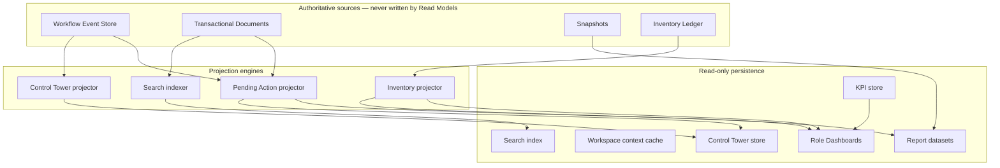
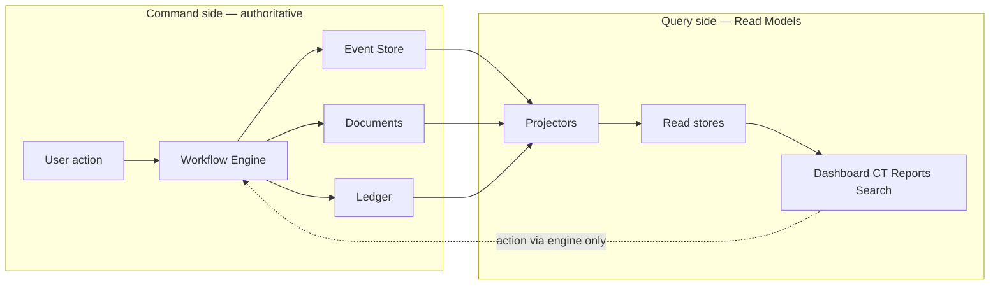
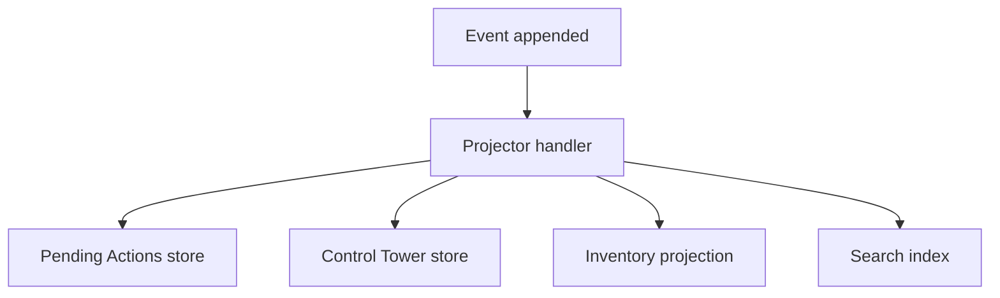
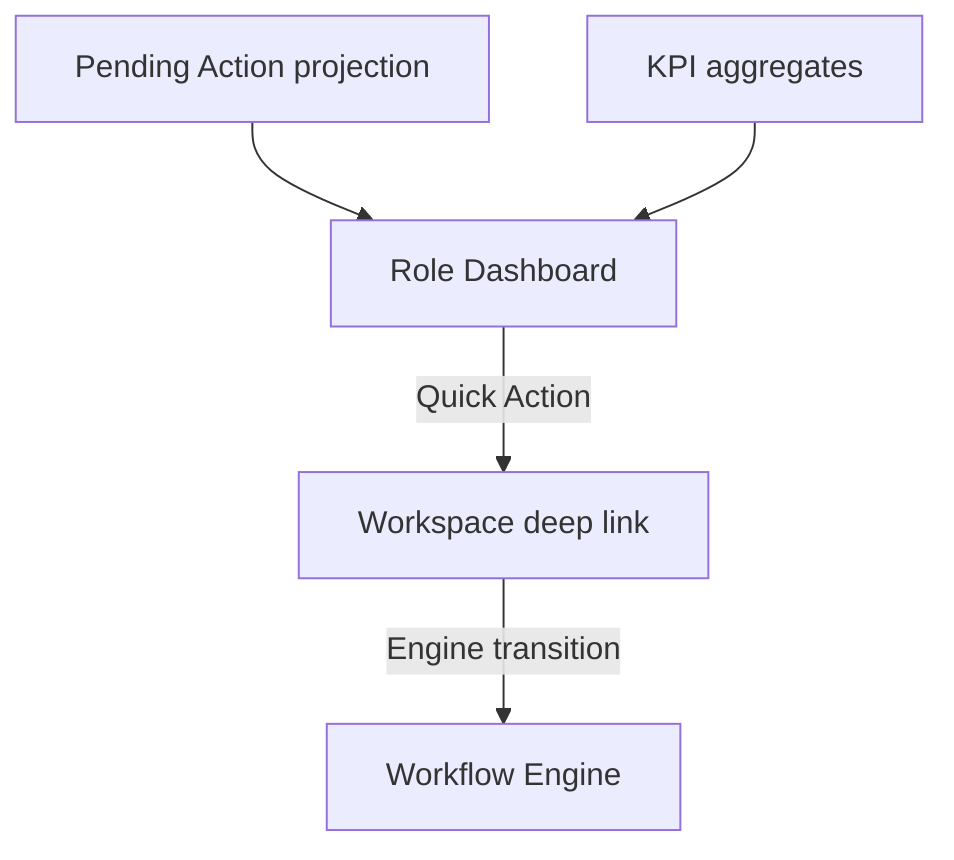
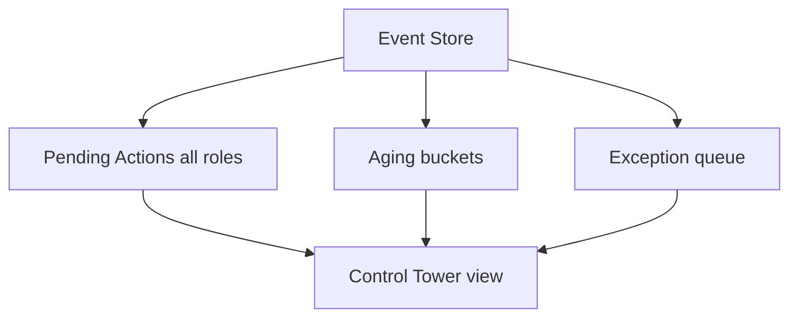
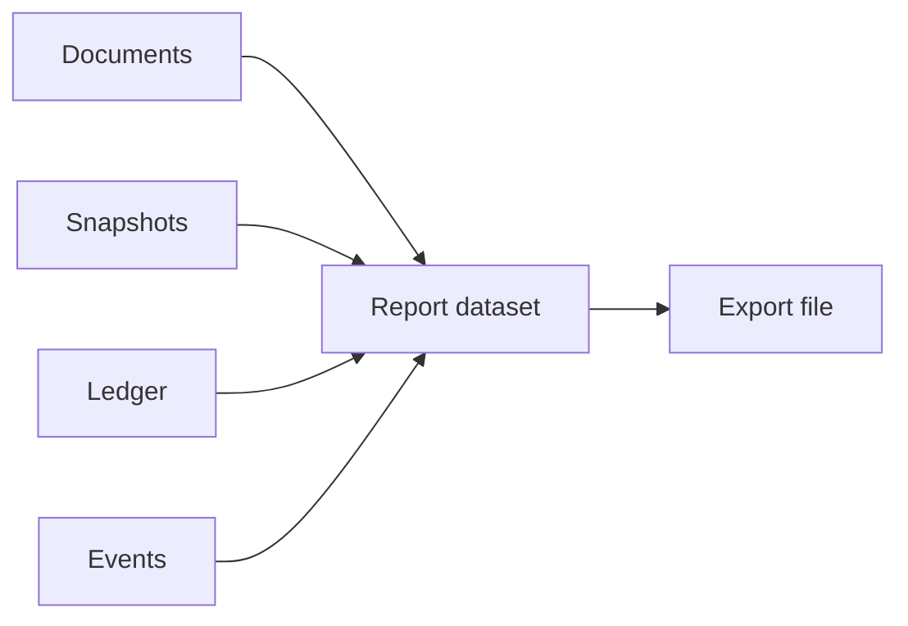
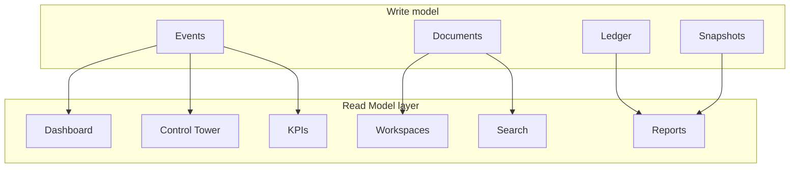

# Read Models, Reporting & Analytical Persistence

| Field | Value |
|-------|-------|
| **Document ID** | FT-PD-055 |
| **Volume** | 5 — Data Architecture |
| **Chapter** | 6 — Read Models, Reporting & Analytical Persistence |
| **Title** | Read Models, Reporting & Analytical Persistence |
| **Version** | 1.0.0 |
| **Status** | Draft — Architecture Review |
| **Effective date** | 2026-05-29 |
| **Author** | FT ERP Product Team |
| **Owner** | FT ERP Product Architecture |
| **Audience** | Data architects, analytics owners, workflow engineers, product leads |
| **Classification** | Product — Logical Data Architecture |

**Parent documents:**

- [Chapter 5 — Inventory Ledger & Stock Persistence Architecture](./Chapter_05_Inventory_Ledger_and_Stock_Persistence_Architecture.md)
- [Chapter 4 — Planning & Procurement Snapshot Architecture](./Chapter_04_Planning_and_Procurement_Snapshot_Architecture.md)
- [Chapter 1 — Workflow Event Store & Correlation Persistence](./Chapter_01_Workflow_Event_Store_and_Correlation_Persistence.md)
- [Volume 4, Ch. 1 — Pending Actions, Dashboard, Control Tower](../04_Workflow_Engine/Chapter_01_Workflow_Engine_Overview_and_Pending_Actions_Contract.md)
- [Volume 3 — Domain Specifications](../03_Domain_Specifications/README.md)

---

## 1. Document Control

| Version | Date | Author | Summary |
|---------|------|--------|---------|
| 1.0.0 | 2026-05-29 | FT ERP Product Team | Initial Read Models, Reporting & Analytical Persistence Architecture |

**Supersedes:** None.

**Change authority:** Product Architecture. New projection types require Volume 4 Pending Action / Control Tower alignment.

**Out of scope:** Physical schema, SQL, ORM, APIs, UI implementation, screen layouts (Volume 6).

---

## 2. Purpose

This chapter defines the **logical persistence architecture for all ERP Read Models** — query-optimized projections that power **Dashboards**, **Workspaces**, **Control Tower**, **KPIs**, **Reporting**, **Analytics**, and **Search**.

Read Models are **projections derived from** Workflow Events, Transactional Documents, Snapshots, and the Inventory Ledger. They **never become the system of record**.

---

## 3. Scope

### 3.1 In scope

- Read Model philosophy (CQRS separation)
- Read Model categories and projection matrix (§7)
- Reporting, KPI, and search persistence models
- Refresh, rebuild, and eventual consistency rules
- Integration with Volumes 5 Ch. 1–5 source layers

### 3.2 Out of scope

- Authoritative transactional writes (Ch. 2)
- Snapshot freeze semantics (Ch. 4)
- Ledger posting rules (Ch. 5)
- HTTP API contracts (Volume 7)
- Report screen design (Volume 6)

### 3.3 System of record vs Read Models

| Layer | Authority | Read Model relationship |
|-------|-----------|-------------------------|
| **Workflow Event Store** | Transition history | Source — projections subscribe |
| **Transactional Documents** | Business state | Source — denormalized for query |
| **Snapshots** | Frozen context | Source — display/trace only |
| **Inventory Ledger** | Stock truth | Source — aggregated for availability |
| **Read Models** | **None** — derived only | Consumer-facing query stores |

---

## 4. Relationship with Previous Volumes

| Volume | Relationship |
|--------|--------------|
| **Vol. 3** | Domain queues, Material Availability semantics, workspace surfaces |
| **Vol. 4, Ch. 1** | Dashboard, Workspace, Control Tower, Pending Actions contracts |
| **Vol. 4, Ch. 9** | Cross-domain orchestration events feed Control Tower |
| **Vol. 5, Ch. 1** | Event Store streams to projections; Pending Action persistence (§8) |
| **Vol. 5, Ch. 2** | Document types indexed for search and reports |
| **Vol. 5, Ch. 4** | Snapshot refs on report rows — not live master |
| **Vol. 5, Ch. 5** | Ledger replay for stock reports; not balance table authority |

### 4.1 Read Model consumption architecture

**Principle:** Read Models **consume** authoritative layers. No Dashboard, report, or KPI **writes back** to workflow state, ledger, or documents ([RMP-01](#11-business-rules)).

---

## 5. Read Model Philosophy

### 5.1 CQRS separation

**Command side:** Workflow Engine transitions, document posts, ledger entries (write model).

**Query side:** Read Models optimized for filters, joins, aggregates, and search (Read Model).

Commands and queries share **logical identity** (document id, correlationId) but **not** storage authority.

### 5.2 Projection-first reads

Dashboard, Control Tower, and operational reports **read projections first**. Direct ad hoc scans of the Event Store or ledger are reserved for **trace, audit, and rebuild** — not routine UI lists.

### 5.3 Event-driven refresh

Primary refresh trigger: **workflow event appended** or **ledger entry posted**. Projectors incrementally update read stores ([RMP-08](#11-business-rules)).

### 5.4 Query optimization

Read Models **denormalize** for common access patterns:

- Pending Actions by `ownerRole`
- Control Tower by domain + aging
- Material Availability by item
- Search by document number and correlationId

### 5.5 Eventual consistency

Read Models may lag milliseconds to seconds behind the write model. UI must tolerate brief staleness; **Workspace actions** always re-validate via engine Guards on submit — never trust Read Model alone for mutation eligibility.

### 5.6 Read-only persistence

Read Model stores accept **insert/update/delete only from projectors** — never from user actions or report exports.

### 5.7 Rebuildability

Every projection must be **rebuildable** from authoritative sources (events + documents + ledger + snapshots). Search indexes are **disposable** ([RMP-07](#11-business-rules)).

### 5.8 Concept distinctions

| Concept | Definition |
|---------|------------|
| **Transaction** | Authoritative write (document transition, ledger post) |
| **Projection** | Derived read store row or aggregate |
| **Dashboard** | Role-scoped Pending Action + KPI surface |
| **Report** | Tabular or export dataset (operational or analytical) |
| **Analytics** | Trend, cohort, and executive aggregates over time |

---

## 6. Read Model Categories

| Category | Purpose | Primary consumers |
|----------|---------|-------------------|
| **Dashboard** | Role inbox — Pending Actions, quick counts | Admin, Store, Purchase, Production, QA |
| **Workspace** | Document context cache for action screens | All operational roles |
| **Pending Actions** | Materialized work queue ([Ch. 1 §8](./Chapter_01_Workflow_Event_Store_and_Correlation_Persistence.md)) | Dashboard, Control Tower |
| **Control Tower** | Factory-wide monitor, aging, bottlenecks, exceptions | All roles (monitor); escalation deep-links |
| **Reports** | Operational registers, trace, compliance exports | Store, Purchase, Admin, audit |
| **Search** | Global and domain lookup | All roles |
| **KPIs** | Queue depth, cycle time, throughput metrics | Dashboard, Executive views |
| **Analytics** | Historical trends, planning/procurement analytics | Admin, management |

---

## 7. Projection Creation Matrix

| Projection | Source Events | Source Documents | Refresh Trigger | Refresh Strategy | Consumer | Rebuildable |
|------------|---------------|------------------|-------------------|------------------|----------|-------------|
| **Role Dashboards** | All domain transition events | Open documents per role | Event append; PA materialize | Incremental per event + periodic reconcile | Dashboard UI | Yes |
| **Control Tower** | Cross-domain events; guard failures; phase changes | All open + recently closed docs | Event append; scheduled aging tick | Incremental + time-based aging refresh | Control Tower UI | Yes |
| **Pending Actions** | State-entry events per Vol. 4 PA catalog | Document state + ownership rules | Event append; resolve on exit state | Incremental materialize/supersede | Dashboard, Control Tower, Workspace | Yes — from Event Store |
| **Inventory — Material Availability** | `grn.post`, issue/return, reservation change | GRN, Issue, MR, PMR allocations | Ledger post; reservation change | Incremental recompute per item scope | RM Control Center, planning, procurement | Yes — from ledger + reservations |
| **Inventory — Stock Summary** | Ledger entries | Posted stock documents | Ledger post | Aggregate replay per item/location | Store dashboards, reports | Yes — ledger replay |
| **Procurement Workspace** | `mr.*`, `pr.*`, `po.*`, `grn.post` | MR, PR, PO, GRN | Domain events + pool filters | Incremental queue projection | Purchase, Store procurement desk | Yes |
| **Manufacturing Workspace** | `wo.*`, `pmr.*`, `materialIssue.*`, `productionEntry.*` | WO, PMR, Issue, PE | Domain events | Incremental readiness projection | Store, Production | Yes |
| **QA Workspace** | `qaInspection.*`, `rework.*`, `scrap.*`, `fgAcceptance.*` | QA Inspection, Rework, Scrap, FG Acceptance | Domain events | Incremental QA queue | QA | Yes |
| **Dispatch Workspace** | `fgAcceptance.post`, `dispatchNote.*` | FG Acceptance, Dispatch Note, ISO | Domain events | Incremental dispatch-eligible FG | Store | Yes |
| **Billing Workspace** | `dispatchNote.post`, `salesBill.*` | Dispatch Note, Sales Bill | Domain events | Incremental billable queue | Admin | Yes |
| **Executive KPIs** | Phase transitions; closure events; ledger aggregates | ISO, WO, PO, Dispatch aggregates | Scheduled batch + milestone events | Periodic roll-up | Executive dashboard | Yes — re-aggregate from sources |
| **Operational Reports** | Event + document snapshots | Posted documents | On-demand query or scheduled snapshot | Query or batch extract | Reports module | Yes |
| **Search Index** | Document create/update events | All document types + masters | Event append | Incremental index upsert | Global search | Yes — full reindex |
| **Batch Genealogy View** | `productionEntry.approve`, `grn.post`, issue events | PE, Issue, GRN, Dispatch | Ledger + document graph | Graph projection on trace query | Trace reports, Control Tower | Yes — graph rebuild |
| **Correlation Trace View** | All events for correlationId | Artifact graph ([Ch. 1 §7](./Chapter_01_Workflow_Event_Store_and_Correlation_Persistence.md)) | On-demand | Query Event Store + graph | Trace UI, audit | Yes |

### 7.1 Refresh strategies

| Strategy | Use when |
|----------|----------|
| **Incremental (event-driven)** | Pending Actions, Control Tower rows, search upsert |
| **Incremental (ledger-driven)** | Material Availability, stock summary |
| **Scheduled batch** | KPI roll-ups, aging buckets, executive metrics |
| **On-demand query** | Ad hoc reports, correlation trace, genealogy drill-down |
| **Full rebuild** | Projector recovery, index rebuild, disaster recovery |

---

## 8. Reporting Persistence

### 8.1 Report categories

| Type | Purpose | Source layers | Mutability |
|------|---------|---------------|------------|
| **Operational reports** | Daily registers — GRN, issue, production, dispatch | Documents + ledger | Read-only extract |
| **Analytical reports** | Trends — procurement cycle, WO throughput | Events + KPI store | Read-only |
| **Historical reports** | Point-in-time using snapshots + ledger replay | Snapshots, ledger | Read-only |
| **Regulatory reports** | GST, batch trace, audit trail | Events, audit, snapshots | Read-only export |
| **Scheduled reports** | Periodic email/file generation | Report datasets | Snapshot of extract at run time |
| **Export datasets** | CSV/Excel/Tally prep | Denormalized report rows | Disposable file — not authoritative |

### 8.2 Reporting rules

- Reports **never modify** transactions ([RMP-04](#11-business-rules)).
- Historical reports use **snapshots and ledger as-of** — not live master for posted periods.
- Scheduled reports persist **run metadata** (who, when, parameter set) — not a second ledger.

---

## 9. KPI Persistence

### 9.1 KPI ownership

| KPI domain | Owner role | Examples |
|------------|------------|----------|
| Commercial | Admin | Open enquiries, quotation aging |
| Planning | Store | MR backlog, MPRS review wait |
| Procurement | Purchase | PR→PO cycle time, PO follow-up aging |
| Manufacturing | Store / Production | WO readiness, PMR pending issue |
| QA | QA | Inspection backlog, reject rate |
| Dispatch | Store | Dispatch-eligible FG, shipment aging |
| Executive | Admin / management | End-to-end cycle time, factory load |

### 9.2 KPI calculation

KPIs are **derived aggregates** over projections, events, or ledger — never stored as authoritative counters on transactional documents.

### 9.3 KPI refresh

| Refresh | Pattern |
|---------|---------|
| **Real-time** | Increment on relevant event (queue depth ±1) |
| **Near-real-time** | Debounced recompute (availability buckets) |
| **Scheduled** | Nightly roll-up for trends |

### 9.4 Historical KPI snapshots

Periodic **KPI snapshot** rows (daily/weekly/monthly) capture trend persistence. Snapshots are **analytical** — rebuildable from events. KPI snapshots ≠ planning snapshots (Ch. 4) ≠ inventory balance snapshots (Ch. 5).

### 9.5 Trend persistence

Trend stores retain `(kpiId, period, value, computedAt)` for charting. Retention policy is configuration — not workflow.

---

## 10. Search Persistence

### 10.1 Global search

Unified index across document numbers, customer/supplier names, item codes, batch ids, and `correlationId` — optimized for typeahead and global search bar.

### 10.2 Document indexing

Each transactional document type projects searchable fields:

- Business number (`ISO-26-0001`)
- Parent/child refs
- Current workflow state (filter facet)
- Domain and owner role (filter facet)

### 10.3 Cross-domain lookup

Search resolves **correlationId** to full factory thread — links Enquiry through billing without merging authoritative stores.

### 10.4 Correlation search

Dedicated index/key on `correlationId` for trace entry from any artifact number.

### 10.5 Batch genealogy search

Index production batch id, GRN lot, dispatch batch ref — resolves to backward/forward trace views ([Ch. 5 §9](./Chapter_05_Inventory_Ledger_and_Stock_Persistence_Architecture.md)).

### 10.6 Search rebuild

Search indexes are **disposable** — full reindex from documents + events without data loss ([RMP-07](#11-business-rules)).

---

## 11. Business Rules

| ID | Rule |
|----|------|
| **RMP-01** | **Read Models are projections** — never the system of record. |
| **RMP-02** | **Read Models never own workflow state** — only documents + engine do. |
| **RMP-03** | **Projections are rebuildable** from Event Store, documents, ledger, snapshots. |
| **RMP-04** | **Reports never modify transactions** — export and display only. |
| **RMP-05** | **Dashboards never become the source of truth** — guards validate on action. |
| **RMP-06** | **KPIs are derived** — not authoritative counters on documents. |
| **RMP-07** | **Search indexes are disposable** — full reindex must be supported. |
| **RMP-08** | **Event replay rebuilds projections** — Pending Actions, Control Tower, PA status. |
| **RMP-09** | **Ledger replay rebuilds inventory Read Models** — not vice versa ([ILG-01](./Chapter_05_Inventory_Ledger_and_Stock_Persistence_Architecture.md)). |
| **RMP-10** | **Pending Actions** materialize only from engine rules ([WFE-02](../04_Workflow_Engine/Chapter_01_Workflow_Engine_Overview_and_Pending_Actions_Contract.md)) — not from UI or SQL. |
| **RMP-11** | **Control Tower** may show cross-role visibility — **must not** reassign ownership on view. |
| **RMP-12** | **Workspace context cache** invalidates on document transition event for that document. |
| **RMP-13** | **Material Availability** is a read projection — refreshes on ledger/reservation change ([Vol. 3 Ch. 3](../03_Domain_Specifications/Chapter_03_Procurement_Domain_Specification.md)). |
| **RMP-14** | **Analytical KPI snapshots** are supplementary — rebuildable from source events. |

---

## 12. Logical Diagrams

### 12.1 CQRS architecture

### 12.2 Projection pipeline

### 12.3 Dashboard ecosystem

### 12.4 Control Tower projections

### 12.5 Reporting architecture

### 12.6 Read Model ecosystem

---

## 13. Review Checklist

- [ ] CQRS separation clear (§5, §12.1)
- [ ] All Read Model categories covered (§6)
- [ ] Projection Creation Matrix complete (§7)
- [ ] Reporting, KPI, search persistence defined (§8–10)
- [ ] RMP Business Rules (§11)
- [ ] No workflow/ledger authority on Read Models
- [ ] Rebuildability and event replay documented
- [ ] Cross-references to Ch. 1 Pending Actions, Ch. 5 inventory projections
- [ ] Six Mermaid diagrams
- [ ] No SQL, schema, API, UI implementation code

---

## 14. Change Log

| Version | Date | Author | Summary |
|---------|------|--------|---------|
| 1.0.0 | 2026-05-29 | FT ERP Product Team | Initial Read Models, Reporting & Analytical Persistence Architecture |

---

## 15. Approval Block

| Role | Name | Signature | Date |
|------|------|-----------|------|
| Product Owner | | | |
| Product Architecture | | | |
| Data Architecture Lead | | | |
| Analytics / Reporting Lead | | | |
| Workflow Engineering Lead | | | |

---

## Writing Requirements

This is a **logical data architecture** document.

**Do not include:** SQL, database schema, APIs, implementation code, UI implementation.

**Remain technology-neutral.** Cross-reference Volumes 3–5.

**Clearly distinguish:**

- Event Store
- Transactional Documents
- Inventory Ledger
- Snapshots (Ch. 4)
- Read Models / Projections
- Reports
- Dashboards
- Search
- Analytics

**Emphasize:** rebuildability, event-driven projections, CQRS, read-only persistence, Control Tower architecture.

---

## Document navigation

| | Link |
|--|------|
| **Previous** | [Inventory Ledger & Stock Persistence Architecture](./Chapter_05_Inventory_Ledger_and_Stock_Persistence_Architecture.md) (FT-PD-054) |
| **Next** | [UI Architecture, Navigation & Experience Principles](../06_UI_and_Experience_Architecture/Chapter_01_UI_Architecture_Navigation_and_Experience_Principles.md) (FT-PD-060) |
| **Volume** | [Data Architecture](./README.md) |
| **Product** | [Product Documentation Index](../README.md) |

