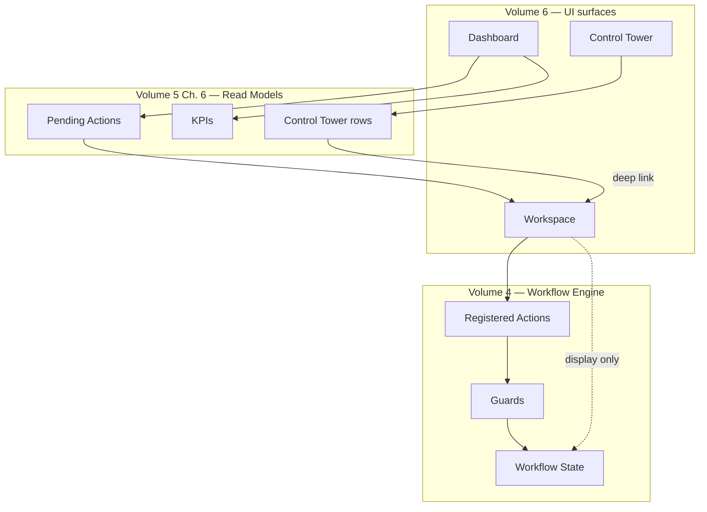
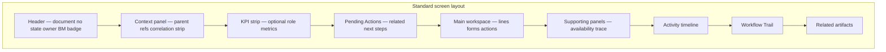
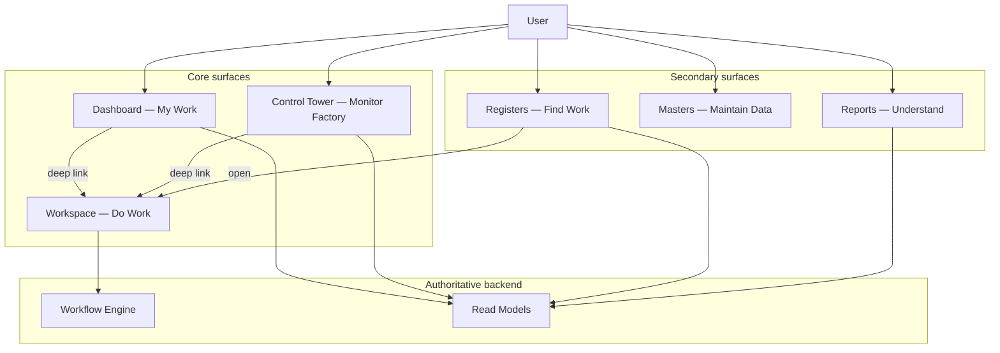
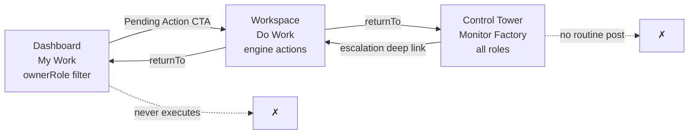
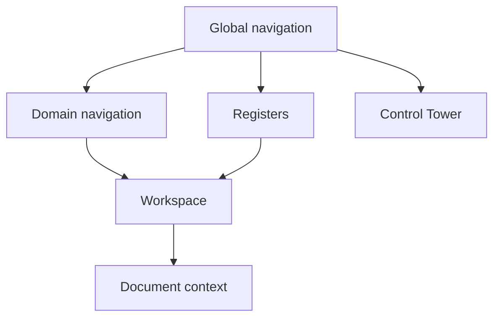
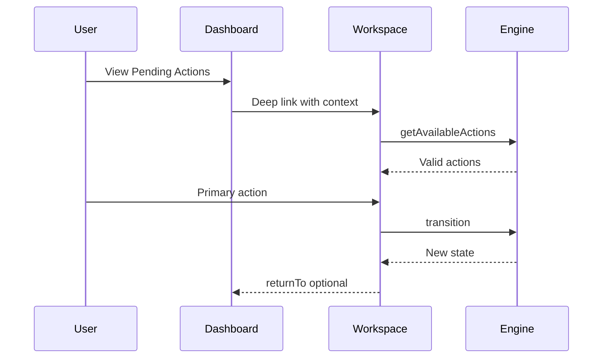
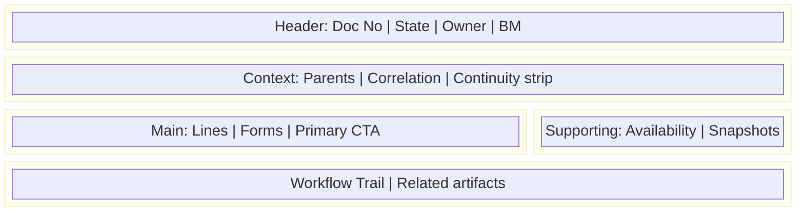
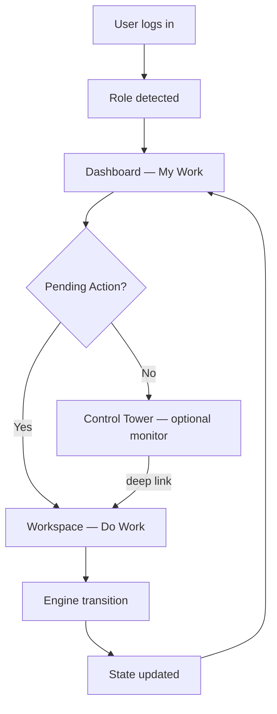

# UI Architecture, Navigation & Experience Principles

| Field | Value |
|-------|-------|
| **Document ID** | FT-PD-060 |
| **Volume** | 6 — UI & Experience Architecture |
| **Chapter** | 1 — UI Architecture, Navigation & Experience Principles |
| **Title** | UI Architecture, Navigation & Experience Principles |
| **Version** | 1.0.0 |
| **Status** | Draft — Architecture Review |
| **Effective date** | 2026-05-29 |
| **Author** | FT ERP Product Team |
| **Owner** | FT ERP Product Architecture |
| **Audience** | Product, UX architects, frontend leads, domain authors |
| **Classification** | Product — UI & Experience Architecture |

**Parent documents:**

- [Volume 0 — Product Vision & Strategy](../00_Product_Vision_and_Strategy/Volume_0_Product_Vision_and_Strategy.md)
- [Volume 1, Ch. 4 — Product Design Principles](../01_Product_Foundation/Chapter_04_FT_ERP_Product_Design_Principles.md)
- [Volume 3 — Domain Specifications](../03_Domain_Specifications/README.md)
- [Volume 4, Ch. 1 — Workflow Engine & Pending Actions](../04_Workflow_Engine/Chapter_01_Workflow_Engine_Overview_and_Pending_Actions_Contract.md)
- [Volume 5, Ch. 6 — Read Models](../05_Data_Architecture/Chapter_06_Read_Models_Reporting_and_Analytical_Persistence.md)

---

## 1. Document Control

| Version | Date | Author | Summary |
|---------|------|--------|---------|
| 1.0.0 | 2026-05-29 | FT ERP Product Team | Initial UI Architecture, Navigation & Experience Principles |

**Supersedes:** None.

**Change authority:** Product Architecture. Changes to Dashboard / Workspace / Control Tower separation require Design Principles §5.5 alignment.

**Out of scope:** CSS, React components, HTML, APIs, database schema, per-screen field specifications.

---

## 2. Purpose

This chapter defines the **architectural principles governing every user interface** within FT ERP.

It establishes:

- User experience philosophy
- Navigation architecture
- Dashboard, Workspace, and Control Tower philosophy
- Screen consistency and workflow navigation
- Role-based experience principles

This is the **foundation for all subsequent Volume 6 chapters**. It is **not** a screen specification.

---

## 3. Scope

### 3.1 In scope

- UI philosophy and core surfaces (§5–6)
- Navigation architecture (§7)
- Screen composition standard (§8)
- Role-based experience (§9)
- Cross-cutting UX rules and Business Rules (§10–11)
- Logical diagrams (§12)

### 3.2 Out of scope

- Domain Workspace field layouts (Volume 6 Ch. 2+)
- Control Tower row catalog (Volume 6 Ch. 3+)
- API contracts (Volume 7)
- Visual design system tokens (CSS, components)

### 3.3 UI vs engine vs data

| Layer | Owns | UI relationship |
|-------|------|-----------------|
| **Workflow Engine** | State transitions, guards, Pending Action rules | UI invokes engine — never replaces |
| **Transactional documents** | Business data | Workspace displays and submits |
| **Read Models** | Projections for lists, KPIs, search | Dashboard, Control Tower, registers consume |
| **UI surfaces** | Presentation, navigation, context | **No Business Rule authority** |

---

## 4. Relationship with Previous Volumes

| Volume | Relationship |
|--------|--------------|
| **Vol. 0** | Product vision — manufacturing-native, workflow-driven UX |
| **Vol. 1, Ch. 4** | Design Principles §5.5, §8–10 — **primary UX source** |
| **Vol. 2, Ch. 5** | Role ownership — drives Dashboard visibility |
| **Vol. 3** | Domain Workspaces and registers — behavior authority |
| **Vol. 4, Ch. 1** | Dashboard, Workspace, Control Tower contracts (§8–10) |
| **Vol. 5, Ch. 6** | Read Models power UI lists — UI never writes projections |

### 4.1 How UI exposes the Workflow Engine

**Principle:** UI surfaces **expose** engine state and read projections. **Business logic lives in the engine** — not in navigation, widgets, or client-side conditionals ([UXA-01](#11-business-rules)).

---

## 5. UI Philosophy

| Principle | Meaning |
|-----------|---------|
| **Workflow-first UX** | Every screen maps to a workflow stage or master-maintenance purpose |
| **Business-first navigation** | Navigation follows domain ownership — not arbitrary module menus |
| **Minimal clicks** | Happy path optimized; exceptions surfaced with one-click route to Workspace |
| **Context preservation** | Document id, correlationId, returnTo, demand pool preserved across navigation |
| **Progressive disclosure** | Operators see next action; managers expand trace and Control Tower depth |
| **Operational efficiency** | Shop-floor and store flows prioritize speed and clarity over decoration |
| **Consistency over decoration** | Same layout, action zones, and trail patterns across domains |
| **Keyboard-first where practical** | Registers and high-volume entry support keyboard navigation (policy) |

---

## 6. Core UI Surfaces

### 6.1 Surface taxonomy

| Surface | Tagline | Purpose | Owns workflow? |
|---------|---------|---------|----------------|
| **Dashboard** | **My Work** | Role inbox — Pending Actions, KPIs, Quick Actions | **No** — deep-links to Workspace |
| **Workspace** | **Do Work** | Document-context execution — valid actions, lines, trace | **Invokes** engine only |
| **Control Tower** | **Monitor Factory** | Cross-role factory monitor, aging, risk, escalation | **No** — monitor + deep-link |
| **Registers** | **Find Work** | Searchable operational lists — documents, batches, queues | **No** — open Workspace |
| **Masters** | **Maintain Business Data** | Item, customer, supplier, BOM maintenance | **No** — no transactional workflow |
| **Reports** | **Understand Business** | Read-only analysis, exports, trace | **No** — never mutates data |

### 6.2 Responsibility matrix

| Capability | Dashboard | Workspace | Control Tower | Registers | Masters | Reports |
|------------|-----------|-----------|-----------------|-----------|---------|---------|
| Pending Actions inbox | ✓ primary | related only | monitor all roles | — | — | — |
| Execute transition | via link | ✓ primary | ✗ default | via link | ✗ | ✗ |
| Factory-wide view | ✗ | document scope | ✓ primary | filtered lists | — | aggregate |
| Create document | Quick Action link | ✓ | ✗ | ✓ link | ✗ | ✗ |
| Master edit | — | — | — | — | ✓ | ✗ |
| KPI display | ✓ role scope | optional strip | ✓ factory | — | — | ✓ |
| Workflow Trail | summary | ✓ full | link | link | — | optional |

### 6.3 Non-overlap rule

**Dashboard**, **Workspace**, and **Control Tower** are **three distinct surfaces**. They must not merge into hybrid pages that combine personal inbox, document execution, and factory monitoring on one screen ([UXA-06](#11-business-rules)).

---

## 7. Navigation Architecture

### 7.1 Global navigation

Top-level entry points:

- **My Dashboard** (role home)
- **Control Tower** (factory monitor — permission-gated)
- **Domains** (Commercial, Planning, Procurement, Manufacturing, QA, Dispatch, Billing)
- **Registers** (cross-cutting find)
- **Masters** (maintenance)
- **Reports**

Global nav **routes** to surfaces — it does not **execute** workflow.

### 7.2 Module navigation

Within a domain: sub-nav to domain Workspaces and registers (e.g. Procurement → PR queue, PO queue, GRN posting).

Module nav follows **Volume 3 domain boundaries** — no merged REGULAR/NO_QTY ambiguous entries.

### 7.3 Workflow navigation

Navigation to a document always loads **Workspace** with:

- `documentType`, `documentId`
- Optional `pendingActionId`, `correlationId`
- `returnTo` source surface

Workflow navigation **never** sets state directly — only opens context for engine actions.

### 7.4 Breadcrumbs

Pattern: `Home → Domain → Register/Workspace → Document No`

Breadcrumbs are **navigational** — not workflow state indicators (use Workflow Trail for state).

### 7.5 Deep links

Pending Actions, Control Tower rows, Quick Actions, and notifications use **deep links** with full context:

`workspace/{documentType}/{documentId}?returnTo=dashboard&pendingActionId=...`

Deep links must land on **valid Workspace** for document state — invalid routes block with explanation ([Design Principles §7.4](../01_Product_Foundation/Chapter_04_FT_ERP_Product_Design_Principles.md)).

### 7.6 Context preservation

Preserved across navigation:

| Context | Purpose |
|---------|---------|
| `returnTo` | Back navigation to Dashboard, Control Tower, or register |
| `correlationId` | Factory trace thread |
| `demandPool` | Procurement queue segregation |
| `businessModel` badge | REGULAR vs NO_QTY path validation |
| Scroll/selection (registers) | Return from Workspace to same row |

### 7.7 Back navigation

Back returns to **source surface** without side effects. Back **never** undoes workflow transitions.

### 7.8 Cross-domain navigation

Continuity strips and related-artifact panels link across domains (ISO → WO → PMR) using **correlationId** and artifact graph — always opening **read or owning Workspace**, never bypassing Guards.

### 7.9 Correlation-based navigation

**Factory trace** entry from any artifact number resolves `correlationId` and presents lineage view ([Vol. 5 Ch. 1 §7.4](../05_Data_Architecture/Chapter_01_Workflow_Event_Store_and_Correlation_Persistence.md)) — links to Workspaces, not inline execution.

---

## 8. Screen Composition Standard

Standard **Workspace** and major **register** layout zones:

| Zone | Content | Required |
|------|---------|----------|
| **Header** | Document number, workflow state, owner role, Business Model | Workspaces — yes |
| **Context panel** | Parent document links, correlationId, continuity strip | Workspaces — yes |
| **KPI strip** | Role or document-scoped metrics | Optional |
| **Pending Actions** | Related engine actions for this context | When materialized |
| **Main workspace** | Lines, quantities, primary CTA zone | Yes |
| **Supporting panels** | Material Availability, snapshots (read-only), diagnostics | Domain-specific |
| **Activity timeline** | Recent events on this document | Workspaces — recommended |
| **Workflow Trail** | State transition history | Workspaces — yes |
| **Related artifacts** | Parent/child document links | When applicable |

**Action zone:** Primary actions live in a **consistent header or footer action bar** — not scattered per row without pattern.

---

## 9. Role-Based Experience

Principles aligned with [Volume 2, Ch. 5](../02_Business_Architecture/Chapter_05_Document_Ownership_and_Responsibility_Matrix.md):

### 9.1 Admin

| Aspect | Principle |
|--------|-----------|
| **Visibility** | Commercial documents, billing, customer masters |
| **Responsibility** | Enquiry through ISO, Sales Bill, billing export |
| **Dashboard** | Commercial Pending Actions (`COMPL_*`) |
| **Workspaces** | Quotation, ISO, Sales Bill |
| **Control Tower** | Monitor commercial bottlenecks — execute via Workspace |

### 9.2 Purchase

| Aspect | Principle |
|--------|-----------|
| **Visibility** | MPRS review, PR/PO queues, supplier masters |
| **Responsibility** | PO, supplier follow-up, MPRS PR (MPRS pool) |
| **Dashboard** | Procurement Pending Actions (`PRC_*`) |
| **Workspaces** | Procurement Workspace, PO, MPRS review |
| **Control Tower** | Monitor stall — deep-link to Workspace |

### 9.3 Store

| Aspect | Principle |
|--------|-----------|
| **Visibility** | Planning, GRN, WO, PMR, issue, dispatch |
| **Responsibility** | RS, MPRS draft, MR, WO prepare, GRN, issue, dispatch |
| **Dashboard** | Planning + store execution Pending Actions |
| **Workspaces** | RM Control Center, Material Issue, GRN, Dispatch |
| **Control Tower** | RM readiness, dispatch aging |

### 9.4 Production

| Aspect | Principle |
|--------|-----------|
| **Visibility** | Active WO, production entry, rework execution |
| **Responsibility** | Production Entry, rework execution |
| **Dashboard** | Manufacturing Pending Actions (`MFG_*`) |
| **Workspaces** | Production entry, WO context (read/issue status) |
| **Control Tower** | WIP and QA pending monitor |

### 9.5 QA

| Aspect | Principle |
|--------|-----------|
| **Visibility** | QA Inspection queue, rework, scrap disposition |
| **Responsibility** | Inspection, rework authorization, scrap, FG Acceptance trigger |
| **Dashboard** | QA Pending Actions (`QAS_*`) |
| **Workspaces** | QA Inspection, Rework, Scrap |
| **Control Tower** | QA backlog, reject rate exceptions |

### 9.6 Management

| Aspect | Principle |
|--------|-----------|
| **Visibility** | Control Tower primary; executive KPIs |
| **Responsibility** | Monitor and escalate — not routine execution |
| **Dashboard** | Summary KPIs — not duplicate factory grid |
| **Workspaces** | Read-only unless holding operational role |
| **Control Tower** | Primary surface — deep-link to owning role |

---

## 10. Cross-Cutting UX Rules

| Rule | Statement |
|------|-----------|
| **UX-01** | **Dashboard never becomes a Workspace** — no full document execution on Dashboard. |
| **UX-02** | **Control Tower never performs transactions** — default is inspect + deep-link. |
| **UX-03** | **Workspace owns execution** — registered engine actions only. |
| **UX-04** | **Registers never own workflow** — lists open Workspaces. |
| **UX-05** | **Masters never contain transactional actions** — no GRN post from Item master. |
| **UX-06** | **Workflow Trail appears consistently** on Workspaces. |
| **UX-07** | **Pending Actions always deep-link** into the correct Workspace with context. |
| **UX-08** | **Context is preserved** across navigation (`returnTo`, correlationId). |
| **UX-09** | **Every workflow step has one primary action** — secondary actions subordinate. |
| **UX-10** | **Invalid Business Model paths block** with one escape route ([Design Principles §7.4](../01_Product_Foundation/Chapter_04_FT_ERP_Product_Design_Principles.md)). |
| **UX-11** | **KPI widgets are read-only** unless explicitly wired as Quick Action filters. |
| **UX-12** | **Customer PO reference** never appears as a workflow row on Dashboard or Control Tower. |

---

## 11. Business Rules

| ID | Rule |
|----|------|
| **UXA-01** | **UI never owns Business Rules** — guards and Volume 3 specs are authoritative. |
| **UXA-02** | **Workflow Engine remains authoritative** for state and available actions. |
| **UXA-03** | **Read Models drive UI** lists — Dashboard and Control Tower consume projections ([RMP-05](../05_Data_Architecture/Chapter_06_Read_Models_Reporting_and_Analytical_Persistence.md)). |
| **UXA-04** | **Navigation follows workflow ownership** — menus align with Vol. 2 Ch. 5. |
| **UXA-05** | **Users cannot bypass workflow using navigation** — deep links still pass guards. |
| **UXA-06** | **Dashboard, Workspace, Control Tower must not overlap** — three distinct surfaces. |
| **UXA-07** | **Dashboard widgets are read-only** unless explicitly action-oriented Quick Actions. |
| **UXA-08** | **Control Tower is monitoring-only** — no routine execution buttons ([Vol. 4 Ch. 1 §10](../04_Workflow_Engine/Chapter_01_Workflow_Engine_Overview_and_Pending_Actions_Contract.md)). |
| **UXA-09** | **Pending Actions originate from engine only** — no UI-local todo lists ([WFE-02](../04_Workflow_Engine/Chapter_01_Workflow_Engine_Overview_and_Pending_Actions_Contract.md)). |
| **UXA-10** | **Workspace actions** call registered engine transitions — never direct state mutation. |
| **UXA-11** | **Masters are maintenance surfaces** — no Pending Actions unless master-approval policy ([MDA-14](../05_Data_Architecture/Chapter_03_Master_Data_and_Reference_Architecture.md)). |
| **UXA-12** | **Reports are read-only** — no write path from report to document ([RMP-04](../05_Data_Architecture/Chapter_06_Read_Models_Reporting_and_Analytical_Persistence.md)). |

---

## 12. Logical Diagrams

### 12.1 Overall UI architecture

### 12.2 Dashboard / Workspace / Control Tower relationship

### 12.3 Navigation hierarchy

### 12.4 Workflow navigation

### 12.5 Screen composition

### 12.6 User interaction flow

---

## 13. Review Checklist

- [ ] Navigation consistency — global, module, workflow (§7)
- [ ] Workflow alignment — Vol. 4 Ch. 1 contracts
- [ ] Role alignment — Vol. 2 Ch. 5 ownership
- [ ] Screen composition standard defined (§8)
- [ ] UX philosophy documented (§5)
- [ ] Dashboard / Workspace / Control Tower separation explicit (§6, UXA-06)
- [ ] Cross-cutting UX rules (§10) and UXA Business Rules (§11)
- [ ] Six Mermaid diagrams
- [ ] No CSS, React, HTML, API, schema, implementation code

---

## 14. Change Log

| Version | Date | Author | Summary |
|---------|------|--------|---------|
| 1.0.0 | 2026-05-29 | FT ERP Product Team | Initial UI Architecture specification |

---

## 15. Approval Block

| Role | Name | Signature | Date |
|------|------|-----------|------|
| Product Owner | | | |
| Product Architecture | | | |
| UX / Experience Lead | | | |
| Workflow Engineering Lead | | | |
| Domain Specification Owners | | | |

---

## Writing Requirements

This is a **UI architecture** document.

**Do not include:** CSS, React components, HTML, APIs, database schema, implementation code.

**Remain technology-neutral.** Cross-reference Volumes 0–5.

**Clearly distinguish:**

- Dashboard
- Workspace
- Control Tower
- Registers
- Masters
- Reports

**Emphasize the FT ERP architectural principle:**

- **Dashboard = My Work**
- **Workspace = Do Work**
- **Control Tower = Monitor Factory**

These three concepts **must never overlap**.

---

## Document navigation

| | Link |
|--|------|
| **Previous** | [Read Models, Reporting & Analytical Persistence](../05_Data_Architecture/Chapter_06_Read_Models_Reporting_and_Analytical_Persistence.md) (FT-PD-055) |
| **Next** | [Dashboard Architecture & Widget Standards](./Chapter_02_Dashboard_Architecture_and_Widget_Standards.md) (FT-PD-061) |
| **Volume** | [UI and Experience Architecture](./README.md) |
| **Product** | [Product Documentation Index](../README.md) |

