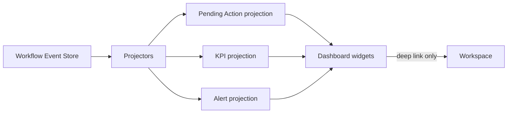
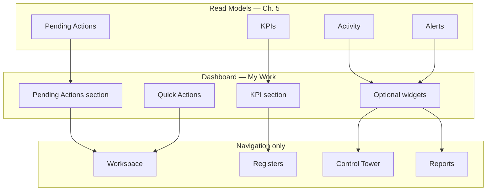
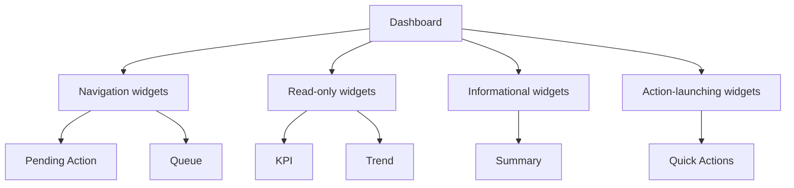
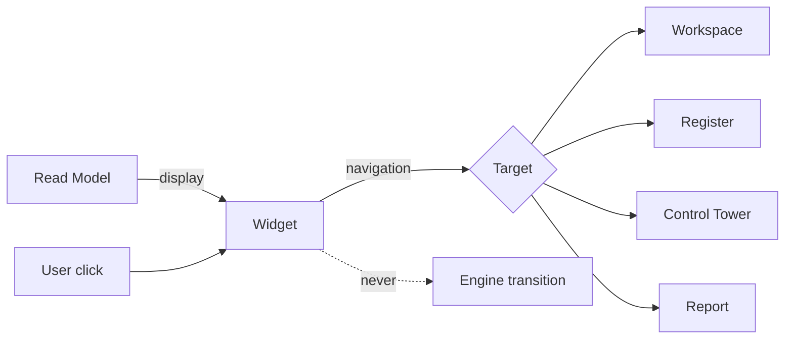
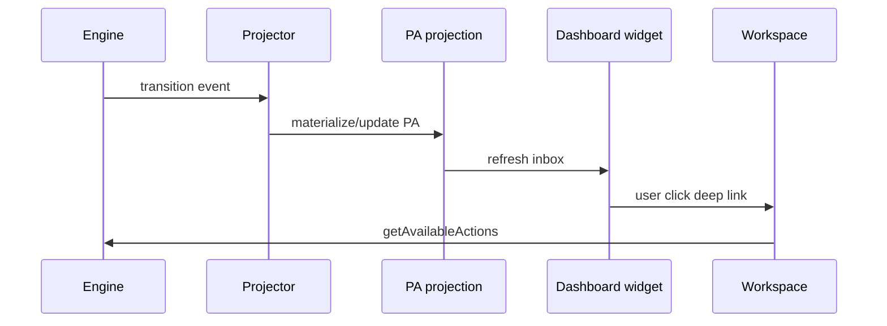
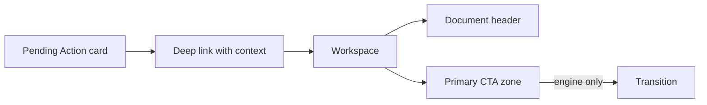
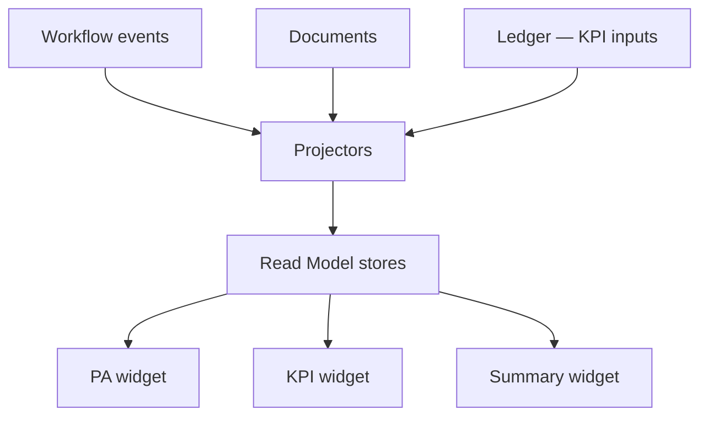

# Dashboard Architecture & Widget Standards

| Field | Value |
|-------|-------|
| **Document ID** | FT-PD-061 |
| **Volume** | 6 — UI & Experience Architecture |
| **Chapter** | 2 — Dashboard Architecture & Widget Standards |
| **Title** | Dashboard Architecture & Widget Standards |
| **Version** | 1.0.0 |
| **Status** | Draft — Architecture Review |
| **Effective date** | 2026-05-29 |
| **Author** | FT ERP Product Team |
| **Owner** | FT ERP Product Architecture |
| **Audience** | Product, UX architects, frontend leads, domain authors |
| **Classification** | Product — UI & Experience Architecture |

**Parent documents:**

- [Chapter 1 — UI Architecture, Navigation & Experience Principles](./Chapter_01_UI_Architecture_Navigation_and_Experience_Principles.md)
- [Volume 4, Ch. 1 — Pending Actions & Dashboard Contract](../04_Workflow_Engine/Chapter_01_Workflow_Engine_Overview_and_Pending_Actions_Contract.md)
- [Volume 5, Ch. 6 — Read Models](../05_Data_Architecture/Chapter_06_Read_Models_Reporting_and_Analytical_Persistence.md)
- [Volume 1, Ch. 4 — Design Principles §8](../01_Product_Foundation/Chapter_04_FT_ERP_Product_Design_Principles.md)

---

## 1. Document Control

| Version | Date | Author | Summary |
|---------|------|--------|---------|
| 1.0.0 | 2026-05-29 | FT ERP Product Team | Initial Dashboard Architecture & Widget Standards |

**Supersedes:** None.

**Change authority:** Product Architecture. New widget types require Volume 4 Pending Action alignment and Volume 5 read-model registration.

**Out of scope:** CSS, HTML, React, APIs, database schema, pixel layouts, per-field screen specs.

---

## 2. Purpose

This chapter defines the **architectural standards governing every Dashboard** in FT ERP.

Dashboards are the **My Work** surface ([Ch. 1 §6](./Chapter_01_UI_Architecture_Navigation_and_Experience_Principles.md)). They **summarize work** for the logged-in role. They **never become execution workspaces**.

---

## 3. Scope

### 3.1 In scope

- Dashboard philosophy and composition (§5–6)
- Widget taxonomy and standards (§7–8)
- Widget Creation Matrix (§8A)
- Role dashboard architecture (§9)
- Refresh and behavior (§10)
- Business Rules and diagrams

### 3.2 Out of scope

- Control Tower architecture (Volume 6 Ch. 3+)
- Workspace layout (Volume 6 Ch. 4+)
- Register catalogs
- Report builder UI
- Notification transport implementation (Volume 7)

### 3.3 Dashboard vs adjacent surfaces

| Surface | Dashboard relationship |
|---------|------------------------|
| **Workspace** | Dashboard deep-links — never executes here |
| **Control Tower** | Factory-wide monitor — not duplicated as Dashboard grid |
| **Registers** | Find/browse lists — Dashboard shows **my** actionable subset |
| **Reports** | Analytical depth — Dashboard shows KPI summary only |

---

## 4. Relationship with Previous Volumes

| Volume | Relationship |
|--------|--------------|
| **Vol. 4, Ch. 1** | Pending Action schema, Dashboard contract — **authority** |
| **Vol. 5, Ch. 1 §8** | Pending Action projection persistence |
| **Vol. 5, Ch. 6** | Role Dashboards, KPI, PA projections — **data source** |
| **Vol. 6, Ch. 1** | My Work philosophy, UXA rules, navigation |

### 4.1 How Dashboard consumes Read Models

**Principle:** Dashboard widgets are **read-only projections** ([RMP-01](../05_Data_Architecture/Chapter_06_Read_Models_Reporting_and_Analytical_Persistence.md)). The only **action** on Dashboard is **navigation** to Workspace or register — not workflow execution ([DSH-01](#11-business-rules)).

---

## 5. Dashboard Philosophy

| Principle | Meaning |
|-----------|---------|
| **My Work** | Shows work owned by **logged-in role** only — not factory-wide backlog |
| **Action-oriented** | Surfaces **what to do next** via Pending Actions and Quick Actions |
| **Personalized** | Widget order and optional widgets configurable — not Business Rules |
| **Role-specific** | Each role has a defined dashboard profile (§9) |
| **Minimal interaction** | Scan, click, navigate — no multi-step execution on Dashboard |
| **High information density** | Compact queues and KPIs — not decorative empty space |
| **Read-first** | All widgets default read-only; CTAs navigate outward |
| **One-click to Workspace** | Primary Pending Action interaction = single click to owning Workspace |

---

## 6. Dashboard Composition

Standard **sections** (logical zones — not pixel layout):

| Section | Purpose | Typical widgets |
|---------|---------|-----------------|
| **Header** | Role greeting, date shift context, global search entry | — |
| **Pending Actions** | Engine-materialized inbox — **primary zone** | Pending Action Widget, My Approvals |
| **Priority Work** | CRITICAL/HIGH actions and overdue items | Pending Action subset, Alert Widget |
| **KPIs** | Role queue depth and cycle metrics | KPI Widget, Trend Widget |
| **Operational Summary** | Compact domain chips (awaiting GRN, QA backlog count) | Summary Widget, Status Widget |
| **Alerts** | Exceptions requiring attention | Alert Widget |
| **Quick Actions** | Valid create/open shortcuts | Shortcut Widget |
| **Recent Activity** | Documents user recently touched | Timeline Widget |
| **Favorites** | User-pinned registers or workspaces | Shortcut Widget |
| **Notifications** | System notifications (read-only list) | Alert / Timeline Widget |

**Composition rule:** **Pending Actions** section is **mandatory** for all operational roles. Other sections are role-profile dependent (§9).

---

## 7. Widget Taxonomy

### 7.1 Widget types

| Type | Purpose | Source | Refresh | Interaction | Navigation target |
|------|---------|--------|---------|-------------|-------------------|
| **KPI Widget** | Single metric with optional sparkline | KPI projection | Event + scheduled | Click → filter PA or register | Filtered Pending Actions / register |
| **Pending Action Widget** | Actionable work item row/card | PA projection | Event-driven | Click → open Workspace | Workspace with `pendingActionId` |
| **Queue Widget** | Top N items from a role queue | PA or domain queue projection | Event-driven | Row click → Workspace | Domain Workspace |
| **Summary Widget** | Aggregate chip (count + label) | KPI / summary projection | Event + scheduled | Click → register or CT | Register / Control Tower link |
| **Status Widget** | Health indicator (green/amber/red) | KPI threshold rules | Scheduled | Click → diagnostic view | Register or CT deep link |
| **Trend Widget** | Metric over time | KPI snapshot store | Scheduled batch | Hover detail; click → report | Report (read-only) |
| **Alert Widget** | Exception or SLA breach | Alert / aging projection | Event + time tick | Click → Workspace or CT | Workspace / Control Tower |
| **Shortcut Widget** | Quick Action launcher | Static config + permission | On load | Click → create/open flow | Workspace (create mode) |
| **Timeline Widget** | Recent events or activity | Activity projection | Event-driven | Click → document | Workspace (read) |

### 7.2 Widget classification by interaction

| Class | Widgets | Behavior |
|-------|---------|----------|
| **Read-only** | KPI, Trend, Status (default), Notifications (list) | Display only — optional navigational click |
| **Navigation** | Pending Action, Queue, Summary, Alert, Timeline, Favorites | Click → Workspace, register, or Control Tower |
| **Informational** | Operational Summary, Status chips | Context counts — no execution |
| **Action-launching** | Quick Actions (Shortcut) | Opens Workspace **create** or **empty queue** — engine still validates on submit |

*Action-launching widgets **launch** navigation — they do not post transitions on Dashboard.*

---

## 8. Widget Standards

### 8.1 Size classes

| Class | Use |
|-------|-----|
| **Compact** | KPI single metric, summary chip |
| **Standard** | Pending Action row, queue item |
| **Wide** | Queue list, timeline strip |
| **Hero** | Optional featured CRITICAL Pending Action (one per dashboard) |

### 8.2 Refresh rules

| Data type | Refresh |
|-----------|---------|
| Pending Actions | Event-driven on workflow transition |
| KPIs | Event-driven increment + periodic reconcile |
| Trends | Scheduled batch (hourly/daily) |
| Recent Activity | Event-driven per user session |
| Notifications | Poll or push (integration layer) |

### 8.3 Empty state

Widget shows **role-appropriate empty message** — e.g. "No Pending Actions — you're caught up." Empty state **must not** hide mandatory widget slot.

### 8.4 Error state

Widget shows **retry** for projection fetch failure. Error **must not** show stale data as current without indicator.

### 8.5 Loading state

Skeleton or spinner per widget — **widget independence** (one slow widget does not block dashboard).

### 8.6 Permissions

Widget visible only if user role **or** explicit permission grant. No cross-role Pending Actions on Dashboard ([Vol. 4 Ch. 1 §7.8](../04_Workflow_Engine/Chapter_01_Workflow_Engine_Overview_and_Pending_Actions_Contract.md)).

### 8.7 Personalization

User may reorder/hide **optional** widgets. **Mandatory** widgets (Pending Actions) cannot be hidden. Personalization **never** changes which Pending Actions materialize.

### 8.8 Sorting

Pending Actions default sort: **priority DESC**, **age DESC**, **actionId** stable tie-break.

### 8.9 Prioritization

`CRITICAL` > `HIGH` > `NORMAL` > `LOW`. Overdue SLA elevates visual priority — does not change engine ownership.

---

## 8A. Widget Creation Matrix

| Widget | Source Read Model | Refresh Trigger | Navigation Target | User Interaction | Personalizable |
|--------|-------------------|-----------------|-------------------|------------------|----------------|
| **Pending Actions** | Pending Action projection ([Ch. 5 §7](../05_Data_Architecture/Chapter_06_Read_Models_Reporting_and_Analytical_Persistence.md)) | Workflow event append | Workspace + `pendingActionId` | Click row/card | No — mandatory |
| **My Approvals** | PA projection filtered `SUBMITTED` / review states | Event-driven | Workspace (approve action context) | Click to review | Optional layout only |
| **KPI Cards** | KPI projection / role aggregates | Event + scheduled reconcile | Filter PA list or register | Click to drill | Yes — order/hide |
| **Alerts** | Control Tower exception subset for role | Event + aging tick | Workspace or Control Tower | Click alert | Optional |
| **Operational Summary** | Domain summary projection (counts) | Event-driven | Register or Control Tower | Click chip | Yes |
| **Recent Activity** | User activity projection | Event on user touch | Workspace (document) | Click item | Yes |
| **Quick Actions** | Static config + permission matrix | On session load | Workspace create/open | Click shortcut | Yes — favorites merge |
| **Notifications** | Notification integration feed | Push/poll | Workspace or informational | Mark read; click link | Yes — mute types |
| **Favorites** | User preference store | User edit | Register or Workspace | Click pin | Yes — user managed |
| **Trend Widgets** | KPI snapshot / analytical store | Scheduled batch | Report (read-only) | Hover; click report | Yes |

**Matrix rules:**

- **Read-only widgets:** KPI Cards, Trend Widgets, Notifications (list body), Operational Summary (counts only)
- **Navigation widgets:** Pending Actions, My Approvals, Recent Activity, Favorites, Alerts (default)
- **Action-launching widgets:** Quick Actions only — still lands in Workspace before engine transition

---

## 9. Role Dashboards

Architectural standards per role — **not** screen layouts.

### 9.1 Admin

| Category | Widgets |
|----------|---------|
| **Mandatory** | Pending Actions (`COMPL_*`), KPI Cards (commercial queue) |
| **Optional** | Quick Actions (new Enquiry, ISO), Recent Activity, Operational Summary |
| **Forbidden** | Factory-wide Control Tower grid, procurement execution queues, Material Issue shortcuts |

**Navigation ownership:** Commercial Workspaces only for write CTAs on Dashboard links.

### 9.2 Purchase

| Category | Widgets |
|----------|---------|
| **Mandatory** | Pending Actions (`PRC_*`), KPI Cards (PR→PO cycle) |
| **Optional** | My Approvals (PR approve), Operational Summary (awaiting PO), Quick Actions (PO create) |
| **Forbidden** | Store-only GRN post shortcuts, full Control Tower row grid, other roles' Pending Actions |

### 9.3 Store

| Category | Widgets |
|----------|---------|
| **Mandatory** | Pending Actions (planning + GRN + issue + dispatch), KPI Cards (RM readiness) |
| **Optional** | Quick Actions (GRN, Issue, WO prepare), Operational Summary, Alerts (shortage) |
| **Forbidden** | Purchase-only MPRS approve widgets, factory-wide CT execution, Sales Bill creation |

### 9.4 Production

| Category | Widgets |
|----------|---------|
| **Mandatory** | Pending Actions (`MFG_*` production entry), KPI Cards (active WO) |
| **Optional** | Queue Widget (QA pending PE), Recent Activity, Quick Actions (Production Entry) |
| **Forbidden** | PR/PO creation, dispatch post, commercial Pending Actions |

### 9.5 QA

| Category | Widgets |
|----------|---------|
| **Mandatory** | Pending Actions (`QAS_*`), KPI Cards (inspection backlog) |
| **Optional** | Alerts (overdue inspection), Queue Widget, Recent Activity |
| **Forbidden** | Material Issue, GRN, dispatch execution shortcuts |

### 9.6 Management

| Category | Widgets |
|----------|---------|
| **Mandatory** | KPI Cards (executive), Trend Widgets, Alerts (factory exceptions summary) |
| **Optional** | Operational Summary chips linking to **Control Tower** |
| **Forbidden** | Full Pending Actions inbox (not operational owner), execution Quick Actions, duplicate Control Tower data grid on Dashboard |

**Navigation ownership:** Management Dashboard **links to Control Tower** — does not replace it ([DSH-06](#11-business-rules)).

---

## 10. Dashboard Behavior

### 10.1 Refresh

| Mode | Behavior |
|------|----------|
| **Manual refresh** | User-triggered re-fetch all widgets — does not replay engine |
| **Auto refresh** | Configurable interval for KPI/trend widgets only — PA prefers event-driven |
| **Event-driven** | Projector push or client subscribe on workflow event — primary for Pending Actions |

### 10.2 Pending Action updates

On workflow transition affecting user's role: Pending Action widget **incrementally updates** — remove resolved, add new materialized, update priority/age.

### 10.3 KPI recalculation

KPI widgets refresh from Read Model — **never** recalculate from ad hoc client logic.

### 10.4 Widget independence

Each widget fetches/render independently. Failure isolated per §8.4.

### 10.5 Read Model interaction

Dashboard **reads** projections only. Writes go to **Workspace → Engine**. Dashboard personalization writes **user preference store only** — not workflow or ledger.

---

## 11. Business Rules

| ID | Rule |
|----|------|
| **DSH-01** | **Dashboard never performs workflow execution** — navigation only. |
| **DSH-02** | **Dashboard never owns Business Rules** — Pending Actions from engine ([UXA-09](./Chapter_01_UI_Architecture_Navigation_and_Experience_Principles.md)). |
| **DSH-03** | **Dashboard widgets are projections** — rebuildable Read Models ([RMP-01](../05_Data_Architecture/Chapter_06_Read_Models_Reporting_and_Analytical_Persistence.md)). |
| **DSH-04** | **Pending Actions always navigate to Workspaces** with full context. |
| **DSH-05** | **Dashboard never replaces Registers** — summaries link out; registers hold full lists. |
| **DSH-06** | **Dashboard never replaces Control Tower** — no factory-wide execution grid. |
| **DSH-07** | **Personalization never changes business logic** — only layout and optional widgets. |
| **DSH-08** | **KPI click never bypasses guards** — drill-down navigates; execution in Workspace. |
| **DSH-09** | **Cross-role Pending Actions prohibited** on Dashboard ([Vol. 4 Ch. 1](../04_Workflow_Engine/Chapter_01_Workflow_Engine_Overview_and_Pending_Actions_Contract.md)). |
| **DSH-10** | **Quick Actions** deep-link to valid Workspace entry points — not silent document create with side effects. |
| **DSH-11** | **Customer PO** never appears as Dashboard Pending Action row. |
| **DSH-12** | **Trend and report widgets** are read-only — open Reports surface, not Workspace execution. |

---

## 12. Logical Diagrams

### 12.1 Dashboard architecture

### 12.2 Widget hierarchy

### 12.3 Widget interaction

### 12.4 Pending Action flow

### 12.5 Dashboard → Workspace navigation

### 12.6 Dashboard Read Model flow

---

## 13. Review Checklist

- [ ] Dashboard = My Work philosophy (§5)
- [ ] Composition sections defined (§6)
- [ ] Widget taxonomy complete (§7)
- [ ] Widget standards — size, refresh, states, permissions (§8)
- [ ] Widget Creation Matrix §8A — all 10 widget types
- [ ] Role dashboards — mandatory/optional/forbidden (§9)
- [ ] DSH Business Rules (§11)
- [ ] Dashboard vs Workspace / CT / Register / Report distinguished
- [ ] Six Mermaid diagrams
- [ ] No CSS, HTML, React, API, schema, implementation code

---

## 14. Change Log

| Version | Date | Author | Summary |
|---------|------|--------|---------|
| 1.0.0 | 2026-05-29 | FT ERP Product Team | Initial Dashboard Architecture & Widget Standards |

---

## 15. Approval Block

| Role | Name | Signature | Date |
|------|------|-----------|------|
| Product Owner | | | |
| Product Architecture | | | |
| UX / Experience Lead | | | |
| Workflow Engineering Lead | | | |

---

## Writing Requirements

Remain **technology-neutral**.

**Do not include:** CSS, HTML, React, APIs, database schema, implementation code.

**Clearly distinguish:** Dashboard, Workspace, Register, Control Tower, Report.

**Emphasize:**

- **Dashboard = My Work**
- Widgets are projections
- Read-only architecture
- Workflow execution happens **only** in Workspaces

---

## Document navigation

| | Link |
|--|------|
| **Previous** | [UI Architecture, Navigation & Experience Principles](./Chapter_01_UI_Architecture_Navigation_and_Experience_Principles.md) (FT-PD-060) |
| **Next** | [Control Tower Architecture & Factory Monitoring](./Chapter_03_Control_Tower_Architecture_and_Factory_Monitoring.md) (FT-PD-062) |
| **Volume** | [UI and Experience Architecture](./README.md) |
| **Product** | [Product Documentation Index](../README.md) |

