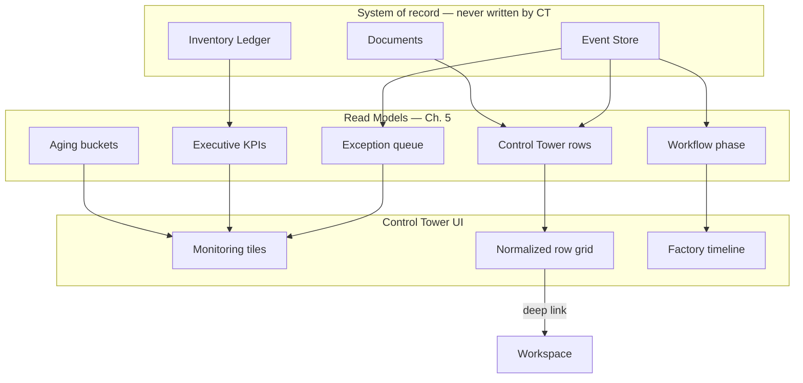
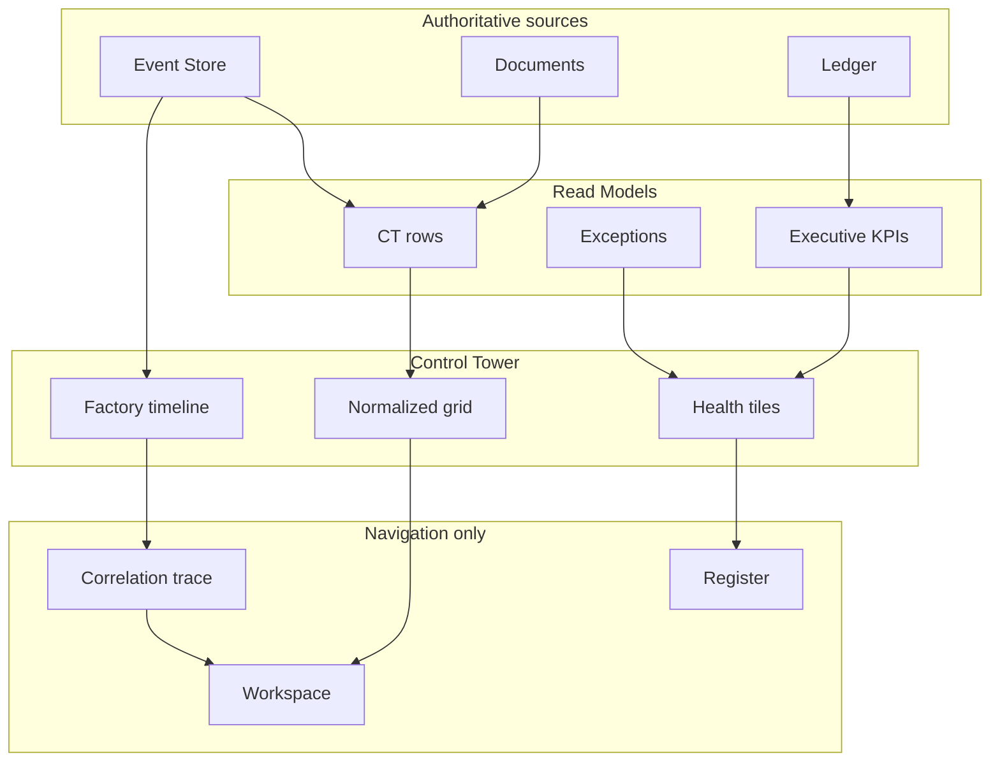
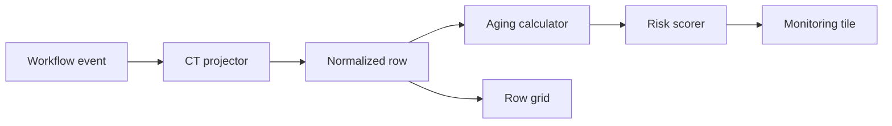
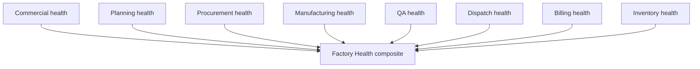
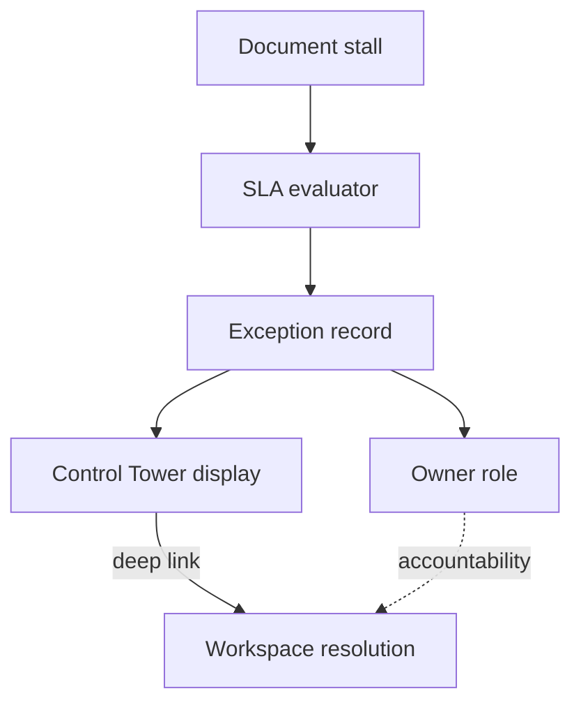
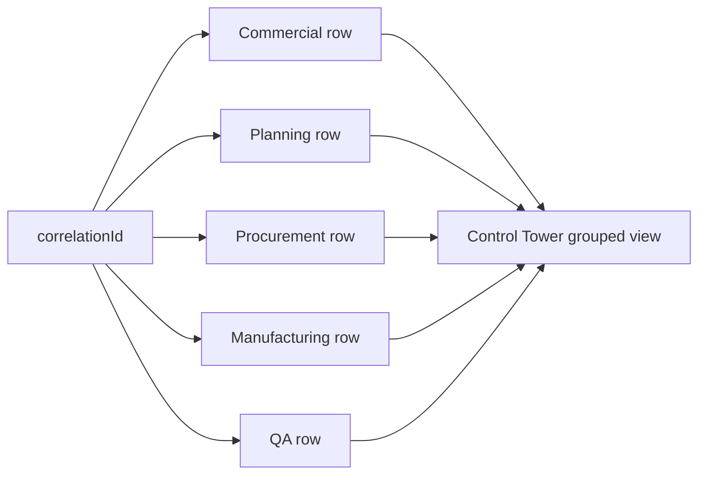
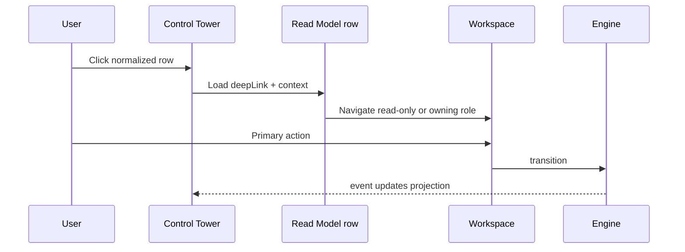

# Control Tower Architecture & Factory Monitoring

| Field | Value |
|-------|-------|
| **Document ID** | FT-PD-062 |
| **Volume** | 6 — UI & Experience Architecture |
| **Chapter** | 3 — Control Tower Architecture & Factory Monitoring |
| **Title** | Control Tower Architecture & Factory Monitoring |
| **Version** | 1.0.0 |
| **Status** | Draft — Architecture Review |
| **Effective date** | 2026-05-29 |
| **Author** | FT ERP Product Team |
| **Owner** | FT ERP Product Architecture |
| **Audience** | Product, UX architects, operations leads, workflow engineers |
| **Classification** | Product — UI & Experience Architecture |

**Parent documents:**

- [Chapter 2 — Dashboard Architecture & Widget Standards](./Chapter_02_Dashboard_Architecture_and_Widget_Standards.md)
- [Chapter 1 — UI Architecture, Navigation & Experience Principles](./Chapter_01_UI_Architecture_Navigation_and_Experience_Principles.md)
- [Volume 4, Ch. 1 — Control Tower Contract](../04_Workflow_Engine/Chapter_01_Workflow_Engine_Overview_and_Pending_Actions_Contract.md)
- [Volume 4, Ch. 9 — Cross-Domain Orchestration §13](../04_Workflow_Engine/Chapter_09_Cross_Domain_Workflow_Orchestration_and_Event_Coordination.md)
- [Volume 5, Ch. 6 — Read Models](../05_Data_Architecture/Chapter_06_Read_Models_Reporting_and_Analytical_Persistence.md)

---

## 1. Document Control

| Version | Date | Author | Summary |
|---------|------|--------|---------|
| 1.0.0 | 2026-05-29 | FT ERP Product Team | Initial Control Tower Architecture & Factory Monitoring specification |

**Supersedes:** None.

**Change authority:** Product Architecture. Normalized row schema changes require Volume 4 Ch. 1 and Volume 5 read-model alignment.

**Out of scope:** React, HTML, CSS, APIs, database schema, pixel layouts, per-row screen specs.

---

## 2. Purpose

This chapter defines the **architectural standards governing the FT ERP Control Tower**.

The Control Tower is the **Monitor Factory** surface ([Ch. 1 §6](./Chapter_01_UI_Architecture_Navigation_and_Experience_Principles.md)). It provides unified operational visibility across Commercial, Planning, Procurement, Manufacturing, QA, Dispatch, Billing, and Inventory.

It **never owns workflow execution**.

---

## 3. Scope

### 3.1 In scope

- Control Tower philosophy and composition (§5–6)
- Monitoring categories by domain (§7)
- Exception model (§8)
- Monitoring Tile Matrix (§9)
- Control Tower Normalization Matrix (§9A)
- Factory Timeline (§10)
- Business Rules and diagrams

### 3.2 Out of scope

- Dashboard widget specs (Volume 6 Ch. 2)
- Workspace execution layout (Volume 6 Ch. 4+)
- Register catalogs
- Report builder
- Escalation notification transport (Volume 7)

### 3.3 Surface separation

| Surface | Control Tower relationship |
|---------|----------------------------|
| **Dashboard** | Personal **My Work** — CT is factory-wide **Monitor** |
| **Workspace** | CT drill-down target for execution — CT never replaces |
| **Registers** | Domain lists — CT aggregates cross-domain exceptions |
| **Reports** | Historical analysis — CT is operational real-time monitor |

---

## 4. Relationship with Previous Volumes

| Volume | Relationship |
|--------|--------------|
| **Vol. 4, Ch. 1 §10** | Control Tower contract — **authority** |
| **Vol. 4, Ch. 9 §13** | Orchestration aggregates, bottleneck KPIs |
| **Vol. 5, Ch. 1 §7** | Artifact graph, correlation trace |
| **Vol. 5, Ch. 6 §7** | Control Tower projection, exception queue |
| **Vol. 6, Ch. 1** | Monitor Factory philosophy, UXA-08 |
| **Vol. 6, Ch. 2** | Dashboard forbidden to duplicate CT grid |

### 4.1 How Control Tower consumes projections

**Principle:** Control Tower **consumes projections and events** for display. It is **not** the system of record ([CTW-02](#11-business-rules)). Workflow Engine remains authoritative for state and transitions.

---

## 5. Control Tower Philosophy

| Principle | Meaning |
|-----------|---------|
| **Monitor Factory** | Answers *What is blocked across the factory?* — all roles, all domains |
| **Read-only operation** | Default interaction is inspect and drill-down — not execute |
| **Exception-first** | Visual emphasis on aging, risk, SLA breach — not healthy in-progress noise |
| **Bottleneck visibility** | Cross-domain stalls surfaced with recommended action |
| **End-to-end process visibility** | `correlationId` threads Commercial → Billing on one timeline |
| **Cross-domain monitoring** | Normalized rows across domains — same grid philosophy |
| **Drill-down without execution** | Row click → Workspace or trace view — not inline post |
| **One-click to Workspace** | Recommended action deep-link to **owning role** Workspace |

---

## 6. Control Tower Composition

Standard **sections** (logical zones):

| Section | Purpose |
|---------|---------|
| **Factory Health** | Composite health score / status summary |
| **Process Flow Monitor** | Phase distribution across active correlations |
| **Exception Queue** | Prioritized exceptions across domains |
| **Aging Monitor** | SLA and age bucket visualization |
| **Risk Indicators** | Escalated and CRITICAL items |
| **Capacity Overview** | WO load, production WIP (Read Model) |
| **Inventory Health** | Shortage, negative free stock, QC hold aging |
| **Delivery Health** | Dispatch-ready FG aging, shipment backlog |
| **Quality Health** | QA inspection backlog, reject rate exceptions |
| **Procurement Health** | PR→PO stall, GRN pending, pool segregation alerts |
| **Commercial Health** | ISO commit delays, commercial completion gaps |
| **Executive KPIs** | End-to-end cycle time, factory throughput trends |

**Composition rule:** **Exception Queue** and **normalized row grid** are **core** — health tiles supplement drill-down entry points.

---

## 7. Monitoring Categories

### 7.1 Normalized row model

Every cross-domain row exposes ([Vol. 4 Ch. 1 §10.3](../04_Workflow_Engine/Chapter_01_Workflow_Engine_Overview_and_Pending_Actions_Contract.md)):

| Field | Purpose |
|-------|---------|
| `document` | Document type + business number |
| `domain` | Commercial \| Planning \| … |
| `workflowState` | Current state |
| `ownerRole` | Accountable role |
| `age` | Time in current state |
| `risk` | Computed risk level |
| `recommendedPendingActionId` | Highest-priority open PA |
| `deepLink` | Workspace URL with context |
| `correlationId` | Factory trace root |

### 7.2 Category catalog

| Category | Purpose | Data source | Refresh | Navigation target |
|----------|---------|-------------|---------|-------------------|
| **Commercial** | Enquiry→ISO pipeline stalls | CT row projection + `COMPL_*` PA | Event-driven | Quotation / ISO Workspace |
| **Planning** | MR, MPRS, WO prepare backlog | Planning queue projection | Event-driven | RS / MPRS / RM Control Center |
| **Procurement** | PR, PO, GRN bottlenecks | Procurement projection | Event-driven | Procurement Workspace |
| **Manufacturing** | WO, PMR, issue, PE delays | Manufacturing projection | Event-driven | WO / Issue / PE Workspace |
| **QA** | Inspection backlog, reject holds | QA queue projection | Event-driven | QA Inspection Workspace |
| **Dispatch** | Dispatch-eligible FG aging | Dispatch projection | Event-driven | Dispatch Workspace |
| **Billing** | Unbilled dispatch, bill finalize pending | Billing queue projection | Event-driven | Sales Bill Workspace |
| **Inventory** | Shortage, hold, exception buckets | Material Availability + ledger projection | Ledger/event | Stock register / trace |
| **Cross-domain orchestration** | Phase stall, end-to-end cycle | Workflow phase + orchestration KPI | Event + scheduled | Factory timeline / correlation trace |

---

## 8. Exception Model

### 8.1 Exception categories

| Category | Examples |
|----------|----------|
| **SLA breach** | Pending Action past due threshold |
| **Guard block** | Repeated transition failure logged |
| **Shortage** | RM gap blocking WO prepare |
| **Partial completion** | Partial issue, partial dispatch |
| **Policy violation risk** | Pool mix warning, Business Model path mismatch |
| **Orchestration stall** | Phase unchanged beyond threshold |

### 8.2 Aging

Age computed from **last successful transition timestamp** on document (or PA materialization time for action-specific SLA).

| Bucket | Typical use |
|--------|-------------|
| 0–1 day | Normal |
| 1–3 days | Watch |
| 3–7 days | Warning |
| 7+ days | Critical |

### 8.3 Severity levels

| Level | Meaning | Visual |
|-------|---------|--------|
| **Information** | Awareness — no action required yet | Neutral |
| **Warning** | Approaching SLA or soft bottleneck | Amber |
| **Critical** | SLA breached or production blocker | Red |
| **Escalated** | Formal escalation event applied | Red + escalation badge |

**Distinction:** **Information** ≠ **Warning** ≠ **Critical** ≠ **Escalated**. Escalated implies `system.escalation.applied` event — not merely old age.

### 8.4 Escalation

Escalation **records** on Event Store — does **not** reassign ownership automatically ([Vol. 4 Ch. 1 §10.2](../04_Workflow_Engine/Chapter_01_Workflow_Engine_Overview_and_Pending_Actions_Contract.md)). CT displays escalation; resolution remains **owning role** via Workspace.

### 8.5 Resolution ownership

Exception row always shows **`ownerRole`**. Drill-down opens **owning** Workspace — viewer's role does not change accountability.

### 8.6 Correlation

Exceptions groupable by **`correlationId`** — factory thread view shows related exceptions across domains.

### 8.7 Cross-domain visibility

Single correlation may show Commercial + Planning + Procurement exceptions simultaneously — normalized rows, shared timeline.

---

## 9. Monitoring Tile Matrix

| Tile | Source Projection | Refresh | Drill-down Target | Owner | Severity Supported |
|------|-------------------|---------|-------------------|-------|-------------------|
| **Procurement Bottlenecks** | Procurement CT projection — PR/PO aging | Event + aging tick | Procurement Workspace | Purchase / Store | Warning, Critical |
| **RM Availability** | Material Availability projection | Ledger/event | RM Control Center / register | Store | Information, Warning, Critical |
| **Manufacturing Delays** | Manufacturing CT projection — WO/PMR/issue | Event-driven | WO / PMR / Issue Workspace | Store / Production | Warning, Critical |
| **QA Backlog** | QA queue projection | Event-driven | QA Inspection Workspace | QA | Warning, Critical |
| **Dispatch Delays** | Dispatch-eligible FG aging | Event-driven | Dispatch Workspace | Store | Warning, Critical |
| **Billing Pending** | Unbilled dispatch projection | Event-driven | Sales Bill Workspace | Admin | Information, Warning |
| **Inventory Exceptions** | Inventory health projection | Ledger post | Stock movement register | Store | Warning, Critical |
| **Critical Alerts** | Exception queue — CRITICAL filter | Event-driven | Row deep link → Workspace | Per row owner | Critical, Escalated |
| **SLA Violations** | PA aging + SLA overlay | Event + tick | Pending Action Workspace | Per PA owner | Critical, Escalated |
| **Factory Health** | Composite KPI projection | Scheduled + event | Process Flow / timeline | Management | Information, Warning, Critical |

**Tile interaction:** Click tile → filtered **normalized grid** or **register** — never inline workflow post.

---

## 9A. Control Tower Normalization Matrix

For each domain: **primary projection**, **health indicator**, **aging metric**, **escalation trigger**, **drill-down Workspace**.

| Domain | Primary Projection | Health Indicator | Aging Metric | Escalation Trigger | Drill-down Workspace |
|--------|-------------------|------------------|--------------|---------------------|----------------------|
| **Commercial** | Commercial CT rows | Open pipeline vs committed ISO ratio | Days since Enquiry/Quotation state | `COMPL_*` SLA breach; ISO uncommitted | Quotation / ISO Workspace |
| **Planning** | Planning CT rows | MR/WO prepare readiness | Days in MPRS review / MR open | MPRS review SLA; RM release stall | MPRS / RM Control Center |
| **Procurement** | Procurement CT rows | PR→PO→GRN progression | Days PR approved without PO; PO without GRN | `PRC_*` SLA ([Vol. 4 Ch. 5](../04_Workflow_Engine/Chapter_05_Procurement_Workflow_State_Machine.md)) | Procurement Workspace |
| **Manufacturing** | Manufacturing CT rows | WO active vs PE pending | Days WO active without issue/PE | PMR submit delay; issue stall | WO / Material Issue / PE Workspace |
| **QA** | QA CT rows | Inspection queue depth | Days in QA_PENDING / inspection open | QAS SLA breach | QA Inspection Workspace |
| **Dispatch** | Dispatch CT rows | FG dispatch-eligible vs dispatched | Days FG accepted without dispatch | Dispatch-ready aging threshold | Dispatch Workspace |
| **Billing** | Billing CT rows | Dispatched vs billed gap | Days dispatch posted without bill | Billing finalize backlog | Sales Bill Workspace |
| **Inventory** | Inventory health projection | Shortage count; hold bucket size | Days in QC hold (policy) | Negative free stock; critical shortage | Stock register / GRN trace |

### 9A.1 Interaction classification

| Class | Control Tower behavior |
|-------|------------------------|
| **Monitoring** | Tiles, health indicators, row grid — read projections |
| **Analysis** | Factory timeline, correlation trace, aging charts — read-only |
| **Navigation** | Deep link to Workspace, register, timeline — **only** mutating path is leaving CT |
| **Execution** | **Not allowed** on Control Tower — except whitelisted escalation **ack** ([WFE-05](../04_Workflow_Engine/Chapter_01_Workflow_Engine_Overview_and_Pending_Actions_Contract.md)) |

---

## 10. Factory Timeline

### 10.1 Workflow phase tracking

Timeline shows **derived workflow phase** per `correlationId` from orchestration events ([Vol. 4 Ch. 9](../04_Workflow_Engine/Chapter_09_Cross_Domain_Workflow_Orchestration_and_Event_Coordination.md)):

Commercial → Planning → Procurement → Manufacturing → QA → Dispatch → Billing

### 10.2 Correlation tracing

User enters timeline from any document number → resolves **`correlationId`** → ordered milestone events from Event Store (read-only display).

### 10.3 Workflow milestones

Key milestones on timeline: ISO committed, MR released, GRN posted, WO active, PMR submitted, PE approved, FG Acceptance, Dispatch posted, Sales Bill finalized.

### 10.4 Bottleneck identification

Longest **phase duration** and **open exception count** highlight bottleneck domain on timeline strip.

### 10.5 Historical progression

Timeline supports **past correlations** (Commercially Complete) — read-only historical view from events.

### 10.6 End-to-end visibility

REGULAR and NO_QTY paths **converge** after WO on timeline — `businessModel` badge preserved for upstream phases.

---

## 11. Business Rules

| ID | Rule |
|----|------|
| **CTW-01** | **Control Tower never performs workflow execution** — drill-down to Workspace only. |
| **CTW-02** | **Control Tower consumes projections only** — not authoritative writes ([RMP-01](../05_Data_Architecture/Chapter_06_Read_Models_Reporting_and_Analytical_Persistence.md)). |
| **CTW-03** | **Drill-down always opens appropriate Workspace** (or read-only trace) for owning role. |
| **CTW-04** | **Control Tower never replaces Dashboards** — no personal inbox primary on CT ([DSH-06](./Chapter_02_Dashboard_Architecture_and_Widget_Standards.md)). |
| **CTW-05** | **Control Tower never replaces Registers** — CT aggregates; registers hold full domain lists. |
| **CTW-06** | **Control Tower aggregates cross-domain information** — normalized row model (§7.1). |
| **CTW-07** | **Workflow Engine remains authoritative** — CT displays derived state ([UXA-02](./Chapter_01_UI_Architecture_Navigation_and_Experience_Principles.md)). |
| **CTW-08** | **Viewing CT does not transfer ownership** ([Vol. 4 Ch. 1 §10.2](../04_Workflow_Engine/Chapter_01_Workflow_Engine_Overview_and_Pending_Actions_Contract.md)). |
| **CTW-09** | **Recommended action** on row = highest-priority PA — same as engine materialization, not CT-computed todo. |
| **CTW-10** | **Escalation display ≠ escalation execution** — ack only if whitelisted in Guard catalog. |
| **CTW-11** | **Customer PO** never appears as CT workflow row. |
| **CTW-12** | **Three surfaces never overlap** — Dashboard = My Work; CT = Monitor Factory; Workspace = Do Work ([UXA-06](./Chapter_01_UI_Architecture_Navigation_and_Experience_Principles.md)). |

---

## 12. Logical Diagrams

### 12.1 Control Tower architecture

### 12.2 Monitoring pipeline

### 12.3 Factory health model

### 12.4 Exception flow

### 12.5 Cross-domain monitoring

### 12.6 Drill-down navigation

---

## 13. Review Checklist

- [ ] Read-only enforcement — CTW-01, CTW-10, §9A.1
- [ ] Cross-domain visibility — normalized row, correlation (§7, §9A)
- [ ] Exception coverage — severity model (§8)
- [ ] Navigation consistency — drill-down to Workspace (§9, §9A)
- [ ] Projection usage — no system-of-record writes (§4)
- [ ] Workflow alignment — Vol. 4 Ch. 1 §10, Ch. 9 §13
- [ ] Dashboard separation — CTW-04, CTW-12
- [ ] Monitoring Tile Matrix complete (§9)
- [ ] Normalization Matrix complete (§9A)
- [ ] Six Mermaid diagrams
- [ ] No React, HTML, CSS, API, schema, implementation code

---

## 14. Change Log

| Version | Date | Author | Summary |
|---------|------|--------|---------|
| 1.0.0 | 2026-05-29 | FT ERP Product Team | Initial Control Tower Architecture specification |

---

## 15. Approval Block

| Role | Name | Signature | Date |
|------|------|-----------|------|
| Product Owner | | | |
| Product Architecture | | | |
| UX / Experience Lead | | | |
| Operations / Plant Manager Liaison | | | |
| Workflow Engineering Lead | | | |

---

## Writing Requirements

Remain **technology-neutral**.

**Do not include:** React, HTML, CSS, APIs, database schema, implementation code.

**Clearly distinguish:** Dashboard, Control Tower, Workspace, Register, Report.

**Emphasize:**

- **Dashboard = My Work**
- **Control Tower = Monitor Factory**
- **Workspace = Do Work**

These three surfaces **must never overlap**.

---

## Document navigation

| | Link |
|--|------|
| **Previous** | [Dashboard Architecture & Widget Standards](./Chapter_02_Dashboard_Architecture_and_Widget_Standards.md) (FT-PD-061) |
| **Next** | [Workspace Architecture & Document Execution Surfaces](./Chapter_04_Workspace_Architecture_and_Document_Execution_Surfaces.md) (FT-PD-063) |
| **Volume** | [UI and Experience Architecture](./README.md) |
| **Product** | [Product Documentation Index](../README.md) |

