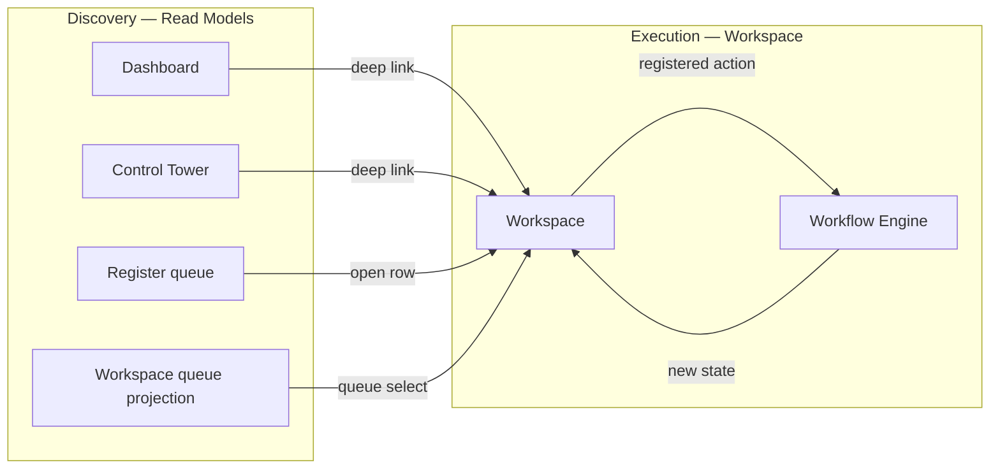
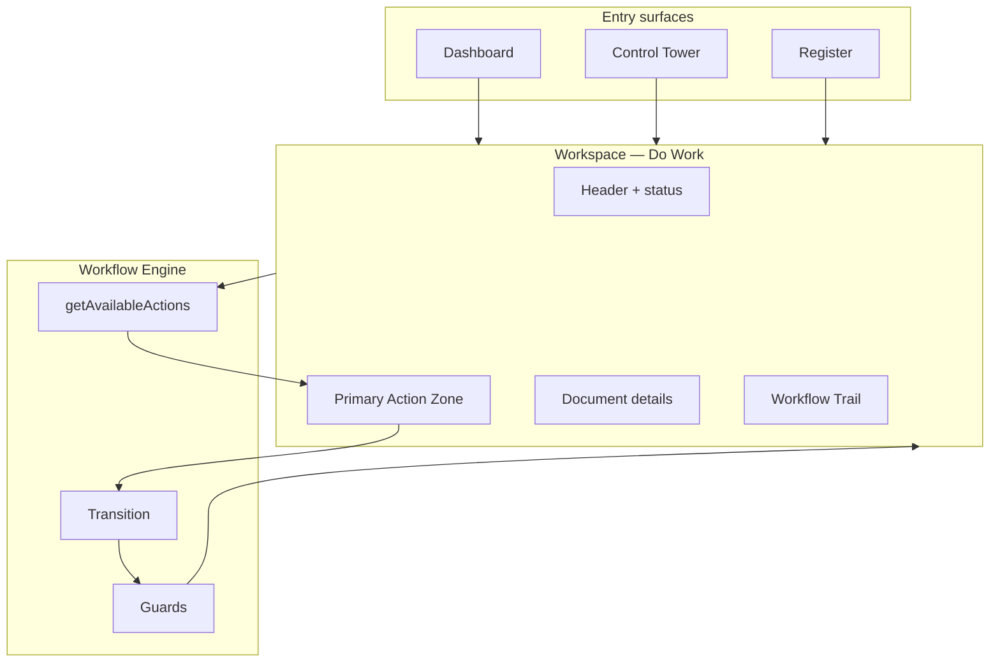
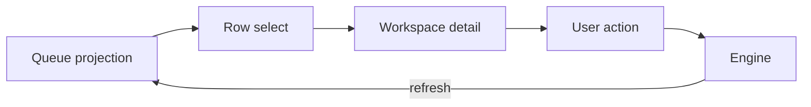
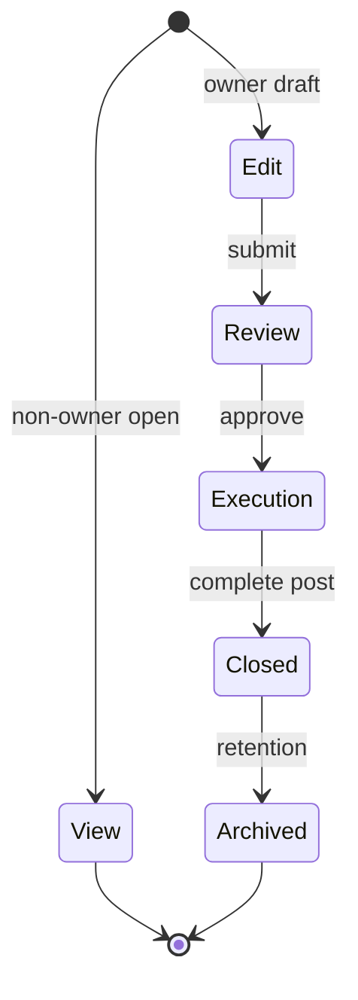
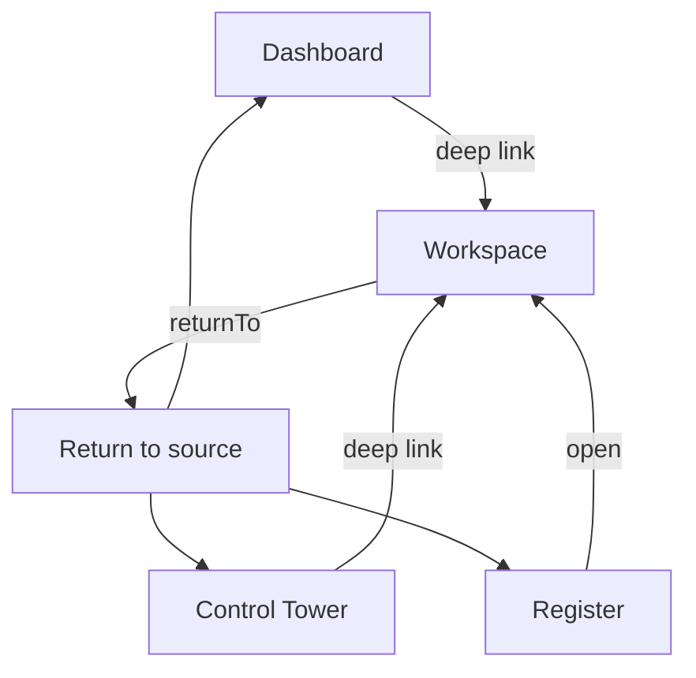
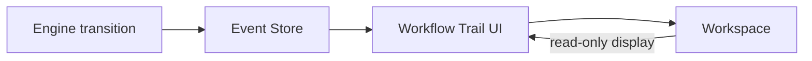
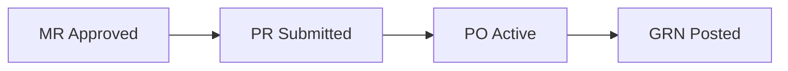

# Workspace Architecture & Document Execution Surfaces

| Field | Value |
|-------|-------|
| **Document ID** | FT-PD-063 |
| **Volume** | 6 — UI & Experience Architecture |
| **Chapter** | 4 — Workspace Architecture & Document Execution Surfaces |
| **Title** | Workspace Architecture & Document Execution Surfaces |
| **Version** | 1.0.0 |
| **Status** | Draft — Architecture Review |
| **Effective date** | 2026-05-29 |
| **Author** | FT ERP Product Team |
| **Owner** | FT ERP Product Architecture |
| **Audience** | Product, UX architects, frontend leads, domain authors |
| **Classification** | Product — UI & Experience Architecture |

**Parent documents:**

- [Chapter 3 — Control Tower Architecture & Factory Monitoring](./Chapter_03_Control_Tower_Architecture_and_Factory_Monitoring.md)
- [Chapter 2 — Dashboard Architecture & Widget Standards](./Chapter_02_Dashboard_Architecture_and_Widget_Standards.md)
- [Chapter 1 — UI Architecture, Navigation & Experience Principles](./Chapter_01_UI_Architecture_Navigation_and_Experience_Principles.md)
- [Volume 4, Ch. 1 — Workspace Contract](../04_Workflow_Engine/Chapter_01_Workflow_Engine_Overview_and_Pending_Actions_Contract.md)
- [Volume 5, Ch. 6 — Read Models](../05_Data_Architecture/Chapter_06_Read_Models_Reporting_and_Analytical_Persistence.md)
- [Volume 3 — Domain Specifications](../03_Domain_Specifications/README.md)

---

## 1. Document Control

| Version | Date | Author | Summary |
|---------|------|--------|---------|
| 1.0.0 | 2026-05-29 | FT ERP Product Team | Initial Workspace Architecture & Document Execution Surfaces specification |

**Supersedes:** None.

**Change authority:** Product Architecture. Execution model changes require Volume 4 engine contract review.

**Out of scope:** React, HTML, CSS, APIs, database schema, field-level screen specs, pixel layouts.

---

## 2. Purpose

This chapter defines the **architectural standards governing all FT ERP Workspaces**.

A Workspace is the **Do Work** surface ([Ch. 1 §6](./Chapter_01_UI_Architecture_Navigation_and_Experience_Principles.md)). Unlike Dashboard and Control Tower, Workspaces **invoke Workflow Engine transitions** — the **only** UI surface where workflow execution occurs.

---

## 3. Scope

### 3.1 In scope

- Workspace philosophy and composition (§5–6)
- Execution model and navigation (§7–8)
- Action model and `getAvailableActions` contract (§9)
- Domain Workspace catalog (§10)
- Continuity and workflow context (§11)
- Workspace Pattern Matrix (§13) and State Matrix (§13A)
- Business Rules and diagrams

### 3.2 Out of scope

- Register list architecture (Volume 6 Ch. 5+)
- Master field specifications (Volume 3 / Volume 5 Ch. 3)
- Guard catalog detail (Volume 4 Ch. 2)
- API implementation of `getAvailableActions` (Volume 7)

### 3.3 Execution surface boundary

| Surface | Executes workflow? |
|---------|-------------------|
| **Dashboard** | **No** — deep-link only |
| **Control Tower** | **No** — drill-down only (escalation ack excepted) |
| **Workspace** | **Yes** — registered engine actions |
| **Register** | **No** — opens Workspace |
| **Report** | **No** — read-only |
| **Master maintenance** | **No workflow** — master save only (hybrid workspace) |

---

## 4. Relationship with Previous Volumes

| Volume | Relationship |
|--------|--------------|
| **Vol. 4, Ch. 1 §9** | Workspace contract — **authority** |
| **Vol. 4, Ch. 2** | Guards validate every transition |
| **Vol. 3** | Domain behavior and validation semantics |
| **Vol. 5, Ch. 2** | Transactional documents in context |
| **Vol. 5, Ch. 6** | Queues and workspace projections for discovery |
| **Vol. 6, Ch. 1–3** | Navigation, Dashboard/CT delegation |

### 4.1 Discovery vs execution



**Principle:** Read Models **discover** work. Workspace **executes** via engine. UI never sets workflow state directly ([WSP-03](#12-business-rules)).

---

## 5. Workspace Philosophy

| Principle | Meaning |
|-----------|---------|
| **Do Work** | Complete the next valid workflow step on a document |
| **One document in context** | Single-document focus in execution mode; queue selects next |
| **Workflow-driven execution** | Actions from engine — not UI-invented buttons |
| **Context preservation** | `returnTo`, `correlationId`, `pendingActionId`, demand pool preserved |
| **Minimal navigation** | Full context in one workspace — continuity strip reduces tab-hopping |
| **Progressive disclosure** | Operators: primary CTA + lines; trace/history expandable |
| **Action safety** | Invalid actions disabled; confirm on irreversible posts |
| **Role-focused execution** | Write CTAs only for owning role (or Admin policy) |

### 5.1 Context modes

| Mode | Meaning |
|------|---------|
| **Read context** | Display document, trail, related artifacts — no write |
| **Editable context** | Draft fields editable before submit transition |
| **Execution context** | Engine action available — may combine edit + transition on submit |

*Editable context applies to draft workflow states only — not posted documents without revision workflow.*

---

## 6. Workspace Composition

Standard zones ([Ch. 1 §8](./Chapter_01_UI_Architecture_Navigation_and_Experience_Principles.md)):

| Zone | Content | Mandatory |
|------|---------|-----------|
| **Header** | Document number, workflow state, owner role, Business Model badge | **Yes** |
| **Context Summary** | Parent refs, correlationId, customer/supplier context | **Yes** |
| **Workflow Status** | State chip, phase indicator | **Yes** |
| **Workflow Trail** | Transition history | **Yes** |
| **Pending Actions** | Related engine actions on this document | When materialized |
| **Primary Action Zone** | One primary CTA + secondary actions | **Yes** (execution workspaces) |
| **Document Details** | Lines, quantities, forms | **Yes** |
| **Supporting Panels** | Material Availability, snapshots (read-only), diagnostics | Domain-specific |
| **Related Artifacts** | Parent/child document links | When applicable |
| **Activity Timeline** | Recent events on document | Recommended |
| **Validation Messages** | Guard failures, field validation | On action attempt |

**Master Data Workspace:** Header + details + save action — no Workflow Trail on transactional workflow (master lifecycle only).

---

## 7. Execution Model

### 7.1 Queue + Detail pattern

List workspaces (Procurement, RM Control Center):

1. **Queue panel** — filtered projection rows (demand pool tabs where required)
2. **Detail panel** — selected document Workspace zones
3. Row select **does not** execute — opens execution context

### 7.2 Single-document focus

Direct deep link opens **one document** full workspace. Queue optional sidebar for prev/next within filter.

### 7.3 Action execution flow

```
User clicks registered action
  → Client sends action request to engine
  → Engine runs guards + validation
  → Success: transition + event + projection refresh
  → Failure: validation messages — state unchanged
```

### 7.4 Engine validation

All validation **before** state change ([WSP-04](#12-business-rules)). Client-side validation is **assistive only** — engine authoritative.

### 7.5 Confirmation flows

Irreversible transitions (`POSTED`, `FINALIZED`, `SUBMITTED` freeze) require **explicit confirmation** with summary of effect.

### 7.6 Optimistic vs confirmed updates

| Pattern | Use |
|---------|-----|
| **Confirmed** | **Default** — UI updates after engine success response |
| **Optimistic** | **Prohibited** for workflow state; optional for draft field autosave only |

### 7.7 Workspace interaction modes

| Mode | Editable | Executable | Typical user |
|------|----------|------------|--------------|
| **Read-only mode** | No | No | Monitor, non-owner role |
| **Edit mode** | Yes (draft) | Submit actions only | Owner on DRAFT |
| **Execution mode** | Per policy | Yes — engine actions | Owner on actionable state |

See **§13A** for full state matrix.

---

## 8. Workspace Navigation

| Entry path | Context passed |
|------------|----------------|
| **Dashboard → Workspace** | `returnTo=dashboard`, `pendingActionId` |
| **Control Tower → Workspace** | `returnTo=controlTower`, row `deepLink` |
| **Register → Workspace** | `returnTo=register`, filter state |
| **Deep links** | Full document + optional PA id |
| **Return context** | Back navigates to `returnTo` without undoing transition |
| **Correlation navigation** | Related artifact links — open sibling Workspace |
| **Previous / Next work item** | Queue projection order — same filter |
| **Related document navigation** | Parent/child opens new Workspace tab or replace per policy |

**Rule:** Navigation **never bypasses guards** — opening Workspace does not imply action eligibility ([WSP-07](#12-business-rules)).

---

## 9. Workspace Action Model

### 9.1 Action types

| Type | Definition |
|------|------------|
| **Primary Action** | Single recommended next transition for current state + role |
| **Secondary Actions** | Valid alternates (cancel, save draft, defer) |
| **Disabled Actions** | Engine returns action id but `enabled=false` with reason |
| **Conditional Actions** | Visible only when Guard pre-check passes |

### 9.2 Derivation (conceptual `getAvailableActions`)

Engine evaluates:

1. **Document** current workflow state
2. **Actor role** and permissions
3. **Registered actions** for document type ([Volume 4](../04_Workflow_Engine/README.md))
4. **Guards** — failed guards → disabled with reason, not hidden silently
5. **Business Model** — REGULAR vs NO_QTY path filters actions

**UI rule:** Workspace renders **only** actions returned by engine. UI **never** adds undeclared transition buttons ([WSP-02](#12-business-rules)).

### 9.3 Workflow-derived vs role-derived

| Source | Example |
|--------|---------|
| **Workflow-derived** | `grn.post` when GRN `DRAFT` |
| **Role-derived** | Action visible only when `ownerRole` matches actor |
| **Combined** | Purchase sees `po.approve`; Store does not |

---

## 10. Domain Workspace Catalog

Architectural patterns — not field layouts.

### 10.1 Commercial Workspace

| Attribute | Value |
|-----------|-------|
| **Purpose** | Enquiry through ISO commercial execution |
| **Primary execution** | Submit, commit, win/loss, commercial revision |
| **Entry** | Dashboard `COMPL_*`, register |
| **Exit** | Transition success → Dashboard or next document |
| **Navigation** | Parent chain Enquiry → ISO; hands off to Planning |

### 10.2 Planning Workspace

| Attribute | Value |
|-----------|-------|
| **Purpose** | RS, MPRS, MR, WO prepare/placement |
| **Primary execution** | Lock RS, approve MPRS, release RM, create WO |
| **Entry** | Dashboard, RM Control Center, CT drill-down |
| **Exit** | WO created → Manufacturing handoff |
| **Navigation** | ISO/RS parent; demand pool tabs (REGULAR vs MPRS) |

### 10.3 Procurement Workspace

| Attribute | Value |
|-----------|-------|
| **Purpose** | PR, PO, GRN execution |
| **Primary execution** | Submit PR, activate PO, post GRN |
| **Entry** | Dashboard `PRC_*`, procurement register |
| **Exit** | GRN posted → availability refresh |
| **Navigation** | MR parent; **single demand pool** per queue |

### 10.4 Manufacturing Workspace

| Attribute | Value |
|-----------|-------|
| **Purpose** | WO, PMR, Material Issue, Production Entry |
| **Primary execution** | Submit PMR, post issue, approve PE |
| **Entry** | Dashboard `MFG_*`, WO register |
| **Exit** | PE approved → QA handoff |
| **Navigation** | PMR continuity; WO anchor |

### 10.5 QA Workspace

| Attribute | Value |
|-----------|-------|
| **Purpose** | Inspection, rework, scrap, FG Acceptance |
| **Primary execution** | Disposition, authorize rework, post scrap, FG accept |
| **Entry** | Dashboard `QAS_*`, QA queue |
| **Exit** | FG Acceptance → Dispatch eligibility |
| **Navigation** | PE/batch parent |

### 10.6 Dispatch Workspace

| Attribute | Value |
|-----------|-------|
| **Purpose** | Dispatch Note creation and post |
| **Primary execution** | Post dispatch |
| **Entry** | Dashboard, dispatch-eligible register |
| **Exit** | Posted → Billing queue |
| **Navigation** | ISO + FG Acceptance refs |

### 10.7 Billing Workspace

| Attribute | Value |
|-----------|-------|
| **Purpose** | Sales Bill finalize, billing export |
| **Primary execution** | Finalize bill, generate export |
| **Entry** | Dashboard, billing register |
| **Exit** | Commercial completion milestone |
| **Navigation** | Dispatch Note parent |

### 10.8 Master Data Workspace

| Attribute | Value |
|-----------|-------|
| **Purpose** | Item, customer, supplier, BOM maintenance |
| **Primary execution** | Master save/activate — **not workflow transitions** |
| **Entry** | Masters menu, search |
| **Exit** | Save success — remain or return to register |
| **Navigation** | No correlationId factory thread (unless linked from trace) |

**Pattern class:** Hybrid — edit mode without transactional workflow execution ([Ch. 1 UX-05](./Chapter_01_UI_Architecture_Navigation_and_Experience_Principles.md)).

---

## 11. Continuity & Workflow Context

### 11.1 Continuity strips

Horizontal stage indicator for multi-step flows — e.g. `MR Approved → PR Submitted → PO Active → GRN Pending`.

Stages are **normalized cross-document keys** from Read Model — not ad hoc UI labels.

### 11.2 Workflow breadcrumbs

Domain path: `Procurement → PO → GRN line` — navigational; **Workflow Trail** shows state transitions.

### 11.3 Correlation context

Header shows **correlationId** link → factory trace (read-only timeline). Does not execute transitions.

### 11.4 Parent / child links

Related Artifacts panel: ISO → WO → PMR → Issue → PE → QA → Dispatch → Bill.

### 11.5 Cross-domain visibility

Workspace may **display** cross-domain read-only status (e.g. RM availability) — execution remains on owning document Workspace.

---

## 12. Business Rules

| ID | Rule |
|----|------|
| **WSP-01** | **Workspaces are the only execution surfaces** for workflow transitions. |
| **WSP-02** | **Workflow Engine determines available actions** — UI renders engine response only. |
| **WSP-03** | **UI never determines workflow transitions** independently. |
| **WSP-04** | **Validation occurs before every transition** — engine Guards authoritative. |
| **WSP-05** | **One primary execution action** per workflow state per role (UX-09). |
| **WSP-06** | **Read-only users never enter execution mode** — no write CTAs. |
| **WSP-07** | **Navigation never bypasses workflow Guards**. |
| **WSP-08** | **Every executed action is auditable** — Event Store + audit history. |
| **WSP-09** | **Dashboard and Control Tower delegate execution** to Workspaces ([DSH-01](./Chapter_02_Dashboard_Architecture_and_Widget_Standards.md), [CTW-01](./Chapter_03_Control_Tower_Architecture_and_Factory_Monitoring.md)). |
| **WSP-10** | **Posted documents** require formal reversal workflow — not silent edit ([TDM-13](../05_Data_Architecture/Chapter_02_Transactional_Document_Model.md)). |
| **WSP-11** | **Master Data Workspace** does not invoke document workflow transitions ([MDA-07](../05_Data_Architecture/Chapter_03_Master_Data_and_Reference_Architecture.md)). |
| **WSP-12** | **Business Model path** validated on Workspace entry — wrong path blocks with escape route ([UX-10](./Chapter_01_UI_Architecture_Navigation_and_Experience_Principles.md)). |
| **WSP-13** | **UI workspace state ≠ workflow state ≠ document lifecycle** (§13A). |

---

## 13. Workspace Pattern Matrix

| Workspace | Primary Actor | Source Queue | Primary Action | Workflow Engine | Exit Destination |
|-----------|---------------|--------------|----------------|-----------------|------------------|
| **Commercial** | Admin | Commercial PA / register | `iso.commit`, `quotation.submit`, etc. | Yes | Dashboard / Planning entry |
| **Planning** | Store / Purchase | Planning projection, RM Control Center | `mprs.approve`, `mr.approve`, WO create | Yes | Manufacturing WO / procurement |
| **Procurement** | Purchase / Store | PR/PO/GRN queues by pool | `grn.post`, `po.activate`, `pr.submit` | Yes | Dashboard / manufacturing readiness |
| **Manufacturing** | Store / Production | WO, issue, PE queues | `pmr.submit`, `materialIssue.post`, `productionEntry.approve` | Yes | QA queue / Dashboard |
| **QA** | QA | Inspection queue | `qaInspection.disposition`, `fgAcceptance.post` | Yes | Dispatch eligibility / Dashboard |
| **Dispatch** | Store | Dispatch-eligible FG queue | `dispatchNote.post` | Yes | Billing queue / Dashboard |
| **Billing** | Admin | Unbilled dispatch queue | `salesBill.finalize` | Yes | Dashboard / commercial completion |
| **Masters** | Admin / domain owner | Master register | Master save / activate | **No** — master lifecycle only | Master register |

### 13.1 Workspace pattern classes

| Class | Workspaces | Execution |
|-------|------------|-----------|
| **Execution workspaces** | Commercial, Planning, Procurement, Manufacturing, QA, Dispatch, Billing | Workflow Engine transitions |
| **Read-only workspaces** | Monitor open from CT by non-owner | View + trail only |
| **Hybrid workspaces** | Masters | Edit + master save; no document workflow |

---

## 13A. Workspace State Matrix

**Critical:** **UI workspace state**, **workflow state**, and **document lifecycle** are **separate concepts** — never interchangeable ([WSP-13](#12-business-rules)).

| Workspace State (UI) | Editable | Executable | Read-only | Workflow Engine Interaction | Typical User |
|----------------------|----------|------------|-----------|----------------------------|--------------|
| **View** | No | No | Yes | `getAvailableActions` → empty or view-only | Monitor, non-owner |
| **Create** | Yes | Yes (create transition) | No | `document.create` + initial state | Owner starting document |
| **Edit** | Yes | Save/submit only | No | Draft transitions; guards on submit | Owner on DRAFT |
| **Review** | No* | Approve/reject | No* | Review transitions | Reviewer role |
| **Execution** | Per policy | Yes — primary action | No | Domain transitions (post, activate) | Owner on actionable state |
| **Closed** | No | No | Yes | Terminal — no actions | Any (audit) |
| **Archived** | No | No | Yes | None — retention tier | Audit / read |

*Review may allow comment fields — policy-specific; workflow state unchanged until approve/reject action.

### 13A.1 Concept mapping

| Concept | Layer | Example |
|---------|-------|---------|
| **UI workspace state** | Presentation mode | Edit mode, read-only mode |
| **Workflow state** | Engine enum | `DRAFT`, `SUBMITTED`, `POSTED` |
| **Document lifecycle** | Business category | Draft, Posted, Closed, Cancelled ([Ch. 2 §9](../05_Data_Architecture/Chapter_02_Transactional_Document_Model.md)) |

One **workflow state** maps to one **UI mode** per role — e.g. `DRAFT` + owner → Edit; `DRAFT` + non-owner → View.

---

## 14. Logical Diagrams

### 14.1 Workspace architecture



### 14.2 Queue → Workspace → Engine



### 14.3 Execution lifecycle



*UI lifecycle illustration — workflow states are document-specific per Volume 4.*

### 14.4 Workspace navigation



### 14.5 Workflow Trail integration



### 14.6 Continuity model



*Continuity strip displays normalized stage keys — each stage links to owning Workspace.*

---

## 15. Review Checklist

- [ ] Execution ownership — WSP-01, only Workspaces execute
- [ ] Workflow alignment — Vol. 4 Ch. 1 §9, getAvailableActions model
- [ ] Navigation consistency — returnTo, deep links (§8)
- [ ] Context preservation — correlationId, pendingActionId
- [ ] Action safety — confirmation, disabled actions (§7, §9)
- [ ] Role consistency — Vol. 2 Ch. 5
- [ ] Dashboard / Control Tower separation — WSP-09
- [ ] Workspace Pattern Matrix (§13) and State Matrix (§13A)
- [ ] UI vs workflow vs lifecycle distinction (§13A.1)
- [ ] Six Mermaid diagrams
- [ ] No React, HTML, CSS, API, schema, implementation code

---

## 16. Change Log

| Version | Date | Author | Summary |
|---------|------|--------|---------|
| 1.0.0 | 2026-05-29 | FT ERP Product Team | Initial Workspace Architecture specification |

---

## 17. Approval Block

| Role | Name | Signature | Date |
|------|------|-----------|------|
| Product Owner | | | |
| Product Architecture | | | |
| UX / Experience Lead | | | |
| Workflow Engineering Lead | | | |
| Domain Specification Owners | | | |

---

## Writing Requirements

Remain **technology-neutral**.

**Do not include:** React, HTML, CSS, APIs, database schema, implementation code.

**Clearly distinguish:** Dashboard, Control Tower, Workspace, Register, Report.

**Emphasize:**

- **Dashboard = My Work**
- **Control Tower = Monitor Factory**
- **Workspace = Do Work**
- **Only Workspaces execute workflow transitions**

---

## Document navigation

| | Link |
|--|------|
| **Previous** | [Control Tower Architecture & Factory Monitoring](./Chapter_03_Control_Tower_Architecture_and_Factory_Monitoring.md) (FT-PD-062) |
| **Next** | [Registers, Masters & Browse Surfaces](./Chapter_05_Registers_Masters_and_Browse_Surfaces.md) (FT-PD-064) |
| **Volume** | [UI and Experience Architecture](./README.md) |
| **Product** | [Product Documentation Index](../README.md) |

