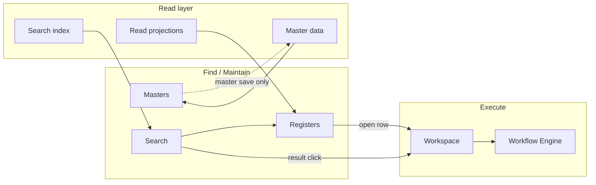
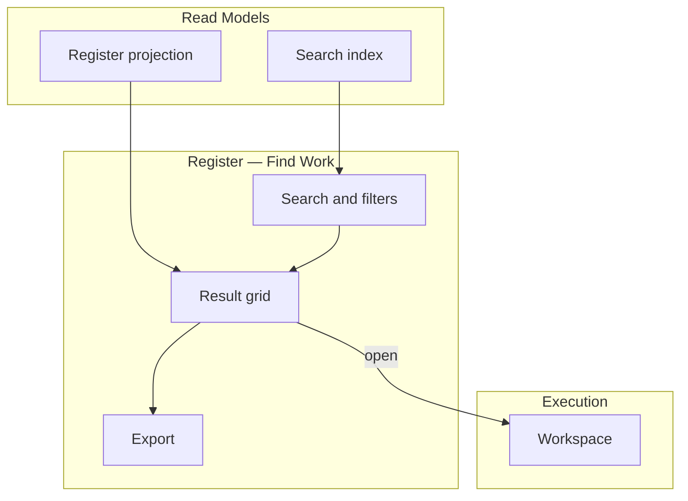
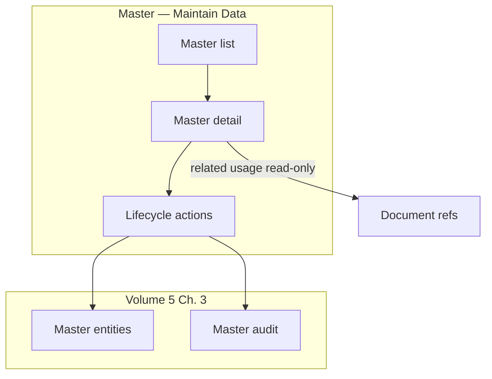
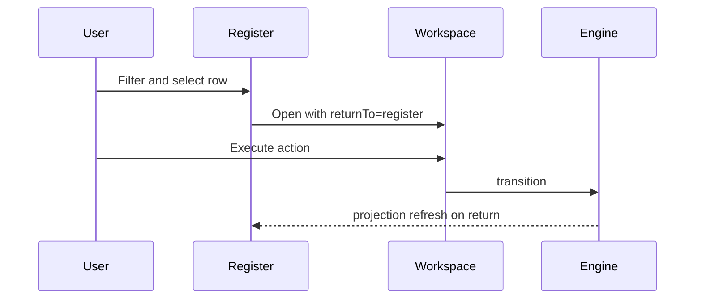
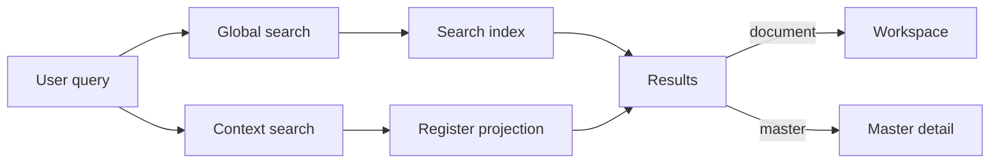
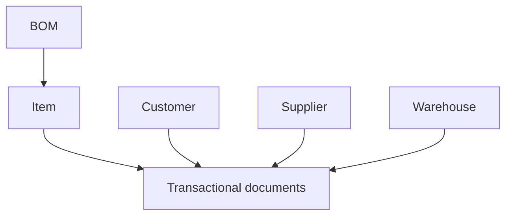
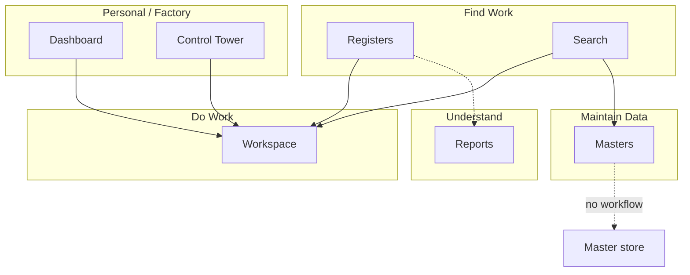

# Registers, Masters & Browse Surfaces

| Field | Value |
|-------|-------|
| **Document ID** | FT-PD-064 |
| **Volume** | 6 — UI & Experience Architecture |
| **Chapter** | 5 — Registers, Masters & Browse Surfaces |
| **Title** | Registers, Masters & Browse Surfaces |
| **Version** | 1.0.0 |
| **Status** | Draft — Architecture Review |
| **Effective date** | 2026-05-29 |
| **Author** | FT ERP Product Team |
| **Owner** | FT ERP Product Architecture |
| **Audience** | Product, UX architects, frontend leads, domain authors |
| **Classification** | Product — UI & Experience Architecture |

**Parent documents:**

- [Chapter 4 — Workspace Architecture & Document Execution Surfaces](./Chapter_04_Workspace_Architecture_and_Document_Execution_Surfaces.md)
- [Chapter 1 — UI Architecture, Navigation & Experience Principles](./Chapter_01_UI_Architecture_Navigation_and_Experience_Principles.md)
- [Volume 5, Ch. 3 — Master Data Architecture](../05_Data_Architecture/Chapter_03_Master_Data_and_Reference_Architecture.md)
- [Volume 5, Ch. 6 — Read Models](../05_Data_Architecture/Chapter_06_Read_Models_Reporting_and_Analytical_Persistence.md)
- [Volume 4 — Workflow Engine](../04_Workflow_Engine/README.md)

---

## 1. Document Control

| Version | Date | Author | Summary |
|---------|------|--------|---------|
| 1.0.0 | 2026-05-29 | FT ERP Product Team | Initial Registers, Masters & Browse Surfaces specification |

**Supersedes:** None.

**Change authority:** Product Architecture. New register types require read-model registration; new master types require Volume 5 Ch. 3 alignment.

**Out of scope:** React, HTML, CSS, APIs, database schema, column-level field specs, pixel layouts.

---

## 2. Purpose

This chapter defines architectural standards for **Registers** and **Master Data** surfaces.

- **Registers** = **Find Work** — operational discovery and navigation
- **Masters** = **Maintain Business Data** — enterprise reference maintenance

Neither performs **workflow execution**. Execution remains in **Workspace** only ([Ch. 4](./Chapter_04_Workspace_Architecture_and_Document_Execution_Surfaces.md)).

---

## 3. Scope

### 3.1 In scope

- Register and master philosophy (§5–6)
- Register and master architecture (§7–8)
- Register and master catalogs (§9–10)
- Browse and search model (§11)
- Capability matrices (§13–14, §14A)
- Business Rules and diagrams

### 3.2 Out of scope

- Report/analytical surfaces (Volume 6 Ch. 6+)
- Workspace execution detail (Volume 6 Ch. 4)
- Master logical entity specs (Volume 5 Ch. 3)
- Search index implementation (Volume 7)

### 3.3 Surface taxonomy

| Surface | Tagline | Executes workflow? |
|---------|---------|-------------------|
| **Register** | Find Work | **No** — opens Workspace |
| **Master** | Maintain Business Data | **No** — master save only |
| **Workspace** | Do Work | **Yes** |
| **Dashboard** | My Work | No |
| **Control Tower** | Monitor Factory | No |
| **Report** | Understand Business | No |

---

## 4. Relationship with Previous Volumes

| Volume | Relationship |
|--------|--------------|
| **Vol. 4** | Registers display workflow state; transitions only in Workspace |
| **Vol. 5, Ch. 3** | Master entities, lifecycle, ownership — **authority** |
| **Vol. 5, Ch. 6** | Search index, register projections — **data source** |
| **Vol. 6, Ch. 1** | Register vs Workspace vs Report distinction |
| **Vol. 6, Ch. 4** | Register → Workspace handoff, `returnTo=register` |

### 4.1 Delegation architecture

---

## 5. Register Philosophy

| Principle | Meaning |
|-----------|---------|
| **Find Work** | Locate documents, batches, queues across high volume |
| **Browse** | Scan filtered lists — not personal inbox (Dashboard) |
| **Search** | Text and structured query across register scope |
| **Filter** | Domain filters — state, pool, date, owner, Business Model |
| **Compare** | Side-by-side read-only compare (policy) — no bulk execute |
| **Open Workspace** | Primary outcome — row action opens execution surface |
| **Read-only by default** | List/grid never posts transitions |
| **High-volume operation** | Pagination, sort, saved views — performance first |

### 5.1 Register vs adjacent surfaces

| Surface | Difference |
|---------|------------|
| **Workspace** | Register **finds**; Workspace **executes** |
| **Report** | Report **aggregates/analyzes**; Register **lists operational documents** for navigation |
| **Dashboard** | Dashboard = **my** actionable subset; Register = **full domain list** |

---

## 6. Master Data Philosophy

| Principle | Meaning |
|-----------|---------|
| **Maintain Business Data** | CRUD on masters — not transactional documents |
| **Reference ownership** | One domain owns write accountability ([Vol. 5 Ch. 3 §5](../05_Data_Architecture/Chapter_03_Master_Data_and_Reference_Architecture.md)) |
| **Version awareness** | BOM versions, org hierarchy — display revision context |
| **Lifecycle management** | Proposed → Active → Suspended → Deprecated → Archived |
| **Activation** | Governed promote — audit logged |
| **Retirement** | Deprecate/archive — never delete posted references |
| **Governance** | Permissions gate maintenance |

### 6.1 Master vs transaction vs workflow

| Concept | Master | Transaction (document) |
|---------|--------|------------------------|
| **Workflow** | No document State Machine (policy approval optional) | Full Workflow Engine |
| **History** | Master audit log | Event Store + document trail |
| **Used by** | Referenced on create | Drives factory execution |

---

## 7. Register Architecture

Standard register **capabilities**:

| Component | Purpose | Mandatory |
|-----------|---------|-----------|
| **Search** | Text search on number, party, item | **Yes** |
| **Quick Filters** | State chips, my domain, open/closed | **Yes** |
| **Advanced Filters** | Multi-field query builder | Recommended |
| **Saved Views** | User/role saved filter+sort presets | Optional |
| **Sort** | Column sort, default per register | **Yes** |
| **Group** | Group by state, pool, customer | Optional |
| **Column Configuration** | Show/hide columns, persist preference | Optional |
| **Bulk Selection** | Multi-select rows | Optional — **read/export only** |
| **Export** | CSV/Excel extract of current view | Optional |
| **Open Workspace** | Primary row action | **Yes** |

**Rule:** Bulk selection **never** bulk-executes workflow transitions on register ([REG-01](#12-business-rules)).

---

## 8. Master Architecture

Standard master **components**:

| Component | Purpose |
|-----------|---------|
| **List** | Searchable master catalog |
| **Detail** | Single master edit/view |
| **Create** | New master record (Proposed/Active policy) |
| **Edit** | Descriptive/structural changes per policy |
| **Activate** | Proposed → Active |
| **Suspend** | Block new references |
| **Archive** | Read-only retention |
| **History** | Master audit trail |
| **Related Usage** | Where referenced (read-only) — documents using item, etc. |

Master detail uses **Master Data Workspace** pattern ([Ch. 4 §10.8](./Chapter_04_Workspace_Architecture_and_Document_Execution_Surfaces.md)) — hybrid, not transactional workflow.

---

## 9. Register Catalog

| Register | Purpose | Primary user | Source projection | Navigation target |
|----------|---------|--------------|-------------------|-------------------|
| **Commercial Registers** | Enquiry, Quotation, ISO lists | Admin | Document + search index | Commercial Workspace |
| **Planning Registers** | RS, MPRS, MR, WO lists | Store | Planning queue projection | Planning Workspace |
| **Procurement Registers** | PR, PO, GRN by pool | Purchase / Store | Procurement projection | Procurement Workspace |
| **Manufacturing Registers** | WO, PMR, Issue, PE | Store / Production | Manufacturing projection | Manufacturing Workspace |
| **QA Registers** | Inspection, rework, scrap queue | QA | QA queue projection | QA Workspace |
| **Dispatch Registers** | Dispatch Note, dispatch-eligible FG | Store | Dispatch projection | Dispatch Workspace |
| **Billing Registers** | Sales Bill, unbilled dispatch | Admin | Billing projection | Billing Workspace |
| **Inventory Registers** | Stock movement ledger, stock summary | Store | Ledger + availability projection | Trace / GRN Workspace |
| **Audit Registers** | Transition audit, master change log | Admin / compliance | Audit projection | Read-only trace / document Workspace |

---

## 10. Master Catalog

| Master | Purpose | Owner | Lifecycle | Transaction usage |
|--------|---------|-------|-----------|-------------------|
| **Item Master** | RM/SFG/FG/Consumable identity | Admin / Store | Active → Deprecated | All document lines |
| **Customer Master** | Commercial counterparty | Admin | Active → Suspended | Enquiry → Bill |
| **Supplier Master** | Procurement counterparty | Purchase | Active → Suspended | PO, GRN |
| **BOM Master** | FG material structure | Admin / Store | Versioned revisions | Planning, PMR |
| **Warehouse Master** | Storage hierarchy | Store | Active → Archived | GRN, issue, stock |
| **Organization Master** | Company, plant, dept | Admin | Version-aware | Reporting dimensions |
| **User & Role Masters** | Access control | System / Admin | Active → Deactivated | Audit attribution |
| **Commercial Reference Masters** | Payment terms, currency, tax class | Admin | Active → Deprecated | Quotation, bill lines |

---

## 11. Browse & Search Model

| Search type | Scope | Read Model |
|-------------|-------|------------|
| **Global search** | All documents + masters (permission-filtered) | Search index ([Ch. 5 §10](../05_Data_Architecture/Chapter_06_Read_Models_Reporting_and_Analytical_Persistence.md)) |
| **Context search** | Within current register/master | Register projection query |
| **Cross-domain search** | Multiple document types | Search index with domain facet |
| **Correlation search** | Factory thread by `correlationId` | Correlation trace projection |
| **Batch search** | Production batch, GRN lot | Batch genealogy index |
| **Saved searches** | User persisted queries | Preference store |
| **Recent searches** | Session/user history | Client or preference store |

**Interaction:** Search **returns links** — document → Workspace; master → Master detail. Search **never** executes transitions ([REG-05](#12-business-rules)).

---

## 12. Business Rules

| ID | Rule |
|----|------|
| **REG-01** | **Registers never execute workflows** — open Workspace only. |
| **REG-02** | **Registers open Workspaces** with `returnTo=register` and filter state preserved. |
| **REG-03** | **Masters never own workflow transitions** ([WSP-11](./Chapter_04_Workspace_Architecture_and_Document_Execution_Surfaces.md)). |
| **REG-04** | **Master lifecycle is independent** of document workflow ([MDA-07](../05_Data_Architecture/Chapter_03_Master_Data_and_Reference_Architecture.md)). |
| **REG-05** | **Search uses projections** — rebuildable index ([RMP-07](../05_Data_Architecture/Chapter_06_Read_Models_Reporting_and_Analytical_Persistence.md)). |
| **REG-06** | **Registers are rebuildable** from documents + Read Models. |
| **REG-07** | **Master changes never modify historical transactions** ([MDA-06](../05_Data_Architecture/Chapter_03_Master_Data_and_Reference_Architecture.md)). |
| **REG-08** | **Registers and Reports are distinct** — registers navigate; reports analyze. |
| **REG-09** | **Bulk actions on registers** limited to export/print — not transition. |
| **REG-10** | **Inactive masters** not selectable on **new** document create from Workspace — register shows status. |
| **REG-11** | **Audit registers** are read-only — no edit path. |
| **REG-12** | **Dashboard and Control Tower** may link to registers — registers do not replace them. |

---

## 13. Register Capability Matrix

| Register | Source Projection | Search | Filter | Bulk | Export | Opens Workspace |
|----------|-------------------|--------|--------|------|--------|-----------------|
| **Commercial** | Document + search index | Yes | Yes | Optional | Yes | Yes |
| **Planning** | Planning queue projection | Yes | Yes | Optional | Yes | Yes |
| **Procurement** | Procurement projection (pool-aware) | Yes | Yes | Optional | Yes | Yes |
| **Manufacturing** | Manufacturing projection | Yes | Yes | Optional | Yes | Yes |
| **QA** | QA queue projection | Yes | Yes | Optional | Yes | Yes |
| **Dispatch** | Dispatch projection | Yes | Yes | Optional | Yes | Yes |
| **Billing** | Billing projection | Yes | Yes | Optional | Yes | Yes |
| **Inventory** | Ledger / stock projection | Yes | Yes | Optional | Yes | Yes (trace/source doc) |
| **Audit** | Audit projection | Yes | Yes | No | Yes | Read-only Workspace |

---

## 14. Master Capability Matrix

| Master | Create | Edit | Activate | Suspend | Archive | Versioned | Referenced By |
|--------|--------|------|----------|---------|---------|-----------|---------------|
| **Item** | Yes | Yes | Yes | Yes | Yes | Identity fixed | All domains |
| **Customer** | Yes | Yes | Yes | Yes | Yes | Profile versioned | Commercial, dispatch, bill |
| **Supplier** | Yes | Yes | Yes | Yes | Yes | Address versioned | Procurement |
| **BOM** | Yes | Yes | Yes (version) | N/A | Yes | **Yes — revisions** | Planning, PMR |
| **Warehouse** | Yes | Yes | Yes | Yes | Yes | Org binding | Inventory |
| **Organization** | Yes | Yes | Yes | Yes | Yes | **Yes — hierarchy** | All |
| **User** | Yes | Yes | Yes | Yes | Deactivate | Role history | Audit |
| **Role** | Policy | Policy | Yes | Yes | Yes | Permission bundle | Access control |
| **Commercial Reference** | Yes | Yes | Yes | Deprecate | Yes | Effective-dated | Quotation, bill |

---

## 14A. Register Navigation Matrix

| Register | Default Landing | Primary Filters | Default Sort | Opens | Return Context |
|----------|-----------------|-----------------|--------------|-------|----------------|
| **Commercial** | Open ISO / Enquiry list | State, customer, Business Model | Updated desc | Commercial Workspace | `returnTo=commercialRegister` |
| **Planning** | Open MR / WO lists | State, REGULAR vs NO_QTY, pool | Priority, age | Planning Workspace | `returnTo=planningRegister` |
| **Procurement** | PR queue by pool tab | Pool, state, supplier | Age desc | Procurement Workspace | `returnTo=procurementRegister` + pool |
| **Manufacturing** | Active WO list | State, item, WO no | WO date desc | Manufacturing Workspace | `returnTo=mfgRegister` |
| **QA** | QA_PENDING queue | State, batch, WO | Age desc | QA Workspace | `returnTo=qaRegister` |
| **Dispatch** | Dispatch-eligible FG | ISO, customer, age | Dispatch priority | Dispatch Workspace | `returnTo=dispatchRegister` |
| **Billing** | Unbilled dispatch | Customer, ISO, age | Dispatch date | Billing Workspace | `returnTo=billingRegister` |
| **Inventory** | Stock movement ledger | Item, location, type | Posted desc | Source doc Workspace / trace | `returnTo=inventoryRegister` |
| **Audit** | Recent transitions | Domain, user, date | Time desc | Read-only doc Workspace | `returnTo=auditRegister` |

### 14A.1 Navigation behaviors

| Behavior | Rule |
|----------|------|
| **Deep-link support** | Register URL encodes filter preset — shareable read-only view |
| **Correlation navigation** | Search/register opens correlation trace → sibling documents |
| **Previous/Next** | Within current filter — opens adjacent row Workspace |
| **Multi-select** | Export only — no batch workflow |
| **Read-only vs editable** | Register always read-only; edit only after Workspace open by owner |

---

## 15. Logical Diagrams

### 15.1 Register architecture

### 15.2 Master architecture

### 15.3 Register → Workspace navigation

### 15.4 Search architecture

### 15.5 Master relationships

### 15.6 Overall browse ecosystem

---

## 16. Review Checklist

- [ ] Register consistency — capability matrix (§13)
- [ ] Master consistency — capability matrix (§14)
- [ ] Navigation integrity — §14A, REG-02
- [ ] Search completeness — §11
- [ ] Read-only separation — REG-01, REG-09
- [ ] Workflow separation — execution only in Workspace
- [ ] Historical integrity — REG-07, master retirement
- [ ] Register vs Report distinction — REG-08
- [ ] Six Mermaid diagrams
- [ ] No React, HTML, CSS, API, schema, implementation code

---

## 17. Change Log

| Version | Date | Author | Summary |
|---------|------|--------|---------|
| 1.0.0 | 2026-05-29 | FT ERP Product Team | Initial Registers, Masters & Browse Surfaces specification |

---

## 18. Approval Block

| Role | Name | Signature | Date |
|------|------|-----------|------|
| Product Owner | | | |
| Product Architecture | | | |
| UX / Experience Lead | | | |
| Master Data Governance Lead | | | |
| Domain Specification Owners | | | |

---

## Writing Requirements

Remain **technology-neutral**.

**Do not include:** React, HTML, CSS, APIs, database schema, implementation code.

**Clearly distinguish:** Register, Master, Workspace, Dashboard, Control Tower, Report.

**Emphasize:**

- **Register = Find Work**
- **Master = Maintain Business Data**
- **Workspace = Do Work**

Registers and Masters **must never become execution surfaces**.

---

## Document navigation

| | Link |
|--|------|
| **Previous** | [Workspace Architecture & Document Execution Surfaces](./Chapter_04_Workspace_Architecture_and_Document_Execution_Surfaces.md) (FT-PD-063) |
| **Next** | [Reports & Analytical Surfaces](./Chapter_06_Reports_and_Analytical_Surfaces.md) (FT-PD-065) |
| **Volume** | [UI and Experience Architecture](./README.md) |
| **Product** | [Product Documentation Index](../README.md) |

