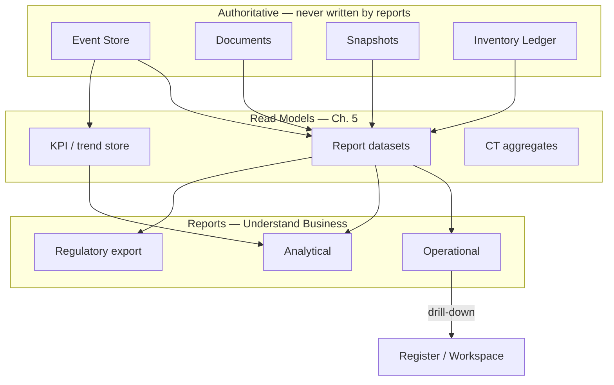
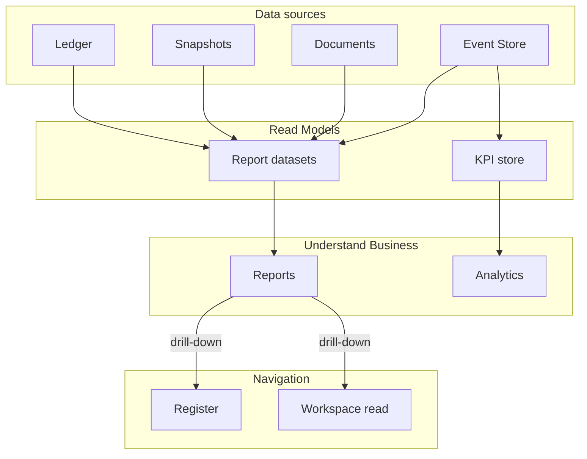
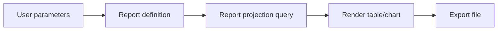
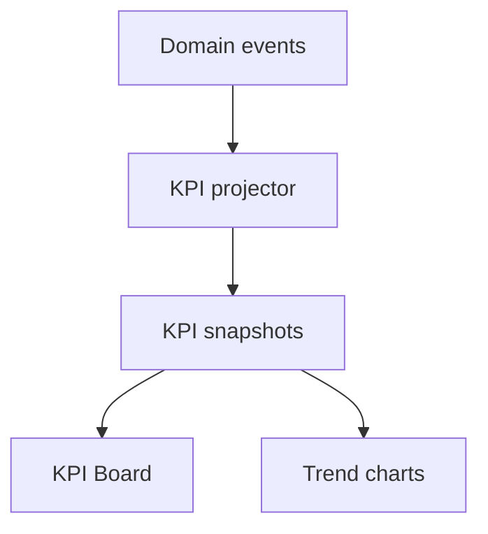
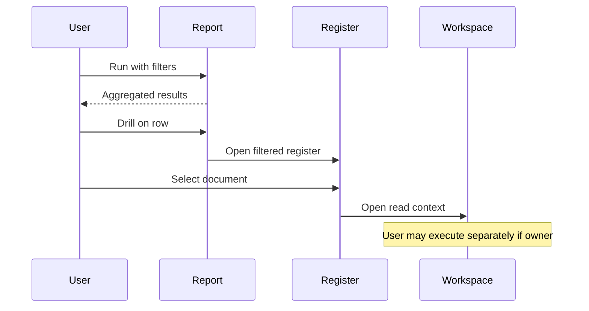
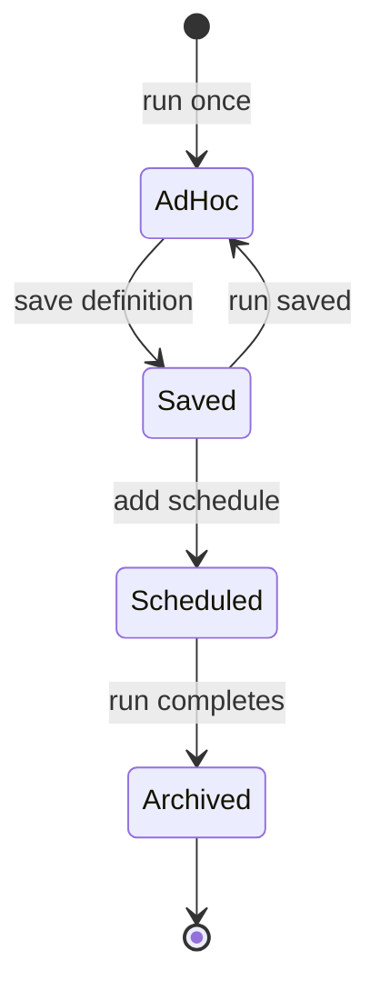
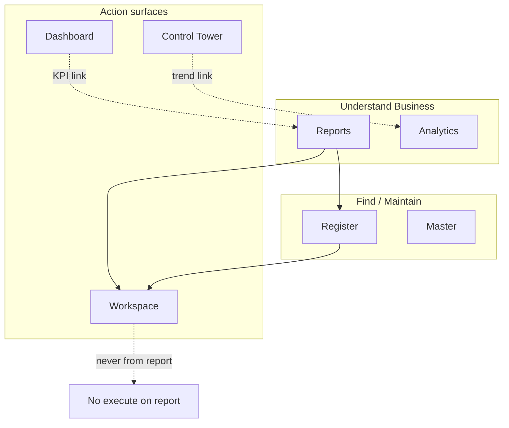

# Reports & Analytical Surfaces

| Field | Value |
|-------|-------|
| **Document ID** | FT-PD-065 |
| **Volume** | 6 — UI & Experience Architecture |
| **Chapter** | 6 — Reports & Analytical Surfaces |
| **Title** | Reports & Analytical Surfaces |
| **Version** | 1.0.0 |
| **Status** | Draft — Architecture Review |
| **Effective date** | 2026-05-29 |
| **Author** | FT ERP Product Team |
| **Owner** | FT ERP Product Architecture |
| **Audience** | Product, UX architects, analytics owners, compliance leads |
| **Classification** | Product — UI & Experience Architecture |

**Parent documents:**

- [Chapter 5 — Registers, Masters & Browse Surfaces](./Chapter_05_Registers_Masters_and_Browse_Surfaces.md)
- [Chapter 2 — Dashboard Architecture & Widget Standards](./Chapter_02_Dashboard_Architecture_and_Widget_Standards.md)
- [Chapter 3 — Control Tower Architecture & Factory Monitoring](./Chapter_03_Control_Tower_Architecture_and_Factory_Monitoring.md)
- [Volume 5, Ch. 6 — Read Models & Analytical Persistence](../05_Data_Architecture/Chapter_06_Read_Models_Reporting_and_Analytical_Persistence.md)
- [Volume 4 — Workflow Engine](../04_Workflow_Engine/README.md)

---

## 1. Document Control

| Version | Date | Author | Summary |
|---------|------|--------|---------|
| 1.0.0 | 2026-05-29 | FT ERP Product Team | Initial Reports & Analytical Surfaces specification |

**Supersedes:** None.

**Change authority:** Product Architecture. New report categories require read-model and compliance review.

**Out of scope:** Report layouts, SQL, APIs, database schema, UI implementation, report catalog (field-level specs).

---

## 2. Purpose

This chapter defines architectural standards for **Reports** and **Analytical Surfaces** in FT ERP.

Reports are the **Understand Business** surface. They transform transactional and analytical data into **business insight**. Reports **never own workflow execution** or business state.

---

## 3. Scope

### 3.1 In scope

- Reporting and analytical philosophy (§5)
- Report categories and analytical surfaces (§6–7)
- Interaction model, navigation matrix, capability matrix (§8–9, §9A)
- Report lifecycle (§10)
- Business Rules and diagrams

### 3.2 Out of scope

- Individual report field definitions (domain chapters / Volume 7)
- Billing export payload specs (Volume 5 Ch. 6 extension)
- Dashboard KPI widgets (Volume 6 Ch. 2)
- Control Tower monitoring tiles (Volume 6 Ch. 3)

### 3.3 Surface taxonomy — complete Volume 6

| Surface | Tagline | Executes workflow? |
|---------|---------|-------------------|
| **Dashboard** | My Work | No |
| **Control Tower** | Monitor Factory | No |
| **Workspace** | Do Work | Yes |
| **Register** | Find Work | No |
| **Master** | Maintain Business Data | No (master save only) |
| **Report / Analytics** | **Understand Business** | **No** |

---

## 4. Relationship with Previous Volumes

| Volume | Relationship |
|--------|--------------|
| **Vol. 4** | Event vocabulary for historical/timeline reports |
| **Vol. 5, Ch. 1** | Event Store for trace and regulatory reproducibility |
| **Vol. 5, Ch. 4–5** | Snapshots and ledger for historical/as-of reports |
| **Vol. 5, Ch. 6 §8–9** | Reporting persistence, KPI model — **data authority** |
| **Vol. 6, Ch. 1–5** | Surface separation; drill-down to Register/Workspace |

### 4.1 Report data consumption

**Principle:** Reports **consume** projections and authoritative read extracts. They **never** write workflow state, ledger, or documents ([RPT-01](#11-business-rules)).

---

## 5. Reporting Philosophy

| Principle | Meaning |
|-----------|---------|
| **Understand Business** | Answer what happened, why, and how trends compare |
| **Read-only analysis** | No transition buttons; export is copy-out only |
| **Decision support** | Inform action — execution happens in Workspace |
| **Historical insight** | As-of and snapshot-backed views for past periods |
| **Trend analysis** | KPI snapshots over time — derived, not authoritative |
| **Operational visibility** | Registers show lists; reports **summarize and aggregate** |
| **Drill-down without execution** | Detail links → Register or read-only Workspace |
| **Exportability** | Scheduled and ad hoc export — disposable files |

### 5.1 Surface distinctions

| Surface | Reports differ how |
|---------|-------------------|
| **Dashboard** | Personal KPI + PA summary — not full analysis depth |
| **Control Tower** | Real-time factory monitor — not historical trend suite |
| **Register** | Row-level browse — reports **aggregate** across rows |
| **Analytics** | Interactive exploration layer on same Read Models as reports |

---

## 6. Report Categories

| Category | Purpose | Data sources | Consumers | Refresh |
|----------|---------|--------------|-----------|---------|
| **Operational Reports** | Daily registers — GRN, issue, production summary | Report datasets, documents | Store, Purchase, Admin | Near-real-time / on-demand |
| **Analytical Reports** | Cycle time, throughput, variance | Events, KPI store | Management, domain leads | Scheduled batch |
| **Historical Reports** | Point-in-time balances and commitments | Snapshots, ledger replay | Audit, planning review | As-of parameter |
| **Regulatory Reports** | GST, batch trace, statutory extracts | Events, audit, snapshots | Compliance, Admin | Scheduled / on-demand |
| **Financial Reports** | Billing, dispatch vs bill reconciliation | Billing projection, dispatch | Admin, finance liaison | Daily / on-demand |
| **Inventory Reports** | Stock movement, shortage, aging hold | Ledger projection, availability | Store | Event-driven / on-demand |
| **Manufacturing Reports** | RM consumption variance, WO throughput | PE consumption, PMR snapshots | Store, Production | On-demand / scheduled |
| **Executive Reports** | E2E cycle time, factory load | Executive KPI, orchestration aggregates | Management | Scheduled |

*This chapter defines **architectural patterns** — not a catalog of named report products.*

---

## 7. Analytical Surfaces

| Surface | Purpose | Read Model interaction |
|---------|---------|------------------------|
| **KPI Boards** | Multi-metric executive view | KPI projection + snapshots |
| **Trend Analysis** | Time-series charts | KPI snapshot store ([Ch. 5 §9.4](../05_Data_Architecture/Chapter_06_Read_Models_Reporting_and_Analytical_Persistence.md)) |
| **Comparison Views** | Period vs period, actual vs plan | Historical report datasets |
| **Variance Analysis** | Planned vs actual RM/FG | Snapshots + ledger |
| **Forecast Views** | Forward projection (policy) | Derived from trends — **not** authoritative plan |
| **Historical Timelines** | Correlation milestone chart | Event Store summary |
| **Cross-domain Analytics** | Phase duration, bottleneck heat map | CT orchestration aggregates |

**Rule:** Analytical surfaces are **interactive reports** — same read-only and drill-down rules as static reports.

---

## 8. Report Interaction Model

| Interaction | Purpose | Execution? |
|-------------|---------|------------|
| **Search** | Find within report result set | No |
| **Filter** | Parameterize date, domain, item, customer | No |
| **Group** | Pivot dimensions | No |
| **Sort** | Column ordering | No |
| **Drill-down** | Row/cell → Register or read-only Workspace | Navigation only |
| **Export** | CSV, Excel, PDF, regulatory file | No — file is disposable |
| **Print** | Hard copy view | No |
| **Schedule** | Recurring generation + delivery metadata | No — generates extract only |
| **Share** | *Future-ready* — link to saved report definition | No |

### 8.1 Interaction classification

| Class | Allowed |
|-------|---------|
| **Analysis** | Filter, group, chart, compare |
| **Navigation** | Drill-down to Register/Workspace (read-only unless user executes in Workspace separately) |
| **Execution** | **Not allowed** on report surface |

---

## 9. Report Navigation Matrix

| Report Category | Source Read Model | Drill-down Target | Export | Schedule | Execution Allowed |
|-----------------|-------------------|-------------------|--------|----------|-------------------|
| **Commercial** | Commercial report dataset | Commercial Register / ISO Workspace (read) | Yes | Yes | **No** |
| **Planning** | Planning projection | Planning Register / MPRS Workspace (read) | Yes | Yes | **No** |
| **Procurement** | Procurement trace dataset | Procurement Register / PO Workspace (read) | Yes | Yes | **No** |
| **Manufacturing** | MFG variance / throughput dataset | MFG Register / WO Workspace (read) | Yes | Yes | **No** |
| **QA** | QA disposition aggregates | QA Register / Inspection Workspace (read) | Yes | Yes | **No** |
| **Dispatch** | Dispatch summary dataset | Dispatch Register / DN Workspace (read) | Yes | Yes | **No** |
| **Billing** | Billing reconciliation dataset | Billing Register / Sales Bill Workspace (read) | Yes | Yes | **No** |
| **Inventory** | Ledger movement dataset | Inventory Register / trace Workspace (read) | Yes | Yes | **No** |
| **Executive** | Executive KPI / E2E dataset | Control Tower / correlation timeline (read) | Yes | Yes | **No** |

**Drill-down rule:** Reports open **read-only** context by default. User may navigate to Workspace and execute **only if** owning role — report did not execute ([RPT-04](#11-business-rules)).

---

## 9A. Report Capability Matrix

| Report Type | Read Model | Historical | Drill-down | Export | Schedule | KPI Source |
|-------------|------------|------------|------------|--------|----------|------------|
| **Operational** | Report dataset projection | Optional period filter | Register | Yes | Yes | Queue counts |
| **Analytical** | KPI + event aggregates | Yes — trend periods | Register / CT link | Yes | Yes | KPI snapshot store |
| **Historical** | Snapshots + ledger as-of | **Required** | Document trace | Yes | Yes | N/A — as-of facts |
| **Regulatory** | Audit + snapshot extract | **Required** | Audit register | Yes | Yes | Compliance metrics |
| **Financial** | Billing/dispatch projection | Period close | Billing register | Yes | Yes | Revenue/shipment KPIs |
| **Inventory** | Ledger replay projection | As-of stock | Inventory register | Yes | Yes | Availability KPIs |
| **Manufacturing** | PE/PMR variance projection | WO completion history | MFG register | Yes | Yes | Throughput KPIs |
| **Executive** | Executive roll-up | Multi-period | CT / timeline | Yes | Yes | Executive KPI board |

### 9A.1 Report delivery classes

| Class | Definition |
|-------|------------|
| **Static reports** | Fixed layout extract — run on demand or schedule |
| **Interactive reports** | Filter/group/drill in UI — same Read Models |
| **Scheduled reports** | Batch extract + run metadata — reproducible parameters |
| **Analytical views** | KPI boards, trends — continuous refresh from projections |

---

## 10. Report Lifecycle

| Stage | Definition |
|-------|------------|
| **Ad hoc** | User runs with parameters — no saved definition |
| **Saved report** | Named definition: parameters, columns, filters — user/role scope |
| **Scheduled report** | Saved definition + cron/recurrence + delivery target |
| **Archived report** | Past run output retained for audit — parameters + timestamp stored |
| **Report definition** | Logical spec — versioned when breaking parameter change |
| **Versioning** | Definition version increment — old runs remain reproducible with old version id |
| **Historical reproducibility** | Re-run with `(definitionVersion, asOfDate, parameters)` yields consistent logic; data reflects sources at as-of |

**Scheduled run metadata:** who scheduled, when run, parameter snapshot, output location — **not** a second system of record.

---

## 11. Business Rules

| ID | Rule |
|----|------|
| **RPT-01** | **Reports never execute workflows** — analysis and export only. |
| **RPT-02** | **Reports consume projections** — not ad hoc authoritative writes ([RMP-04](../05_Data_Architecture/Chapter_06_Read_Models_Reporting_and_Analytical_Persistence.md)). |
| **RPT-03** | **Reports never become the system of record** — exports are disposable copies. |
| **RPT-04** | **Drill-down opens Registers or Workspaces** — not inline execution on report. |
| **RPT-05** | **Reports remain reproducible** — definition version + parameters + as-of documented. |
| **RPT-06** | **Historical reports preserve historical context** — snapshots/ledger as-of ([Ch. 5 §4](../05_Data_Architecture/Chapter_04_Planning_and_Procurement_Snapshot_Architecture.md)). |
| **RPT-07** | **Exports never modify business data** — file generation is read path only. |
| **RPT-08** | **Analytical calculations are derived** — KPIs rebuildable from sources ([RMP-06](../05_Data_Architecture/Chapter_06_Read_Models_Reporting_and_Analytical_Persistence.md)). |
| **RPT-09** | **Reports distinct from Dashboard** — no PA inbox on report surface ([DSH-01](./Chapter_02_Dashboard_Architecture_and_Widget_Standards.md)). |
| **RPT-10** | **Reports distinct from Control Tower** — CT monitors live factory; reports analyze trends/history ([CTW-04](./Chapter_03_Control_Tower_Architecture_and_Factory_Monitoring.md)). |
| **RPT-11** | **Reports distinct from Registers** — registers navigate rows; reports aggregate ([REG-08](./Chapter_05_Registers_Masters_and_Browse_Surfaces.md)). |
| **RPT-12** | **Regulatory extracts** use frozen Snapshot fields for posted periods — not live master. |

---

## 12. Logical Diagrams

### 12.1 Reporting architecture

### 12.2 Report data flow

### 12.3 Analytical pipeline

### 12.4 Drill-down navigation

### 12.5 Report lifecycle

### 12.6 Overall reporting ecosystem

---

## 13. Review Checklist

- [ ] Read-only enforcement — RPT-01, §8.1
- [ ] Analytical completeness — §6–7, §9A
- [ ] Navigation consistency — §9 drill-down matrix
- [ ] Historical reproducibility — §10, RPT-05, RPT-06
- [ ] Projection usage — §4, RPT-02
- [ ] Dashboard / Register / Control Tower separation — RPT-09–11
- [ ] Six Mermaid diagrams
- [ ] No layouts, SQL, API, schema, UI implementation code

---

## 14. Change Log

| Version | Date | Author | Summary |
|---------|------|--------|---------|
| 1.0.0 | 2026-05-29 | FT ERP Product Team | Initial Reports & Analytical Surfaces specification |

---

## 15. Approval Block

| Role | Name | Signature | Date |
|------|------|-----------|------|
| Product Owner | | | |
| Product Architecture | | | |
| UX / Experience Lead | | | |
| Analytics / Reporting Lead | | | |
| Compliance Liaison | | | |

---

## Writing Requirements

Remain **technology-neutral**.

**Do not include:** report layouts, SQL, APIs, database schema, UI implementation, implementation code.

**Clearly distinguish:**

- **Dashboard = My Work**
- **Control Tower = Monitor Factory**
- **Workspace = Do Work**
- **Register = Find Work**
- **Master = Maintain Business Data**
- **Report = Understand Business**

Reports **must never become operational execution surfaces**.

---

## Document navigation

| | Link |
|--|------|
| **Previous** | [Registers, Masters & Browse Surfaces](./Chapter_05_Registers_Masters_and_Browse_Surfaces.md) (FT-PD-064) |
| **Next** | [Security, Authorization & Governance Architecture](../07_Security_and_Governance_Architecture/Chapter_01_Security_Authorization_and_Governance_Architecture.md) (FT-PD-070) |
| **Volume** | [UI and Experience Architecture](./README.md) |
| **Product** | [Product Documentation Index](../README.md) |

