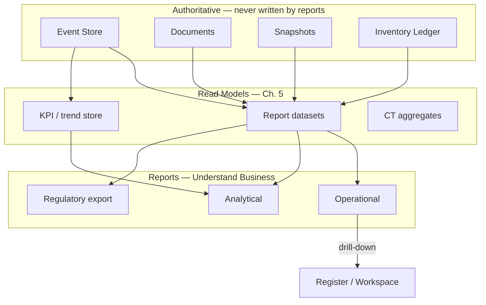
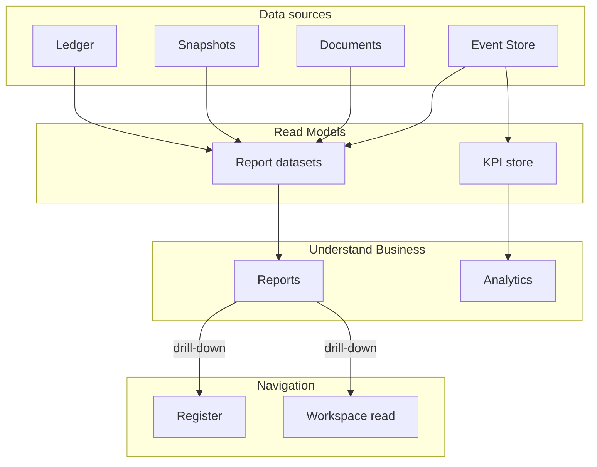
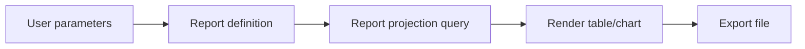
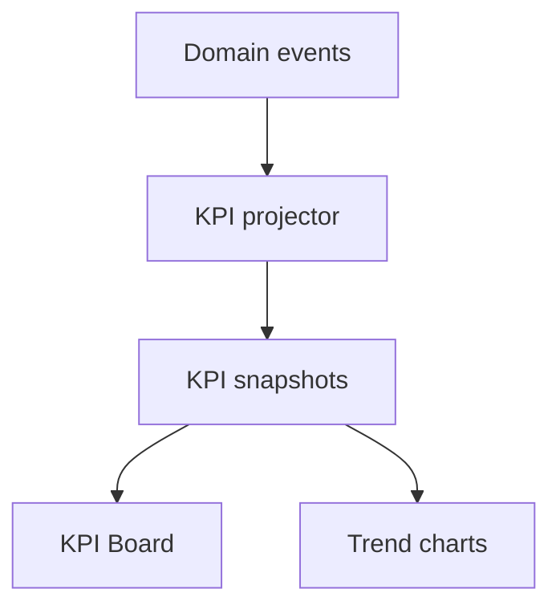
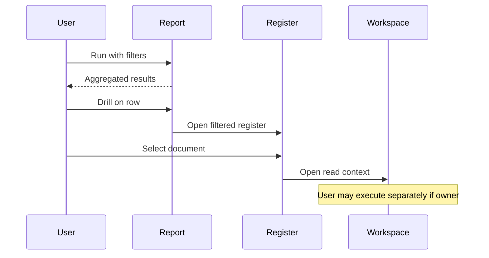
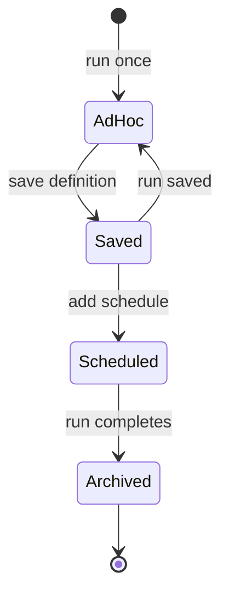
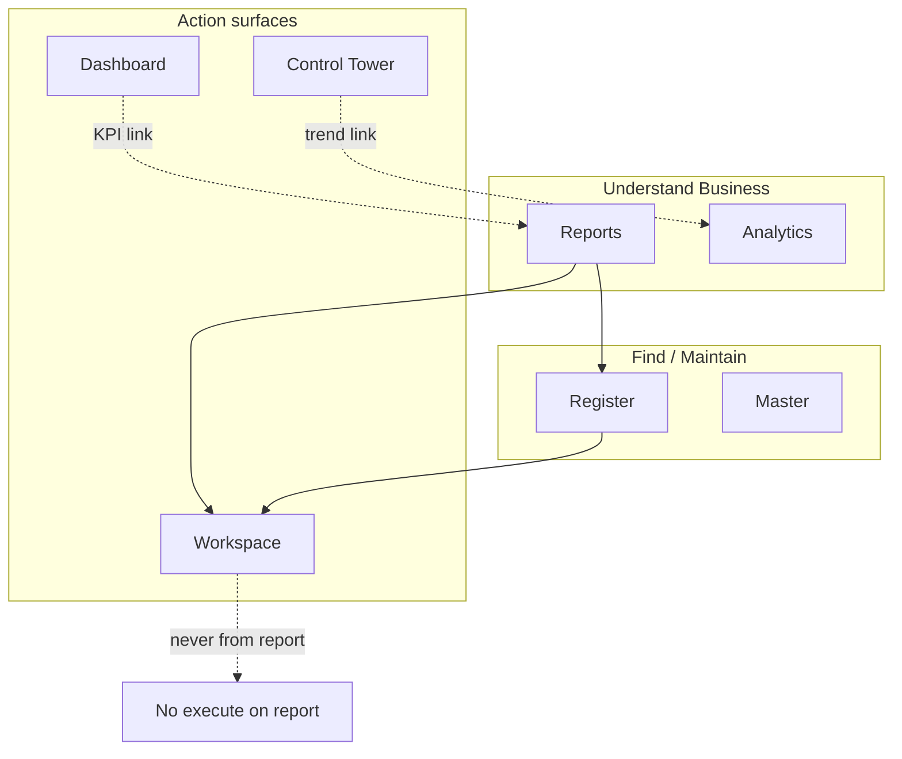

# Reports & Analytical Surfaces

| Field | Value |
|-------|-------|
| **Document ID** | FT-PD-065 |
| **Volume** | 6 — UI & Experience Architecture |
| **Chapter** | 6 — Reports & Analytical Surfaces |
| **Title** | Reports & Analytical Surfaces |
| **Version** | 1.3.0 |
| **Status** | Draft — Architecture Review |
| **Effective date** | 2026-07-09 |
| **Author** | FT ERP Product Team |
| **Owner** | FT ERP Product Architecture |
| **Audience** | Product, UX architects, analytics owners, compliance leads |
| **Classification** | Product — UI & Experience Architecture |

**Parent documents:**

- [Chapter 5 — Registers, Masters & Browse Surfaces](./Chapter_05_Registers_Masters_and_Browse_Surfaces.md)
- [Chapter 2 — Dashboard Architecture & Widget Standards](./Chapter_02_Dashboard_Architecture_and_Widget_Standards.md)
- [Chapter 3 — Control Tower Architecture & Factory Monitoring](./Chapter_03_Control_Tower_Architecture_and_Factory_Monitoring.md)
- [Volume 5, Ch. 6 — Read Models & Analytical Persistence](../05_Data_Architecture/Chapter_06_Read_Models_Reporting_and_Analytical_Persistence.md)
- [Volume 4 — Workflow Engine](../04_Workflow_Engine/README.md)

---

## 1. Document Control

| Version | Date | Author | Summary |
|---------|------|--------|---------|
| 1.0.0 | 2026-05-29 | FT ERP Product Team | Initial Reports & Analytical Surfaces specification |
| 1.1.0 | 2026-07-09 | FT ERP Product Team | Sales Ops report ownership — Customer Tracking master; SO→Dispatch Trace merged; Dispatch Summary analytics+register |
| 1.2.0 | 2026-07-09 | FT ERP Product Team | Analysis catalog rationalization; read-only from Reports; print/export; defect register RPT-001–014 |
| 1.2.1 | 2026-07-09 | FT ERP Product Team | Print/Export coverage matrix §6.2A — close UAT gap on all official Analysis reports |
| 1.3.0 | 2026-07-10 | FT ERP Product Team | Production Wastage WO / Type Analysis catalog entries (Lane C); keep MWN / Variance / Scrap separate |

**Supersedes:** None.

**Change authority:** Product Architecture. New report categories require read-model and compliance review.

**Out of scope:** Report layouts, SQL, APIs, database schema, UI implementation, report catalog (field-level specs).

---

## 2. Purpose

This chapter defines architectural standards for **Reports** and **Analytical Surfaces** in FT ERP.

Reports are the **Understand Business** surface. They transform transactional and analytical data into **business insight**. Reports **never own workflow execution** or business state.

---

## 3. Scope

### 3.1 In scope

- Reporting and analytical philosophy (§5)
- Report categories and analytical surfaces (§6–7)
- Interaction model, navigation matrix, capability matrix (§8–9, §9A)
- Report lifecycle (§10)
- Business Rules and diagrams

### 3.2 Out of scope

- Individual report field definitions (domain chapters / Volume 7)
- Billing export payload specs (Volume 5 Ch. 6 extension)
- Dashboard KPI widgets (Volume 6 Ch. 2)
- Control Tower monitoring tiles (Volume 6 Ch. 3)

### 3.3 Surface taxonomy — complete Volume 6

| Surface | Tagline | Executes workflow? |
|---------|---------|-------------------|
| **Dashboard** | My Work | No |
| **Control Tower** | Monitor Factory | No |
| **Workspace** | Do Work | Yes |
| **Register** | Find Work | No |
| **Master** | Maintain Business Data | No (master save only) |
| **Report / Analytics** | **Understand Business** | **No** |

---

## 4. Relationship with Previous Volumes

| Volume | Relationship |
|--------|--------------|
| **Vol. 4** | Event vocabulary for historical/timeline reports |
| **Vol. 5, Ch. 1** | Event Store for trace and regulatory reproducibility |
| **Vol. 5, Ch. 4–5** | Snapshots and ledger for historical/as-of reports |
| **Vol. 5, Ch. 6 §8–9** | Reporting persistence, KPI model — **data authority** |
| **Vol. 6, Ch. 1–5** | Surface separation; drill-down to Register/Workspace |

### 4.1 Report data consumption

```mermaid
flowchart TB
  subgraph Authoritative["Authoritative — never written by reports"]
    ES[Event Store]
    DOC[Documents]
    SNAP[Snapshots]
    LED[Inventory Ledger]
  end

  subgraph Projections["Read Models — Ch. 5"]
    RPTDS[Report datasets]
    KPI[KPI / trend store]
    CTAGG[CT aggregates]
  end

  subgraph Reports["Reports — Understand Business"]
    OP[Operational]
    AN[Analytical]
    REG[Regulatory export]
  end

  ES --> RPTDS
  DOC --> RPTDS
  SNAP --> RPTDS
  LED --> RPTDS
  ES --> KPI
  RPTDS --> OP
  RPTDS --> AN
  KPI --> AN
  RPTDS --> REG
  OP -->|drill-down| NAV[Register / Workspace]
```

**Principle:** Reports **consume** projections and authoritative read extracts. They **never** write workflow state, ledger, or documents ([RPT-01](#11-business-rules)).

---

## 5. Reporting Philosophy

| Principle | Meaning |
|-----------|---------|
| **Understand Business** | Answer what happened, why, and how trends compare |
| **Read-only analysis** | No transition buttons; export is copy-out only |
| **Decision support** | Inform action — execution happens in Workspace |
| **Historical insight** | As-of and snapshot-backed views for past periods |
| **Trend analysis** | KPI snapshots over time — derived, not authoritative |
| **Operational visibility** | Registers show lists; reports **summarize and aggregate** |
| **Drill-down without execution** | Detail links → Register or read-only Workspace |
| **Exportability** | Scheduled and ad hoc export — disposable files |

### 5.1 Surface distinctions

| Surface | Reports differ how |
|---------|-------------------|
| **Dashboard** | Personal KPI + PA summary — not full analysis depth |
| **Control Tower** | Real-time factory monitor — not historical trend suite |
| **Register** | Row-level browse — reports **aggregate** across rows |
| **Analytics** | Interactive exploration layer on same Read Models as reports |

---

## 6. Report Categories

| Category | Purpose | Data sources | Consumers | Refresh |
|----------|---------|--------------|-----------|---------|
| **Operational Reports** | Daily registers — GRN, issue, production summary | Report datasets, documents | Store, Purchase, Admin | Near-real-time / on-demand |
| **Analytical Reports** | Cycle time, throughput, variance | Events, KPI store | Management, domain leads | Scheduled batch |
| **Historical Reports** | Point-in-time balances and commitments | Snapshots, ledger replay | Audit, planning review | As-of parameter |
| **Regulatory Reports** | GST, batch trace, statutory extracts | Events, audit, snapshots | Compliance, Admin | Scheduled / on-demand |
| **Financial Reports** | Billing, dispatch vs bill reconciliation | Billing projection, dispatch | Admin, finance liaison | Daily / on-demand |
| **Inventory Reports** | Stock movement, shortage, aging hold | Ledger projection, availability | Store | Event-driven / on-demand |
| **Manufacturing Reports** | RM consumption variance, WO throughput | PE consumption, PMR snapshots | Store, Production | On-demand / scheduled |
| **Executive Reports** | E2E cycle time, factory load | Executive KPI, orchestration aggregates | Management | Scheduled |

*This chapter defines **architectural patterns** — not a catalog of named report products.*

### 6.1 Sales Operations report ownership (product register)

Named Sales Ops reports **SHALL** follow single ownership to avoid duplicate lifecycle surfaces. Decisions below are **presentation/navigation only** — workflow, stock, FIFO, QC, billing, dispatch execution, audit, and permissions are unchanged.

| Report | Decision | Ownership / purpose | Coverage |
|--------|----------|---------------------|----------|
| **Customer Tracking Report** (`/customer-tracking-flow`, `/customer-po-tracking`) | **KEEP** — master customer lifecycle | Authoritative customer-facing order journey | Customer → Customer PO → SO → RS (NO_QTY) → WO → Production → QC → Dispatch → Sales Bill → Outstanding / Returns / Replacement (where linked). Includes **Production Journey** (SO → WO → Prod → QC → Dispatch) with drill-down. |
| **SO to Dispatch Trace** (`/reports/so-dispatch-trace`) | **MERGE** into Customer Tracking | Capability preserved as Production Journey section; catalog tile removed; legacy URL redirects to Customer Tracking `#production-journey` | Same SO→Dispatch stage matrix via existing read API composition — no second ownership surface |
| **Dispatch Summary** (`/reports/dispatch-summary`) | **KEEP** — operational dispatch analytics | Pending ready-to-ship + locked Dispatch Register; KPI strip; tabbed layout; **no** workflow actions (e.g. Open Dispatch) | Dispatch Today / Month / Pending Qty / Pending Lines; Pending tab; Register (LOCKED history) |

**Navigation:** Reports catalog lists Customer Tracking and Dispatch Summary only for this lifecycle/analytics pair. Execution remains in Dispatch Workspace ([RPT-01](#11-business-rules), [RPT-04](#11-business-rules)).

**UI standard:** Surfaces comply with [FT-PD-066](./Chapter_07_FT_ERP_UI_UX_Design_System.md) §17 report chrome **and** §17.7+ Report Grid & Analytics UX (categories, grid density, filter toolbar, KPIs, drill-down). Do not maintain a separate report design standard.

### 6.2 Analysis catalog — Keep / Merge / Move / Remove (UAT 2026-07-09)

| Report / tile | Decision | Notes |
|---------------|----------|-------|
| Customer Tracking Report | **KEEP** (master) | Single lifecycle ownership |
| Customer PO Tracking (Customer Service tile) | **REMOVE** from catalog | Same surface as Customer Tracking |
| Customer Ledger Summary | **KEEP** | Points to Customer Tracking |
| SO to Dispatch Trace | **MERGE** (done) | Redirect to Customer Tracking Production Journey |
| Dispatch Summary | **KEEP** | Analytics + register; no Open Dispatch |
| RM Shortage Workspace | **MOVE** | Operations / RM Control Center only — not Analysis catalog |
| Material Planning / RM PO-GRN | **MOVE** | Operations only — not Analysis catalog |
| Sales Bills / Purchase Bills (from Analysis) | **KEEP** as read-only browse | Hide New bill; Back to Reports when `from=reports` |
| Stock Overview (from Analysis) | **KEEP** read-only | Hide Stock Adjustments when from Reports |
| Supplier Master (from Analysis) | **KEEP** | Back to Masters / Reports; hide Add when from Analysis |
| RM Wastage Report | **KEEP** separate | MWN + GRN valuation — not mergeable into Production RM Variance |
| Scrap Report | **KEEP** separate | FG QC scrap — distinct from RM wastage / consumption variance |
| Production RM Variance | **KEEP** | Standard vs actual consumption |
| Production Wastage — WO Analysis | **ADD** (Lane C) | CONFIRMED Production Work Order Report classification by WO/RM line — not MWN, not variance, not FG scrap |
| Production Wastage — Type Analysis | **ADD** (Lane C) | Same source grouped by Wastage Type / Category; drills to WO Analysis |
| Batch Traceability | **KEEP** | Document SO+Item limitation (RPT-003) |

**Read-only rule:** Analysis surfaces **SHALL NOT** expose workflow create/execute controls ([RPT-01](#11-business-rules)). Creation remains in operational workspaces.

**Print / export:** Every Analysis report **SHALL** support Print and Export CSV (Excel where useful); export respects filters; print hides chrome ([FT-PD-066](./Chapter_07_FT_ERP_UI_UX_Design_System.md) §17). Shared chrome: `ReportPrintExportBar` / `ReportPrintMeta` / `downloadReportCsv`.

### 6.2A Print / Export coverage matrix (UAT gap close 2026-07-09)

| Catalog tile | Classification | Print | CSV | Excel |
|--------------|----------------|-------|-----|-------|
| Dispatch Backlog | Official report | Yes | Yes | Yes |
| Customer Tracking / Ledger Summary | Official report | Yes | Yes | Yes |
| Dispatch Summary | Official report | Yes | Yes | — |
| Customer-wise SO & RS | Official report | Yes | Yes | Yes |
| Sales Matching / Sales Register | Official report | Yes | Yes | Yes |
| Stock Reconciliation | Official report | Yes | Yes | — |
| Stock Overview (`from=reports`) | Official report mode | Yes | Yes | — |
| RM Ledger / RM Movement | Official report | Yes | Yes (all pages) | Yes (page) |
| Purchase Matching / Purchase Register | Official report | Yes | Yes | Yes |
| RM Procurement Connectivity | Official report | Yes | Yes | Yes |
| RM Planning vs Actual Received | Official report | Yes | Yes (server) | Yes |
| Work Order Tracking | Official report (flow-aware: Regular **or** NO_QTY; never mixed) | Yes | Yes | Yes |
| Batch Traceability | Official report | Yes | Yes | — |
| Production RM Variance | Official report | Yes | Yes | Yes |
| RM Wastage | Official report | Yes | Yes | — |
| Production Wastage — WO Analysis | Official report (Lane C) | Yes | Yes | Yes |
| Production Wastage — Type Analysis | Official report (Lane C) | Yes | Yes | Yes |
| Scrap Report | Official report | Yes | Yes | — |
| Operations Exception | Official report | Yes | Yes | Yes |
| User Activity Log | Official report | Yes | Yes | — |
| Export History | Official report | Yes | Yes | — |
| Customer Returns (`from=reports`) | Dual — history export | Yes | Yes (history) | — |
| Sales Bills / Purchase Bills (`from=reports`) | Read-only browse workspace | — | — | — |
| Sales Order Status (`from=reports`) | Read-only browse workspace | — | — | — |
| Supplier Master (`from=reports`) | Master browse | — | — | — |
| Receivables / Payables | Same as bill lists | — | — | — |

**Workspace (not Analysis print/export):** RM Shortage, Material Planning, Dispatch Workspace, Production, QC Entry, Sales/Purchase bill create — Operations only.

---

### 6.3 Defect register (Analysis UAT)

| ID | Status | Resolution |
|----|--------|------------|
| RPT-001 | Fixed | Import `buildRmWastageReport` in reports route |
| RPT-002 | Fixed | No raw JS errors; inline error/empty states |
| RPT-003 | Documented | Batch Traceability SO+Item limitation banner |
| RPT-004 | Fixed | WO Tracking uses standard workflow Badge variants |
| RPT-005 | Deferred | Cost/loss KPIs on Production RM Variance — later |
| RPT-006 | Deferred | Scrap top KPIs — later (not merged) |
| RPT-007 | Fixed | Single Back; Analysis → Reports |
| RPT-008 | Fixed | Dispatch Summary analytics-only |
| RPT-014 | Fixed | Supplier Master Back to Masters |
| RPT-015 | Fixed | WO Tracking flow split (Regular vs NO_QTY); Active Only default; see [WORK_ORDER_TRACKING_REPORT_STANDARD.md](../../../WORK_ORDER_TRACKING_REPORT_STANDARD.md) |
| RPT-016 | Fixed | WO Tracking UI workbench: compact filter toolbar, progress blocks, recovery badge+modal, row expand, no H-scroll @ 1366×768 |
| RPT-017 | Fixed | FT-PD-066 §17.7–§17.14 Report Grid & Analytics UX Standard; Analysis catalog UX snapshot (redesign High-priority reports in follow-ups) |
| RPT-018 | Fixed | **Report Layout Standardization complete** (FT-UI-REPORT-018) — shared `ReportPageShell` / ReportChrome; canonical = Production Wastage WO Analysis; Back to Reports; Scrap DD-MM-YYYY validation messages |

### 6.3A Work Order Tracking (flow-aware)

- **Presentation category:** Operational ([FT-PD-066](./Chapter_07_FT_ERP_UI_UX_Design_System.md) §17.7.1) — reference implementation for Report Grid UX.
- **Required filter:** Flow dropdown = Regular **or** NO_QTY (never mixed).
- **Status scope:** Open / Closed / All (replaces Active Only / Include Closed radios).
- **Workbench layout:** Shared report KPI strip + filter toolbar; progress blocks; Status badge; Recovery badge → modal; row expand for secondary quantities.
- **REGULAR columns (scan):** SO → WO → Item → Ordered Qty → Production → QC → Dispatch → Status.
- **NO_QTY columns (scan):** SO → RS/Cycle → WO → Item → Customer Demand → Production → QC → Dispatch → Recovery → Status. Customer is subtitle under SO (not a second Demand column).
- **No horizontal scroll** target: 1366×768 laptop during normal operation.
- Authoritative detail: [`docs/WORK_ORDER_TRACKING_REPORT_STANDARD.md`](../../../WORK_ORDER_TRACKING_REPORT_STANDARD.md) §6. Catalog UX priorities for other reports: FT-PD-066 §17.13.

---

## 7. Analytical Surfaces

| Surface | Purpose | Read Model interaction |
|---------|---------|------------------------|
| **KPI Boards** | Multi-metric executive view | KPI projection + snapshots |
| **Trend Analysis** | Time-series charts | KPI snapshot store ([Ch. 5 §9.4](../05_Data_Architecture/Chapter_06_Read_Models_Reporting_and_Analytical_Persistence.md)) |
| **Comparison Views** | Period vs period, actual vs plan | Historical report datasets |
| **Variance Analysis** | Planned vs actual RM/FG | Snapshots + ledger |
| **Forecast Views** | Forward projection (policy) | Derived from trends — **not** authoritative plan |
| **Historical Timelines** | Correlation milestone chart | Event Store summary |
| **Cross-domain Analytics** | Phase duration, bottleneck heat map | CT orchestration aggregates |

**Rule:** Analytical surfaces are **interactive reports** — same read-only and drill-down rules as static reports.

---

## 8. Report Interaction Model

| Interaction | Purpose | Execution? |
|-------------|---------|------------|
| **Search** | Find within report result set | No |
| **Filter** | Parameterize date, domain, item, customer | No |
| **Group** | Pivot dimensions | No |
| **Sort** | Column ordering | No |
| **Drill-down** | Row/cell → Register or read-only Workspace | Navigation only |
| **Export** | CSV, Excel, PDF, regulatory file | No — file is disposable |
| **Print** | Hard copy view | No |
| **Schedule** | Recurring generation + delivery metadata | No — generates extract only |
| **Share** | *Future-ready* — link to saved report definition | No |

### 8.1 Interaction classification

| Class | Allowed |
|-------|---------|
| **Analysis** | Filter, group, chart, compare |
| **Navigation** | Drill-down to Register/Workspace (read-only unless user executes in Workspace separately) |
| **Execution** | **Not allowed** on report surface |

---

## 9. Report Navigation Matrix

| Report Category | Source Read Model | Drill-down Target | Export | Schedule | Execution Allowed |
|-----------------|-------------------|-------------------|--------|----------|-------------------|
| **Commercial** | Commercial report dataset | Commercial Register / ISO Workspace (read) | Yes | Yes | **No** |
| **Planning** | Planning projection | Planning Register / MPRS Workspace (read) | Yes | Yes | **No** |
| **Procurement** | Procurement trace dataset | Procurement Register / PO Workspace (read) | Yes | Yes | **No** |
| **Manufacturing** | MFG variance / throughput dataset | MFG Register / WO Workspace (read) | Yes | Yes | **No** |
| **QA** | QA disposition aggregates | QA Register / Inspection Workspace (read) | Yes | Yes | **No** |
| **Dispatch** | Dispatch summary dataset | Dispatch Register / DN Workspace (read) | Yes | Yes | **No** |
| **Billing** | Billing reconciliation dataset | Billing Register / Sales Bill Workspace (read) | Yes | Yes | **No** |
| **Inventory** | Ledger movement dataset | Inventory Register / trace Workspace (read) | Yes | Yes | **No** |
| **Executive** | Executive KPI / E2E dataset | Control Tower / correlation timeline (read) | Yes | Yes | **No** |

**Drill-down rule:** Reports open **read-only** context by default. User may navigate to Workspace and execute **only if** owning role — report did not execute ([RPT-04](#11-business-rules)).

---

## 9A. Report Capability Matrix

| Report Type | Read Model | Historical | Drill-down | Export | Schedule | KPI Source |
|-------------|------------|------------|------------|--------|----------|------------|
| **Operational** | Report dataset projection | Optional period filter | Register | Yes | Yes | Queue counts |
| **Analytical** | KPI + event aggregates | Yes — trend periods | Register / CT link | Yes | Yes | KPI snapshot store |
| **Historical** | Snapshots + ledger as-of | **Required** | Document trace | Yes | Yes | N/A — as-of facts |
| **Regulatory** | Audit + snapshot extract | **Required** | Audit register | Yes | Yes | Compliance metrics |
| **Financial** | Billing/dispatch projection | Period close | Billing register | Yes | Yes | Revenue/shipment KPIs |
| **Inventory** | Ledger replay projection | As-of stock | Inventory register | Yes | Yes | Availability KPIs |
| **Manufacturing** | PE/PMR variance projection | WO completion history | MFG register | Yes | Yes | Throughput KPIs |
| **Executive** | Executive roll-up | Multi-period | CT / timeline | Yes | Yes | Executive KPI board |

### 9A.1 Report delivery classes

| Class | Definition |
|-------|------------|
| **Static reports** | Fixed layout extract — run on demand or schedule |
| **Interactive reports** | Filter/group/drill in UI — same Read Models |
| **Scheduled reports** | Batch extract + run metadata — reproducible parameters |
| **Analytical views** | KPI boards, trends — continuous refresh from projections |

---

## 10. Report Lifecycle

| Stage | Definition |
|-------|------------|
| **Ad hoc** | User runs with parameters — no saved definition |
| **Saved report** | Named definition: parameters, columns, filters — user/role scope |
| **Scheduled report** | Saved definition + cron/recurrence + delivery target |
| **Archived report** | Past run output retained for audit — parameters + timestamp stored |
| **Report definition** | Logical spec — versioned when breaking parameter change |
| **Versioning** | Definition version increment — old runs remain reproducible with old version id |
| **Historical reproducibility** | Re-run with `(definitionVersion, asOfDate, parameters)` yields consistent logic; data reflects sources at as-of |

**Scheduled run metadata:** who scheduled, when run, parameter snapshot, output location — **not** a second system of record.

---

## 11. Business Rules

| ID | Rule |
|----|------|
| **RPT-01** | **Reports never execute workflows** — analysis and export only. |
| **RPT-02** | **Reports consume projections** — not ad hoc authoritative writes ([RMP-04](../05_Data_Architecture/Chapter_06_Read_Models_Reporting_and_Analytical_Persistence.md)). |
| **RPT-03** | **Reports never become the system of record** — exports are disposable copies. |
| **RPT-04** | **Drill-down opens Registers or Workspaces** — not inline execution on report. |
| **RPT-05** | **Reports remain reproducible** — definition version + parameters + as-of documented. |
| **RPT-06** | **Historical reports preserve historical context** — snapshots/ledger as-of ([Ch. 5 §4](../05_Data_Architecture/Chapter_04_Planning_and_Procurement_Snapshot_Architecture.md)). |
| **RPT-07** | **Exports never modify business data** — file generation is read path only. |
| **RPT-08** | **Analytical calculations are derived** — KPIs rebuildable from sources ([RMP-06](../05_Data_Architecture/Chapter_06_Read_Models_Reporting_and_Analytical_Persistence.md)). |
| **RPT-09** | **Reports distinct from Dashboard** — no PA inbox on report surface ([DSH-01](./Chapter_02_Dashboard_Architecture_and_Widget_Standards.md)). |
| **RPT-10** | **Reports distinct from Control Tower** — CT monitors live factory; reports analyze trends/history ([CTW-04](./Chapter_03_Control_Tower_Architecture_and_Factory_Monitoring.md)). |
| **RPT-11** | **Reports distinct from Registers** — registers navigate rows; reports aggregate ([REG-08](./Chapter_05_Registers_Masters_and_Browse_Surfaces.md)). |
| **RPT-12** | **Regulatory extracts** use frozen Snapshot fields for posted periods — not live master. |

---

## 12. Logical Diagrams

### 12.1 Reporting architecture

```mermaid
flowchart TB
  subgraph Sources["Data sources"]
    ES[Event Store]
    DOC[Documents]
    SNAP[Snapshots]
    LED[Ledger]
  end

  subgraph RM["Read Models"]
    DS[Report datasets]
    KPI[KPI store]
  end

  subgraph UI["Understand Business"]
    RPT[Reports]
    AN[Analytics]
  end

  subgraph Nav["Navigation"]
    REG[Register]
    WS[Workspace read]
  end

  ES --> DS
  DOC --> DS
  SNAP --> DS
  LED --> DS
  ES --> KPI
  DS --> RPT
  KPI --> AN
  RPT -->|drill-down| REG
  RPT -->|drill-down| WS
```

### 12.2 Report data flow

```mermaid
flowchart LR
  PARAM[User parameters]
  DEF[Report definition]
  PROJ[Report projection query]
  RENDER[Render table/chart]
  EXP[Export file]

  PARAM --> DEF
  DEF --> PROJ
  PROJ --> RENDER
  RENDER --> EXP
```

### 12.3 Analytical pipeline

```mermaid
flowchart TB
  EVT[Domain events]
  KPIP[KPI projector]
  SNAP[KPI snapshots]
  BOARD[KPI Board]
  TREND[Trend charts]

  EVT --> KPIP
  KPIP --> SNAP
  SNAP --> BOARD
  SNAP --> TREND
```

### 12.4 Drill-down navigation

```mermaid
sequenceDiagram
  participant User
  participant Report
  participant Reg as Register
  participant WS as Workspace

  User->>Report: Run with filters
  Report-->>User: Aggregated results
  User->>Report: Drill on row
  Report->>Reg: Open filtered register
  User->>Reg: Select document
  Reg->>WS: Open read context
  Note over WS: User may execute separately if owner
```

### 12.5 Report lifecycle

```mermaid
stateDiagram-v2
  [*] --> AdHoc: run once
  AdHoc --> Saved: save definition
  Saved --> Scheduled: add schedule
  Scheduled --> Archived: run completes
  Saved --> AdHoc: run saved
  Archived --> [*]
```

### 12.6 Overall reporting ecosystem

```mermaid
flowchart TB
  subgraph Action["Action surfaces"]
    DASH[Dashboard]
    CT[Control Tower]
    WS[Workspace]
  end

  subgraph Find["Find / Maintain"]
    REG[Register]
    MST[Master]
  end

  subgraph Understand["Understand Business"]
    RPT[Reports]
    AN[Analytics]
  end

  DASH -.->|KPI link| RPT
  CT -.->|trend link| AN
  RPT --> REG
  RPT --> WS
  REG --> WS
  WS -.->|never from report| X[No execute on report]
```

---

## 13. Review Checklist

- [ ] Read-only enforcement — RPT-01, §8.1
- [ ] Analytical completeness — §6–7, §9A
- [ ] Navigation consistency — §9 drill-down matrix
- [ ] Historical reproducibility — §10, RPT-05, RPT-06
- [ ] Projection usage — §4, RPT-02
- [ ] Dashboard / Register / Control Tower separation — RPT-09–11
- [ ] Six Mermaid diagrams
- [ ] No layouts, SQL, API, schema, UI implementation code

---

## 14. Change Log

| Version | Date | Author | Summary |
|---------|------|--------|---------|
| 1.0.0 | 2026-05-29 | FT ERP Product Team | Initial Reports & Analytical Surfaces specification |

---

## 15. Approval Block

| Role | Name | Signature | Date |
|------|------|-----------|------|
| Product Owner | | | |
| Product Architecture | | | |
| UX / Experience Lead | | | |
| Analytics / Reporting Lead | | | |
| Compliance Liaison | | | |

---

## Writing Requirements

Remain **technology-neutral**.

**Do not include:** report layouts, SQL, APIs, database schema, UI implementation, implementation code.

**Clearly distinguish:**

- **Dashboard = My Work**
- **Control Tower = Monitor Factory**
- **Workspace = Do Work**
- **Register = Find Work**
- **Master = Maintain Business Data**
- **Report = Understand Business**

Reports **must never become operational execution surfaces**.

---

## Document navigation

| | Link |
|--|------|
| **Previous** | [Registers, Masters & Browse Surfaces](./Chapter_05_Registers_Masters_and_Browse_Surfaces.md) (FT-PD-064) |
| **Next** | [FT ERP UI/UX Design System](./Chapter_07_FT_ERP_UI_UX_Design_System.md) (FT-PD-066) |
| **Volume** | [UI and Experience Architecture](./README.md) |
| **Product** | [Product Documentation Index](../README.md) |

