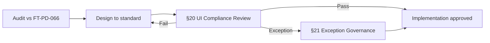
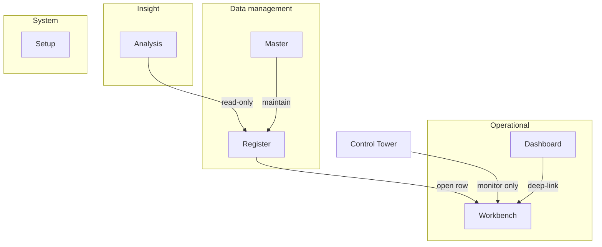

# FT ERP UI/UX Design System

| Field | Value |
|-------|-------|
| **Document ID** | FT-PD-066 |
| **Initiative** | FT-PD-090 — UI/UX Design System v1.0 program |
| **Volume** | 6 — UI & Experience Architecture |
| **Chapter** | 7 — FT ERP UI/UX Design System |
| **Title** | FT ERP UI/UX Design System |
| **Version** | 1.0.2 |
| **Status** | Draft — Final Architecture Review |
| **Effective date** | 2026-07-03 |
| **Author** | FT ERP Product Team |
| **Owner** | FT ERP Product Architecture |
| **Audience** | Product, UX architects, implementation partners, domain authors, QA, engineering leads |
| **Classification** | Product — UI & Experience Architecture (**Mandatory Architectural Standard**) |

**Parent documents:**

- [Volume 0 — Product Vision & Strategy](../00_Product_Vision_and_Strategy/Volume_0_Product_Vision_and_Strategy.md)
- [Volume 1, Ch. 4 — Product Design Principles](../01_Product_Foundation/Chapter_04_FT_ERP_Product_Design_Principles.md) (FT-PD-014)
- [Volume 2, Ch. 5 — Document Ownership & Responsibility Matrix](../02_Business_Architecture/Chapter_05_Document_Ownership_and_Responsibility_Matrix.md) (FT-PD-024)
- [Volume 4, Ch. 1 — Workflow Engine & Pending Actions](../04_Workflow_Engine/Chapter_01_Workflow_Engine_Overview_and_Pending_Actions_Contract.md) (FT-PD-040)
- [Volume 6, Ch. 1–6 — Surface Architecture](./README.md) (FT-PD-060 – FT-PD-065)

**Authority:** This document is the **single source of truth** and **mandatory architectural standard** for visual, interaction, and layout requirements across every existing and future FT ERP screen. It **implements** [Design Principles](../01_Product_Foundation/Chapter_04_FT_ERP_Product_Design_Principles.md) and **operationalizes** Volume 6 surface chapters without duplicating workflow or domain rules.

> **Note on initiative ID:** Corpus ID **FT-PD-066** (Volume 6, Chapter 7). Initiative tracking code **FT-PD-090** refers to this design-system program. **FT-PD-090** in the Architecture Map remains assigned to [Deployment Architecture](../09_Deployment_and_Operations_Architecture/Chapter_01_Deployment_and_Release_Architecture.md).

---

## 1. Document Control

| Version | Date | Author | Summary |
|---------|------|--------|---------|
| 1.0.0 | 2026-07-03 | FT ERP Product Team | Initial FT ERP UI/UX Design System — mandatory standard for all UI development |
| 1.0.1 | 2026-07-03 | FT ERP Product Team | Final Architecture Review — normative language, anti-patterns, compliance review, exception governance, redesign order |
| 1.0.2 | 2026-07-09 | FT ERP Product Team | §14.2 — single primary Back; Analysis → Reports; Dashboard / Masters / Module matrix |

**Supersedes:** Ad hoc screen conventions; informal spacing and button patterns not recorded in product documentation.

**Change authority:** Product Architecture and UX Lead. Material changes to page taxonomy, Workbench standard, anti-patterns, or compliance gates require MINOR version increment and Volume 6 chapter alignment review.

**Mandatory compliance:** Every new screen, redesign, and major enhancement **SHALL** satisfy §19 (Compliance Checklist) and **SHALL** pass §20 (UI Compliance Review) before implementation is approved.

**Out of scope:** Implementation frameworks, component libraries, CSS tokens, APIs, database schema, per-field domain specifications.

---

## 2. Purpose

Business workflows in FT ERP are now largely stable. Before redesigning Requirement Sheet, Monthly Planning, RM Control Center, Production, Dispatch, Reports, and other operational surfaces, the product **SHALL** apply **one enterprise UI standard**.

This document defines that standard as **architecture law** for all UI work. It addresses current product defects:

- Inconsistent layouts across modules
- Excessive vertical scrolling on operational pages
- Duplicate actions (same transition offered in Dashboard, list, and detail)
- Different spacing, density, and interaction patterns between teams
- Unclear separation between navigation, execution, and monitoring

This is an **architectural design standard**, not a frontend framework guide. It is **technology-independent** and **SHALL** apply regardless of implementation stack.

**No screen MAY ship** without compliance to this document except under §21 (Exception Governance).

---

## 3. Scope

### 3.1 In scope

- Normative language and mandatory audit gate (§3.4–§4)
- Design philosophy and UI principles (§5–6)
- Prohibited UI anti-patterns (§7)
- Page classification taxonomy (§8)
- Standard layout architecture per page type (§9)
- Workbench and Dashboard standards (§10–11)
- Table, form, navigation, and button standards (§12–15)
- Visual language (§16)
- Reports standard (§17)
- Accessibility and performance requirements (§18)
- Compliance checklist (§19)
- UI Compliance Review process (§20)
- Exception Governance (§21)
- Redesign order (§22)

### 3.2 Out of scope

- Workflow Engine rules ([FT-PD-040](../04_Workflow_Engine/Chapter_01_Workflow_Engine_Overview_and_Pending_Actions_Contract.md))
- Domain field validation ([Volume 3](../03_Domain_Specifications/README.md))
- Control Tower row catalog ([FT-PD-062](./Chapter_03_Control_Tower_Architecture_and_Factory_Monitoring.md))
- Security and authorization ([FT-PD-070](../07_Security_and_Governance_Architecture/Chapter_01_Security_Authorization_and_Governance_Architecture.md))
- Implementation code, markup, or styling technology

### 3.3 Relationship with Volume 6 surface chapters

| Volume 6 chapter | ID | This document |
|------------------|-----|---------------|
| UI Architecture & Navigation | FT-PD-060 | Extends §6, §14 |
| Dashboard Architecture | FT-PD-061 | Extends §11 |
| Control Tower | FT-PD-062 | Monitoring patterns in §6, §11 |
| Workspace Architecture | FT-PD-063 | Workbench standard §10 implements WSP patterns |
| Registers & Masters | FT-PD-064 | Page types Register, Master §8–§9 |
| Reports | FT-PD-065 | Reports standard §17 |

**Rule:** Where this document and a Volume 6 chapter conflict on **layout or interaction**, this document **SHALL** govern **visual and UX consistency**. Where they conflict on **workflow ownership or engine behavior**, the Workflow Engine and domain specifications **SHALL** govern.

### 3.4 Normative language

Terms in this document **SHALL** be interpreted as follows (aligned with [Constitution](../01_Product_Foundation/Chapter_02_FT_ERP_Constitution.md) convention):

| Term | Meaning |
|------|---------|
| **SHALL** / **MUST** | Mandatory requirement — non-compliance is a defect |
| **SHALL NOT** / **MUST NOT** | Mandatory prohibition |
| **SHOULD** | Strong recommendation — deviation requires §21 exception |
| **SHOULD NOT** | Strong discouragement — deviation requires §21 exception |
| **MAY** | Optional — no compliance obligation |

Advisory phrases (“prefer”, “recommended”, “ideally”) in v1.0.0 **SHALL** be read as **SHOULD** unless explicitly marked **MAY**.

---

## 4. Mandatory UI Task Gate

Every future UI task — new screen, redesign, major enhancement, or bug fix that materially changes layout or interaction — **SHALL** begin with:

> **Audit the screen against FT-PD-066 before redesign.**

### 4.1 Audit minimum

The audit **SHALL** record:

1. Declared **page type** (§8)
2. Current violations of **§7 Anti-Patterns**
3. Gap analysis against **§9–§18** for that page type
4. Workflow and **role ownership** alignment ([FT-PD-024](../02_Business_Architecture/Chapter_05_Document_Ownership_and_Responsibility_Matrix.md), [FT-PD-040](../04_Workflow_Engine/Chapter_01_Workflow_Engine_Overview_and_Pending_Actions_Contract.md))
5. Whether **§21 Exception** is required

### 4.2 Gate sequence



No implementation **SHALL** be approved until the audit artifact and §20 review record exist.

---

## 5. Design Philosophy

FT ERP serves manufacturing operators who work under time pressure, with gloves, barcode scanners, and shift handovers. The design system **SHALL** reflect that reality.

### 5.1 Manufacturing-first

- Surfaces **SHALL** optimize for **shop-floor and store-floor** tasks: issue material, record production, inspect quality, dispatch FG.
- **Document continuity** (Sales Order → Requirement Sheet → Work Order → Production → QA → Dispatch) **SHALL** take precedence over decorative layout.
- **Quantities, units, locations, and document numbers** **SHALL** appear before narrative text.
- Designs that work in demo but fail during a busy production shift **SHALL NOT** be approved.

*Implements [Design Principles §5.2](../01_Product_Foundation/Chapter_04_FT_ERP_Product_Design_Principles.md).*

### 5.2 Desktop-first

- Primary target **SHALL** be **1920×1080 and 1366×768** landscape monitors at store desks, planning offices, and QA stations.
- Layouts **SHALL** assume **mouse and keyboard**; touch **MAY** be supported as secondary.
- Critical actions **SHALL** remain reachable without horizontal scrolling on minimum supported width.
- Mobile or tablet layouts **MAY** exist as progressive adaptations; they **SHALL NOT** define the baseline.

### 5.3 Keyboard-first

- Every operational Workbench **SHALL** support **Tab order**, **Enter to confirm**, **Escape to cancel**, and **arrow-key grid navigation** where applicable.
- Recurring tasks **SHALL** be completable without repeated pointer travel.
- Keyboard shortcuts **SHALL** be consistent across Workbenches (§10.7); module-specific shortcuts **SHALL** be documented on-screen.

### 5.4 High information density

- Operational surfaces **SHALL** show **more rows and fields per viewport** than consumer SaaS norms.
- Compact row height, tight vertical rhythm, and purposeful white space **SHALL** be used — not empty padding.
- Density **SHALL** remain legible: minimum read/touch targets for primary actions **MUST NOT** be sacrificed.

### 5.5 Minimal scrolling

- **Above-the-fold** **SHALL** contain: page title, primary context (document number, status), summary strip or KPIs, and the primary action or grid header.
- Scrolling **SHALL** be reserved for **detail expansion**, not for locating the Save button.
- Sticky headers, frozen columns, and split views **SHALL** be used to reduce scroll distance (§10).

### 5.6 One-screen workflow where possible

- Discrete operator tasks **SHOULD** complete on **one screen** (confirm issue qty, approve requisition line, post GRN line).
- Multi-step flows **SHALL** use **visible progress** within one page before multi-page wizards.
- Wizards **SHALL** be reserved for **infrequent setup** (Master creation, complex configuration), not daily execution.

### 5.7 Premium enterprise ERP appearance

- Visual tone **SHALL** be **confident, restrained, industrial** — not startup playful, not legacy gray overload.
- Consistent elevation, borders, and typography **SHALL** signal trust and seriousness.
- Status and exceptions **SHALL** use **controlled color**; neutral chrome **SHALL** dominate.

### 5.8 Consistency before creativity

- Standard page types, toolbars, and button tiers **SHALL** be reused before inventing module-specific patterns.
- Creative deviation **SHALL NOT** occur without §21 Exception Governance.
- Modules **SHALL NOT** feel like separate products.

---

## 6. UI Principles

These principles govern **how** surfaces behave. They complement §5 (why).

### 6.1 Action vs Navigation vs Monitoring separation

| Mode | Purpose | Allowed controls | Forbidden |
|------|---------|------------------|-----------|
| **Action** | Execute workflow transition | Save, Submit, Approve, Issue, Post — engine-backed | Read-only KPIs as primary focus |
| **Navigation** | Move between contexts | Open, View, Go to, breadcrumbs, tabs | Hidden side effects |
| **Monitoring** | Observe factory state | Refresh, filter, export, deep-link to owner | Duplicate execution buttons |

- **Dashboard** **SHALL** be Navigation + light Action entry (deep-link to Workbench only).
- **Workbench** **SHALL** be Action primary.
- **Control Tower** **SHALL** be Monitoring primary ([FT-PD-062](./Chapter_03_Control_Tower_Architecture_and_Factory_Monitoring.md)).
- **Reports** **SHALL** be Monitoring only (§17).

*Implements [Design Principles §5.5](../01_Product_Foundation/Chapter_04_FT_ERP_Product_Design_Principles.md).*

### 6.2 Progressive disclosure

- Surfaces **SHALL** show **summary first**, detail on demand (expand row, context panel, secondary tab).
- Fields irrelevant to current workflow state or role **SHALL NOT** display by default.
- Advanced filters, audit history, and technical identifiers **SHALL** sit behind explicit affordances (“More filters”, “History”, “Technical details”).

### 6.3 Context preservation

- Deep links **SHALL** carry **document identity**, **cycle**, **return path**, and **Pending Action correlation** where applicable ([FT-PD-063 §8](./Chapter_04_Workspace_Architecture_and_Document_Execution_Surfaces.md)).
- Back navigation **SHALL** return to **origin surface** (Dashboard, Register, Control Tower), not generic home.
- Split views **SHALL** retain **list selection** when detail panel updates.

### 6.4 Reduce clicks

- Default filters **SHALL** target **my work**, **open items**, **today's queue**.
- Sensible rows **SHOULD** be pre-selected (single pending line, current cycle).
- Batch confirm **MAY** be used where business rules allow; irreversible batch actions **SHALL NOT** proceed without review screen.

### 6.5 Reduce vertical scrolling

- Introductory chrome **SHALL NOT** exceed **two compact bands** (header + summary/toolbar) before main content.
- **Horizontal summary strips** **SHALL** be used instead of stacked hero cards.
- Completed sections in long Workbench forms **SHOULD** collapse automatically.

### 6.6 Fast operator workflow

- Save feedback **SHALL** be immediate; blocking spinner **SHALL** be used only when unavoidable.
- Inline validation **SHALL** occur on blur; submit **SHALL NOT** proceed until resolved.
- Success state **SHALL** show **next recommended action** and owner when work passes to another role.

---

## 7. UI Anti-Patterns (Prohibited)

The following patterns **SHALL NOT** appear in any FT ERP screen. They **SHALL** be flagged in §4 audit and block §20 approval until removed or excepted under §21.

| # | Anti-pattern | Prohibition | Why prohibited |
|---|--------------|-------------|----------------|
| AP-01 | **Duplicate actions on the same page** | The same workflow transition **SHALL NOT** appear more than once at equal visual weight (e.g. Save in header and footer, or Issue in toolbar and row menu). | Causes mis-clicks, unclear completion state, and bypass of validation order. |
| AP-02 | **Multiple primary CTAs** | More than one **Primary**-tier button per context region **SHALL NOT** exist (§15). | Operators cannot identify authoritative action; violates engine single-transition clarity. |
| AP-03 | **Excessive vertical scrolling** | Primary grid or form **SHALL NOT** start below three chrome bands; Save/Submit **SHALL NOT** require scroll on default viewport (§5.5). | Slows shift work; hides blocking validation and status. |
| AP-04 | **Nested cards inside cards** | Visual card-within-card stacking **SHALL NOT** exceed one level on operational pages. | Wastes viewport; creates ambiguous boundaries and inconsistent padding. |
| AP-05 | **Empty workspaces with active action buttons** | Primary/Secondary execution buttons **SHALL NOT** be enabled when no document context or zero eligible lines exist. | Invites invalid engine calls and support incidents. |
| AP-06 | **Mixed ownership actions** | Actions owned by another role **SHALL NOT** appear as executable on the current role's surface ([FT-PD-024](../02_Business_Architecture/Chapter_05_Document_Ownership_and_Responsibility_Matrix.md)). | Violates Constitution role separation; creates false completion. |
| AP-07 | **Hidden primary actions** | Primary action **SHALL NOT** live only in overflow menu, kebab, or off-screen scroll. | Violates keyboard-first and reduce-clicks principles; increases training burden. |
| AP-08 | **Inconsistent button placement** | Primary/Cancel placement **SHALL NOT** deviate from §15.3 for the declared page type. | Muscle memory breaks across modules; increases error rate. |
| AP-09 | **Avoidable horizontal scrolling** | Full-page horizontal scroll **SHALL NOT** be used where frozen columns + column picker can contain grid (§10.6, §12.8). | Hides identifiers; unusable with barcode focus workflows. |
| AP-10 | **Modal chains** | More than one sequential modal **SHALL NOT** be required to complete a single atomic operator task. | Disorienting; breaks context preservation and keyboard flow. |
| AP-11 | **Card layouts for high-volume operational data entry** | Line-level operational entry (≥ 8 rows typical) **SHALL NOT** use stacked card-per-row instead of grid (§10.1). | Low density; excessive scroll; poor keyboard navigation. |
| AP-12 | **Inconsistent filter placement** | Search and filters **SHALL NOT** appear in header on one Register and sidebar on another of the same page type. | Operators lose scan path; training cost multiplies. |
| AP-13 | **Different page layouts for the same page type** | Two Workbenches (or two Registers) of the same classification **SHALL NOT** use incompatible region order or missing required bands (§9). | FT ERP must feel like one product; §5.8 violated. |

**Enforcement:** QA **SHALL** include anti-pattern checks in regression scenarios. Code review **SHALL NOT** approve UI changes that introduce AP-* without §21 record.

---

## 8. Page Classification

Every FT ERP screen **SHALL** classify as exactly **one** primary page type. Hybrid pages **SHALL** declare a **primary** type and optional **secondary** panels (e.g. Workbench with embedded summary strip).



### 8.1 Dashboard

| Attribute | Definition |
|-----------|------------|
| **Purpose** | Answer *What must I do today?* for the logged-in role |
| **Primary question** | My Work |
| **Data source** | Pending Actions, role queues, Read Models ([FT-PD-061](./Chapter_02_Dashboard_Architecture_and_Widget_Standards.md)) |
| **Execution** | **SHALL NOT** execute workflow transitions; deep-link to Workbench only |
| **Examples** | Store Dashboard, Production Dashboard, Purchase Dashboard, QA Dashboard |

### 8.2 Workbench

| Attribute | Definition |
|-----------|------------|
| **Purpose** | Answer *How do I complete this step?* — document execution |
| **Primary question** | Do Work |
| **Data source** | Transactional documents + engine `getAvailableActions` |
| **Execution** | **SHALL** execute workflow transitions — sole authoritative execution surface |
| **Examples** | Requirement Sheet workspace, RM Control Center, Material Issue, Production entry, GRN execution, Dispatch |

*Default for all operational redesigns (§10, §22).*

### 8.3 Master

| Attribute | Definition |
|-----------|------------|
| **Purpose** | Create and maintain **reference business data** with full field sets |
| **Primary question** | Maintain business data |
| **Execution** | CRUD on master entities; **SHALL NOT** execute production workflow transitions |
| **Examples** | Item master, Customer master, Supplier master, Location master, BOM header |

### 8.4 Register

| Attribute | Definition |
|-----------|------------|
| **Purpose** | **Find and open** transactional or historical documents |
| **Primary question** | Find work |
| **Execution** | Open, filter, export; transitions **SHALL** occur only via linked Workbench |
| **Examples** | Sales Order register, Work Order list, Purchase Order register, Stock movement ledger browse |

*See [FT-PD-064](./Chapter_05_Registers_Masters_and_Browse_Surfaces.md).*

### 8.5 Analysis

| Attribute | Definition |
|-----------|------------|
| **Purpose** | Explore trends, variances, and aggregates **without** posting transactions |
| **Primary question** | Understand performance |
| **Execution** | **Read-only**; drill-through to Register or Workbench |
| **Examples** | Production variance analysis, RM consumption analysis, planning adherence views |

### 8.6 Setup

| Attribute | Definition |
|-----------|------------|
| **Purpose** | System, organization, and policy configuration |
| **Primary question** | Configure the system |
| **Execution** | Admin-governed settings; audit trail **SHALL** be recorded |
| **Examples** | Role permissions, document numbering, feature flags, integration endpoints |

---

## 9. Standard Layout Architecture

Each page type **SHALL** use the **defined vertical structure** below. Regions **MAY** merge visually but **SHALL NOT** omit required functional bands.

### 9.1 Universal regions

| Region | Responsibility | Sticky |
|--------|----------------|--------|
| **Header** | Title, document identity, status badge, breadcrumb | **SHALL** |
| **Summary strip** | KPIs, totals, stage indicator, critical alerts | **SHOULD** (optional sticky) |
| **Toolbar** | Filters, search, view toggles, secondary actions | **SHALL** (Workbench, Register) |
| **Main content** | Grid, form body, split panes | Scrollable |
| **Side / context panel** | Detail, timeline, related documents | Independent scroll |
| **Footer / action area** | Primary Save, Submit, Approve, Cancel | **SHALL** (Workbench) |

### 9.2 Dashboard layout

```
┌─────────────────────────────────────────────────────────────┐
│ HEADER — Role workspace title, date/shift context (optional)│
├─────────────────────────────────────────────────────────────┤
│ SUMMARY STRIP — KPI segments (compact, horizontal)          │
├─────────────────────────────────────────────────────────────┤
│ QUICK ACTIONS — role shortcuts (tertiary tier)              │
├─────────────────────────────────────────────────────────────┤
│ PENDING WORK — cards / compact list (owned actions only)    │
├─────────────────────────────────────────────────────────────┤
│ MONITORING WIDGETS — optional read-only factory hints       │
│ (SHALL NOT duplicate Control Tower ownership)               │
└─────────────────────────────────────────────────────────────┘
```

*Detail: [§11](#11-dashboard-standard), [FT-PD-061](./Chapter_02_Dashboard_Architecture_and_Widget_Standards.md).*

### 9.3 Workbench layout

```
┌─────────────────────────────────────────────────────────────┐
│ HEADER — Doc no, customer/item, workflow status, breadcrumb │
├─────────────────────────────────────────────────────────────┤
│ SUMMARY STRIP — qty totals, stage, blocking reason (if any) │
├─────────────────────────────────────────────────────────────┤
│ TOOLBAR — filter lines, add row, bulk select, view density  │
├──────────────────────────────┬──────────────────────────────┤
│ MAIN — grid or form sections │ CONTEXT PANEL (optional)     │
│                              │ related docs, audit, help    │
├──────────────────────────────┴──────────────────────────────┤
│ FOOTER — Primary action left-aligned; Cancel right          │
└─────────────────────────────────────────────────────────────┘
```

*Detail: [§10](#10-workbench-standard).*

### 9.4 Master layout

```
┌─────────────────────────────────────────────────────────────┐
│ HEADER — Master name, active/inactive status                │
├─────────────────────────────────────────────────────────────┤
│ TOOLBAR — Search list (if list+detail), New, Import (if any)│
├──────────────────────────────┬──────────────────────────────┤
│ LIST (optional)              │ FORM — grouped sections      │
├──────────────────────────────┴──────────────────────────────┤
│ FOOTER — Save, Cancel                                       │
└─────────────────────────────────────────────────────────────┘
```

### 9.5 Register layout

```
┌─────────────────────────────────────────────────────────────┐
│ HEADER — Register title, result count                       │
├─────────────────────────────────────────────────────────────┤
│ TOOLBAR — Search, filters, column picker, export            │
├─────────────────────────────────────────────────────────────┤
│ MAIN — data grid (primary scroll)                           │
├─────────────────────────────────────────────────────────────┤
│ FOOTER — pagination; bulk open (optional)                   │
└─────────────────────────────────────────────────────────────┘
```

### 9.6 Analysis layout

```
┌─────────────────────────────────────────────────────────────┐
│ HEADER — Analysis title, period, scope                      │
├─────────────────────────────────────────────────────────────┤
│ TOOLBAR — Parameters, run/refresh, export                   │
├─────────────────────────────────────────────────────────────┤
│ MAIN — chart/table hybrid; drill-through links              │
└─────────────────────────────────────────────────────────────┘
```

### 9.7 Setup layout

```
┌─────────────────────────────────────────────────────────────┐
│ HEADER — Setup area, environment badge (prod/test)          │
├─────────────────────────────────────────────────────────────┤
│ MAIN — grouped settings, confirmation for destructive       │
├─────────────────────────────────────────────────────────────┤
│ FOOTER — Apply, Revert                                      │
└─────────────────────────────────────────────────────────────┘
```

---

## 10. Workbench Standard

The Workbench **SHALL** be the **default pattern** for Requirement Sheet, Monthly Planning, RM Control Center, Production, Dispatch, Procurement execution, and all operational redesigns in §22.

### 10.1 Grid-first layout

- Line-level work **SHALL** display in a **grid** as the primary canvas.
- Header-level attributes **SHALL** occupy **one compact band** above the grid.
- Long prose notes **SHALL** use **collapsed panels**, not inline essay fields above the grid.

### 10.2 Split view philosophy

| Pattern | When to use |
|---------|-------------|
| **List + detail panel** | Register-style browse inside Workbench (multi-line selection) |
| **Grid + context panel** | Related stock, reservations, or document chain |
| **Full-width grid** | Single-document line editing (Material Issue, GRN lines) |

- Split ratio default **SHALL** be **65% grid / 35% context**; user-resizable **MAY** be supported.
- Closing context panel **SHALL NOT** clear unsaved grid edits without confirmation.

### 10.3 Detail / context panel

- Panel **SHALL** show **read-only** related data by default (stock buckets, WO status, audit snippet).
- Editable context **MAY** appear only when line-level edits are logically tied (e.g. select batch).
- Panel title **SHALL** state what is shown (“RM availability — Item X at Location Y”).

### 10.4 Inline editing

- **Inline grid editors** **SHALL** be used for qty, date, location, and UOM on operational lines.
- Enter **SHALL** commit cell; Esc **SHALL** revert cell.
- Row-level Save **SHALL NOT** be used; page-level Save **SHALL** commit all dirty rows.

### 10.5 Sticky headers

- Grid column headers **SHALL** stick below toolbar during vertical scroll.
- Workbench footer action bar **SHALL** stick to viewport bottom.
- Document header band **SHALL** stick above grid (combined height **SHOULD** be ≤ 120px).

### 10.6 Frozen columns

- Leading identifier columns (line no, item code, item name) **SHALL** freeze on wide grids.
- **SHALL NOT** exceed **three** frozen columns.
- Horizontal scroll **SHALL** sync frozen and scrollable regions without layout jump.

### 10.7 Keyboard navigation

| Key | Behavior |
|-----|----------|
| Tab / Shift+Tab | Move across editable fields and primary actions |
| Enter | Commit cell / activate default button when focus on button |
| Esc | Cancel cell edit / close dialog |
| Arrow keys | Move cell focus within grid when grid focused |
| Ctrl+S | Save (where supported; **SHALL NOT** conflict with browser) |

- Focus indicator **SHALL** always be visible for keyboard users.

### 10.8 Density rules

| Tier | Row height (target) | Use |
|------|---------------------|-----|
| **Compact** | 32–36px | **SHALL** be default for operational grids |
| **Standard** | 40–44px | Masters, infrequent edits |
| **Comfortable** | 48px+ | Setup, long text fields only |

- Numeric columns **SHALL** right-align; identifiers **SHALL** left-align; status **SHALL** use badge.

### 10.9 Bulk operations

- Bulk select **SHALL** use checkbox column; select all **SHALL** apply to **current filter page** only unless explicit “select all matching filter” with count warning.
- Bulk actions **SHALL** appear in toolbar when selection ≥ 1; destructive bulk **SHALL** require confirmation dialog listing count.
- Engine **SHALL** validate each row; partial success **SHALL** show per-row outcome summary.

### 10.10 Validation placement

| Validation type | Placement |
|-----------------|-----------|
| Field-level | Inline under field or cell tooltip |
| Row-level | Row error icon + message on hover/focus |
| Document-level | Summary strip alert + footer block on submit |
| Engine block | Banner citing rule ID or business reason ([Design Principles §5.4](../01_Product_Foundation/Chapter_04_FT_ERP_Product_Design_Principles.md)) |

- Generic “Something went wrong” without actionable correction **SHALL NOT** be used.
- Blocking validation **SHALL** focus first invalid field on submit attempt.

---

## 11. Dashboard Standard

*Extends [FT-PD-061](./Chapter_02_Dashboard_Architecture_and_Widget_Standards.md).*

### 11.1 KPI strip

- **SHALL** be **horizontal**, single row preferred; wrap to second row **MAY** occur only on narrow viewports.
- Each segment **SHALL** show label + value + optional link to Register/Analysis.
- Values **SHALL** use **semantic tone** (neutral, warning, critical) — not decorative color.
- **SHALL NOT** exceed **six** KPI segments per strip; overflow **SHALL** move to Analysis.

### 11.2 Pending work

- Primary dashboard content **SHALL** be **Pending Actions** and role queue rows owned by logged-in user.
- Display **SHALL** use **compact cards** or **dense list** — **SHALL NOT** use full Workbench grids.
- Each item **SHALL** include document no, customer/item, qty metric, **one** primary CTA, age indicator.
- **SHALL NOT** exceed **six** visible pending items per card; “View all” **SHALL** link to Register or Control Tower filter.

### 11.3 Current stage

- Optional strip **MAY** show where the role's active documents sit in pipeline.
- Stage indicators **SHALL** be **informational**; transitions **SHALL** occur only in Workbench.

### 11.4 Quick actions

- **SHALL** use **Tertiary** tier for frequent navigation (Open RMCC, Open Dispatch, GRN Workspace).
- Quick actions **SHALL** navigate; they **SHALL NOT** post transactions except where engine exposes a single safe shortcut (rare; **SHALL** require §21 approval).

### 11.5 Monitoring widgets

- **Read-only** factory hints **MAY** appear when they **SHALL NOT** duplicate Control Tower ([FT-PD-062](./Chapter_03_Control_Tower_Architecture_and_Factory_Monitoring.md)).
- Example: FG stock total, dispatch backlog count — **SHALL NOT** include cross-role execution.

### 11.6 Factory health vs My Work separation

| Zone | Content | Source |
|------|---------|--------|
| **My Work** | Pending Actions, owned queues, role KPIs tied to actions | Pending Actions API, role filters |
| **Factory health** (optional) | Informational metrics, backlog previews | Read Models; read-only |

- Another role's executable work **SHALL NOT** appear on a role Dashboard (AP-06).
- Admin Dashboard **MAY monitor** Store-owned RS creation; Store Dashboard **SHALL execute** it.

---

## 12. Table Standards

Applies to Register, Workbench grids, Dashboard lists, Control Tower tables, and Reports.

### 12.1 Column behavior

- **Identifier columns first** (doc no, item code, line no).
- **Status** as badge column near identifiers.
- **Quantities** grouped with UOM visible in header or cell.
- **Actions column last** — single “Open” link; **SHALL NOT** use multiple competing links per row.

### 12.2 Sorting

- Default sort **SHALL** match **operational priority** (oldest pending first, or domain-defined).
- User sort **SHOULD** persist per session for Register; Workbench line grids **SHALL** use **document-defined order** unless user overrides.
- Sort indicator **SHALL** appear on column header; tri-state: none / asc / desc.

### 12.3 Filtering

- **Toolbar filters** **SHALL** be used for common dimensions (status, date range, location, owner) — consistent placement (AP-12).
- Filter chips **SHALL** show active filter summary; one click **SHALL** clear all.
- Advanced filters **SHALL** sit behind explicit control; mandatory filters **SHALL NOT** be hidden.

### 12.4 Search

- **One** search box per Register **SHALL** search doc no, customer, item — scope **SHALL** be documented in placeholder.
- Search **SHOULD** debounce; minimum two characters for wide indexes unless exact doc no.
- Empty search **SHALL** restore default view.

### 12.5 Pagination

- Default page size **SHALL** be **25** (Register), **50** (Analysis export preview).
- Range **SHALL** display (“1–25 of 340”) with page controls.
- **Infinite scroll SHALL NOT** be used on operational Registers (AP-03, disorientation).

### 12.6 Compact row height

- Default **SHALL** be **Compact** tier (§10.8).
- Row hover **SHALL** highlight; selected row **SHALL** be distinct from hover.

### 12.7 Density

- User density toggle (Compact / Standard) **MAY** exist on Register; Workbench operational grids **SHALL** remain Compact unless Master-style editing.

### 12.8 Responsive width

- Minimum supported content width **SHALL** be **1280px** for Workbench.
- Below minimum: horizontal scroll on grid **with frozen identifiers** **SHALL** be used — **SHALL NOT** reflow to hide columns without discovery (AP-09).

### 12.9 Empty state

- **Inline** empty state **SHALL** appear in grid region: icon + title + one sentence + primary action (“Create first …”, “Clear filters”).
- Blank white grid without explanation **SHALL NOT** be used (AP-05).

---

## 13. Form Standards

### 13.1 Labels

- **Sentence case** labels above fields (**SHALL NOT** use ALL CAPS).
- Units in label or suffix (“Qty (PCS)”, “Rate (₹/PCS)”).
- Tooltips **SHOULD** explain non-obvious domain terms; **MAY** link to Glossary term.

### 13.2 Required fields

- Required fields **SHALL** use one global convention (asterisk or “Required” legend).
- Optional fields **SHALL NOT** carry required marker.

### 13.3 Validation

- Inline validation **SHALL** occur on blur; summary **SHALL** appear on submit.
- Async validation **SHALL** show pending state on field.
- Server errors **SHALL** map to field when possible; else document banner.

### 13.4 Grouping

- Fields **SHALL** group into logical sections with section headers (Commercial, Logistics, Lines, Audit).
- **SHOULD NOT** exceed **eight** fields per row group on desktop; low-priority groups **SHOULD** collapse.
- Related toggles and dependent fields **SHALL** be adjacent.

### 13.5 Dialog usage

| Use dialog | Use full page / panel |
|------------|----------------------|
| Confirm destructive action | Document creation |
| Short prompt (reason, single field) | Multi-line grid editing |
| Pick from search (< 20 results typical) | Workflow with > 3 fields |

- Dialogs **SHALL** trap focus; Esc **SHALL** close non-destructive cancel path only.
- Modal chains **SHALL NOT** be used (AP-10).

### 13.6 Inline editing vs modal editing

| Inline | Modal |
|--------|-------|
| Grid line qty, date, location | Create new master record |
| Toggle boolean flags | Multi-step allocation wizard |
| Single-select from short list | Complex BOM component picker |

---

## 14. Navigation Standards

*Aligns with [FT-PD-060 §7](./Chapter_01_UI_Architecture_Navigation_and_Experience_Principles.md).*

### 14.1 Breadcrumbs

- Format **SHALL** be: `Home → Module → Register → Document` (omit redundant levels).
- Current page **SHALL NOT** be linked; ancestors **SHALL** be linked.
- Breadcrumbs **SHALL NOT** replace Back for wizard exit.

### 14.2 Back navigation

- **Back** **SHALL** return to `returnTo` / origin surface (Dashboard, Register, Control Tower, Reports).
- Browser back **SHOULD** be supported via preserved history state.
- Unsaved changes **SHALL** prompt confirmation before navigate away.
- Each page **SHALL** expose **exactly one** primary Back control (FT-PD-066 tertiary tier). Duplicate Back links **SHALL NOT** appear.

| Surface | Primary Back label | Destination |
|---------|-------------------|-------------|
| **Analysis / Report** | Back to Reports | `/reports` |
| **Dashboard workspace** (opened from Dashboard) | Back to Dashboard | `/dashboard` |
| **Master** | Back to Masters | Masters module entry / prior master list |
| **Register** | Back to Module | Owning module register or workspace |

**Analysis reports:** Use `ReportPageHeader` only (includes the Back strip). Do **not** also render `StickyReportBackStrip`. Dual-entry surfaces (e.g. RM Shortage, QC Report, Stock Overview) **MAY** resolve Dashboard vs Reports vs Module from `from` / `source` query params via `useAnalysisReportBack`.

### 14.3 Workflow trail

- Workbench **SHOULD** show **continuity strip** for document chain (SO → RS → WO → …) where applicable ([FT-PD-063](./Chapter_04_Workspace_Architecture_and_Document_Execution_Surfaces.md)).
- Stages **SHALL** be read-only in strip; click **SHALL** navigate to that document's Workbench if user has access.

### 14.4 Deep links

- URLs **SHALL** encode **document id**, **cycle**, **intent** (view/add/edit), **source** (dashboard, pending-actions, control-tower).
- Deep link landing **SHALL** validate role; denial page **SHALL** name owning role.

### 14.5 Page transitions

- Transitions **SHALL** preserve context (scroll position on Register return **MAY** be preserved).
- Full-page flash reloads **SHOULD NOT** be used for in-app navigation.
- Loading indicator **SHALL** use skeleton for main content region, not whole-app block except auth.

---

## 15. Button Standards

### 15.1 Tier definitions

| Tier | Visual weight | Use |
|------|---------------|-----|
| **Primary** | Highest emphasis | **One** per context: Save, Submit, Approve, Post, Issue |
| **Secondary** | Outlined or muted fill | Save draft, Add line, Export, Filter apply |
| **Tertiary** | Text or ghost | Cancel, Back, View details, quick nav |
| **Destructive** | Danger semantic | Delete, Reject, Cancel document, Reverse |

### 15.2 Semantic action names

| Action | Label convention | Notes |
|--------|------------------|-------|
| **Save** | Save / Save draft | Persists without workflow transition |
| **Submit** | Submit / Send for approval | Triggers engine transition |
| **Approve** | Approve / Confirm | Authority-gated |
| **Cancel** | Cancel | Discards unsaved or closes dialog — **SHALL NOT** be ambiguous with Cancel document |

Domain-accurate verbs **SHALL** come from [Glossary](../01_Product_Foundation/Chapter_03_FT_ERP_Glossary_and_Standard_Terminology.md) (Issue, Dispatch, Lock RS, Place WO).

### 15.3 Placement consistency

| Page type | Primary | Secondary | Tertiary / Cancel |
|-----------|---------|-------------|-------------------|
| Workbench | Footer **left** | Toolbar or footer | Footer **right** |
| Master | Footer left | Toolbar | Footer right |
| Dialog | Footer right (primary rightmost in LTR) | Left of primary | Left edge |
| Dashboard card | Card action area **right** | — | — |

- **One primary** button per footer/dialog (**SHALL NOT** violate AP-02).
- Disabled primary **SHALL** show tooltip reason (permission, validation, engine block).

---

## 16. Visual Standards

Technology-independent tokens described **semantically**. Implementation maps these to concrete values in a separate style guide (out of scope).

### 16.1 Typography

| Level | Use |
|-------|-----|
| **Page title** | One per page; identifies screen and primary document |
| **Section title** | Form groups, card headers |
| **Body** | Field values, grid cells |
| **Caption** | Hints, timestamps, secondary metadata |
| **Monospace** | Document numbers, codes in dense tables (optional) |

- Minimum body size **SHALL** be **12px equivalent** at 100% zoom for operational grids.
- Numeric columns **SHALL** use tabular figures.

### 16.2 Colors

| Role | Application |
|------|-------------|
| **Neutral chrome** | Backgrounds, borders, default text |
| **Brand primary** | Primary buttons, active nav |
| **Semantic success** | Completed, posted, locked OK |
| **Semantic warning** | Pending, approaching limit |
| **Semantic critical** | Blocked, rejected, shortage |
| **Semantic info** | Informational banners |

- Status **SHALL NOT** be conveyed by **color alone** — text or icon **SHALL** accompany.
- Critical red **SHALL** be reserved for blocks and destructive actions.

### 16.3 Status badges

- Pill or compact badge **SHALL** show **status label** + optional icon.
- Colors **SHALL** map to workflow states consistently across modules.
- Badge text **SHALL** match engine state name or approved display alias from domain spec.

### 16.4 Icons

- **Outline style** for navigation and toolbar; filled **MAY** be used for critical alert only.
- Infrequent actions **SHALL** use icon + label; icon-only **SHALL** require tooltip and universal meaning.
- Module icons **SHALL** be consistent across Dashboard shortcuts and nav.

### 16.5 Cards

- Dashboard and summary cards **SHALL** use **subtle border**, minimal shadow.
- Primary pending work card **SHOULD** use **left accent border** (semantic), not full background fill.
- Card padding **SHALL** be compact (8–12px equivalent).
- Nested cards **SHALL NOT** exceed one level (AP-04).

### 16.6 Shadows and elevation

| Level | Use |
|-------|-----|
| **0** | Flat grids, inline panels |
| **1** | Cards, sticky footer bar |
| **2** | Dialogs, popovers |
| **3** | Modal overlays |

- Heavy shadows **SHOULD NOT** be used.

### 16.7 Borders

- **1px** neutral border between regions.
- Stronger border for **focus ring** and **selected row**.
- Dividers between toolbar and content; **SHOULD NOT** divide every grid row unless zebra aids scan.

### 16.8 Spacing system

Base unit **SHALL** be **4px**. Common steps: 4, 8, 12, 16, 24, 32.

| Context | Spacing |
|---------|---------|
| Between form fields | 8–12 |
| Section gap | 16–24 |
| Page edge padding | 16–24 |
| Grid cell padding | 4–8 horizontal |

### 16.9 White-space usage

- Operational views **SHALL** compress vertical gaps.
- White-space **SHOULD** expand only around destructive confirmations and Setup explanations.
- Horizontal rhythm **SHOULD** align to **8px grid**.

---

## 17. Reports Standard

*Extends [FT-PD-065](./Chapter_06_Reports_and_Analytical_Surfaces.md).*

### 17.1 Printable

- Print preview **SHALL** hide nav, toolbar, and non-essential chrome.
- Page breaks **SHALL NOT** split **table header from body**.
- Header block **SHALL** include company name, report title, parameters, generation timestamp.

### 17.2 Exportable

- Export formats **SHALL** include **PDF, CSV, XLSX** (domain **MAY** restrict).
- Export **SHALL** reflect **current filters**; filename **SHALL** include report id and date.
- Large exports **SHALL** use async job with notification, not browser freeze.

### 17.3 Minimal scrolling

- Parameter band **SHALL** be fixed; results scroll.
- Column headers **SHALL** repeat on each printed page.

### 17.4 Readable tables

- Report tables **SHALL** use **Standard** density minimum (§10.8).
- Subtotals and grand totals **SHALL** be bold; grouped reports **SHALL** indent hierarchy.

### 17.5 Landscape support

- Wide tabular reports **SHOULD** default to **landscape** print orientation.
- Portrait **MAY** be used for narrative or narrow column reports.

### 17.6 Professional print layout

- Charts **SHALL** be monochrome-safe: pattern or label, not color-only series.
- Page numbers, report id, and confidentiality footer **SHALL** appear where required.

**Rule:** Reports **SHALL NOT** execute workflow transitions ([FT-PD-065](./Chapter_06_Reports_and_Analytical_Surfaces.md)).

**Sales Ops ownership:** Customer Tracking is the master lifecycle report; SO→Dispatch Trace is merged into its Production Journey; Dispatch Summary remains analytics + locked register only — see [FT-PD-065 §6.1](./Chapter_06_Reports_and_Analytical_Surfaces.md#61-sales-operations-report-ownership-product-register).

---

## 18. Accessibility & Performance

### 18.1 Loading states

- **Skeleton** placeholders **SHALL** match layout shape.
- Operations > 300ms **SHALL** show progress; > 3s **SHOULD** offer cancel where safe.
- Optimistic UI **MAY** be used only when server **SHALL** reconcile errors visibly.

### 18.2 Empty states

- Surfaces **SHALL** distinguish **no data ever**, **no data for filter**, and **no permission**.
- Each **SHALL** include **next step** appropriate to role.

### 18.3 Error states

- Recoverable field errors **SHALL** be inline.
- Load failure **SHALL** show full-region Retry.
- Session/auth errors **SHALL** route to login with return URL.

### 18.4 Keyboard accessibility

- All interactive controls **SHALL** be focusable and operable via keyboard (§10.7).
- Skip link to main content **SHALL** exist on Dashboard and Register.
- Dialog **SHALL** trap focus; focus **SHALL** restore on close.

### 18.5 Performance expectations

| Surface | Target (interactive) |
|---------|----------------------|
| Dashboard initial load | ≤ 2s on reference hardware |
| Register page turn | ≤ 500ms |
| Workbench save | ≤ 1s perceived; feedback immediate |
| Control Tower refresh | ≤ 3s for default row cap |

- Grids **SHOULD** virtualize when row count > 200.
- Search debounce **SHOULD** be **300ms** default.

*Operational targets align with [FT-PERF-001 Performance Audit](../05_Performance/FT-PERF-001_Performance_Audit_Report.md) where applicable.*

---

## 19. Compliance Checklist

Every new or redesigned page **SHALL** pass this checklist before §20 sign-off. Mark N/A with justification.

### 19.1 Classification & architecture

- [ ] **Page type** declared (§8) and layout regions match type (§9)
- [ ] **Workbench** used for operational execution; Dashboard/Register **SHALL NOT** duplicate transitions (§6.1)
- [ ] **Factory health vs My Work** separated on Dashboards (§11.6)
- [ ] **SHALL NOT** violate §7 Anti-Patterns
- [ ] Aligns with [Design Principles §5.5](../01_Product_Foundation/Chapter_04_FT_ERP_Product_Design_Principles.md) and relevant Volume 6 chapter

### 19.2 Workbench & tables

- [ ] Grid-first where line editing applies (§10.1)
- [ ] Sticky header and footer on Workbench (§10.5)
- [ ] Frozen identifier columns on wide grids (§10.6)
- [ ] Compact density default (§10.8, §12.6)
- [ ] Keyboard navigation documented and tested (§10.7)
- [ ] Validation placement follows §10.10
- [ ] Empty state present (§12.9)

### 19.3 Forms & actions

- [ ] One **primary** action per context (§15.3)
- [ ] Button tiers and placement match §15
- [ ] Dialog vs inline decision recorded (§13.6)
- [ ] Required field convention applied (§13.2)

### 19.4 Navigation & context

- [ ] Breadcrumbs and Back behavior (§14)
- [ ] Deep links preserve document/cycle/source (§14.4)
- [ ] Unsaved-change guard on navigate away (§14.2)

### 19.5 Visual consistency

- [ ] Spacing uses 4px system (§16.8)
- [ ] Status badges use semantic vocabulary (§16.3)
- [ ] **SHALL NOT** use module-specific color semantics conflicting with §16.2

### 19.6 Reports (if applicable)

- [ ] Read-only; no execution controls (§17, [FT-PD-065](./Chapter_06_Reports_and_Analytical_Surfaces.md))
- [ ] Print and export meet §17.1–17.6

### 19.7 Accessibility & performance

- [ ] Loading, empty, and error states defined (§18.1–18.3)
- [ ] Keyboard path complete for primary flow (§18.4)
- [ ] Performance targets acknowledged (§18.5)

### 19.8 Governance

- [ ] §4 audit artifact completed before design
- [ ] §20 UI Compliance Review passed
- [ ] §21 Exception recorded if any deviation
- [ ] QA test cases include density, keyboard, empty/error, and anti-pattern checks

---

## 20. UI Compliance Review

**Mandatory gate:** No page **SHALL** enter implementation without recorded pass of UI Compliance Review.

### 20.1 Timing

- Review **SHALL** occur **after** wireframe or spec aligns with §4 audit and **before** implementation approval.
- Re-review **SHALL** occur when layout, interaction, or ownership changes materially mid-build.

### 20.2 Review dimensions

Every page **SHALL** pass all applicable dimensions:

| Dimension | Authority | Pass criteria |
|-----------|-----------|---------------|
| **Workflow compliance** | Domain owner + Workflow Engineering | Actions map to engine transitions only; no parallel state ([FT-PD-040](../04_Workflow_Engine/Chapter_01_Workflow_Engine_Overview_and_Pending_Actions_Contract.md)) |
| **Role ownership compliance** | Domain owner | Executable controls match [FT-PD-024](../02_Business_Architecture/Chapter_05_Document_Ownership_and_Responsibility_Matrix.md); AP-06 clear |
| **FT-PD-066 layout compliance** | UX Lead | Page type, §9 regions, Workbench/Dashboard standards |
| **Navigation compliance** | UX Lead | §14 deep links, back, breadcrumbs, context preservation |
| **Keyboard usability** | UX Lead + QA | Primary flow completable per §10.7; focus visible |
| **Data-entry efficiency** | Domain owner + UX Lead | Compact density, grid-first, minimal scroll, AP-03/AP-11 clear |
| **Accessibility** | UX Lead + QA | §18 empty/loading/error; keyboard; status not color-only |
| **Print/export compliance** | Domain owner | §17 when Report or export surfaces exist |
| **Performance** | Engineering lead | §18.5 targets acknowledged; no known blocking perf regressions |
| **Consistency with similar pages** | UX Lead | Same page type **SHALL** match sibling screens (AP-13) |

### 20.3 Review record

Each review **SHALL** document:

1. Screen name and page type
2. Audit reference (§4)
3. Reviewer roles and date
4. Pass / Fail per dimension
5. Remediation items or §21 exception ID
6. Approval signature (Product Architecture or delegate)

**Fail** on any dimension **SHALL** block implementation until remediated or excepted.

### 20.4 Review participants

| Role | Participation |
|------|---------------|
| UX / Experience Lead | **SHALL** chair layout, navigation, keyboard, consistency |
| Domain owner | **SHALL** approve workflow and ownership |
| Product Architecture | **SHALL** approve exceptions (§21) |
| QA / Validation | **SHOULD** attend; **SHALL** sign off test coverage |
| Engineering lead | **SHOULD** attend for performance |

---

## 21. Exception Governance

No screen **MAY** deviate from FT-PD-066 unless **all** conditions below are satisfied.

### 21.1 Requirements

| # | Requirement |
|---|-------------|
| E1 | **Business justification** **SHALL** exist — why the standard cannot apply without harming manufacturing operations |
| E2 | **Architecture approval** **SHALL** be recorded (Product Architecture signatory) |
| E3 | **Deviation** **SHALL** be documented: screen, section violated, alternative chosen, expiry or review date |
| E4 | If the exception **MAY** become reusable, the design system **SHALL** be updated in a MINOR version and the exception **SHALL** be retired |

### 21.2 Prohibited exceptions

The following **SHALL NOT** be granted exceptions:

- AP-06 Mixed ownership actions (role violation)
- AP-02 Multiple primary CTAs without engine requirement
- Execution on Dashboard or Report surfaces
- Workflow transitions outside Workbench (except engine-approved safe shortcuts with §21 record)

### 21.3 Exception register

Exceptions **SHALL** be logged in product change control ([Volume 10, Ch. 2 — Feature Governance](../10_Product_Lifecycle_and_Continuous_Evolution/Chapter_02_Feature_Governance_Change_Control_and_Architectural_Decision_Records.md)) with tag `FT-PD-066-EXC`.

---

## 22. Redesign Order

Recommended modernization sequence **SHALL** be followed unless Product Architecture approves reorder with written rationale. Each tranche **SHALL** complete §4 audit, §20 review, and §19 checklist before the next tranche begins.

| Order | Surface | Page type | Rationale |
|-------|---------|-----------|-----------|
| **1** | **Requirement Sheet** | Workbench | Upstream planning anchor; sets grid-first and cycle context patterns for NO_QTY and REGULAR |
| **2** | **Monthly Planning** | Workbench | Freezes procurement intent; depends on RS maturity; high line-volume grid |
| **3** | **RM Control Center** | Workbench | Store allocation hub; split view + context panel reference implementation |
| **4** | **Production Workbench** | Workbench | Shop-floor execution density; keyboard-first critical path |
| **5** | **Dispatch Workbench** | Workbench | FG shipment execution; completes order fulfillment chain |
| **6** | **Analysis** | Analysis | Variance and adherence views consume stabilized operational layouts |
| **7** | **Reports** | Report / Analysis | Print/export standards (§17) after operational grids stable |

**Rule:** Dashboard and Register refactors for each domain **SHOULD** ship in the same tranche as that domain's Workbench so AP-12 and AP-13 do not persist across linked surfaces.

---

## 23. Review Checklist (Document Maintenance)

- [ ] Technology-neutral language throughout
- [ ] Normative terms (SHALL / MUST / MAY) used consistently (§3.4)
- [ ] No implementation framework references
- [ ] Cross-references to FT-PD-014, FT-PD-060 – FT-PD-065 accurate
- [ ] §7 Anti-Patterns complete with rationale
- [ ] §20 UI Compliance Review actionable
- [ ] §21 Exception Governance complete
- [ ] §22 Redesign order recorded
- [ ] §4 mandatory audit gate stated

---

## 24. Change Log

| Version | Date | Author | Summary |
|---------|------|--------|---------|
| 1.0.0 | 2026-07-03 | FT ERP Product Team | Initial FT ERP UI/UX Design System v1.0 (initiative FT-PD-090) |
| 1.0.1 | 2026-07-03 | FT ERP Product Team | Final Architecture Review — normative language, anti-patterns (§7), compliance review (§20), exception governance (§21), redesign order (§22), mandatory audit gate (§4) |

---

## 25. Approval Block

| Role | Name | Signature | Date |
|------|------|-----------|------|
| Product Owner | | | |
| Product Architecture | | | |
| UX / Experience Lead | | | |
| Domain Specification Owners | | | |
| QA / Validation Lead | | | |

---

## Writing Requirements

Remain **technology-neutral**.

**Do not include:** React, MUI, Tailwind, Vue, Angular, CSS frameworks, APIs, database schema, implementation code.

**Clearly distinguish:** Dashboard, Workbench, Control Tower, Register, Master, Analysis, Setup, Report.

**Emphasize:**

- **Dashboard = My Work**
- **Control Tower = Monitor Factory**
- **Workbench = Do Work**
- **This document = mandatory architecture law for all surfaces**
- **Every UI task SHALL begin: Audit the screen against FT-PD-066 before redesign.**

---

## Document navigation

| | Link |
|--|------|
| **Previous** | [Reports & Analytical Surfaces](./Chapter_06_Reports_and_Analytical_Surfaces.md) (FT-PD-065) |
| **Next** | [Security, Authorization & Governance Architecture](../07_Security_and_Governance_Architecture/Chapter_01_Security_Authorization_and_Governance_Architecture.md) (FT-PD-070) |
| **Volume** | [UI and Experience Architecture](./README.md) |
| **Product** | [Product Documentation Index](../README.md) |
| **Foundation** | [Product Design Principles](../01_Product_Foundation/Chapter_04_FT_ERP_Product_Design_Principles.md) (FT-PD-014) |

## Batch 3E — Recovery / Closure analytics surfaces (read-only)

Dashboard, Pending Actions, Control Tower, and Reports consume `assessNoQtySoClosure()` and `getRecoverySummary()` / `getRecoverySummariesBatch()` via `noQtyRecoveryAnalyticsService`. Production Shortfall and QC Recovery remain separate. Reconciliation identity: Source Qty = Active Allocated + Waived + Available. No mutation of recovery, RS allocation, stock, dispatch qty, billing qty, or SO closure transactions in this batch.

## Batch 3F — Certification

Final cleanup validated: QA/QC recovery columns, Control Tower recovery monitor (read-only), reconciliation identity, migration `20260710120000_no_qty_recovery_foundation` applied on target DB, analytics surfaces consume `assessNoQtySoClosure` / `getRecoverySummariesBatch`. `MANUALLY_CLOSED` retained for dual-read only; operational close uses `CLOSED_WITH_WAIVER` / `COMPLETED`. Physical rework remains QA-owned; QC recovery starts at terminal rejection; Green Level isolated; WO shortfall waiver ≠ SO closure waiver.
