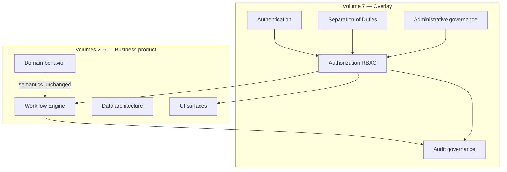
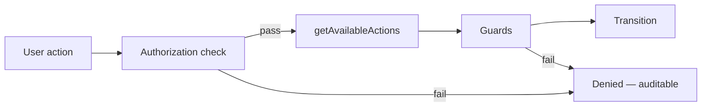
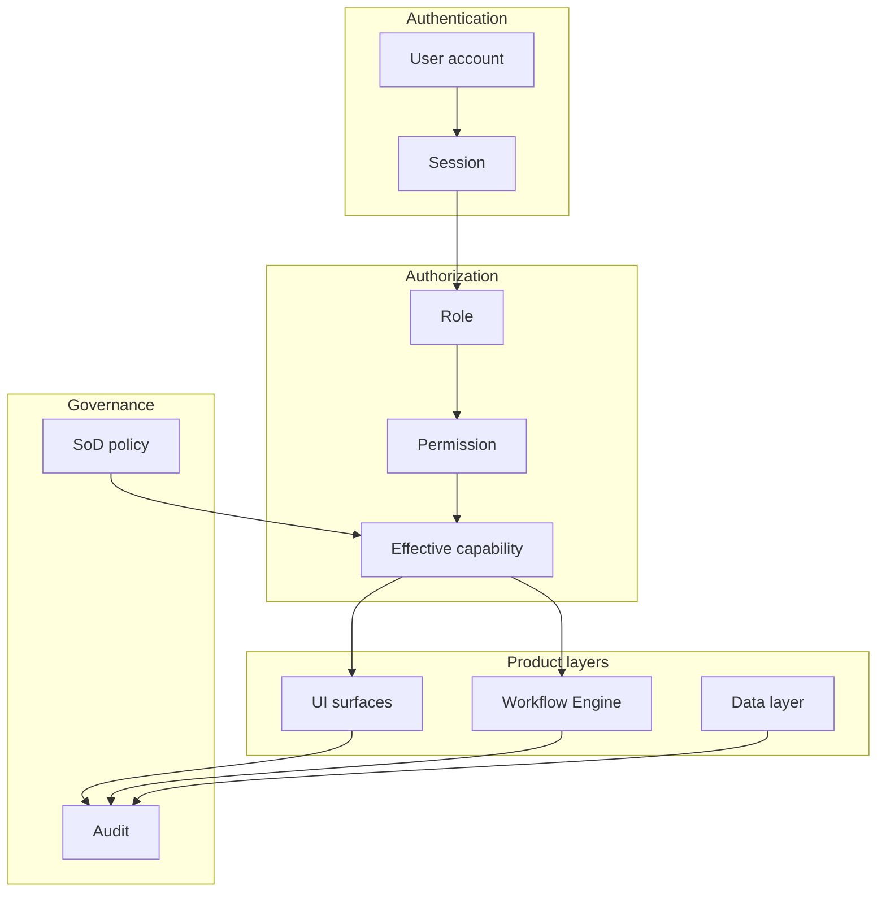
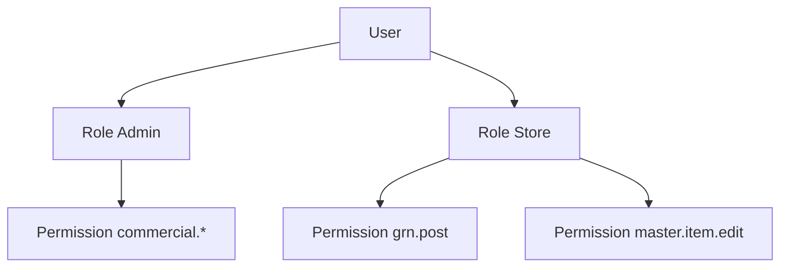
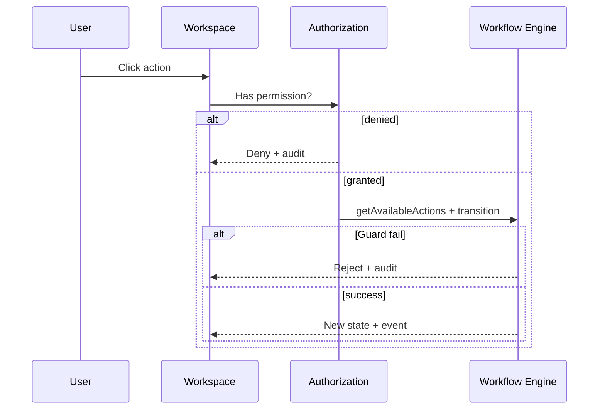
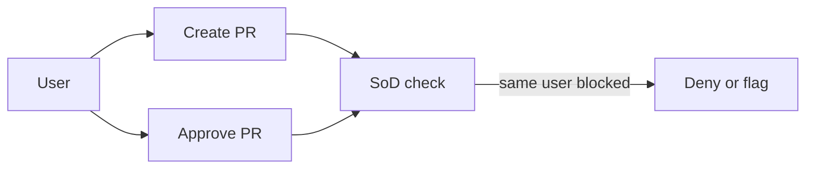
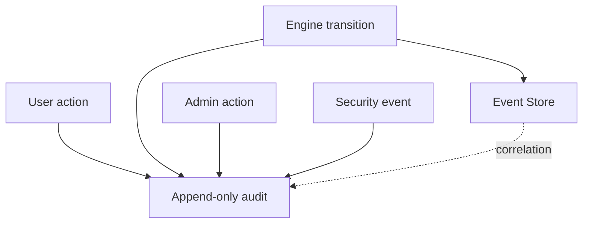
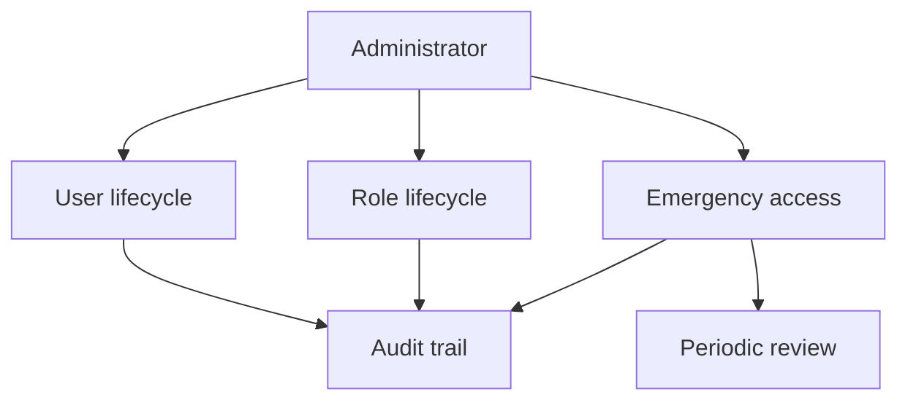

# Security, Authorization & Governance Architecture

| Field | Value |
|-------|-------|
| **Document ID** | FT-PD-070 |
| **Volume** | 7 — Security & Governance Architecture |
| **Chapter** | 1 — Security, Authorization & Governance Architecture |
| **Title** | Security, Authorization & Governance Architecture |
| **Version** | 1.0.0 |
| **Status** | Draft — Architecture Review |
| **Effective date** | 2026-05-29 |
| **Author** | FT ERP Product Team |
| **Owner** | FT ERP Product Architecture |
| **Audience** | Security architects, product owners, compliance leads, implementation leads |
| **Classification** | Product — Security & Governance Architecture |

**Parent documents:**

- [Volume 6 — UI & Experience Architecture](../06_UI_and_Experience_Architecture/README.md)
- [Volume 5 — Data Architecture](../05_Data_Architecture/README.md)
- [Volume 4 — Workflow Engine](../04_Workflow_Engine/README.md)
- [Volume 3 — Domain Specifications](../03_Domain_Specifications/README.md)
- [Volume 2, Ch. 5 — Document Ownership](../02_Business_Architecture/Chapter_05_Document_Ownership_and_Responsibility_Matrix.md)
- [Volume 1, Ch. 2 — Constitution](../01_Product_Foundation/Chapter_02_FT_ERP_Constitution.md)

---

## 1. Document Control

| Version | Date | Author | Summary |
|---------|------|--------|---------|
| 1.0.0 | 2026-05-29 | FT ERP Product Team | Initial Security, Authorization & Governance Architecture |

**Supersedes:** None.

**Change authority:** Product Architecture + Security Governance. SoD rule changes require domain owner and compliance review.

**Out of scope:** JWT, OAuth, encryption algorithms, database schema, APIs, framework-specific implementation.

---

## 2. Purpose

This chapter defines architectural principles governing:

- **Authentication** — identity establishment
- **Authorization** — capability and access control
- **Role-Based Access Control (RBAC)**
- **Separation of Duties (SoD)**
- **Data governance**
- **Audit governance**
- **Session governance**
- **Administrative controls**

This is **product security architecture**, not implementation.

---

## 3. Scope

### 3.1 In scope

- Security philosophy and cross-cutting overlay model (§5)
- Authentication, authorization, SoD (§6–8)
- Data, audit, and administrative governance (§9–11)
- Business Rules and diagrams (§12–13)

### 3.2 Out of scope

- Network perimeter, infrastructure hardening (operations)
- Penetration testing procedures
- Physical security
- Platform API design (future Volume 7+ chapters)
- Field-level encryption implementation

### 3.3 Security vs workflow vs ownership

| Concern | Authority | Example |
|---------|-----------|---------|
| **Authentication** | Identity layer | User logged in |
| **Authorization (RBAC)** | Security layer | Role may invoke `po.approve` |
| **Workflow guards** | Workflow Engine | PO must be `SUBMITTED` to approve |
| **Workflow ownership** | Business architecture | Purchase owns `po.approve` Pending Action |
| **SoD** | Governance layer | Same user cannot create and approve same PR (policy) |

**Rule:** Passing authorization **does not** bypass workflow Guards ([SEC-01](#12-business-rules)).

---

## 4. Relationship with Previous Volumes

| Volume | Relationship |
|--------|--------------|
| **Vol. 2, Ch. 5** | **Business ownership** — primary owner for Pending Actions; not identical to RBAC role |
| **Vol. 3** | Domain responsibilities constrain who should hold roles |
| **Vol. 4** | Guards enforce Business Rules; authorization is pre-condition only |
| **Vol. 5, Ch. 1** | Audit history immutability; Event Store append-only |
| **Vol. 5, Ch. 3** | User, Role, Permission master entities |
| **Vol. 6** | UI surfaces enforce visibility — Dashboard by role; Workspace write CTAs |

### 4.1 Security overlay model

**Principle:** Security **gates access** to product capabilities. It **does not redefine** workflow states, transitions, or domain rules.

---

## 5. Security Philosophy

| Principle | Meaning |
|-----------|---------|
| **Least privilege** | Minimum capability required for role function |
| **Default deny** | No access unless explicitly granted |
| **Role-based access** | Standard roles (Admin, Store, Purchase, Production, QA) as primary bundle |
| **Business ownership** | Workflow ownership from Vol. 2 — security aligns but does not replace |
| **Defense in depth** | Auth + RBAC + guards + SoD + audit layers |
| **Immutable audit** | Security and business actions append-only |
| **Explicit authorization** | Permissions named and grantable — no implicit superuser in core product |
| **Secure by design** | Constitution Art. 10–14 companion — surfaces separated (Dashboard/Workspace/CT) |

---

## 6. Authentication Architecture

### 6.1 Identity model

| Entity | Responsibility |
|--------|----------------|
| **Identity** | Unique human or service actor |
| **User account** | Authenticated login identity bound to User master |
| **Session** | Bounded authenticated context — tenant, user, roles |
| **Device trust** | Policy classification (managed/unmanaged) — future-ready |

### 6.2 Account lifecycle

| State | Meaning |
|-------|---------|
| **Proposed** | Invited — no login |
| **Active** | May authenticate |
| **Suspended** | Login blocked — audit retained |
| **Deactivated** | Permanent offboarding |

### 6.3 Credential policy (product-level)

| Policy | Requirement |
|--------|-------------|
| **Password policy** | Minimum complexity, rotation per tenant configuration |
| **MFA** | *Future-ready* — second factor for Admin and elevated actions |
| **Lockout** | Failed attempt threshold — temporary suspend |

### 6.4 Session governance

| Rule | Description |
|------|-------------|
| **Session binding** | Session tied to user + tenant |
| **Timeout** | Idle and absolute timeout per policy |
| **Concurrent sessions** | Configurable limit |
| **Session ≠ workflow** | Session expiry does not alter document workflow state ([SEC-07](#12-business-rules)) |

---

## 7. Authorization Model

### 7.1 Core constructs

| Construct | Definition |
|-----------|------------|
| **Role** | Named responsibility bundle (Admin, Store, Purchase, Production, QA) |
| **Permission** | Atomic capability key (`document.po.approve`, `master.item.edit`) |
| **Capability** | Effective permission set for user in session |
| **Scope** | Tenant, plant, warehouse (configurable dimension) |
| **Ownership** | **Business** workflow owner on document — from engine, not RBAC alone |
| **Delegation** | Time-bound transfer of **capability** — audit required |
| **Temporary access** | Elevated grant with expiry — emergency pattern |
| **Context-aware authorization** | Action valid only if document state + actor role + permission align |

### 7.2 Relationship with Workflow Engine

1. **Authorization** — may user attempt this action class?
2. **getAvailableActions** — is action registered for document state + role?
3. **Guards** — are business preconditions satisfied?

All three must pass. Authorization alone **never** sufficient ([SEC-01](#12-business-rules)).

### 7.3 Standard roles (product)

Aligned with [Volume 2, Ch. 5](../02_Business_Architecture/Chapter_05_Document_Ownership_and_Responsibility_Matrix.md):

| Role | Primary domain capabilities |
|------|----------------------------|
| **Admin** | Commercial, billing, customer master, governance |
| **Store** | Planning, GRN, WO, PMR, issue, dispatch |
| **Purchase** | PR, PO, supplier, MPRS review |
| **Production** | Production Entry, rework execution |
| **QA** | Inspection, disposition, scrap authorization |
| **System** | Engine, projectors — non-interactive |

---

## 8. Separation of Duties

SoD is **architectural policy** enforced by authorization + audit — complementary to workflow Guards.

### 8.1 SoD rules (examples)

| Rule ID | Separation | Rationale |
|---------|------------|-----------|
| **SOD-01** | **Purchase vs PR approval** (configurable) | Creator should not approve own PR in standard product |
| **SOD-02** | **Store vs Billing** | Store posts dispatch; Admin finalizes Sales Bill — different roles |
| **SOD-03** | **QA vs Production** | QA dispositions; Production executes rework — no self-approval of own output |
| **SOD-04** | **Master maintenance vs transaction approval** | BOM editor should not single-handedly approve PO consuming that BOM (policy) |
| **SOD-05** | **Commercial commit vs planning release** | Admin commits ISO; Store releases RM — role split |
| **SOD-06** | **GRN post vs PO create** | Same user may hold both in small factories — **configurable SoD** |

### 8.2 Administrative override

| Pattern | Governance |
|---------|------------|
| **Admin override** | Explicit permission + **mandatory audit reason** + optional SoD break flag |
| **Emergency access** | Time-bound elevation — post-incident review required |
| **Override never skips guards** | Business preconditions still enforced unless Constitution-approved exception path |

---

## 9. Data Governance

| Dimension | Definition |
|-----------|------------|
| **Data ownership** | Domain owner accountable for master and transactional quality |
| **Data stewardship** | Operational custodian (Store for item, Purchase for supplier) |
| **Confidentiality** | Role-based visibility — commercial terms, supplier rates |
| **Integrity** | Immutability rules from Volume 5 — ledger, events, snapshots |
| **Availability** | Read Models rebuildable — not security scope alone |
| **Retention** | Audit, documents, ledger — policy-driven archive tiers |
| **Classification** | Public / internal / confidential / restricted (tenant policy) |

**Rule:** Security controls **who reads/writes**. Volume 5 controls **what happens to data** after write.

---

## 10. Audit Governance

### 10.1 Immutable audit

All audit records **append-only** ([WES-03](../05_Data_Architecture/Chapter_01_Workflow_Event_Store_and_Correlation_Persistence.md), [SEC-05](#12-business-rules)).

### 10.2 Audit categories

| Category | Content |
|----------|---------|
| **User actions** | Login, navigation to sensitive surfaces, export |
| **Engine actions** | Workflow transitions — Event Store |
| **Administrative actions** | Role grant, SoD override, user suspend |
| **Security events** | Failed auth, denied authorization, lockout |
| **Correlation** | `correlationId`, document id, session id on each entry |
| **Compliance** | Regulatory retention, tamper-evident chain (implementation) |

### 10.3 Audit vs workflow vs security log

| Log | Purpose |
|-----|---------|
| **Workflow Event Store** | Business transition truth |
| **Audit history** | Compliance and security attribution |
| **Security event stream** | Authentication and authorization failures |

---

## 11. Administrative Governance

| Area | Governance |
|------|------------|
| **User lifecycle** | Proposed → Active → Suspended → Deactivated — dual control for Admin role grant (policy) |
| **Role lifecycle** | Permission bundle versioned with product releases |
| **Permission lifecycle** | Deprecated permissions mapped on upgrade |
| **Emergency access** | Break-glass account or elevation — max duration, mandatory review |
| **Delegated administration** | Scoped admin — e.g. user admin without SoD override |
| **Governance reviews** | Periodic role recertification, SoD exception review |

---

## 12. Business Rules

| ID | Rule |
|----|------|
| **SEC-01** | **Authorization never bypasses workflow Guards** — both must pass. |
| **SEC-02** | **Workflow Engine remains authoritative** for valid transitions and state. |
| **SEC-03** | **Every execution action is auditable** — user, action, document, timestamp. |
| **SEC-04** | **Roles grant capability, not ownership** — ownership from engine/Vol. 2. |
| **SEC-05** | **Security changes never rewrite history** — audit append-only. |
| **SEC-06** | **Administrative overrides explicitly audited** with reason and actor. |
| **SEC-07** | **Session state never determines workflow state** — independent lifecycles. |
| **SEC-08** | **Default deny** — unpermissioned action blocked. |
| **SEC-09** | **SoD violations** blocked or flagged per tenant policy — never silent. |
| **SEC-10** | **Dashboard visibility** filtered by role — not authorization to execute on CT ([CTW-01](../06_UI_and_Experience_Architecture/Chapter_03_Control_Tower_Architecture_and_Factory_Monitoring.md)). |
| **SEC-11** | **Workspace write CTAs** require capability + ownership (+ Admin policy). |
| **SEC-12** | **Security never changes workflow semantics** — no new transitions via permission alone. |
| **SEC-13** | **Master maintenance** gated by permission — separate from document workflow ([MDA-12](../05_Data_Architecture/Chapter_03_Master_Data_and_Reference_Architecture.md)). |
| **SEC-14** | **Report/export** of sensitive data requires explicit permission — audited. |

---

## 13. Logical Diagrams

### 13.1 Security architecture

### 13.2 RBAC model

### 13.3 Authorization flow

### 13.4 Separation of Duties

### 13.5 Audit governance

### 13.6 Administrative governance

---

## 14. Review Checklist

- [ ] RBAC model — roles, permissions, capability (§7)
- [ ] SoD coverage — §8 examples + configurable policy
- [ ] Audit integrity — immutable, categories (§10)
- [ ] Governance consistency — admin lifecycle (§11)
- [ ] Workflow integration — SEC-01, SEC-02, authorization flow
- [ ] Cross-domain applicability — all standard roles
- [ ] Distinction: authentication / authorization / ownership / admin authority
- [ ] Six Mermaid diagrams
- [ ] No JWT, OAuth, schema, APIs, encryption algorithms

---

## 15. Change Log

| Version | Date | Author | Summary |
|---------|------|--------|---------|
| 1.0.0 | 2026-05-29 | FT ERP Product Team | Initial Security & Governance Architecture |

---

## 16. Approval Block

| Role | Name | Signature | Date |
|------|------|-----------|------|
| Product Owner | | | |
| Product Architecture | | | |
| Security Architecture Lead | | | |
| Compliance / Audit Lead | | | |
| Workflow Engineering Lead | | | |

---

## Writing Requirements

Remain **technology-neutral**.

**Do not include:** JWT, OAuth, database schema, APIs, encryption algorithms, framework-specific implementation.

**Clearly distinguish:**

- Authentication
- Authorization
- Workflow ownership
- Business ownership
- Administrative authority

**Emphasize:**

- Security **overlays** the product architecture
- Workflow ownership is **not** determined by security roles alone
- Audit remains **immutable**
- Security **never changes workflow semantics**

---

## Document navigation

| | Link |
|--|------|
| **Previous** | [Reports & Analytical Surfaces](../06_UI_and_Experience_Architecture/Chapter_06_Reports_and_Analytical_Surfaces.md) (FT-PD-065) |
| **Next** | [Identity, User, Organization & Delegation Architecture](./Chapter_02_Identity_User_Organization_and_Delegation_Architecture.md) (FT-PD-071) |
| **Volume** | [Security and Governance Architecture](./README.md) |
| **Product** | [Product Documentation Index](../README.md) |

