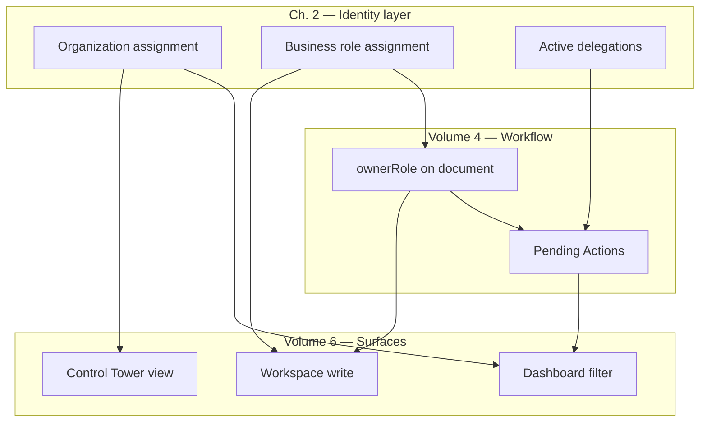
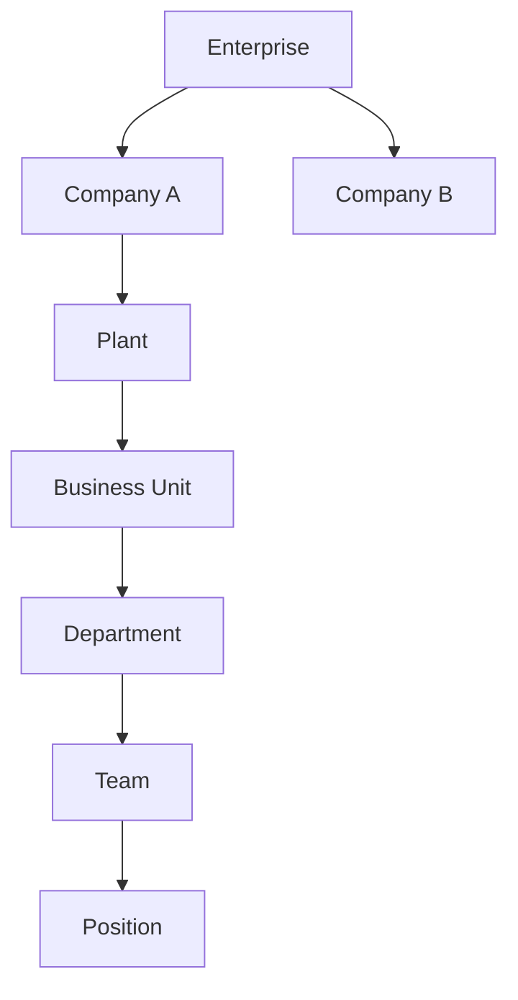
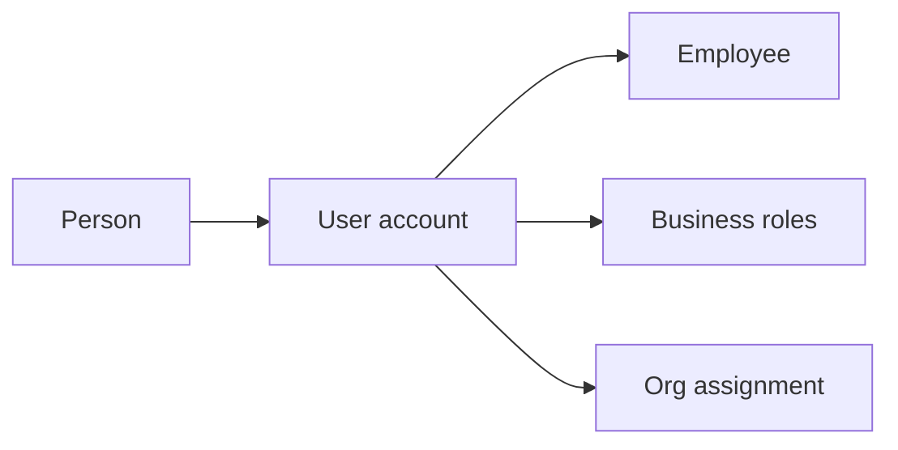
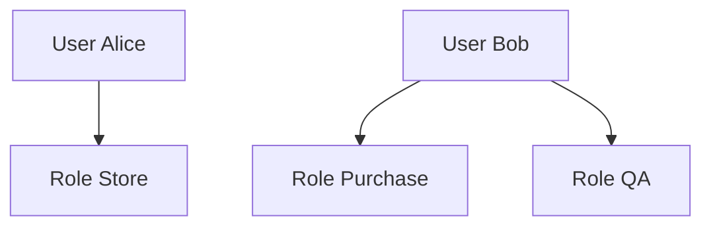
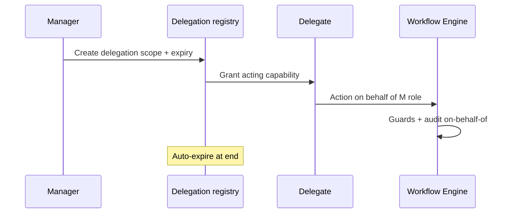
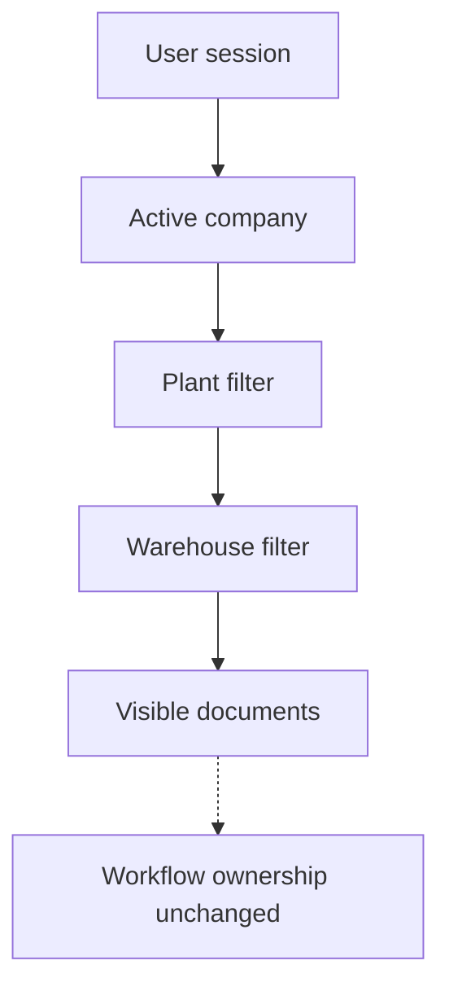
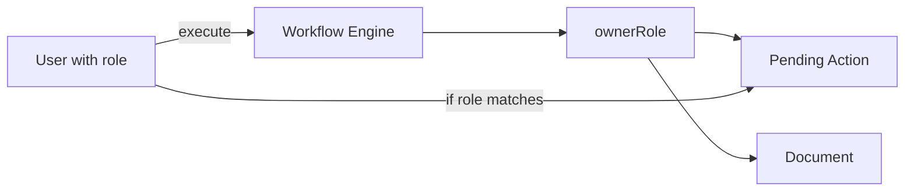

# Identity, User, Organization & Delegation Architecture

| Field | Value |
|-------|-------|
| **Document ID** | FT-PD-071 |
| **Volume** | 7 — Security & Governance Architecture |
| **Chapter** | 2 — Identity, User, Organization & Delegation Architecture |
| **Title** | Identity, User, Organization & Delegation Architecture |
| **Version** | 1.0.0 |
| **Status** | Draft — Architecture Review |
| **Effective date** | 2026-05-29 |
| **Author** | FT ERP Product Team |
| **Owner** | FT ERP Product Architecture |
| **Audience** | Security architects, HR/ops leads, product owners, workflow engineers |
| **Classification** | Product — Security & Governance Architecture |

**Parent documents:**

- [Chapter 1 — Security, Authorization & Governance Architecture](./Chapter_01_Security_Authorization_and_Governance_Architecture.md)
- [Volume 2, Ch. 5 — Document Ownership](../02_Business_Architecture/Chapter_05_Document_Ownership_and_Responsibility_Matrix.md)
- [Volume 5, Ch. 3 — Organization Master](../05_Data_Architecture/Chapter_03_Master_Data_and_Reference_Architecture.md)
- [Volume 4, Ch. 1 — Pending Actions & Ownership](../04_Workflow_Engine/Chapter_01_Workflow_Engine_Overview_and_Pending_Actions_Contract.md)
- [Volume 6 — UI Architecture](../06_UI_and_Experience_Architecture/README.md)

---

## 1. Document Control

| Version | Date | Author | Summary |
|---------|------|--------|---------|
| 1.0.0 | 2026-05-29 | FT ERP Product Team | Initial Identity, User, Organization & Delegation Architecture |

**Supersedes:** None.

**Change authority:** Product Architecture + Security Governance. Delegation policy changes require Volume 4 and Volume 2 Ch. 5 alignment.

**Out of scope:** Active Directory, LDAP, OAuth, JWT, database schema, APIs, implementation code.

---

## 2. Purpose

This chapter defines the **logical architecture** governing how **people and organizations** are represented in FT ERP — independent of authentication technology.

It specifies:

- **Identity**, **User**, and **Organization**
- **Business roles** and organizational assignment
- **Delegation**, substitutes, and approval delegation
- **Organizational scope** and multi-company readiness

Organizational identity **governs** workflow ownership visibility and UI responsibility — it **does not replace** Workflow Engine semantics ([Ch. 1](./Chapter_01_Security_Authorization_and_Governance_Architecture.md)).

---

## 3. Scope

### 3.1 In scope

- Identity philosophy and concept distinctions (§5)
- Organization, user, business role models (§6–8)
- Delegation model (§9)
- Organizational scope (§10)
- Assignment matrices (§12, §12A, §13)
- Business Rules and diagrams

### 3.2 Out of scope

- Authentication protocols (Ch. 1 §6)
- Permission key catalog (implementation)
- Payroll HR master (external)
- Org chart UI layout

### 3.3 Concept independence

| Concept | Must not be conflated with |
|---------|---------------------------|
| **Person** | User account |
| **User** | Workflow `ownerRole` on document |
| **Business Role** | Security Permission |
| **Organizational Assignment** | Workflow ownership |
| **Delegation** | Ownership transfer on document |

---

## 4. Relationship with Previous Volumes

| Volume | Relationship |
|--------|--------------|
| **Vol. 2, Ch. 5** | Standard roles and **workflow ownership** — accountability authority (Organization & Roles) |
| **Vol. 4, Ch. 1** | `ownerRole` on Pending Actions; ownership ≠ reassignment on view |
| **Vol. 5, Ch. 3** | Company, Plant, BU, Department, User, Role masters |
| **Vol. 6, Ch. 1–4** | Dashboard by role; Workspace write by owner; CT monitor all |
| **Vol. 7, Ch. 1** | Authorization capability vs ownership ([SEC-04](./Chapter_01_Security_Authorization_and_Governance_Architecture.md)) |

### 4.1 How organizational identity governs UI and workflow



**Principle:** **Workflow ownership** is explicit on each document. **User assignments** determine who **may act**; **delegation** grants **temporary capability** — not permanent ownership rewrite ([IDN-02](#11-business-rules)).

---

## 5. Identity Philosophy

| Concept | Definition |
|---------|------------|
| **Person** | Real human being — stable identity across employment |
| **User** | ERP login identity bound to Person (or service) — tenant-scoped |
| **Identity** | Logical key linking Person + User + audit attribution |
| **Business Role** | Functional responsibility (Admin, Store, Purchase, Production, QA) |
| **Organizational Assignment** | Person/User placed in Company → Plant → Department → Position |
| **Responsibility** | Accountability to perform domain work — may map to role |
| **Authority** | Power to approve or commit — subset of responsibility, policy-governed |

### 5.1 Distinctions (never interchangeable)

| Pair | Difference |
|------|------------|
| **Person vs User** | Person persists; User account may suspend without erasing audit history |
| **User vs Business Role** | User holds roles; roles are not users |
| **Business Role vs Workflow Ownership** | Document `ownerRole` from engine rules — not user's job title alone |
| **Responsibility vs Authority** | Store **responsible** for GRN; **authority** to post requires capability + state |
| **Organizational Assignment vs Permission** | Assignment scopes visibility; permission grants action |

---

## 6. Organization Model

Logical hierarchy ([Volume 5, Ch. 3 §6.1](../05_Data_Architecture/Chapter_03_Master_Data_and_Reference_Architecture.md)):

```
Enterprise (tenant root)
  └── Company (legal entity)
        └── Plant (site / factory)
              └── Business Unit
                    └── Department
                          └── Team (optional)
                                └── Position (job slot)
```

| Entity | Purpose |
|--------|---------|
| **Enterprise** | Tenant boundary — multi-company container |
| **Company** | Legal entity; GSTIN; **multi-company readiness** |
| **Plant** | Manufacturing/site scope for stock and production |
| **Business Unit** | Operational subdivision |
| **Department** | Functional unit (Commercial, Store, Production, QA) |
| **Team** | Optional work group within department |
| **Position** | Named job slot — may hold default role template |

**Reporting relationships:** Position → Position (manager line) for org chart — **does not** override workflow ownership rules.

**Version-aware org:** Restructuring uses org structure version — historical documents retain assignment at transaction time ([RIR-06](../05_Data_Architecture/Chapter_03_Master_Data_and_Reference_Architecture.md)).

---

## 7. User Model

| Entity | Definition |
|--------|------------|
| **User** | Authenticated ERP actor; links to Person |
| **Employee** | User classified as internal workforce — default case |
| **External User** | Customer/supplier portal actor (future-ready) — restricted scope |
| **Service Identity** | Non-human actor for integration (future-ready) — audited separately |

### 7.1 User lifecycle

| State | Login | Workflow attribution |
|-------|-------|---------------------|
| **Proposed** | No | N/A |
| **Active** | Yes | Full per roles |
| **Suspended** | No | Historical audit preserved |
| **Retired** | No | Read-only audit lookup |

**Rule:** Retired user **identity never changes workflow history** — audit entries retain original user id ([IDN-01](#11-business-rules)).

---

## 8. Business Role Model

| Role type | Definition | Workflow relationship |
|-----------|------------|---------------------|
| **Functional Role** | Product standard: Admin, Store, Purchase, Production, QA | Maps to `ownerRole` on documents |
| **Organizational Role** | Position-based title (Planning Manager) — informational |
| **Workflow Role** | Engine `ownerRole` on document instance | **Authoritative for Pending Actions** |
| **Approval Role** | May approve specific transitions (Purchase approves PR) | Guard + authorization |
| **Temporary Assignment** | Time-bound extra role — expires automatically |

### 8.1 Relationship with Workflow Engine

- Engine assigns **`ownerRole`** on document create/transition per Volume 4 State Machines.
- User's **functional roles** determine eligibility in `getAvailableActions`.
- **Organizational role** alone does **not** grant workflow actions ([IDN-08](#11-business-rules)).

### 8.2 Multiple roles

One person may hold **multiple business roles** (e.g. Store + Production in small factory) — union of capabilities; ownership still **one role per document state**.

---

## 9. Delegation Model

| Delegation type | Purpose |
|-----------------|--------|
| **Delegation** | Grant substitute capability for defined scope and period |
| **Substitute User** | Named acting user during absence |
| **Temporary Delegation** | Planned leave cover — start/end datetime |
| **Approval Delegation** | Specific approval actions delegated (PR approve, MPRS review) |
| **Emergency Delegation** | Break-glass — short TTL, enhanced audit |

### 9.1 Delegation rules

| Rule | Description |
|------|-------------|
| **No ownership rewrite** | Document `ownerRole` unchanged — delegate acts **on behalf of** owner role |
| **Audit** | Delegator, delegate, scope, period logged on every delegated action |
| **Expiration** | Automatic expiry at end datetime — no silent extension |
| **Revocation** | Immediate revoke — audit trail |
| **Engine authoritative** | Delegation does not bypass Guards ([IDN-08](#11-business-rules)) |

---

## 10. Organizational Scope

Scope **filters visibility** — does **not** change workflow ownership ([IDN-05](#11-business-rules)).

| Scope | Filters |
|-------|---------|
| **Company scope** | Documents and masters within legal entity |
| **Plant scope** | Stock, WO, GRN within plant |
| **Warehouse scope** | Location-level inventory views |
| **Department scope** | User directory, optional report filters |
| **Document scope** | Single document Workspace context |
| **Workflow scope** | Pending Actions matching role **and** scope policy |

**Multi-company:** User may hold assignments in multiple companies — session selects **active company**; data isolation per tenant/company policy.

---

## 11. Business Rules

| ID | Rule |
|----|------|
| **IDN-01** | **Identity never changes workflow history** — audit retains original actor. |
| **IDN-02** | **Delegation never changes business ownership** — `ownerRole` on document unchanged. |
| **IDN-03** | **Workflow ownership remains explicit** on each document ([Vol. 2 Ch. 5](../02_Business_Architecture/Chapter_05_Document_Ownership_and_Responsibility_Matrix.md)). |
| **IDN-04** | **Delegation is always auditable** — delegator, delegate, action, time. |
| **IDN-05** | **Organizational scope filters visibility** — not ownership. |
| **IDN-06** | **Temporary assignments expire automatically** — no orphan delegations. |
| **IDN-07** | **One person may hold multiple business roles** — capability union; single owner per doc. |
| **IDN-08** | **Workflow Engine remains authoritative** for state and available actions. |
| **IDN-09** | **Substitute actions** attributed to delegate user with **on-behalf-of** delegator record. |
| **IDN-10** | **Emergency delegation** requires post-incident review flag. |
| **IDN-11** | **Retired users** cannot receive new delegations or assignments. |
| **IDN-12** | **Service identity** (future) never appears as workflow `ownerRole` — system actions only. |

---

## 12. Identity Assignment Matrix

| Role | Primary Responsibilities | Workflow Ownership | Dashboard | Workspace | Control Tower | Delegable |
|------|-------------------------|-------------------|-----------|-----------|---------------|-----------|
| **Admin** | Commercial, ISO, Sales Bill, customer master | Commercial documents, billing | Yes — `COMPL_*` | Yes — write | Monitor | Yes — approval delegate |
| **Purchase** | PR, PO, supplier, MPRS review | Procurement documents | Yes — `PRC_*` | Yes — write | Monitor | Yes — leave cover |
| **Store** | Planning, GRN, WO, PMR, issue, dispatch | Planning + store execution docs | Yes — planning/store PA | Yes — write | Monitor | Yes — leave cover |
| **Production** | Production Entry, rework execute | Production Entry execution | Yes — `MFG_*` | Yes — write | Monitor | Limited |
| **QA** | Inspection, disposition, scrap | QA documents | Yes — `QAS_*` | Yes — write | Monitor | Limited — approval delegate |
| **Management** | Factory oversight | **None** (not operational owner) | KPI summary only | Read-only | **Primary** | N/A |

---

## 12A. Responsibility vs Authority Matrix

| Role | Responsibility | Authority | Workflow Ownership | Approval Authority | Delegable |
|------|------------------|-----------|-------------------|-------------------|-----------|
| **Admin** | Commercial pipeline, billing completion | Commit ISO, finalize bill | ISO, Quotation, Sales Bill | Commercial commit, bill finalize | Yes |
| **Purchase** | Supplier supply, PO execution | Approve PR (policy), activate PO | PR, PO | PR approve, PO approve | Yes |
| **Store** | Material flow, planning execution | Post GRN, issue RM, dispatch | MR, GRN, WO, PMR, Issue, Dispatch | MR approve (REGULAR), release RM | Yes |
| **Production** | Record production output | Approve PE (role policy) | Production Entry post path | PE approve | Limited |
| **QA** | Quality disposition | Authorize scrap, FG accept path | QA Inspection, Scrap | QA disposition | Limited |
| **Management** | Escalation, review | Escalation ack (whitelisted) | **None** | **None** — monitor only | No |

### 12A.1 Four independent concepts

| Concept | Layer | Example |
|---------|-------|---------|
| **Responsibility** | Business | Store accountable for timely GRN |
| **Authority** | Governance/policy | Store manager may approve GRN over threshold |
| **Permission** | Security (Ch. 1) | `grn.post` capability granted |
| **Workflow Ownership** | Engine | `ownerRole=Store` on GRN in `DRAFT` |

All four may align for an action — but **must be evaluated independently**.

---

## 13. Delegation Matrix

| Delegation Type | Duration | Approval Required | Workflow Impact | Audit Required | Automatic Expiry |
|-----------------|----------|-------------------|-----------------|----------------|------------------|
| **Temporary** | Defined end date | Manager / Admin | Delegate may act in scope | **Yes** | **Yes** |
| **Leave Cover** | Leave period | Admin | Substitute Pending Actions visibility | **Yes** | **Yes** |
| **Emergency** | Short TTL (hours/days) | Post-facto review | Break-glass capability | **Yes — enhanced** | **Yes** |
| **Acting Manager** | Position vacancy period | HR/Admin policy | Broader scope filter | **Yes** | **Yes** |
| **Approval Delegate** | Per approval type | Delegator + Admin | Specific approve actions only | **Yes** | **Yes** |

**Workflow impact clarification:** Delegation grants **acting capability** — does **not** reassign `ownerRole` on open documents ([IDN-02](#11-business-rules)).

---

## 14. Logical Diagrams

### 14.1 Organization hierarchy



### 14.2 Identity relationships



### 14.3 User-role assignment



### 14.4 Delegation flow



### 14.5 Organizational scope



### 14.6 Workflow ownership



---

## 15. Review Checklist

- [ ] Identity consistency — Person/User/Role distinguished (§5)
- [ ] Role clarity — functional vs workflow vs approval (§8)
- [ ] Delegation completeness — §9, §13
- [ ] Organizational scope — §10, IDN-05
- [ ] Workflow ownership — explicit, not replaced by delegation (IDN-02, IDN-03)
- [ ] Auditability — IDN-04, delegation matrix
- [ ] §12A responsibility vs authority independence
- [ ] Six Mermaid diagrams
- [ ] No AD, LDAP, OAuth, JWT, schema, APIs

---

## 16. Change Log

| Version | Date | Author | Summary |
|---------|------|--------|---------|
| 1.0.0 | 2026-05-29 | FT ERP Product Team | Initial Identity, User, Organization & Delegation Architecture |

---

## 17. Approval Block

| Role | Name | Signature | Date |
|------|------|-----------|------|
| Product Owner | | | |
| Product Architecture | | | |
| Security Architecture Lead | | | |
| HR / Operations Liaison | | | |
| Workflow Engineering Lead | | | |

---

## Writing Requirements

Remain **technology-neutral**.

**Do not include:** Active Directory, LDAP, OAuth, JWT, database schema, APIs, implementation code.

**Clearly distinguish:** Person, User, Identity, Business Role, Organizational Assignment, Workflow Ownership, Security Permission.

**Emphasize:** Responsibility, Authority, Permission, and Workflow Ownership are **independent** architectural concepts (§12A).

---

## Document navigation

| | Link |
|--|------|
| **Previous** | [Security, Authorization & Governance Architecture](./Chapter_01_Security_Authorization_and_Governance_Architecture.md) (FT-PD-070) |
| **Next** | [Audit, Compliance & Data Retention Governance](./Chapter_03_Audit_Compliance_and_Data_Retention_Governance.md) (FT-PD-072) |
| **Volume** | [Security and Governance Architecture](./README.md) |
| **Product** | [Product Documentation Index](../README.md) |

