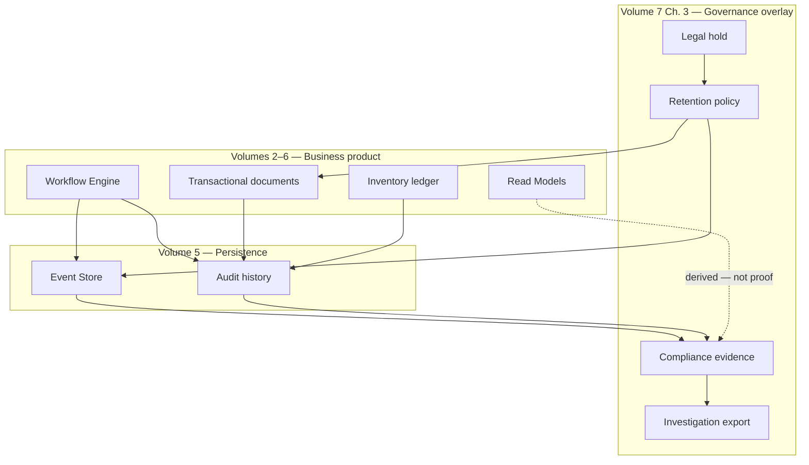
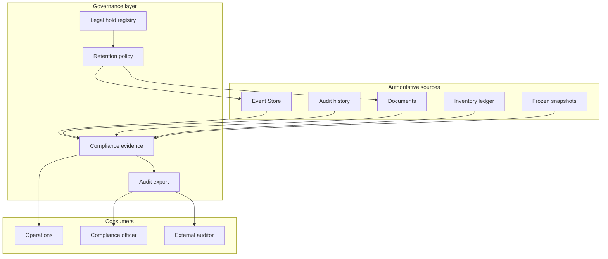
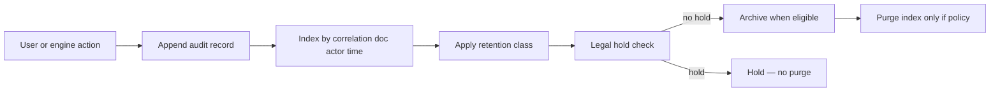
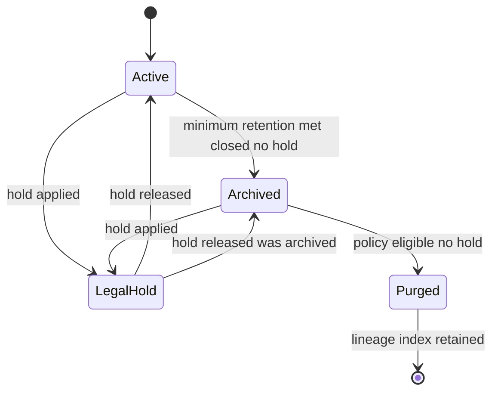
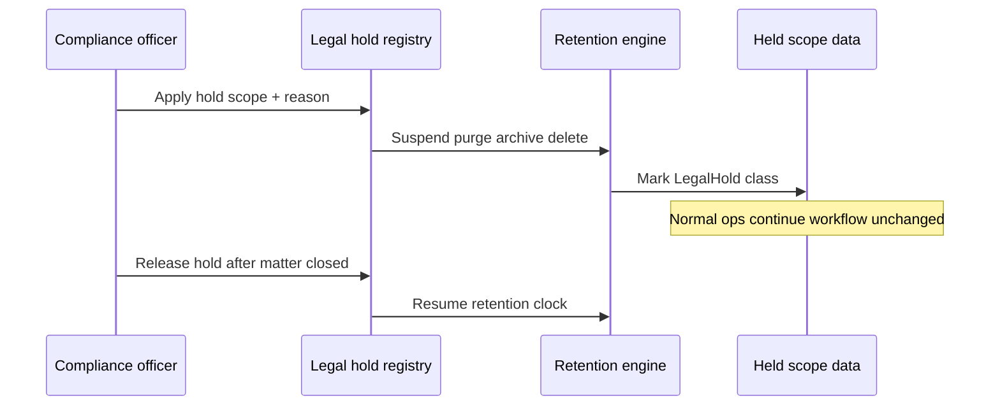
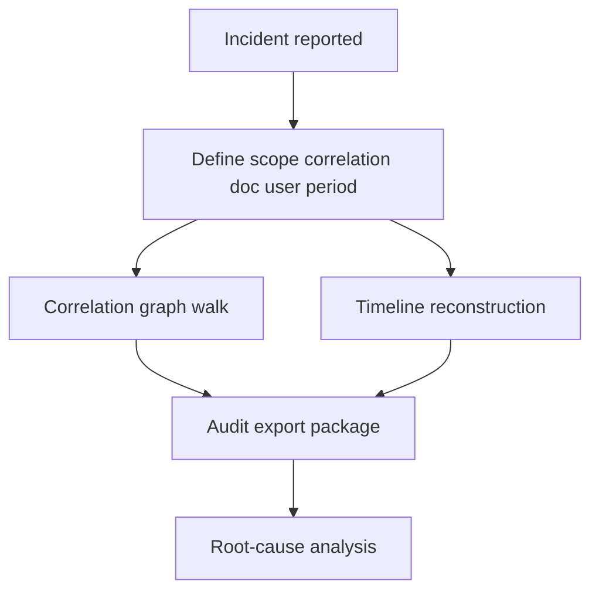
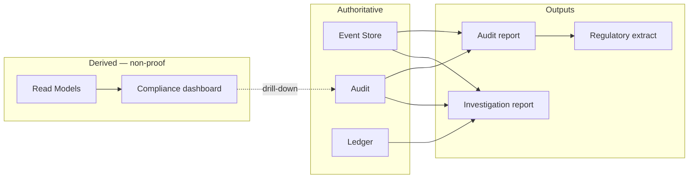

# Audit, Compliance & Data Retention Governance

| Field | Value |
|-------|-------|
| **Document ID** | FT-PD-072 |
| **Volume** | 7 — Security & Governance Architecture |
| **Chapter** | 3 — Audit, Compliance & Data Retention Governance |
| **Title** | Audit, Compliance & Data Retention Governance |
| **Version** | 1.0.0 |
| **Status** | Draft — Architecture Review |
| **Effective date** | 2026-05-29 |
| **Author** | FT ERP Product Team |
| **Owner** | FT ERP Product Architecture |
| **Audience** | Compliance officers, security architects, audit leads, product owners, data stewards |
| **Classification** | Product — Security & Governance Architecture |

**Parent documents:**

- [Chapter 1 — Security, Authorization & Governance Architecture](./Chapter_01_Security_Authorization_and_Governance_Architecture.md)
- [Chapter 2 — Identity, User, Organization & Delegation Architecture](./Chapter_02_Identity_User_Organization_and_Delegation_Architecture.md)
- [Volume 5, Ch. 1 — Event Store & Audit Persistence](../05_Data_Architecture/Chapter_01_Workflow_Event_Store_and_Correlation_Persistence.md)
- [Volume 5, Ch. 6 — Read Models & Reporting](../05_Data_Architecture/Chapter_06_Read_Models_Reporting_and_Analytical_Persistence.md)
- [Volume 4 — Workflow Engine](../04_Workflow_Engine/README.md)
- [Volume 6 — UI Architecture](../06_UI_and_Experience_Architecture/README.md)

---

## 1. Document Control

| Version | Date | Author | Summary |
|---------|------|--------|---------|
| 1.0.0 | 2026-05-29 | FT ERP Product Team | Initial Audit, Compliance & Data Retention Governance specification |

**Supersedes:** None.

**Change authority:** Product Architecture + Compliance Governance. Retention class or legal-hold policy changes require Volume 5 alignment and domain owner review.

**Out of scope:** Database schema, SQL, APIs, encryption implementation, storage implementation, implementation code.

---

## 2. Purpose

This chapter defines the **logical governance architecture** for:

- **Audit** integrity and traceability
- **Compliance** policy and evidence
- **Data retention**, archival, and purge eligibility
- **Legal hold** and investigation support
- **Compliance reporting** and incident traceability

It **complements** [Volume 5, Ch. 1](../05_Data_Architecture/Chapter_01_Workflow_Event_Store_and_Correlation_Persistence.md) (how audit and events are persisted) and [Volume 7, Ch. 1–2](./Chapter_01_Security_Authorization_and_Governance_Architecture.md) (security and identity) by defining **governance policies** — not storage technology or implementation.

---

## 3. Scope

### 3.1 In scope

- Audit philosophy and concept distinctions (§5)
- Audit categories (§6)
- Compliance model (§7)
- Retention, archival, legal hold (§8)
- Incident and investigation model (§9)
- Compliance reporting (§10)
- Governance matrices (§12, §12A–C)
- Business Rules and diagrams (§11, §13)

### 3.2 Out of scope

- Physical backup, DR, and infrastructure retention
- Penetration test procedures
- Country-specific statutory text (tenant policy maps to retention classes)
- Read Model projection implementation (Volume 5 Ch. 6)

### 3.3 Concept independence

| Concept | Must not be conflated with |
|---------|---------------------------|
| **Event Store** | Audit Record (subset + attribution layer) |
| **Audit Record** | Operational document current state |
| **Security Event** | Business workflow transition |
| **Compliance Evidence** | Dashboard aggregate or report snapshot |
| **Operational Data** | Immutable audit history |

---

## 4. Relationship with Previous Volumes

| Volume | Relationship |
|--------|--------------|
| **Vol. 4** | Every transition produces auditable evidence; guards failures auditable ([WES-10](../05_Data_Architecture/Chapter_01_Workflow_Event_Store_and_Correlation_Persistence.md)) |
| **Vol. 5, Ch. 1** | Event Store append-only; audit history; `correlationId`; `retentionClass` |
| **Vol. 5, Ch. 2** | Transactional documents — revision and lifecycle evidence |
| **Vol. 5, Ch. 3** | Master data change audit |
| **Vol. 5, Ch. 4** | Planning snapshots — frozen compliance evidence |
| **Vol. 5, Ch. 5** | Inventory ledger — movement audit lineage |
| **Vol. 5, Ch. 6** | Read Models for reporting — **non-authoritative** for compliance proof |
| **Vol. 6, Ch. 5–6** | Registers and reports consume Read Models — must trace to audit source |
| **Vol. 7, Ch. 1** | Security audit categories; SEC-03, SEC-05, SEC-06 |
| **Vol. 7, Ch. 2** | Delegation visibility in audit; IDN-01, IDN-04, IDN-09 |

### 4.1 Governance overlay model

Governance **overlays** workflow execution and data persistence **without changing business semantics** ([SEC-12](./Chapter_01_Security_Authorization_and_Governance_Architecture.md), [GOV-12](#11-business-rules)).



**Principle:** Workflow semantics and document lifecycles are unchanged. Governance **constrains retention**, **preserves evidence**, and **enables investigation** — it does not alter valid transitions.

---

## 5. Audit Philosophy

| Principle | Definition |
|-----------|------------|
| **Immutable audit** | Audit records append-only — never edited or deleted in normal operation |
| **Complete traceability** | Every material action attributable to actor, time, and business context |
| **Non-repudiation** | Actor identity preserved; delegation recorded on-behalf-of ([IDN-09](./Chapter_02_Identity_User_Organization_and_Delegation_Architecture.md)) |
| **Business accountability** | Audit supports ownership accountability ([Vol. 2 Ch. 5](../02_Business_Architecture/Chapter_05_Document_Ownership_and_Responsibility_Matrix.md)) |
| **Evidence preservation** | Compliance evidence reproducible from authoritative sources |
| **Correlation-based trace** | `correlationId` links Enquiry → commercial → planning → execution chain |
| **Separation of audit and operational data** | Current document state ≠ historical audit truth |

### 5.1 Concept distinctions (never interchangeable)

| Concept | Layer | Purpose |
|---------|-------|---------|
| **Event Store** | Persistence (Vol. 5 Ch. 1) | Authoritative workflow transition history — immutable events |
| **Audit Record** | Governance attribution | Who did what, when, on which document — append-only |
| **Security Event** | Security layer (Ch. 1) | Auth failures, denied authorization, lockout |
| **Business Transaction** | Domain operational | Document revision, ledger posting — current business fact |
| **Compliance Evidence** | Governance package | Curated export proving policy adherence for a scope and period |

---

## 6. Audit Categories

| Category | Purpose | Source | Retention objective | Primary consumers |
|----------|---------|--------|---------------------|-------------------|
| **Business Audit** | Prove business actions on documents | User transitions, document posts | Long-term operational proof | Operations, finance, auditors |
| **Workflow Audit** | Prove valid state progression | Event Store, engine transitions | Align with workflow events ([WES-08](../05_Data_Architecture/Chapter_01_Workflow_Event_Store_and_Correlation_Persistence.md)) | Workflow owners, compliance |
| **Security Audit** | Prove access and authorization | Login, permission checks, denials | Extended security retention | Security, IT governance |
| **Administrative Audit** | Prove admin and override actions | Role grant, user suspend, break-glass ([SEC-06](./Chapter_01_Security_Authorization_and_Governance_Architecture.md)) | Extended | Admin, compliance |
| **Configuration Audit** | Prove master and policy changes | Master maintenance, feature flags, SoD policy | Standard + version history | Product, audit |
| **Integration Audit** *(future-ready)* | Prove external system handoff | Inbound/outbound integration events | Extended | Integration, compliance |
| **Compliance Audit** | Prove regulatory and internal policy adherence | Aggregated evidence packages, review sign-off | Legal/regulatory minimum | Compliance officers, external auditors |

---

## 7. Compliance Model

| Compliance type | Scope |
|-----------------|-------|
| **Regulatory compliance** | Statutory retention, tax/GST evidence, export controls — mapped to retention classes |
| **Internal policy compliance** | Tenant SoD, approval thresholds, delegation policy |
| **Factory operating compliance** | QA disposition, batch trace, material genealogy |
| **Separation of Duties compliance** | Create vs approve conflicts — blocked or flagged ([SEC-09](./Chapter_01_Security_Authorization_and_Governance_Architecture.md)) |
| **Workflow compliance** | Transitions follow Volume 4 State Machines — guard failures auditable |
| **Exception management** | Documented waiver with reason, approver, expiry |
| **Compliance reviews** | Periodic recertification of roles, SoD exceptions, retention policy |

### 7.1 Exception lifecycle

```
Identify → Document reason → Approve (policy) → Time-bound → Review → Close or escalate
```

Exceptions are **audited** and **never silent** ([GOV-08](#11-business-rules)).

---

## 8. Data Retention & Archival

### 8.1 Retention classes

| Class | Typical use |
|-------|-------------|
| **Standard** | Operational documents, workflow events, business audit |
| **Extended** | Security logs, administrative audit, integration audit |
| **LegalHold** | Litigation or investigation — overrides normal purge |

Aligned with `retentionClass` on correlation and audit entities ([Volume 5, Ch. 1 §6](../05_Data_Architecture/Chapter_01_Workflow_Event_Store_and_Correlation_Persistence.md)).

### 8.2 Data lifecycle states

| State | Definition |
|-------|------------|
| **Active** | Online, full query and workflow reference |
| **Archived** | Moved to archive tier — read-only, integrity preserved |
| **Legal Hold** | Purge suspended — retention clock paused or extended |
| **Purged** | Eligible data removed per policy — **audit lineage index retained** |

### 8.3 Lifecycle rules

| Topic | Rule |
|-------|------|
| **Archive eligibility** | Document/workflow **closed** + retention minimum met + no legal hold |
| **Archive integrity** | Checksum or tamper-evident chain — archive reproducible |
| **Legal hold** | Applied at correlation, document, or tenant scope — blocks purge |
| **Purge eligibility** | Policy + no hold + lineage preserved in index |
| **Historical accessibility** | Archived data queryable for authorized roles — audit export supported |

**Distinction:** **Active** vs **Archived** affects performance tier, not business truth. **Legal Hold** overrides normal retention. **Purged** removes payload — not audit lineage ([GOV-04](#11-business-rules)).

---

## 9. Incident & Investigation Model

| Concept | Definition |
|---------|------------|
| **Incident** | Suspected policy violation, data integrity issue, or security event requiring review |
| **Investigation** | Formal trace using correlation and audit sources |
| **Evidence collection** | Scoped export from Event Store, audit history, ledger, snapshots |
| **Correlation tracing** | Walk `correlationId` artifact graph across domains |
| **Timeline reconstruction** | Ordered events + audit + security events for scope |
| **Audit export** | Tamper-evident package for external review |
| **Root-cause analysis support** | Guard failure history, delegation chain, configuration changes at time |

Investigations consume **authoritative persistence** (Vol. 5) — not Read Model aggregates alone ([GOV-09](#11-business-rules)).

---

## 10. Compliance Reporting

| Report type | Purpose | Data source |
|-------------|---------|-------------|
| **Audit reports** | User/action/document activity for period | Audit history (authoritative) |
| **Compliance dashboards** | KPI: SoD exceptions, overdue reviews, hold count | Read Models + audit drill-down |
| **Regulatory extracts** | Statutory export format (tenant-mapped) | Compliance evidence package |
| **Investigation reports** | Incident timeline and attribution | Correlation trace + audit export |
| **Exception reports** | Open waivers, overrides, break-glass usage | Administrative + compliance audit |

### 10.1 Read Models vs immutable evidence

Read Models ([Volume 5, Ch. 6](../05_Data_Architecture/Chapter_06_Read_Models_Reporting_and_Analytical_Persistence.md)) support **navigation and aggregation**. Compliance proof **must** drill to Event Store, audit history, ledger entries, or frozen snapshots. Reports label derived data as **non-authoritative** when not sourced from audit ([GOV-10](#11-business-rules)).

---

## 11. Business Rules

| ID | Rule |
|----|------|
| **GOV-01** | **Audit history is immutable** — append-only ([WES-03](../05_Data_Architecture/Chapter_01_Workflow_Event_Store_and_Correlation_Persistence.md), [SEC-05](./Chapter_01_Security_Authorization_and_Governance_Architecture.md)). |
| **GOV-02** | **Audit records are never edited** — corrections are new compensating audit entries. |
| **GOV-03** | **Legal Hold overrides normal retention** — purge and archive eligibility suspended for held scope. |
| **GOV-04** | **Purging never breaks audit lineage** — index or reference to purged scope retained. |
| **GOV-05** | **Every workflow execution is traceable** — event + audit + actor ([SEC-03](./Chapter_01_Security_Authorization_and_Governance_Architecture.md)). |
| **GOV-06** | **Delegation remains visible in audit history** — on-behalf-of delegator recorded ([IDN-09](./Chapter_02_Identity_User_Organization_and_Delegation_Architecture.md)). |
| **GOV-07** | **Archived data remains historically reproducible** — integrity verification supported. |
| **GOV-08** | **Compliance exceptions are documented and time-bound** — never silent. |
| **GOV-09** | **Investigation evidence uses authoritative sources** — Event Store, audit, ledger, snapshots. |
| **GOV-10** | **Compliance reports consume authoritative audit data** — Read Models are navigational aids only. |
| **GOV-11** | **Workflow events are never deleted** in standard product — archive only ([WES-08](../05_Data_Architecture/Chapter_01_Workflow_Event_Store_and_Correlation_Persistence.md)). |
| **GOV-12** | **Governance never changes workflow semantics** — retention and hold do not alter valid transitions. |
| **GOV-13** | **Security events are retained separately** from business audit — Extended class minimum. |
| **GOV-14** | **Planning and procurement snapshots** are compliance evidence when frozen — not recreated retroactively. |
| **GOV-15** | **Export of sensitive compliance data is audited** ([SEC-14](./Chapter_01_Security_Authorization_and_Governance_Architecture.md)). |

---

## 12. Governance Matrices

### 12A. Audit Responsibility Matrix

| Audit Category | Producer | Custodian | Primary Consumer | Retention Class |
|----------------|----------|-----------|------------------|-----------------|
| **Business** | Domain users via Workflow Engine | Operations / tenant admin | Finance, operations, auditors | Standard |
| **Workflow** | Workflow Engine | Product / workflow ops | Process owners, compliance | Standard |
| **Security** | Authentication & authorization layer | Security / IT | Security, compliance | Extended |
| **Administrative** | Admin actors | Tenant governance | Compliance, audit | Extended |
| **Configuration** | Master maintenance actors | Data steward | Product, audit | Standard |
| **Compliance** | Compliance function + system exports | Compliance officer | External auditors, management | LegalHold when active |

### 12B. Retention Policy Matrix

| Data Category | Retention Class | Archive Eligible | Legal Hold | Purge Eligible | Historical Access |
|---------------|-----------------|------------------|------------|----------------|-------------------|
| **Transactional Documents** | Standard | Yes — when closed | Yes | Yes — after minimum + no hold | Active + archive read |
| **Workflow Events** | Standard | Yes | Yes | No — archive only ([WES-08](../05_Data_Architecture/Chapter_01_Workflow_Event_Store_and_Correlation_Persistence.md)) | Full trace via correlation |
| **Audit Records** | Standard / Extended | Yes | Yes | No — lineage retained | Full audit query |
| **Inventory Ledger** | Standard | Yes | Yes | No — movements immutable | Movement history |
| **Master Data** | Standard | Version history | Yes | Limited — superseded versions archive | Point-in-time reference |
| **Reports** | Standard | Yes — generated output | Yes | Yes — regenerate from source | Source drill-down required |
| **Security Logs** | Extended | Yes | Yes | Yes — after extended minimum | Security investigation |

### 12C. Compliance Traceability Matrix

| Domain | Workflow Evidence | Audit Evidence | Retention Class | Investigation Entry Point | Correlation Support |
|--------|-------------------|----------------|-----------------|---------------------------|---------------------|
| **Commercial** | Enquiry, Quotation, ISO transitions | User actions, approvals | Standard | `correlationId` / Enquiry id | Root — full chain |
| **Planning** | MR, MPRS, monthly planning transitions | Snapshot freeze events | Standard | MR / planning doc id | Via Enquiry correlation |
| **Procurement** | PR, PO, GRN transitions | Approve/post audit | Standard | PR / PO id | Linked to MR / planning |
| **Manufacturing** | WO, PMR, Production Entry | Issue, consumption, PE post | Standard | WO id | WO → SO / Enquiry |
| **QA** | Inspection, scrap, disposition | QA sign-off audit | Standard | QA document id | Batch / WO link |
| **Dispatch** | Dispatch note transitions | Issue and dispatch post | Standard | Dispatch doc id | SO / Enquiry chain |
| **Billing** | Sales Bill, Purchase Bill finalize | Bill commit audit | Standard | Bill document id | Commercial / PO chain |
| **Inventory** | Ledger movements (not workflow doc) | Movement ledger + issue audit | Standard | Movement id / item+location | Cross-doc references |

#### 12C.1 Evidence type distinctions

| Type | Definition |
|------|------------|
| **Operational execution** | Current document state and ledger balance — mutable only via valid transitions |
| **Audit evidence** | Append-only attribution records |
| **Compliance evidence** | Curated package (events + audit + snapshots) for a review period |
| **Investigation evidence** | Scoped export including correlation graph and timeline |

---

## 13. Logical Diagrams

### 13.1 Governance architecture



### 13.2 Audit lifecycle



### 13.3 Retention lifecycle



### 13.4 Legal Hold process



### 13.5 Investigation flow



### 13.6 Compliance reporting architecture



---

## 14. Review Checklist

- [ ] Audit completeness — categories §6, GOV-01, GOV-05
- [ ] Governance consistency — overlay model §4, GOV-12
- [ ] Retention coverage — §8, §12B, lifecycle states
- [ ] Compliance traceability — §12C, correlation support
- [ ] Legal Hold support — §8, §13.4, GOV-03
- [ ] Historical reproducibility — GOV-07, archive integrity
- [ ] Concept distinctions — §5.1, §12C.1
- [ ] Six Mermaid diagrams
- [ ] No schema, SQL, APIs, encryption, storage implementation

---

## 15. Change Log

| Version | Date | Author | Summary |
|---------|------|--------|---------|
| 1.0.0 | 2026-05-29 | FT ERP Product Team | Initial Audit, Compliance & Data Retention Governance specification |

---

## 16. Approval Block

| Role | Name | Signature | Date |
|------|------|-----------|------|
| Product Owner | | | |
| Product Architecture | | | |
| Compliance / Audit Lead | | | |
| Security Architecture Lead | | | |
| Data Architecture Lead | | | |

---

## Writing Requirements

Remain **technology-neutral**.

**Do not include:** Database schema, SQL, APIs, encryption implementation, storage implementation, implementation code.

**Clearly distinguish:** Event Store, Audit History, Compliance Evidence, Security Events, Operational Data.

**Emphasize:** Governance overlays persistence and workflow **without changing business semantics**.

---

## Document navigation

| | Link |
|--|------|
| **Previous** | [Identity, User, Organization & Delegation Architecture](./Chapter_02_Identity_User_Organization_and_Delegation_Architecture.md) (FT-PD-071) |
| **Next** | [Configuration, Business Policies & Feature Flag Architecture](./Chapter_04_Configuration_Business_Policies_and_Feature_Flag_Architecture.md) (FT-PD-073) |
| **Volume** | [Security and Governance Architecture](./README.md) |
| **Product** | [Product Documentation Index](../README.md) |

