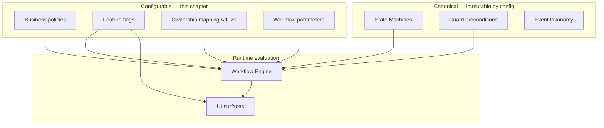
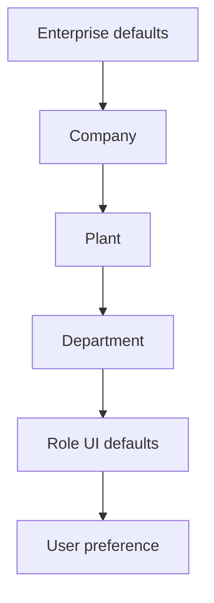
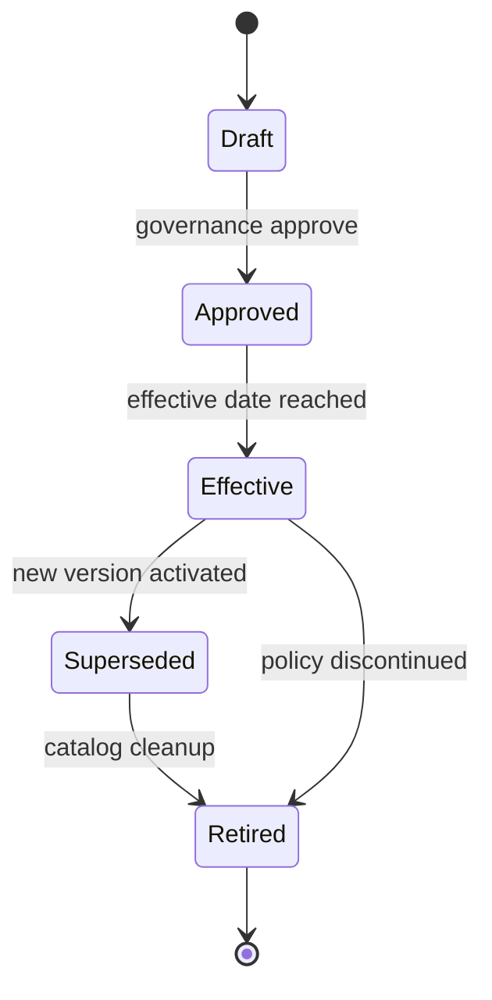
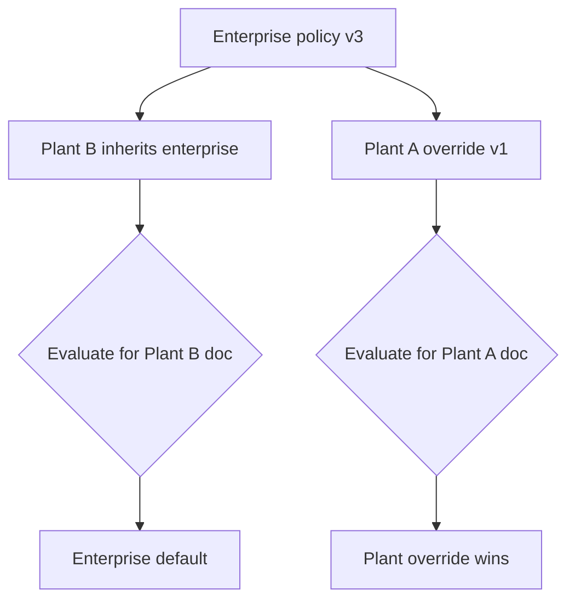
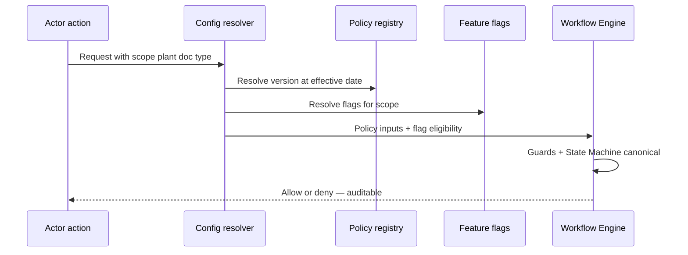
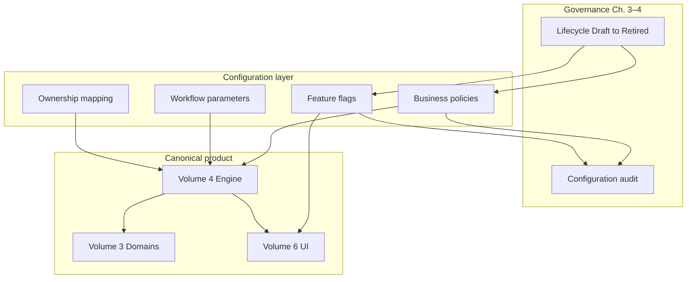

# Configuration, Business Policies & Feature Flag Architecture

| Field | Value |
|-------|-------|
| **Document ID** | FT-PD-073 |
| **Volume** | 7 — Security & Governance Architecture |
| **Chapter** | 4 — Configuration, Business Policies & Feature Flag Architecture |
| **Title** | Configuration, Business Policies & Feature Flag Architecture |
| **Version** | 1.0.0 |
| **Status** | Draft — Architecture Review |
| **Effective date** | 2026-05-29 |
| **Author** | FT ERP Product Team |
| **Owner** | FT ERP Product Architecture |
| **Audience** | Product owners, implementation leads, factory admins, workflow architects, compliance stewards |
| **Classification** | Product — Security & Governance Architecture |

**Parent documents:**

- [Chapter 1 — Security, Authorization & Governance Architecture](./Chapter_01_Security_Authorization_and_Governance_Architecture.md)
- [Chapter 2 — Identity, User, Organization & Delegation Architecture](./Chapter_02_Identity_User_Organization_and_Delegation_Architecture.md)
- [Chapter 3 — Audit, Compliance & Data Retention Governance](./Chapter_03_Audit_Compliance_and_Data_Retention_Governance.md)
- [Volume 1, Ch. 2 — Constitution, Art. 20](../01_Product_Foundation/Chapter_02_FT_ERP_Constitution.md)
- [Volume 4 — Workflow Engine](../04_Workflow_Engine/README.md)
- [Volume 5 — Data Architecture](../05_Data_Architecture/README.md)
- [Volume 6 — UI Architecture](../06_UI_and_Experience_Architecture/README.md)

---

## 1. Document Control

| Version | Date | Author | Summary |
|---------|------|--------|---------|
| 1.0.0 | 2026-05-29 | FT ERP Product Team | Initial Configuration, Business Policies & Feature Flag Architecture |

**Supersedes:** None.

**Change authority:** Product Architecture + Tenant Governance. Policy or feature-flag catalog changes require Volume 4 guard review and Configuration Audit alignment ([Ch. 3 §6](./Chapter_03_Audit_Compliance_and_Data_Retention_Governance.md)).

**Out of scope:** Database schema, APIs, implementation code, UI implementation, vendor-specific feature-flag systems.

---

## 2. Purpose

This chapter defines the **logical architecture** governing:

- **Business configuration** and factory-specific operating parameters
- **Business policies** — approval thresholds, planning rules, procurement constraints
- **Feature flags** — controlled enablement of product capabilities
- **Tenant and product configuration governance**

The objective is **controlled variability between factories** while preserving the **canonical Workflow Engine** and product semantics ([Constitution Art. 20](../01_Product_Foundation/Chapter_02_FT_ERP_Constitution.md)).

---

## 3. Scope

### 3.1 In scope

- Configuration philosophy and concept distinctions (§5)
- Configuration domains (§6)
- Business policy model (§7)
- Feature flag architecture (§8)
- Configuration hierarchy and lifecycle (§9–10)
- Governance matrices (§12, §12A–C)
- Business Rules and diagrams (§11, §13)

### 3.2 Out of scope

- Custom code extensions and Core product forks
- Workflow State Machine definition (Volume 4)
- Master data entity fields (Volume 5 Ch. 3)
- Screen layout and component design (Volume 6)

### 3.3 Concept independence

| Concept | Must not be conflated with |
|---------|---------------------------|
| **Configuration** | Customization (code fork) |
| **Business Policy** | Workflow Rule (state/transition definition) |
| **Feature Flag** | Security Permission |
| **User Preference** | Business Policy |
| **Workflow Parameter** | Guard precondition in engine |

---

## 4. Relationship with Previous Volumes

| Volume | Relationship |
|--------|--------------|
| **Vol. 1, Art. 20** | Configurable responsibility — changes **who**, not **what** states mean |
| **Vol. 4** | State Machines and guards are canonical; configuration **parameterizes** allowed paths within bounds |
| **Vol. 4, Ch. 2** | Guards remain authoritative — flags never bypass ([SEC-01](./Chapter_01_Security_Authorization_and_Governance_Architecture.md)) |
| **Vol. 5, Ch. 3** | Organization scope for policy application |
| **Vol. 5, Ch. 4** | Snapshot and planning policy context frozen at transition |
| **Vol. 6** | UI surfaces reflect flags — Dashboard/Workspace/CT visibility |
| **Vol. 7, Ch. 1** | Authorization separate from configuration; admin override audited |
| **Vol. 7, Ch. 2** | Org hierarchy drives configuration inheritance |
| **Vol. 7, Ch. 3** | Configuration Audit category; historical policy reconstruction ([GOV-07](./Chapter_03_Audit_Compliance_and_Data_Retention_Governance.md)) |

### 4.1 Configuration vs workflow semantics

Configuration **modifies business behavior within engine boundaries** — it does **not redefine** workflow states, transitions, or Guard truth.



**Examples of valid configuration:**

- Approval threshold: PR above amount requires second approver — **policy**, not new state.
- Planning-driven procurement guard enabled for Plant A — **parameter**, guard still evaluates.
- `ownerRole` mapping for WO creation reassigned Store → Production — **Art. 20**, states unchanged.

**Invalid configuration (rejected by product architecture):**

- New workflow state `PARTIALLY_APPROVED` via tenant config only.
- Feature flag that skips GRN location validation guard.

---

## 5. Configuration Philosophy

| Principle | Definition |
|-----------|------------|
| **Configuration over customization** | Prefer governed parameters over code forks |
| **Product consistency** | All factories run the same engine and domain semantics |
| **Factory flexibility** | Plant-level policies for thresholds, flags, ownership where supported |
| **Safe defaults** | Out-of-box configuration matches Volume 2 standard ownership |
| **Backward compatibility** | Policy version changes do not retroactively alter closed transactions |
| **Explicit governance** | Draft → Approved → Effective lifecycle with audit |
| **Version-aware configuration** | Effective dating; historical reconstruction at transaction time |

### 5.1 Concept distinctions (never interchangeable)

| Concept | Layer | Example |
|---------|-------|---------|
| **Configuration** | Tenant/product parameter | Minimum stock planning enabled for plant |
| **Customization** | Implementation fork | Custom State Machine — **out of scope** |
| **Feature Flag** | Capability enablement | Control Tower shortage widget visible |
| **Business Policy** | Governed rule with scope and version | MR approval requires dual sign-off above qty |
| **Workflow Rule** | Engine definition | `grn.post` requires `RECEIVED` state |
| **User Preference** | Personal UI | Default dashboard tab — no business effect |

---

## 6. Configuration Domains

Logical categories — each may contain policies, parameters, and feature flags:

| Domain | Typical configuration |
|--------|----------------------|
| **Organization Configuration** | Active company, plant defaults, org scope |
| **Commercial Policies** | Quotation validity, ISO approval thresholds |
| **Planning Policies** | REGULAR vs NO_QTY behavior params, buffer rules, snapshot policies |
| **Procurement Policies** | PR approval matrix, planning-driven procurement guard, self-approve replenishment |
| **Manufacturing Policies** | WO ownership mapping (Art. 20), PMR freeze rules, consumption tolerance |
| **QA Policies** | Inspection mandatory paths, disposition authority thresholds |
| **Dispatch Policies** | Partial dispatch rules, reservation alignment |
| **Billing Policies** | Bill finalize thresholds, export responsibility (configurable per Art. 20) |
| **Inventory Policies** | Location rules, negative stock prohibition, replenishment triggers |
| **Security Policies** | SoD rules, session duration, password policy ([Ch. 1](./Chapter_01_Security_Authorization_and_Governance_Architecture.md)) |
| **UI Preferences** | Personal layout, column order — **not versioned business policy** |

---

## 7. Business Policy Model

| Entity | Definition |
|--------|------------|
| **Policy** | Named governed rule affecting business behavior within engine bounds |
| **Policy Scope** | Enterprise, Company, Plant, Department, or document-type scope |
| **Effective Date** | When policy becomes active — forward-only for open work |
| **Version** | Immutable policy revision — superseded, not edited |
| **Override** | Narrower-scope policy replaces broader for matching context |
| **Default Policy** | Product standard when no factory override |
| **Factory-specific Policy** | Plant-level override of enterprise default |

### 7.1 Policy influence without state change

Policies affect:

- **Thresholds** — when secondary approval required
- **Routing parameters** — which role receives Pending Action ([Art. 20](../01_Product_Foundation/Chapter_02_FT_ERP_Constitution.md))
- **Guard inputs** — Planning Snapshot required before PR create
- **Validation strictness** — within Guard-defined bounds

Policies **do not**:

- Add or remove workflow states
- Bypass guards ([CFG-02](#11-business-rules))
- Change event taxonomy or correlation rules

**Historical context:** Transactions store **policy version reference** at material transitions — reconstruction uses version at execution time ([CFG-04](#11-business-rules)).

---

## 8. Feature Flag Architecture

| Flag type | Definition |
|-----------|------------|
| **Product Feature** | Generally available capability — default on for supported releases |
| **Experimental Feature** | Limited rollout; may retire without factory dependency |
| **Factory Feature** | Enabled per plant or company |
| **User Feature** | Opt-in personal capability — UI only, no workflow bypass |
| **Progressive rollout** | Staged enablement Enterprise → Company → Plant |
| **Feature retirement** | Deprecation period → off → removed from catalog |

### 8.1 Distinctions

| Layer | Affects | Example |
|-------|---------|---------|
| **Product capability** | Engine or domain feature exists in release | Monthly Planning module |
| **Factory configuration** | Whether capability active for plant | Monthly Planning on for Plant A only |
| **User preference** | How user interacts when feature visible | Default Planning Workspace tab |

**Rule:** Feature flags control **visibility and eligibility** — not Guard truth ([CFG-02](#11-business-rules)).

---

## 9. Configuration Hierarchy

Precedence (narrowest applicable wins for policy override; flags combine by most specific enabled):

```
Enterprise
  └── Company
        └── Plant
              └── Department
                    └── Role
                          └── User Preference (UI only)
```

| Level | Typical content |
|-------|-----------------|
| **Enterprise** | Tenant-wide defaults, security baseline |
| **Company** | Legal entity GST and commercial policy |
| **Plant** | Factory operating policies, feature flags |
| **Department** | Optional approval routing refinements |
| **Role** | Role-scoped UI defaults — not business policy override |
| **User Preference** | Personal UI — **never overrides business policy** ([CFG-06](#11-business-rules)) |

**Inheritance:** Child scope **inherits** parent unless explicit override with higher precedence. Overrides are **versioned and audited**.

---

## 10. Configuration Lifecycle

| State | Definition |
|-------|------------|
| **Draft** | Proposed change — not evaluated at runtime |
| **Approved** | Governance sign-off — pending effective date |
| **Effective** | Active for new evaluations |
| **Superseded** | Replaced by newer version — retained for history |
| **Retired** | Removed from active catalog — historical reference only |

### 10.1 Lifecycle operations

| Operation | Governance |
|-----------|------------|
| **Versioning** | New version on material change — no in-place edit |
| **Activation** | Effective date — forward application |
| **Rollback** | Activate prior approved version — auditable |
| **Audit** | Configuration Audit category ([Ch. 3 §6](./Chapter_03_Audit_Compliance_and_Data_Retention_Governance.md)) |
| **Historical reconstruction** | Transaction carries policy version id at execution |

---

## 11. Business Rules

| ID | Rule |
|----|------|
| **CFG-01** | **Configuration never changes workflow semantics** — states and transitions remain Volume 4 canonical. |
| **CFG-02** | **Feature flags never bypass workflow Guards** — Guards always evaluate ([SEC-01](./Chapter_01_Security_Authorization_and_Governance_Architecture.md)). |
| **CFG-03** | **Business policies are versioned** — supersede, never edit in place. |
| **CFG-04** | **Historical transactions retain original policy context** — no retroactive re-evaluation. |
| **CFG-05** | **Factory configuration is auditable** — draft, approve, activate, rollback logged. |
| **CFG-06** | **User preferences never affect Business Rules** — UI personalization only. |
| **CFG-07** | **Product defaults always exist** — every policy key has out-of-box default. |
| **CFG-08** | **Ownership configuration changes who, not what** ([Constitution Art. 20](../01_Product_Foundation/Chapter_02_FT_ERP_Constitution.md)). |
| **CFG-09** | **Experimental features default off** at enterprise unless explicit rollout. |
| **CFG-10** | **Configuration evaluation is deterministic** — same context + version → same result. |
| **CFG-11** | **Retired policies remain reconstructable** for audit and compliance ([GOV-07](./Chapter_03_Audit_Compliance_and_Data_Retention_Governance.md)). |
| **CFG-12** | **Security policy cannot be weakened below product minimum** by factory override. |

---

## 12. Configuration Matrices

### 12A. Policy Matrix

| Policy Category | Scope | Versioned | Effective Dating | Audit Required | Historical Reconstruction |
|-----------------|-------|-----------|------------------|----------------|---------------------------|
| **Commercial** | Company / Plant | Yes | Yes | Yes | Yes — at ISO/Quotation commit |
| **Planning** | Plant | Yes | Yes | Yes | Yes — at snapshot freeze |
| **Procurement** | Plant | Yes | Yes | Yes | Yes — at PR/PO approve |
| **Manufacturing** | Plant | Yes | Yes | Yes | Yes — at WO/PMR/PE post |
| **QA** | Plant | Yes | Yes | Yes | Yes — at disposition |
| **Dispatch** | Plant | Yes | Yes | Yes | Yes — at dispatch post |
| **Billing** | Company | Yes | Yes | Yes | Yes — at bill finalize |
| **Inventory** | Plant | Yes | Yes | Yes | Yes — at movement post |
| **Security** | Enterprise | Yes | Yes | Yes | Yes — at auth/admin action |

### 12B. Feature Flag Matrix

| Feature | Scope | Default | Rollout Strategy | Retirement | User Visible |
|---------|-------|---------|------------------|------------|--------------|
| **Workflow Features** | Plant | Per product standard | Progressive by plant | Deprecation notice + audit | Role-gated |
| **Dashboard Features** | Plant / Role | On for standard widgets | Plant enablement | Hide then remove | Yes — Dashboard |
| **Control Tower Features** | Plant | Monitor widgets per standard | Plant opt-in | Retire with UI version | Yes — Management |
| **Reporting Features** | Company | On for standard reports | Company enablement | Archive report definition | Permission-gated |
| **Integration Features** | Enterprise | Off until configured | Single-tenant enable | Disable + audit | Admin only |
| **Experimental Features** | Enterprise / Plant | **Off** | Opt-in pilot plants | Forced off or promote | Labeled experimental |

### 12C. Configuration Evaluation Matrix

| Configuration Layer | Evaluated At | Affects | Versioned | Audited | Historical Replay |
|----------------------|--------------|---------|-----------|---------|-------------------|
| **Enterprise** | Login, tenant context | Baseline policies, security floor, global flags | Yes | Yes | Yes |
| **Company** | Company selection | Commercial, billing, GST policy | Yes | Yes | Yes |
| **Plant** | Plant scope on document | Operating policies, factory flags, Art. 20 ownership | Yes | Yes | Yes |
| **Department** | Optional routing context | Approval routing refinements | Yes | Yes | Yes |
| **Role** | Action eligibility prep | UI defaults, widget visibility prep | Limited | Change logged | UI state only |
| **User Preference** | UI render | Layout, sort, tab — **not Business Rules** | No | Optional | No — not compliance evidence |

#### 12C.1 Evaluation type distinctions

| Evaluation type | When | Authority |
|-----------------|------|-----------|
| **Runtime evaluation** | Document action request | Resolved policy version + flags for scope |
| **Workflow evaluation** | Engine transition | Guards + policy inputs — engine authoritative |
| **UI personalization** | Surface render | User preference over display only |
| **Business policy evaluation** | Threshold / routing decision | Versioned policy at effective date |

---

## 13. Logical Diagrams

### 13.1 Configuration hierarchy



### 13.2 Policy lifecycle



### 13.3 Feature flag lifecycle


### 13.4 Configuration inheritance



### 13.5 Policy evaluation



### 13.6 Overall configuration architecture



---

## 14. Review Checklist

- [ ] Configuration completeness — domains §6, matrices §12
- [ ] Policy consistency — lifecycle §10, CFG-03, CFG-04
- [ ] Version governance — effective dating, supersede model
- [ ] Historical correctness — policy context on transactions
- [ ] Workflow preservation — CFG-01, CFG-02, §4.1
- [ ] Auditability — CFG-05, Configuration Audit (Ch. 3)
- [ ] Concept distinctions — §5.1, §12C.1
- [ ] Six Mermaid diagrams
- [ ] No schema, APIs, code, vendor flag systems

---

## 15. Change Log

| Version | Date | Author | Summary |
|---------|------|--------|---------|
| 1.0.0 | 2026-05-29 | FT ERP Product Team | Initial Configuration, Business Policies & Feature Flag Architecture |

---

## 16. Approval Block

| Role | Name | Signature | Date |
|------|------|-----------|------|
| Product Owner | | | |
| Product Architecture | | | |
| Workflow Engineering Lead | | | |
| Security / Governance Lead | | | |
| Implementation Partner Liaison | | | |

---

## Writing Requirements

Remain **technology-neutral**.

**Do not include:** Database schema, APIs, implementation code, UI implementation, vendor-specific feature flag systems.

**Clearly distinguish:** Configuration, Customization, Business Policy, Workflow Rule, User Preference, Feature Flag.

**Emphasize:** Configuration **parameterizes** behavior within canonical workflow semantics — it **never redefines** the engine.

---

## Document navigation

| | Link |
|--|------|
| **Previous** | [Audit, Compliance & Data Retention Governance](./Chapter_03_Audit_Compliance_and_Data_Retention_Governance.md) (FT-PD-072) |
| **Next** | [Platform Integration & External Trust Boundary Architecture](./Chapter_05_Platform_Integration_and_External_Trust_Boundaries.md) (FT-PD-074) |
| **Volume** | [Security and Governance Architecture](./README.md) |
| **Product** | [Product Documentation Index](../README.md) |

