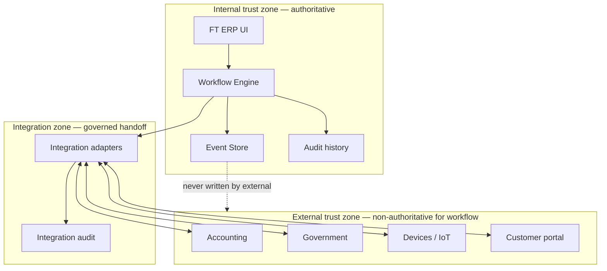
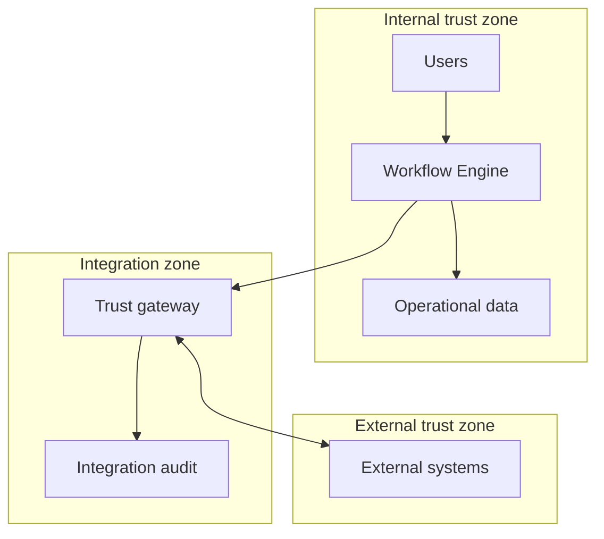
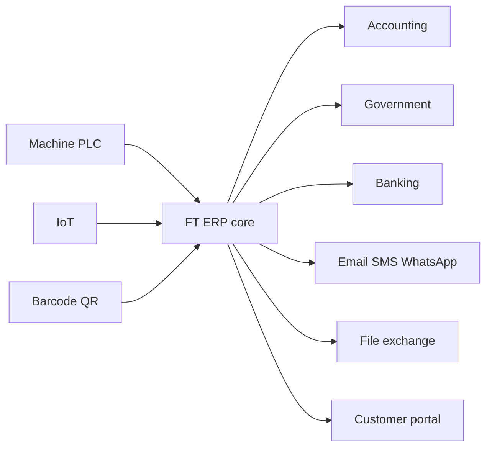
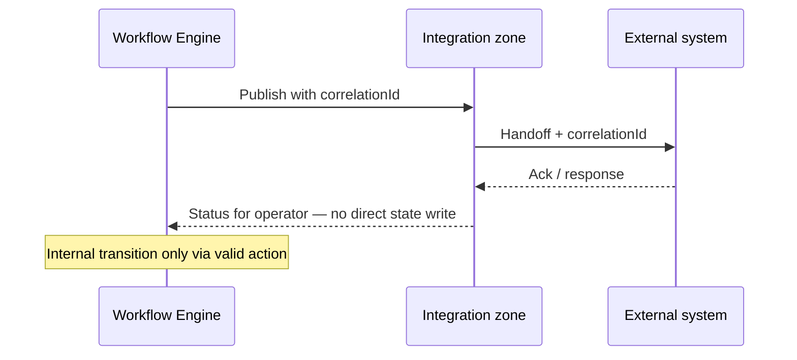
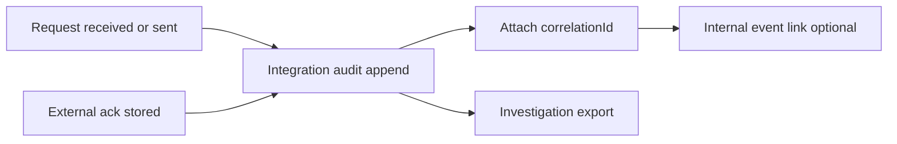
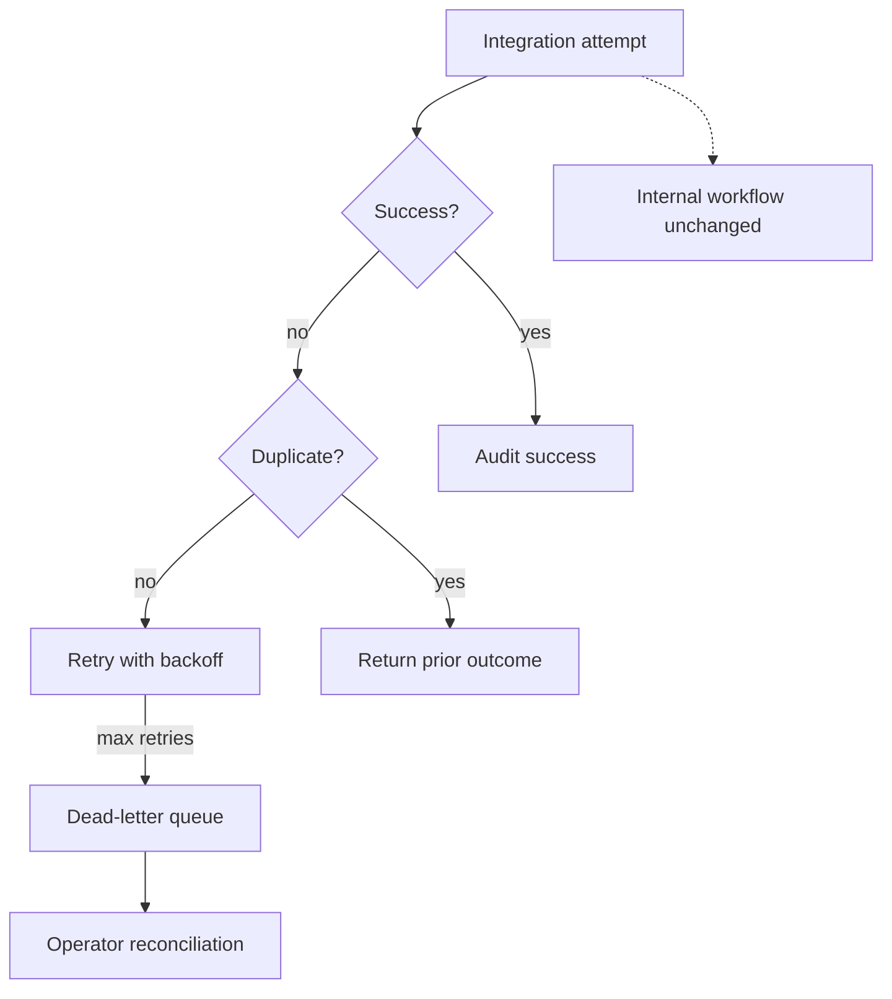
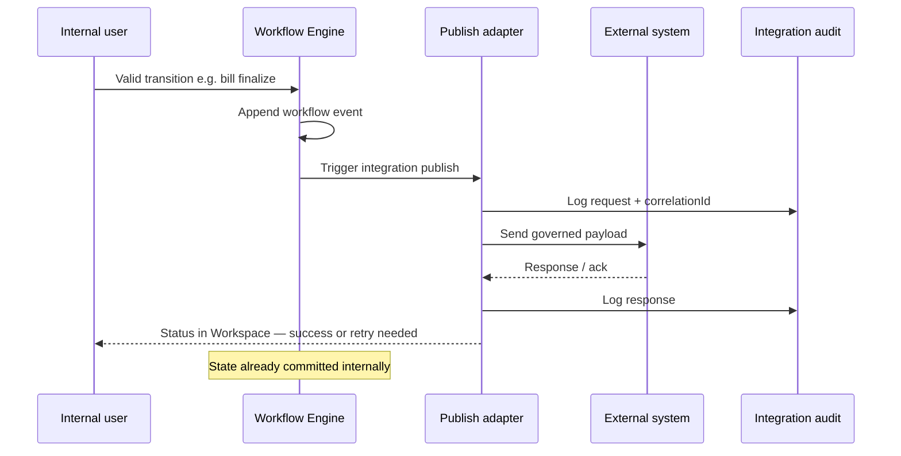

# Platform Integration & External Trust Boundaries

| Field | Value |
|-------|-------|
| **Document ID** | FT-PD-074 |
| **Volume** | 7 — Security & Governance Architecture |
| **Chapter** | 5 — Platform Integration & External Trust Boundaries |
| **Title** | Platform Integration & External Trust Boundary Architecture |
| **Version** | 1.0.0 |
| **Status** | Draft — Architecture Review |
| **Effective date** | 2026-05-29 |
| **Author** | FT ERP Product Team |
| **Owner** | FT ERP Product Architecture |
| **Audience** | Integration architects, security leads, product owners, operations, compliance officers |
| **Classification** | Product — Security & Governance Architecture |

**Parent documents:**

- [Chapter 1 — Security, Authorization & Governance Architecture](./Chapter_01_Security_Authorization_and_Governance_Architecture.md)
- [Chapter 2 — Identity, User, Organization & Delegation Architecture](./Chapter_02_Identity_User_Organization_and_Delegation_Architecture.md)
- [Chapter 3 — Audit, Compliance & Data Retention Governance](./Chapter_03_Audit_Compliance_and_Data_Retention_Governance.md)
- [Chapter 4 — Configuration, Business Policies & Feature Flag Architecture](./Chapter_04_Configuration_Business_Policies_and_Feature_Flag_Architecture.md)
- [Volume 4 — Workflow Engine](../04_Workflow_Engine/README.md)
- [Volume 5, Ch. 1 — Event Store & Correlation](../05_Data_Architecture/Chapter_01_Workflow_Event_Store_and_Correlation_Persistence.md)
- [Volume 6 — UI Architecture](../06_UI_and_Experience_Architecture/README.md)

---

## 1. Document Control

| Version | Date | Author | Summary |
|---------|------|--------|---------|
| 1.0.0 | 2026-05-29 | FT ERP Product Team | Initial Platform Integration & External Trust Boundary Architecture |

**Supersedes:** None.

**Change authority:** Product Architecture + Integration Governance. New external trust zones or system-of-record assignments require Volume 4 guard review and Integration Audit alignment ([Ch. 3 §6](./Chapter_03_Audit_Compliance_and_Data_Retention_Governance.md)).

**Out of scope:** REST endpoints, message formats, authentication protocols, SDKs, APIs, database schema, implementation code.

---

## 2. Purpose

This chapter defines **architectural principles** governing all interactions between FT ERP and **external systems**.

It specifies:

- **External trust boundaries**
- **Integration governance**
- **External and service identities**
- **Data exchange governance**
- **Integration audit**
- **External event boundaries**
- **Failure isolation**

It **extends Volume 7 governance beyond the ERP boundary** — preserving workflow integrity, auditability, security, and compliance when information crosses trust zones.

---

## 3. Scope

### 3.1 In scope

- Integration philosophy and concept distinctions (§5)
- Integration categories (§6)
- Trust boundary model (§7)
- Data exchange governance (§8)
- Integration audit (§9)
- Failure and recovery model (§10)
- Governance matrices (§12, §12A–C)
- Business Rules and diagrams (§11, §13)

### 3.2 Out of scope

- Protocol selection, payload schemas, connector code
- Network topology and firewall rules (operations)
- Third-party vendor SLAs
- Internal UI-to-engine communication (in trust zone)

### 3.3 Concept independence

| Concept | Must not be conflated with |
|---------|---------------------------|
| **Internal workflow** | External integration handoff |
| **External event** | Workflow Event Store entry |
| **External authority** | Workflow Engine authority |
| **Service identity** | Human user identity |
| **External acknowledgement** | Internal audit record |

---

## 4. Relationship with Previous Volumes

| Volume | Relationship |
|--------|--------------|
| **Vol. 4** | Workflow Engine **authoritative** for state — external systems **never** set state directly |
| **Vol. 4, Ch. 9** | Cross-domain orchestration internal — external events are **inputs or outputs**, not orchestrators |
| **Vol. 5, Ch. 1** | `correlationId` propagates across boundaries; Event Store remains internal workflow truth |
| **Vol. 5, Ch. 2** | Transactional documents — ERP system of record for operational documents |
| **Vol. 6** | UI is internal trust zone — portals are external surfaces with restricted scope |
| **Vol. 7, Ch. 1** | Authorization for integration actors; SEC-03 auditable actions |
| **Vol. 7, Ch. 2** | Service identity, external user ([IDN-12](./Chapter_02_Identity_User_Organization_and_Delegation_Architecture.md)) |
| **Vol. 7, Ch. 3** | Integration Audit category; GOV-09 investigation evidence |
| **Vol. 7, Ch. 4** | Integration feature flags; factory enablement per plant |

### 4.1 External systems vs workflow authority

External integrations **consume or publish information** — they **do not become authoritative** for workflow state.

**Principle:** External success or failure **informs** operators and may **trigger** valid internal transitions — it **never replaces** engine transitions ([INT-01](#11-business-rules)).

---

## 5. Integration Philosophy

| Principle | Definition |
|-----------|------------|
| **ERP remains system of record** | Operational documents, workflow state, inventory ledger authoritative in FT ERP |
| **Explicit trust boundaries** | Every crossing documented — identity, data ownership, audit |
| **Controlled data exchange** | Published vs imported data governed; no silent overwrite |
| **Loose coupling** | External schema changes must not break workflow semantics |
| **Event-driven integration** | Prefer asynchronous handoffs with correlation |
| **Failure isolation** | External outage does not corrupt internal workflow state |
| **Idempotent communication** | Duplicate external requests handled safely |
| **Traceability** | `correlationId` and integration request id on every exchange |

### 5.1 Concept distinctions (never interchangeable)

| Concept | Zone | Authority |
|---------|------|-----------|
| **Internal workflow** | ERP trust zone | Workflow Engine |
| **External integration** | Integration zone | Governed handoff — not state owner |
| **External event** | External zone | Signal or payload from outside — validated before internal effect |
| **External data** | External zone | Reference or transaction copy — ownership defined per category |
| **External authority** | External zone | Statutory or partner system of record **outside ERP scope** |

---

## 6. Integration Categories

| Category | Purpose | Direction | Trust level | Data ownership | Typical pattern |
|----------|---------|-----------|-------------|----------------|-----------------|
| **Accounting Systems** | Post bills, vouchers, ledger extracts | Outbound (+ optional status inbound) | High — financial | ERP owns operational bill; accounting owns GL | Publish on finalize; ack tracked |
| **Banking** | Payment status, reconciliation references | Inbound / outbound | High | Bank owns payment facts; ERP owns bill linkage | Reference sync |
| **Email** | Notifications, document delivery | Outbound | Medium | ERP owns trigger; provider owns delivery | Fire-and-forget with audit |
| **SMS** | Alerts, OTP (future) | Outbound | Medium | Same as email | Notification |
| **WhatsApp** | Business messaging (future) | Outbound / inbound | Medium | Provider owns channel; ERP owns business trigger | Notification / lightweight ack |
| **Barcode / QR** | Scan capture for items, locations, docs | Inbound to ERP | Medium | ERP owns interpreted business action | Scan → validate → internal action |
| **Machine / PLC** | Production signals, counts, downtime | Inbound | Medium–High | Machine owns raw signal; ERP owns production record | Event ingest → operator confirm |
| **IoT Devices** | Telemetry, environmental, asset tags | Inbound | Medium | Device owns telemetry; ERP owns derived alerts | Stream → threshold → monitor |
| **File Exchange** | Bulk import/export (masters, extracts) | Bidirectional | High | Source system owns until ERP validates import | Batch with audit trail |
| **Government Systems** | GST, e-invoice, statutory filing | Outbound / inbound | Highest | Government owns statutory record; ERP owns source document | Regulated publish + ack |
| **Customer/Supplier Portals** | Limited external user access | Bidirectional | Medium | ERP owns documents; portal owns session | Scoped read/submit → internal workflow |
| **API Consumers** *(future-ready)* | Partner system programmatic access | Bidirectional | Configurable | Defined per integration contract | Governed publish/consume |

---

## 7. Trust Boundary Model

| Zone / entity | Definition |
|---------------|------------|
| **Internal trust zone** | FT ERP UI, Workflow Engine, Event Store, audit — full governance |
| **Integration zone** | Adapters, transformation, idempotency, integration audit — controlled crossing |
| **External systems** | Outside ERP boundary — varying trust levels |
| **Service identity** | Non-human internal actor for scheduled integration ([Ch. 2 §7](./Chapter_02_Identity_User_Organization_and_Delegation_Architecture.md)) |
| **Human identity** | Employee user — authentication and RBAC |
| **System identity** | Registered external system credential — scoped, auditable |
| **Trust evaluation** | Per integration category — data sensitivity, direction, ack requirement |
| **Boundary crossing** | Every crossing logged — request id, correlation, actor/system identity |

### 7.1 Identity at the boundary

| Identity type | Acts as | Workflow authority |
|---------------|---------|-------------------|
| **Internal user** | Business actor via UI/Workspace | Yes — via engine |
| **Internal service** | Scheduled publish, retry | No — triggers governed jobs only |
| **External service** | Pushes/pulls data | **No** — never direct state change |
| **External user** | Portal actor | **No** — submits to internal workflow queue |
| **Device** | Signal source | **No** — requires validation/confirmation path |

---

## 8. Data Exchange Governance

| Exchange type | Definition |
|---------------|------------|
| **Published data** | ERP-authorized export of operational truth (bill, movement, master snapshot) |
| **Imported data** | External payload validated before master or reference update |
| **Reference synchronization** | Non-transactional alignment (supplier code, tax code mapping) |
| **Transaction synchronization** | Operational document handoff — ERP remains record until explicit dual-record policy |
| **Event publication** | Internal workflow milestone emits integration event — correlation attached |
| **Event consumption** | External event received — mapped to **proposed internal action**, not direct transition |
| **Data ownership** | Declared per category (§6, §12C) — conflicts resolved per principles below |
| **Conflict resolution** | ERP operational state wins for in-flight documents; external wins only for declared external-owned facts (e.g. bank payment status) |

**Rule:** Imported data **never silently overwrites** closed workflow history ([INT-08](#11-business-rules)).

---

## 9. Integration Audit Model

| Element | Definition |
|---------|------------|
| **Integration events** | Append-only record of each boundary crossing ([Ch. 3 §6 Integration Audit](./Chapter_03_Audit_Compliance_and_Data_Retention_Governance.md)) |
| **Request tracking** | Outbound or inbound request id, timestamp, system identity |
| **Response tracking** | Status, payload reference, duration, error classification |
| **Correlation ID propagation** | `correlationId` on every business-related exchange |
| **Failure recording** | Failures never silent — logged with retry state |
| **Retry evidence** | Each attempt auditable — duplicate detection id |
| **External acknowledgements** | Partner ack stored as **evidence** — not substitute for internal audit ([INT-07](#11-business-rules)) |

### 9.1 Relationship with Event Store and audit governance

| Store | Role |
|-------|------|
| **Workflow Event Store** (Vol. 5 Ch. 1) | Internal transition truth — external systems do not append |
| **Audit history** (Vol. 7 Ch. 3) | User and engine attribution |
| **Integration audit** | Boundary crossing truth — links to correlation and internal events |

Investigations join all three via `correlationId` and integration request id ([GOV-09](./Chapter_03_Audit_Compliance_and_Data_Retention_Governance.md)).

---

## 10. Failure & Recovery Model

| Scenario | Logical handling |
|----------|------------------|
| **Retry** | Configurable backoff — each attempt audited |
| **Duplicate detection** | Idempotency key — same external request → same internal outcome |
| **Timeout** | Mark integration attempt failed — internal workflow **unchanged** |
| **Partial success** | Explicit partial state in integration audit — operator reconciliation |
| **Compensating actions** | Internal workflow reversal if valid — **not** external rollback alone |
| **Dead-letter handling** | Failed messages quarantined for operator review — business event not lost ([INT-05](#11-business-rules)) |
| **Operational monitoring** | Control Tower / integration monitor surfaces — Management visibility |

**Principle:** Failure **isolates** at integration zone — engine state stable until valid internal transition ([INT-01](#11-business-rules)).

---

## 11. Business Rules

| ID | Rule |
|----|------|
| **INT-01** | **External systems never change workflow state directly** — all transitions via Workflow Engine. |
| **INT-02** | **Workflow Engine remains authoritative** for document state and Pending Actions. |
| **INT-03** | **Every integration exchange is auditable** — request, response, identity, correlation. |
| **INT-04** | **Correlation IDs propagate across trust boundaries** on business-related exchanges. |
| **INT-05** | **Failed integrations never silently discard business events** — dead-letter or operator queue. |
| **INT-06** | **Duplicate external requests are handled idempotently** — no double post. |
| **INT-07** | **External acknowledgements never replace internal audit** — supplementary evidence only. |
| **INT-08** | **Imported data validates against guards** before master or document effect. |
| **INT-09** | **Service identity never appears as workflow ownerRole** ([IDN-12](./Chapter_02_Identity_User_Organization_and_Delegation_Architecture.md)). |
| **INT-10** | **ERP remains system of record** for operational documents unless explicit dual-record policy documented. |
| **INT-11** | **Integration feature enablement** follows factory configuration ([CFG-02](./Chapter_04_Configuration_Business_Policies_and_Feature_Flag_Architecture.md) — flags never bypass Guards). |
| **INT-12** | **External user actions** enter as proposals — internal workflow validates and commits. |
| **INT-13** | **Government/regulatory publishes** retain source document linkage and ack evidence. |
| **INT-14** | **Device/IoT signals** require validation path before production or inventory effect. |

---

## 12. Integration Governance Matrices

### 12A. Integration Category Matrix

| Integration | Direction | Trust Level | System of Record | Audit Required | Correlation Propagation |
|-------------|-----------|-------------|------------------|----------------|-------------------------|
| **Accounting** | Outbound (+ status inbound) | High | ERP operational; GL external | **Yes** | Bill / correlation id |
| **Banking** | Bidirectional | High | Bank payments; ERP bills | **Yes** | Payment ref + bill id |
| **Email** | Outbound | Medium | Provider delivery | **Yes** | Document / notification id |
| **SMS** | Outbound | Medium | Provider delivery | **Yes** | Document / user context |
| **WhatsApp** | Outbound / inbound | Medium | Provider channel | **Yes** | Business document ref |
| **Barcode/QR** | Inbound | Medium | ERP interpreted action | **Yes** | Scan session + doc |
| **Machine/PLC** | Inbound | Medium–High | ERP production record | **Yes** | WO / machine id |
| **IoT** | Inbound | Medium | ERP alerts | **Yes** | Asset / location ref |
| **Government** | Outbound / inbound | Highest | Statutory external | **Yes** | Source document + correlation |
| **Customer Portal** | Bidirectional | Medium | ERP documents | **Yes** | Enquiry / order correlation |

### 12B. Trust Boundary Matrix

| Boundary | Identity Type | Authority | Audit | Failure Handling | Workflow Authority |
|----------|---------------|-----------|-------|------------------|-------------------|
| **Internal User** | Human employee | RBAC + ownership | User + workflow audit | Standard UI error | **Yes** — via engine |
| **Internal Service** | Service identity | Scoped job permission | Integration + admin audit | Retry + alert | **No** — publishes only |
| **External Service** | System identity | Integration contract | Integration audit | Retry, DLQ, idempotent | **No** |
| **External User** | Portal user | Portal scope | Integration + security audit | Reject invalid submit | **No** — proposes only |
| **Device** | Device identity | Device registration | Integration audit | Buffer, manual confirm | **No** |
| **Government Endpoint** | Regulated system id | Statutory contract | Extended retention audit | Retry + compliance alert | **No** |

### 12C. External System Responsibility Matrix

| External System | Owns Data | Consumes Data | Publishes Data | Workflow Authority | Audit Evidence |
|-----------------|-----------|---------------|----------------|-------------------|----------------|
| **Accounting** | General ledger postings | ERP bill/voucher exports | Posting status (optional) | **None** | Export + ack log |
| **Banking** | Payment transactions | Payment instructions | Payment confirmation | **None** | Bank ref + bill link |
| **Email** | Delivery metadata | Notification requests | Delivery status (optional) | **None** | Send log |
| **SMS** | Delivery metadata | Alert requests | Delivery status (optional) | **None** | Send log |
| **WhatsApp** | Message thread | Business notifications | Read/delivery ack | **None** | Message log |
| **Machine/PLC** | Raw machine signals | — | Counts, status, alarms | **None** | Ingest + confirm log |
| **IoT** | Telemetry stream | — | Sensor readings | **None** | Ingest log |
| **Government** | Statutory returns | ERP tax/bill data | Filing ack, compliance status | **None** | Filing + ack package |
| **Customer Portal** | Portal session data | Order/enquiry views | Customer submissions | **None** | Submit + internal accept log |

#### 12C.1 Responsibility distinctions

| Concept | Owner | Example |
|---------|-------|---------|
| **Data ownership** | Which system is authoritative for a data category | Bank owns payment cleared status |
| **Workflow ownership** | Which role/engine state owns next action | Store owns GRN — not accounting |
| **Integration responsibility** | Who maintains adapter and mapping | Tenant IT + product integration catalog |
| **Operational responsibility** | Who resolves failed handoff | Store/Purchase/Admin per domain |

---

## 13. Logical Diagrams

### 13.1 Trust boundary architecture

### 13.2 Integration ecosystem

### 13.3 Correlation propagation

### 13.4 Integration audit flow

### 13.5 Failure recovery

### 13.6 End-to-end external interaction

---

## 14. Review Checklist

- [ ] Trust boundary clarity — §7, §13.1
- [ ] Audit coverage — §9, INT-03, Integration Audit (Ch. 3)
- [ ] Correlation propagation — INT-04, §13.3
- [ ] Failure isolation — §10, INT-05, INT-06
- [ ] Workflow authority preservation — INT-01, INT-02
- [ ] Governance consistency — Ch. 1–4 cross-refs
- [ ] Concept distinctions — §5.1, §12C.1
- [ ] Six Mermaid diagrams
- [ ] No REST, APIs, protocols, schema, code

---

## 15. Change Log

| Version | Date | Author | Summary |
|---------|------|--------|---------|
| 1.0.0 | 2026-05-29 | FT ERP Product Team | Initial Platform Integration & External Trust Boundary Architecture |

---

## 16. Approval Block

| Role | Name | Signature | Date |
|------|------|-----------|------|
| Product Owner | | | |
| Product Architecture | | | |
| Integration Architecture Lead | | | |
| Security / Governance Lead | | | |
| Compliance Officer | | | |

---

## Writing Requirements

Remain **technology-neutral**.

**Do not include:** REST endpoints, message formats, authentication protocols, SDKs, APIs, database schema, implementation code.

**Clearly distinguish:** Internal workflow, External integration, Trust boundary, Service identity, Human identity, System of record.

**Emphasize:** External systems **inform and hand off** — Workflow Engine **commits** state.

---

## Document navigation

| | Link |
|--|------|
| **Previous** | [Configuration, Business Policies & Feature Flag Architecture](./Chapter_04_Configuration_Business_Policies_and_Feature_Flag_Architecture.md) (FT-PD-073) |
| **Next** | [Product Testing, Validation & Compliance Framework](../08_Product_Testing_and_Validation/Chapter_01_Product_Testing_Validation_and_Compliance_Framework.md) (FT-PD-080) |
| **Volume** | [Security and Governance Architecture](./README.md) |
| **Product** | [Product Documentation Index](../README.md) |

