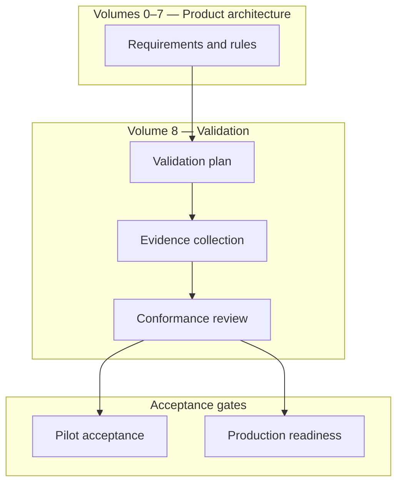
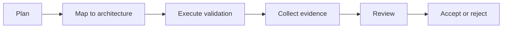
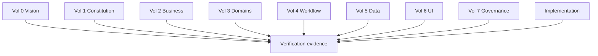
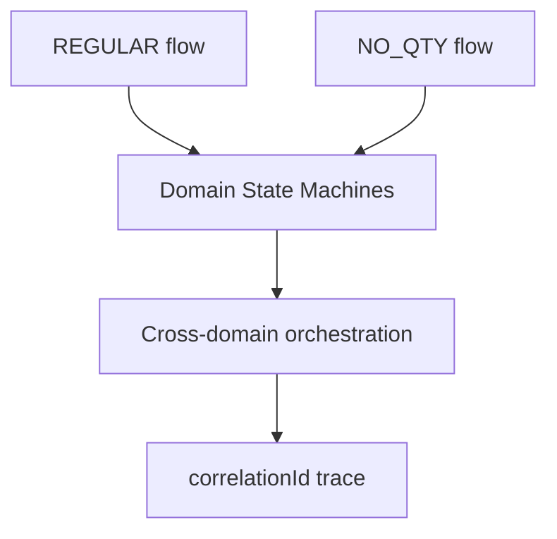
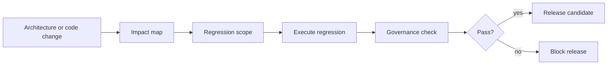
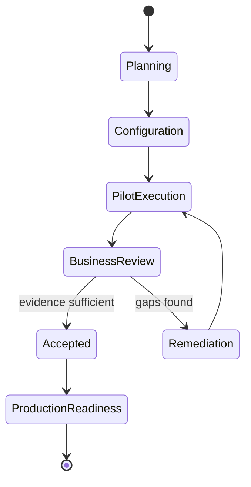
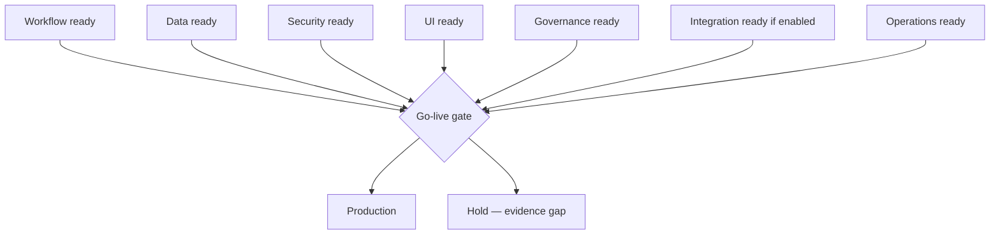

# Product Testing, Validation & Compliance Framework

| Field | Value |
|-------|-------|
| **Document ID** | FT-PD-080 |
| **Volume** | 8 — Product Testing & Validation |
| **Chapter** | 1 — Product Testing, Validation & Compliance Framework |
| **Title** | Product Testing, Validation & Compliance Framework |
| **Version** | 1.0.0 |
| **Status** | Draft — Architecture Review |
| **Effective date** | 2026-05-29 |
| **Author** | FT ERP Product Team |
| **Owner** | FT ERP Product Architecture |
| **Audience** | Product owners, QA architects, implementation leads, compliance officers, pilot sponsors |
| **Classification** | Product — Validation Architecture |

**Parent documents:**

- [Volume 0 — Product Vision & Strategy](../00_Product_Vision_and_Strategy/README.md)
- [Volume 1 — Product Foundation](../01_Product_Foundation/README.md)
- [Volume 2 — Business Architecture](../02_Business_Architecture/README.md)
- [Volume 3 — Domain Specifications](../03_Domain_Specifications/README.md)
- [Volume 4 — Workflow Engine](../04_Workflow_Engine/README.md)
- [Volume 5 — Data Architecture](../05_Data_Architecture/README.md)
- [Volume 6 — UI & Experience Architecture](../06_UI_and_Experience_Architecture/README.md)
- [Volume 7 — Security & Governance Architecture](../07_Security_and_Governance_Architecture/README.md)

---

## 1. Document Control

| Version | Date | Author | Summary |
|---------|------|--------|---------|
| 1.0.0 | 2026-05-29 | FT ERP Product Team | Initial Product Testing, Validation & Compliance Framework |

**Supersedes:** None.

**Change authority:** Product Architecture + Validation Governance. Framework changes require alignment when Volumes 0–7 architecture is amended.

**Out of scope:** Automated test scripts, framework-specific testing, CI/CD pipelines, programming languages, implementation code, per-field test case catalogs.

---

## 2. Purpose

This chapter defines the **architectural framework** governing verification of the FT ERP product.

It specifies:

- **Product validation philosophy**
- **Architecture verification** against Volumes 0–7
- **Workflow validation** — REGULAR, NO_QTY, cross-domain
- **Compliance verification** — governance and audit
- **Regression strategy**
- **Acceptance criteria**
- **Pilot validation**
- **Production readiness**

The goal is to **verify that implementation conforms to product architecture** — not to redefine Business Rules.

---

## 3. Scope

### 3.1 In scope

- Validation philosophy and concept distinctions (§5)
- Validation levels (§6)
- Workflow and architecture compliance (§7–8)
- Regression, pilot, production readiness (§9–11)
- Validation matrices (§13, §13A–D)
- Business Rules and diagrams (§12, §14)

### 3.2 Out of scope

- Individual test case steps and expected field values
- Tool selection (test runners, browsers, load tools)
- Customer-specific customization test packs (implementation project scope)
- Penetration testing execution procedures (security operations)

### 3.3 Validation vs architecture authority

| Activity | Authority |
|----------|-----------|
| **Product architecture** (Volumes 0–7) | Defines **what must be true** |
| **Validation framework** (this volume) | Defines **how conformance is proven** |
| **Test execution** | Produces **evidence** — does not change rules |

**Rule:** A failing test indicates **implementation or documentation drift** — not permission to weaken architecture ([VAL-03](#12-business-rules)).

---

## 4. Relationship with Previous Volumes

| Volume | Validation focus |
|--------|------------------|
| **Vol. 0** | Vision, positioning, roadmap alignment — strategic fit |
| **Vol. 1** | Constitution compliance — non-negotiable laws |
| **Vol. 2** | Business models, pipelines, ownership matrix |
| **Vol. 3** | Domain behavior per document type |
| **Vol. 4** | State Machines, guards, Pending Actions, orchestration |
| **Vol. 5** | Event Store immutability, documents, ledger, snapshots |
| **Vol. 6** | Dashboard / Workspace / Control Tower / Register surfaces |
| **Vol. 7** | Security, identity, audit, configuration, integration boundaries |

### 4.1 Architecture verification model

Testing **validates architecture** — it does **not** substitute for product design decisions in Volumes 0–7.

---

## 5. Validation Philosophy

| Principle | Definition |
|-----------|------------|
| **Architecture-first validation** | Every test traceable to a volume and rule |
| **Workflow-first validation** | Engine transitions and guards are primary proof points |
| **Business outcome validation** | End-state correctness — stock, billing, dispatch — not screen-only |
| **Regression safety** | Protected behaviors never silently weakened |
| **Repeatability** | Same architecture version → reproducible evidence |
| **Traceability** | Requirement → test → evidence → approval |
| **Evidence-based acceptance** | No sign-off without objective artifacts |

### 5.1 Concept distinctions (never interchangeable)

| Concept | Definition |
|---------|------------|
| **Verification** | Does implementation match specification? — objective conformance |
| **Validation** | Does the product meet intended business and architecture goals? |
| **Testing** | Activity producing evidence — subset of verification |
| **Certification** | Formal attestation that a release meets framework criteria |
| **Acceptance** | Stakeholder sign-off on pilot or go-live — requires evidence bundle |

---

## 6. Validation Levels

| Level | Objective | Scope | Success criteria | Evidence required |
|-------|-----------|-------|------------------|-----------------|
| **Unit** | Isolated rule or calculation correctness | Single function or Guard input | Pass/fail per rule | Test log, rule reference |
| **Component** | Domain module behavior | Single domain document lifecycle | States and guards match Vol. 4 | Transition evidence, audit sample |
| **Workflow** | End-to-end document flow | Single pipeline within domain | Happy + exception paths | Event Store trace, Pending Actions |
| **Cross-domain** | Orchestration across domains | REGULAR or NO_QTY chain | Correlation intact; handoffs correct | `correlationId` graph, cross-doc audit |
| **Integration** | External trust boundaries | Per Vol. 7 Ch. 5 categories | No direct external state write | Integration audit log |
| **Security** | Auth, RBAC, SoD, delegation | Vol. 7 Ch. 1–2 scenarios | SEC-/IDN- rules hold | Security audit sample |
| **Performance** | Operational scale thresholds | Agreed factory load profile | Response within agreed bounds | Load test summary — architecture-neutral |
| **Pilot** | Real factory operating validation | Live pilot scope | Business acceptance met | Pilot evidence pack |
| **Production Readiness** | Go-live gate | Full readiness matrix §13C | All required areas approved | Signed readiness checklist |

---

## 7. Workflow Validation

### 7.1 Domain validation scope

| Domain | Validate |
|--------|----------|
| **Commercial** | Enquiry → Quotation → ISO → ownership (Admin) |
| **Planning** | MR, MPRS, monthly planning — REGULAR and NO_QTY paths |
| **Procurement** | PR, PO, GRN — guards, planning-driven procurement where enabled |
| **Manufacturing** | WO, PMR, Material Issue, Production Entry — snapshot integrity |
| **QA** | Inspection, disposition, scrap — accountability chain |
| **Dispatch** | Dispatch note, reservation alignment, fulfillment |
| **Billing** | Sales Bill, Purchase Bill — finalize and export handoff |

### 7.2 Business model flows

| Flow | Validation focus |
|------|------------------|
| **REGULAR** | Full correlation from Enquiry through dispatch and billing |
| **NO_QTY** | Agreement planning, MPRS, buffer semantics — distinct from REGULAR |
| **Cross-domain orchestration** | Vol. 4 Ch. 9 — event order, idempotency, Pending Action projection |

**Rule:** Every **workflow transition** defined in Volume 4 must be **testable** — happy path, guard rejection, and ownership routing ([VAL-01](#12-business-rules)).

---

## 8. Architecture Compliance

Conformance reviews verify implementation against:

| Architecture layer | Primary reference | Review focus |
|--------------------|-------------------|--------------|
| **FT ERP Constitution** | Vol. 1 Ch. 2 | Articles 7–20 — material, ownership, surfaces |
| **Workflow Engine** | Vol. 4 | State Machines, guards, no orphan transitions |
| **Data Architecture** | Vol. 5 | WES-*, immutability, ledger-first inventory |
| **UI Architecture** | Vol. 6 | Dashboard = My Work; Workspace = Do Work; CT = Monitor |
| **Security & Governance** | Vol. 7 | SEC-*, GOV-*, CFG-*, INT-* — overlay without semantic change |

### 8.1 Architecture conformance review

Periodic or release-gated review:

1. Map implementation changes to affected volumes.
2. Identify protected rules (Constitution, WES-01, SEC-12, INT-01, etc.).
3. Execute regression scope per §9.
4. Document evidence in traceability matrix (§13D).
5. Product Architecture approves or blocks release.

---

## 9. Regression Strategy

| Regression type | Scope |
|-----------------|-------|
| **Regression scope** | All protected behaviors touched by change |
| **Protected behaviors** | Constitution articles, Guard catalog, ownership matrix, immutability rules |
| **Workflow regression** | State transitions, Pending Actions, cross-domain events |
| **UI regression** | Role visibility, Workspace write CTAs, CT monitor-only |
| **Data regression** | Event Store append-only, ledger movements, snapshot freeze |
| **Governance regression** | Audit append-only, delegation visibility, config versioning |
| **Release validation** | Full cross-domain smoke + targeted deep regression per change map |

**Rule:** Regression **never weakens governance** — a passing shortcut that bypasses guards is a **failure** ([VAL-03](#12-business-rules)).

---

## 10. Pilot Acceptance

| Phase | Definition |
|-------|------------|
| **Factory pilot** | Limited production use at one plant — real transactions |
| **Business acceptance** | Process owners confirm outcomes match Volume 2–3 |
| **User acceptance** | Role holders confirm Dashboard/Workspace usability per Vol. 6 |
| **Production simulation** | Peak-day scenario — planning, issue, dispatch, bill |
| **Data migration verification** | Masters and opening balances — referential integrity |
| **Operational readiness** | Support model, escalation, monitoring in place |

**Rule:** Pilot **validates product architecture** in factory context — not a substitute for architecture conformance ([VAL-04](#12-business-rules)).

---

## 11. Production Readiness

| Area | Readiness element |
|------|-------------------|
| **Readiness checklist** | §13C matrix — all Required = Yes with evidence |
| **Go-live criteria** | Successful cross-domain validation REGULAR + NO_QTY sample |
| **Rollback readiness** | Documented rollback scope — data and workflow impact |
| **Operational support** | L1/L2 ownership, integration contact |
| **Monitoring readiness** | Control Tower, integration failure visibility |
| **Governance readiness** | Audit retention, legal hold, config approval workflow active |

---

## 12. Business Rules

| ID | Rule |
|----|------|
| **VAL-01** | **Every workflow transition is testable** — mapped to Vol. 4 State Machine. |
| **VAL-02** | **Every architecture layer is verifiable** — Volumes 0–7 have validation objectives (§13A). |
| **VAL-03** | **Regression never weakens governance** — guards, audit, SoD remain enforced. |
| **VAL-04** | **Pilot validates product architecture** — not ad-hoc factory custom behavior as new standard. |
| **VAL-05** | **Acceptance requires objective evidence** — logs, traces, sign-off artifacts. |
| **VAL-06** | **Production readiness requires successful cross-domain validation** — minimum REGULAR end-to-end. |
| **VAL-07** | **Architecture changes require regression assessment** — change map before release. |
| **VAL-08** | **Validation evidence traces to correlationId** where business flow applies. |
| **VAL-09** | **Security validation is mandatory** — not optional for go-live. |
| **VAL-10** | **Integration validation confirms INT-01** — no external direct state write. |
| **VAL-11** | **UI validation confirms role surfaces** — CT does not grant undeclared execute rights. |
| **VAL-12** | **Failed validation blocks certification** until resolved or architecture formally amended. |

---

## 13. Validation Matrices

### 13A. Architecture Validation Matrix

| Volume | Validation Objective | Evidence | Approval |
|--------|---------------------|----------|----------|
| **0 — Vision** | Product scope and positioning reflected in pilot scope | Vision alignment review | Product Owner |
| **1 — Foundation** | Constitution Articles 7–20 enforced | Conformance checklist | Product Architecture |
| **2 — Business** | REGULAR/NO_QTY pipelines and ownership | Pipeline walkthrough evidence | Process owners |
| **3 — Domains** | Per-domain document behavior | Domain validation pack | Domain leads |
| **4 — Workflow** | State Machines, guards, orchestration | Event Store + PA traces | Workflow Engineering |
| **5 — Data** | Immutability, ledger, snapshots | Persistence audit samples | Data Architecture |
| **6 — UI** | Surface triad and role routing | UI validation scenarios | UX / Product |
| **7 — Governance** | Security, audit, config, integration | SEC/GOV/CFG/INT rule checks | Security / Compliance |

### 13B. Workflow Validation Matrix

| Domain | Happy Path | Exception Path | Cross-domain | Regression | Pilot |
|--------|------------|----------------|--------------|------------|-------|
| **Commercial** | Required | Required | Enquiry root correlation | On change | Required |
| **Planning** | REGULAR + NO_QTY | Guard failures, reversal | To procurement | On change | Required |
| **Procurement** | PR → PO → GRN | Planning guard, approval | From planning MR | On change | Required |
| **Manufacturing** | WO → PMR → Issue → PE | Snapshot mismatch | From planning/SO | On change | Required |
| **QA** | Inspection → disposition | Reject/scrap paths | From production | On change | Required |
| **Dispatch** | Dispatch post | Reservation conflicts | To billing | On change | Required |
| **Billing** | Bill finalize | Export/integration handoff | From dispatch/commercial | On change | Required |

### 13C. Readiness Matrix

| Area | Required | Evidence | Approved By |
|------|----------|----------|-------------|
| **Workflow** | Yes | Cross-domain trace pack | Workflow Engineering Lead |
| **Data** | Yes | Ledger + Event Store samples | Data Architecture Lead |
| **Security** | Yes | RBAC, SoD, audit samples | Security Lead |
| **UI** | Yes | Role surface validation | Product / UX Lead |
| **Governance** | Yes | Retention, config lifecycle proof | Compliance Officer |
| **Integration** | If enabled | Integration audit per INT rules | Integration Lead |
| **Operations** | Yes | Support runbook, escalation | Operations Manager |

### 13D. Traceability Matrix

| Architecture Volume | Product Requirement | Validation Evidence | Test Ownership | Acceptance Gate |
|--------------------|---------------------|---------------------|----------------|-----------------|
| **0 — Vision** | Strategic fit for factory segment | Vision review sign-off | Product Owner | Charter approval |
| **1 — Constitution** | Non-negotiable product laws | Article conformance checklist | Product Architecture | Architecture board |
| **2 — Business** | Pipelines and ownership | End-to-end business scenarios | Business analysts | Process owner sign-off |
| **3 — Domains** | Document behavior per domain | Domain validation packs | Domain leads | Domain acceptance |
| **4 — Workflow** | Valid transitions only | State machine + Guard tests | Workflow QA | Engine conformance |
| **5 — Data** | Immutable history, ledger truth | Persistence verification | Data QA | Data architecture sign-off |
| **6 — UI** | Correct surface for role | UI scenario evidence | UX / QA | UX acceptance |
| **7 — Governance** | Overlay without semantic drift | Governance rule suite | Security / Compliance | Governance sign-off |

#### 13D.1 Evidence type distinctions

| Type | Purpose |
|------|---------|
| **Product requirement** | Authoritative statement in Volumes 0–7 |
| **Test evidence** | Objective output proving conformance |
| **Approval evidence** | Signed review linking evidence to requirement |
| **Production acceptance** | Aggregated gate — pilot + readiness + certification |

---

## 14. Logical Diagrams

### 14.1 Validation lifecycle

### 14.2 Architecture verification

### 14.3 Workflow validation

### 14.4 Regression pipeline

### 14.5 Pilot lifecycle

### 14.6 Production readiness

---

## 15. Review Checklist

- [ ] Architecture coverage — §13A, §13D for Volumes 0–7
- [ ] Workflow coverage — §7, §13B all domains
- [ ] REGULAR and NO_QTY both validated
- [ ] Regression completeness — §9, VAL-03, VAL-07
- [ ] Compliance evidence — governance and audit samples
- [ ] Pilot readiness — §10, VAL-04, VAL-05
- [ ] Production readiness — §11, §13C, VAL-06
- [ ] Concept distinctions — §5.1, §13D.1
- [ ] Six Mermaid diagrams
- [ ] No test scripts, CI/CD, frameworks, or code

---

## 16. Change Log

| Version | Date | Author | Summary |
|---------|------|--------|---------|
| 1.0.0 | 2026-05-29 | FT ERP Product Team | Initial Product Testing, Validation & Compliance Framework |

---

## 17. Approval Block

| Role | Name | Signature | Date |
|------|------|-----------|------|
| Product Owner | | | |
| Product Architecture | | | |
| Validation / QA Lead | | | |
| Compliance Officer | | | |
| Implementation Partner Lead | | | |

---

## Writing Requirements

Remain **technology-neutral**.

**Do not include:** Automated test scripts, framework-specific testing, CI/CD pipelines, programming languages, implementation code.

**Clearly distinguish:** Verification, Validation, Regression, Acceptance, Certification.

**Emphasize:** Validation proves conformance to Volumes 0–7 — it **does not redefine** Business Rules.

---

## Document navigation

| | Link |
|--|------|
| **Previous** | [Platform Integration & External Trust Boundary Architecture](../07_Security_and_Governance_Architecture/Chapter_05_Platform_Integration_and_External_Trust_Boundaries.md) (FT-PD-074) |
| **Next** | [Workflow Regression Guardrails & Protected Behavior Catalog](./Chapter_02_Workflow_Regression_Guardrails_and_Protected_Behavior_Catalog.md) (FT-PD-081) |
| **Volume** | [Product Testing and Validation](./README.md) |
| **Product** | [Product Documentation Index](../README.md) |

