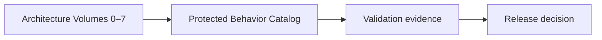
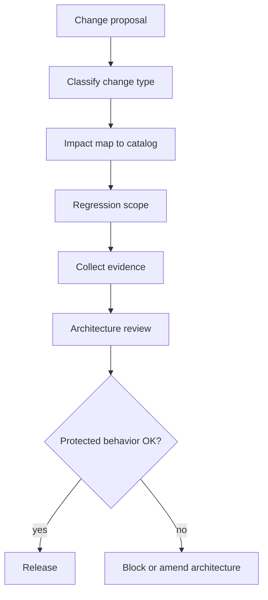
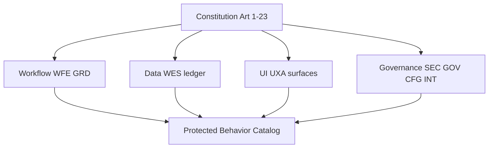
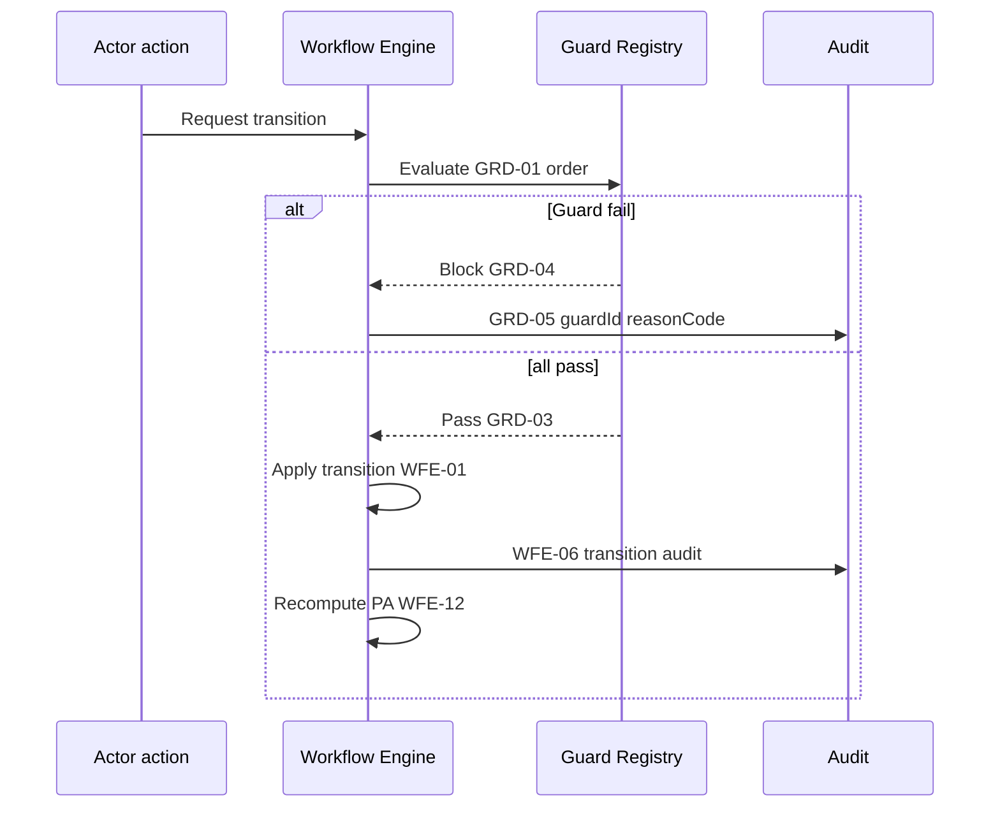
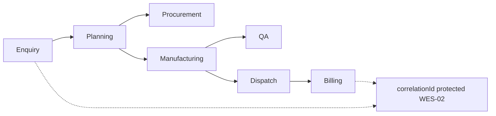
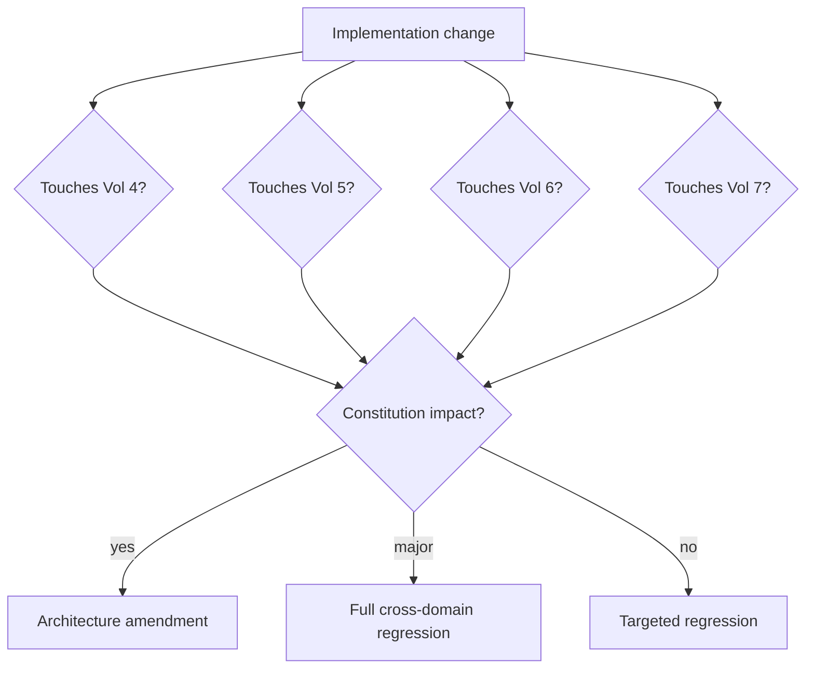
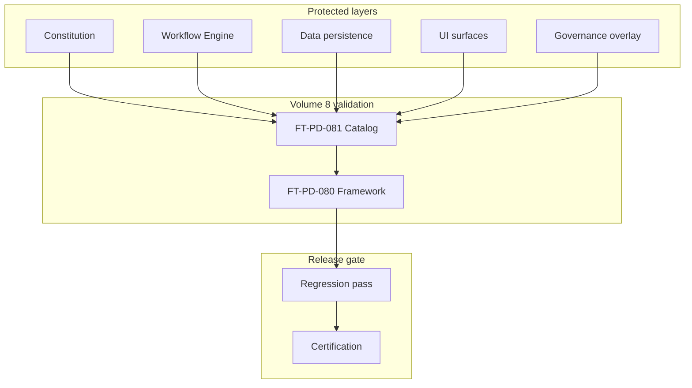

# Workflow Regression Guardrails & Protected Behavior Catalog

| Field | Value |
|-------|-------|
| **Document ID** | FT-PD-081 |
| **Volume** | 8 — Product Testing & Validation |
| **Chapter** | 2 — Workflow Regression Guardrails & Protected Behavior Catalog |
| **Title** | Workflow Regression Guardrails & Protected Behavior Catalog |
| **Version** | 1.0.0 |
| **Status** | Draft — Architecture Review |
| **Effective date** | 2026-05-29 |
| **Author** | FT ERP Product Team |
| **Owner** | FT ERP Product Architecture |
| **Audience** | Product owners, QA architects, workflow engineers, release managers, compliance stewards |
| **Classification** | Product — Validation Architecture |

**Parent documents:**

- [Chapter 1 — Product Testing, Validation & Compliance Framework](./Chapter_01_Product_Testing_Validation_and_Compliance_Framework.md)
- [Volume 1, Ch. 2 — FT ERP Constitution](../01_Product_Foundation/Chapter_02_FT_ERP_Constitution.md)
- [Volume 4, Ch. 1 — Pending Actions Contract](../04_Workflow_Engine/Chapter_01_Workflow_Engine_Overview_and_Pending_Actions_Contract.md)
- [Volume 4, Ch. 2 — Transition Guards Catalog](../04_Workflow_Engine/Chapter_02_Transition_Guards_and_Cross_Domain_Dependency_Catalog.md)
- [Volume 5 — Data Architecture](../05_Data_Architecture/README.md)
- [Volume 6 — UI Architecture](../06_UI_and_Experience_Architecture/README.md)
- [Volume 7 — Security & Governance Architecture](../07_Security_and_Governance_Architecture/README.md)

---

## 1. Document Control

| Version | Date | Author | Summary |
|---------|------|--------|---------|
| 1.0.0 | 2026-05-29 | FT ERP Product Team | Initial Workflow Regression Guardrails & Protected Behavior Catalog |

**Supersedes:** None.

**Change authority:** Product Architecture. Modifications to protected behaviors require Constitution impact assessment when applicable ([PBL-02](#11-business-rules)).

**Out of scope:** Test scripts, CI/CD pipelines, framework-specific testing, implementation code, guard semantic redefinition.

---

## 2. Purpose

This chapter identifies **architectural behaviors that must never regress** as FT ERP evolves.

It specifies:

- Protected **business**, **workflow**, **data**, **security**, **UI**, and **governance** behaviors
- **Regression ownership** and **architecture change impact** rules
- Catalogs and matrices linking protection to Volumes 0–7

The objective is to ensure future development **never silently changes** established product semantics.

---

## 3. Scope

### 3.1 In scope

- Regression philosophy (§5)
- Protected behavior categories (§6)
- Workflow guardrail catalog — **references published IDs only** (§7)
- Protected data, UI, governance behaviors (§8–10)
- Regression matrices (§12, §12A–D)
- Business Rules and diagrams (§11, §13)

### 3.2 Out of scope

- Executable test cases and step-by-step scripts
- Redefining guard preconditions or State Machines (Volume 4 authority)
- New Guard IDs — additions require Volume 4 amendment first

### 3.3 Catalog vs architecture authority

| Document | Role |
|----------|------|
| **Volumes 0–7** | Define **what** must be true |
| **Ch. 1 (FT-PD-080)** | Define **how** conformance is validated |
| **This chapter (FT-PD-081)** | Lists **what must not regress** — preservation contract |

---

## 4. Relationship with Previous Volumes

| Volume | Relationship |
|--------|--------------|
| **Vol. 0** | Vision and roadmap — scope boundaries protected |
| **Vol. 1** | Constitution Articles 1–23 — highest protection tier |
| **Vol. 2** | Pipelines, ownership — REGULAR/NO_QTY separation |
| **Vol. 3** | Domain behavior — source for Guard Registry entries ([GRD-09](../04_Workflow_Engine/Chapter_02_Transition_Guards_and_Cross_Domain_Dependency_Catalog.md)) |
| **Vol. 4** | WFE-*, GRD-*, reason codes — **semantic authority** |
| **Vol. 5** | WES-*, ledger, snapshot immutability |
| **Vol. 6** | UXA-*, surface triad |
| **Vol. 7** | SEC-*, IDN-*, GOV-*, CFG-*, INT-* |
| **Vol. 8, Ch. 1** | VAL-* rules; regression strategy §9 |

### 4.1 Guardrails preserve architecture — not implementation

Regression guardrails protect **product semantics**. A refactor that preserves behavior passes regression; a refactor that weakens a guard **fails** regardless of code quality.

---

## 5. Regression Philosophy

| Principle | Definition |
|-----------|------------|
| **Architecture preservation** | Canonical semantics outlive any single release |
| **Protected behavior** | Explicitly cataloged — not implied |
| **Backward compatibility** | Closed transactions and audit remain interpretable |
| **Explicit architectural change** | Behavior change requires documented amendment — not drift |
| **Repeatable validation** | Same protected rule → same evidence type |
| **Evidence-based regression** | Pass/fail tied to objective artifacts |
| **Controlled evolution** | Enhancement within boundaries — not silent semantic shift |

### 5.1 Change type distinctions (never interchangeable)

| Type | Definition | Protected behavior impact |
|------|------------|---------------------------|
| **Bug fix** | Restore intended architecture behavior | Regression confirms fix — no weakening |
| **Enhancement** | New capability within architecture bounds | New validation — existing guards unchanged |
| **Behavioral change** | Observable difference for same action | **Architectural review required** |
| **Architectural change** | Volume or Constitution amendment | Full impact map + regression expansion |

---

## 6. Protected Behavior Categories

| Category | Purpose | Protection rationale | Regression evidence | Approval requirement |
|----------|---------|---------------------|---------------------|-------------------|
| **FT ERP Constitution** | Non-negotiable product laws | Customer trust, factory operability | Article conformance checklist (§12D) | Product Architecture + Product Owner |
| **Workflow Engine** | Valid transitions only | ERP drives factory ([Art. 3](../01_Product_Foundation/Chapter_02_FT_ERP_Constitution.md)) | WFE-*, GRD-* validation traces | Workflow Engineering Lead |
| **Data Architecture** | Immutable history, ledger truth | Audit and compliance | WES-* samples, ledger trace | Data Architecture Lead |
| **UI Architecture** | Surface responsibilities | Role clarity, no execution leakage | UXA-* scenario evidence | Product / UX Lead |
| **Security** | Auth, RBAC, SoD overlay | Governance without semantic drift | SEC-* rule checks | Security Lead |
| **Governance** | Audit, config, delegation | Accountability and evidence | GOV-*, CFG-*, IDN-* checks | Compliance Officer |
| **Integration** | External trust boundaries | No external state authority | INT-* integration audit | Integration Lead |

---

## 7. Workflow Guardrail Catalog

This catalog **references published Guard and engine rules** from Volume 4. It does **not** redefine Guard semantics. Full precondition definitions remain in [Volume 4, Ch. 2](../04_Workflow_Engine/Chapter_02_Transition_Guards_and_Cross_Domain_Dependency_Catalog.md).

### 7.1 Engine contract (protected)

| Rule ID | Protected behavior | Regression evidence |
|---------|-------------------|---------------------|
| [WFE-01](../04_Workflow_Engine/Chapter_01_Workflow_Engine_Overview_and_Pending_Actions_Contract.md) | Only Workflow Engine changes authoritative workflow state | Direct state mutation attempt blocked |
| [WFE-02](../04_Workflow_Engine/Chapter_01_Workflow_Engine_Overview_and_Pending_Actions_Contract.md) | Pending Actions engine-generated only | Dashboard count matches engine API |
| [WFE-04](../04_Workflow_Engine/Chapter_01_Workflow_Engine_Overview_and_Pending_Actions_Contract.md) | Workspace writes through engine — no Guard bypass | Guard failure on invalid write |
| [WFE-06](../04_Workflow_Engine/Chapter_01_Workflow_Engine_Overview_and_Pending_Actions_Contract.md) | Every transition auditable | Audit entry on success and Guard fail |
| [WFE-07](../04_Workflow_Engine/Chapter_01_Workflow_Engine_Overview_and_Pending_Actions_Contract.md) | Guards fail closed | Ambiguous guard blocks |
| [WFE-11](../04_Workflow_Engine/Chapter_01_Workflow_Engine_Overview_and_Pending_Actions_Contract.md) | Customer PO never workflow document | No PA on customer PO ref |
| [WFE-12](../04_Workflow_Engine/Chapter_01_Workflow_Engine_Overview_and_Pending_Actions_Contract.md) | Pending Actions recompute after transition | PA set matches post-transition state |
| [WFE-14](../04_Workflow_Engine/Chapter_01_Workflow_Engine_Overview_and_Pending_Actions_Contract.md) | Art. 20 changes ownerRole only — not Guard truth | Config ownership change — guards unchanged |

### 7.2 Guard Registry contract (protected)

| Rule ID | Protected behavior | Regression evidence |
|---------|-------------------|---------------------|
| [GRD-01](../04_Workflow_Engine/Chapter_02_Transition_Guards_and_Cross_Domain_Dependency_Catalog.md) | Deterministic Guard order | Same action → same Guard sequence |
| [GRD-03](../04_Workflow_Engine/Chapter_02_Transition_Guards_and_Cross_Domain_Dependency_Catalog.md) | Transition only after all guards pass | Blocked transition — state unchanged |
| [GRD-04](../04_Workflow_Engine/Chapter_02_Transition_Guards_and_Cross_Domain_Dependency_Catalog.md) | Stop on first blocking Guard | First failure reason recorded |
| [GRD-05](../04_Workflow_Engine/Chapter_02_Transition_Guards_and_Cross_Domain_Dependency_Catalog.md) | Guard failure auditable with `guardId` + `reasonCode` | Audit sample on forced fail |
| [GRD-06](../04_Workflow_Engine/Chapter_02_Transition_Guards_and_Cross_Domain_Dependency_Catalog.md) | Stable `reasonCode` values | Reason code registry unchanged without version bump |
| [GRD-07](../04_Workflow_Engine/Chapter_02_Transition_Guards_and_Cross_Domain_Dependency_Catalog.md) | Cross-domain guards read-only on foreign state | No foreign aggregate mutation |
| [GRD-08](../04_Workflow_Engine/Chapter_02_Transition_Guards_and_Cross_Domain_Dependency_Catalog.md) | Shared Guard Registry across surfaces | UI/API/batch same outcome |
| [GRD-12](../04_Workflow_Engine/Chapter_02_Transition_Guards_and_Cross_Domain_Dependency_Catalog.md) | PA recompute on successful transition | PA update after pass |

### 7.3 Protected workflow behaviors (catalog)

| Behavior | Authority | Regression focus |
|----------|-----------|------------------|
| **Guard evaluation** | GRD-01–GRD-12 | Order, fail-closed, audit on fail |
| **State transitions** | Vol. 4 State Machines | Only registered transitions |
| **Pending Action materialization** | WFE-02, WFE-12 | Engine-only PA source |
| **Ownership transfer** | WFE-14, Art. 10, Art. 20 | `ownerRole` on PA — config may remap |
| **Correlation preservation** | WES-02 | `correlationId` immutable from enquiry |
| **Audit generation** | WFE-06, GRD-05 | Transition and guard-fail audit |
| **Cross-domain orchestration** | Vol. 4 Ch. 9, ORCH rules | Event order, idempotent consumers |
| **REGULAR / NO_QTY convergence** | Art. 8 | Post-WO single execution pipeline |

### 7.4 Representative protected reason codes (reference only)

The following published `reasonCode` values from Volume 4 Ch. 2 must remain **stable** ([GRD-06](../04_Workflow_Engine/Chapter_02_Transition_Guards_and_Cross_Domain_Dependency_Catalog.md)). Semantics are **not** redefined here:

`BM_MISMATCH`, `BM_IMMUTABLE`, `POOL_MIXED`, `PLANNING_FROZEN`, `PO_WITHOUT_PR`, `GRN_QTY_EXCEEDS_PO`, `MR_NOT_PUBLISHED` — and full catalog in Volume 4 Ch. 2.

---

## 8. Protected Data Behaviors

| Protected behavior | Rule reference | Regression evidence |
|--------------------|----------------|---------------------|
| **Event Store immutability** | [WES-01](../05_Data_Architecture/Chapter_01_Workflow_Event_Store_and_Correlation_Persistence.md) | No update/delete of published events |
| **Audit immutability** | [WES-03](../05_Data_Architecture/Chapter_01_Workflow_Event_Store_and_Correlation_Persistence.md), [GOV-01](../07_Security_and_Governance_Architecture/Chapter_03_Audit_Compliance_and_Data_Retention_Governance.md) | Append-only audit |
| **Correlation integrity** | [WES-02](../05_Data_Architecture/Chapter_01_Workflow_Event_Store_and_Correlation_Persistence.md) | Root enquiry id unchanged |
| **Snapshot immutability** | Vol. 5 Ch. 4 snapshot rules | Freeze at defined transitions |
| **Ledger immutability** | Vol. 5 Ch. 5 | Movements append-only; no silent adjustment |
| **Historical reconstruction** | [GOV-07](../07_Security_and_Governance_Architecture/Chapter_03_Audit_Compliance_and_Data_Retention_Governance.md), [CFG-04](../07_Security_and_Governance_Architecture/Chapter_04_Configuration_Business_Policies_and_Feature_Flag_Architecture.md) | Policy version at transaction time |
| **Read Model rebuildability** | [WES-04](../05_Data_Architecture/Chapter_01_Workflow_Event_Store_and_Correlation_Persistence.md) | PA rebuild from events |

---

## 9. Protected UI Behaviors

| Surface | Protected behavior | Rule reference |
|---------|-------------------|----------------|
| **Dashboard** | My Work — role-owned Pending Actions only | Art. 13, [WFE-03](../04_Workflow_Engine/Chapter_01_Workflow_Engine_Overview_and_Pending_Actions_Contract.md) |
| **Workspace** | Do Work — engine-backed writes only | Art. 13 companion, WFE-04 |
| **Control Tower** | Monitor Factory — no undeclared execute | Art. 14, [WFE-05](../04_Workflow_Engine/Chapter_01_Workflow_Engine_Overview_and_Pending_Actions_Contract.md) |
| **Registers** | Find Work — open Workspace, no transition | Vol. 6 Ch. 5 |
| **Reports** | Understand Business — non-authoritative for proof | Vol. 6 Ch. 6, [GOV-10](../07_Security_and_Governance_Architecture/Chapter_03_Audit_Compliance_and_Data_Retention_Governance.md) |
| **Navigation integrity** | Surface triad not merged | UXA-06 (Vol. 6 Ch. 1) |
| **Workflow Trail** | Trace from document context | Correlation + event visibility |
| **Pending Action routing** | Deep link to correct Workspace | WFE-02, Art. 12 |

---

## 10. Protected Governance Behaviors

| Area | Protected behavior | Rule reference |
|------|-------------------|----------------|
| **RBAC boundaries** | Authorization never bypasses guards | [SEC-01](../07_Security_and_Governance_Architecture/Chapter_01_Security_Authorization_and_Governance_Architecture.md) |
| **Separation of Duties** | SoD violations blocked or flagged | SEC-09 |
| **Delegation audit** | On-behalf-of visible; no ownership rewrite | [IDN-02](../07_Security_and_Governance_Architecture/Chapter_02_Identity_User_Organization_and_Delegation_Architecture.md), IDN-09 |
| **Configuration boundaries** | Config never changes workflow semantics | [CFG-01](../07_Security_and_Governance_Architecture/Chapter_04_Configuration_Business_Policies_and_Feature_Flag_Architecture.md) |
| **Integration trust boundaries** | External never direct state write | [INT-01](../07_Security_and_Governance_Architecture/Chapter_05_Platform_Integration_and_External_Trust_Boundaries.md) |
| **Compliance evidence** | Authoritative sources for proof | GOV-09, GOV-10 |

---

## 11. Business Rules

| ID | Rule |
|----|------|
| **PBL-01** | **Protected behaviors require architectural review** before modification. |
| **PBL-02** | **Workflow semantics never change** without Constitution impact assessment. |
| **PBL-03** | **Regression evidence is mandatory** for any protected behavior change. |
| **PBL-04** | **Guard IDs and reason codes remain stable** once published — rename requires version bump ([GRD-06](../04_Workflow_Engine/Chapter_02_Transition_Guards_and_Cross_Domain_Dependency_Catalog.md)). |
| **PBL-05** | **Historical correctness is never sacrificed** for optimization or convenience. |
| **PBL-06** | **UI surface responsibilities remain invariant** — Dashboard / Workspace / Control Tower ([Art. 13–14](../01_Product_Foundation/Chapter_02_FT_ERP_Constitution.md)). |
| **PBL-07** | **Regression never weakens governance** ([VAL-03](./Chapter_01_Product_Testing_Validation_and_Compliance_Framework.md)). |
| **PBL-08** | **Bug fixes restore architecture** — they do not introduce new shortcuts past guards. |
| **PBL-09** | **New guards require Volume 4 registry entry** before release ([GRD-09](../04_Workflow_Engine/Chapter_02_Transition_Guards_and_Cross_Domain_Dependency_Catalog.md)). |
| **PBL-10** | **REGULAR and NO_QTY pipelines remain segregated** until Art. 8 convergence ([Art. 6](../01_Product_Foundation/Chapter_02_FT_ERP_Constitution.md)). |
| **PBL-11** | **Material accountability chain is protected** ([Art. 9](../01_Product_Foundation/Chapter_02_FT_ERP_Constitution.md)) — PMR → Issue → Consumption. |
| **PBL-12** | **Core Product protection** — no customer-specific core fork ([Art. 16](../01_Product_Foundation/Chapter_02_FT_ERP_Constitution.md)). |

---

## 12. Regression Matrices

### 12A. Protected Behavior Matrix

| Behavior | Source Volume | Regression Required | Architectural Approval | Constitution Impact |
|----------|---------------|--------------------|------------------------|---------------------|
| **Workflow transitions** | Vol. 4 | Always on workflow touch | Yes — Workflow Lead | Art. 3, 11, 15 |
| **Guard Registry** | Vol. 4 Ch. 2 | Always on Guard touch | Yes — Workflow Lead | Art. 3, 7 |
| **Pending Actions** | Vol. 4 Ch. 1 | Always on PA logic touch | Yes | Art. 12 |
| **Event Store / audit** | Vol. 5 Ch. 1 | Always on persistence touch | Yes — Data Lead | Art. 22 |
| **Ledger / snapshots** | Vol. 5 Ch. 4–5 | On inventory/planning touch | Yes | Art. 7, 9 |
| **UI surface triad** | Vol. 6 | On UI routing touch | Yes — Product/UX | Art. 13, 14 |
| **Security overlay** | Vol. 7 Ch. 1 | On auth/SoD touch | Yes — Security Lead | Art. 22 |
| **Governance / audit** | Vol. 7 Ch. 3 | On retention/audit touch | Yes — Compliance | Art. 22 |
| **Configuration** | Vol. 7 Ch. 4 | On policy/flag touch | Yes | Art. 18, 20 |
| **Integration** | Vol. 7 Ch. 5 | On boundary touch | Yes — Integration Lead | Art. 15, 22 |

### 12B. Regression Trigger Matrix

| Change Type | Regression Scope | Mandatory Validation | Approval Required |
|-------------|------------------|----------------------|-------------------|
| **Bug Fix** | Affected protected behaviors only | Component + workflow spot | Tech lead |
| **Feature** | Domain + cross-domain if touched | Workflow + UI + data sample | Product Architecture |
| **Refactor** | All behaviors in refactor path | Full path regression | Workflow + Data lead |
| **Workflow Change** | Full State Machine + guards | Cross-domain + PA traces | Product Architecture + Constitution check |
| **Configuration Change** | Policy scope + historical replay | CFG rule suite | Tenant governance |
| **Integration Change** | Boundary + correlation | INT rule suite | Integration + Security lead |

### 12C. Guardrail Coverage Matrix

| Architecture Area | Protected Behaviors | Validation Evidence | Regression Owner |
|-------------------|--------------------|-----------------------|------------------|
| **Vol. 0 — Vision** | Scope boundaries, manufacturing-native | Vision alignment review | Product Owner |
| **Vol. 1 — Constitution** | Articles 1–23 | §12D matrix | Product Architecture |
| **Vol. 2 — Business** | REGULAR/NO_QTY, ownership | Pipeline walkthrough | Business analysts |
| **Vol. 3 — Domains** | Document behavior | Domain packs | Domain leads |
| **Vol. 4 — Workflow** | WFE-*, GRD-*, orchestration | Event + PA traces | Workflow QA |
| **Vol. 5 — Data** | WES-*, ledger, snapshots | Persistence samples | Data QA |
| **Vol. 6 — UI** | UXA-*, surface triad | UI scenarios | UX / QA |
| **Vol. 7 — Governance** | SEC/GOV/CFG/INT/IDN | Governance suite | Security / Compliance |

### 12D. Constitution Traceability Matrix

| Constitution Article | Protected Behaviors | Validation Evidence | Regression Trigger | Approval Level |
|---------------------|--------------------|-----------------------|--------------------|----------------|
| **Art. 1 — Manufacturing Reality** | BOM/RM/shop-floor aligned domains | Domain review checklist | Manufacturing domain change | Product Architecture |
| **Art. 2 — Business First** | Requirements trace to roles/docs | Traceability review | Any workflow-touching change | Product Architecture |
| **Art. 3 — ERP Drives Factory** | Blocks invalid transitions | Guard block samples | Guard/workflow change | Workflow Lead |
| **Art. 4 — Business Model at Enquiry** | Two models only at Enquiry | Enquiry capture validation | Commercial workflow change | Product Owner |
| **Art. 5 — Model Inheritance** | Immutable BM on chain | `BM_IMMUTABLE` guard evidence | Commercial/planning change | Product Architecture |
| **Art. 6 — Two Pipelines** | REGULAR ≠ NO_QTY planning | `BM_MISMATCH`, `POOL_MIXED` samples | Planning/procurement change | Process owners |
| **Art. 7 — Planning ≠ Execution** | Freeze before execute | Snapshot/PMR freeze evidence | Planning/execution change | Store + Production leads |
| **Art. 8 — Common Execution** | Post-WO single pipeline | WO→Dispatch trace | Manufacturing change | Workflow Lead |
| **Art. 9 — Material Accountability** | PMR→Issue→Consumption | Material chain audit | Issue/consumption change | Data + Workflow leads |
| **Art. 10 — Document Ownership** | Default owner on PA | Ownership matrix check | Ownership mapping change | Product Architecture |
| **Art. 11 — Workflow Before Screens** | No screen-only transitions | WFE-04 validation | UI write path change | UX + Workflow leads |
| **Art. 12 — Pending Actions** | Engine-only PA | WFE-02 count match | PA projection change | Workflow Lead |
| **Art. 13 — Dashboard = My Work** | Role-filtered PA | Dashboard scenario | Dashboard change | UX Lead |
| **Art. 14 — Control Tower** | Monitor-only execute | WFE-05 validation | CT widget change | UX Lead |
| **Art. 15 — ERP Documents Drive WF** | No external state advance | WFE-11, customer PO check | Integration/commercial change | Product Architecture |
| **Art. 16 — Core Protection** | No customer core fork | Release classification review | Any core-touching change | Product Owner |
| **Art. 17 — Modular Architecture** | Layer classification | Module boundary review | New module proposal | Architecture board |
| **Art. 18 — Config Before Custom** | Configuration-first path | CFG lifecycle evidence | Customization request | Product Architecture |
| **Art. 19 — Customization Last** | Extension points only | Extension review | Custom code proposal | Architecture board |
| **Art. 20 — Configurable Responsibility** | Who not what | WFE-14 validation | Ownership config change | Product Architecture |
| **Art. 21 — Architecture Before Dev** | Doc before code | Change map present | Any feature start | Product Architecture |
| **Art. 22 — Auditability** | Append-only audit | GOV-01 evidence | Audit/retention change | Compliance Officer |
| **Art. 23 — Continuous Evolution** | Revalidation on release | Release regression pack | Major release | Product Architecture |

#### 12D.1 Evidence type distinctions

| Type | Definition |
|------|------------|
| **Constitution requirement** | Article law in Vol. 1 Ch. 2 |
| **Workflow requirement** | WFE-*, GRD-*, State Machine in Vol. 4 |
| **Validation requirement** | Evidence type in FT-PD-080 |
| **Regression evidence** | Objective artifact proving protection held |

---

## 13. Logical Diagrams

### 13.1 Regression architecture

### 13.2 Protected behavior hierarchy

### 13.3 Workflow guardrail flow

### 13.4 Cross-domain regression coverage

### 13.5 Architecture impact analysis

### 13.6 Protected behavior ecosystem

---

## 14. Review Checklist

- [ ] Protected behavior coverage — §6, §12A, §12C
- [ ] Workflow protection — §7, WFE-*, GRD-* referenced not redefined
- [ ] Data protection — §8, WES-*
- [ ] Governance protection — §10, SEC/GOV/CFG/INT
- [ ] UI protection — §9, Art. 13–14
- [ ] Constitution alignment — §12D all 23 Articles
- [ ] Concept distinctions — §5.1, §12D.1
- [ ] Six Mermaid diagrams
- [ ] No test scripts, CI/CD, or code

---

## 15. Change Log

| Version | Date | Author | Summary |
|---------|------|--------|---------|
| 1.0.0 | 2026-05-29 | FT ERP Product Team | Initial Workflow Regression Guardrails & Protected Behavior Catalog |

---

## 16. Approval Block

| Role | Name | Signature | Date |
|------|------|-----------|------|
| Product Owner | | | |
| Product Architecture | | | |
| Workflow Engineering Lead | | | |
| Validation / QA Lead | | | |
| Compliance Officer | | | |

---

## Writing Requirements

Remain **technology-neutral**.

**Do not include:** Test scripts, CI/CD pipelines, framework-specific testing, implementation code.

**Clearly distinguish:** Protected behavior, Regression test, Architectural change, Functional enhancement, Bug fix.

**Reference published Guard IDs only** — do not redefine workflow semantics.

---

## Document navigation

| | Link |
|--|------|
| **Previous** | [Product Testing, Validation & Compliance Framework](./Chapter_01_Product_Testing_Validation_and_Compliance_Framework.md) (FT-PD-080) |
| **Next** | [Canonical Test Data, Factory Simulation & Acceptance Scenarios](./Chapter_03_Canonical_Test_Data_Factory_Simulation_and_Acceptance_Scenarios.md) (FT-PD-082) |
| **Volume** | [Product Testing and Validation](./README.md) |
| **Product** | [Product Documentation Index](../README.md) |

