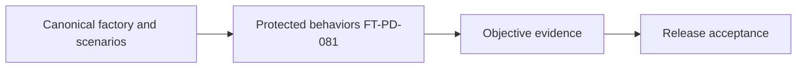
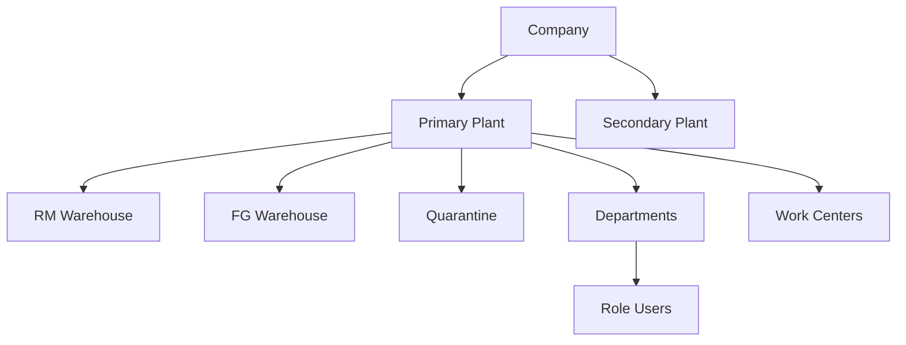
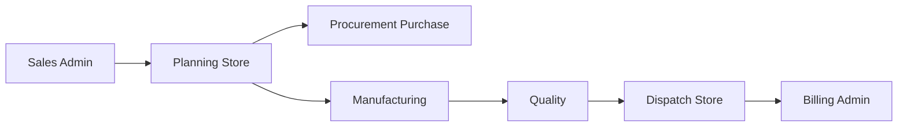
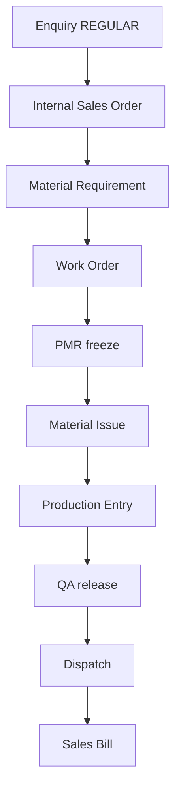
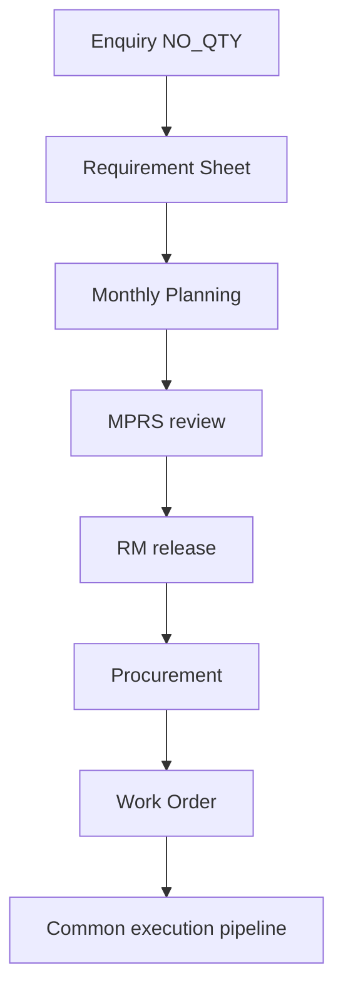
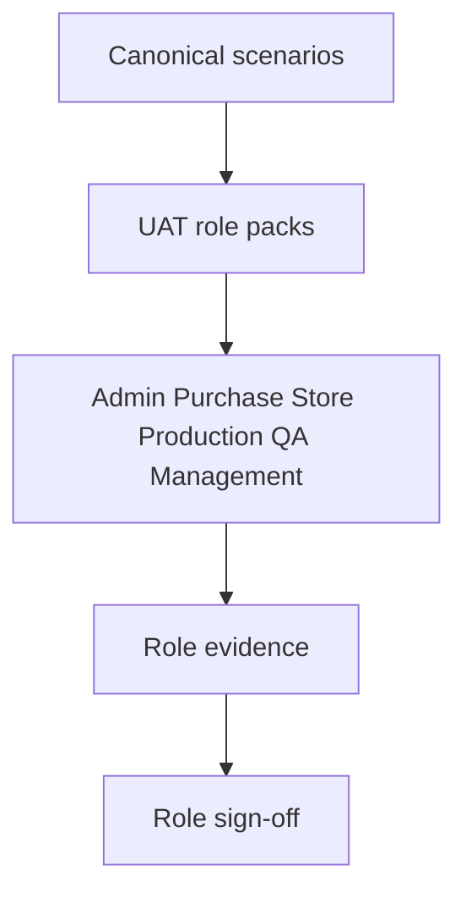
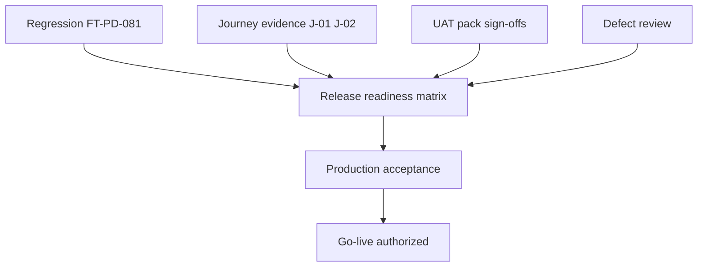

# Canonical Test Data, Factory Simulation & Acceptance Scenarios

| Field | Value |
|-------|-------|
| **Document ID** | FT-PD-082 |
| **Volume** | 8 — Product Testing & Validation |
| **Chapter** | 3 — Canonical Test Data, Factory Simulation & Acceptance Scenarios |
| **Title** | Canonical Test Data, Factory Simulation & Acceptance Scenarios |
| **Version** | 1.0.0 |
| **Status** | Draft — Architecture Review |
| **Effective date** | 2026-05-29 |
| **Author** | FT ERP Product Team |
| **Owner** | FT ERP Product Architecture |
| **Audience** | QA architects, pilot leads, UAT coordinators, product owners, implementation partners |
| **Classification** | Product — Validation Architecture |

**Parent documents:**

- [Chapter 1 — Product Testing, Validation & Compliance Framework](./Chapter_01_Product_Testing_Validation_and_Compliance_Framework.md)
- [Chapter 2 — Workflow Regression Guardrails & Protected Behavior Catalog](./Chapter_02_Workflow_Regression_Guardrails_and_Protected_Behavior_Catalog.md)
- [Volume 2 — Business Architecture](../02_Business_Architecture/README.md)
- [Volume 3 — Domain Specifications](../03_Domain_Specifications/README.md)
- [Volume 4 — Workflow Engine](../04_Workflow_Engine/README.md)
- [Volume 5 — Data Architecture](../05_Data_Architecture/README.md)
- [Volume 6 — UI Architecture](../06_UI_and_Experience_Architecture/README.md)
- [Volume 7 — Security & Governance Architecture](../07_Security_and_Governance_Architecture/README.md)

---

## 1. Document Control

| Version | Date | Author | Summary |
|---------|------|--------|---------|
| 1.0.0 | 2026-05-29 | FT ERP Product Team | Initial Canonical Test Data, Factory Simulation & Acceptance Scenarios |

**Supersedes:** None.

**Change authority:** Product Architecture + Validation Governance. Canonical scenario changes require FT-PD-081 protected behavior review when workflows are affected.

**Out of scope:** SQL, test scripts, API examples, automation frameworks, CI/CD pipelines, source code, per-field test steps.

---

## 2. Purpose

This chapter defines the **canonical validation environment** used across all FT ERP product testing.

It specifies:

- **Reference factory** master data structure
- **Canonical datasets** and simulation models
- **End-to-end workflow scenarios** and cross-domain journeys
- **UAT reference packs** by role
- **Defect severity model**
- **Production acceptance criteria**

The objective is to ensure **every FT ERP release** is validated using **identical business scenarios and evidence** — validating architecture and protected behaviors ([FT-PD-081](./Chapter_02_Workflow_Regression_Guardrails_and_Protected_Behavior_Catalog.md)), not implementation internals.

---

## 3. Scope

### 3.1 In scope

- Validation factory philosophy (§5)
- Canonical factory definition — structure only (§6)
- Business scenarios (§7)
- Cross-domain journeys (§8)
- UAT reference packs (§9)
- Defect classification (§10)
- Production acceptance (§11)
- Validation matrices (§13, §12A–D)
- Business Rules and diagrams (§12, §14)

### 3.2 Out of scope

- Customer production data and tenant-specific masters
- Demo/training datasets not tied to validation evidence
- Executable test plans and automation configuration
- Redefining workflow semantics or Guard IDs

### 3.3 Canonical data vs customer data

| Type | Use |
|------|-----|
| **Canonical validation data** | Release regression, certification, architecture proof |
| **Sample data** | Ad-hoc exploration — not release evidence |
| **Demonstration data** | Sales/training — not conformance proof |
| **Customer production data** | Live factory — pilot only; not product canonical standard |

---

## 4. Relationship with Previous Volumes

| Volume | Relationship |
|--------|--------------|
| **Vol. 0–1** | Vision and Constitution — scenarios prove Articles 4–9, 13–15 |
| **Vol. 2** | REGULAR and NO_QTY pipelines — journey templates |
| **Vol. 3** | Domain documents exercised per scenario |
| **Vol. 4** | State transitions and Guards validated — IDs referenced not redefined |
| **Vol. 5** | Masters, ledger, snapshots — dataset structure |
| **Vol. 6** | UAT packs align to Dashboard / Workspace / Control Tower |
| **Vol. 7** | Security, governance, integration scenarios in acceptance |
| **Vol. 8, Ch. 1** | VAL-* framework — evidence and gates |
| **Vol. 8, Ch. 2** | PBL-* protected behaviors — scenario coverage map |

### 4.1 Canonical datasets validate protected behaviors

Scenarios are designed to **exercise** published WFE-*, GRD-*, WES-*, and Constitution behaviors — not to test database layout or API shape.

---

## 5. Validation Factory Philosophy

| Principle | Definition |
|-----------|------------|
| **Repeatable validation** | Same scenario definition → comparable evidence across releases |
| **Deterministic datasets** | Known masters and quantities — reproducible outcomes |
| **Business realism** | Discrete manufacturing patterns — BOM, RM shortage, QA hold |
| **Cross-domain consistency** | Single `correlationId` chains — not isolated module tests |
| **Production representativeness** | Roles, plants, and document volumes reflect mid-market factory |
| **Architecture verification** | Scenarios map to Volumes 0–7 — not ad-hoc features |
| **Evidence reproducibility** | Event Store trace, audit sample, ledger movement per journey |

### 5.1 Data type distinctions (never interchangeable)

| Type | Purpose | Release evidence? |
|------|---------|-------------------|
| **Sample data** | Quick manual checks | No |
| **Demonstration data** | Training, demos | No |
| **Canonical validation data** | Product certification standard | **Yes** |
| **Customer production data** | Pilot/UAT at site | Pilot acceptance only |

---

## 6. Canonical Factory Definition

The **reference manufacturing organization** is a logical structure — implementation assigns identifiers; this chapter defines **what must exist**, not coded values.

### 6.1 Organization structure

| Entity | Canonical content |
|--------|-------------------|
| **Company** | One primary legal entity; optional second for multi-company readiness |
| **Plants** | Primary manufacturing plant; secondary plant for stock transfer scenarios |
| **Warehouses** | RM store, production floor location, FG store, quarantine/reject location |
| **Production lines** | At least one line with work center association |
| **Departments** | Commercial, Store, Purchase, Production, QA |
| **Work centers** | Molding/assembly center linked to production entries |

### 6.2 People and access

| Entity | Canonical content |
|--------|-------------------|
| **Users** | One active user per standard role minimum |
| **Roles** | Admin, Store, Purchase, Production, QA; Management monitor user |

### 6.3 Business partners and product

| Entity | Canonical content |
|--------|-------------------|
| **Customers** | REGULAR-order customer; NO_QTY agreement customer |
| **Suppliers** | RM supplier with approved status; alternate for PO comparison |
| **Items** | RM items, SFG (if used), FG items, consumables, scrap categories |
| **BOMs** | Approved multi-level BOM for primary FG; draft BOM for negative test; revised BOM for engineering-change scenario |

### 6.4 Simulation parameters

| Parameter | Purpose |
|-----------|---------|
| **Opening stock** | RM on-hand, reserved, and free buckets for issue scenarios |
| **Planning buffers** | REGULAR buffer qty; NO_QTY monthly plan cycle |
| **Policy defaults** | Product-standard ownership; optional Art. 20 override scenario |

**Rule:** Canonical factory is **versioned with product releases** — changes require validation impact assessment ([CAN-07](#12-business-rules)).

---

## 7. Canonical Business Scenarios

Each scenario specifies **business intent**, **domains touched**, and **protected behaviors exercised** — not step-by-step scripts.

### 7.1 REGULAR Sales Order — order-to-cash

| Element | Description |
|---------|-------------|
| **Intent** | Fixed-quantity commercial order through fulfillment and billing |
| **Flow** | Enquiry (REGULAR) → Feasibility → Quotation → ISO → planning MR → procurement as needed → WO → PMR → Issue → Production Entry → QA → Dispatch → Sales Bill |
| **Protected behaviors** | Art. 4–5, Art. 8–9, WES-02 correlation, material accountability chain |
| **Evidence** | Full `correlationId` trace; ledger movements; bill finalize audit |

### 7.2 NO_QTY Sales Agreement — planning-driven lifecycle

| Element | Description |
|---------|-------------|
| **Intent** | Agreement without fixed order qty — cycle planning and MPRS procurement |
| **Flow** | Enquiry (NO_QTY) → commercial chain → Requirement Sheet → monthly planning → MPRS review → RM release → procurement → execution convergence at WO |
| **Protected behaviors** | Art. 6 pipeline separation, `POOL_MIXED` firewall, planning freeze |
| **Evidence** | Distinct planning artifacts; NO_QTY demand pool segregation |

### 7.3 Procurement — PR → PO → GRN

| Element | Description |
|---------|-------------|
| **Intent** | Material supply from approved demand |
| **Flow** | MR-approved demand → PR → approve → PO → activate → GRN post to location |
| **Protected behaviors** | `PO_WITHOUT_PR`, `GRN_QTY_EXCEEDS_PO`, planning-driven Guard when enabled |
| **Evidence** | Procurement audit; stock ledger receipt |

### 7.4 Material Issue — PMR → Issue

| Element | Description |
|---------|-------------|
| **Intent** | Issue RM against frozen PMR |
| **Flow** | WO → PMR submit/freeze → Material Issue from store location to production |
| **Protected behaviors** | Art. 9, snapshot vs live BOM, PMR immutability |
| **Evidence** | Issue ledger; PMR snapshot reference |

### 7.5 Production — WO → Production Entry

| Element | Description |
|---------|-------------|
| **Intent** | Record output against issued material |
| **Flow** | Production Entry post within issued balance |
| **Protected behaviors** | Consumption vs issue variance; WFE ownership Production |
| **Evidence** | PE audit; RM consumption trace |

### 7.6 QA — inspection and disposition

| Element | Description |
|---------|-------------|
| **Intent** | Quality release or reject/scrap path |
| **Flow** | QA Inspection → accept / reject / scrap disposition |
| **Protected behaviors** | QA ownership; dispatch gate on release |
| **Evidence** | Disposition audit; FG or scrap ledger |

### 7.7 Dispatch → Billing

| Element | Description |
|---------|-------------|
| **Intent** | Fulfill order and commercial completion |
| **Flow** | Dispatch post → Sales Bill finalize → optional accounting handoff |
| **Protected behaviors** | Art. 15 ERP documents; INT-01 if integration enabled |
| **Evidence** | Dispatch + bill correlation; integration audit if applicable |

### 7.8 Inventory — RM, FG, rejected, scrap

| Scenario | Intent |
|----------|--------|
| **RM** | Free vs reserved buckets; replenishment trigger |
| **FG** | Receipt from production; dispatch deduction |
| **Rejected** | Quarantine location; blocked dispatch |
| **Scrap** | Authorized scrap posting; audit trail |

### 7.9 Rework journey

| Element | Description |
|---------|-------------|
| **Intent** | Non-conforming material returned to production path |
| **Flow** | QA reject → rework WO or return note → re-issue → re-produce → re-inspect |
| **Protected behaviors** | Material return accountability; no silent stock adjustment |
| **Evidence** | Return + re-issue ledger chain |

### 7.10 Engineering change — product revision

| Element | Description |
|---------|-------------|
| **Intent** | BOM revision does not retroactively alter frozen execution |
| **Flow** | New BOM revision approved → new WO uses new revision → existing PMR validates against freeze |
| **Protected behaviors** | SIR-04 / snapshot integrity (Vol. 5 Ch. 4); CFG-04 historical policy |
| **Evidence** | PMR snapshot BOM revision vs live BOM comparison |

---

## 8. Cross-Domain Validation Journeys

Complete journeys span roles and domains — **orchestration validation**, not isolated module tests.

| Journey ID | Name | Domains | Roles | Orchestration focus |
|------------|------|---------|-------|-------------------|
| **J-01** | REGULAR order-to-cash | Commercial → Planning → Procurement → Mfg → QA → Dispatch → Billing | All standard | Vol. 4 Ch. 9 event order |
| **J-02** | NO_QTY cycle-to-procurement | Commercial → Planning → Procurement → Mfg | Store, Purchase, Admin | Pipeline firewall |
| **J-03** | Shortage-driven procurement | Planning → Procurement → Store | Store, Purchase | MR → PR guard chain |
| **J-04** | Production readiness block | Planning → Mfg | Store, Production | Issue before PE guard |
| **J-05** | QA hold release | Mfg → QA → Dispatch | Production, QA, Store | Dispatch without QA blocked |
| **J-06** | Delegation acting | Any approval step | Manager + delegate | IDN-09 on-behalf-of audit |
| **J-07** | Integration publish | Billing → external | Admin | INT-01 no external state write |
| **J-08** | Multi-plant stock | Inventory → Mfg | Store | Plant scope and ledger |

**Success criterion:** Each journey produces one **correlation-rooted evidence pack** with Event Store sequence, audit sample, and ledger excerpts ([VAL-08](./Chapter_01_Product_Testing_Validation_and_Compliance_Framework.md)).

---

## 9. User Acceptance Testing Reference Packs

UAT packs define **what role holders must confirm** — not executable scripts.

### 9.1 Sales / Commercial (Admin)

| Field | Content |
|-------|---------|
| **Objective** | Commercial chain and ISO ownership |
| **Scope** | Enquiry through ISO commit; REGULAR and NO_QTY entry |
| **Expected evidence** | Dashboard commercial PA; ISO workflow trace |
| **Success criteria** | Business Model correct at Enquiry; no Customer PO workflow object |

### 9.2 Purchase

| Field | Content |
|-------|---------|
| **Objective** | Procurement execution and MPRS review (NO_QTY) |
| **Scope** | PR, PO, GRN; supplier follow-up |
| **Expected evidence** | Approval audit; GRN location posting |
| **Success criteria** | Cannot create PO without approved PR; GRN within PO balance |

### 9.3 Store

| Field | Content |
|-------|---------|
| **Objective** | Planning, issue, dispatch accountability |
| **Scope** | MR, WO, PMR, Issue, Dispatch |
| **Expected evidence** | Material chain Art. 9; snapshot freeze |
| **Success criteria** | Issue matches PMR; dispatch aligns reservation |

### 9.4 Production

| Field | Content |
|-------|---------|
| **Objective** | Production Entry within issued material |
| **Scope** | PE post, consumption variance |
| **Expected evidence** | PE audit; consumption vs issue |
| **Success criteria** | Cannot post PE beyond issued balance without policy path |

### 9.5 QA

| Field | Content |
|-------|---------|
| **Objective** | Inspection and disposition authority |
| **Scope** | Accept, reject, scrap |
| **Expected evidence** | Disposition audit; FG/scrap ledger |
| **Success criteria** | Dispatch blocked until QA release path satisfied |

### 9.6 Admin

| Field | Content |
|-------|---------|
| **Objective** | Commercial completion and billing |
| **Scope** | Sales Bill finalize; master maintenance gates |
| **Expected evidence** | Bill audit; SEC-13 master permission |
| **Success criteria** | Bill correlates to dispatch/commercial chain |

### 9.7 Management

| Field | Content |
|-------|---------|
| **Objective** | Factory monitor without undeclared execute |
| **Scope** | Control Tower visibility |
| **Expected evidence** | CT rows match engine; WFE-05 no rogue execute |
| **Success criteria** | Monitor and escalate only — Workspace for execution |

---

## 10. Defect Classification Model

| Severity | Business impact | Architecture impact | Release impact | Acceptance policy |
|----------|-----------------|---------------------|----------------|-------------------|
| **Critical** | Blocks core workflow; data integrity risk | Violates Constitution or PBL protected behavior | **Block release** | Fix required; regression evidence |
| **High** | Major domain blocked; incorrect ownership or Guard | Weakens WFE/GRD/SEC rule | **Block release** unless formal waiver with expiry |
| **Medium** | Workaround exists; localized incorrect behavior | Partial architecture drift | Release with documented remediation plan |
| **Low** | Minor incorrect label, non-blocking UX | None on core semantics | Release; backlog fix |
| **Cosmetic** | Visual only; no behavioral difference | None | Release; optional fix |

**Rule:** Any defect classified **Critical** or **High** that touches protected behaviors ([FT-PD-081](./Chapter_02_Workflow_Regression_Guardrails_and_Protected_Behavior_Catalog.md)) requires **Product Architecture** review before waiver ([CAN-06](#12-business-rules)).

---

## 11. Production Acceptance Criteria

Release readiness requires evidence from **all** areas — minimum criteria reference [VAL-06](./Chapter_01_Product_Testing_Validation_and_Compliance_Framework.md) and protected behaviors in FT-PD-081.

| Area | Requirement |
|------|-------------|
| **Workflow validation** | J-01 and J-02 complete; domain happy + exception samples |
| **Data validation** | WES-01–03 samples; ledger movement chain |
| **Security validation** | SEC-01, SEC-09, RBAC spot checks per role |
| **UI validation** | Dashboard/Workspace/CT per role UAT packs |
| **Integration validation** | If enabled — INT-01 boundary proof |
| **Performance validation** | Agreed factory load profile — architecture-neutral thresholds |
| **Governance validation** | Audit append-only; delegation visible; config versioned |

**Acceptance:** Aggregated evidence pack + signed §12D Release Readiness Matrix — not verbal sign-off alone ([VAL-05](./Chapter_01_Product_Testing_Validation_and_Compliance_Framework.md)).

---

## 12. Business Rules

| ID | Rule |
|----|------|
| **CAN-01** | **Canonical scenarios are the product validation standard** — releases compared against same journeys. |
| **CAN-02** | **REGULAR and NO_QTY journeys are both mandatory** before production acceptance. |
| **CAN-03** | **Cross-domain journeys take precedence** over isolated module-only validation. |
| **CAN-04** | **Evidence must include correlation trace** for business flows ([VAL-08](./Chapter_01_Product_Testing_Validation_and_Compliance_Framework.md)). |
| **CAN-05** | **UAT packs confirm role surfaces** — not substitute for architecture regression. |
| **CAN-06** | **Critical/High protected-behavior defects block release** without architecture approval. |
| **CAN-07** | **Canonical factory changes are versioned** — impact assessment required. |
| **CAN-08** | **Customer production data is not canonical** — pilot evidence supplements, not replaces. |
| **CAN-09** | **Scenarios exercise published guards** — do not invent new expected transitions. |
| **CAN-10** | **Production acceptance requires J-01 evidence pack** at minimum. |
| **CAN-11** | **Defect severity is architecture-aware** — governance violations default High minimum. |
| **CAN-12** | **Demonstration datasets must not be used** for certification evidence. |

---

## 13. Validation Matrices

### 12A. Scenario Coverage Matrix

| Business Scenario | Domains Covered | Protected Behaviors | Evidence Required |
|-------------------|-----------------|---------------------|-------------------|
| REGULAR order-to-cash | Commercial, Planning, Prc, Mfg, QA, Dispatch, Billing | Art. 4–5, 8–9; WES-02 | Full correlation trace |
| NO_QTY agreement cycle | Commercial, Planning, Prc, Mfg | Art. 6; POOL_MIXED | Planning pool segregation |
| PR → PO → GRN | Procurement, Inventory | GRD reason codes | Procurement + ledger audit |
| PMR → Issue | Planning, Mfg, Inventory | Art. 9; PMR freeze | Issue + snapshot ref |
| WO → Production Entry | Mfg | WFE ownership | PE + consumption audit |
| QA disposition | QA, Inventory | QA gate | Disposition + ledger |
| Dispatch → Billing | Dispatch, Commercial | Art. 15 | Dispatch + bill link |
| RM / FG / scrap inventory | Inventory | Ledger immutability | Movement history |
| Rework journey | QA, Mfg, Store | Return accountability | Return + re-issue chain |
| Engineering change | Planning, Mfg | Snapshot vs live BOM | Revision comparison |
| Delegation acting | Governance, any approval | IDN-09 | On-behalf-of audit |
| Integration handoff | Billing, Integration | INT-01, INT-07 | Integration audit |

### 12B. UAT Coverage Matrix

| Role | Validation Scope | Expected Evidence | Acceptance Criteria |
|------|------------------|-------------------|---------------------|
| **Admin** | Commercial, billing | ISO + Sales Bill trace | BM correct; bill finalize |
| **Purchase** | PR, PO, GRN, MPRS | Approval audit | PR/PO Guards hold |
| **Store** | Planning, issue, dispatch | Material chain | Art. 9 satisfied |
| **Production** | Production Entry | PE audit | Issued balance respected |
| **QA** | Inspection, scrap | Disposition audit | Dispatch gate enforced |
| **Management** | Control Tower | CT vs engine match | WFE-05 monitor only |

### 12C. Defect Severity Matrix

| Severity | Business Impact | Release Decision | Required Approval |
|----------|-----------------|------------------|-------------------|
| **Critical** | Core workflow blocked; integrity risk | **Block** | Product Owner + Architecture |
| **High** | Major domain failure; guard/ownership break | **Block** (waiver exceptional) | Product Architecture |
| **Medium** | Workaround available | Release with plan | QA Lead + Domain lead |
| **Low** | Minor functional gap | Release | QA Lead |
| **Cosmetic** | Visual only | Release | Optional UX lead |

### 12D. Release Readiness Matrix

| Validation Area | Evidence | Pass Criteria | Owner |
|---------------|----------|---------------|-------|
| **Workflow** | J-01, J-02 packs | All transitions auditable | Workflow Engineering |
| **Data** | Event Store + ledger samples | WES-01–03 hold | Data Architecture |
| **Security** | RBAC, SoD, delegation samples | SEC-01, SEC-09 hold | Security Lead |
| **UI** | Role UAT packs §9 | Surface triad correct | Product / UX |
| **Integration** | INT audit if enabled | No external state write | Integration Lead |
| **Governance** | Audit, config, retention | GOV-01, CFG-03 hold | Compliance Officer |
| **Performance** | Load summary | Within agreed profile | Operations |
| **Regression** | FT-PD-081 spot suite | PBL behaviors hold | Validation Lead |

---

## 14. Logical Diagrams

### 14.1 Reference factory architecture

### 14.2 Cross-domain validation journey

### 14.3 REGULAR workflow validation

### 14.4 NO_QTY workflow validation

### 14.5 UAT validation ecosystem

### 14.6 Production acceptance flow

---

## 15. Review Checklist

- [ ] Canonical dataset completeness — §6, §7 all scenarios
- [ ] Cross-domain validation — §8 journeys J-01–J-08
- [ ] Protected behavior coverage — §13 / 12A maps to FT-PD-081
- [ ] UAT readiness — §9, §12B all roles
- [ ] Acceptance readiness — §11, §12D
- [ ] Constitution alignment — REGULAR, NO_QTY, Art. 9 material chain
- [ ] No SQL, scripts, APIs, code
- [ ] Six Mermaid diagrams

---

## 16. Change Log

| Version | Date | Author | Summary |
|---------|------|--------|---------|
| 1.0.0 | 2026-05-29 | FT ERP Product Team | Initial Canonical Test Data, Factory Simulation & Acceptance Scenarios |

---

## 17. Approval Block

| Role | Name | Signature | Date |
|------|------|-----------|------|
| Product Owner | | | |
| Product Architecture | | | |
| Validation / QA Lead | | | |
| Pilot Sponsor | | | |
| Compliance Officer | | | |

---

## Writing Requirements

Remain **technology-neutral**.

**Do not include:** SQL, test scripts, API examples, automation framework details, CI/CD pipelines, source code.

**Describe business validation architecture only.** Use terminology consistent with Volumes 0–8.

**Do not redefine** workflow semantics or Guard IDs.

---

## Document navigation

| | Link |
|--|------|
| **Previous** | [Workflow Regression Guardrails & Protected Behavior Catalog](./Chapter_02_Workflow_Regression_Guardrails_and_Protected_Behavior_Catalog.md) (FT-PD-081) |
| **Next** | [User Acceptance, Certification & Release Readiness](./Chapter_04_User_Acceptance_Certification_and_Release_Readiness.md) (FT-PD-083) |
| **Volume** | [Product Testing and Validation](./README.md) |
| **Product** | [Product Documentation Index](../README.md) |

