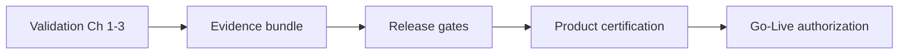
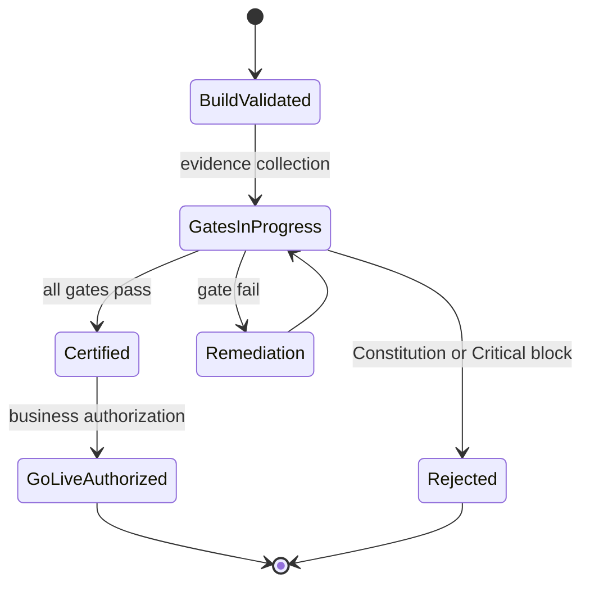
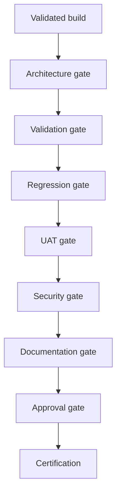
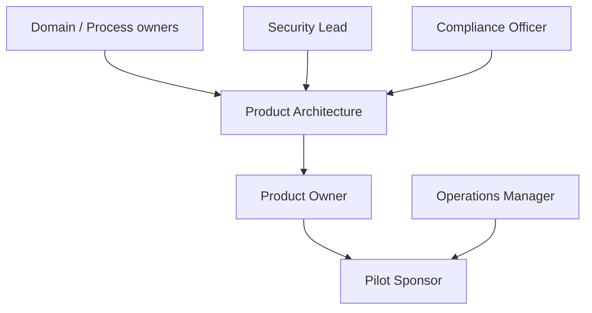
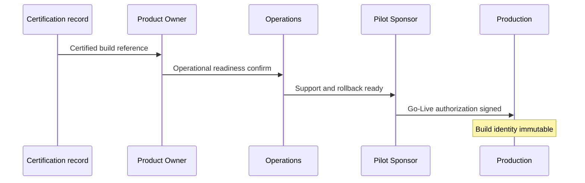
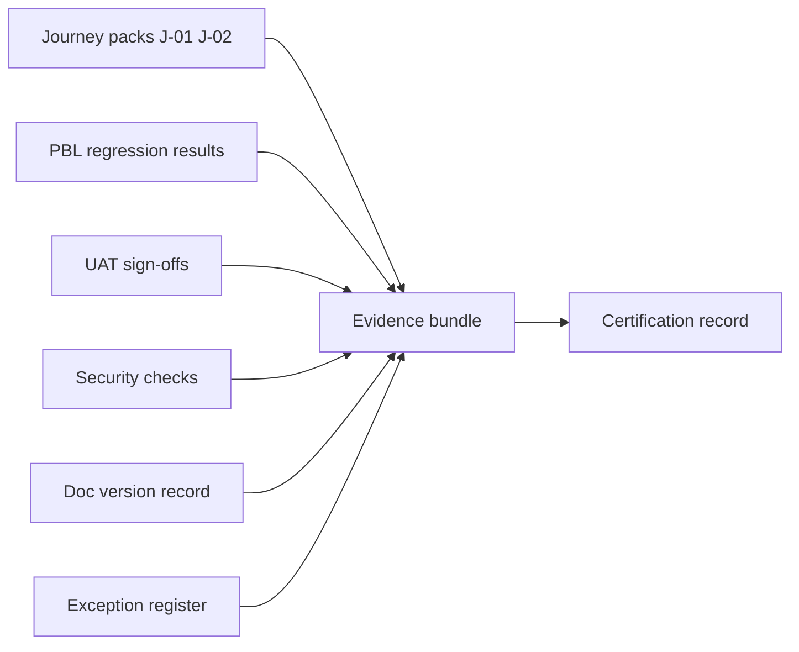
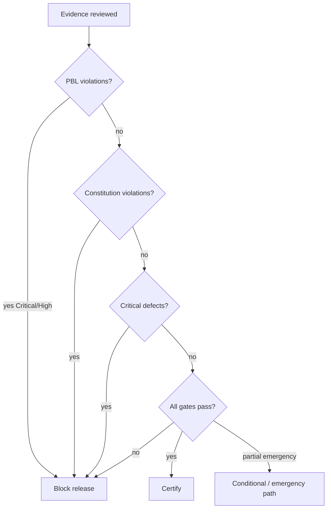

# User Acceptance, Certification & Release Readiness

| Field | Value |
|-------|-------|
| **Document ID** | FT-PD-083 |
| **Volume** | 8 — Product Testing & Validation |
| **Chapter** | 4 — User Acceptance, Certification & Release Readiness |
| **Title** | User Acceptance, Certification & Release Readiness |
| **Version** | 1.0.0 |
| **Status** | Draft — Architecture Review |
| **Effective date** | 2026-05-29 |
| **Author** | FT ERP Product Team |
| **Owner** | FT ERP Product Architecture |
| **Audience** | Product owners, release managers, compliance officers, pilot sponsors, implementation partners |
| **Classification** | Product — Validation & Release Governance Architecture |

**Parent documents:**

- [Chapter 1 — Product Testing, Validation & Compliance Framework](./Chapter_01_Product_Testing_Validation_and_Compliance_Framework.md)
- [Chapter 2 — Workflow Regression Guardrails & Protected Behavior Catalog](./Chapter_02_Workflow_Regression_Guardrails_and_Protected_Behavior_Catalog.md)
- [Chapter 3 — Canonical Test Data, Factory Simulation & Acceptance Scenarios](./Chapter_03_Canonical_Test_Data_Factory_Simulation_and_Acceptance_Scenarios.md)
- [Volume 1, Ch. 2 — FT ERP Constitution](../01_Product_Foundation/Chapter_02_FT_ERP_Constitution.md)
- [Volume 7 — Security & Governance Architecture](../07_Security_and_Governance_Architecture/README.md)

---

## 1. Document Control

| Version | Date | Author | Summary |
|---------|------|--------|---------|
| 1.0.0 | 2026-05-29 | FT ERP Product Team | Initial User Acceptance, Certification & Release Readiness |

**Supersedes:** None.

**Change authority:** Product Architecture + Release Governance Board. Certification criteria changes require FT-PD-081 protected behavior alignment.

**Out of scope:** CI/CD pipelines, DevOps implementation, deployment scripts, infrastructure configuration, source code, testing framework details.

---

## 2. Purpose

This chapter defines the **formal governance model** for certifying FT ERP releases.

It specifies:

- **User Acceptance governance**
- **Product certification**
- **Release readiness** and **release gates**
- **Go-Live authorization**
- **Stakeholder approvals** and **evidence bundles**
- **Exception handling**

The objective is to ensure every FT ERP release satisfies **architectural, business, security, and governance** requirements before production use.

---

## 3. Scope

### 3.1 In scope

- Release governance philosophy (§5)
- UAT governance (§6)
- Product certification model (§7)
- Release gates (§8)
- Go-Live authorization (§9)
- Exception management (§10)
- Certification matrices (§12, §12A–D)
- Business Rules and diagrams (§11, §13)

### 3.2 Out of scope

- Server provisioning, database migration scripts, network topology
- Tenant-specific deployment runbooks (Volume 9 planned)
- Executable UAT scripts (FT-PD-082 defines packs only)

### 3.3 Certification vs validation

| Activity | Authority | Output |
|----------|-----------|--------|
| **Validation** (Ch. 1–3) | Produces conformance evidence | Traces, audits, journey packs |
| **Certification** (this chapter) | Attests release meets product architecture | Signed certification record |
| **Go-Live** | Authorizes production use of certified build | Go-Live authorization |

**Rule:** Certification **consumes** validation evidence — it **never replaces** architectural compliance ([REL-01](#11-business-rules)).

---

## 4. Relationship with Previous Volumes

| Volume / Chapter | Relationship |
|------------------|--------------|
| **Vol. 0–7** | Architecture requirements certification must satisfy |
| **FT-PD-080** | VAL-* framework; validation levels; production readiness §11 |
| **FT-PD-081** | PBL-* protected behaviors — **non-waivable** without Constitution amendment |
| **FT-PD-082** | CAN-* canonical scenarios; UAT packs; §12D readiness matrix |
| **Vol. 7, Ch. 3** | Audit and retention — certification evidence retention class |

### 4.1 Evidence flow to certification

Certification is **governance attestation** on top of objective evidence — not a substitute for running canonical journeys ([CAN-01](./Chapter_03_Canonical_Test_Data_Factory_Simulation_and_Acceptance_Scenarios.md)).

---

## 5. Release Governance Philosophy

| Principle | Definition |
|-----------|------------|
| **Evidence-driven certification** | No sign-off without traceable artifacts |
| **Architecture-first approval** | Constitution and PBL rules before convenience |
| **Business acceptance** | Process owners confirm factory operability |
| **Controlled release** | Explicit gates — no silent production push |
| **Traceable authorization** | Who approved what, when, on which build |
| **Repeatable certification** | Same gate model every release |
| **Risk-based decisions** | Exception path documented — not informal waiver |

### 5.1 Concept distinctions (never interchangeable)

| Concept | Definition |
|---------|------------|
| **Validation** | Technical and architectural conformance testing |
| **User Acceptance** | Business role confirmation of operability |
| **Certification** | Formal product attestation for a specific release |
| **Release Approval** | Governance sign-off that gates are satisfied |
| **Production Go-Live** | Authorization to use certified build in live factory operations |

---

## 6. User Acceptance Governance

| Element | Definition |
|---------|------------|
| **Business ownership** | Process owner per domain (Commercial, Store, Purchase, etc.) |
| **Role participation** | Minimum one representative per UAT pack ([FT-PD-082 §9](./Chapter_03_Canonical_Test_Data_Factory_Simulation_and_Acceptance_Scenarios.md)) |
| **UAT completion** | All role packs executed against canonical or pilot-extended scenarios |
| **Evidence collection** | Signed pack checklist + correlation trace sample |
| **Acceptance decisions** | Accept, accept with exceptions, or reject |
| **Exception handling** | Deferred items logged in exception register (§10) |

**Rule:** UAT confirms **business operability** — it does not override failed architecture regression ([REL-04](#11-business-rules)).

---

## 7. Product Certification Model

Certification attests that a **named product release** satisfies architecture across:

| Area | Certification focus | Protected behavior reference |
|------|----------------------|------------------------------|
| **Workflow** | State Machines, guards, orchestration | WFE-*, GRD-* ([FT-PD-081 §7](./Chapter_02_Workflow_Regression_Guardrails_and_Protected_Behavior_Catalog.md)) |
| **Constitution** | Articles 1–23 spot conformance | §12D FT-PD-081 |
| **Security** | RBAC, SoD, session overlay | SEC-* |
| **Data** | Immutability, ledger, correlation | WES-* |
| **UI** | Surface triad | Art. 13–14, UXA-* |
| **Integration** | Trust boundaries if enabled | INT-* |
| **Governance** | Audit, config, delegation | GOV-*, CFG-*, IDN-* |

**Certification record** includes: release identifier, evidence bundle index, gate sign-offs, exception register, certification authority signature.

---

## 8. Release Readiness Gates

Each gate requires **evidence** before exit. All gates must pass for standard certification.

| Gate | Required evidence | Exit criteria |
|------|-------------------|---------------|
| **Architecture complete** | Change map to Volumes 0–7; no open Constitution violations | Product Architecture sign-off |
| **Validation complete** | J-01, J-02 journey packs ([FT-PD-082](./Chapter_03_Canonical_Test_Data_Factory_Simulation_and_Acceptance_Scenarios.md)) | Validation Lead sign-off |
| **Regression complete** | PBL spot suite per change impact | Workflow + QA leads |
| **UAT complete** | All role pack sign-offs §9 FT-PD-082 | Process owners |
| **Security review complete** | SEC/GOV rule checks; no Critical security defects | Security Lead |
| **Documentation complete** | Product doc version aligned to release; change log | Product Architecture |
| **Approval complete** | Release Gate Matrix §12B all owners | Release Governance Board |

---

## 9. Go-Live Authorization

| Element | Definition |
|---------|------------|
| **Authorization authority** | Product Owner + Pilot Sponsor (tenant) for factory go-live |
| **Deployment approval** | Confirms certified build identity — not deployment mechanics |
| **Rollback readiness** | Documented scope and data impact — decision authority named |
| **Operational readiness** | Support escalation, monitoring, integration contacts |
| **Support readiness** | L1/L2 model active; known limitations communicated |
| **Training readiness** | Role holders trained on Dashboard / Workspace / Control Tower |
| **Business sign-off** | Management acceptance of residual exceptions (if any) |

**Rule:** Go-Live requires **valid certification** for the exact build — not prior release certification ([REL-06](#11-business-rules)).

---

## 10. Exception Management

| Exception type | Governance |
|----------------|------------|
| **Deferred defects** | Medium/Low only; remediation date; not Critical/High on PBL |
| **Known limitations** | Documented in release notes; not Constitution violations |
| **Accepted risks** | Risk register entry; approver + expiry review |
| **Emergency releases** | Narrow scope; enhanced audit; post-release full regression |
| **Hotfix releases** | Targeted fix; mandatory PBL regression on touched paths |
| **Major releases** | Full gate suite; expanded canonical journey set |

**Rule:** **Protected behaviors cannot be waived** — PBL and Constitution violations block standard certification ([REL-02](#11-business-rules), [REL-03](#11-business-rules)).

---

## 11. Business Rules

| ID | Rule |
|----|------|
| **REL-01** | **Certification evidence is mandatory** — no verbal certification. |
| **REL-02** | **Protected behaviors cannot be waived** without formal architecture amendment ([PBL-01](./Chapter_02_Workflow_Regression_Guardrails_and_Protected_Behavior_Catalog.md)). |
| **REL-03** | **Constitution violations block release** — standard certification denied. |
| **REL-04** | **Critical defects prevent certification** ([CAN-06](./Chapter_03_Canonical_Test_Data_Factory_Simulation_and_Acceptance_Scenarios.md)). |
| **REL-05** | **Documentation is part of release readiness** — product doc version recorded. |
| **REL-06** | **Every release must remain traceable** — build id, evidence index, approvers. |
| **REL-07** | **UAT acceptance does not override failed regression** on protected behaviors. |
| **REL-08** | **Emergency releases require post-incident certification completion** within agreed window. |
| **REL-09** | **Go-Live authorization references certified build identity** — immutable link. |
| **REL-10** | **Exception register is append-only** — waivers auditable. |
| **REL-11** | **Integration certification required only when integration enabled** — INT rules apply. |
| **REL-12** | **Major releases require full gate suite** — no gate skipping by classification. |

---

## 12. Certification Matrices

### 12A. Certification Coverage Matrix

| Architecture Area | Evidence | Approval | Release Gate |
|-------------------|----------|----------|--------------|
| **Workflow** | J-01/J-02 traces; GRD fail samples | Workflow Engineering Lead | Validation + Regression |
| **Constitution** | Article checklist §12D FT-PD-081 | Product Architecture | Architecture |
| **Security** | SEC-01, SEC-09 evidence | Security Lead | Security review |
| **Data** | WES-01–03; ledger sample | Data Architecture Lead | Validation |
| **UI** | Role UAT packs; WFE-05 check | Product / UX Lead | UAT |
| **Integration** | INT audit if enabled | Integration Lead | Validation |
| **Governance** | GOV-01; delegation sample | Compliance Officer | Security review |

### 12B. Release Gate Matrix

| Gate | Required Evidence | Exit Criteria | Owner |
|------|-------------------|---------------|-------|
| **Architecture complete** | Volume impact map; no open Art. violations | Signed architecture review | Product Architecture |
| **Validation complete** | Canonical journey packs | J-01 + J-02 pass | Validation Lead |
| **Regression complete** | PBL suite per §12B FT-PD-081 trigger | No Critical/High on PBL | QA Lead |
| **UAT complete** | §9 FT-PD-082 role sign-offs | All roles Accept or documented exception | Process owners |
| **Security review complete** | Governance rule suite | No Critical security defects | Security Lead |
| **Documentation complete** | Product doc version + change log | Docs match release scope | Product Architecture |
| **Approval complete** | Aggregated gate record | Release Board sign-off | Product Owner |

### 12C. Go-Live Readiness Matrix

| Readiness Area | Validation | Approval | Evidence |
|----------------|------------|----------|----------|
| **Certified build** | Build matches certification record | Product Owner | Certification certificate |
| **Rollback** | Rollback scope documented | Operations Manager | Rollback decision record |
| **Operations** | Support model active | Operations Manager | Support runbook ack |
| **Monitoring** | Control Tower / integration monitor | Management | Monitor checklist |
| **Training** | Role training complete | HR / Ops liaison | Training attendance |
| **Business** | Residual exceptions accepted | Pilot Sponsor | Exception register sign-off |
| **Governance** | Audit retention active | Compliance Officer | GOV retention ack |

### 12D. Exception Approval Matrix

| Exception Type | Approval Required | Release Impact | Documentation |
|----------------|-------------------|----------------|-----------------|
| **Deferred Medium defect** | Domain lead + QA Lead | Standard cert with register | Exception register entry |
| **Deferred Low defect** | QA Lead | Standard cert with backlog | Release notes |
| **Accepted risk** | Product Architecture + Owner | Conditional cert | Risk register |
| **Emergency release** | Product Owner + Architecture | Limited cert; full regression due | Emergency release record |
| **Hotfix** | Workflow Lead + QA | Targeted cert scope | Hotfix impact map |
| **Known limitation** | Product Owner | Documented only — not PBL waiver | Release notes |
| **Constitution/PBL waiver** | **Not permitted** | **Blocks standard cert** | Architecture amendment only |

---

## 13. Logical Diagrams

### 13.1 Certification lifecycle

### 13.2 Release governance flow

### 13.3 Approval hierarchy

### 13.4 Go-Live authorization

### 13.5 Evidence bundle

### 13.6 Release decision process

---

## 14. Review Checklist

- [ ] Certification completeness — §7, §12A all areas
- [ ] Release readiness — §8, §12B all gates
- [ ] Evidence traceability — §13.5 bundle, REL-06
- [ ] Constitution compliance — REL-03, §12D exceptions
- [ ] Protected behavior compliance — REL-02, FT-PD-081
- [ ] Stakeholder approval — §9, §12C, Approval Block
- [ ] Concept distinctions — §5.1
- [ ] Six Mermaid diagrams
- [ ] No CI/CD, DevOps, scripts, or code

---

## 15. Change Log

| Version | Date | Author | Summary |
|---------|------|--------|---------|
| 1.0.0 | 2026-05-29 | FT ERP Product Team | Initial User Acceptance, Certification & Release Readiness |

---

## 16. Approval Block

| Role | Name | Signature | Date |
|------|------|-----------|------|
| Product Owner | | | |
| Product Architecture | | | |
| Validation / QA Lead | | | |
| Security / Compliance Lead | | | |
| Release Governance Board Chair | | | |

---

## Writing Requirements

Remain **technology-neutral**.

**Do not include:** CI/CD pipelines, DevOps implementation, deployment scripts, infrastructure configuration, source code, testing framework details.

**Describe governance architecture only.** Do not redefine workflow semantics or Guard IDs.

---

*Volume 8 complete — see [Chapter 5](./Chapter_05_Validation_Evidence_Audit_Trails_and_Continuous_Compliance.md). Recommended: Volumes 0–8 consistency review before Volume 9.*
---

## Document navigation

| | Link |
|--|------|
| **Previous** | [Canonical Test Data, Factory Simulation & Acceptance Scenarios](./Chapter_03_Canonical_Test_Data_Factory_Simulation_and_Acceptance_Scenarios.md) (FT-PD-082) |
| **Next** | [Validation Evidence, Audit Trails & Continuous Compliance](./Chapter_05_Validation_Evidence_Audit_Trails_and_Continuous_Compliance.md) (FT-PD-084) |
| **Volume** | [Product Testing and Validation](./README.md) |
| **Product** | [Product Documentation Index](../README.md) |

