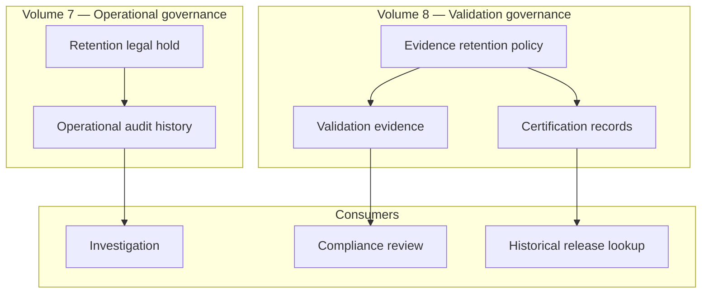
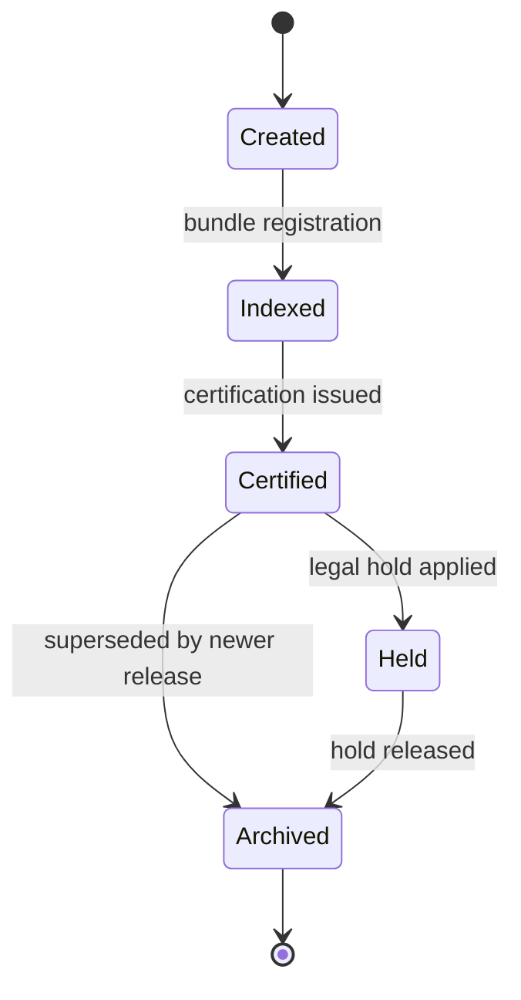
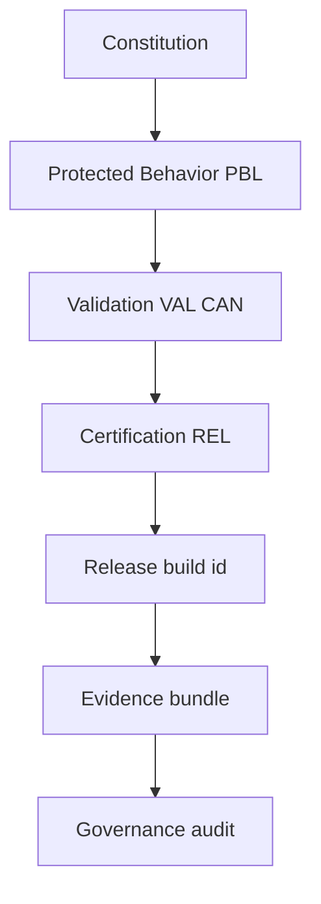
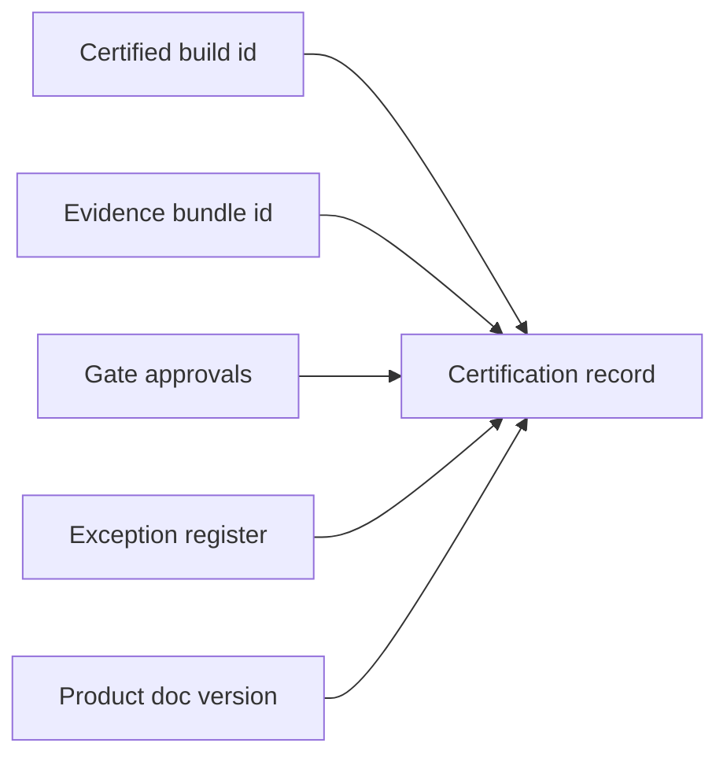
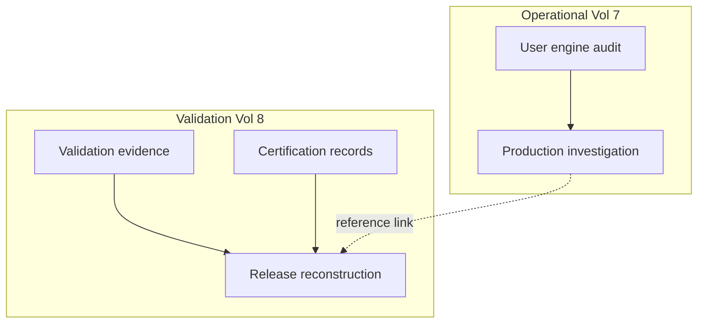
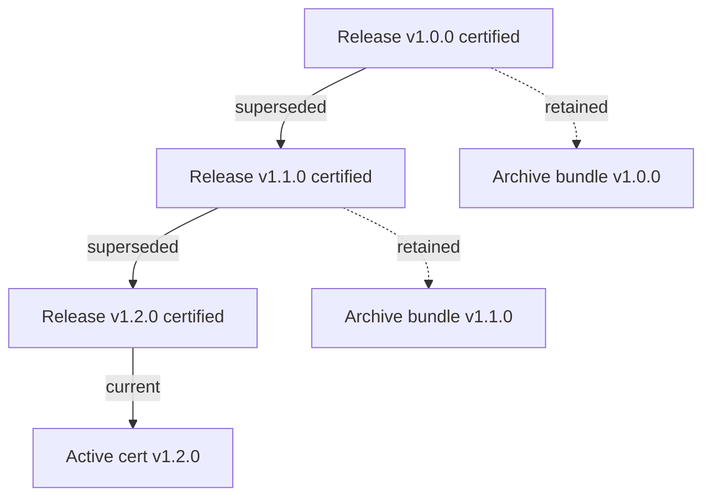

# Validation Evidence, Audit Trails & Continuous Compliance

| Field | Value |
|-------|-------|
| **Document ID** | FT-PD-084 |
| **Volume** | 8 — Product Testing & Validation |
| **Chapter** | 5 — Validation Evidence, Audit Trails & Continuous Compliance |
| **Title** | Validation Evidence, Audit Trails & Continuous Compliance |
| **Version** | 1.0.0 |
| **Status** | Draft — Architecture Review |
| **Effective date** | 2026-05-29 |
| **Author** | FT ERP Product Team |
| **Owner** | FT ERP Product Architecture |
| **Audience** | Compliance officers, release managers, QA architects, audit leads, product owners |
| **Classification** | Product — Validation & Compliance Governance Architecture |

**Parent documents:**

- [Chapter 1 — Product Testing, Validation & Compliance Framework](./Chapter_01_Product_Testing_Validation_and_Compliance_Framework.md)
- [Chapter 2 — Workflow Regression Guardrails & Protected Behavior Catalog](./Chapter_02_Workflow_Regression_Guardrails_and_Protected_Behavior_Catalog.md)
- [Chapter 3 — Canonical Test Data, Factory Simulation & Acceptance Scenarios](./Chapter_03_Canonical_Test_Data_Factory_Simulation_and_Acceptance_Scenarios.md)
- [Chapter 4 — User Acceptance, Certification & Release Readiness](./Chapter_04_User_Acceptance_Certification_and_Release_Readiness.md)
- [Volume 7, Ch. 3 — Audit, Compliance & Data Retention Governance](../07_Security_and_Governance_Architecture/Chapter_03_Audit_Compliance_and_Data_Retention_Governance.md)

---

## 1. Document Control

| Version | Date | Author | Summary |
|---------|------|--------|---------|
| 1.0.0 | 2026-05-29 | FT ERP Product Team | Initial Validation Evidence, Audit Trails & Continuous Compliance |

**Supersedes:** None.

**Change authority:** Product Architecture + Compliance Governance. Evidence retention class changes require Volume 7 Ch. 3 alignment.

**Out of scope:** Database schemas, storage engines, document repositories, CI/CD tooling, source code, infrastructure implementation.

---

## 2. Purpose

This chapter defines how FT ERP **preserves certification evidence**, **validation history**, **audit traceability**, **compliance records**, and **continuous governance** across all releases.

It specifies:

- **Validation evidence lifecycle**
- **Certification record governance**
- **Audit traceability** — operational vs validation layers
- **Compliance reporting**
- **Evidence retention**
- **Continuous compliance**
- **Historical reconstruction**

The objective is to ensure **every certified release** remains fully **explainable, traceable, and auditable** throughout its lifecycle.

---

## 3. Scope

### 3.1 In scope

- Validation evidence philosophy (§5)
- Evidence model and metadata (§6)
- Certification record governance (§7)
- Continuous compliance (§8)
- Audit traceability chain (§9)
- Compliance reporting (§10)
- Compliance matrices (§12, §12A–D)
- Business Rules and diagrams (§11, §13)

### 3.2 Out of scope

- Operational ERP audit storage implementation (Volume 7 Ch. 3 persistence layer)
- Document management system selection
- Customer tenant backup procedures

### 3.3 Evidence layer distinctions

| Layer | Governs | Volume |
|-------|---------|--------|
| **Operational audit** | User and engine actions in live ERP | Vol. 7 Ch. 3 |
| **Validation evidence** | Proof of conformance during test/cert cycles | Vol. 8 Ch. 1–3 |
| **Certification evidence** | Formal release attestation bundle | Vol. 8 Ch. 4 |
| **Compliance evidence** | Curated packages for reviews and external audit | Vol. 7 + Vol. 8 |

---

## 4. Relationship with Previous Volumes

| Volume / Chapter | Relationship |
|------------------|--------------|
| **Vol. 7, Ch. 3** | Operational audit immutability, retention classes, legal hold — **parallel layer** |
| **FT-PD-080** | VAL-* validation framework; evidence types |
| **FT-PD-081** | PBL-* protected behaviors — traceability anchor |
| **FT-PD-082** | CAN-* canonical scenarios; journey evidence |
| **FT-PD-083** | REL-* certification; evidence bundle; REL-06 traceability |

### 4.1 Operational audit vs validation evidence



**Principle:** Operational audit proves **what happened in production**. Validation evidence proves **why a release was certified**. Both are immutable — neither overwrites the other ([EVD-01](#11-business-rules), [GOV-01](../07_Security_and_Governance_Architecture/Chapter_03_Audit_Compliance_and_Data_Retention_Governance.md)).

---

## 5. Validation Evidence Philosophy

| Principle | Definition |
|-----------|------------|
| **Evidence permanence** | Certification artifacts retained for product lifecycle |
| **Traceability** | Constitution → PBL → validation → certification → release |
| **Reproducibility** | Evidence sufficient to explain certification decision years later |
| **Independence** | Validation evidence separate from operational audit stores |
| **Historical integrity** | No overwrite of superseded release evidence |
| **Non-repudiation** | Approver identity and timestamp on all certification artifacts |
| **Continuous compliance** | Ongoing reviews — not one-time at release only |

### 5.1 Concept distinctions (never interchangeable)

| Concept | Scope | Example |
|---------|-------|---------|
| **Operational audit** | Live ERP user/engine actions | GRN post by Store user |
| **Validation evidence** | Test and regression execution output | J-01 correlation trace pack |
| **Certification evidence** | Aggregated bundle + sign-offs | FT-PD-083 §12B gate record |
| **Compliance evidence** | Review-period curated package | Annual governance review export |

---

## 6. Validation Evidence Model

Evidence categories — **required metadata only** (no storage prescription):

| Category | Typical content | Required metadata |
|----------|-----------------|-------------------|
| **Workflow validation** | Journey traces, Event Store samples | `correlationId`, release id, scenario id (J-01, J-02) |
| **Regression validation** | PBL suite results | Protected rule id, pass/fail, build id |
| **UAT evidence** | Role pack sign-offs | Role, approver, date, scenario reference |
| **Security evidence** | SEC/GOV rule checks | Rule id, sample reference |
| **Integration evidence** | INT boundary proof | Integration category, request id |
| **Performance evidence** | Load summary | Profile id, threshold agreement ref |
| **Documentation evidence** | Product doc version alignment | Document id, version, effective date |
| **Approval evidence** | Gate and certification sign-offs | Gate id, approver, timestamp |

**Rule:** Every evidence artifact carries **release identifier**, **Product Documentation version**, and **creation timestamp** ([EVD-05](#11-business-rules)).

---

## 7. Certification Record Governance

| Element | Definition |
|---------|------------|
| **Certified build identity** | Immutable id linking binary/config to certification record |
| **Evidence bundle identity** | Index of all artifacts in certification package |
| **Approval history** | Ordered gate sign-offs per FT-PD-083 §12B |
| **Release history** | Chronological certified releases with supersession links |
| **Version lineage** | Product doc version + build lineage graph |
| **Superseded releases** | Prior cert retained — marked superseded, not deleted |
| **Historical lookup** | Query by build, date, or product version |

**Rule:** **Certification records are permanent** — supersession adds new record; does not erase prior ([EVD-02](#11-business-rules)).

---

## 8. Continuous Compliance

Ongoing governance beyond initial certification:

| Activity | Purpose |
|----------|---------|
| **Scheduled compliance reviews** | Periodic attestation that protected behaviors remain enforced in production configs |
| **Constitution compliance** | Article spot-check against live tenant configuration |
| **Protected behavior monitoring** | PBL rule sampling on operational audit |
| **Documentation currency** | Product docs match deployed certified scope |
| **Security governance** | SEC/GOV rule review; delegation and config audit |
| **Integration governance** | INT boundary review when integrations enabled |
| **Audit readiness** | Evidence retrievable for investigation within retention policy |

**Frequency:** Defined in §12C — architecture-neutral schedule (e.g. per major release, annual governance review).

---

## 9. Audit Traceability

End-to-end traceability chain:

```
Constitution (Vol. 1)
  ↓
Protected Behavior (FT-PD-081 / PBL-*)
  ↓
Validation (FT-PD-080 / VAL-*, FT-PD-082 / CAN-*)
  ↓
Certification (FT-PD-083 / REL-*)
  ↓
Release (certified build identity)
  ↓
Evidence (bundle index + artifacts)
  ↓
Audit (operational + validation governance audit)
```

| Link | Trace mechanism |
|------|-----------------|
| Constitution → PBL | §12D FT-PD-081 Article mapping |
| PBL → Validation | Scenario matrix §12A FT-PD-082 |
| Validation → Certification | Evidence bundle in certification record |
| Certification → Release | REL-09 build identity link |
| Release → Evidence | Bundle identity index |
| Evidence → Audit | Append-only governance audit on evidence access/export |

---

## 10. Compliance Reporting

| Report category | Content |
|-----------------|---------|
| **Validation status** | Open vs complete journeys per release candidate |
| **Certification status** | Gates passed/failed; cert issued or blocked |
| **Evidence completeness** | Bundle index vs required §12A coverage |
| **Compliance exceptions** | Exception register from FT-PD-083 §10 |
| **Historical releases** | Certified release lineage with supersession |
| **Governance reviews** | Scheduled review outcomes and open actions |

Reports consume **validation and certification stores** — operational Read Models are navigational aids only ([GOV-10](../07_Security_and_Governance_Architecture/Chapter_03_Audit_Compliance_and_Data_Retention_Governance.md)).

---

## 11. Business Rules

| ID | Rule |
|----|------|
| **EVD-01** | **Validation evidence is immutable** — append-only; corrections are new entries. |
| **EVD-02** | **Certification records are permanent** — supersede, never delete. |
| **EVD-03** | **Historical evidence is never overwritten** — superseded releases retain full bundle. |
| **EVD-04** | **Every release remains traceable** — build id, bundle id, approvers ([REL-06](./Chapter_04_User_Acceptance_Certification_and_Release_Readiness.md)). |
| **EVD-05** | **Evidence completeness is mandatory** for certification — §12A coverage. |
| **EVD-06** | **Compliance reviews are evidence-based** — no review without artifact. |
| **EVD-07** | **Operational audit and validation evidence remain separate layers** — linked by reference, not merged. |
| **EVD-08** | **Evidence export is auditable** — who exported what, when ([SEC-14](../07_Security_and_Governance_Architecture/Chapter_01_Security_Authorization_and_Governance_Architecture.md)). |
| **EVD-09** | **Retention class for certification evidence** is **Extended** minimum — aligns with Vol. 7 governance audit. |
| **EVD-10** | **Legal hold applies to certification evidence** when litigation scope includes product release. |
| **EVD-11** | **Continuous compliance findings** trigger regression assessment per PBL-07. |
| **EVD-12** | **Historical reconstruction** must resolve product doc version + build + bundle for any certified release. |

---

## 12. Compliance Matrices

### 12A. Evidence Coverage Matrix

| Evidence Type | Source | Retention | Approval |
|---------------|--------|-----------|----------|
| **Workflow validation** | FT-PD-082 J-01, J-02 | Extended | Validation Lead |
| **Regression validation** | FT-PD-081 PBL suite | Extended | QA Lead |
| **UAT evidence** | FT-PD-082 §9 packs | Standard | Process owners |
| **Security evidence** | SEC/GOV checks | Extended | Security Lead |
| **Integration evidence** | INT audit samples | Extended | Integration Lead |
| **Performance evidence** | Agreed load profile | Standard | Operations |
| **Documentation evidence** | Product doc version record | Permanent | Product Architecture |
| **Approval evidence** | FT-PD-083 gate sign-offs | Permanent | Product Owner |

### 12B. Traceability Matrix

| Constitution Requirement | Protected Behavior | Validation | Evidence | Audit |
|-------------------------|-------------------|------------|----------|-------|
| **Art. 4–5 Business Model** | PBL-10 | J-01, J-02 | Journey trace | Validation audit |
| **Art. 9 Material accountability** | PBL-11 | PMR→Issue scenario | Ledger + PMR sample | Operational + validation |
| **Art. 12 Pending Actions** | WFE-02 | Dashboard PA match | PA API vs UI evidence | Validation audit |
| **Art. 13–14 UI surfaces** | PBL-06, UXA-* | UAT packs | Role surface scenarios | UAT sign-off |
| **Art. 22 Auditability** | GOV-01 | Audit immutability sample | WES-03 evidence | Governance audit |
| **SEC-01 Auth vs guards** | PBL-08 | Security scenario | Denied action audit | Security audit |

### 12C. Compliance Review Matrix

| Review Area | Frequency | Evidence | Owner |
|-------------|-----------|----------|-------|
| **Constitution compliance** | Per major release + annual | Article checklist sample | Product Architecture |
| **Protected behavior (PBL)** | Per major release | PBL spot suite | Validation Lead |
| **Documentation currency** | Per release | Doc version vs cert record | Product Architecture |
| **Security governance** | Quarterly minimum | SEC/GOV sample | Security Lead |
| **Integration governance** | When integrations enabled | INT rule check | Integration Lead |
| **Evidence retention** | Annual | Retention class compliance | Compliance Officer |
| **Certification lineage** | Per release | Historical record matrix §12D | Release Manager |

### 12D. Historical Record Matrix

| Release | Certification | Evidence Bundle | Audit Status |
|---------|---------------|-----------------|--------------|
| **Current certified** | Active cert record | Complete bundle index | All gates archived |
| **Prior major** | Superseded — retained | Full bundle retained | Immutable |
| **Prior minor/patch** | Superseded — retained | Targeted bundle per scope | Immutable |
| **Emergency cert** | Active with follow-up flag | Limited bundle + remediation plan | Enhanced audit |
| **Blocked (not certified)** | No cert — attempt logged | Partial evidence if any | Decision audit only |

---

## 13. Logical Diagrams

### 13.1 Evidence lifecycle



### 13.2 Traceability chain



### 13.3 Certification record model



### 13.4 Continuous compliance cycle


### 13.5 Audit relationship model



### 13.6 Historical lineage



---

## 14. Review Checklist

- [ ] Evidence completeness — §6, §12A all types
- [ ] Traceability — §9 chain, §12B sample rows
- [ ] Historical integrity — EVD-02, EVD-03, §12D
- [ ] Constitution alignment — §12B Art. references
- [ ] Protected behavior coverage — PBL links in §12B
- [ ] Compliance readiness — §8, §12C review schedule
- [ ] Operational vs validation distinction — §4.1, §5.1
- [ ] Six Mermaid diagrams
- [ ] No schema, storage engines, or code

---

## 15. Change Log

| Version | Date | Author | Summary |
|---------|------|--------|---------|
| 1.0.0 | 2026-05-29 | FT ERP Product Team | Initial Validation Evidence, Audit Trails & Continuous Compliance |

---

## 16. Approval Block

| Role | Name | Signature | Date |
|------|------|-----------|------|
| Product Owner | | | |
| Product Architecture | | | |
| Compliance Officer | | | |
| Validation / QA Lead | | | |
| Release Governance Board Chair | | | |

---

## Writing Requirements

Remain **technology-neutral**.

**Do not include:** Database schemas, storage engines, document repositories, CI/CD tooling, source code, infrastructure implementation.

**Describe governance architecture only.** Do not redefine workflow semantics or Guard IDs.

---

*Volume 8 complete — Chapters 1–5. Recommended next step: finalize cross-volume validation references and consistency review of Volumes 0–8 before Volume 9 (Deployment).*
---

## Document navigation

| | Link |
|--|------|
| **Previous** | [User Acceptance, Certification & Release Readiness](./Chapter_04_User_Acceptance_Certification_and_Release_Readiness.md) (FT-PD-083) |
| **Next** | [Deployment & Release Architecture](../09_Deployment_and_Operations_Architecture/Chapter_01_Deployment_and_Release_Architecture.md) (FT-PD-090) |
| **Volume** | [Product Testing and Validation](./README.md) |
| **Product** | [Product Documentation Index](../README.md) |

