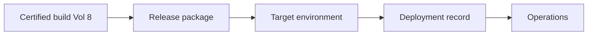
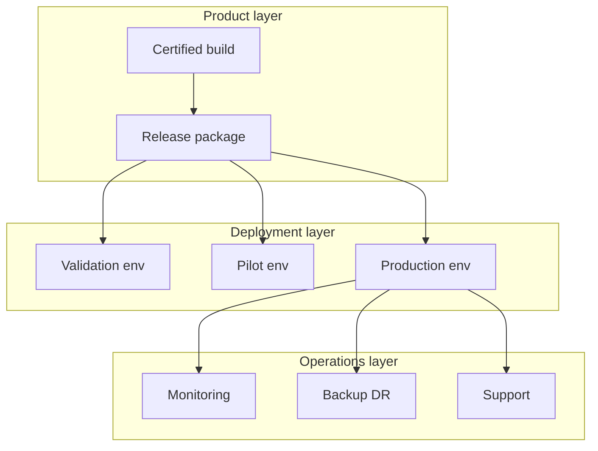
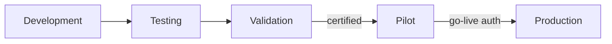
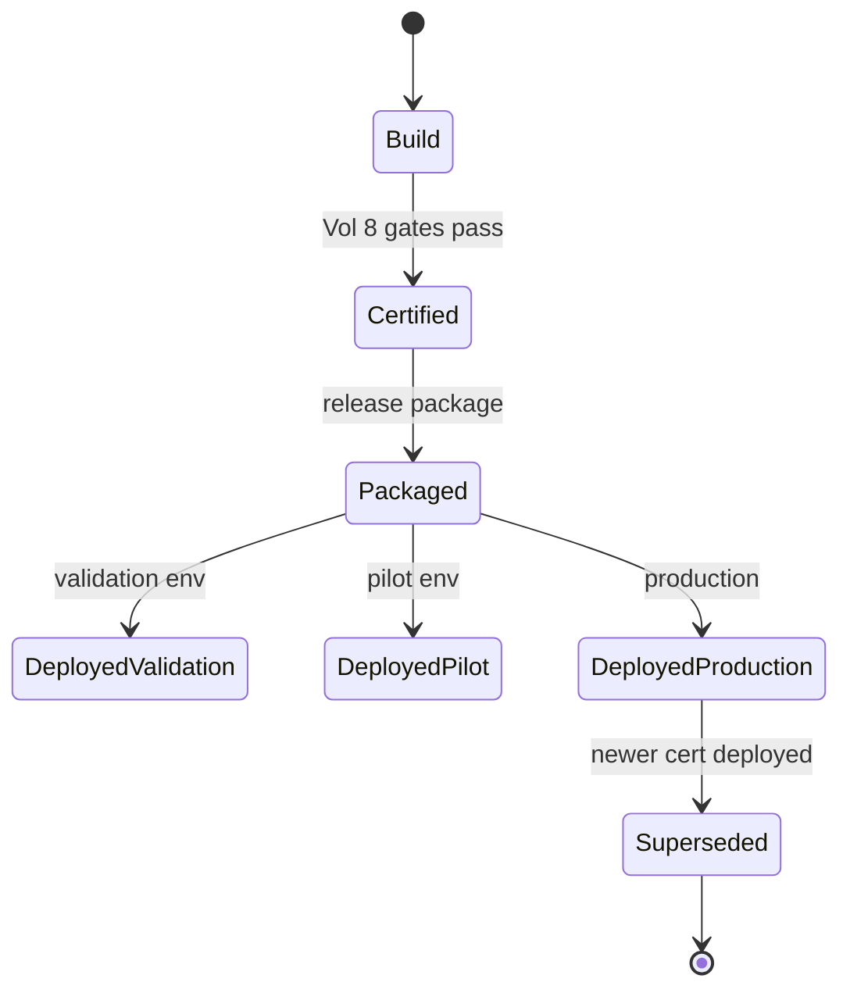
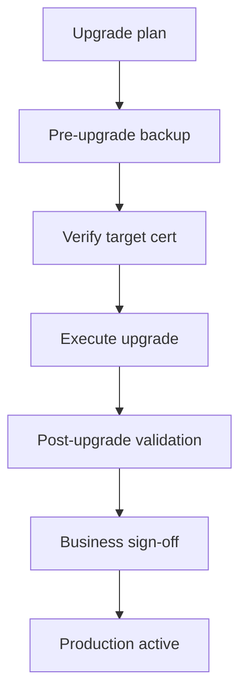
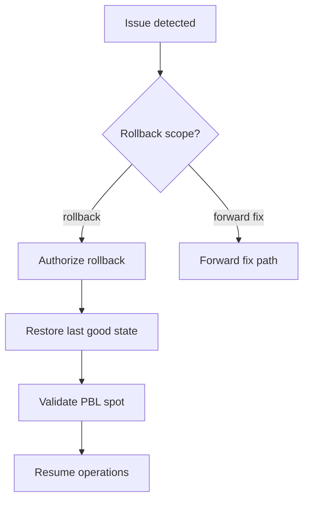
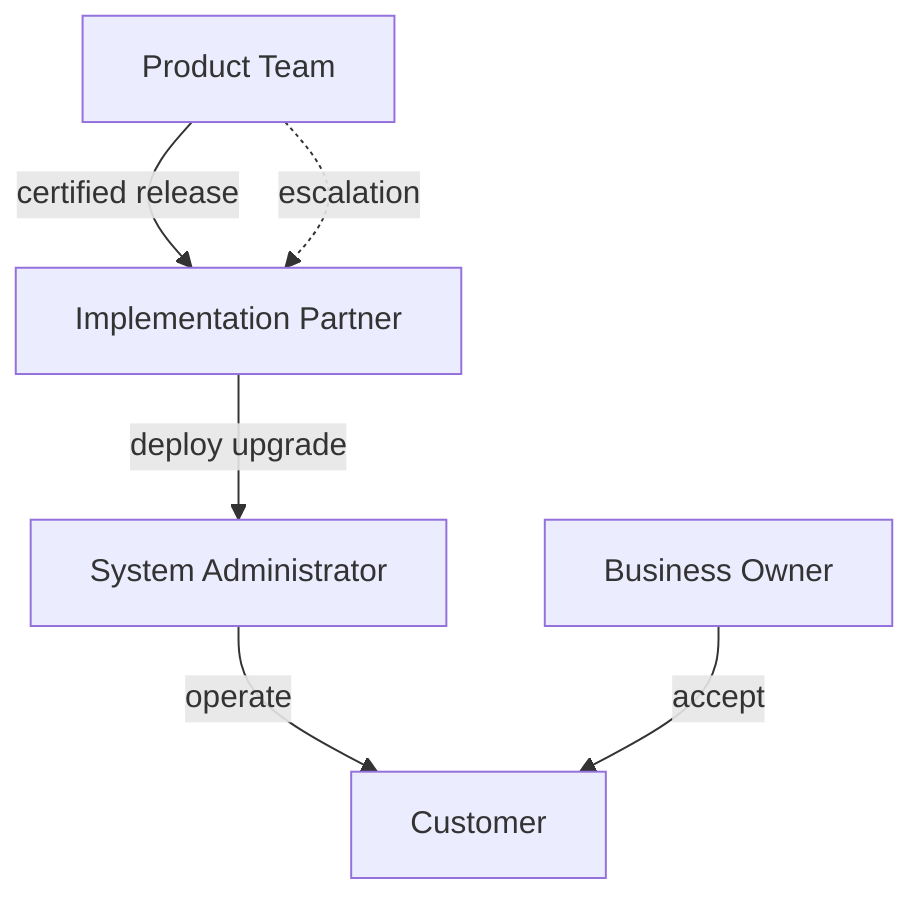

# Deployment & Release Architecture

| Field | Value |
|-------|-------|
| **Document ID** | FT-PD-090 |
| **Volume** | 9 — Deployment & Operations Architecture |
| **Chapter** | 1 — Deployment & Release Architecture |
| **Title** | Deployment & Release Architecture |
| **Version** | 1.0.0 |
| **Status** | Draft — Architecture Review |
| **Effective date** | 2026-05-29 |
| **Author** | FT ERP Product Team |
| **Owner** | FT ERP Product Architecture |
| **Audience** | Release managers, implementation partners, operations leads, system administrators, product owners |
| **Classification** | Product — Deployment & Operations Architecture |

**Parent documents:**

- [Volume 8 — Product Testing & Validation](../08_Product_Testing_and_Validation/README.md)
- [FT-PD-083 — User Acceptance, Certification & Release Readiness](../08_Product_Testing_and_Validation/Chapter_04_User_Acceptance_Certification_and_Release_Readiness.md)
- [FT-PD-084 — Validation Evidence, Audit Trails & Continuous Compliance](../08_Product_Testing_and_Validation/Chapter_05_Validation_Evidence_Audit_Trails_and_Continuous_Compliance.md)
- [Volume 7 — Security & Governance Architecture](../07_Security_and_Governance_Architecture/README.md)
- [Volume 5 — Data Architecture](../05_Data_Architecture/README.md)

---

## 1. Document Control

| Version | Date | Author | Summary |
|---------|------|--------|---------|
| 1.0.0 | 2026-05-29 | FT ERP Product Team | Initial Deployment & Release Architecture |

**Supersedes:** None.

**Change authority:** Product Architecture + Release Operations Governance. Deployment policy changes require Volume 8 certification alignment.

**Out of scope:** Docker, Kubernetes, cloud vendor specifics, shell scripts, CI/CD pipelines, source code, infrastructure runbooks.

---

## 2. Purpose

This chapter defines **architectural principles** governing FT ERP **deployment and release management**.

It specifies:

- **Deployment philosophy** and supported models
- **Environment architecture** and promotion rules
- **Release packaging** and lineage
- **Upgrade** and **rollback** architecture
- **Operational responsibilities** and **deployment governance**

The objective is to ensure every FT ERP deployment remains **predictable, traceable, recoverable**, and **aligned with certified product releases** ([FT-PD-083](../08_Product_Testing_and_Validation/Chapter_04_User_Acceptance_Certification_and_Release_Readiness.md)).

---

## 3. Scope

### 3.1 In scope

- Deployment philosophy (§5)
- Deployment models (§6)
- Environment architecture (§7)
- Release architecture (§8)
- Upgrade and rollback (§9–10)
- Operational responsibilities (§11)
- Deployment matrices (§13, §13A–D)
- Business Rules and diagrams (§12, §14)

### 3.2 Out of scope

- Server sizing, network diagrams, hypervisor configuration
- Database migration scripts (Volume 9 Ch. 2 planned)
- Tenant data migration detail (Volume 9 Ch. 2 planned)
- Day-2 monitoring tooling implementation

### 3.3 Lifecycle distinctions

| Activity | Definition |
|----------|------------|
| **Certification** | Product attestation that a build meets architecture (Vol. 8) |
| **Deployment** | Installing or promoting a **certified build** to an environment |
| **Installation** | First-time placement of FT ERP for a tenant |
| **Upgrade** | Moving an environment from one certified build to another |
| **Operations** | Ongoing run, support, backup, and incident response post go-live |

**Rule:** Deployment **consumes** certification — it **never replaces** it ([DEP-01](#12-business-rules)).

---

## 4. Relationship with Previous Volumes

| Volume | Relationship |
|--------|--------------|
| **Vol. 0–2** | Business scope — deployment must preserve pipelines and ownership |
| **Vol. 3–4** | Domain and workflow semantics unchanged by deployment path |
| **Vol. 5** | Data immutability and ledger rules govern upgrade/migration |
| **Vol. 6** | UI surfaces consistent across environments (role-based) |
| **Vol. 7** | Security, audit, config, integration — operational governance continues post-deploy |
| **Vol. 8, Ch. 4** | REL-* certification gates — mandatory before production deploy |
| **Vol. 8, Ch. 5** | EVD-* evidence retention — deployment records link to cert bundle |

### 4.1 Certification to deployment flow



Production deployment **requires** valid certification for the exact build identity ([REL-09](../08_Product_Testing_and_Validation/Chapter_04_User_Acceptance_Certification_and_Release_Readiness.md), [DEP-02](#12-business-rules)).

---

## 5. Deployment Philosophy

| Principle | Definition |
|-----------|------------|
| **Certified-build deployment** | Only certified releases enter production |
| **Repeatable deployment** | Same package + process → predictable outcome |
| **Predictable upgrades** | Version lineage and compatibility declared per release |
| **Operational independence** | Customer ops can run without daily product engineering |
| **Business continuity** | Rollback and recovery planned before upgrade |
| **Traceable deployments** | Who deployed what, when, where — linked to cert record |
| **Controlled rollback** | Documented scope — not ad-hoc database restore |

---

## 6. Supported Deployment Models

Technology-neutral deployment topologies:

| Model | Typical usage | Advantages | Operational considerations |
|-------|---------------|------------|---------------------------|
| **Local server** | Single-factory pilot, small deployment | Simplicity, low latency | Customer admin owns hardware and backup |
| **On-premises enterprise** | Multi-plant manufacturer, data residency | Full customer control | Partner installs; customer operates DC |
| **Private cloud** | Enterprise with virtualized private cloud | Elastic capacity within firewall | Network and identity integration |
| **Public cloud** | Hosted FT ERP offering (future-ready) | Managed scale | Stronger tenant isolation governance |
| **Hybrid** | App on-prem, backup/analytics off-prem | Flexibility | Clear data boundary and trust zones ([Vol. 7 Ch. 5](../07_Security_and_Governance_Architecture/Chapter_05_Platform_Integration_and_External_Trust_Boundaries.md)) |

**Rule:** Deployment model does **not** change product semantics — only operational topology.

---

## 7. Environment Architecture

| Environment | Purpose | Data expectations | Promotion rule | Operational ownership |
|-------------|---------|-------------------|----------------|----------------------|
| **Development** | Product engineering and partner customization dev | Synthetic or anonymized | No promotion to production | Product / Partner dev |
| **Testing** | Integration and automated conformance (implementation) | Canonical or subset | Evidence toward validation — not production | Partner QA |
| **Validation** | Architecture validation per Vol. 8 | Canonical factory ([FT-PD-082](../08_Product_Testing_and_Validation/Chapter_03_Canonical_Test_Data_Factory_Simulation_and_Acceptance_Scenarios.md)) | Certification candidate only | Validation Lead |
| **Pilot** | Factory trial with real limited transactions | Real masters; controlled volume | UAT + pilot acceptance before production | Customer + Partner |
| **Production** | Live factory operations | Authoritative business data | Certified build only | Customer Administrator |

**Promotion path (standard):**

```
Development → Testing → Validation → Pilot → Production
```

**Rule:** **Production** accepts only **certified** builds with completed gates ([FT-PD-083 §8](../08_Product_Testing_and_Validation/Chapter_04_User_Acceptance_Certification_and_Release_Readiness.md)).

---

## 8. Release Architecture

| Element | Definition |
|---------|------------|
| **Product version** | Semantic product release label (e.g. major.minor.patch) |
| **Release package** | Deliverable unit: application + schema evolution descriptor + config manifest + release notes |
| **Patch release** | Targeted fix; narrow certification scope |
| **Minor release** | Features within architecture; full regression on touched domains |
| **Major release** | Architecture or Constitution-impacting; full Vol. 8 gate suite |
| **Build identity** | Immutable id linking package to certification record |
| **Release lineage** | Chain of certified builds — supersession per [EVD-02](../08_Product_Testing_and_Validation/Chapter_05_Validation_Evidence_Audit_Trails_and_Continuous_Compliance.md) |

### 8.1 Release package contents (logical)

- Certified **build identity** reference
- **Product documentation version** alignment
- **Upgrade compatibility** declaration (prior certified versions supported)
- **Configuration migration** notes (Vol. 7 Ch. 4 policy impact)
- **Known limitations** and exception register from certification

---

## 9. Upgrade Architecture

Governance principles — not implementation scripts:

| Topic | Principle |
|-------|-----------|
| **Upgrade planning** | Impact map: Vol. 5 data rules, Vol. 7 config, Vol. 4 workflow |
| **Version compatibility** | Declared supported upgrade paths only |
| **Database evolution** | Forward-only schema alignment with historical integrity ([WES-01](../05_Data_Architecture/Chapter_01_Workflow_Event_Store_and_Correlation_Persistence.md)) |
| **Configuration preservation** | Versioned policies migrate — no silent semantic change ([CFG-03](../07_Security_and_Governance_Architecture/Chapter_04_Configuration_Business_Policies_and_Feature_Flag_Architecture.md)) |
| **Historical integrity** | Closed transactions and audit unchanged post-upgrade |
| **Upgrade validation** | Post-upgrade smoke: J-01 spot or agreed subset; PBL on touched paths |

**Rule:** Upgrade **never weakens** protected behaviors ([PBL-07](../08_Product_Testing_and_Validation/Chapter_02_Workflow_Regression_Guardrails_and_Protected_Behavior_Catalog.md)) — failed post-upgrade validation triggers rollback assessment.

---

## 10. Rollback & Recovery Architecture

| Element | Definition |
|---------|------------|
| **Rollback philosophy** | Return to last known good **certified** state — scoped and documented |
| **Recovery planning** | RPO/RTO agreed per deployment model — architecture-neutral targets |
| **Backup requirements** | Pre-upgrade backup mandatory; includes operational data and config |
| **Operational readiness** | Rollback decision authority named before production upgrade |
| **Business continuity** | Factory can suspend new transactions during rollback window |
| **Disaster recovery alignment** | DR restores certified build + data — not uncertified ad-hoc build |

**Rule:** **Rollback capability must exist** before production deployment ([DEP-03](#12-business-rules)).

---

## 11. Operational Responsibilities

| Party | Responsibility |
|-------|----------------|
| **Product Team** | Certified releases, release notes, upgrade compatibility, architecture support |
| **Implementation Partner** | Installation, upgrade execution, pilot support, validation evidence collection |
| **Customer** | Infrastructure (per model), production operations, business ownership, go-live sign-off |
| **System Administrator** | Environment health, backup, user provisioning, integration credentials |
| **Business Owner** | UAT/pilot acceptance, operational process adherence, exception approval |

### 11.1 Ownership boundaries

| Activity | Product | Partner | Customer |
|----------|---------|---------|----------|
| **Certification** | **Owns** | Contributes evidence | N/A |
| **Production deployment** | Defines standards | Executes | **Approves** go-live |
| **Day-2 operations** | Product support policy | L2 support (contract) | **Owns** L1 / admin |
| **Workflow semantics** | **Owns** architecture | Configures within bounds | Operates |
| **Backup / DR** | Requirements | May operate | **Owns** data custody |

---

## 12. Business Rules

| ID | Rule |
|----|------|
| **DEP-01** | **Only certified releases may be deployed** to production ([REL-01](../08_Product_Testing_and_Validation/Chapter_04_User_Acceptance_Certification_and_Release_Readiness.md)). |
| **DEP-02** | **Every deployment references a certified build identity** — immutable link ([REL-09](../08_Product_Testing_and_Validation/Chapter_04_User_Acceptance_Certification_and_Release_Readiness.md)). |
| **DEP-03** | **Rollback capability must exist** before production upgrade or initial go-live. |
| **DEP-04** | **Production upgrades require approved evidence** — certification or scoped hotfix cert ([REL-08](../08_Product_Testing_and_Validation/Chapter_04_User_Acceptance_Certification_and_Release_Readiness.md)). |
| **DEP-05** | **Historical data integrity is mandatory** — upgrade preserves WES/ledger/audit rules. |
| **DEP-06** | **Deployment records remain traceable** — environment, build, actor, timestamp ([EVD-04](../08_Product_Testing_and_Validation/Chapter_05_Validation_Evidence_Audit_Trails_and_Continuous_Compliance.md)). |
| **DEP-07** | **Environment promotion is one-way** — production data never copied to development without anonymization. |
| **DEP-08** | **Uncertified builds are prohibited** in pilot and production. |
| **DEP-09** | **Major upgrades require full Vol. 8 gate evidence** ([REL-12](../08_Product_Testing_and_Validation/Chapter_04_User_Acceptance_Certification_and_Release_Readiness.md)). |
| **DEP-10** | **Deployment does not alter workflow semantics** — engine behavior from certified package only. |
| **DEP-11** | **Configuration changes at upgrade** follow CFG lifecycle — audited. |
| **DEP-12** | **Post-upgrade validation** required before business sign-off on production cutover. |

---

## 13. Deployment Matrices

### 13A. Deployment Model Matrix

| Deployment Model | Typical Use | Governance | Operational Responsibility |
|------------------|-------------|------------|---------------------------|
| **Local server** | Pilot, single site | Standard cert + pilot acceptance | Customer admin |
| **On-premises enterprise** | Multi-plant manufacturer | Full cert + DR plan | Customer IT + Partner |
| **Private cloud** | Enterprise virtual DC | Full cert + security review | Customer cloud ops |
| **Public cloud** | Hosted offering | Tenant isolation + cert per tenant class | Product / host operator |
| **Hybrid** | Mixed topology | Trust boundary review (INT) | Shared per boundary |

### 13B. Environment Matrix

| Environment | Purpose | Data Source | Promotion Rule |
|-------------|---------|-------------|----------------|
| **Development** | Engineering | Synthetic | None to production |
| **Testing** | Conformance runs | Canonical subset | Toward validation only |
| **Validation** | Vol. 8 certification | Canonical factory | To pilot after cert |
| **Pilot** | Factory trial | Real limited | To production after go-live auth |
| **Production** | Live operations | Authoritative | Certified build only |

### 13C. Release Type Matrix

| Release Type | Scope | Certification Required | Rollback Required |
|--------------|-------|----------------------|-------------------|
| **Patch** | Targeted fix | Scoped cert | Yes — documented |
| **Minor** | Features in architecture | Standard gates | Yes |
| **Major** | Architecture impact | Full gate suite | Yes + DR validation |
| **Emergency** | Critical hotfix | Emergency cert path | Yes — enhanced audit |
| **Initial install** | New tenant | Full cert for version | N/A — fresh baseline |

### 13D. Operational Responsibility Matrix

| Activity | Product Team | Partner | Customer | Administrator |
|----------|--------------|---------|----------|---------------|
| **Release certification** | **Lead** | Support evidence | — | — |
| **Installation** | Standards | **Execute** | Approve | Assist |
| **Upgrade execution** | Compatibility | **Execute** | Approve window | **Execute** (or Partner) |
| **Backup / restore** | Requirements | May operate | **Own** | **Execute** |
| **User / role setup** | RBAC model | Configure | Approve | **Execute** |
| **Go-live authorization** | Cert record | Facilitate | **Business sign-off** | Operational ready |
| **Incident L1** | Escalation path | L2 contract | **Own** | **First response** |

---

## 14. Logical Diagrams

### 14.1 Deployment architecture



### 14.2 Environment promotion flow



### 14.3 Release lifecycle



### 14.4 Upgrade process



### 14.5 Rollback flow



### 14.6 Operational responsibility model



---

## 15. Review Checklist

- [ ] Deployment model completeness — §6, §13A
- [ ] Environment separation — §7, DEP-07, §13B
- [ ] Release traceability — §8, DEP-02, DEP-06
- [ ] Upgrade governance — §9, DEP-04, DEP-12
- [ ] Rollback readiness — §10, DEP-03
- [ ] Volume 8 consistency — certification required for production
- [ ] Six Mermaid diagrams
- [ ] No Docker, K8s, cloud vendors, scripts, CI/CD

---

## 16. Change Log

| Version | Date | Author | Summary |
|---------|------|--------|---------|
| 1.0.0 | 2026-05-29 | FT ERP Product Team | Initial Deployment & Release Architecture |

---

## 17. Approval Block

| Role | Name | Signature | Date |
|------|------|-----------|------|
| Product Owner | | | |
| Product Architecture | | | |
| Release Operations Lead | | | |
| Implementation Partner Liaison | | | |
| Compliance Officer | | | |

---

## Writing Requirements

Remain **technology-neutral**.

**Do not include:** Docker, Kubernetes, AWS/Azure/GCP specifics, shell scripts, CI/CD pipelines, source code.

**Describe deployment architecture only.**

---

## Document navigation

| | Link |
|--|------|
| **Previous** | [Validation Evidence, Audit Trails & Continuous Compliance](../08_Product_Testing_and_Validation/Chapter_05_Validation_Evidence_Audit_Trails_and_Continuous_Compliance.md) (FT-PD-084) |
| **Next** | [Installation, Upgrade & Migration Architecture](./Chapter_02_Installation_Upgrade_and_Migration_Architecture.md) (FT-PD-091) |
| **Volume** | [Deployment and Operations Architecture](./README.md) |
| **Product** | [Product Documentation Index](../README.md) |

