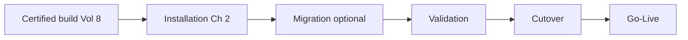
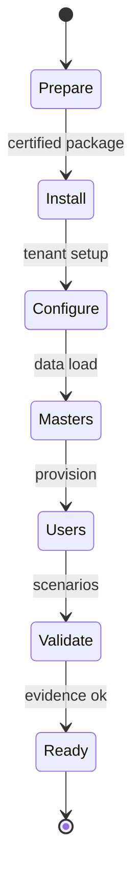
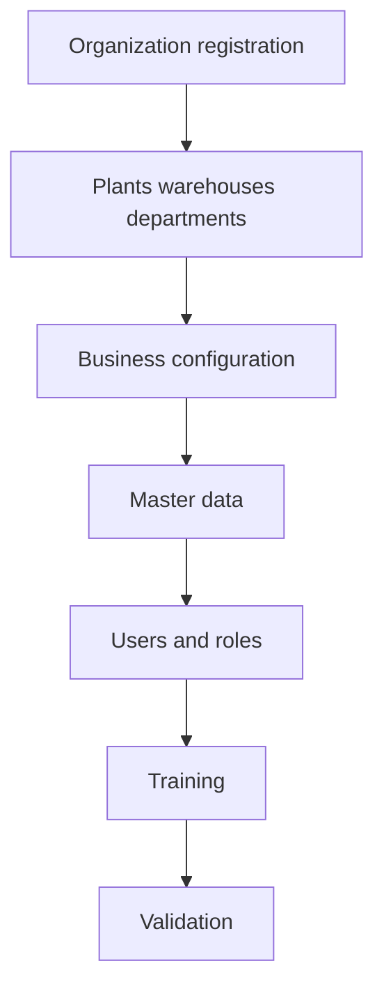
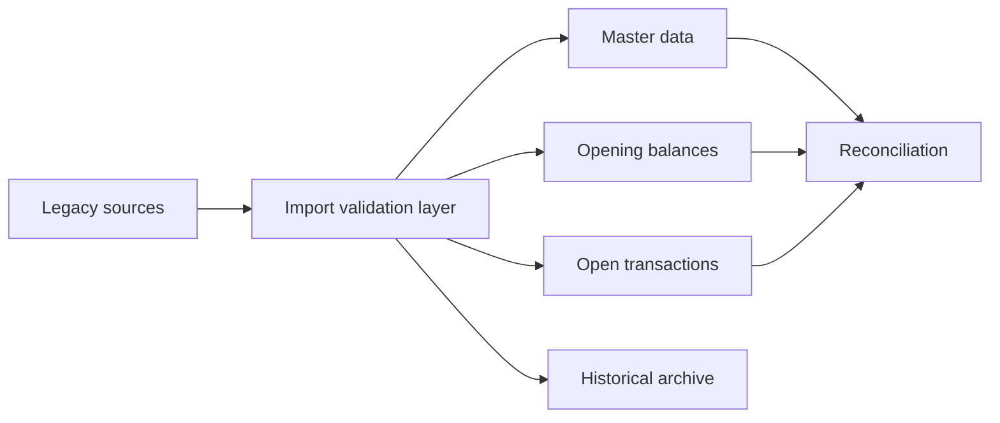
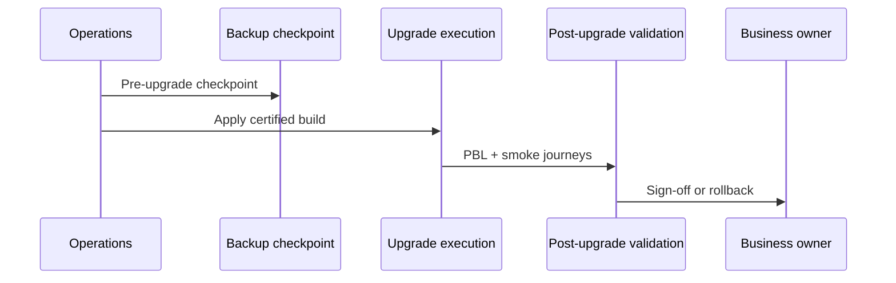
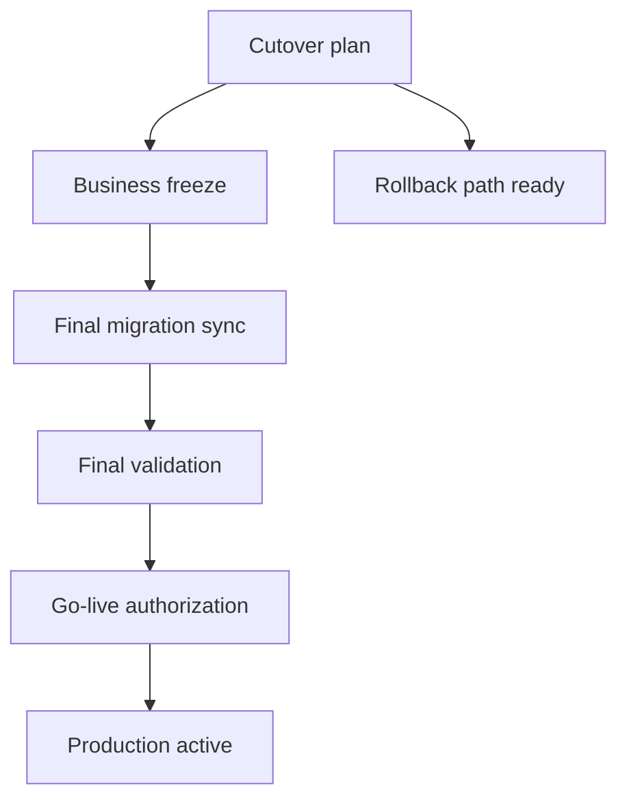
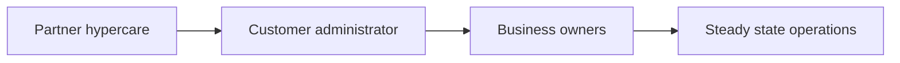

# Installation, Upgrade & Migration Architecture

| Field | Value |
|-------|-------|
| **Document ID** | FT-PD-091 |
| **Volume** | 9 — Deployment & Operations Architecture |
| **Chapter** | 2 — Installation, Upgrade & Migration Architecture |
| **Title** | Installation, Upgrade & Migration Architecture |
| **Version** | 1.0.0 |
| **Status** | Draft — Architecture Review |
| **Effective date** | 2026-05-29 |
| **Author** | FT ERP Product Team |
| **Owner** | FT ERP Product Architecture |
| **Audience** | Implementation partners, migration leads, cutover managers, system administrators, product owners |
| **Classification** | Product — Deployment & Operations Architecture |

**Parent documents:**

- [Chapter 1 — Deployment & Release Architecture](./Chapter_01_Deployment_and_Release_Architecture.md)
- [Volume 8 — Product Testing & Validation](../08_Product_Testing_and_Validation/README.md)
- [Volume 5 — Data Architecture](../05_Data_Architecture/README.md)
- [Volume 7, Ch. 4 — Configuration Architecture](../07_Security_and_Governance_Architecture/Chapter_04_Configuration_Business_Policies_and_Feature_Flag_Architecture.md)
- [Volume 7, Ch. 2 — Identity & Organization](../07_Security_and_Governance_Architecture/Chapter_02_Identity_User_Organization_and_Delegation_Architecture.md)

---

## 1. Document Control

| Version | Date | Author | Summary |
|---------|------|--------|---------|
| 1.0.0 | 2026-05-29 | FT ERP Product Team | Initial Installation, Upgrade & Migration Architecture |

**Supersedes:** None.

**Change authority:** Product Architecture + Implementation Governance. Migration policy changes require Volume 5 data integrity and Volume 8 validation alignment.

**Out of scope:** Installation commands, Docker, Kubernetes, cloud procedures, database scripts, shell scripts, source code.

---

## 2. Purpose

This chapter defines the **architectural model** for introducing FT ERP into a customer environment and **evolving that environment safely** over time.

It specifies:

- **Installation** and **environment preparation**
- **Customer onboarding**
- **Migration governance** — legacy, masters, opening balances
- **Upgrade governance** and **cutover architecture**
- **Post-migration / post-upgrade validation**
- **Operational readiness** transfer

The objective is to ensure installations and upgrades remain **predictable, recoverable, auditable**, and **consistent** across all deployment models ([FT-PD-090](./Chapter_01_Deployment_and_Release_Architecture.md)).

---

## 3. Scope

### 3.1 In scope

- Installation philosophy and stages (§5–6)
- Customer onboarding (§7)
- Migration architecture (§8)
- Upgrade architecture (§9)
- Production cutover (§10)
- Migration matrices (§12, §12A–E)
- Business Rules and diagrams (§11, §13)

### 3.2 Out of scope

- Field-level migration mapping spreadsheets (implementation project)
- Day-2 monitoring and support (Volume 9 Ch. 3 planned)
- Infrastructure provisioning detail (Ch. 1 deployment models only)

### 3.3 Lifecycle distinctions

| Term | Definition |
|------|------------|
| **Installation** | First-time placement of certified FT ERP for a tenant |
| **Deployment** | Placing a certified build in a target environment ([DEP-*](./Chapter_01_Deployment_and_Release_Architecture.md)) |
| **Migration** | Moving data or config from legacy systems into FT ERP |
| **Upgrade** | Moving from one certified build to a newer certified build |
| **Cutover** | Controlled switch from legacy or pilot to live FT ERP production |
| **Go-Live** | Business authorization to operate production ([FT-PD-083](../08_Product_Testing_and_Validation/Chapter_04_User_Acceptance_Certification_and_Release_Readiness.md)) |

---

## 4. Relationship with Previous Volumes

| Volume / Chapter | Relationship |
|------------------|--------------|
| **Vol. 5, Ch. 3** | Master data entities — migration targets |
| **Vol. 5, Ch. 5** | Opening stock as ledger movements — not silent balances |
| **Vol. 7, Ch. 2** | Org, users, roles — onboarding structure |
| **Vol. 7, Ch. 4** | Tenant configuration — separate from product defaults |
| **Vol. 8** | Certification before production; canonical validation post-install |
| **FT-PD-090** | Environments, release types, DEP-* deployment rules |
| **FT-PD-082** | Canonical factory for validation environment |

### 4.1 Installation consumes certification

Installation **consumes** certified releases and deployment architecture — it remains **operationally independent** per customer (own masters, config, cutover timing).

---

## 5. Installation Philosophy

| Principle | Definition |
|-----------|------------|
| **Certified product installation** | Only certified builds installed in pilot/production path |
| **Repeatable onboarding** | Standard stage model for all customers |
| **Configuration-first approach** | Exhaust configuration before customization ([Art. 18](../01_Product_Foundation/Chapter_02_FT_ERP_Constitution.md)) |
| **Business continuity** | Parallel run or freeze windows planned |
| **Validation before production** | Vol. 8 journeys before cutover |
| **Recoverable installation** | Rollback point before cutover |
| **Traceable migration** | Migration batches auditable |

---

## 6. Installation Architecture

Logical installation stages — **architecture only**:

| Stage | Objective |
|-------|-----------|
| **Environment preparation** | Target environment per FT-PD-090 §7; backup baseline |
| **Product installation** | Deploy certified package; record build identity |
| **Configuration initialization** | Enterprise/company/plant defaults; feature flags per CFG |
| **Master data setup** | Items, BOMs, partners, locations — validated loads |
| **User provisioning** | Users, roles, org assignment per Vol. 7 Ch. 2 |
| **Security initialization** | RBAC, SoD policy, password/session policy |
| **Validation** | Canonical or pilot scenarios; evidence toward certification path |

**Rule:** Installation completes in **validation or pilot** environment before production cutover ([INS-05](#11-business-rules)).

---

## 7. Customer Onboarding Architecture

### 7.1 Product setup vs customer configuration

| Layer | Owner | Examples |
|-------|-------|----------|
| **Product setup** | Partner + Admin | Certified build, engine defaults, product feature catalog |
| **Customer business configuration** | Customer + Partner | Plants, policies, thresholds, Art. 20 ownership mapping |

### 7.2 Onboarding entities

| Area | Content |
|------|---------|
| **Organization registration** | Enterprise, company, legal entity |
| **Business configuration** | Policies per Vol. 7 Ch. 4 — versioned |
| **Plants** | Manufacturing sites, active company scope |
| **Warehouses** | RM, FG, quarantine locations |
| **Departments** | Commercial, Store, Purchase, Production, QA |
| **Roles** | Standard roles + user assignment |
| **Initial master data** | Items, BOMs, customers, suppliers |
| **User enablement** | Active users; training on Dashboard / Workspace / CT |

---

## 8. Migration Architecture

### 8.1 Migration principles

| Source type | Governance |
|-------------|------------|
| **Legacy ERP migration** | Mapped fields; workflow not recreated retroactively for closed history |
| **Excel migration** | Validated import batches; error quarantine |
| **Master data migration** | Referential integrity per Vol. 5 Ch. 3 |
| **Opening balances** | Ledger movements — opening stock events |
| **Transaction history** | Optional read-only archive — not replayed through engine |
| **Configuration migration** | CFG lifecycle — versioned effective dates |
| **Data validation** | Reconciliation reports; sign-off before cutover |

### 8.2 Data class distinctions

| Class | Definition | Workflow Engine |
|-------|------------|-----------------|
| **Historical migration** | Closed legacy records for reference/reporting | **Not** re-driven through FT ERP transitions |
| **Opening data** | Balances and open doc equivalents at cutover date | Posted via governed opening processes |
| **Live operational data** | Post-cutover transactions | Full Workflow Engine |

**Rule:** **Migration must preserve historical correctness** — no retroactive alteration of FT ERP audit once live ([INS-02](#11-business-rules), [WES-03](../05_Data_Architecture/Chapter_01_Workflow_Event_Store_and_Correlation_Persistence.md)).

---

## 9. Upgrade Architecture

Extends [FT-PD-090 §9](./Chapter_01_Deployment_and_Release_Architecture.md):

| Topic | Governance |
|-------|------------|
| **Version compatibility** | Declared paths only — unsupported skip blocked |
| **Schema evolution** | Forward alignment; historical rows preserved |
| **Configuration preservation** | CFG versions migrate; supersede not edit |
| **Historical integrity** | WES, ledger, audit immutable |
| **Upgrade sequencing** | Backup → upgrade → post-validation → sign-off |
| **Rollback readiness** | Pre-upgrade checkpoint ([DEP-03](./Chapter_01_Deployment_and_Release_Architecture.md)) |
| **Upgrade validation** | PBL spot suite + J-01 smoke minimum |

---

## 10. Production Cutover

| Element | Definition |
|---------|------------|
| **Cutover planning** | Timeline, freeze window, rollback authority |
| **Business freeze** | No parallel conflicting transactions in legacy during final sync |
| **Final validation** | UAT packs + journey spot checks |
| **Go-live readiness** | FT-PD-083 §12C matrix satisfied |
| **Rollback preparation** | Last good checkpoint documented |
| **Hypercare period** | Elevated support post go-live — architecture-neutral duration |
| **Operational ownership transfer** | L1 to customer admin; Partner L2 per contract |

**Rule:** **Cutover requires business approval** — Pilot Sponsor / Business Owner sign-off ([INS-06](#11-business-rules)).

---

## 11. Business Rules

| ID | Rule |
|----|------|
| **INS-01** | **Only certified releases may be installed** in pilot/production path ([DEP-01](./Chapter_01_Deployment_and_Release_Architecture.md)). |
| **INS-02** | **Migration must preserve historical correctness** — reconciled before cutover. |
| **INS-03** | **Customer configuration remains separate from product configuration** — tenant CFG scope only. |
| **INS-04** | **Every upgrade requires validation** — post-upgrade smoke minimum ([DEP-12](./Chapter_01_Deployment_and_Release_Architecture.md)). |
| **INS-05** | **Validation environment completion required** before production cutover. |
| **INS-06** | **Cutover requires business approval** — documented sign-off. |
| **INS-07** | **Rollback capability must exist** before production migration or upgrade ([DEP-03](./Chapter_01_Deployment_and_Release_Architecture.md)). |
| **INS-08** | **Opening stock posts through ledger** — not silent inventory fields ([Vol. 5 Ch. 5](../05_Data_Architecture/Chapter_05_Inventory_Ledger_and_Stock_Persistence_Architecture.md)). |
| **INS-09** | **Open transactions at cutover** enter via governed opening workflow — not bulk state override. |
| **INS-10** | **Migration batches are auditable** — batch id, actor, record counts. |
| **INS-11** | **Master data migration validates referential integrity** before dependent transactions. |
| **INS-12** | **Hypercare does not relax protected behaviors** — PBL rules remain enforced. |

---

## 12. Migration Matrices

### 12A. Installation Stage Matrix

| Stage | Objective | Evidence | Owner |
|-------|-----------|----------|-------|
| **Environment preparation** | Ready target env | Environment checklist | Administrator |
| **Product installation** | Certified build deployed | Build identity record | Partner |
| **Configuration initialization** | Tenant policies set | CFG version record | Partner + Admin |
| **Master data setup** | Masters loaded | Reconciliation report | Partner + Store lead |
| **User provisioning** | Roles assigned | User/role audit | Administrator |
| **Security initialization** | RBAC active | SEC spot check | Security lead |
| **Validation** | Scenarios pass | Journey evidence pack | Validation Lead |

### 12B. Migration Matrix

| Data Category | Migration Method | Validation | Approval |
|---------------|------------------|------------|----------|
| **Master Data** | Import batch / legacy extract | Referential integrity | Data steward |
| **Opening Stock** | Ledger opening movements | Stock reconciliation | Store + Finance |
| **Open Transactions** | Governed opening docs | Workflow-legal states only | Process owners |
| **Historical Transactions** | Archive/reference load | Read-only verification | Compliance (if required) |
| **Configuration** | CFG import with versioning | Effective date review | Product Architecture delegate |
| **Security** | User/role mapping | SoD check | Security lead |

### 12C. Upgrade Matrix

| Upgrade Type | Validation Required | Rollback Required | Approval |
|--------------|---------------------|-------------------|----------|
| **Patch** | PBL touched paths + smoke | Yes | QA + Admin |
| **Minor** | Domain regression + J-01 spot | Yes | Product Architecture delegate |
| **Major** | Full Vol. 8 gate evidence | Yes + DR check | Product Owner + Release Board |

### 12D. Cutover Readiness Matrix

| Readiness Area | Validation | Approval | Evidence |
|----------------|------------|----------|----------|
| **Certification** | Valid cert for build | Product Owner | Cert record |
| **Migration** | Reconciliation complete | Data steward | Migration sign-off |
| **UAT** | Role packs complete | Process owners | UAT artifacts |
| **Training** | Users trained | HR/Ops liaison | Training record |
| **Rollback** | Checkpoint verified | Administrator | Backup verification |
| **Go-Live** | FT-PD-083 §12C | Pilot Sponsor | Authorization record |

### 12E. Customer Adoption Strategy Matrix

| Customer Type | Recommended Deployment | Migration Complexity | Go-Live Strategy | Hypercare Recommendation |
|---------------|------------------------|----------------------|------------------|--------------------------|
| **Greenfield implementation** | Local or on-prem pilot → prod | Low — masters only | Phased plant rollout optional | Standard — 2–4 weeks |
| **Existing ERP migration** | On-prem or private cloud | High — masters + open + history | Parallel run then cutover | Extended — 4–8 weeks |
| **Excel-based migration** | Local pilot strongly advised | Medium — validated imports | Single plant cutover | Standard with data focus |
| **Pilot customer** | Local or single plant | Low–medium | Pilot → production promote | Standard |
| **Enterprise rollout** | On-prem / hybrid | High — multi-plant sequencing | Wave by plant/BU | Extended + dedicated war room |

---

## 13. Logical Diagrams

### 13.1 Installation lifecycle

### 13.2 Customer onboarding flow

### 13.3 Migration architecture

### 13.4 Upgrade sequence

### 13.5 Production cutover

### 13.6 Operational handover

---

## 14. Review Checklist

- [ ] Installation completeness — §6, §12A all stages
- [ ] Migration completeness — §8, §12B all categories
- [ ] Upgrade governance — §9, §12C aligned with DEP-*
- [ ] Configuration separation — INS-03, §7.1
- [ ] Cutover readiness — §10, §12D
- [ ] Volume 8 certification alignment — INS-01, cutover matrix
- [ ] §12E customer adoption strategies
- [ ] Six Mermaid diagrams
- [ ] No scripts, Docker, cloud, or code

---

## 15. Change Log

| Version | Date | Author | Summary |
|---------|------|--------|---------|
| 1.0.0 | 2026-05-29 | FT ERP Product Team | Initial Installation, Upgrade & Migration Architecture |

---

## 16. Approval Block

| Role | Name | Signature | Date |
|------|------|-----------|------|
| Product Owner | | | |
| Product Architecture | | | |
| Implementation Partner Lead | | | |
| Migration / Cutover Lead | | | |
| Compliance Officer | | | |

---

## Writing Requirements

Remain **technology-neutral**.

**Do not include:** Installation commands, Docker, Kubernetes, cloud-specific procedures, database scripts, shell scripts, source code.

**Describe architectural governance only.**

---

## Document navigation

| | Link |
|--|------|
| **Previous** | [Deployment & Release Architecture](./Chapter_01_Deployment_and_Release_Architecture.md) (FT-PD-090) |
| **Next** | [Operational Monitoring, Support & Maintenance Architecture](./Chapter_03_Operational_Monitoring_Support_and_Maintenance_Architecture.md) (FT-PD-092) |
| **Volume** | [Deployment and Operations Architecture](./README.md) |
| **Product** | [Product Documentation Index](../README.md) |

