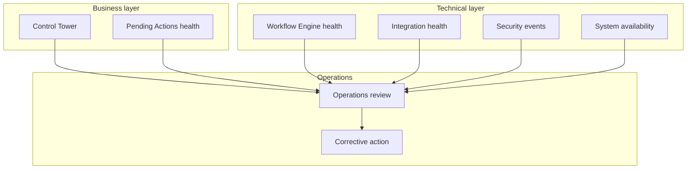
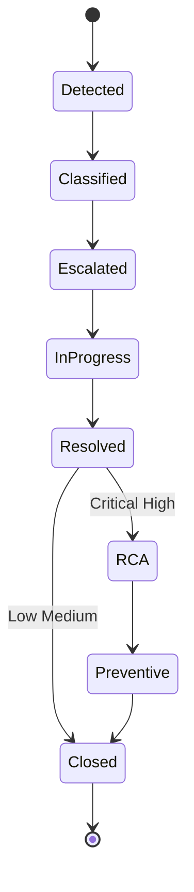
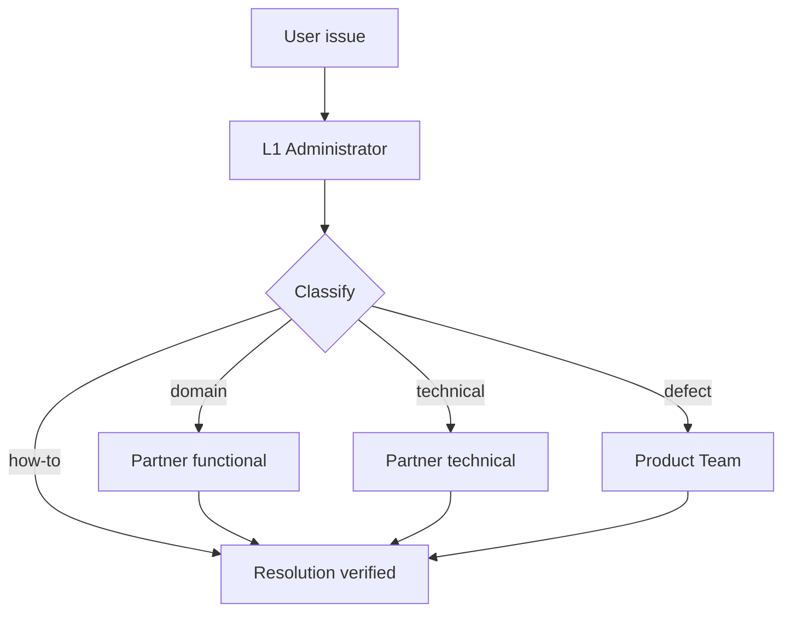
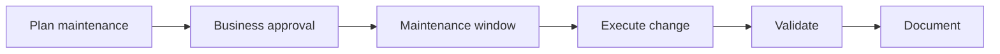
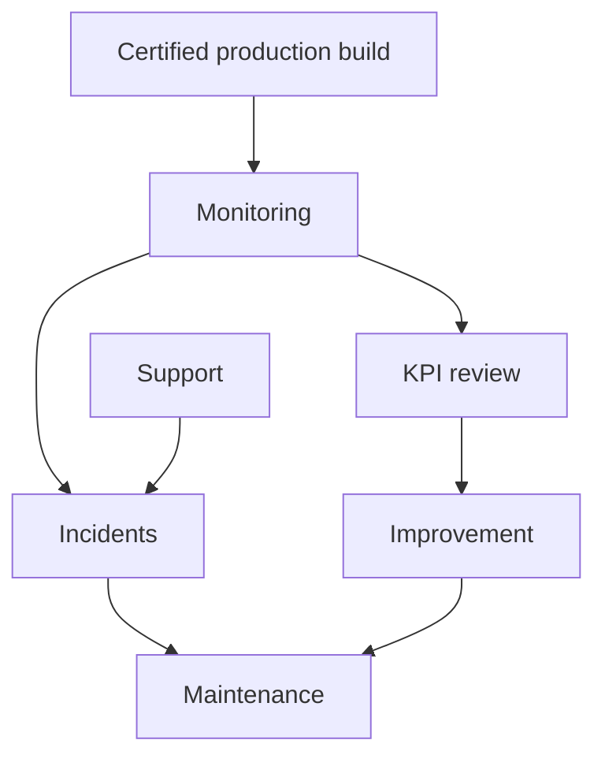

# Operational Monitoring, Support & Maintenance Architecture

| Field | Value |
|-------|-------|
| **Document ID** | FT-PD-092 |
| **Volume** | 9 — Deployment & Operations Architecture |
| **Chapter** | 3 — Operational Monitoring, Support & Maintenance Architecture |
| **Title** | Operational Monitoring, Support & Maintenance Architecture |
| **Version** | 1.0.0 |
| **Status** | Draft — Architecture Review |
| **Effective date** | 2026-05-29 |
| **Author** | FT ERP Product Team |
| **Owner** | FT ERP Product Architecture |
| **Audience** | Operations managers, support leads, customer administrators, implementation partners, product owners |
| **Classification** | Product — Operations Architecture |

**Parent documents:**

- [Chapter 1 — Deployment & Release Architecture](./Chapter_01_Deployment_and_Release_Architecture.md)
- [Chapter 2 — Installation, Upgrade & Migration Architecture](./Chapter_02_Installation_Upgrade_and_Migration_Architecture.md)
- [Volume 6, Ch. 3 — Control Tower](../06_UI_and_Experience_Architecture/Chapter_03_Control_Tower_Architecture_and_Factory_Monitoring.md)
- [Volume 7 — Security & Governance Architecture](../07_Security_and_Governance_Architecture/README.md)
- [Volume 8 — Product Testing & Validation](../08_Product_Testing_and_Validation/README.md)

---

## 1. Document Control

| Version | Date | Author | Summary |
|---------|------|--------|---------|
| 1.0.0 | 2026-05-29 | FT ERP Product Team | Initial Operational Monitoring, Support & Maintenance Architecture |

**Supersedes:** None.

**Change authority:** Product Architecture + Operations Governance. Operational policy changes require PBL and certification alignment when production behavior is affected.

**Out of scope:** Helpdesk software, ticketing systems, monitoring tools, cloud products, scripts, infrastructure implementation, source code.

---

## 2. Purpose

This chapter defines **operational governance architecture** for FT ERP **after production go-live**.

It specifies:

- **Operational monitoring** and production health
- **Incident governance** and **user support**
- **Maintenance governance**
- **Operational metrics** and **service continuity**
- **Continuous operational improvement**

The objective is to ensure FT ERP remains **stable, reliable, traceable**, and **continuously supported** throughout its production lifecycle.

---

## 3. Scope

### 3.1 In scope

- Operational philosophy (§5)
- Monitoring architecture (§6)
- Support and incident governance (§7–8)
- Maintenance architecture (§9)
- Operational KPIs (§10)
- Operational matrices (§12, §12A–F)
- Business Rules and diagrams (§11, §13)

### 3.2 Out of scope

- Backup/DR detail (Volume 9 Ch. 4 planned — FT-PD-093)
- Product roadmap and feature development
- Per-ticket helpdesk procedures

### 3.3 Concept distinctions

| Concept | Definition |
|---------|------------|
| **Operations** | Running certified FT ERP in production |
| **Monitoring** | Observing health — workflow, integration, security |
| **Support** | Assisting users to complete valid work |
| **Maintenance** | Planned or corrective changes to deployed environment |
| **Incident management** | Restoring service or data integrity after failure |
| **Product enhancement** | New capability via certified release — not ad-hoc production patch |

**Prerequisite chain:** Production operations begin only after **certification** (Vol. 8), **deployment** (Ch. 1), **installation/migration** (Ch. 2), and **cutover / go-live** authorization ([FT-PD-083](../08_Product_Testing_and_Validation/Chapter_04_User_Acceptance_Certification_and_Release_Readiness.md)).

---

## 4. Relationship with Previous Volumes

| Volume / Chapter | Relationship |
|------------------|--------------|
| **Vol. 6, Ch. 3** | Control Tower — factory monitor surface; not L1 helpdesk |
| **Vol. 7, Ch. 1** | Security events, RBAC — operational security monitoring |
| **Vol. 7, Ch. 5** | Integration health — INT audit and failure isolation |
| **Vol. 8, Ch. 2** | PBL — operations never weaken protected behaviors |
| **Vol. 8, Ch. 4–5** | Certification and evidence — production fixes via release governance |
| **FT-PD-090** | Certified build identity in production |
| **FT-PD-091** | Hypercare handover to steady-state operations |

---

## 5. Operational Philosophy

| Principle | Definition |
|-----------|------------|
| **Stability before enhancement** | Restore service before new features |
| **Evidence-based operations** | Decisions backed by logs, audit, monitoring samples |
| **Business continuity** | Factory operations resume with defined RTO |
| **Preventive maintenance** | Planned windows — not reactive chaos |
| **Continuous monitoring** | Workflow, integration, security — ongoing |
| **Predictable support** | Defined escalation — not ad-hoc heroics |
| **Controlled operational change** | Production changes via DEP/INS governance |

---

## 6. Operational Monitoring Architecture

Logical monitoring areas — **no tool prescription**:

| Area | Monitoring objective |
|------|---------------------|
| **Workflow execution health** | Stuck Pending Actions, Guard failure rates, transition errors |
| **Background processing** | Scheduled jobs, projection lag, integration retries |
| **Integration health** | Failed handoffs, dead-letter queue depth ([INT-05](../07_Security_and_Governance_Architecture/Chapter_05_Platform_Integration_and_External_Trust_Boundaries.md)) |
| **Security monitoring** | Auth failures, SoD flags, unusual export activity |
| **Database health** | Availability, capacity trends — architecture-neutral |
| **User activity** | Session patterns, role usage — privacy-governed |
| **System availability** | Uptime relative to agreed service profile |

**Factory business monitor:** [Control Tower](../06_UI_and_Experience_Architecture/Chapter_03_Control_Tower_Architecture_and_Factory_Monitoring.md) provides **business operational visibility** — complements technical monitoring, does not replace it.

---

## 7. Support Governance

| Element | Definition |
|---------|------------|
| **User assistance** | Help complete valid workflow actions in Workspace |
| **Issue classification** | Route to correct resolver tier |
| **Functional support** | Domain process questions — Store, Purchase, etc. |
| **Technical support** | Environment, access, integration — Administrator / Partner |
| **Escalation model** | L1 → L2 → Product — defined contacts |
| **Knowledge management** | Product documentation, role guides — not tribal knowledge |
| **Resolution verification** | User confirms workflow outcome — not ticket closed alone |

### 7.1 Issue type distinctions

| Type | Typical cause | Resolver |
|------|---------------|----------|
| **Product defect** | PBL or Guard violation in certified build | Product via Partner |
| **Configuration issue** | CFG policy, role, scope mis-set | Partner + Administrator |
| **User training issue** | Surface misuse, wrong role expectation | Business owner + training |
| **Business process issue** | Factory policy vs product architecture | Customer process owner |

---

## 8. Incident Management Architecture

| Phase | Governance |
|-------|------------|
| **Identification** | Monitoring alert, user report, or audit anomaly |
| **Classification** | Functional, technical, security, data integrity |
| **Severity assessment** | Business impact + architecture impact ([FT-PD-082 §10](../08_Product_Testing_and_Validation/Chapter_03_Canonical_Test_Data_Factory_Simulation_and_Acceptance_Scenarios.md) aligned) |
| **Business impact** | Production stoppage, single domain, single user |
| **Escalation** | Per §12C — time-bound |
| **Resolution** | Restore service; preserve audit trail |
| **Root cause analysis** | Required for Critical/High — evidence-based |
| **Preventive actions** | Config fix, training, or **certified** product fix |

**Rule:** **Every incident requires closure evidence** — timeline, actions, outcome ([OPS-04](#11-business-rules)).

---

## 9. Maintenance Architecture

| Category | Definition | Governance |
|----------|------------|------------|
| **Preventive maintenance** | Planned health checks, cert compliance reviews | Scheduled window; no semantic change |
| **Corrective maintenance** | Fix verified defect via certified patch | DEP/REL emergency path if needed |
| **Adaptive maintenance** | Adjust config for factory change | CFG lifecycle — audited |
| **Perfective maintenance** | Performance tuning within architecture | No PBL weakening |
| **Emergency maintenance** | Critical production restore | Enhanced audit; post-incident review |

**Rule:** **Production fixes follow release governance** — uncertified code in production prohibited ([OPS-02](#11-business-rules)).

---

## 10. Operational KPIs

KPI **categories** — numerical targets are tenant/contract specific:

| Category | Measurement objective |
|----------|----------------------|
| **System availability** | Production reachable for authorized users |
| **Workflow success** | Valid transitions complete without Guard failure spike |
| **Incident response** | Time to acknowledge by severity class |
| **Incident resolution** | Time to restore service |
| **User satisfaction** | Support outcome survey — architecture-neutral method |
| **Operational efficiency** | Pending Action age distribution — factory KPI |
| **Data integrity** | Ledger reconciliation anomalies — zero unexplained |

Review cadence in §12E — typically monthly operations review, quarterly governance alignment.

---

## 11. Business Rules

| ID | Rule |
|----|------|
| **OPS-01** | **Operations never bypass protected behaviors** ([PBL-07](../08_Product_Testing_and_Validation/Chapter_02_Workflow_Regression_Guardrails_and_Protected_Behavior_Catalog.md), [INS-12](./Chapter_02_Installation_Upgrade_and_Migration_Architecture.md)). |
| **OPS-02** | **Production fixes follow release governance** — certified patch or hotfix cert ([DEP-04](./Chapter_01_Deployment_and_Release_Architecture.md)). |
| **OPS-03** | **Emergency fixes remain traceable** — build identity, actor, audit ([REL-08](../08_Product_Testing_and_Validation/Chapter_04_User_Acceptance_Certification_and_Release_Readiness.md)). |
| **OPS-04** | **Every incident requires closure evidence** — RCA for Critical/High. |
| **OPS-05** | **Monitoring evidence remains auditable** — retention per governance policy. |
| **OPS-06** | **Operational changes preserve certification integrity** — no uncertified drift. |
| **OPS-07** | **Support does not execute workflow on behalf of users** without proper identity and audit ([IDN-09](../07_Security_and_Governance_Architecture/Chapter_02_Identity_User_Organization_and_Delegation_Architecture.md)). |
| **OPS-08** | **Configuration changes in production** follow CFG lifecycle ([CFG-05](../07_Security_and_Governance_Architecture/Chapter_04_Configuration_Business_Policies_and_Feature_Flag_Architecture.md)). |
| **OPS-09** | **Integration incidents** never resolved by direct external state write ([INT-01](../07_Security_and_Governance_Architecture/Chapter_05_Platform_Integration_and_External_Trust_Boundaries.md)). |
| **OPS-10** | **Hypercare transition** completes before steady-state SLA applies ([FT-PD-091 §12E](./Chapter_02_Installation_Upgrade_and_Migration_Architecture.md)). |
| **OPS-11** | **Preventive maintenance windows** communicated to business owners before execution. |
| **OPS-12** | **Continuous compliance reviews** per [EVD-06](../08_Product_Testing_and_Validation/Chapter_05_Validation_Evidence_Audit_Trails_and_Continuous_Compliance.md) feed operational improvement. |

---

## 12. Operational Matrices

### 12A. Monitoring Matrix

| Operational Area | Monitoring Objective | Evidence | Owner |
|------------------|---------------------|----------|-------|
| **Workflow health** | No abnormal Guard failure rate | Engine audit sample | Workflow delegate |
| **Background jobs** | Jobs complete within window | Job log summary | Administrator |
| **Integration** | No unresolved dead-letter growth | Integration audit | Integration delegate |
| **Security** | Auth/SoD anomalies investigated | Security audit sample | Security lead |
| **Data store health** | Availability and capacity trend | Health check record | Administrator |
| **User activity** | Expected role usage patterns | Anonymized usage summary | Administrator |
| **Availability** | Uptime vs service profile | Availability log | Operations manager |

### 12B. Support Matrix

| Support Category | Primary Owner | Escalation | Resolution Evidence |
|------------------|---------------|------------|---------------------|
| **L1 user how-to** | Customer Administrator | L2 Partner | User confirmation |
| **Functional domain** | Business process owner | Partner functional | Workflow outcome verified |
| **Technical environment** | Administrator | Partner technical | Service restored log |
| **Product defect** | Partner | Product engineering | Certified fix deployed |
| **Configuration** | Partner + Admin | Product Architecture delegate | CFG change audit |
| **Security** | Security lead | Product security | SEC incident record |

### 12C. Incident Matrix

| Severity | Business Impact | Escalation | Approval |
|----------|-----------------|------------|----------|
| **Critical** | Production stopped; integrity risk | Immediate L2 + Product | Business owner + Product Owner |
| **High** | Major domain blocked | L2 within agreed time | Operations manager |
| **Medium** | Workaround exists | L1 → L2 if unresolved | Administrator |
| **Low** | Minor inconvenience | L1 | Administrator |
| **Cosmetic** | No operational impact | Backlog | Optional |

### 12D. Maintenance Matrix

| Maintenance Type | Trigger | Validation | Approval |
|------------------|---------|------------|----------|
| **Preventive** | Schedule | Health checklist | Administrator |
| **Corrective** | Verified defect | Post-patch smoke | QA + Admin |
| **Adaptive** | Factory policy change | CFG effective date | Business owner |
| **Perfective** | Performance review | No PBL regression | Administrator |
| **Emergency** | Critical incident | Enhanced audit + follow-up cert | Product Owner path |

### 12E. Operational KPI Matrix

| KPI Category | Measurement Objective | Evidence | Review Owner |
|--------------|---------------------|----------|--------------|
| **Availability** | Service reachable | Uptime summary | Operations manager |
| **Workflow success** | Transition success rate | Guard failure trend | Workflow delegate |
| **Incident response** | Ack time by severity | Incident log | Support lead |
| **Incident resolution** | Restore time | Closure record | Operations manager |
| **User satisfaction** | Support quality | Survey or feedback | Business owner |
| **Operational efficiency** | PA age KPIs | Control Tower export | Management |
| **Data integrity** | Reconciliation clean | Ledger check | Store + Finance |

### 12F. Operational Responsibility Matrix

| Operational Activity | Product Team | Implementation Partner | Customer Administrator | Business Owner |
|----------------------|--------------|------------------------|------------------------|----------------|
| **Monitoring** | Defines what to monitor | May operate tools | **Executes** daily | Reviews KPIs |
| **Incident response** | Escalation for defects | **L2 lead** | **L1 first** | Business impact calls |
| **Maintenance** | Cert patches | Planned maintenance | **Executes** windows | Approves freeze |
| **Upgrades** | Compatibility | **Executes** | Assists | Approves window |
| **User support** | Documentation | **Functional L2** | **L1** | Process guidance |
| **Configuration** | Policy floor | **Implements** CFG | Approves tenant scope | Business policy |
| **Business process** | Architecture reference | Advises | — | **Owns** factory process |

---

## 13. Logical Diagrams

### 13.1 Operational monitoring architecture

### 13.2 Incident lifecycle

### 13.3 Support escalation flow

### 13.4 Maintenance lifecycle

### 13.5 Operational governance

### 13.6 Continuous improvement cycle

---

## 14. Review Checklist

- [ ] Monitoring completeness — §6, §12A
- [ ] Incident governance — §8, §12C, OPS-04
- [ ] Support governance — §7, §12B, issue types
- [ ] Maintenance governance — §9, §12D
- [ ] KPI coverage — §10, §12E
- [ ] Responsibility boundaries — §12F
- [ ] Certification alignment — OPS-02, OPS-06
- [ ] Six Mermaid diagrams
- [ ] No helpdesk tools, monitoring products, or code

---

## 15. Change Log

| Version | Date | Author | Summary |
|---------|------|--------|---------|
| 1.0.0 | 2026-05-29 | FT ERP Product Team | Initial Operational Monitoring, Support & Maintenance Architecture |

---

## 16. Approval Block

| Role | Name | Signature | Date |
|------|------|-----------|------|
| Product Owner | | | |
| Product Architecture | | | |
| Operations Governance Lead | | | |
| Implementation Partner Liaison | | | |
| Customer Operations Representative | | | |

---

## Writing Requirements

Remain **technology-neutral**.

**Do not include:** Helpdesk software, ticketing systems, monitoring tools, cloud monitoring products, scripts, infrastructure implementation, source code.

**Describe governance architecture only.**

---

## Document navigation

| | Link |
|--|------|
| **Previous** | [Installation, Upgrade & Migration Architecture](./Chapter_02_Installation_Upgrade_and_Migration_Architecture.md) (FT-PD-091) |
| **Next** | [Backup, Recovery, Business Continuity & Disaster Recovery Architecture](./Chapter_04_Backup_Recovery_Business_Continuity_and_Disaster_Recovery_Architecture.md) (FT-PD-093) |
| **Volume** | [Deployment and Operations Architecture](./README.md) |
| **Product** | [Product Documentation Index](../README.md) |

