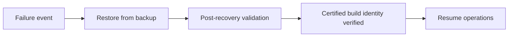
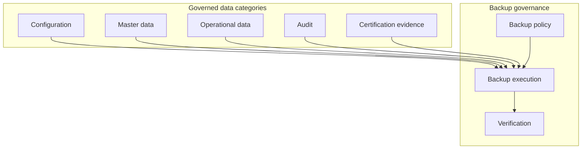
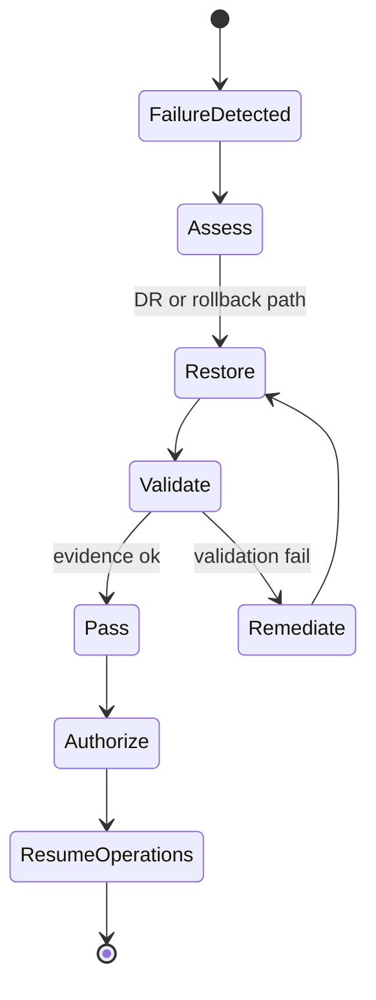
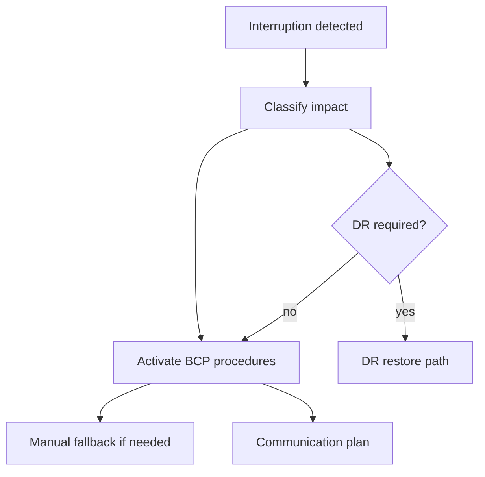
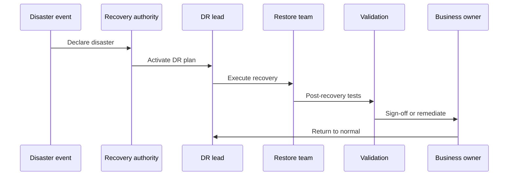
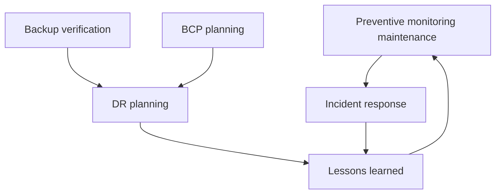
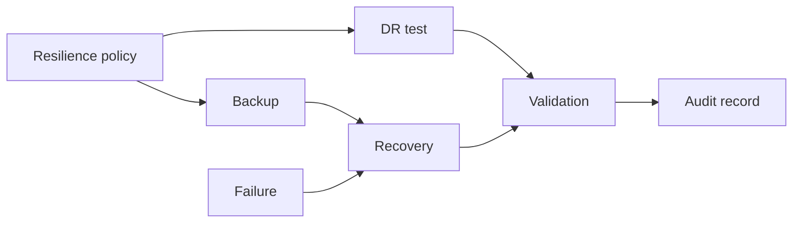

# Backup, Recovery, Business Continuity & Disaster Recovery Architecture

| Field | Value |
|-------|-------|
| **Document ID** | FT-PD-093 |
| **Volume** | 9 — Deployment & Operations Architecture |
| **Chapter** | 4 — Backup, Recovery, Business Continuity & Disaster Recovery Architecture |
| **Title** | Backup, Recovery, Business Continuity & Disaster Recovery Architecture |
| **Version** | 1.0.0 |
| **Status** | Draft — Architecture Review |
| **Effective date** | 2026-05-29 |
| **Author** | FT ERP Product Team |
| **Owner** | FT ERP Product Architecture |
| **Audience** | Operations managers, DR leads, compliance officers, administrators, implementation partners |
| **Classification** | Product — Resilience & Operations Architecture |

**Parent documents:**

- [Chapter 1 — Deployment & Release Architecture](./Chapter_01_Deployment_and_Release_Architecture.md)
- [Chapter 2 — Installation, Upgrade & Migration Architecture](./Chapter_02_Installation_Upgrade_and_Migration_Architecture.md)
- [Chapter 3 — Operational Monitoring, Support & Maintenance Architecture](./Chapter_03_Operational_Monitoring_Support_and_Maintenance_Architecture.md)
- [Volume 7, Ch. 3 — Audit & Retention Governance](../07_Security_and_Governance_Architecture/Chapter_03_Audit_Compliance_and_Data_Retention_Governance.md)
- [Volume 8, Ch. 5 — Validation Evidence](../08_Product_Testing_and_Validation/Chapter_05_Validation_Evidence_Audit_Trails_and_Continuous_Compliance.md)

---

## 1. Document Control

| Version | Date | Author | Summary |
|---------|------|--------|---------|
| 1.0.0 | 2026-05-29 | FT ERP Product Team | Initial Backup, Recovery, Business Continuity & Disaster Recovery Architecture |

**Supersedes:** None.

**Change authority:** Product Architecture + Resilience Governance. DR policy changes require Volume 5 data integrity and Volume 8 certification alignment.

**Out of scope:** Backup software, storage technologies, cloud vendors, replication products, database commands, scripts, source code.

---

## 2. Purpose

This chapter defines the **architectural governance model** that enables FT ERP deployments to withstand failures while preserving **business continuity**, **certified data integrity**, and **operational trust**.

It specifies:

- **Backup** and **recovery governance**
- **Business Continuity Planning (BCP)**
- **Disaster Recovery (DR)**
- **Operational resilience** and **risk governance**
- **Recovery validation** and **ownership**

The objective is to ensure FT ERP can **recover from failures** without compromising product architecture, protected behaviors, or historical correctness.

---

## 3. Scope

### 3.1 In scope

- Resilience philosophy (§5)
- Backup, recovery, BCP, DR architecture (§6–9)
- Operational risk management (§10)
- Resilience matrices (§12, §12A–F)
- Business Rules and diagrams (§11, §13)

### 3.2 Out of scope

- High-availability cluster design and replication topology
- RPO/RTO numeric SLAs (tenant-contract specific)
- Cyber-insurance and legal disaster declarations

### 3.3 Concept distinctions

| Concept | Definition |
|---------|------------|
| **Backup** | Point-in-time protected copy of governed data categories |
| **Restore** | Returning data from backup to a target environment |
| **Recovery** | Restoring **certified operational capability** including validation |
| **Business Continuity** | Maintaining critical factory functions during interruption |
| **Disaster Recovery** | Formal recovery after major loss event |
| **High Availability** | Reducing outage probability — complementary, not substitute for DR |

**Rule:** Recovery **restores certified operational states** — it **never replaces** certification or post-recovery validation ([RES-01](#11-business-rules)).

---

## 4. Relationship with Previous Volumes

| Volume / Chapter | Relationship |
|------------------|--------------|
| **Vol. 5** | WES immutability, ledger integrity — recovery must not rewrite history |
| **Vol. 7, Ch. 3** | Operational audit retention, legal hold — backup scope includes audit |
| **Vol. 8, Ch. 4–5** | Certification records, EVD evidence — protected in backup |
| **FT-PD-090** | Rollback philosophy, DEP-03 rollback before upgrade |
| **FT-PD-091** | Cutover rollback checkpoint, INS-07 |
| **FT-PD-092** | Incident → maintenance; OPS rules during recovery |

### 4.1 Recovery vs certification

Restored environment must match **known certified build** and pass **post-recovery validation** — not assumed healthy by restore alone.

---

## 5. Resilience Philosophy

| Principle | Definition |
|-----------|------------|
| **Recoverability** | Every production deployment has tested recovery path |
| **Historical correctness** | WES, ledger, audit preserved — no silent rewrite |
| **Business continuity** | Factory critical functions have fallback plan |
| **Operational resilience** | Failures isolated; recovery controlled |
| **Controlled recovery** | Authority, sequencing, audit — not ad-hoc restore |
| **Evidence preservation** | Certification and validation evidence in backup scope |
| **Risk-based planning** | DR depth proportional to business impact |

---

## 6. Backup Architecture

Logical backup governance by information category — **no tool prescription**:

| Category | Protection objective |
|----------|---------------------|
| **Product configuration** | Certified build reference, release manifest |
| **Customer configuration** | Versioned CFG policies ([Vol. 7 Ch. 4](../07_Security_and_Governance_Architecture/Chapter_04_Configuration_Business_Policies_and_Feature_Flag_Architecture.md)) |
| **Master data** | Items, BOMs, partners, org structure |
| **Operational data** | Transactional documents, ledger, Event Store |
| **Validation evidence** | Journey packs, regression results ([EVD-*](../08_Product_Testing_and_Validation/Chapter_05_Validation_Evidence_Audit_Trails_and_Continuous_Compliance.md)) |
| **Certification records** | Build identity, gate sign-offs ([REL-*](../08_Product_Testing_and_Validation/Chapter_04_User_Acceptance_Certification_and_Release_Readiness.md)) |
| **Audit records** | Operational and governance audit ([GOV-01](../07_Security_and_Governance_Architecture/Chapter_03_Audit_Compliance_and_Data_Retention_Governance.md)) |

**Governance:** Backup frequency, retention, and verification are **customer operational policies** within architecture minimums — verification evidence required ([RES-06](#11-business-rules)).

---

## 7. Recovery Architecture

| Recovery area | Objective |
|---------------|-----------|
| **Environment recovery** | Restore application tier to certified build |
| **Database recovery** | Restore operational persistence with point-in-time integrity |
| **Configuration recovery** | Restore CFG versions effective at recovery point |
| **User recovery** | Identity, roles, delegation state per Vol. 7 Ch. 2 |
| **Operational recovery** | Workflow Engine operational; integrations revalidated |
| **Validation after recovery** | PBL spot + smoke journey before business resume |

### 7.1 Recovery phase distinctions

| Phase | Definition |
|-------|------------|
| **Restore** | Technical return of data and binaries from backup |
| **Recovery** | Governed process including validation and authority |
| **Resume operations** | Business authorization after post-recovery validation |

---

## 8. Business Continuity Architecture

| Element | Governance |
|---------|------------|
| **Business interruption** | Classify duration and scope — single plant vs enterprise |
| **Critical business functions** | Minimum: material accountability, open WO safety, payroll-adjacent billing |
| **Operational priorities** | Safety → material integrity → open orders → reporting |
| **Manual fallback procedures** | Documented factory procedures when ERP unavailable — architecture-neutral |
| **Communication governance** | Named contacts: operations, business, Partner, Product escalation |
| **Recovery sequencing** | Restore masters → open transactions → resume new work |

BCP addresses **continuity of factory operations** during outage — not replacement for DR restore.

---

## 9. Disaster Recovery Architecture

| Element | Governance |
|---------|------------|
| **Disaster declaration** | Authority: Customer executive + Operations manager |
| **Recovery authority** | DR lead with Product/Partner escalation path |
| **Recovery priorities** | Per §12C — critical functions first |
| **Recovery validation** | Post-recovery validation mandatory ([RES-05](#11-business-rules)) |
| **Return to normal operations** | Business sign-off after validation |
| **Lessons learned** | RCA, preventive actions, DR plan update — auditable |

DR is **formal governance** for major loss — site loss, catastrophic data corruption, extended unavailability.

---

## 10. Operational Risk Management

| Risk category | Mitigation architecture |
|---------------|-------------------------|
| **Operational risks** | Monitoring, maintenance windows ([FT-PD-092](./Chapter_03_Operational_Monitoring_Support_and_Maintenance_Architecture.md)) |
| **Data risks** | Backup verification, ledger reconciliation |
| **Security risks** | SEC monitoring, access review, export audit |
| **Integration risks** | INT failure isolation, dead-letter governance |
| **Human risks** | Training, delegation audit, SoD |
| **Environmental risks** | DR site, offsite backup — deployment model dependent |

Review cadence in §12E — typically annual DR exercise minimum for production.

---

## 11. Business Rules

| ID | Rule |
|----|------|
| **RES-01** | **Recovery never bypasses protected behaviors** — PBL enforced post-recovery ([PBL-07](../08_Product_Testing_and_Validation/Chapter_02_Workflow_Regression_Guardrails_and_Protected_Behavior_Catalog.md)). |
| **RES-02** | **Historical correctness must be preserved** — WES, ledger, audit ([WES-01](../05_Data_Architecture/Chapter_01_Workflow_Event_Store_and_Correlation_Persistence.md), [GOV-01](../07_Security_and_Governance_Architecture/Chapter_03_Audit_Compliance_and_Data_Retention_Governance.md)). |
| **RES-03** | **Certified releases remain identifiable after recovery** — build identity recorded ([DEP-02](./Chapter_01_Deployment_and_Release_Architecture.md)). |
| **RES-04** | **Validation evidence is never discarded** — EVD retention in backup scope ([EVD-02](../08_Product_Testing_and_Validation/Chapter_05_Validation_Evidence_Audit_Trails_and_Continuous_Compliance.md)). |
| **RES-05** | **Recovery requires post-recovery validation** — smoke + PBL spot minimum. |
| **RES-06** | **Backup verification is mandatory** — periodic restore test evidence. |
| **RES-07** | **Disaster procedures remain fully auditable** — declaration, actions, sign-off. |
| **RES-08** | **Legal hold scope included in backup** when active ([GOV-03](../07_Security_and_Governance_Architecture/Chapter_03_Audit_Compliance_and_Data_Retention_Governance.md)). |
| **RES-09** | **Recovery to uncertified build is prohibited** in production path. |
| **RES-10** | **DR exercises do not use production data in unsecured environments** without anonymization policy. |
| **RES-11** | **Rollback and DR are distinct** — rollback is scoped revert; DR is major event governance. |
| **RES-12** | **Integration revalidation required** after recovery when integrations enabled ([INT-01](../07_Security_and_Governance_Architecture/Chapter_05_Platform_Integration_and_External_Trust_Boundaries.md)). |

---

## 12. Resilience Matrices

### 12A. Backup Matrix

| Information Category | Protection Objective | Validation | Owner |
|---------------------|---------------------|------------|-------|
| **Product configuration** | Certified build reproducible | Manifest checksum | Administrator |
| **Customer configuration** | CFG version recoverable | Policy version audit | Administrator |
| **Master data** | Referential integrity at point-in-time | Reconciliation sample | Data steward |
| **Operational data** | Transactional + ledger + events | Ledger balance check | Administrator |
| **Validation evidence** | Cert support retrievable | Bundle index exists | Compliance |
| **Certification records** | Permanent retention | Cert record match | Release manager |
| **Audit records** | Append-only preserved | Audit sample query | Compliance |

### 12B. Recovery Matrix

| Recovery Area | Recovery Objective | Validation | Approval |
|---------------|-------------------|------------|----------|
| **Environment** | Certified app tier running | Health check | Administrator |
| **Database** | Consistent data state | Integrity reconciliation | Administrator + Data steward |
| **Configuration** | Effective CFG restored | CFG version review | Business owner delegate |
| **Users / security** | RBAC operational | Login + SoD spot | Security lead |
| **Workflow operations** | Engine transitions work | PBL smoke | Workflow delegate |
| **Integrations** | Boundaries intact | INT audit sample | Integration delegate |

### 12C. Business Continuity Matrix

| Business Function | Continuity Strategy | Recovery Priority | Owner |
|-------------------|---------------------|-------------------|-------|
| **Material safety / quarantine** | Manual hold procedures | **P1 — highest** | Store manager |
| **Open work orders** | Status freeze; no new issue | **P1** | Production + Store |
| **Procurement in flight** | Manual PO/GRN coordination | **P2** | Purchase |
| **Commercial / billing** | Deferred billing; manual ack | **P3** | Admin |
| **Planning cycles** | Pause; no duplicate MR | **P2** | Store |
| **Management reporting** | Read-only if available; else defer | **P4** | Management |

### 12D. Disaster Recovery Matrix

| Disaster Type | Recovery Strategy | Validation | Authority |
|---------------|-------------------|------------|-----------|
| **Site loss** | DR environment + latest verified backup | Full post-recovery validation | Customer executive + DR lead |
| **Data corruption** | Point-in-time restore before corruption | Ledger + event integrity check | Administrator + Data steward |
| **Extended outage** | Restore or failover per plan | Smoke + business sign-off | Operations manager |
| **Security breach** | Isolate, restore clean, rotate credentials | SEC full review | Security lead + executive |
| **Integration catastrophe** | Disable external; restore internal truth | INT boundary revalidation | Integration + Security leads |

### 12E. Operational Risk Matrix

| Risk Category | Business Impact | Mitigation | Review Owner |
|---------------|-----------------|------------|--------------|
| **Operational** | Workflow stall | Monitoring + maintenance | Operations manager |
| **Data** | Integrity loss | Backup + verification | Data steward |
| **Security** | Unauthorized access | SEC governance | Security lead |
| **Integration** | External corrupts handoff | INT isolation | Integration delegate |
| **Human** | Wrong action / fraud | SoD, training, audit | Business owner |
| **Environmental** | Total site loss | DR plan + offsite backup | Customer executive |

### 12F. Recovery Readiness Matrix

| Recovery Activity | Prerequisites | Validation Evidence | Responsible Party |
|-------------------|---------------|---------------------|-------------------|
| **Backup verification** | Scheduled backup completed | Restore test log | Administrator |
| **Recovery testing** | DR plan current; test environment | DR exercise report | DR lead |
| **Cutover validation** | Restore to target complete | PBL + smoke results | Validation delegate |
| **Business sign-off** | Validation pass | Signed authorization | Business owner |
| **Return to production** | All §12B areas validated | Resume operations record | Operations manager |

---

## 13. Logical Diagrams

### 13.1 Backup architecture

### 13.2 Recovery lifecycle

### 13.3 Business continuity process

### 13.4 Disaster recovery flow

### 13.5 Operational resilience model

### 13.6 Recovery governance

---

## 14. Review Checklist

- [ ] Backup governance — §6, §12A all categories
- [ ] Recovery governance — §7, §12B, RES-05
- [ ] Business continuity — §8, §12C
- [ ] Disaster recovery — §9, §12D, RES-07
- [ ] Risk coverage — §10, §12E
- [ ] Recovery readiness — §12F
- [ ] Validation alignment — Vol. 8 PBL, certified build RES-03
- [ ] Six Mermaid diagrams
- [ ] No backup software, storage tech, or scripts

---

## 15. Change Log

| Version | Date | Author | Summary |
|---------|------|--------|---------|
| 1.0.0 | 2026-05-29 | FT ERP Product Team | Initial Backup, Recovery, Business Continuity & Disaster Recovery Architecture |

---

## 16. Approval Block

| Role | Name | Signature | Date |
|------|------|-----------|------|
| Product Owner | | | |
| Product Architecture | | | |
| Operations / DR Governance Lead | | | |
| Compliance Officer | | | |
| Customer Operations Representative | | | |

---

## Writing Requirements

Remain **technology-neutral**.

**Do not include:** Backup software, storage technologies, cloud vendor implementations, replication technologies, database commands, scripts, source code.

**Describe governance architecture only.**

---

*Volume 9 complete — see [Chapter 5](./Chapter_05_Operational_Governance_Capacity_Planning_and_Lifecycle_Management.md). Recommended: Volume 10, Chapter 1 — Product Lifecycle, Roadmap & Continuous Evolution (FT-PD-100).*
---

## Document navigation

| | Link |
|--|------|
| **Previous** | [Operational Monitoring, Support & Maintenance Architecture](./Chapter_03_Operational_Monitoring_Support_and_Maintenance_Architecture.md) (FT-PD-092) |
| **Next** | [Operational Governance, Capacity Planning & Lifecycle Management](./Chapter_05_Operational_Governance_Capacity_Planning_and_Lifecycle_Management.md) (FT-PD-094) |
| **Volume** | [Deployment and Operations Architecture](./README.md) |
| **Product** | [Product Documentation Index](../README.md) |

