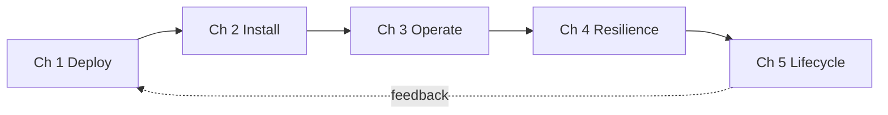
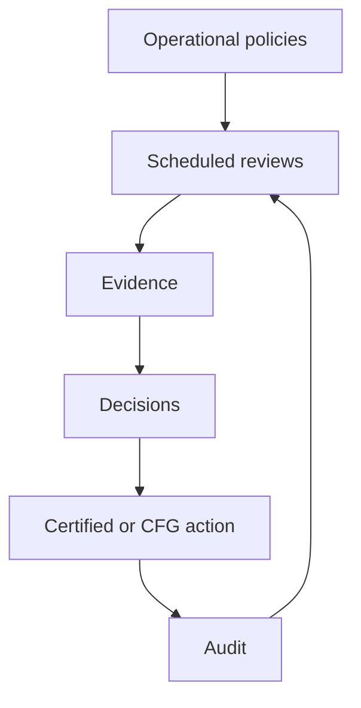
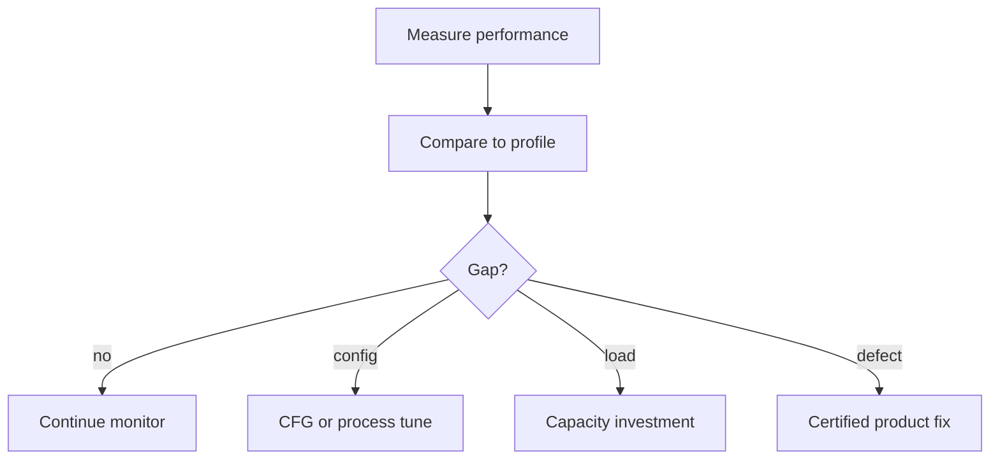
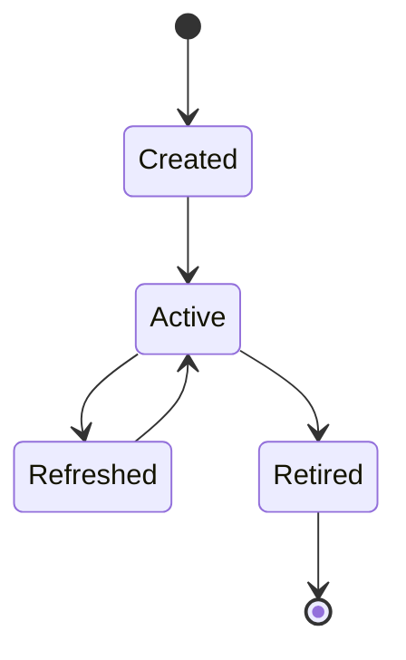

# Operational Governance, Capacity Planning & Lifecycle Management

| Field | Value |
|-------|-------|
| **Document ID** | FT-PD-094 |
| **Volume** | 9 — Deployment & Operations Architecture |
| **Chapter** | 5 — Operational Governance, Capacity Planning & Lifecycle Management |
| **Title** | Operational Governance, Capacity Planning & Lifecycle Management |
| **Version** | 1.0.0 |
| **Status** | Draft — Architecture Review |
| **Effective date** | 2026-05-29 |
| **Author** | FT ERP Product Team |
| **Owner** | FT ERP Product Architecture |
| **Audience** | Operations directors, product owners, capacity planners, implementation partners, customer executives |
| **Classification** | Product — Operations Governance Architecture |

**Parent documents:**

- [Chapter 1 — Deployment & Release Architecture](./Chapter_01_Deployment_and_Release_Architecture.md)
- [Chapter 2 — Installation, Upgrade & Migration Architecture](./Chapter_02_Installation_Upgrade_and_Migration_Architecture.md)
- [Chapter 3 — Operational Monitoring, Support & Maintenance Architecture](./Chapter_03_Operational_Monitoring_Support_and_Maintenance_Architecture.md)
- [Chapter 4 — Backup, Recovery, Business Continuity & Disaster Recovery Architecture](./Chapter_04_Backup_Recovery_Business_Continuity_and_Disaster_Recovery_Architecture.md)
- [Volume 8 — Product Testing & Validation](../08_Product_Testing_and_Validation/README.md)
- [Volume 1, Ch. 2 — Constitution, Art. 23](../01_Product_Foundation/Chapter_02_FT_ERP_Constitution.md)

---

## 1. Document Control

| Version | Date | Author | Summary |
|---------|------|--------|---------|
| 1.0.0 | 2026-05-29 | FT ERP Product Team | Initial Operational Governance, Capacity Planning & Lifecycle Management |

**Supersedes:** None.

**Change authority:** Product Architecture + Operations Governance Board. Lifecycle policy changes require Constitution and Volume 8 alignment.

**Out of scope:** Hardware sizing, infrastructure tuning, vendor recommendations, monitoring software, database optimization scripts, source code.

---

## 2. Purpose

This chapter defines **governance architecture** ensuring FT ERP remains **sustainable, scalable, and operationally healthy** throughout its production lifecycle.

It specifies:

- **Operational governance** and **capacity planning**
- **Performance governance**
- **Environment lifecycle** management
- **Continuous improvement** and **product lifecycle** stewardship

The objective is to ensure every FT ERP deployment continues to operate effectively while **preserving architectural integrity** and **certified behavior**.

---

## 3. Scope

### 3.1 In scope

- Operational governance philosophy (§5)
- Capacity and performance governance (§6–7)
- Environment lifecycle (§8)
- Continuous improvement (§9)
- Product lifecycle governance (§10)
- Governance matrices (§12, §12A–F)
- Business Rules and diagrams (§11, §13)

### 3.2 Out of scope

- CPU/RAM/storage sizing formulas
- Product roadmap feature prioritization detail (Volume 10 planned)
- Manufacturing domain knowledge (Volume 10 Manufacturing Knowledge)

### 3.3 Concept distinctions

| Concept | Definition |
|---------|------------|
| **Operations** | Day-to-day running of certified FT ERP |
| **Governance** | Policy, review, and approval over operations |
| **Capacity planning** | Anticipating growth — users, plants, data |
| **Performance management** | Observing and improving responsiveness — no fixed targets here |
| **Lifecycle management** | Environment and release stages from pilot to end-of-support |
| **Product evolution** | New certified capabilities via release — not ad-hoc production change |

---

## 4. Relationship with Previous Volumes

| Volume / Chapter | Relationship |
|------------------|--------------|
| **Vol. 8** | Certification, PBL, continuous compliance ([EVD-06](../08_Product_Testing_and_Validation/Chapter_05_Validation_Evidence_Audit_Trails_and_Continuous_Compliance.md)) |
| **FT-PD-090** | Release types, environments, DEP-* |
| **FT-PD-091** | Onboarding, adoption strategies §12E |
| **FT-PD-092** | KPIs, continuous improvement OPS-12 |
| **FT-PD-093** | Resilience, RES-* |
| **Art. 23** | Continuous product evolution — Constitution compliance |

### 4.1 Long-term operations stack

Operational governance **extends** deployment → monitoring → resilience into **sustainable stewardship**:

---

## 5. Operational Governance Philosophy

| Principle | Definition |
|-----------|------------|
| **Architecture preservation** | Growth and change never weaken PBL ([PBL-07](../08_Product_Testing_and_Validation/Chapter_02_Workflow_Regression_Guardrails_and_Protected_Behavior_Catalog.md)) |
| **Continuous operational improvement** | Reviews drive certified or CFG changes — not shortcuts |
| **Predictable growth** | Capacity reviewed before constraints become incidents |
| **Capacity awareness** | Monitor trends — users, transactions, plants, history |
| **Sustainable operations** | Staffing, training, Partner support planned |
| **Evidence-driven governance** | Reviews require artifacts ([LCM-05](#11-business-rules)) |
| **Controlled evolution** | Product changes via certified releases ([OPS-02](./Chapter_03_Operational_Monitoring_Support_and_Maintenance_Architecture.md)) |

---

## 6. Capacity Planning Architecture

Governance for growth dimensions — **implementation-neutral**:

| Growth area | Planning focus |
|-------------|----------------|
| **User growth** | Role count, concurrent sessions, training pipeline |
| **Transaction growth** | Document volume, workflow events, ledger movements |
| **Master data growth** | Items, BOMs, partners, locations |
| **Manufacturing expansion** | Work centers, production lines, WO volume |
| **Multi-plant expansion** | Company/plant scope, org assignment ([Vol. 7 Ch. 2](../07_Security_and_Governance_Architecture/Chapter_02_Identity_User_Organization_and_Delegation_Architecture.md)) |
| **Historical data growth** | Retention, archive tiers ([Vol. 7 Ch. 3](../07_Security_and_Governance_Architecture/Chapter_03_Audit_Compliance_and_Data_Retention_Governance.md)) |
| **Operational scalability** | Integration volume, reporting load, Control Tower breadth |

**Rule:** **Capacity expansion shall not weaken governance** — security, audit, certification path unchanged ([LCM-02](#11-business-rules)).

---

## 7. Performance Governance

| Area | Review objective |
|------|------------------|
| **Business performance** | Pending Action age, planning cycle time — factory KPIs |
| **Workflow performance** | Guard failure rates, transition latency trends |
| **Operational efficiency** | Role throughput, rework rates |
| **User experience** | Workspace task completion — qualitative surveys |
| **Reporting responsiveness** | Report generation acceptability — tenant-defined |
| **Integration performance** | Handoff duration, retry rates |
| **Capacity reviews** | Trend vs agreed profile — architecture-neutral thresholds |

Performance issues resolved via **certified fix**, **CFG tuning**, or **capacity investment** — never by bypassing guards.

---

## 8. Environment Lifecycle Management

| Environment | Lifecycle governance |
|-------------|------------------------|
| **Creation** | Purpose documented; no production data without policy |
| **Retirement** | Data disposition; audit of decommission |
| **Refresh** | Anonymized or synthetic for non-production |
| **Test** | Supports validation — not long-lived production mirror |
| **Pilot** | Time-bound; promotes or retires per FT-PD-091 |
| **Production** | Certified build only; change via DEP/INS |

**Distinction:** **Operational environments** are customer tenant instances. **Product environments** (validation, certification) belong to product/Partner governance — not customer ad-hoc clones without policy ([DEP-07](./Chapter_01_Deployment_and_Release_Architecture.md)).

---

## 9. Continuous Improvement

| Activity | Governance |
|----------|------------|
| **Operational reviews** | Monthly/quarterly — KPIs, incidents, capacity ([FT-PD-092 §10](./Chapter_03_Operational_Monitoring_Support_and_Maintenance_Architecture.md)) |
| **Lessons learned** | From incidents, DR exercises, pilot ([RES-07](./Chapter_04_Backup_Recovery_Business_Continuity_and_Disaster_Recovery_Architecture.md)) |
| **Product feedback** | Classified: defect, enhancement, architecture — routed to Product |
| **Enhancement requests** | Constitution and roadmap alignment — not core forks ([Art. 16](../01_Product_Foundation/Chapter_02_FT_ERP_Constitution.md)) |
| **Architecture review** | Triggered by multi-plant, integration expansion, major upgrade |
| **Release planning** | Certified path per Vol. 8–9 |
| **Governance improvement** | Update CFG, ops policy — audited |

---

## 10. Product Lifecycle Governance

| Element | Governance |
|---------|------------|
| **Version lifecycle** | Major.minor.patch semantic alignment with certification |
| **Supported releases** | Product declares supported versions — customer on supported cert |
| **End-of-support** | Notice period; upgrade path to supported cert required |
| **Deprecation policy** | Features flagged; CFG retirement; PBL unchanged until release |
| **Long-term maintenance** | Patch cert path for supported versions |
| **Product roadmap alignment** | Art. 23 evolution within Constitution |

**Rule:** **Supported releases remain identifiable** — build identity traceable ([LCM-04](#11-business-rules), [EVD-03](../08_Product_Testing_and_Validation/Chapter_05_Validation_Evidence_Audit_Trails_and_Continuous_Compliance.md)).

---

## 11. Business Rules

| ID | Rule |
|----|------|
| **LCM-01** | **Operational growth shall preserve protected behaviors** — PBL enforced at all maturity levels. |
| **LCM-02** | **Capacity expansion shall not weaken governance** — SEC, GOV, audit unchanged. |
| **LCM-03** | **Product evolution remains Constitution-compliant** — Art. 1–23. |
| **LCM-04** | **Supported releases remain identifiable** — cert and build records maintained. |
| **LCM-05** | **Operational reviews require evidence** — KPIs, incidents, capacity trends. |
| **LCM-06** | **Product lifecycle remains fully traceable** — version lineage per EVD. |
| **LCM-07** | **End-of-support versions must not receive production deployments** without exception register. |
| **LCM-08** | **Environment retirement is auditable** — data disposition recorded. |
| **LCM-09** | **Multi-plant expansion follows org scope model** — Vol. 7 Ch. 2. |
| **LCM-10** | **Performance remediation never bypasses workflow Guards** ([OPS-01](./Chapter_03_Operational_Monitoring_Support_and_Maintenance_Architecture.md)). |
| **LCM-11** | **Enhancement requests classified before implementation** — defect vs roadmap vs config. |
| **LCM-12** | **Continuous compliance reviews feed lifecycle planning** ([EVD-06](../08_Product_Testing_and_Validation/Chapter_05_Validation_Evidence_Audit_Trails_and_Continuous_Compliance.md)). |

---

## 12. Governance Matrices

### 12A. Capacity Planning Matrix

| Growth Area | Monitoring | Review | Owner |
|-------------|------------|--------|-------|
| **Users** | Role/session trends | Quarterly | Administrator |
| **Transactions** | Document/event volume | Quarterly | Operations manager |
| **Master data** | Item/BOM/partner counts | Semi-annual | Data steward |
| **Manufacturing** | WO/PE volume | Quarterly | Production lead |
| **Multi-plant** | Plant count, scope | Per expansion | Business owner |
| **Historical data** | Archive tier usage | Annual | Compliance |
| **Integrations** | Handoff volume | Quarterly | Integration delegate |

### 12B. Performance Governance Matrix

| Performance Area | Review Objective | Evidence | Owner |
|------------------|------------------|----------|-------|
| **Business KPIs** | PA age, cycle times | Control Tower export | Management |
| **Workflow** | Guard failure trend | Audit sample | Workflow delegate |
| **Operational efficiency** | Rework, returns | Domain reports | Process owners |
| **User experience** | Task completion satisfaction | Feedback summary | Business owner |
| **Reporting** | Acceptable responsiveness | User survey | Administrator |
| **Integration** | Retry/dead-letter trend | Integration audit | Integration delegate |
| **Capacity** | Trend vs profile | Capacity review record | Operations manager |

### 12C. Environment Lifecycle Matrix

| Environment | Lifecycle Stage | Governance | Approval |
|-------------|-----------------|------------|----------|
| **Development** | Create → active → retire | No production data | Partner lead |
| **Testing** | Create → validate → refresh | Canonical/synthetic data | QA lead |
| **Validation** | Cert candidate | Full Vol. 8 evidence | Validation Lead |
| **Pilot** | Active → promote or retire | Real limited data | Pilot Sponsor |
| **Production** | Active → upgrade → supersede | Certified build only | Business owner |

### 12D. Product Lifecycle Matrix

| Lifecycle Stage | Governance | Review | Approval |
|-----------------|------------|--------|----------|
| **Active supported** | Patch/minor upgrades | Release notes | Product Owner |
| **Maintenance mode** | Security patches only | Compliance review | Product Architecture |
| **Deprecation announced** | Feature flags off path | Customer comms | Product Owner |
| **End-of-support** | No new production deploy | Migration plan | Customer executive |
| **Retired** | Historical evidence only | Archive | Compliance |

### 12E. Continuous Improvement Matrix

| Improvement Source | Evaluation | Approval | Release Path |
|--------------------|------------|----------|--------------|
| **Incident RCA** | Root cause class | Ops manager | Certified fix or CFG |
| **Operational review** | KPI gap | Business owner | Process or config |
| **Product defect** | PBL impact | Product Architecture | Patch cert |
| **Enhancement request** | Constitution fit | Product Owner | Minor/major release |
| **Architecture review** | Volume impact | Architecture board | Major release + docs |
| **Compliance finding** | GOV/SEC rule | Compliance Officer | CFG or cert |

### 12F. Operational Maturity Matrix

| Operational Maturity Level | Characteristics | Governance Focus | Expected Outcome |
|----------------------------|-----------------|------------------|------------------|
| **Initial Pilot** | Single plant; hypercare | INS cutover; training; J-01 validation | Stable pilot operations |
| **Early Production** | First production site; limited history | OPS monitoring; backup verify; KPI baseline | Predictable daily ops |
| **Stable Operations** | Full domain adoption; DR tested | Quarterly reviews; PBL spot; compliance | Certified steady state |
| **Multi-Site Operations** | Multiple plants/companies | Org scope; capacity; wave governance | Consistent cross-site behavior |
| **Enterprise Scale** | High volume; integrations; archive tiers | LCM capacity; DR/BCP; continuous compliance | Sustainable enterprise stewardship |

---

## 13. Logical Diagrams

### 13.1 Operational governance model

### 13.2 Capacity evolution

### 13.3 Performance governance

### 13.4 Environment lifecycle

### 13.5 Continuous improvement cycle

### 13.6 Product lifecycle

---

## 14. Review Checklist

- [ ] Governance completeness — §5, §12 matrices
- [ ] Capacity planning — §6, §12A
- [ ] Lifecycle coverage — §8, §10, §12C, §12D
- [ ] Continuous improvement — §9, §12E
- [ ] Maturity model — §12F
- [ ] Constitution alignment — LCM-03, Art. 16, 23
- [ ] Certification alignment — LCM-04, Vol. 8
- [ ] Six Mermaid diagrams
- [ ] No hardware sizing or tuning scripts

---

## 15. Change Log

| Version | Date | Author | Summary |
|---------|------|--------|---------|
| 1.0.0 | 2026-05-29 | FT ERP Product Team | Initial Operational Governance, Capacity Planning & Lifecycle Management |

---

## 16. Approval Block

| Role | Name | Signature | Date |
|------|------|-----------|------|
| Product Owner | | | |
| Product Architecture | | | |
| Operations Governance Lead | | | |
| Implementation Partner Liaison | | | |
| Customer Executive Sponsor | | | |

---

## Writing Requirements

Remain **technology-neutral**.

**Do not include:** Hardware sizing, infrastructure tuning, vendor recommendations, monitoring software, database optimization scripts, source code.

**Describe governance architecture only.**

---

*Volume 9 complete — Chapters 1–5. Recommended next: Volume 10, Chapter 1 — Product Lifecycle, Roadmap & Continuous Evolution (FT-PD-100).*
---

## Document navigation

| | Link |
|--|------|
| **Previous** | [Backup, Recovery, Business Continuity & Disaster Recovery Architecture](./Chapter_04_Backup_Recovery_Business_Continuity_and_Disaster_Recovery_Architecture.md) (FT-PD-093) |
| **Next** | [Product Lifecycle, Roadmap & Continuous Evolution](../10_Product_Lifecycle_and_Continuous_Evolution/Chapter_01_Product_Lifecycle_Roadmap_and_Continuous_Evolution.md) (FT-PD-100) |
| **Volume** | [Deployment and Operations Architecture](./README.md) |
| **Product** | [Product Documentation Index](../README.md) |

